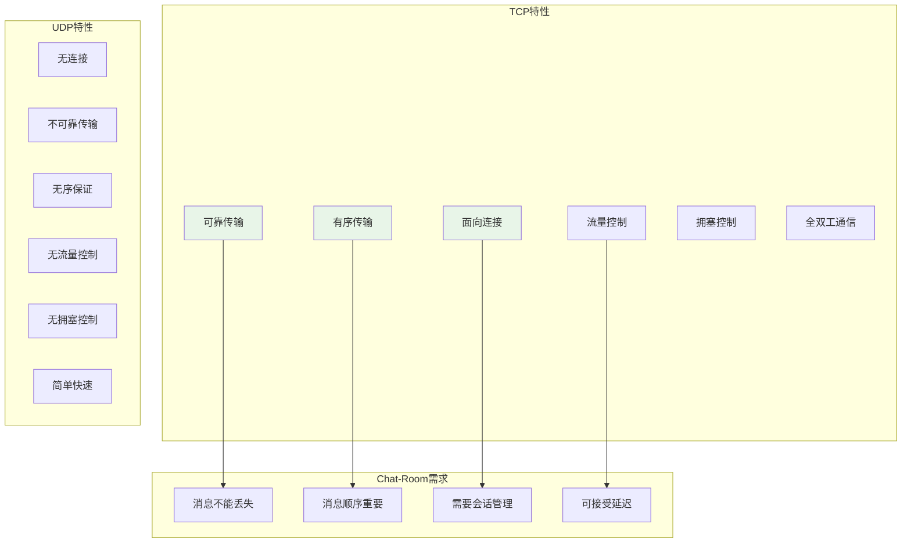
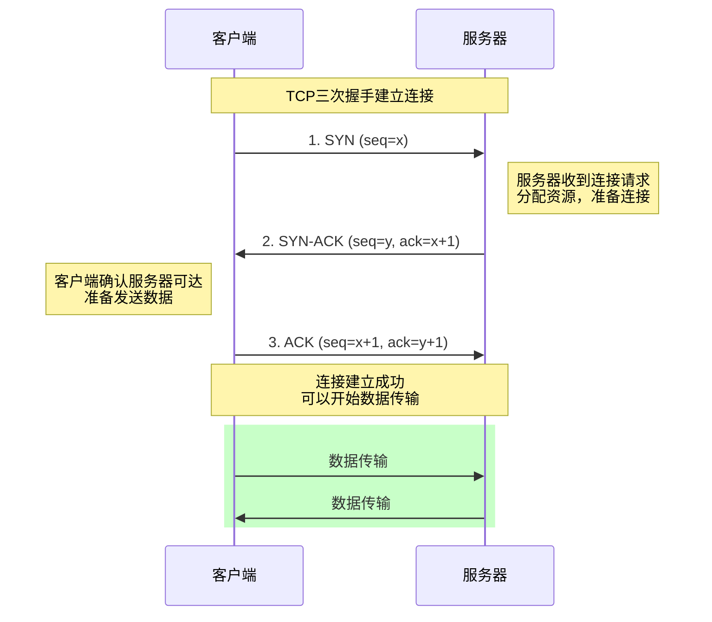
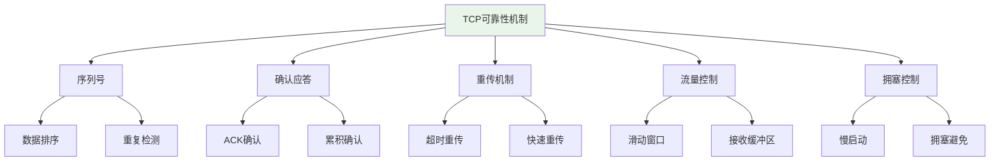
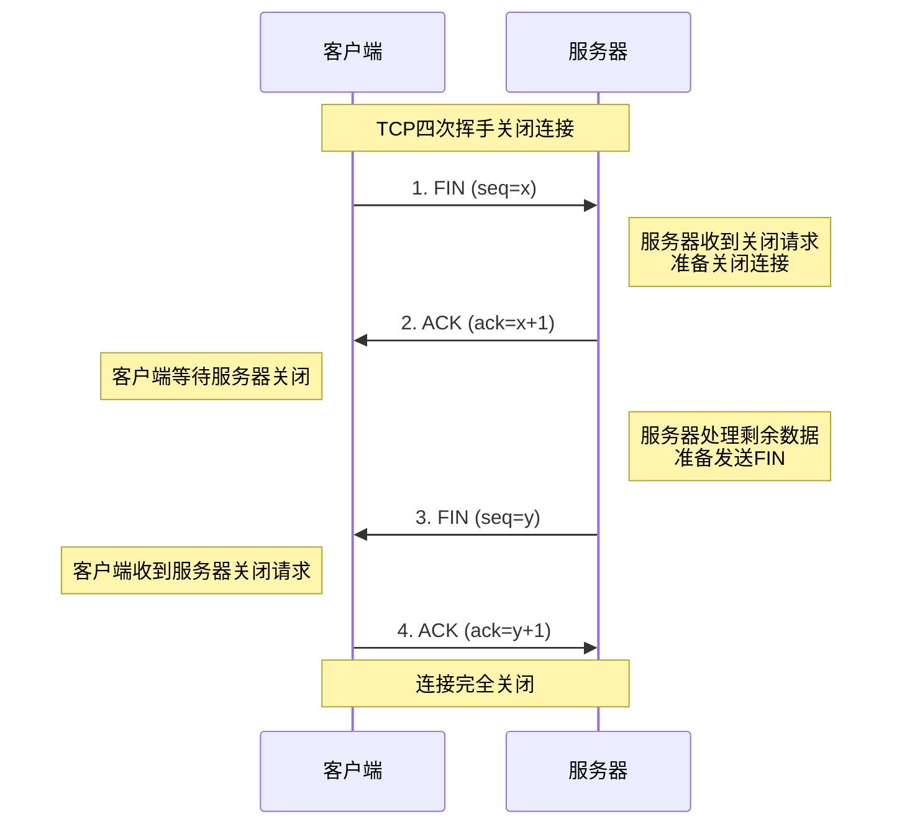

# TCP协议基础详解

## 🎯 学习目标

通过本章学习，您将能够：
- 深入理解TCP协议的工作原理
- 掌握TCP连接的建立、维护和关闭过程
- 理解TCP的可靠性保证机制
- 在Chat-Room项目中应用TCP编程技巧

## 🔗 TCP协议核心特性

### TCP vs UDP 深度对比



**为什么Chat-Room选择TCP？**
```python
# 聊天应用的需求分析
chat_requirements = {
    "消息完整性": "用户发送的每条消息都必须准确送达",
    "消息顺序": "消息必须按发送顺序显示，避免对话混乱",
    "连接状态": "需要知道用户是否在线，维持会话状态",
    "错误恢复": "网络问题时能够自动重传丢失的数据",
    "流量控制": "防止快速发送方压垮慢速接收方"
}

# TCP如何满足这些需求
tcp_solutions = {
    "消息完整性": "确认机制(ACK) + 重传机制",
    "消息顺序": "序列号(Sequence Number)排序",
    "连接状态": "三次握手建立连接 + 心跳检测",
    "错误恢复": "超时重传 + 快速重传",
    "流量控制": "滑动窗口机制"
}
```

## 🤝 TCP连接建立（三次握手）

### 三次握手详细过程



### Chat-Room中的连接建立
```python
# client/core/client.py - 客户端连接实现
import socket
import time
from typing import Optional

class ChatClient:
    """
    Chat-Room客户端
    
    TCP连接管理和错误处理
    """
    
    def __init__(self, host: str = "localhost", port: int = 8888):
        self.host = host
        self.port = port
        self.socket: Optional[socket.socket] = None
        self.connected = False
        self.connection_attempts = 0
        self.max_attempts = 3
    
    def connect_with_retry(self) -> bool:
        """
        带重试机制的连接建立
        
        TCP连接可能因为各种原因失败：
        1. 服务器未启动
        2. 网络不可达
        3. 端口被占用
        4. 防火墙阻拦
        """
        for attempt in range(self.max_attempts):
            self.connection_attempts = attempt + 1
            
            try:
                print(f"尝试连接服务器 {self.host}:{self.port} (第{attempt + 1}次)")
                
                # 创建TCP Socket
                self.socket = socket.socket(socket.AF_INET, socket.SOCK_STREAM)
                
                # 设置连接超时（避免无限等待）
                self.socket.settimeout(10.0)
                
                # 启用地址重用（避免TIME_WAIT状态影响）
                self.socket.setsockopt(socket.SOL_SOCKET, socket.SO_REUSEADDR, 1)
                
                # 发起连接（触发三次握手）
                start_time = time.time()
                self.socket.connect((self.host, self.port))
                connect_time = time.time() - start_time
                
                # 连接成功
                self.connected = True
                print(f"连接成功！耗时: {connect_time:.3f}秒")
                
                # 获取连接信息
                local_addr = self.socket.getsockname()
                remote_addr = self.socket.getpeername()
                print(f"本地地址: {local_addr}, 服务器地址: {remote_addr}")
                
                return True
                
            except socket.timeout:
                print(f"连接超时 (第{attempt + 1}次)")
                self._cleanup_socket()
                
            except ConnectionRefusedError:
                print(f"连接被拒绝，服务器可能未启动 (第{attempt + 1}次)")
                self._cleanup_socket()
                
            except socket.gaierror as e:
                print(f"域名解析失败: {e}")
                self._cleanup_socket()
                break  # 域名解析失败不需要重试
                
            except OSError as e:
                print(f"网络错误: {e} (第{attempt + 1}次)")
                self._cleanup_socket()
            
            # 重试前等待
            if attempt < self.max_attempts - 1:
                wait_time = 2 ** attempt  # 指数退避
                print(f"等待 {wait_time} 秒后重试...")
                time.sleep(wait_time)
        
        print("所有连接尝试都失败了")
        return False
    
    def _cleanup_socket(self):
        """清理Socket资源"""
        if self.socket:
            try:
                self.socket.close()
            except:
                pass
            self.socket = None
        self.connected = False
    
    def get_connection_info(self) -> dict:
        """获取连接详细信息"""
        if not self.connected or not self.socket:
            return {}
        
        try:
            # 获取Socket选项
            recv_buffer = self.socket.getsockopt(socket.SOL_SOCKET, socket.SO_RCVBUF)
            send_buffer = self.socket.getsockopt(socket.SOL_SOCKET, socket.SO_SNDBUF)
            
            return {
                'local_address': self.socket.getsockname(),
                'remote_address': self.socket.getpeername(),
                'receive_buffer_size': recv_buffer,
                'send_buffer_size': send_buffer,
                'connection_attempts': self.connection_attempts,
                'socket_family': self.socket.family.name,
                'socket_type': self.socket.type.name
            }
        except Exception as e:
            return {'error': str(e)}
```

### 服务器端连接处理
```python
# server/core/server.py - 服务器端连接管理
import socket
import threading
from typing import Dict, Set

class ChatRoomServer:
    """
    Chat-Room服务器
    
    处理多个客户端的TCP连接
    """
    
    def __init__(self, host: str = "localhost", port: int = 8888):
        self.host = host
        self.port = port
        self.server_socket: Optional[socket.socket] = None
        self.client_sockets: Set[socket.socket] = set()
        self.client_threads: Dict[socket.socket, threading.Thread] = {}
        self.running = False
        self.max_connections = 100
    
    def start_server(self) -> bool:
        """
        启动服务器
        
        TCP服务器启动流程：
        1. 创建Socket
        2. 绑定地址和端口
        3. 开始监听
        4. 接受连接
        """
        try:
            # 创建TCP Socket
            self.server_socket = socket.socket(socket.AF_INET, socket.SOCK_STREAM)
            
            # 设置Socket选项
            self.server_socket.setsockopt(socket.SOL_SOCKET, socket.SO_REUSEADDR, 1)
            
            # 绑定地址和端口
            self.server_socket.bind((self.host, self.port))
            
            # 开始监听（设置连接队列长度）
            self.server_socket.listen(self.max_connections)
            
            self.running = True
            print(f"服务器启动成功，监听 {self.host}:{self.port}")
            print(f"最大连接数: {self.max_connections}")
            
            # 主循环：接受客户端连接
            self._accept_connections()
            
            return True
            
        except OSError as e:
            print(f"服务器启动失败: {e}")
            return False
    
    def _accept_connections(self):
        """
        接受客户端连接的主循环
        
        每个新连接都会创建一个独立的线程处理
        """
        while self.running:
            try:
                # 接受新连接（阻塞调用）
                client_socket, client_address = self.server_socket.accept()
                
                print(f"新客户端连接: {client_address}")
                
                # 检查连接数限制
                if len(self.client_sockets) >= self.max_connections:
                    print(f"连接数已达上限，拒绝连接: {client_address}")
                    client_socket.close()
                    continue
                
                # 配置客户端Socket
                self._configure_client_socket(client_socket)
                
                # 添加到连接集合
                self.client_sockets.add(client_socket)
                
                # 创建处理线程
                client_thread = threading.Thread(
                    target=self._handle_client,
                    args=(client_socket, client_address),
                    daemon=True
                )
                
                self.client_threads[client_socket] = client_thread
                client_thread.start()
                
                print(f"当前连接数: {len(self.client_sockets)}")
                
            except OSError:
                if self.running:
                    print("接受连接时发生错误")
                break
    
    def _configure_client_socket(self, client_socket: socket.socket):
        """
        配置客户端Socket参数
        
        优化TCP连接性能
        """
        # 设置接收超时
        client_socket.settimeout(300.0)  # 5分钟超时
        
        # 启用TCP_NODELAY（禁用Nagle算法，减少延迟）
        client_socket.setsockopt(socket.IPPROTO_TCP, socket.TCP_NODELAY, 1)
        
        # 设置Keep-Alive（检测死连接）
        client_socket.setsockopt(socket.SOL_SOCKET, socket.SO_KEEPALIVE, 1)
        
        # Linux系统的Keep-Alive参数
        try:
            # Keep-Alive空闲时间（秒）
            client_socket.setsockopt(socket.IPPROTO_TCP, socket.TCP_KEEPIDLE, 60)
            # Keep-Alive探测间隔（秒）
            client_socket.setsockopt(socket.IPPROTO_TCP, socket.TCP_KEEPINTVL, 10)
            # Keep-Alive探测次数
            client_socket.setsockopt(socket.IPPROTO_TCP, socket.TCP_KEEPCNT, 3)
        except AttributeError:
            # Windows系统不支持这些选项
            pass
    
    def _handle_client(self, client_socket: socket.socket, client_address):
        """
        处理单个客户端连接
        
        每个客户端在独立线程中运行
        """
        try:
            print(f"开始处理客户端: {client_address}")
            
            while self.running:
                # 接收数据
                data = client_socket.recv(4096)
                
                if not data:
                    # 客户端正常关闭连接
                    print(f"客户端 {client_address} 断开连接")
                    break
                
                # 处理接收到的数据
                self._process_client_data(client_socket, data, client_address)
                
        except socket.timeout:
            print(f"客户端 {client_address} 连接超时")
        except ConnectionResetError:
            print(f"客户端 {client_address} 连接被重置")
        except Exception as e:
            print(f"处理客户端 {client_address} 时发生错误: {e}")
        finally:
            # 清理连接
            self._cleanup_client(client_socket)
    
    def _cleanup_client(self, client_socket: socket.socket):
        """清理客户端连接"""
        try:
            client_socket.close()
        except:
            pass
        
        # 从集合中移除
        self.client_sockets.discard(client_socket)
        
        # 清理线程引用
        if client_socket in self.client_threads:
            del self.client_threads[client_socket]
        
        print(f"客户端连接已清理，当前连接数: {len(self.client_sockets)}")
```

## 📡 TCP数据传输机制

### 可靠性保证机制



### Chat-Room中的数据传输
```python
# shared/network/tcp_handler.py - TCP数据处理
import struct
import json
from typing import Optional, Tuple

class TCPMessageHandler:
    """
    TCP消息处理器
    
    解决TCP流式传输的消息边界问题
    """
    
    def __init__(self):
        self.receive_buffer = b""
        self.message_header_size = 4  # 4字节消息长度头
    
    def pack_message(self, message_dict: dict) -> bytes:
        """
        打包消息
        
        消息格式：[4字节长度][JSON数据]
        这样可以明确消息边界
        """
        # 序列化消息
        message_json = json.dumps(message_dict, ensure_ascii=False)
        message_bytes = message_json.encode('utf-8')
        
        # 计算消息长度
        message_length = len(message_bytes)
        
        # 打包：长度头 + 消息体
        packed_message = struct.pack('!I', message_length) + message_bytes
        
        return packed_message
    
    def send_message(self, socket_conn: socket.socket, message_dict: dict) -> bool:
        """
        发送完整消息
        
        确保消息完整发送（处理部分发送问题）
        """
        try:
            packed_message = self.pack_message(message_dict)
            total_sent = 0
            message_length = len(packed_message)
            
            # 循环发送，确保所有数据都发送完毕
            while total_sent < message_length:
                sent = socket_conn.send(packed_message[total_sent:])
                if sent == 0:
                    # Socket连接已断开
                    return False
                total_sent += sent
            
            return True
            
        except Exception as e:
            print(f"发送消息失败: {e}")
            return False
    
    def receive_messages(self, socket_conn: socket.socket) -> list:
        """
        接收完整消息
        
        处理TCP流式传输，提取完整消息
        """
        messages = []
        
        try:
            # 接收数据
            data = socket_conn.recv(4096)
            if not data:
                return messages
            
            # 添加到接收缓冲区
            self.receive_buffer += data
            
            # 提取完整消息
            while len(self.receive_buffer) >= self.message_header_size:
                # 读取消息长度
                message_length = struct.unpack('!I', self.receive_buffer[:4])[0]
                
                # 检查是否有完整消息
                total_message_size = self.message_header_size + message_length
                if len(self.receive_buffer) < total_message_size:
                    break  # 消息不完整，等待更多数据
                
                # 提取消息体
                message_bytes = self.receive_buffer[4:total_message_size]
                
                # 解析消息
                try:
                    message_json = message_bytes.decode('utf-8')
                    message_dict = json.loads(message_json)
                    messages.append(message_dict)
                except (UnicodeDecodeError, json.JSONDecodeError) as e:
                    print(f"消息解析失败: {e}")
                
                # 从缓冲区移除已处理的消息
                self.receive_buffer = self.receive_buffer[total_message_size:]
            
        except Exception as e:
            print(f"接收消息失败: {e}")
        
        return messages
```

## 🔚 TCP连接关闭（四次挥手）

### 四次挥手过程



### 优雅关闭连接
```python
# shared/network/connection.py - 连接管理
class ConnectionManager:
    """
    连接管理器
    
    处理TCP连接的优雅关闭
    """
    
    def graceful_shutdown(self, socket_conn: socket.socket, timeout: float = 5.0):
        """
        优雅关闭连接
        
        步骤：
        1. 关闭发送方向（shutdown SHUT_WR）
        2. 等待对方关闭
        3. 关闭Socket
        """
        try:
            # 1. 关闭发送方向
            socket_conn.shutdown(socket.SHUT_WR)
            print("已关闭发送方向，等待对方关闭...")
            
            # 2. 设置接收超时
            socket_conn.settimeout(timeout)
            
            # 3. 读取剩余数据直到对方关闭
            while True:
                data = socket_conn.recv(1024)
                if not data:
                    print("对方已关闭连接")
                    break
                print(f"收到剩余数据: {len(data)} 字节")
            
        except socket.timeout:
            print("等待对方关闭超时")
        except Exception as e:
            print(f"关闭连接时发生错误: {e}")
        finally:
            # 4. 最终关闭Socket
            try:
                socket_conn.close()
                print("连接已完全关闭")
            except:
                pass
    
    def force_close(self, socket_conn: socket.socket):
        """
        强制关闭连接
        
        用于异常情况下的快速关闭
        """
        try:
            # 设置SO_LINGER选项，立即关闭
            socket_conn.setsockopt(socket.SOL_SOCKET, socket.SO_LINGER, 
                                 struct.pack('ii', 1, 0))
            socket_conn.close()
            print("连接已强制关闭")
        except Exception as e:
            print(f"强制关闭连接失败: {e}")
```

## 🎯 实践练习

### 练习1：TCP连接监控
```python
class TCPConnectionMonitor:
    """
    TCP连接监控器
    
    要求：
    1. 监控连接状态
    2. 统计连接信息
    3. 检测异常连接
    4. 提供连接报告
    """
    
    def __init__(self):
        # TODO: 实现监控器初始化
        pass
    
    def monitor_connection(self, socket_conn: socket.socket):
        """监控单个连接"""
        # TODO: 实现连接监控逻辑
        pass
    
    def get_connection_stats(self) -> dict:
        """获取连接统计信息"""
        # TODO: 实现统计信息收集
        pass
```

### 练习2：TCP性能优化
```python
class TCPOptimizer:
    """
    TCP性能优化器
    
    要求：
    1. 优化Socket参数
    2. 实现连接池
    3. 批量数据传输
    4. 性能测试工具
    """
    
    def optimize_socket(self, socket_conn: socket.socket):
        """优化Socket参数"""
        # TODO: 实现Socket优化
        pass
    
    def batch_send(self, socket_conn: socket.socket, messages: list):
        """批量发送消息"""
        # TODO: 实现批量发送
        pass
```

## ✅ 学习检查

完成本章学习后，请确认您能够：

- [ ] 理解TCP协议的核心特性
- [ ] 掌握TCP连接的建立和关闭过程
- [ ] 处理TCP数据传输中的各种问题
- [ ] 实现可靠的消息传输机制
- [ ] 优化TCP连接性能
- [ ] 完成实践练习

## 📚 下一步

TCP基础掌握后，请继续学习：
- [Socket API详解](socket-api.md)
- [简单客户端-服务器实现](simple-client-server.md)

---

**现在您已经深入理解了TCP协议的工作原理！** 🎉
