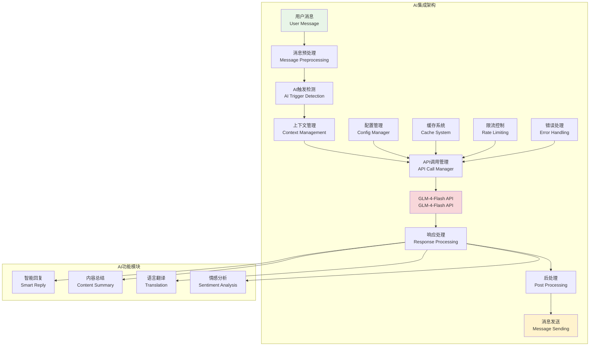
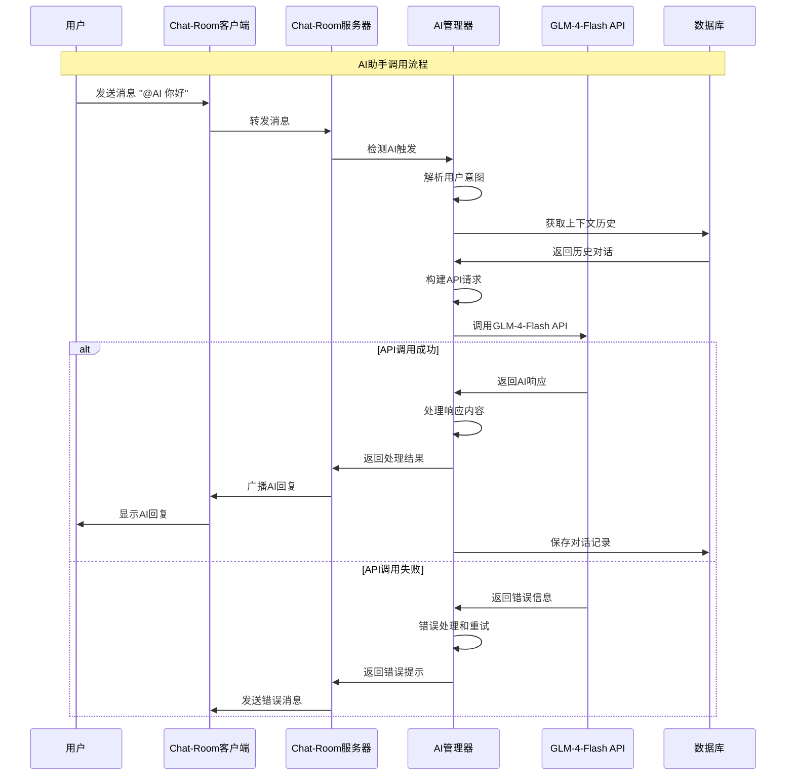

# API集成基础

## 🎯 学习目标

通过本章学习，您将能够：
- 理解AI API集成的基本原理和最佳实践
- 掌握GLM-4-Flash API的使用方法和特性
- 学会设计可靠的API调用和错误处理机制
- 在Chat-Room项目中实现智能AI助手功能

## 🤖 AI集成架构

### AI集成系统概览



### API调用流程



## 🔌 API集成实现

### GLM-4-Flash API客户端

```python
# server/ai/glm_client.py - GLM-4-Flash API客户端
import asyncio
import aiohttp
import json
import time
import hashlib
from typing import Dict, List, Optional, Any, AsyncGenerator
from dataclasses import dataclass, asdict
from enum import Enum
import logging

class MessageRole(Enum):
    """消息角色枚举"""
    SYSTEM = "system"
    USER = "user"
    ASSISTANT = "assistant"

@dataclass
class ChatMessage:
    """聊天消息"""
    role: MessageRole
    content: str
    timestamp: Optional[float] = None
    
    def __post_init__(self):
        if self.timestamp is None:
            self.timestamp = time.time()
    
    def to_dict(self) -> Dict[str, Any]:
        """转换为API格式"""
        return {
            "role": self.role.value,
            "content": self.content
        }

@dataclass
class GLMConfig:
    """GLM配置"""
    api_key: str
    base_url: str = "https://open.bigmodel.cn/api/paas/v4"
    model: str = "glm-4-flash"
    max_tokens: int = 1024
    temperature: float = 0.7
    top_p: float = 0.9
    timeout: int = 30
    max_retries: int = 3
    retry_delay: float = 1.0

@dataclass
class APIResponse:
    """API响应"""
    success: bool
    content: Optional[str] = None
    error_message: Optional[str] = None
    error_code: Optional[str] = None
    usage: Optional[Dict[str, int]] = None
    response_time: Optional[float] = None

class GLMClient:
    """
    GLM-4-Flash API客户端
    
    功能：
    1. 异步API调用
    2. 自动重试机制
    3. 限流控制
    4. 错误处理
    5. 响应缓存
    """
    
    def __init__(self, config: GLMConfig):
        self.config = config
        self.logger = logging.getLogger('GLMClient')
        
        # 限流控制
        self.rate_limiter = asyncio.Semaphore(5)  # 最多5个并发请求
        self.last_request_time = 0
        self.min_request_interval = 0.1  # 最小请求间隔100ms
        
        # 会话管理
        self.session: Optional[aiohttp.ClientSession] = None
        
        # 统计信息
        self.stats = {
            'total_requests': 0,
            'successful_requests': 0,
            'failed_requests': 0,
            'total_tokens_used': 0,
            'total_response_time': 0.0
        }
    
    async def __aenter__(self):
        """异步上下文管理器入口"""
        await self.start()
        return self
    
    async def __aexit__(self, exc_type, exc_val, exc_tb):
        """异步上下文管理器出口"""
        await self.close()
    
    async def start(self):
        """启动客户端"""
        if self.session is None:
            timeout = aiohttp.ClientTimeout(total=self.config.timeout)
            self.session = aiohttp.ClientSession(timeout=timeout)
    
    async def close(self):
        """关闭客户端"""
        if self.session:
            await self.session.close()
            self.session = None
    
    async def chat_completion(self, messages: List[ChatMessage], 
                            stream: bool = False) -> APIResponse:
        """
        聊天完成API调用
        
        Args:
            messages: 消息列表
            stream: 是否使用流式响应
            
        Returns:
            API响应结果
        """
        if not self.session:
            await self.start()
        
        # 限流控制
        async with self.rate_limiter:
            await self._wait_for_rate_limit()
            
            # 构建请求
            request_data = self._build_request(messages, stream)
            
            # 执行请求
            start_time = time.time()
            response = await self._make_request(request_data, stream)
            response.response_time = time.time() - start_time
            
            # 更新统计
            self._update_stats(response)
            
            return response
    
    async def simple_chat(self, user_message: str, 
                         system_prompt: str = None) -> APIResponse:
        """
        简单聊天接口
        
        Args:
            user_message: 用户消息
            system_prompt: 系统提示词
            
        Returns:
            API响应结果
        """
        messages = []
        
        # 添加系统提示词
        if system_prompt:
            messages.append(ChatMessage(MessageRole.SYSTEM, system_prompt))
        
        # 添加用户消息
        messages.append(ChatMessage(MessageRole.USER, user_message))
        
        return await self.chat_completion(messages)
    
    async def chat_with_context(self, user_message: str, 
                               conversation_history: List[ChatMessage],
                               system_prompt: str = None) -> APIResponse:
        """
        带上下文的聊天
        
        Args:
            user_message: 用户消息
            conversation_history: 对话历史
            system_prompt: 系统提示词
            
        Returns:
            API响应结果
        """
        messages = []
        
        # 添加系统提示词
        if system_prompt:
            messages.append(ChatMessage(MessageRole.SYSTEM, system_prompt))
        
        # 添加历史对话（限制长度）
        max_history = 10  # 最多保留10轮对话
        recent_history = conversation_history[-max_history:] if len(conversation_history) > max_history else conversation_history
        messages.extend(recent_history)
        
        # 添加当前用户消息
        messages.append(ChatMessage(MessageRole.USER, user_message))
        
        return await self.chat_completion(messages)
    
    def _build_request(self, messages: List[ChatMessage], stream: bool) -> Dict[str, Any]:
        """构建API请求"""
        return {
            "model": self.config.model,
            "messages": [msg.to_dict() for msg in messages],
            "max_tokens": self.config.max_tokens,
            "temperature": self.config.temperature,
            "top_p": self.config.top_p,
            "stream": stream
        }
    
    async def _make_request(self, request_data: Dict[str, Any], 
                          stream: bool) -> APIResponse:
        """执行API请求"""
        headers = {
            "Authorization": f"Bearer {self.config.api_key}",
            "Content-Type": "application/json"
        }
        
        url = f"{self.config.base_url}/chat/completions"
        
        for attempt in range(self.config.max_retries):
            try:
                async with self.session.post(url, json=request_data, headers=headers) as response:
                    if response.status == 200:
                        if stream:
                            return await self._handle_stream_response(response)
                        else:
                            return await self._handle_normal_response(response)
                    else:
                        error_text = await response.text()
                        self.logger.warning(f"API请求失败 (状态码: {response.status}): {error_text}")
                        
                        if attempt < self.config.max_retries - 1:
                            await asyncio.sleep(self.config.retry_delay * (2 ** attempt))
                            continue
                        
                        return APIResponse(
                            success=False,
                            error_message=f"HTTP {response.status}: {error_text}",
                            error_code=str(response.status)
                        )
            
            except asyncio.TimeoutError:
                self.logger.warning(f"API请求超时 (尝试 {attempt + 1}/{self.config.max_retries})")
                if attempt < self.config.max_retries - 1:
                    await asyncio.sleep(self.config.retry_delay * (2 ** attempt))
                    continue
                
                return APIResponse(
                    success=False,
                    error_message="请求超时",
                    error_code="TIMEOUT"
                )
            
            except Exception as e:
                self.logger.error(f"API请求异常 (尝试 {attempt + 1}/{self.config.max_retries}): {e}")
                if attempt < self.config.max_retries - 1:
                    await asyncio.sleep(self.config.retry_delay * (2 ** attempt))
                    continue
                
                return APIResponse(
                    success=False,
                    error_message=str(e),
                    error_code="REQUEST_ERROR"
                )
        
        return APIResponse(
            success=False,
            error_message="所有重试尝试都失败了",
            error_code="MAX_RETRIES_EXCEEDED"
        )
    
    async def _handle_normal_response(self, response: aiohttp.ClientResponse) -> APIResponse:
        """处理普通响应"""
        try:
            data = await response.json()
            
            if "choices" in data and len(data["choices"]) > 0:
                content = data["choices"][0]["message"]["content"]
                usage = data.get("usage", {})
                
                return APIResponse(
                    success=True,
                    content=content,
                    usage=usage
                )
            else:
                return APIResponse(
                    success=False,
                    error_message="响应格式错误：缺少choices字段",
                    error_code="INVALID_RESPONSE"
                )
        
        except json.JSONDecodeError as e:
            return APIResponse(
                success=False,
                error_message=f"JSON解析错误: {e}",
                error_code="JSON_DECODE_ERROR"
            )
    
    async def _handle_stream_response(self, response: aiohttp.ClientResponse) -> APIResponse:
        """处理流式响应"""
        content_parts = []
        
        try:
            async for line in response.content:
                line = line.decode('utf-8').strip()
                
                if line.startswith('data: '):
                    data_str = line[6:]  # 移除 'data: ' 前缀
                    
                    if data_str == '[DONE]':
                        break
                    
                    try:
                        data = json.loads(data_str)
                        if "choices" in data and len(data["choices"]) > 0:
                            delta = data["choices"][0].get("delta", {})
                            if "content" in delta:
                                content_parts.append(delta["content"])
                    except json.JSONDecodeError:
                        continue
            
            full_content = ''.join(content_parts)
            
            return APIResponse(
                success=True,
                content=full_content
            )
        
        except Exception as e:
            return APIResponse(
                success=False,
                error_message=f"流式响应处理错误: {e}",
                error_code="STREAM_ERROR"
            )
    
    async def _wait_for_rate_limit(self):
        """等待限流"""
        current_time = time.time()
        time_since_last = current_time - self.last_request_time
        
        if time_since_last < self.min_request_interval:
            await asyncio.sleep(self.min_request_interval - time_since_last)
        
        self.last_request_time = time.time()
    
    def _update_stats(self, response: APIResponse):
        """更新统计信息"""
        self.stats['total_requests'] += 1
        
        if response.success:
            self.stats['successful_requests'] += 1
            if response.usage:
                self.stats['total_tokens_used'] += response.usage.get('total_tokens', 0)
        else:
            self.stats['failed_requests'] += 1
        
        if response.response_time:
            self.stats['total_response_time'] += response.response_time
    
    def get_stats(self) -> Dict[str, Any]:
        """获取统计信息"""
        stats = self.stats.copy()
        
        if stats['total_requests'] > 0:
            stats['success_rate'] = stats['successful_requests'] / stats['total_requests']
            stats['average_response_time'] = stats['total_response_time'] / stats['total_requests']
        else:
            stats['success_rate'] = 0.0
            stats['average_response_time'] = 0.0
        
        return stats

# 使用示例
async def demo_glm_client():
    """GLM客户端演示"""
    # 配置（实际使用时需要真实的API密钥）
    config = GLMConfig(
        api_key="your_api_key_here",
        model="glm-4-flash",
        max_tokens=512,
        temperature=0.7
    )
    
    print("=== GLM-4-Flash API客户端演示 ===")
    
    async with GLMClient(config) as client:
        # 简单聊天
        response = await client.simple_chat(
            user_message="你好，请介绍一下你自己",
            system_prompt="你是一个友好的AI助手，名叫小智。"
        )
        
        if response.success:
            print(f"AI回复: {response.content}")
            print(f"响应时间: {response.response_time:.2f}秒")
            if response.usage:
                print(f"Token使用: {response.usage}")
        else:
            print(f"请求失败: {response.error_message}")
        
        # 带上下文的对话
        history = [
            ChatMessage(MessageRole.USER, "我叫张三"),
            ChatMessage(MessageRole.ASSISTANT, "你好张三，很高兴认识你！")
        ]
        
        response = await client.chat_with_context(
            user_message="你还记得我的名字吗？",
            conversation_history=history,
            system_prompt="你是一个有记忆的AI助手。"
        )
        
        if response.success:
            print(f"AI回复（带上下文）: {response.content}")
        
        # 查看统计信息
        stats = client.get_stats()
        print(f"API调用统计: {stats}")

if __name__ == "__main__":
    asyncio.run(demo_glm_client())
```

## 🎯 实践练习

### 练习1：API配置管理
```python
class APIConfigManager:
    """
    API配置管理练习
    
    要求：
    1. 支持多个API提供商配置
    2. 实现配置热更新
    3. 添加配置验证机制
    4. 支持环境变量覆盖
    """
    
    def load_config_from_file(self, config_path: str) -> GLMConfig:
        """从文件加载配置"""
        # TODO: 实现配置文件加载
        pass
    
    def validate_config(self, config: GLMConfig) -> bool:
        """验证配置有效性"""
        # TODO: 实现配置验证
        pass
```

### 练习2：API响应缓存
```python
class APIResponseCache:
    """
    API响应缓存练习
    
    要求：
    1. 实现基于内容哈希的缓存
    2. 支持TTL过期机制
    3. 添加缓存命中率统计
    4. 实现缓存清理策略
    """
    
    def get_cached_response(self, request_hash: str) -> Optional[APIResponse]:
        """获取缓存响应"""
        # TODO: 实现缓存查询
        pass
    
    def cache_response(self, request_hash: str, response: APIResponse):
        """缓存响应"""
        # TODO: 实现响应缓存
        pass
```

## ✅ 学习检查

完成本章学习后，请确认您能够：

- [ ] 理解AI API集成的基本架构
- [ ] 配置和使用GLM-4-Flash API
- [ ] 实现异步API调用和错误处理
- [ ] 设计限流和重试机制
- [ ] 管理API调用统计和监控
- [ ] 完成实践练习

## 📚 下一步

API集成基础掌握后，请继续学习：
- [GLM-4-Flash特性](glm-4-flash-features.md)
- [上下文管理](context-management.md)
- [异步处理](async-processing.md)

---

**现在您已经掌握了AI API集成的核心技术！** 🤖
