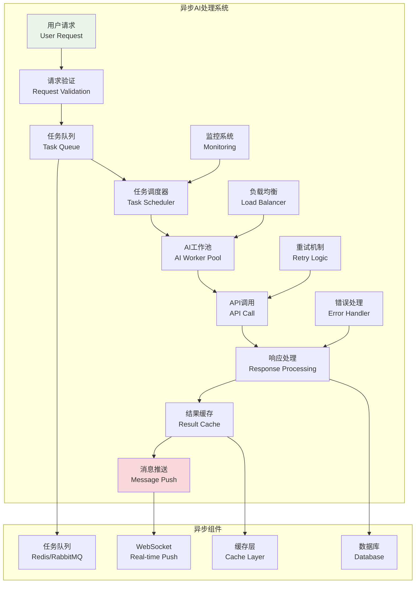
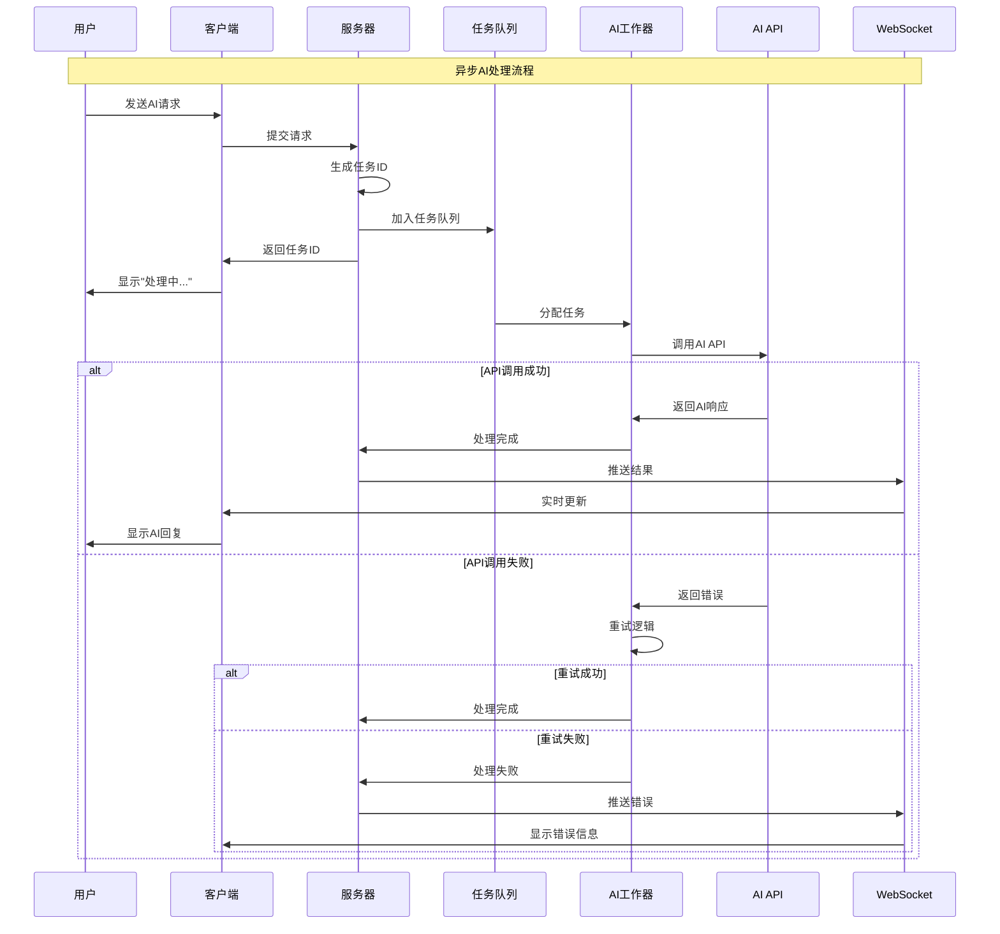

# 异步处理机制

## 🎯 学习目标

通过本章学习，您将能够：
- 理解AI集成中异步处理的重要性和优势
- 掌握异步任务队列和并发控制技术
- 学会设计高性能的AI服务架构
- 在Chat-Room项目中实现流畅的AI交互体验

## ⚡ 异步处理架构

### 异步AI处理系统概览



### 异步处理流程



## 🔄 异步处理实现

### 异步AI任务管理器

```python
# server/ai/async_processor.py - 异步AI处理器
import asyncio
import json
import time
import uuid
from typing import Dict, List, Optional, Any, Callable, Coroutine
from dataclasses import dataclass, asdict
from enum import Enum
import aioredis
import logging
from concurrent.futures import ThreadPoolExecutor

class TaskStatus(Enum):
    """任务状态"""
    PENDING = "pending"
    PROCESSING = "processing"
    COMPLETED = "completed"
    FAILED = "failed"
    CANCELLED = "cancelled"
    RETRYING = "retrying"

class TaskPriority(Enum):
    """任务优先级"""
    LOW = 1
    NORMAL = 2
    HIGH = 3
    URGENT = 4

@dataclass
class AITask:
    """AI任务"""
    task_id: str
    user_id: int
    request_type: str
    request_data: Dict[str, Any]
    priority: TaskPriority = TaskPriority.NORMAL
    status: TaskStatus = TaskStatus.PENDING
    created_at: float = None
    started_at: Optional[float] = None
    completed_at: Optional[float] = None
    result: Optional[Dict[str, Any]] = None
    error_message: Optional[str] = None
    retry_count: int = 0
    max_retries: int = 3
    timeout: float = 30.0
    
    def __post_init__(self):
        if self.created_at is None:
            self.created_at = time.time()
    
    def to_dict(self) -> Dict[str, Any]:
        """转换为字典"""
        data = asdict(self)
        data['priority'] = self.priority.value
        data['status'] = self.status.value
        return data
    
    @classmethod
    def from_dict(cls, data: Dict[str, Any]) -> 'AITask':
        """从字典创建"""
        data['priority'] = TaskPriority(data['priority'])
        data['status'] = TaskStatus(data['status'])
        return cls(**data)

class AsyncAIProcessor:
    """
    异步AI处理器
    
    功能：
    1. 异步任务队列管理
    2. 并发AI API调用
    3. 实时结果推送
    4. 错误处理和重试
    5. 性能监控和优化
    """
    
    def __init__(self, redis_url: str = "redis://localhost:6379",
                 max_workers: int = 10, max_concurrent_tasks: int = 50):
        self.redis_url = redis_url
        self.max_workers = max_workers
        self.max_concurrent_tasks = max_concurrent_tasks
        
        # Redis连接
        self.redis: Optional[aioredis.Redis] = None
        
        # 任务管理
        self.active_tasks: Dict[str, AITask] = {}
        self.task_semaphore = asyncio.Semaphore(max_concurrent_tasks)
        
        # 工作器管理
        self.workers: List[asyncio.Task] = []
        self.worker_pool = ThreadPoolExecutor(max_workers=max_workers)
        
        # 事件回调
        self.task_callbacks: Dict[str, List[Callable]] = {
            'task_started': [],
            'task_completed': [],
            'task_failed': [],
            'task_progress': []
        }
        
        # 统计信息
        self.stats = {
            'total_tasks': 0,
            'completed_tasks': 0,
            'failed_tasks': 0,
            'average_processing_time': 0.0,
            'current_queue_size': 0
        }
        
        self.logger = logging.getLogger('AsyncAIProcessor')
        self.running = False
    
    async def start(self):
        """启动异步处理器"""
        if self.running:
            return
        
        # 连接Redis
        self.redis = await aioredis.from_url(self.redis_url)
        
        # 启动工作器
        for i in range(self.max_workers):
            worker = asyncio.create_task(self._worker_loop(f"worker-{i}"))
            self.workers.append(worker)
        
        # 启动监控任务
        asyncio.create_task(self._monitor_loop())
        
        self.running = True
        self.logger.info(f"异步AI处理器已启动，工作器数量: {self.max_workers}")
    
    async def stop(self):
        """停止异步处理器"""
        if not self.running:
            return
        
        self.running = False
        
        # 停止工作器
        for worker in self.workers:
            worker.cancel()
        
        # 等待工作器结束
        await asyncio.gather(*self.workers, return_exceptions=True)
        
        # 关闭Redis连接
        if self.redis:
            await self.redis.close()
        
        # 关闭线程池
        self.worker_pool.shutdown(wait=True)
        
        self.logger.info("异步AI处理器已停止")
    
    async def submit_task(self, user_id: int, request_type: str,
                         request_data: Dict[str, Any], 
                         priority: TaskPriority = TaskPriority.NORMAL,
                         timeout: float = 30.0) -> str:
        """
        提交AI任务
        
        Args:
            user_id: 用户ID
            request_type: 请求类型
            request_data: 请求数据
            priority: 任务优先级
            timeout: 超时时间
            
        Returns:
            任务ID
        """
        # 生成任务ID
        task_id = str(uuid.uuid4())
        
        # 创建任务
        task = AITask(
            task_id=task_id,
            user_id=user_id,
            request_type=request_type,
            request_data=request_data,
            priority=priority,
            timeout=timeout
        )
        
        # 添加到Redis队列
        queue_name = f"ai_tasks:{priority.name.lower()}"
        await self.redis.lpush(queue_name, json.dumps(task.to_dict()))
        
        # 更新统计
        self.stats['total_tasks'] += 1
        self.stats['current_queue_size'] = await self._get_queue_size()
        
        self.logger.info(f"任务已提交: {task_id}, 类型: {request_type}, 用户: {user_id}")
        return task_id
    
    async def get_task_status(self, task_id: str) -> Optional[Dict[str, Any]]:
        """获取任务状态"""
        # 先检查活跃任务
        if task_id in self.active_tasks:
            return self.active_tasks[task_id].to_dict()
        
        # 从Redis获取
        task_data = await self.redis.get(f"task_result:{task_id}")
        if task_data:
            return json.loads(task_data)
        
        return None
    
    async def cancel_task(self, task_id: str) -> bool:
        """取消任务"""
        # 检查活跃任务
        if task_id in self.active_tasks:
            task = self.active_tasks[task_id]
            task.status = TaskStatus.CANCELLED
            return True
        
        # 从队列中移除（这里简化处理）
        return False
    
    def add_callback(self, event_type: str, callback: Callable):
        """添加事件回调"""
        if event_type in self.task_callbacks:
            self.task_callbacks[event_type].append(callback)
    
    async def _worker_loop(self, worker_name: str):
        """工作器主循环"""
        self.logger.info(f"工作器 {worker_name} 已启动")
        
        while self.running:
            try:
                # 获取任务（按优先级）
                task = await self._get_next_task()
                if not task:
                    await asyncio.sleep(0.1)
                    continue
                
                # 处理任务
                async with self.task_semaphore:
                    await self._process_task(task, worker_name)
                
            except asyncio.CancelledError:
                break
            except Exception as e:
                self.logger.error(f"工作器 {worker_name} 异常: {e}")
                await asyncio.sleep(1)
        
        self.logger.info(f"工作器 {worker_name} 已停止")
    
    async def _get_next_task(self) -> Optional[AITask]:
        """获取下一个任务"""
        # 按优先级顺序检查队列
        for priority in [TaskPriority.URGENT, TaskPriority.HIGH, 
                        TaskPriority.NORMAL, TaskPriority.LOW]:
            queue_name = f"ai_tasks:{priority.name.lower()}"
            
            task_data = await self.redis.brpop(queue_name, timeout=1)
            if task_data:
                task_dict = json.loads(task_data[1])
                return AITask.from_dict(task_dict)
        
        return None
    
    async def _process_task(self, task: AITask, worker_name: str):
        """处理单个任务"""
        task.status = TaskStatus.PROCESSING
        task.started_at = time.time()
        self.active_tasks[task.task_id] = task
        
        # 触发开始事件
        await self._trigger_event('task_started', task)
        
        try:
            # 根据请求类型处理任务
            if task.request_type == "chat_completion":
                result = await self._process_chat_completion(task)
            elif task.request_type == "content_summary":
                result = await self._process_content_summary(task)
            elif task.request_type == "translation":
                result = await self._process_translation(task)
            else:
                raise ValueError(f"未知的请求类型: {task.request_type}")
            
            # 任务完成
            task.status = TaskStatus.COMPLETED
            task.completed_at = time.time()
            task.result = result
            
            # 保存结果到Redis
            await self._save_task_result(task)
            
            # 触发完成事件
            await self._trigger_event('task_completed', task)
            
            # 更新统计
            self.stats['completed_tasks'] += 1
            processing_time = task.completed_at - task.started_at
            self._update_average_processing_time(processing_time)
            
            self.logger.info(f"任务完成: {task.task_id}, 耗时: {processing_time:.2f}s")
        
        except Exception as e:
            # 任务失败
            task.status = TaskStatus.FAILED
            task.error_message = str(e)
            task.completed_at = time.time()
            
            # 检查是否需要重试
            if task.retry_count < task.max_retries:
                task.retry_count += 1
                task.status = TaskStatus.RETRYING
                
                # 重新加入队列
                queue_name = f"ai_tasks:{task.priority.name.lower()}"
                await self.redis.lpush(queue_name, json.dumps(task.to_dict()))
                
                self.logger.warning(f"任务重试: {task.task_id}, 重试次数: {task.retry_count}")
            else:
                # 触发失败事件
                await self._trigger_event('task_failed', task)
                
                # 更新统计
                self.stats['failed_tasks'] += 1
                
                self.logger.error(f"任务失败: {task.task_id}, 错误: {e}")
        
        finally:
            # 从活跃任务中移除
            if task.task_id in self.active_tasks:
                del self.active_tasks[task.task_id]
    
    async def _process_chat_completion(self, task: AITask) -> Dict[str, Any]:
        """处理聊天完成任务"""
        # 这里应该调用实际的AI API
        # 为了演示，我们模拟一个异步API调用
        
        await asyncio.sleep(1)  # 模拟API调用延迟
        
        return {
            "response": f"这是对用户{task.user_id}消息的AI回复",
            "tokens_used": 150,
            "model": "glm-4-flash"
        }
    
    async def _process_content_summary(self, task: AITask) -> Dict[str, Any]:
        """处理内容总结任务"""
        await asyncio.sleep(0.5)  # 模拟处理时间
        
        return {
            "summary": "这是内容总结",
            "key_points": ["要点1", "要点2", "要点3"],
            "tokens_used": 80
        }
    
    async def _process_translation(self, task: AITask) -> Dict[str, Any]:
        """处理翻译任务"""
        await asyncio.sleep(0.3)  # 模拟处理时间
        
        return {
            "translated_text": "这是翻译结果",
            "source_language": "zh",
            "target_language": "en",
            "confidence": 0.95
        }
    
    async def _save_task_result(self, task: AITask):
        """保存任务结果"""
        result_key = f"task_result:{task.task_id}"
        result_data = json.dumps(task.to_dict())
        
        # 设置过期时间（1小时）
        await self.redis.setex(result_key, 3600, result_data)
    
    async def _trigger_event(self, event_type: str, task: AITask):
        """触发事件回调"""
        for callback in self.task_callbacks.get(event_type, []):
            try:
                if asyncio.iscoroutinefunction(callback):
                    await callback(task)
                else:
                    callback(task)
            except Exception as e:
                self.logger.error(f"事件回调异常: {e}")
    
    async def _get_queue_size(self) -> int:
        """获取队列大小"""
        total_size = 0
        for priority in TaskPriority:
            queue_name = f"ai_tasks:{priority.name.lower()}"
            size = await self.redis.llen(queue_name)
            total_size += size
        return total_size
    
    def _update_average_processing_time(self, processing_time: float):
        """更新平均处理时间"""
        completed = self.stats['completed_tasks']
        if completed == 1:
            self.stats['average_processing_time'] = processing_time
        else:
            current_avg = self.stats['average_processing_time']
            self.stats['average_processing_time'] = (current_avg * (completed - 1) + processing_time) / completed
    
    async def _monitor_loop(self):
        """监控循环"""
        while self.running:
            try:
                # 更新队列大小统计
                self.stats['current_queue_size'] = await self._get_queue_size()
                
                # 记录统计信息
                if self.stats['total_tasks'] % 100 == 0 and self.stats['total_tasks'] > 0:
                    self.logger.info(f"处理统计: {self.stats}")
                
                await asyncio.sleep(10)  # 每10秒监控一次
                
            except Exception as e:
                self.logger.error(f"监控循环异常: {e}")
                await asyncio.sleep(5)
    
    def get_stats(self) -> Dict[str, Any]:
        """获取统计信息"""
        stats = self.stats.copy()
        stats['active_tasks_count'] = len(self.active_tasks)
        stats['worker_count'] = len(self.workers)
        
        if stats['total_tasks'] > 0:
            stats['success_rate'] = stats['completed_tasks'] / stats['total_tasks']
            stats['failure_rate'] = stats['failed_tasks'] / stats['total_tasks']
        else:
            stats['success_rate'] = 0.0
            stats['failure_rate'] = 0.0
        
        return stats

# 使用示例
async def demo_async_processor():
    """异步处理器演示"""
    processor = AsyncAIProcessor(max_workers=3)
    
    # 添加事件回调
    async def on_task_completed(task: AITask):
        print(f"任务完成: {task.task_id}, 结果: {task.result}")
    
    def on_task_failed(task: AITask):
        print(f"任务失败: {task.task_id}, 错误: {task.error_message}")
    
    processor.add_callback('task_completed', on_task_completed)
    processor.add_callback('task_failed', on_task_failed)
    
    print("=== 异步AI处理器演示 ===")
    
    try:
        # 启动处理器
        await processor.start()
        
        # 提交任务
        tasks = []
        for i in range(5):
            task_id = await processor.submit_task(
                user_id=i + 1,
                request_type="chat_completion",
                request_data={"message": f"测试消息 {i + 1}"},
                priority=TaskPriority.NORMAL
            )
            tasks.append(task_id)
            print(f"提交任务: {task_id}")
        
        # 等待任务完成
        await asyncio.sleep(5)
        
        # 查看任务状态
        for task_id in tasks:
            status = await processor.get_task_status(task_id)
            if status:
                print(f"任务 {task_id}: {status['status']}")
        
        # 查看统计信息
        stats = processor.get_stats()
        print(f"处理统计: {stats}")
        
    finally:
        # 停止处理器
        await processor.stop()

if __name__ == "__main__":
    asyncio.run(demo_async_processor())
```

## 🎯 实践练习

### 练习1：流式响应处理
```python
class StreamingResponseHandler:
    """
    流式响应处理练习
    
    要求：
    1. 实现AI流式响应的实时推送
    2. 支持部分结果的增量更新
    3. 处理流式响应的错误和中断
    4. 优化用户体验和响应速度
    """
    
    async def handle_streaming_response(self, task_id: str, response_stream):
        """处理流式响应"""
        # TODO: 实现流式响应处理
        pass
```

### 练习2：智能任务调度
```python
class IntelligentTaskScheduler:
    """
    智能任务调度练习
    
    要求：
    1. 基于用户优先级和历史行为调度任务
    2. 实现动态负载均衡
    3. 支持任务依赖和批处理
    4. 优化资源利用率和响应时间
    """
    
    def calculate_task_priority(self, task: AITask, user_context: Dict) -> float:
        """计算任务优先级"""
        # TODO: 实现智能优先级计算
        pass
```

## ✅ 学习检查

完成本章学习后，请确认您能够：

- [ ] 理解异步处理在AI集成中的重要性
- [ ] 设计高效的异步任务队列系统
- [ ] 实现并发AI API调用和结果处理
- [ ] 管理任务状态和错误处理
- [ ] 优化异步处理性能和用户体验
- [ ] 完成实践练习

## 📚 下一步

异步处理机制掌握后，请继续学习：
- [第8章：用户界面设计](../08-user-interface/tui-concepts.md)

---

**恭喜！您已经完成了AI集成功能的学习！** ⚡
