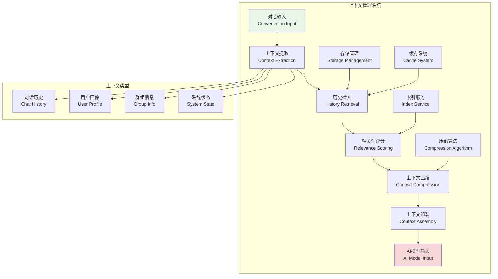
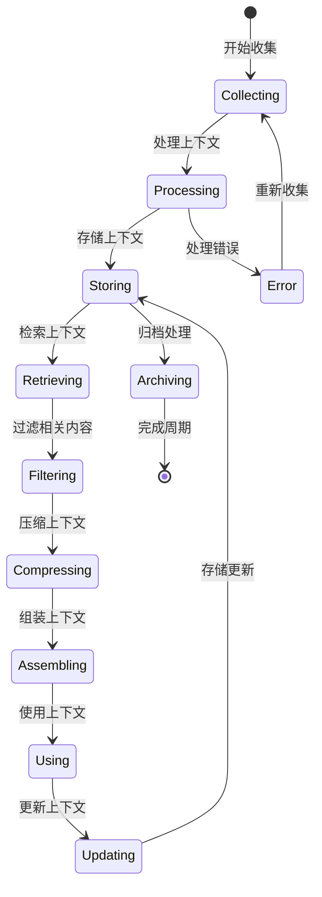

# 上下文管理系统

## 🎯 学习目标

通过本章学习，您将能够：
- 理解AI对话中上下文管理的重要性和挑战
- 掌握对话历史的存储、检索和优化技术
- 学会设计智能的上下文压缩和筛选机制
- 在Chat-Room项目中实现高效的上下文管理系统

## 🧠 上下文管理架构

### 上下文管理系统概览



### 上下文生命周期



## 💾 上下文管理实现

### 对话上下文管理器

```python
# server/ai/context_manager.py - 上下文管理器
import json
import time
import hashlib
from typing import Dict, List, Optional, Any, Tuple
from dataclasses import dataclass, asdict
from datetime import datetime, timedelta
import sqlite3
import threading
from collections import deque

@dataclass
class ConversationTurn:
    """对话轮次"""
    turn_id: str
    user_id: int
    username: str
    message: str
    ai_response: Optional[str] = None
    timestamp: float = None
    group_id: Optional[int] = None
    message_type: str = "text"
    metadata: Dict[str, Any] = None
    
    def __post_init__(self):
        if self.timestamp is None:
            self.timestamp = time.time()
        if self.metadata is None:
            self.metadata = {}
    
    def to_dict(self) -> Dict[str, Any]:
        """转换为字典"""
        return asdict(self)
    
    @classmethod
    def from_dict(cls, data: Dict[str, Any]) -> 'ConversationTurn':
        """从字典创建"""
        return cls(**data)

@dataclass
class ContextWindow:
    """上下文窗口"""
    window_id: str
    turns: List[ConversationTurn]
    max_turns: int = 10
    max_tokens: int = 2000
    created_at: float = None
    last_updated: float = None
    
    def __post_init__(self):
        if self.created_at is None:
            self.created_at = time.time()
        if self.last_updated is None:
            self.last_updated = time.time()
    
    def add_turn(self, turn: ConversationTurn):
        """添加对话轮次"""
        self.turns.append(turn)
        self.last_updated = time.time()
        
        # 保持窗口大小限制
        if len(self.turns) > self.max_turns:
            self.turns.pop(0)
    
    def get_recent_turns(self, count: int = None) -> List[ConversationTurn]:
        """获取最近的对话轮次"""
        if count is None:
            count = self.max_turns
        return self.turns[-count:] if self.turns else []
    
    def estimate_tokens(self) -> int:
        """估算token数量"""
        total_chars = 0
        for turn in self.turns:
            total_chars += len(turn.message)
            if turn.ai_response:
                total_chars += len(turn.ai_response)
        
        # 粗略估算：中文1字符≈1token，英文4字符≈1token
        return int(total_chars * 0.8)

class ConversationContextManager:
    """
    对话上下文管理器
    
    功能：
    1. 管理多用户、多群组的对话上下文
    2. 智能压缩和筛选历史对话
    3. 提供相关性评分和检索
    4. 优化上下文窗口大小
    """
    
    def __init__(self, db_path: str = "data/context.db", max_memory_windows: int = 100):
        self.db_path = db_path
        self.max_memory_windows = max_memory_windows
        
        # 内存中的上下文窗口
        self.context_windows: Dict[str, ContextWindow] = {}
        self.window_access_times: Dict[str, float] = {}
        
        # 线程安全锁
        self.lock = threading.RWLock()
        
        # 初始化数据库
        self._init_database()
    
    def _init_database(self):
        """初始化数据库"""
        try:
            conn = sqlite3.connect(self.db_path)
            cursor = conn.cursor()
            
            # 创建对话历史表
            cursor.execute("""
                CREATE TABLE IF NOT EXISTS conversation_history (
                    turn_id TEXT PRIMARY KEY,
                    user_id INTEGER NOT NULL,
                    username TEXT NOT NULL,
                    message TEXT NOT NULL,
                    ai_response TEXT,
                    timestamp REAL NOT NULL,
                    group_id INTEGER,
                    message_type TEXT DEFAULT 'text',
                    metadata TEXT,
                    created_at TIMESTAMP DEFAULT CURRENT_TIMESTAMP
                )
            """)
            
            # 创建上下文摘要表
            cursor.execute("""
                CREATE TABLE IF NOT EXISTS context_summaries (
                    summary_id TEXT PRIMARY KEY,
                    user_id INTEGER,
                    group_id INTEGER,
                    summary_content TEXT NOT NULL,
                    turn_count INTEGER NOT NULL,
                    start_time REAL NOT NULL,
                    end_time REAL NOT NULL,
                    created_at TIMESTAMP DEFAULT CURRENT_TIMESTAMP
                )
            """)
            
            # 创建索引
            cursor.execute("CREATE INDEX IF NOT EXISTS idx_history_user ON conversation_history(user_id)")
            cursor.execute("CREATE INDEX IF NOT EXISTS idx_history_group ON conversation_history(group_id)")
            cursor.execute("CREATE INDEX IF NOT EXISTS idx_history_timestamp ON conversation_history(timestamp)")
            
            conn.commit()
            conn.close()
            
        except Exception as e:
            print(f"数据库初始化失败: {e}")
    
    def get_context_key(self, user_id: int, group_id: Optional[int] = None) -> str:
        """生成上下文键"""
        if group_id:
            return f"group_{group_id}_user_{user_id}"
        else:
            return f"user_{user_id}"
    
    def add_conversation_turn(self, user_id: int, username: str, message: str,
                            ai_response: str = None, group_id: int = None,
                            message_type: str = "text", metadata: Dict[str, Any] = None) -> str:
        """
        添加对话轮次
        
        Args:
            user_id: 用户ID
            username: 用户名
            message: 用户消息
            ai_response: AI响应
            group_id: 群组ID
            message_type: 消息类型
            metadata: 元数据
            
        Returns:
            对话轮次ID
        """
        # 生成轮次ID
        turn_id = self._generate_turn_id(user_id, message)
        
        # 创建对话轮次
        turn = ConversationTurn(
            turn_id=turn_id,
            user_id=user_id,
            username=username,
            message=message,
            ai_response=ai_response,
            group_id=group_id,
            message_type=message_type,
            metadata=metadata or {}
        )
        
        # 获取上下文键
        context_key = self.get_context_key(user_id, group_id)
        
        with self.lock.write_lock():
            # 获取或创建上下文窗口
            if context_key not in self.context_windows:
                self.context_windows[context_key] = ContextWindow(
                    window_id=context_key,
                    turns=[]
                )
            
            # 添加到上下文窗口
            self.context_windows[context_key].add_turn(turn)
            self.window_access_times[context_key] = time.time()
            
            # 管理内存使用
            self._manage_memory_usage()
        
        # 异步保存到数据库
        self._save_turn_to_database(turn)
        
        return turn_id
    
    def get_conversation_context(self, user_id: int, group_id: int = None,
                               max_turns: int = 10, max_tokens: int = 2000) -> List[ConversationTurn]:
        """
        获取对话上下文
        
        Args:
            user_id: 用户ID
            group_id: 群组ID
            max_turns: 最大轮次数
            max_tokens: 最大token数
            
        Returns:
            对话轮次列表
        """
        context_key = self.get_context_key(user_id, group_id)
        
        with self.lock.read_lock():
            # 从内存获取
            if context_key in self.context_windows:
                window = self.context_windows[context_key]
                self.window_access_times[context_key] = time.time()
                
                # 获取最近的轮次
                recent_turns = window.get_recent_turns(max_turns)
                
                # 根据token限制进一步筛选
                return self._filter_by_tokens(recent_turns, max_tokens)
        
        # 从数据库加载
        return self._load_context_from_database(user_id, group_id, max_turns, max_tokens)
    
    def get_relevant_context(self, user_id: int, current_message: str,
                           group_id: int = None, max_turns: int = 5) -> List[ConversationTurn]:
        """
        获取相关上下文
        
        Args:
            user_id: 用户ID
            current_message: 当前消息
            group_id: 群组ID
            max_turns: 最大轮次数
            
        Returns:
            相关的对话轮次列表
        """
        # 获取所有上下文
        all_context = self.get_conversation_context(user_id, group_id, max_turns * 2)
        
        # 计算相关性评分
        scored_turns = []
        for turn in all_context:
            score = self._calculate_relevance_score(current_message, turn)
            scored_turns.append((score, turn))
        
        # 按评分排序并返回前N个
        scored_turns.sort(key=lambda x: x[0], reverse=True)
        return [turn for score, turn in scored_turns[:max_turns]]
    
    def compress_context(self, user_id: int, group_id: int = None) -> Optional[str]:
        """
        压缩上下文为摘要
        
        Args:
            user_id: 用户ID
            group_id: 群组ID
            
        Returns:
            上下文摘要
        """
        context_key = self.get_context_key(user_id, group_id)
        
        with self.lock.read_lock():
            if context_key not in self.context_windows:
                return None
            
            window = self.context_windows[context_key]
            if len(window.turns) < 5:  # 少于5轮对话不压缩
                return None
            
            # 提取关键信息
            summary_points = []
            topics = set()
            
            for turn in window.turns:
                # 提取关键词
                keywords = self._extract_keywords(turn.message)
                topics.update(keywords)
                
                # 记录重要信息
                if any(keyword in turn.message.lower() for keyword in ['问题', '帮助', '解决', '建议']):
                    summary_points.append(f"用户询问: {turn.message[:50]}...")
                
                if turn.ai_response and len(turn.ai_response) > 100:
                    summary_points.append(f"AI回复要点: {turn.ai_response[:50]}...")
            
            # 生成摘要
            summary = f"对话主题: {', '.join(list(topics)[:5])}\n"
            summary += f"关键交互: {'; '.join(summary_points[:3])}\n"
            summary += f"对话轮次: {len(window.turns)}"
            
            return summary
    
    def clear_old_context(self, days_old: int = 7):
        """清理旧的上下文数据"""
        cutoff_time = time.time() - (days_old * 24 * 3600)
        
        try:
            conn = sqlite3.connect(self.db_path)
            cursor = conn.cursor()
            
            # 删除旧的对话记录
            cursor.execute("""
                DELETE FROM conversation_history 
                WHERE timestamp < ?
            """, (cutoff_time,))
            
            # 删除旧的摘要
            cursor.execute("""
                DELETE FROM context_summaries 
                WHERE end_time < ?
            """, (cutoff_time,))
            
            deleted_count = cursor.rowcount
            conn.commit()
            conn.close()
            
            print(f"清理了 {deleted_count} 条旧的上下文记录")
            
        except Exception as e:
            print(f"清理上下文失败: {e}")
    
    def _generate_turn_id(self, user_id: int, message: str) -> str:
        """生成轮次ID"""
        content = f"{user_id}_{message}_{time.time()}"
        return hashlib.md5(content.encode()).hexdigest()[:16]
    
    def _filter_by_tokens(self, turns: List[ConversationTurn], max_tokens: int) -> List[ConversationTurn]:
        """根据token限制筛选轮次"""
        filtered_turns = []
        current_tokens = 0
        
        # 从最新的开始添加
        for turn in reversed(turns):
            turn_tokens = len(turn.message) + (len(turn.ai_response) if turn.ai_response else 0)
            turn_tokens = int(turn_tokens * 0.8)  # 估算token数
            
            if current_tokens + turn_tokens <= max_tokens:
                filtered_turns.insert(0, turn)
                current_tokens += turn_tokens
            else:
                break
        
        return filtered_turns
    
    def _calculate_relevance_score(self, current_message: str, turn: ConversationTurn) -> float:
        """计算相关性评分"""
        score = 0.0
        
        # 时间衰减
        time_diff = time.time() - turn.timestamp
        time_score = max(0, 1 - time_diff / (24 * 3600))  # 24小时内的对话更相关
        score += time_score * 0.3
        
        # 关键词匹配
        current_keywords = set(self._extract_keywords(current_message))
        turn_keywords = set(self._extract_keywords(turn.message))
        
        if current_keywords and turn_keywords:
            keyword_overlap = len(current_keywords & turn_keywords) / len(current_keywords | turn_keywords)
            score += keyword_overlap * 0.5
        
        # 消息类型匹配
        if turn.message_type == "text":
            score += 0.2
        
        return score
    
    def _extract_keywords(self, text: str) -> List[str]:
        """提取关键词"""
        # 简单的关键词提取（实际应用中可以使用更复杂的NLP技术）
        import re
        
        # 移除标点符号并分词
        words = re.findall(r'\b\w+\b', text.lower())
        
        # 过滤停用词
        stop_words = {'的', '了', '在', '是', '我', '你', '他', '她', '它', '我们', '你们', '他们',
                     'the', 'a', 'an', 'and', 'or', 'but', 'in', 'on', 'at', 'to', 'for'}
        
        keywords = [word for word in words if word not in stop_words and len(word) > 1]
        
        return keywords[:10]  # 返回前10个关键词
    
    def _manage_memory_usage(self):
        """管理内存使用"""
        if len(self.context_windows) <= self.max_memory_windows:
            return
        
        # 按访问时间排序，移除最久未访问的窗口
        sorted_windows = sorted(
            self.window_access_times.items(),
            key=lambda x: x[1]
        )
        
        # 移除最旧的窗口
        windows_to_remove = len(self.context_windows) - self.max_memory_windows
        for i in range(windows_to_remove):
            window_key = sorted_windows[i][0]
            
            # 保存到数据库
            if window_key in self.context_windows:
                self._save_window_to_database(self.context_windows[window_key])
                del self.context_windows[window_key]
                del self.window_access_times[window_key]
    
    def _save_turn_to_database(self, turn: ConversationTurn):
        """保存轮次到数据库"""
        try:
            conn = sqlite3.connect(self.db_path)
            cursor = conn.cursor()
            
            cursor.execute("""
                INSERT OR REPLACE INTO conversation_history 
                (turn_id, user_id, username, message, ai_response, timestamp, 
                 group_id, message_type, metadata)
                VALUES (?, ?, ?, ?, ?, ?, ?, ?, ?)
            """, (
                turn.turn_id, turn.user_id, turn.username, turn.message,
                turn.ai_response, turn.timestamp, turn.group_id,
                turn.message_type, json.dumps(turn.metadata)
            ))
            
            conn.commit()
            conn.close()
            
        except Exception as e:
            print(f"保存对话轮次失败: {e}")
    
    def _save_window_to_database(self, window: ContextWindow):
        """保存窗口到数据库"""
        for turn in window.turns:
            self._save_turn_to_database(turn)
    
    def _load_context_from_database(self, user_id: int, group_id: int = None,
                                  max_turns: int = 10, max_tokens: int = 2000) -> List[ConversationTurn]:
        """从数据库加载上下文"""
        try:
            conn = sqlite3.connect(self.db_path)
            conn.row_factory = sqlite3.Row
            cursor = conn.cursor()
            
            if group_id:
                cursor.execute("""
                    SELECT * FROM conversation_history 
                    WHERE user_id = ? AND group_id = ?
                    ORDER BY timestamp DESC 
                    LIMIT ?
                """, (user_id, group_id, max_turns))
            else:
                cursor.execute("""
                    SELECT * FROM conversation_history 
                    WHERE user_id = ? AND group_id IS NULL
                    ORDER BY timestamp DESC 
                    LIMIT ?
                """, (user_id, max_turns))
            
            rows = cursor.fetchall()
            conn.close()
            
            turns = []
            for row in rows:
                metadata = json.loads(row['metadata']) if row['metadata'] else {}
                
                turn = ConversationTurn(
                    turn_id=row['turn_id'],
                    user_id=row['user_id'],
                    username=row['username'],
                    message=row['message'],
                    ai_response=row['ai_response'],
                    timestamp=row['timestamp'],
                    group_id=row['group_id'],
                    message_type=row['message_type'],
                    metadata=metadata
                )
                turns.append(turn)
            
            # 按时间正序返回
            return list(reversed(turns))
            
        except Exception as e:
            print(f"从数据库加载上下文失败: {e}")
            return []

# 使用示例
def demo_context_management():
    """上下文管理演示"""
    manager = ConversationContextManager()
    
    print("=== 上下文管理演示 ===")
    
    # 添加对话轮次
    turn1_id = manager.add_conversation_turn(
        user_id=1,
        username="alice",
        message="你好，我想学习Python编程",
        ai_response="你好！Python是一门很棒的编程语言。你想从哪个方面开始学习呢？",
        group_id=1
    )
    
    turn2_id = manager.add_conversation_turn(
        user_id=1,
        username="alice",
        message="我想学习数据分析",
        ai_response="数据分析是Python的强项！建议你从pandas和numpy开始学习。",
        group_id=1
    )
    
    # 获取上下文
    context = manager.get_conversation_context(user_id=1, group_id=1)
    print(f"获取到 {len(context)} 轮对话")
    
    for turn in context:
        print(f"用户: {turn.message}")
        print(f"AI: {turn.ai_response}")
        print("-" * 50)
    
    # 获取相关上下文
    relevant_context = manager.get_relevant_context(
        user_id=1,
        current_message="pandas怎么使用？",
        group_id=1
    )
    
    print(f"相关上下文: {len(relevant_context)} 轮")
    
    # 压缩上下文
    summary = manager.compress_context(user_id=1, group_id=1)
    if summary:
        print(f"上下文摘要:\n{summary}")

if __name__ == "__main__":
    demo_context_management()
```

## 🎯 实践练习

### 练习1：智能上下文压缩
```python
class IntelligentContextCompressor:
    """
    智能上下文压缩练习
    
    要求：
    1. 实现基于重要性的上下文筛选
    2. 使用AI模型生成上下文摘要
    3. 支持多层次的上下文压缩
    4. 保持关键信息的完整性
    """
    
    def compress_with_ai(self, conversation_turns: List[ConversationTurn]) -> str:
        """使用AI压缩上下文"""
        # TODO: 实现AI驱动的上下文压缩
        pass
```

### 练习2：跨会话上下文关联
```python
class CrossSessionContextLinker:
    """
    跨会话上下文关联练习
    
    要求：
    1. 识别不同会话间的关联性
    2. 建立用户兴趣和偏好模型
    3. 实现长期记忆机制
    4. 支持上下文的语义检索
    """
    
    def link_related_sessions(self, user_id: int, current_topic: str) -> List[str]:
        """关联相关会话"""
        # TODO: 实现跨会话关联
        pass
```

## ✅ 学习检查

完成本章学习后，请确认您能够：

- [ ] 理解上下文管理的重要性和挑战
- [ ] 设计高效的上下文存储和检索系统
- [ ] 实现智能的上下文压缩和筛选
- [ ] 管理多用户、多群组的上下文
- [ ] 优化上下文窗口大小和性能
- [ ] 完成实践练习

## 📚 下一步

上下文管理系统掌握后，请继续学习：
- [异步处理](async-processing.md)

---

**现在您已经掌握了智能上下文管理技术！** 🧠
