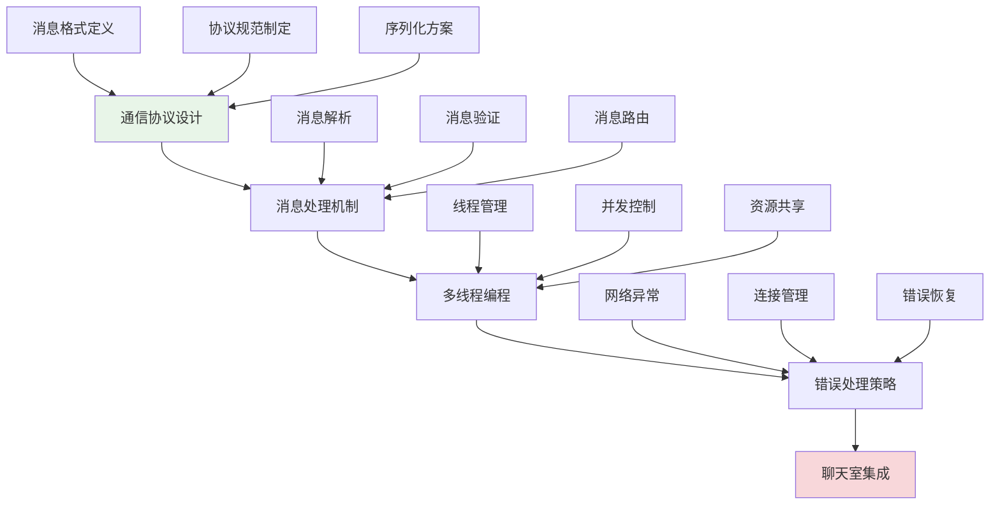

# 第7章：简单聊天室

## 🎯 学习目标

通过本章学习，您将能够：
- 设计和实现简单的聊天室通信协议
- 掌握多线程编程在网络应用中的应用
- 学会处理网络通信中的各种异常情况
- 理解消息处理和路由的基本原理
- 构建可扩展的聊天室架构基础

## 📖 本章概览

本章将在前面Socket编程基础上，构建一个完整的简单聊天室系统。我们将学习如何设计通信协议、处理多用户并发连接、实现消息路由机制，以及处理各种网络异常情况。

### 学习路径

## 📚 章节内容

### 1. [通信协议设计](protocol-design.md)
**学习时间：** 4-6小时  
**难度等级：** ⭐⭐⭐

学习内容：
- 聊天室通信协议的设计原则
- JSON格式的消息结构定义
- 消息类型和字段规范
- 协议版本管理和扩展性

**Chat-Room应用：** 定义统一的消息格式，支持登录、聊天、系统通知等消息类型

### 2. [消息处理机制](message-handling.md)
**学习时间：** 4-6小时  
**难度等级：** ⭐⭐⭐

学习内容：
- 消息的接收、解析和验证
- 消息队列和缓冲机制
- 消息路由和分发策略
- 消息持久化和历史记录

**Chat-Room应用：** 实现消息的完整处理流程，确保消息可靠传输

### 3. [多线程编程基础](threading-basics.md)
**学习时间：** 6-8小时  
**难度等级：** ⭐⭐⭐⭐

学习内容：
- Python threading模块详解
- 线程同步和锁机制
- 线程池和任务队列
- 线程安全的数据结构

**Chat-Room应用：** 为每个客户端连接创建独立线程，实现并发处理

### 4. [错误处理策略](error-handling.md)
**学习时间：** 3-4小时  
**难度等级：** ⭐⭐⭐

学习内容：
- 网络异常的分类和处理
- 连接断开的检测和清理
- 优雅的错误恢复机制
- 错误日志和监控

**Chat-Room应用：** 处理客户端断开、网络超时、消息格式错误等异常情况

## 🔧 前置知识要求

- **Socket编程基础：** 已完成第6章Socket网络编程学习
- **Python基础：** 熟练掌握Python语法、面向对象编程
- **网络概念：** 理解TCP/IP协议和客户端-服务器架构
- **JSON处理：** 了解JSON格式和Python json模块

## ⏱️ 预计学习时间

| 内容 | 预计时间 | 累计时间 |
|------|----------|----------|
| 通信协议设计 | 4-6小时 | 4-6小时 |
| 消息处理机制 | 4-6小时 | 8-12小时 |
| 多线程编程 | 6-8小时 | 14-20小时 |
| 错误处理策略 | 3-4小时 | 17-24小时 |
| **总计** | **17-24小时** | **3-4天** |

## 📋 学习顺序建议

### 第1天：协议设计
1. **通信协议设计** - 建立消息通信标准
2. **协议实现和测试** - 验证协议可行性

### 第2天：消息处理
3. **消息处理机制** - 实现消息解析和路由
4. **消息验证和过滤** - 确保消息安全性

### 第3天：并发编程
5. **多线程编程** - 支持多用户并发连接
6. **线程同步和安全** - 避免竞态条件

### 第4天：异常处理
7. **错误处理策略** - 提高系统稳定性
8. **系统集成测试** - 验证整体功能

## ✅ 学习检查清单

### 协议设计能力
- [ ] 能够设计清晰的消息格式
- [ ] 理解协议版本管理的重要性
- [ ] 掌握JSON序列化和反序列化
- [ ] 会处理协议兼容性问题

### 消息处理能力
- [ ] 能够实现消息的完整处理流程
- [ ] 理解消息队列和缓冲机制
- [ ] 掌握消息路由和分发策略
- [ ] 会实现消息持久化

### 多线程编程能力
- [ ] 能够创建和管理线程
- [ ] 理解线程同步和锁机制
- [ ] 掌握线程安全的编程技巧
- [ ] 会使用线程池优化性能

### 异常处理能力
- [ ] 能够识别和分类网络异常
- [ ] 掌握连接管理和清理机制
- [ ] 会实现优雅的错误恢复
- [ ] 能够设计错误监控系统

## 🎯 实践项目

### 阶段性项目：多用户聊天室
在学习过程中，您将逐步构建一个支持多用户的聊天室：

1. **协议设计阶段：** 定义消息格式和通信规范
2. **消息处理阶段：** 实现消息解析和路由功能
3. **多线程阶段：** 支持多个客户端同时连接
4. **异常处理阶段：** 处理各种网络异常情况

### 项目特性
- 支持多用户同时在线聊天
- 实时消息传输和显示
- 用户进入/离开通知
- 基础的错误处理和恢复

## 🚨 学习难点和解决方案

### 常见难点
1. **多线程编程复杂性**
   - 解决方案：从简单的线程示例开始，逐步增加复杂度
   - 重点理解：线程安全和同步机制

2. **消息协议设计**
   - 解决方案：参考现有协议标准，保持简单和可扩展
   - 重点理解：协议的向后兼容性

3. **网络异常处理**
   - 解决方案：分类处理不同类型的异常，建立处理流程
   - 重点理解：优雅降级和错误恢复

### 学习技巧
- **逐步构建：** 从单线程开始，逐步添加多线程支持
- **测试驱动：** 为每个功能编写测试用例
- **日志调试：** 使用详细的日志帮助调试和理解程序流程
- **代码审查：** 重点关注线程安全和异常处理

## 📚 下一步学习

简单聊天室完成后，请继续学习：
- [第8章：数据库与用户系统](../08-database-user-system/README.md) - 添加用户管理和数据持久化

---

**恭喜！您即将拥有一个功能完整的多用户聊天室！** 💬

*本章最后更新：2025-01-17*
