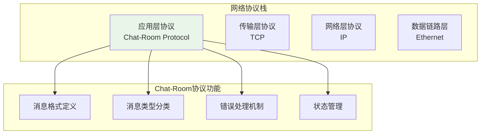
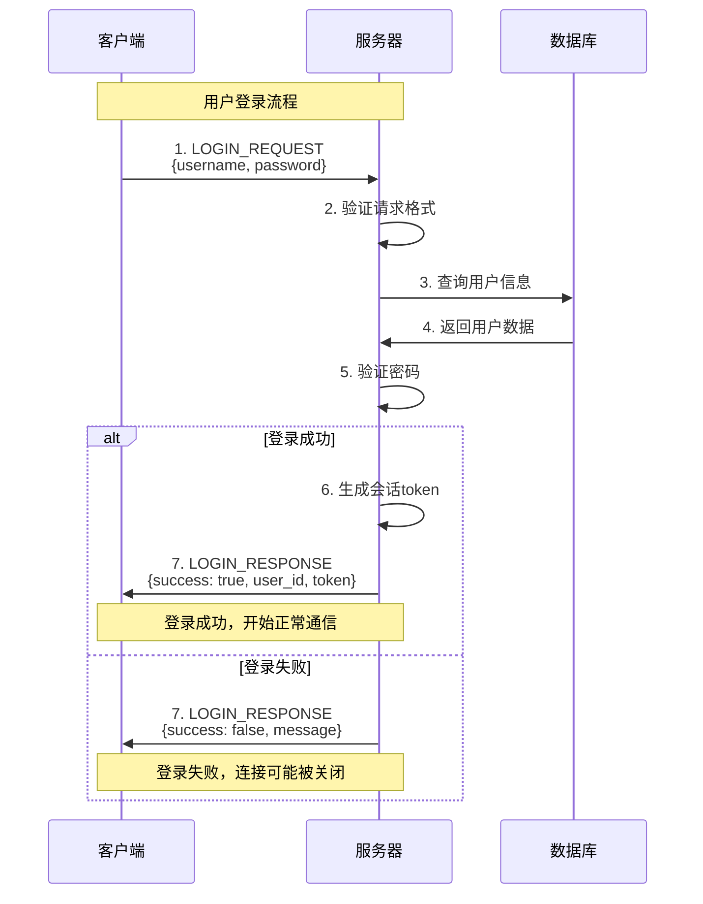
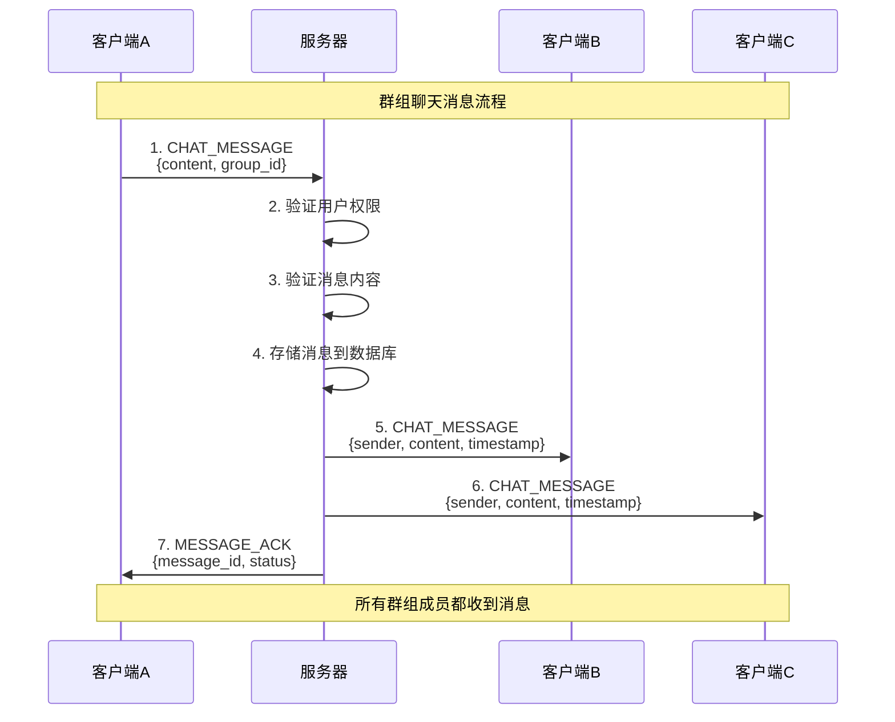

# 聊天协议设计

## 🎯 学习目标

通过本章学习，您将能够：
- 理解网络应用协议设计的基本原则
- 掌握JSON消息格式的设计和使用
- 学会设计可扩展的消息协议
- 在Chat-Room项目中应用协议设计思想

## 📡 协议设计基础

### 什么是应用层协议？



应用层协议定义了应用程序之间如何通信：
- **消息格式**：数据如何组织和编码
- **消息类型**：不同功能的消息分类
- **交互流程**：客户端和服务器的对话规则
- **错误处理**：异常情况的处理方式

### Chat-Room协议设计原则

```python
# shared/protocol/design_principles.py - 协议设计原则
"""
Chat-Room协议设计原则

1. 简单性原则
   - 使用JSON格式，易于解析和调试
   - 消息结构清晰，字段含义明确
   - 避免过度复杂的嵌套结构

2. 可扩展性原则
   - 预留扩展字段
   - 版本兼容性考虑
   - 模块化消息类型设计

3. 可靠性原则
   - 消息完整性验证
   - 错误状态明确定义
   - 超时和重试机制

4. 效率性原则
   - 消息大小优化
   - 减少不必要的往返通信
   - 批量操作支持
"""

class ProtocolDesignPrinciples:
    """协议设计原则示例"""
    
    @staticmethod
    def demonstrate_simplicity():
        """简单性原则示例"""
        # 好的设计：结构清晰
        good_message = {
            "type": "chat",
            "sender": "alice",
            "content": "Hello world!",
            "timestamp": 1703123456.789
        }
        
        # 不好的设计：过度复杂
        bad_message = {
            "msg": {
                "meta": {
                    "t": "c",
                    "s": {"u": "alice", "id": 123},
                    "ts": {"unix": 1703123456, "ms": 789}
                },
                "data": {"txt": "Hello world!", "fmt": "plain"}
            }
        }
        
        return good_message, bad_message
    
    @staticmethod
    def demonstrate_extensibility():
        """可扩展性原则示例"""
        # 基础消息格式
        base_message = {
            "version": "1.0",
            "type": "chat",
            "content": "Hello world!"
        }
        
        # 扩展后的消息格式（向后兼容）
        extended_message = {
            "version": "1.1",
            "type": "chat",
            "content": "Hello world!",
            "metadata": {
                "reply_to": "msg_123",
                "mentions": ["@bob"],
                "attachments": []
            }
        }
        
        return base_message, extended_message
```

## 📋 消息格式设计

### 基础消息结构

```python
# shared/protocol/message_format.py - 消息格式定义
from typing import Dict, Any, Optional, Union
from datetime import datetime
import uuid

class BaseMessage:
    """
    基础消息格式
    
    所有Chat-Room消息的通用结构
    """
    
    def __init__(self, message_type: str, **kwargs):
        """
        初始化基础消息
        
        Args:
            message_type: 消息类型
            **kwargs: 其他消息字段
        """
        self.version = "1.0"  # 协议版本
        self.message_id = str(uuid.uuid4())  # 唯一消息ID
        self.type = message_type  # 消息类型
        self.timestamp = datetime.now().timestamp()  # 时间戳
        
        # 添加其他字段
        for key, value in kwargs.items():
            setattr(self, key, value)
    
    def to_dict(self) -> Dict[str, Any]:
        """转换为字典格式"""
        return {
            "version": self.version,
            "message_id": self.message_id,
            "type": self.type,
            "timestamp": self.timestamp,
            **{k: v for k, v in self.__dict__.items() 
               if k not in ['version', 'message_id', 'type', 'timestamp']}
        }
    
    @classmethod
    def from_dict(cls, data: Dict[str, Any]) -> 'BaseMessage':
        """从字典创建消息对象"""
        message_type = data.pop('type')
        message = cls(message_type)
        
        for key, value in data.items():
            setattr(message, key, value)
        
        return message
    
    def validate(self) -> bool:
        """验证消息格式"""
        required_fields = ['version', 'message_id', 'type', 'timestamp']
        
        for field in required_fields:
            if not hasattr(self, field) or getattr(self, field) is None:
                return False
        
        return True

# 消息格式示例
def create_sample_messages():
    """创建示例消息"""
    
    # 1. 聊天消息
    chat_message = BaseMessage(
        "chat",
        sender_id=123,
        sender_name="alice",
        content="Hello everyone!",
        group_id=1
    )
    
    # 2. 系统消息
    system_message = BaseMessage(
        "system",
        content="用户 alice 加入了聊天室",
        level="info"
    )
    
    # 3. 用户状态消息
    status_message = BaseMessage(
        "user_status",
        user_id=123,
        status="online",
        last_seen=datetime.now().timestamp()
    )
    
    return [chat_message, system_message, status_message]
```

### 消息类型定义

```python
# shared/protocol/message_types.py - 消息类型定义
from enum import Enum
from typing import Dict, Any, List

class MessageType(Enum):
    """消息类型枚举"""
    
    # 认证相关
    LOGIN_REQUEST = "login_request"
    LOGIN_RESPONSE = "login_response"
    LOGOUT_REQUEST = "logout_request"
    REGISTER_REQUEST = "register_request"
    REGISTER_RESPONSE = "register_response"
    
    # 聊天相关
    CHAT_MESSAGE = "chat_message"
    PRIVATE_MESSAGE = "private_message"
    GROUP_MESSAGE = "group_message"
    
    # 用户管理
    USER_JOIN = "user_join"
    USER_LEAVE = "user_leave"
    USER_LIST = "user_list"
    USER_STATUS = "user_status"
    
    # 群组管理
    GROUP_CREATE = "group_create"
    GROUP_JOIN = "group_join"
    GROUP_LEAVE = "group_leave"
    GROUP_LIST = "group_list"
    
    # 文件传输
    FILE_UPLOAD_REQUEST = "file_upload_request"
    FILE_UPLOAD_RESPONSE = "file_upload_response"
    FILE_DOWNLOAD_REQUEST = "file_download_request"
    FILE_CHUNK = "file_chunk"
    
    # 系统消息
    SYSTEM_MESSAGE = "system_message"
    ERROR_MESSAGE = "error_message"
    HEARTBEAT = "heartbeat"
    
    # 管理员功能
    ADMIN_COMMAND = "admin_command"
    ADMIN_RESPONSE = "admin_response"

class MessageBuilder:
    """消息构建器"""
    
    @staticmethod
    def build_login_request(username: str, password: str) -> Dict[str, Any]:
        """构建登录请求消息"""
        return {
            "type": MessageType.LOGIN_REQUEST.value,
            "username": username,
            "password": password,
            "client_info": {
                "version": "1.0",
                "platform": "python"
            }
        }
    
    @staticmethod
    def build_login_response(success: bool, user_id: int = None, 
                           message: str = "", token: str = None) -> Dict[str, Any]:
        """构建登录响应消息"""
        response = {
            "type": MessageType.LOGIN_RESPONSE.value,
            "success": success,
            "message": message
        }
        
        if success and user_id:
            response.update({
                "user_id": user_id,
                "token": token,
                "server_info": {
                    "version": "1.0",
                    "features": ["chat", "file_transfer", "groups"]
                }
            })
        
        return response
    
    @staticmethod
    def build_chat_message(sender_id: int, sender_name: str, 
                          content: str, group_id: int = None) -> Dict[str, Any]:
        """构建聊天消息"""
        message = {
            "type": MessageType.CHAT_MESSAGE.value,
            "sender_id": sender_id,
            "sender_name": sender_name,
            "content": content,
            "timestamp": datetime.now().timestamp()
        }
        
        if group_id:
            message["group_id"] = group_id
        
        return message
    
    @staticmethod
    def build_system_message(content: str, level: str = "info") -> Dict[str, Any]:
        """构建系统消息"""
        return {
            "type": MessageType.SYSTEM_MESSAGE.value,
            "content": content,
            "level": level,  # info, warning, error
            "timestamp": datetime.now().timestamp()
        }
    
    @staticmethod
    def build_error_message(error_code: str, error_message: str, 
                           details: Dict[str, Any] = None) -> Dict[str, Any]:
        """构建错误消息"""
        message = {
            "type": MessageType.ERROR_MESSAGE.value,
            "error_code": error_code,
            "error_message": error_message,
            "timestamp": datetime.now().timestamp()
        }
        
        if details:
            message["details"] = details
        
        return message
```

## 🔄 消息交互流程

### 用户登录流程



### 聊天消息流程



### 协议实现示例

```python
# shared/protocol/protocol_handler.py - 协议处理器
import json
import struct
from typing import Dict, Any, Optional, Callable

class ProtocolHandler:
    """
    Chat-Room协议处理器
    
    负责消息的编码、解码和验证
    """
    
    def __init__(self):
        self.message_handlers: Dict[str, Callable] = {}
        self.protocol_version = "1.0"
    
    def register_handler(self, message_type: str, handler: Callable):
        """注册消息处理器"""
        self.message_handlers[message_type] = handler
    
    def encode_message(self, message: Dict[str, Any]) -> bytes:
        """
        编码消息为字节流
        
        消息格式：[4字节长度][JSON数据]
        """
        try:
            # 添加协议版本
            if "version" not in message:
                message["version"] = self.protocol_version
            
            # 序列化为JSON
            json_data = json.dumps(message, ensure_ascii=False)
            json_bytes = json_data.encode('utf-8')
            
            # 添加长度头
            length_header = struct.pack('!I', len(json_bytes))
            
            return length_header + json_bytes
            
        except Exception as e:
            raise ProtocolError(f"消息编码失败: {e}")
    
    def decode_message(self, data: bytes) -> Optional[Dict[str, Any]]:
        """
        解码字节流为消息
        
        Returns:
            解码后的消息字典，失败返回None
        """
        try:
            if len(data) < 4:
                return None
            
            # 解析长度头
            length = struct.unpack('!I', data[:4])[0]
            
            if len(data) < 4 + length:
                return None
            
            # 解析JSON数据
            json_data = data[4:4+length].decode('utf-8')
            message = json.loads(json_data)
            
            # 验证消息格式
            if not self.validate_message(message):
                raise ProtocolError("消息格式验证失败")
            
            return message
            
        except Exception as e:
            raise ProtocolError(f"消息解码失败: {e}")
    
    def validate_message(self, message: Dict[str, Any]) -> bool:
        """验证消息格式"""
        # 检查必需字段
        required_fields = ["type", "version"]
        
        for field in required_fields:
            if field not in message:
                return False
        
        # 检查消息类型
        message_type = message.get("type")
        if not isinstance(message_type, str):
            return False
        
        # 检查版本兼容性
        version = message.get("version")
        if not self.is_version_compatible(version):
            return False
        
        return True
    
    def is_version_compatible(self, version: str) -> bool:
        """检查版本兼容性"""
        # 简单的版本检查逻辑
        supported_versions = ["1.0", "1.1"]
        return version in supported_versions
    
    def process_message(self, message: Dict[str, Any]) -> Optional[Dict[str, Any]]:
        """
        处理消息
        
        根据消息类型调用相应的处理器
        """
        message_type = message.get("type")
        
        if message_type in self.message_handlers:
            try:
                return self.message_handlers[message_type](message)
            except Exception as e:
                return MessageBuilder.build_error_message(
                    "HANDLER_ERROR",
                    f"处理消息失败: {e}"
                )
        else:
            return MessageBuilder.build_error_message(
                "UNKNOWN_MESSAGE_TYPE",
                f"未知消息类型: {message_type}"
            )

class ProtocolError(Exception):
    """协议错误异常"""
    pass

# 使用示例
def demo_protocol_usage():
    """协议使用演示"""
    handler = ProtocolHandler()
    
    # 创建登录请求消息
    login_msg = MessageBuilder.build_login_request("alice", "password123")
    
    # 编码消息
    encoded = handler.encode_message(login_msg)
    print(f"编码后消息长度: {len(encoded)} 字节")
    
    # 解码消息
    decoded = handler.decode_message(encoded)
    print(f"解码后消息: {decoded}")
    
    # 验证消息
    is_valid = handler.validate_message(decoded)
    print(f"消息验证结果: {is_valid}")
```

## 🛡️ 错误处理和状态码

### 错误码定义

```python
# shared/protocol/error_codes.py - 错误码定义
class ErrorCode:
    """错误码定义"""
    
    # 通用错误 (1000-1099)
    UNKNOWN_ERROR = "1000"
    INVALID_REQUEST = "1001"
    INVALID_FORMAT = "1002"
    VERSION_MISMATCH = "1003"
    
    # 认证错误 (1100-1199)
    AUTH_REQUIRED = "1100"
    INVALID_CREDENTIALS = "1101"
    USER_NOT_FOUND = "1102"
    USER_ALREADY_EXISTS = "1103"
    SESSION_EXPIRED = "1104"
    
    # 权限错误 (1200-1299)
    PERMISSION_DENIED = "1200"
    USER_BANNED = "1201"
    GROUP_ACCESS_DENIED = "1202"
    
    # 业务逻辑错误 (1300-1399)
    USER_OFFLINE = "1300"
    GROUP_NOT_FOUND = "1301"
    MESSAGE_TOO_LONG = "1302"
    FILE_TOO_LARGE = "1303"
    
    # 服务器错误 (1400-1499)
    SERVER_BUSY = "1400"
    DATABASE_ERROR = "1401"
    NETWORK_ERROR = "1402"

class StatusCode:
    """状态码定义"""
    
    # 成功状态
    SUCCESS = "200"
    CREATED = "201"
    ACCEPTED = "202"
    
    # 客户端错误
    BAD_REQUEST = "400"
    UNAUTHORIZED = "401"
    FORBIDDEN = "403"
    NOT_FOUND = "404"
    
    # 服务器错误
    INTERNAL_ERROR = "500"
    SERVICE_UNAVAILABLE = "503"

def create_error_response(error_code: str, message: str, 
                         details: Dict[str, Any] = None) -> Dict[str, Any]:
    """创建标准错误响应"""
    response = {
        "type": "error_response",
        "error_code": error_code,
        "message": message,
        "timestamp": datetime.now().timestamp()
    }
    
    if details:
        response["details"] = details
    
    return response
```

## 🎯 实践练习

### 练习1：扩展消息类型
```python
class ExtendedMessageBuilder:
    """
    扩展消息构建器练习
    
    要求：
    1. 添加文件传输消息类型
    2. 添加语音消息支持
    3. 添加消息回复功能
    4. 实现消息加密
    """
    
    @staticmethod
    def build_file_message(sender_id: int, filename: str, 
                          file_size: int, file_hash: str) -> Dict[str, Any]:
        """构建文件消息"""
        # TODO: 实现文件消息构建
        pass
    
    @staticmethod
    def build_reply_message(sender_id: int, content: str, 
                           reply_to_id: str) -> Dict[str, Any]:
        """构建回复消息"""
        # TODO: 实现回复消息构建
        pass
```

### 练习2：协议版本管理
```python
class VersionManager:
    """
    协议版本管理器练习
    
    要求：
    1. 支持多版本协议
    2. 自动版本协商
    3. 向后兼容性
    4. 版本升级机制
    """
    
    def __init__(self):
        # TODO: 实现版本管理器
        pass
    
    def negotiate_version(self, client_version: str) -> str:
        """协商协议版本"""
        # TODO: 实现版本协商逻辑
        pass
```

## ✅ 学习检查

完成本章学习后，请确认您能够：

- [ ] 理解应用层协议的设计原则
- [ ] 设计JSON格式的消息协议
- [ ] 实现消息的编码和解码
- [ ] 定义完整的消息类型系统
- [ ] 处理协议错误和异常情况
- [ ] 完成实践练习

## 📚 下一步

协议设计掌握后，请继续学习：
- [消息处理机制](message-handling.md)
- [多线程编程基础](threading-basics.md)
- [错误处理策略](error-handling.md)

---

**现在您已经掌握了聊天协议的设计方法！** 🎉
