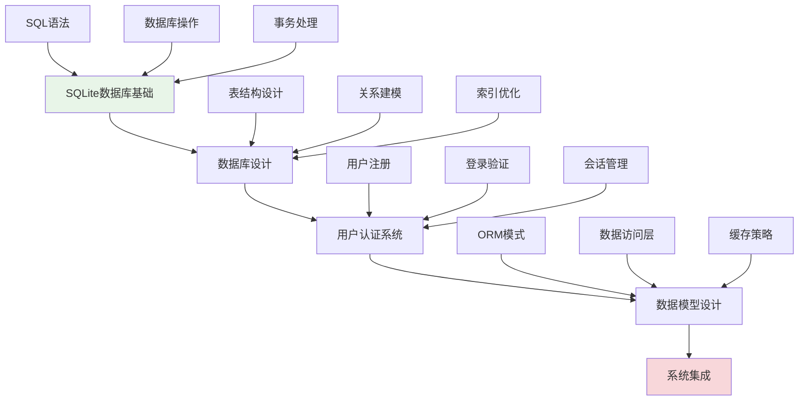

# 第8章：数据库与用户系统

## 🎯 学习目标

通过本章学习，您将能够：
- 掌握SQLite数据库的基本操作和高级特性
- 设计合理的数据库表结构和关系模型
- 实现完整的用户认证和会话管理系统
- 学会数据模型设计和ORM模式应用
- 构建可扩展的数据持久化架构

## 📖 本章概览

本章将为Chat-Room项目添加数据持久化能力，包括用户管理、消息存储、会话管理等功能。我们将学习数据库设计原理、用户认证机制，以及如何构建高效的数据访问层。

### 学习路径

## 📚 章节内容

### 1. [SQLite数据库基础](sqlite-basics.md)
**学习时间：** 4-6小时  
**难度等级：** ⭐⭐

学习内容：
- SQLite数据库的特点和优势
- SQL语法基础和常用操作
- Python sqlite3模块详解
- 数据库连接和事务管理

**Chat-Room应用：** 建立项目数据库，实现基本的增删改查操作

### 2. [数据库设计原理](database-design.md)
**学习时间：** 6-8小时  
**难度等级：** ⭐⭐⭐

学习内容：
- 数据库设计的基本原则
- 实体关系模型（ER模型）
- 数据库范式和规范化
- 索引设计和性能优化

**Chat-Room应用：** 设计用户表、消息表、聊天组表等核心数据结构

### 3. [用户认证系统](user-authentication.md)
**学习时间：** 6-8小时  
**难度等级：** ⭐⭐⭐⭐

学习内容：
- 用户注册和登录流程设计
- 密码加密和安全存储
- 会话管理和令牌机制
- 权限控制和访问验证

**Chat-Room应用：** 实现完整的用户认证系统，支持安全登录和会话管理

### 4. [数据模型设计](data-models.md)
**学习时间：** 4-6小时  
**难度等级：** ⭐⭐⭐

学习内容：
- 数据访问对象（DAO）模式
- 对象关系映射（ORM）基础
- 数据模型的设计和实现
- 数据缓存和性能优化

**Chat-Room应用：** 构建数据访问层，封装数据库操作，提供简洁的API接口

## 🔧 前置知识要求

- **Python基础：** 熟练掌握Python面向对象编程
- **SQL基础：** 了解基本的SQL语法和概念
- **聊天室基础：** 已完成第7章简单聊天室的学习
- **网络编程：** 理解客户端-服务器架构

## ⏱️ 预计学习时间

| 内容 | 预计时间 | 累计时间 |
|------|----------|----------|
| SQLite数据库基础 | 4-6小时 | 4-6小时 |
| 数据库设计原理 | 6-8小时 | 10-14小时 |
| 用户认证系统 | 6-8小时 | 16-22小时 |
| 数据模型设计 | 4-6小时 | 20-28小时 |
| **总计** | **20-28小时** | **3-4天** |

## 📋 学习顺序建议

### 第1天：数据库基础
1. **SQLite数据库基础** - 掌握数据库操作
2. **SQL语法练习** - 熟悉常用SQL语句

### 第2天：设计原理
3. **数据库设计原理** - 学习设计方法
4. **Chat-Room数据库设计** - 设计项目数据结构

### 第3天：用户系统
5. **用户认证系统** - 实现用户管理
6. **安全机制** - 加强系统安全性

### 第4天：数据模型
7. **数据模型设计** - 构建数据访问层
8. **系统集成测试** - 验证整体功能

## ✅ 学习检查清单

### 数据库操作能力
- [ ] 能够创建和管理SQLite数据库
- [ ] 熟练使用SQL语句进行增删改查
- [ ] 理解事务处理和并发控制
- [ ] 掌握数据库连接池管理

### 数据库设计能力
- [ ] 能够设计合理的表结构
- [ ] 理解实体关系模型
- [ ] 掌握数据库范式和规范化
- [ ] 会进行索引设计和优化

### 用户认证能力
- [ ] 能够实现用户注册和登录
- [ ] 掌握密码加密和安全存储
- [ ] 理解会话管理机制
- [ ] 会实现权限控制系统

### 数据模型能力
- [ ] 能够设计数据访问对象
- [ ] 理解ORM模式的应用
- [ ] 掌握数据缓存策略
- [ ] 会优化数据库性能

## 🎯 实践项目

### 阶段性项目：带用户系统的聊天室
在学习过程中，您将为聊天室添加完整的用户系统：

1. **数据库设计阶段：** 设计用户、消息、聊天组等数据表
2. **用户认证阶段：** 实现注册、登录、会话管理功能
3. **数据持久化阶段：** 保存聊天记录和用户信息
4. **系统集成阶段：** 整合数据库功能到聊天室

### 项目特性
- 用户注册和安全登录
- 聊天记录持久化存储
- 用户在线状态管理
- 基础的权限控制

## 🚨 学习难点和解决方案

### 常见难点
1. **数据库设计复杂性**
   - 解决方案：从简单的表结构开始，逐步增加复杂度
   - 重点理解：实体关系和数据规范化

2. **用户认证安全性**
   - 解决方案：使用成熟的加密算法，遵循安全最佳实践
   - 重点理解：密码安全和会话管理

3. **数据库性能优化**
   - 解决方案：合理使用索引，优化查询语句
   - 重点理解：查询优化和缓存策略

### 学习技巧
- **渐进式设计：** 从简单的数据结构开始，逐步完善
- **安全优先：** 始终考虑数据安全和用户隐私
- **性能监控：** 关注数据库操作的性能表现
- **测试验证：** 为数据库操作编写完整的测试用例

## 🔒 安全考虑

### 数据安全
- 密码使用强加密算法存储
- 敏感数据传输加密
- SQL注入攻击防护
- 数据备份和恢复策略

### 访问控制
- 用户权限分级管理
- 会话超时和自动登出
- 操作日志和审计跟踪
- 异常访问检测和防护

## 📊 性能优化

### 数据库优化
- 合理的索引设计
- 查询语句优化
- 连接池管理
- 数据分页和缓存

### 应用层优化
- 数据访问层缓存
- 批量操作优化
- 异步数据库操作
- 内存使用优化

## 📚 下一步学习

数据库与用户系统完成后，请继续学习：
- [第9章：多人聊天系统](../09-multi-user-chat/README.md) - 实现高级聊天功能和群组管理

---

**恭喜！您的聊天室现在具备了完整的用户管理和数据持久化能力！** 🗄️

*本章最后更新：2025-01-17*
