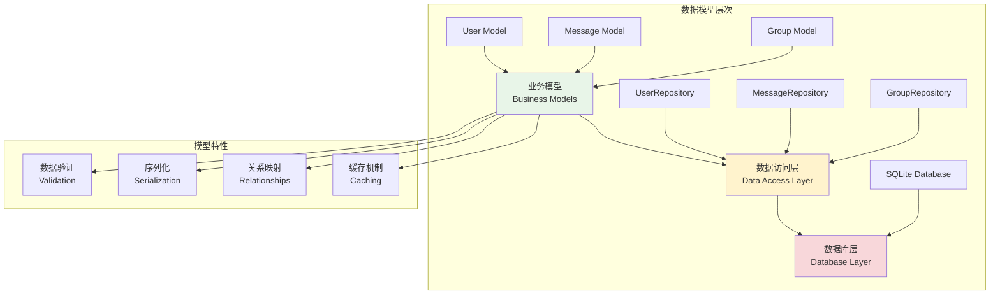

# 数据模型设计

## 🎯 学习目标

通过本章学习，您将能够：
- 理解ORM和数据模型的概念
- 掌握Python中的数据模型设计技巧
- 学会使用dataclass和SQLAlchemy等工具
- 在Chat-Room项目中应用数据模型最佳实践

## 🏗️ 数据模型架构

### 模型层次结构



### Chat-Room数据模型设计

```python
# shared/models/base_model.py - 基础模型类
from dataclasses import dataclass, field
from datetime import datetime
from typing import Optional, Dict, Any, List
import json
import uuid

@dataclass
class BaseModel:
    """
    基础数据模型
    
    提供所有模型的通用功能：
    1. 序列化和反序列化
    2. 数据验证
    3. 字段映射
    4. 时间戳管理
    """
    
    created_at: datetime = field(default_factory=datetime.now)
    updated_at: datetime = field(default_factory=datetime.now)
    
    def to_dict(self) -> Dict[str, Any]:
        """转换为字典格式"""
        result = {}
        
        for field_name, field_value in self.__dict__.items():
            if isinstance(field_value, datetime):
                # 时间格式化
                result[field_name] = field_value.isoformat()
            elif isinstance(field_value, BaseModel):
                # 嵌套模型
                result[field_name] = field_value.to_dict()
            elif isinstance(field_value, list):
                # 列表处理
                result[field_name] = [
                    item.to_dict() if isinstance(item, BaseModel) else item
                    for item in field_value
                ]
            else:
                result[field_name] = field_value
        
        return result
    
    def to_json(self) -> str:
        """转换为JSON字符串"""
        return json.dumps(self.to_dict(), ensure_ascii=False, indent=2)
    
    @classmethod
    def from_dict(cls, data: Dict[str, Any]) -> 'BaseModel':
        """从字典创建模型实例"""
        # 过滤掉不存在的字段
        field_names = {f.name for f in cls.__dataclass_fields__.values()}
        filtered_data = {k: v for k, v in data.items() if k in field_names}
        
        # 处理时间字段
        for field_name, field_info in cls.__dataclass_fields__.items():
            if field_name in filtered_data:
                if field_info.type == datetime and isinstance(filtered_data[field_name], str):
                    filtered_data[field_name] = datetime.fromisoformat(filtered_data[field_name])
        
        return cls(**filtered_data)
    
    @classmethod
    def from_json(cls, json_str: str) -> 'BaseModel':
        """从JSON字符串创建模型实例"""
        data = json.loads(json_str)
        return cls.from_dict(data)
    
    def validate(self) -> List[str]:
        """
        验证模型数据
        
        Returns:
            错误信息列表，空列表表示验证通过
        """
        errors = []
        
        # 子类可以重写此方法添加特定验证
        return errors
    
    def update_timestamp(self):
        """更新时间戳"""
        self.updated_at = datetime.now()

@dataclass
class User(BaseModel):
    """
    用户模型
    
    封装用户相关的所有数据和行为
    """
    
    user_id: Optional[int] = None
    username: str = ""
    password_hash: str = ""
    email: Optional[str] = None
    nickname: Optional[str] = None
    avatar_url: Optional[str] = None
    is_active: bool = True
    is_banned: bool = False
    last_login: Optional[datetime] = None
    
    # 运行时属性（不存储到数据库）
    is_online: bool = field(default=False, init=False)
    current_groups: List[int] = field(default_factory=list, init=False)
    
    def validate(self) -> List[str]:
        """用户数据验证"""
        errors = super().validate()
        
        # 用户名验证
        if not self.username:
            errors.append("用户名不能为空")
        elif len(self.username) < 3 or len(self.username) > 20:
            errors.append("用户名长度必须在3-20字符之间")
        elif not self.username.replace('_', '').isalnum():
            errors.append("用户名只能包含字母、数字和下划线")
        
        # 密码哈希验证
        if not self.password_hash:
            errors.append("密码哈希不能为空")
        
        # 邮箱验证
        if self.email:
            import re
            email_pattern = r'^[a-zA-Z0-9._%+-]+@[a-zA-Z0-9.-]+\.[a-zA-Z]{2,}$'
            if not re.match(email_pattern, self.email):
                errors.append("邮箱格式不正确")
        
        return errors
    
    def get_display_name(self) -> str:
        """获取显示名称"""
        return self.nickname if self.nickname else self.username
    
    def is_valid_for_chat(self) -> bool:
        """检查是否可以参与聊天"""
        return self.is_active and not self.is_banned
    
    def to_public_dict(self) -> Dict[str, Any]:
        """转换为公开信息字典（不包含敏感信息）"""
        return {
            'user_id': self.user_id,
            'username': self.username,
            'nickname': self.nickname,
            'avatar_url': self.avatar_url,
            'is_online': self.is_online,
            'last_login': self.last_login.isoformat() if self.last_login else None
        }

@dataclass
class ChatGroup(BaseModel):
    """
    聊天组模型
    
    管理聊天组的信息和成员
    """
    
    group_id: Optional[int] = None
    group_name: str = ""
    description: Optional[str] = None
    owner_id: int = 0
    max_members: int = 100
    is_public: bool = True
    
    # 运行时属性
    member_count: int = field(default=0, init=False)
    online_members: List[int] = field(default_factory=list, init=False)
    
    def validate(self) -> List[str]:
        """聊天组数据验证"""
        errors = super().validate()
        
        # 群组名验证
        if not self.group_name:
            errors.append("群组名不能为空")
        elif len(self.group_name) < 2 or len(self.group_name) > 50:
            errors.append("群组名长度必须在2-50字符之间")
        
        # 群主ID验证
        if self.owner_id <= 0:
            errors.append("群主ID无效")
        
        # 最大成员数验证
        if self.max_members < 2 or self.max_members > 1000:
            errors.append("最大成员数必须在2-1000之间")
        
        return errors
    
    def is_full(self) -> bool:
        """检查群组是否已满"""
        return self.member_count >= self.max_members
    
    def can_join(self, user_id: int) -> bool:
        """检查用户是否可以加入"""
        return not self.is_full() and user_id not in self.online_members

@dataclass
class Message(BaseModel):
    """
    消息模型
    
    处理各种类型的聊天消息
    """
    
    message_id: Optional[int] = None
    sender_id: int = 0
    group_id: Optional[int] = None
    receiver_id: Optional[int] = None
    message_type: str = "text"
    content: str = ""
    file_path: Optional[str] = None
    file_size: Optional[int] = None
    is_deleted: bool = False
    
    # 运行时属性
    sender_name: str = field(default="", init=False)
    is_read: bool = field(default=False, init=False)
    
    def validate(self) -> List[str]:
        """消息数据验证"""
        errors = super().validate()
        
        # 发送者验证
        if self.sender_id <= 0:
            errors.append("发送者ID无效")
        
        # 消息内容验证
        if not self.content and self.message_type == "text":
            errors.append("文本消息内容不能为空")
        elif len(self.content) > 1000:
            errors.append("消息内容不能超过1000字符")
        
        # 消息类型验证
        valid_types = ["text", "image", "file", "system"]
        if self.message_type not in valid_types:
            errors.append(f"消息类型必须是: {', '.join(valid_types)}")
        
        # 聊天目标验证
        if not self.group_id and not self.receiver_id:
            errors.append("必须指定群组ID或接收者ID")
        
        # 文件消息验证
        if self.message_type in ["image", "file"]:
            if not self.file_path:
                errors.append("文件消息必须包含文件路径")
            if not self.file_size or self.file_size <= 0:
                errors.append("文件大小无效")
        
        return errors
    
    def is_private_message(self) -> bool:
        """检查是否为私聊消息"""
        return self.receiver_id is not None and self.group_id is None
    
    def is_group_message(self) -> bool:
        """检查是否为群组消息"""
        return self.group_id is not None
    
    def get_message_preview(self, max_length: int = 50) -> str:
        """获取消息预览"""
        if self.message_type == "text":
            if len(self.content) <= max_length:
                return self.content
            return self.content[:max_length] + "..."
        elif self.message_type == "image":
            return "[图片]"
        elif self.message_type == "file":
            return f"[文件: {self.file_path}]"
        else:
            return "[系统消息]"

@dataclass
class UserSession(BaseModel):
    """
    用户会话模型
    
    管理用户登录会话信息
    """
    
    session_id: str = ""
    user_id: int = 0
    ip_address: str = ""
    user_agent: str = ""
    expires_at: datetime = field(default_factory=lambda: datetime.now())
    is_active: bool = True
    
    def validate(self) -> List[str]:
        """会话数据验证"""
        errors = super().validate()
        
        # 会话ID验证
        if not self.session_id:
            errors.append("会话ID不能为空")
        elif len(self.session_id) < 16:
            errors.append("会话ID长度不足")
        
        # 用户ID验证
        if self.user_id <= 0:
            errors.append("用户ID无效")
        
        # IP地址验证
        if not self.ip_address:
            errors.append("IP地址不能为空")
        
        # 过期时间验证
        if self.expires_at <= datetime.now():
            errors.append("会话已过期")
        
        return errors
    
    def is_expired(self) -> bool:
        """检查会话是否过期"""
        return datetime.now() > self.expires_at
    
    def extend_session(self, hours: int = 24):
        """延长会话时间"""
        from datetime import timedelta
        self.expires_at = datetime.now() + timedelta(hours=hours)
        self.update_timestamp()

# 模型工厂类
class ModelFactory:
    """
    模型工厂
    
    提供便捷的模型创建方法
    """
    
    @staticmethod
    def create_user(username: str, password_hash: str, **kwargs) -> User:
        """创建用户模型"""
        return User(
            username=username,
            password_hash=password_hash,
            **kwargs
        )
    
    @staticmethod
    def create_group(group_name: str, owner_id: int, **kwargs) -> ChatGroup:
        """创建聊天组模型"""
        return ChatGroup(
            group_name=group_name,
            owner_id=owner_id,
            **kwargs
        )
    
    @staticmethod
    def create_text_message(sender_id: int, content: str, 
                           group_id: int = None, receiver_id: int = None) -> Message:
        """创建文本消息模型"""
        return Message(
            sender_id=sender_id,
            content=content,
            group_id=group_id,
            receiver_id=receiver_id,
            message_type="text"
        )
    
    @staticmethod
    def create_file_message(sender_id: int, file_path: str, file_size: int,
                           group_id: int = None, receiver_id: int = None) -> Message:
        """创建文件消息模型"""
        return Message(
            sender_id=sender_id,
            content=f"文件: {file_path}",
            file_path=file_path,
            file_size=file_size,
            group_id=group_id,
            receiver_id=receiver_id,
            message_type="file"
        )
    
    @staticmethod
    def create_session(session_id: str, user_id: int, ip_address: str, **kwargs) -> UserSession:
        """创建用户会话模型"""
        from datetime import timedelta
        
        return UserSession(
            session_id=session_id,
            user_id=user_id,
            ip_address=ip_address,
            expires_at=datetime.now() + timedelta(hours=24),
            **kwargs
        )

# 使用示例
def demo_data_models():
    """数据模型使用演示"""
    
    print("=== 创建用户模型 ===")
    user = ModelFactory.create_user(
        username="alice",
        password_hash="hashed_password",
        email="alice@example.com",
        nickname="Alice"
    )
    
    print(f"用户信息: {user.to_dict()}")
    
    # 验证用户数据
    errors = user.validate()
    if errors:
        print(f"验证错误: {errors}")
    else:
        print("用户数据验证通过")
    
    print("\n=== 创建聊天组模型 ===")
    group = ModelFactory.create_group(
        group_name="技术讨论",
        owner_id=1,
        description="技术交流群组",
        max_members=50
    )
    
    print(f"群组信息: {group.to_dict()}")
    
    print("\n=== 创建消息模型 ===")
    message = ModelFactory.create_text_message(
        sender_id=1,
        content="Hello everyone!",
        group_id=1
    )
    
    print(f"消息信息: {message.to_dict()}")
    print(f"消息预览: {message.get_message_preview()}")
    
    print("\n=== JSON序列化 ===")
    user_json = user.to_json()
    print(f"用户JSON: {user_json}")
    
    # 从JSON反序列化
    user_from_json = User.from_json(user_json)
    print(f"反序列化用户: {user_from_json.username}")

if __name__ == "__main__":
    demo_data_models()
```

## 🎯 实践练习

### 练习1：扩展用户模型
```python
@dataclass
class ExtendedUser(User):
    """
    扩展用户模型练习
    
    要求：
    1. 添加用户偏好设置
    2. 添加用户统计信息
    3. 实现用户等级系统
    4. 添加社交关系
    """
    
    preferences: Dict[str, Any] = field(default_factory=dict)
    statistics: Dict[str, int] = field(default_factory=dict)
    level: int = 1
    experience: int = 0
    friends: List[int] = field(default_factory=list)
    
    def add_experience(self, points: int):
        """添加经验值"""
        # TODO: 实现经验值和等级系统
        pass
    
    def add_friend(self, friend_id: int):
        """添加好友"""
        # TODO: 实现好友关系管理
        pass
```

### 练习2：消息搜索模型
```python
@dataclass
class MessageSearchQuery:
    """
    消息搜索查询模型练习
    
    要求：
    1. 支持多种搜索条件
    2. 实现搜索结果分页
    3. 添加搜索历史
    4. 优化搜索性能
    """
    
    keyword: str = ""
    sender_id: Optional[int] = None
    group_id: Optional[int] = None
    message_type: Optional[str] = None
    date_from: Optional[datetime] = None
    date_to: Optional[datetime] = None
    page: int = 1
    page_size: int = 20
    
    def build_sql_query(self) -> str:
        """构建SQL查询"""
        # TODO: 实现动态SQL构建
        pass
    
    def execute_search(self, db_connection) -> List[Message]:
        """执行搜索"""
        # TODO: 实现搜索执行逻辑
        pass
```

## ✅ 学习检查

完成本章学习后，请确认您能够：

- [ ] 理解数据模型的设计原则
- [ ] 使用dataclass创建数据模型
- [ ] 实现数据验证和序列化
- [ ] 设计模型之间的关系
- [ ] 应用模型工厂模式
- [ ] 完成实践练习

## 📚 下一步

数据模型设计掌握后，请继续学习：
- [第5章：多人聊天功能](../05-multi-user-chat/group-management.md)

---

**恭喜！您已经完成了数据库与用户系统的学习！** 🎉
