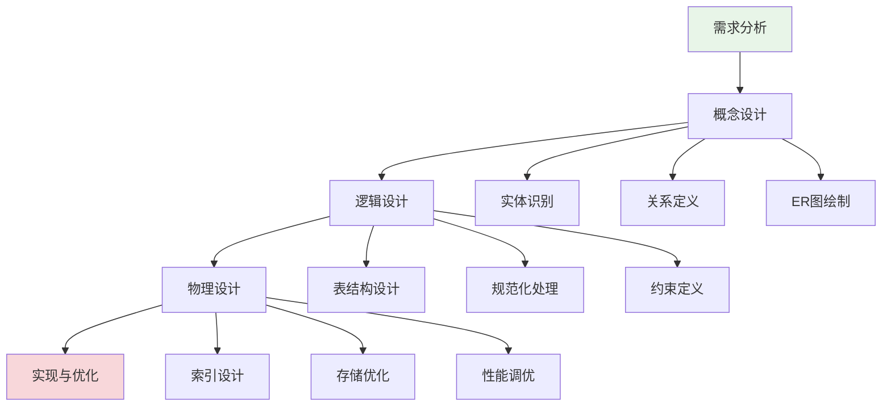
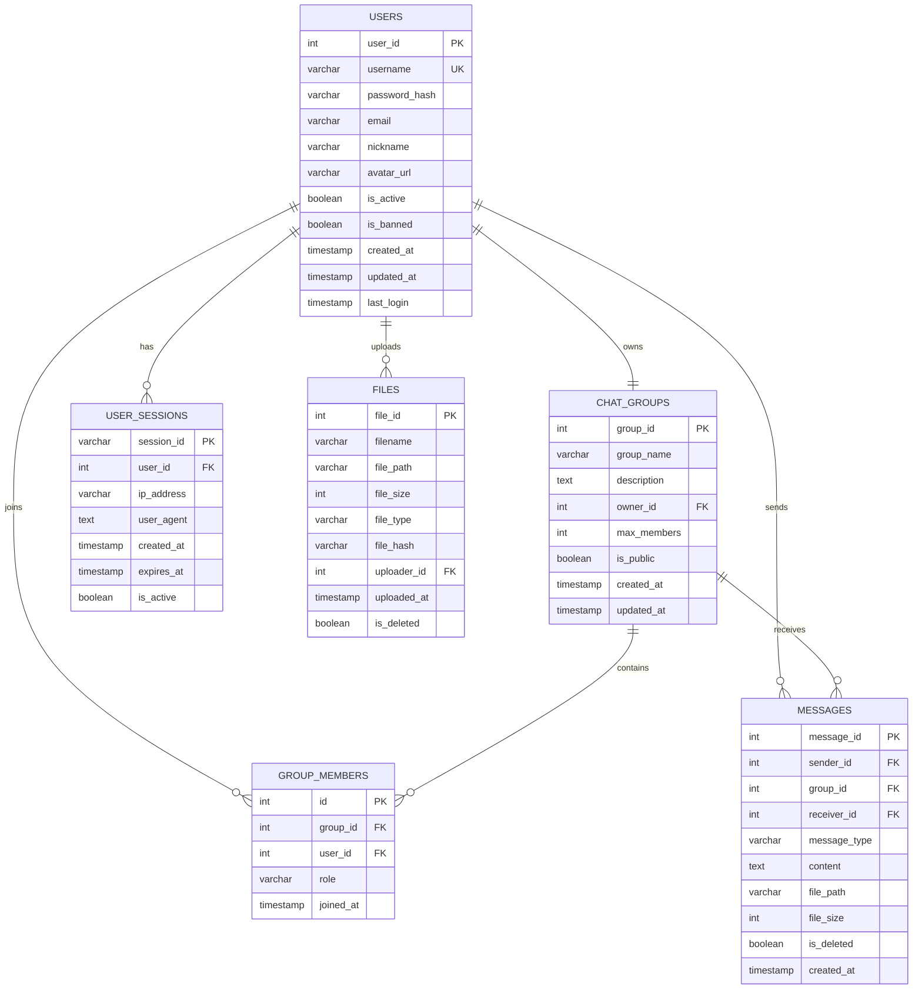

# 数据库设计

## 🎯 学习目标

通过本章学习，您将能够：
- 理解数据库设计的基本原则和方法
- 掌握关系型数据库的设计技巧
- 学会进行数据建模和ER图设计
- 在Chat-Room项目中应用数据库设计最佳实践

## 🏗️ 数据库设计原则

### 设计流程



### Chat-Room需求分析

```python
# docs/database/requirements_analysis.py - 需求分析
"""
Chat-Room数据库需求分析

功能需求：
1. 用户管理
   - 用户注册、登录、资料管理
   - 用户状态跟踪（在线/离线）
   - 用户权限管理（普通用户/管理员）

2. 聊天功能
   - 群组聊天和私聊
   - 消息发送、接收、存储
   - 消息历史查询

3. 群组管理
   - 群组创建、加入、退出
   - 群组成员管理
   - 群组权限控制

4. 文件传输
   - 文件上传、下载
   - 文件信息存储
   - 文件访问控制

5. 系统管理
   - 用户会话管理
   - 系统日志记录
   - 数据统计分析

非功能需求：
1. 性能要求
   - 支持100+并发用户
   - 消息延迟<100ms
   - 数据库查询<50ms

2. 可靠性要求
   - 数据一致性保证
   - 事务ACID特性
   - 数据备份恢复

3. 扩展性要求
   - 支持功能扩展
   - 支持数据量增长
   - 支持性能扩展
"""

class RequirementsAnalysis:
    """需求分析类"""
    
    @staticmethod
    def identify_entities():
        """识别实体"""
        entities = {
            "User": {
                "description": "系统用户",
                "attributes": [
                    "用户ID", "用户名", "密码", "邮箱", 
                    "昵称", "头像", "注册时间", "最后登录时间"
                ],
                "business_rules": [
                    "用户名必须唯一",
                    "密码需要加密存储",
                    "邮箱格式验证"
                ]
            },
            
            "ChatGroup": {
                "description": "聊天群组",
                "attributes": [
                    "群组ID", "群组名", "描述", "创建者",
                    "最大成员数", "是否公开", "创建时间"
                ],
                "business_rules": [
                    "群组名在系统内唯一",
                    "创建者自动成为群主",
                    "群组成员数不能超过限制"
                ]
            },
            
            "Message": {
                "description": "聊天消息",
                "attributes": [
                    "消息ID", "发送者", "接收者/群组", "内容",
                    "消息类型", "发送时间", "是否已读"
                ],
                "business_rules": [
                    "消息内容不能为空",
                    "私聊消息必须有接收者",
                    "群组消息必须指定群组"
                ]
            },
            
            "File": {
                "description": "文件信息",
                "attributes": [
                    "文件ID", "文件名", "文件路径", "文件大小",
                    "文件类型", "上传者", "上传时间"
                ],
                "business_rules": [
                    "文件大小限制",
                    "文件类型限制",
                    "文件名唯一性"
                ]
            }
        }
        
        return entities
    
    @staticmethod
    def identify_relationships():
        """识别关系"""
        relationships = {
            "用户-群组": {
                "type": "多对多",
                "description": "用户可以加入多个群组，群组可以有多个成员",
                "attributes": ["加入时间", "角色", "权限"]
            },
            
            "用户-消息": {
                "type": "一对多",
                "description": "用户可以发送多条消息，每条消息只有一个发送者",
                "attributes": []
            },
            
            "群组-消息": {
                "type": "一对多", 
                "description": "群组可以有多条消息，每条群组消息属于一个群组",
                "attributes": []
            },
            
            "用户-文件": {
                "type": "一对多",
                "description": "用户可以上传多个文件，每个文件只有一个上传者",
                "attributes": []
            }
        }
        
        return relationships
```

## 📊 ER图设计

### Chat-Room实体关系图



### 表结构详细设计

```python
# server/database/table_design.py - 表结构设计
from dataclasses import dataclass
from typing import List, Optional, Dict, Any
from enum import Enum

class FieldType(Enum):
    """字段类型枚举"""
    INTEGER = "INTEGER"
    VARCHAR = "VARCHAR"
    TEXT = "TEXT"
    BOOLEAN = "BOOLEAN"
    TIMESTAMP = "TIMESTAMP"
    BLOB = "BLOB"

class ConstraintType(Enum):
    """约束类型枚举"""
    PRIMARY_KEY = "PRIMARY KEY"
    FOREIGN_KEY = "FOREIGN KEY"
    UNIQUE = "UNIQUE"
    NOT_NULL = "NOT NULL"
    CHECK = "CHECK"
    DEFAULT = "DEFAULT"

@dataclass
class FieldDefinition:
    """字段定义"""
    name: str
    type: FieldType
    length: Optional[int] = None
    constraints: List[str] = None
    default_value: Optional[str] = None
    comment: str = ""
    
    def __post_init__(self):
        if self.constraints is None:
            self.constraints = []

@dataclass
class TableDefinition:
    """表定义"""
    name: str
    fields: List[FieldDefinition]
    indexes: List[str] = None
    comment: str = ""
    
    def __post_init__(self):
        if self.indexes is None:
            self.indexes = []

class ChatRoomTableDesign:
    """Chat-Room表结构设计"""
    
    @staticmethod
    def get_users_table() -> TableDefinition:
        """用户表设计"""
        fields = [
            FieldDefinition(
                name="user_id",
                type=FieldType.INTEGER,
                constraints=["PRIMARY KEY", "AUTOINCREMENT"],
                comment="用户唯一标识"
            ),
            FieldDefinition(
                name="username",
                type=FieldType.VARCHAR,
                length=50,
                constraints=["NOT NULL", "UNIQUE"],
                comment="用户名，登录凭证"
            ),
            FieldDefinition(
                name="password_hash",
                type=FieldType.VARCHAR,
                length=255,
                constraints=["NOT NULL"],
                comment="密码哈希值"
            ),
            FieldDefinition(
                name="email",
                type=FieldType.VARCHAR,
                length=100,
                comment="用户邮箱"
            ),
            FieldDefinition(
                name="nickname",
                type=FieldType.VARCHAR,
                length=50,
                comment="用户昵称，显示名称"
            ),
            FieldDefinition(
                name="avatar_url",
                type=FieldType.VARCHAR,
                length=255,
                comment="头像URL"
            ),
            FieldDefinition(
                name="is_active",
                type=FieldType.BOOLEAN,
                default_value="1",
                comment="账户是否激活"
            ),
            FieldDefinition(
                name="is_banned",
                type=FieldType.BOOLEAN,
                default_value="0",
                comment="是否被禁用"
            ),
            FieldDefinition(
                name="created_at",
                type=FieldType.TIMESTAMP,
                default_value="CURRENT_TIMESTAMP",
                comment="账户创建时间"
            ),
            FieldDefinition(
                name="updated_at",
                type=FieldType.TIMESTAMP,
                default_value="CURRENT_TIMESTAMP",
                comment="最后更新时间"
            ),
            FieldDefinition(
                name="last_login",
                type=FieldType.TIMESTAMP,
                comment="最后登录时间"
            )
        ]
        
        indexes = [
            "CREATE INDEX idx_users_username ON users(username)",
            "CREATE INDEX idx_users_email ON users(email)",
            "CREATE INDEX idx_users_created ON users(created_at)"
        ]
        
        return TableDefinition(
            name="users",
            fields=fields,
            indexes=indexes,
            comment="用户基础信息表"
        )
    
    @staticmethod
    def get_messages_table() -> TableDefinition:
        """消息表设计"""
        fields = [
            FieldDefinition(
                name="message_id",
                type=FieldType.INTEGER,
                constraints=["PRIMARY KEY", "AUTOINCREMENT"],
                comment="消息唯一标识"
            ),
            FieldDefinition(
                name="sender_id",
                type=FieldType.INTEGER,
                constraints=["NOT NULL"],
                comment="发送者用户ID"
            ),
            FieldDefinition(
                name="group_id",
                type=FieldType.INTEGER,
                comment="群组ID，NULL表示私聊"
            ),
            FieldDefinition(
                name="receiver_id",
                type=FieldType.INTEGER,
                comment="接收者ID，私聊时使用"
            ),
            FieldDefinition(
                name="message_type",
                type=FieldType.VARCHAR,
                length=20,
                default_value="'text'",
                comment="消息类型：text, image, file, system"
            ),
            FieldDefinition(
                name="content",
                type=FieldType.TEXT,
                constraints=["NOT NULL"],
                comment="消息内容"
            ),
            FieldDefinition(
                name="file_path",
                type=FieldType.VARCHAR,
                length=255,
                comment="文件路径（文件消息）"
            ),
            FieldDefinition(
                name="file_size",
                type=FieldType.INTEGER,
                comment="文件大小（字节）"
            ),
            FieldDefinition(
                name="is_deleted",
                type=FieldType.BOOLEAN,
                default_value="0",
                comment="是否已删除（软删除）"
            ),
            FieldDefinition(
                name="created_at",
                type=FieldType.TIMESTAMP,
                default_value="CURRENT_TIMESTAMP",
                comment="消息发送时间"
            )
        ]
        
        indexes = [
            "CREATE INDEX idx_messages_sender ON messages(sender_id)",
            "CREATE INDEX idx_messages_group ON messages(group_id)",
            "CREATE INDEX idx_messages_receiver ON messages(receiver_id)",
            "CREATE INDEX idx_messages_created ON messages(created_at)",
            "CREATE INDEX idx_messages_type ON messages(message_type)"
        ]
        
        return TableDefinition(
            name="messages",
            fields=fields,
            indexes=indexes,
            comment="聊天消息表"
        )
    
    @staticmethod
    def generate_create_sql(table_def: TableDefinition) -> str:
        """生成建表SQL"""
        sql_parts = [f"CREATE TABLE IF NOT EXISTS {table_def.name} ("]
        
        # 字段定义
        field_sqls = []
        for field in table_def.fields:
            field_sql = f"    {field.name} {field.type.value}"
            
            # 添加长度
            if field.length:
                field_sql += f"({field.length})"
            
            # 添加约束
            if field.constraints:
                field_sql += " " + " ".join(field.constraints)
            
            # 添加默认值
            if field.default_value:
                field_sql += f" DEFAULT {field.default_value}"
            
            field_sqls.append(field_sql)
        
        sql_parts.append(",\n".join(field_sqls))
        sql_parts.append(");")
        
        return "\n".join(sql_parts)

# 使用示例
def demo_table_design():
    """表设计演示"""
    design = ChatRoomTableDesign()
    
    # 生成用户表SQL
    users_table = design.get_users_table()
    users_sql = design.generate_create_sql(users_table)
    print("=== 用户表SQL ===")
    print(users_sql)
    
    # 生成消息表SQL
    messages_table = design.get_messages_table()
    messages_sql = design.generate_create_sql(messages_table)
    print("\n=== 消息表SQL ===")
    print(messages_sql)
```

## 🔧 数据库规范化

### 规范化理论

```python
# docs/database/normalization.py - 数据库规范化
"""
数据库规范化理论与实践

规范化的目的：
1. 消除数据冗余
2. 避免更新异常
3. 提高数据一致性
4. 节省存储空间

规范化级别：
1. 第一范式（1NF）：原子性
2. 第二范式（2NF）：消除部分依赖
3. 第三范式（3NF）：消除传递依赖
4. BCNF：消除主属性对候选键的部分依赖
"""

class NormalizationExample:
    """规范化示例"""
    
    @staticmethod
    def demonstrate_1nf():
        """第一范式示例"""
        print("=== 第一范式（1NF）===")
        
        # 违反1NF的设计
        bad_design = """
        用户表（违反1NF）：
        | user_id | username | hobbies        |
        |---------|----------|----------------|
        | 1       | alice    | 读书,游戏,音乐  |
        | 2       | bob      | 运动,电影      |
        
        问题：hobbies字段包含多个值，违反原子性
        """
        
        # 符合1NF的设计
        good_design = """
        用户表（符合1NF）：
        | user_id | username |
        |---------|----------|
        | 1       | alice    |
        | 2       | bob      |
        
        用户爱好表：
        | user_id | hobby |
        |---------|-------|
        | 1       | 读书   |
        | 1       | 游戏   |
        | 1       | 音乐   |
        | 2       | 运动   |
        | 2       | 电影   |
        """
        
        print(bad_design)
        print(good_design)
    
    @staticmethod
    def demonstrate_2nf():
        """第二范式示例"""
        print("=== 第二范式（2NF）===")
        
        # 违反2NF的设计
        bad_design = """
        订单详情表（违反2NF）：
        | order_id | product_id | product_name | quantity | price |
        |----------|------------|--------------|----------|-------|
        | 1        | 101        | 商品A        | 2        | 100   |
        | 1        | 102        | 商品B        | 1        | 200   |
        
        问题：product_name只依赖于product_id，不依赖于完整主键
        """
        
        # 符合2NF的设计
        good_design = """
        订单详情表（符合2NF）：
        | order_id | product_id | quantity |
        |----------|------------|----------|
        | 1        | 101        | 2        |
        | 1        | 102        | 1        |
        
        产品表：
        | product_id | product_name | price |
        |------------|--------------|-------|
        | 101        | 商品A        | 100   |
        | 102        | 商品B        | 200   |
        """
        
        print(bad_design)
        print(good_design)
    
    @staticmethod
    def demonstrate_3nf():
        """第三范式示例"""
        print("=== 第三范式（3NF）===")
        
        # 违反3NF的设计
        bad_design = """
        员工表（违反3NF）：
        | emp_id | emp_name | dept_id | dept_name |
        |--------|----------|---------|-----------|
        | 1      | 张三     | 10      | 技术部    |
        | 2      | 李四     | 20      | 销售部    |
        
        问题：dept_name依赖于dept_id，存在传递依赖
        """
        
        # 符合3NF的设计
        good_design = """
        员工表（符合3NF）：
        | emp_id | emp_name | dept_id |
        |--------|----------|---------|
        | 1      | 张三     | 10      |
        | 2      | 李四     | 20      |
        
        部门表：
        | dept_id | dept_name |
        |---------|-----------|
        | 10      | 技术部    |
        | 20      | 销售部    |
        """
        
        print(bad_design)
        print(good_design)

class ChatRoomNormalization:
    """Chat-Room规范化分析"""
    
    @staticmethod
    def analyze_normalization():
        """分析Chat-Room表的规范化程度"""
        analysis = {
            "users表": {
                "1NF": "✅ 所有字段都是原子值",
                "2NF": "✅ 只有一个主键，不存在部分依赖",
                "3NF": "✅ 不存在传递依赖",
                "结论": "完全规范化"
            },
            
            "messages表": {
                "1NF": "✅ 所有字段都是原子值",
                "2NF": "✅ 只有一个主键，不存在部分依赖", 
                "3NF": "✅ 不存在传递依赖",
                "结论": "完全规范化"
            },
            
            "group_members表": {
                "1NF": "✅ 所有字段都是原子值",
                "2NF": "✅ 联合主键，但非主键字段完全依赖于主键",
                "3NF": "✅ 不存在传递依赖",
                "结论": "完全规范化"
            }
        }
        
        return analysis
    
    @staticmethod
    def identify_denormalization_opportunities():
        """识别反规范化机会"""
        opportunities = {
            "消息表添加发送者昵称": {
                "原因": "避免每次查询都要关联用户表",
                "代价": "数据冗余，用户昵称变更时需要更新",
                "建议": "根据查询频率决定是否实施"
            },
            
            "群组表添加成员数量": {
                "原因": "快速获取群组成员数，避免COUNT查询",
                "代价": "需要维护计数器的一致性",
                "建议": "推荐实施，查询频率高"
            },
            
            "用户表添加最后消息时间": {
                "原因": "快速排序活跃用户",
                "代价": "每次发消息都要更新用户表",
                "建议": "可以考虑，但要注意更新频率"
            }
        }
        
        return opportunities
```

## 🎯 实践练习

### 练习1：设计用户权限系统
```python
class UserPermissionSystem:
    """
    用户权限系统设计练习
    
    要求：
    1. 设计角色权限表结构
    2. 实现RBAC模型
    3. 支持权限继承
    4. 考虑性能优化
    """
    
    def design_permission_tables(self):
        """设计权限相关表"""
        # TODO: 设计角色表、权限表、用户角色关联表
        pass
    
    def implement_rbac_model(self):
        """实现RBAC模型"""
        # TODO: 实现基于角色的访问控制
        pass
```

### 练习2：设计消息分表策略
```python
class MessageSharding:
    """
    消息分表策略练习
    
    要求：
    1. 设计分表规则
    2. 实现跨表查询
    3. 考虑数据迁移
    4. 优化查询性能
    """
    
    def design_sharding_strategy(self):
        """设计分表策略"""
        # TODO: 按时间或用户ID分表
        pass
    
    def implement_cross_table_query(self):
        """实现跨表查询"""
        # TODO: 实现分表查询逻辑
        pass
```

## ✅ 学习检查

完成本章学习后，请确认您能够：

- [ ] 理解数据库设计的基本流程
- [ ] 绘制ER图和设计表结构
- [ ] 应用数据库规范化理论
- [ ] 识别和处理数据冗余问题
- [ ] 设计高效的索引策略
- [ ] 完成实践练习

## 📚 下一步

数据库设计掌握后，请继续学习：
- [用户认证系统](user-authentication.md)
- [数据模型设计](data-models.md)

---

**现在您已经掌握了数据库设计的核心技能！** 🎉
