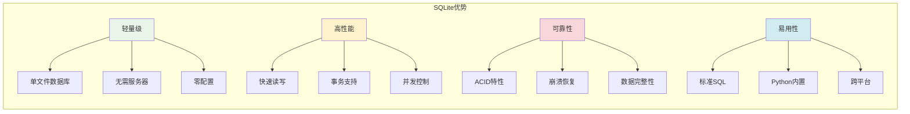

# SQLite数据库基础

## 🎯 学习目标

通过本章学习，您将能够：
- 理解SQLite数据库的特点和适用场景
- 掌握SQL语言的基本语法和操作
- 学会在Python中使用SQLite数据库
- 在Chat-Room项目中应用数据库技术

## 🗄️ SQLite简介

### 为什么Chat-Room选择SQLite？



**Chat-Room使用SQLite的原因**：
- **简单部署**：无需安装数据库服务器
- **学习友好**：适合初学者理解数据库概念
- **功能完整**：支持复杂查询和事务
- **性能良好**：满足中小型应用需求

### SQLite vs 其他数据库

```python
# shared/database/database_comparison.py - 数据库对比
"""
数据库选择对比分析

SQLite vs MySQL vs PostgreSQL

特性对比：
"""

database_comparison = {
    "SQLite": {
        "优势": [
            "零配置，开箱即用",
            "单文件存储，易于备份",
            "Python内置支持",
            "适合开发和测试"
        ],
        "劣势": [
            "并发写入有限",
            "不支持网络访问",
            "功能相对简单"
        ],
        "适用场景": [
            "桌面应用",
            "移动应用",
            "原型开发",
            "小型Web应用"
        ]
    },
    
    "MySQL": {
        "优势": [
            "高并发支持",
            "网络访问",
            "丰富的存储引擎",
            "广泛的社区支持"
        ],
        "劣势": [
            "需要服务器配置",
            "资源消耗较大",
            "学习成本高"
        ],
        "适用场景": [
            "Web应用",
            "企业系统",
            "高并发场景"
        ]
    }
}

def why_sqlite_for_chatroom():
    """为什么Chat-Room选择SQLite"""
    reasons = {
        "学习目的": "SQLite简单易学，适合理解数据库基础概念",
        "部署简单": "无需配置数据库服务器，降低学习门槛",
        "功能足够": "支持Chat-Room所需的所有数据库功能",
        "性能满足": "对于学习项目，SQLite性能完全够用",
        "可扩展性": "后期可以轻松迁移到其他数据库"
    }
    
    return reasons
```

## 📊 SQL语言基础

### 数据定义语言（DDL）

```python
# server/database/schema.py - 数据库模式定义
import sqlite3
from typing import Optional

class DatabaseSchema:
    """
    Chat-Room数据库模式定义
    
    包含所有表的创建语句和索引定义
    """
    
    # 用户表
    CREATE_USERS_TABLE = """
    CREATE TABLE IF NOT EXISTS users (
        user_id INTEGER PRIMARY KEY AUTOINCREMENT,  -- 用户ID（主键）
        username VARCHAR(50) NOT NULL UNIQUE,       -- 用户名（唯一）
        password_hash VARCHAR(255) NOT NULL,        -- 密码哈希
        email VARCHAR(100),                         -- 邮箱
        nickname VARCHAR(50),                       -- 昵称
        avatar_url VARCHAR(255),                    -- 头像URL
        is_active BOOLEAN DEFAULT 1,                -- 是否激活
        is_banned BOOLEAN DEFAULT 0,                -- 是否被禁用
        created_at TIMESTAMP DEFAULT CURRENT_TIMESTAMP,  -- 创建时间
        updated_at TIMESTAMP DEFAULT CURRENT_TIMESTAMP,  -- 更新时间
        last_login TIMESTAMP                        -- 最后登录时间
    );
    """
    
    # 聊天组表
    CREATE_GROUPS_TABLE = """
    CREATE TABLE IF NOT EXISTS chat_groups (
        group_id INTEGER PRIMARY KEY AUTOINCREMENT, -- 群组ID
        group_name VARCHAR(100) NOT NULL,           -- 群组名称
        description TEXT,                           -- 群组描述
        owner_id INTEGER NOT NULL,                  -- 群主ID
        max_members INTEGER DEFAULT 100,            -- 最大成员数
        is_public BOOLEAN DEFAULT 1,                -- 是否公开
        created_at TIMESTAMP DEFAULT CURRENT_TIMESTAMP,
        updated_at TIMESTAMP DEFAULT CURRENT_TIMESTAMP,
        
        FOREIGN KEY (owner_id) REFERENCES users(user_id)
    );
    """
    
    # 群组成员表
    CREATE_GROUP_MEMBERS_TABLE = """
    CREATE TABLE IF NOT EXISTS group_members (
        id INTEGER PRIMARY KEY AUTOINCREMENT,
        group_id INTEGER NOT NULL,                  -- 群组ID
        user_id INTEGER NOT NULL,                   -- 用户ID
        role VARCHAR(20) DEFAULT 'member',          -- 角色：owner, admin, member
        joined_at TIMESTAMP DEFAULT CURRENT_TIMESTAMP,
        
        FOREIGN KEY (group_id) REFERENCES chat_groups(group_id),
        FOREIGN KEY (user_id) REFERENCES users(user_id),
        UNIQUE(group_id, user_id)                   -- 联合唯一约束
    );
    """
    
    # 消息表
    CREATE_MESSAGES_TABLE = """
    CREATE TABLE IF NOT EXISTS messages (
        message_id INTEGER PRIMARY KEY AUTOINCREMENT,
        sender_id INTEGER NOT NULL,                 -- 发送者ID
        group_id INTEGER,                           -- 群组ID（NULL表示私聊）
        receiver_id INTEGER,                        -- 接收者ID（私聊时使用）
        message_type VARCHAR(20) DEFAULT 'text',    -- 消息类型：text, image, file
        content TEXT NOT NULL,                      -- 消息内容
        file_path VARCHAR(255),                     -- 文件路径（文件消息）
        file_size INTEGER,                          -- 文件大小
        is_deleted BOOLEAN DEFAULT 0,               -- 是否已删除
        created_at TIMESTAMP DEFAULT CURRENT_TIMESTAMP,
        
        FOREIGN KEY (sender_id) REFERENCES users(user_id),
        FOREIGN KEY (group_id) REFERENCES chat_groups(group_id),
        FOREIGN KEY (receiver_id) REFERENCES users(user_id)
    );
    """
    
    # 用户会话表
    CREATE_SESSIONS_TABLE = """
    CREATE TABLE IF NOT EXISTS user_sessions (
        session_id VARCHAR(255) PRIMARY KEY,        -- 会话ID
        user_id INTEGER NOT NULL,                   -- 用户ID
        ip_address VARCHAR(45),                     -- IP地址
        user_agent TEXT,                            -- 用户代理
        created_at TIMESTAMP DEFAULT CURRENT_TIMESTAMP,
        expires_at TIMESTAMP NOT NULL,              -- 过期时间
        is_active BOOLEAN DEFAULT 1,                -- 是否活跃
        
        FOREIGN KEY (user_id) REFERENCES users(user_id)
    );
    """
    
    # 索引定义
    CREATE_INDEXES = [
        "CREATE INDEX IF NOT EXISTS idx_users_username ON users(username);",
        "CREATE INDEX IF NOT EXISTS idx_users_email ON users(email);",
        "CREATE INDEX IF NOT EXISTS idx_messages_sender ON messages(sender_id);",
        "CREATE INDEX IF NOT EXISTS idx_messages_group ON messages(group_id);",
        "CREATE INDEX IF NOT EXISTS idx_messages_created ON messages(created_at);",
        "CREATE INDEX IF NOT EXISTS idx_group_members_group ON group_members(group_id);",
        "CREATE INDEX IF NOT EXISTS idx_group_members_user ON group_members(user_id);",
        "CREATE INDEX IF NOT EXISTS idx_sessions_user ON user_sessions(user_id);",
        "CREATE INDEX IF NOT EXISTS idx_sessions_expires ON user_sessions(expires_at);"
    ]
    
    @classmethod
    def create_all_tables(cls, db_path: str = "data/chatroom.db"):
        """创建所有表和索引"""
        try:
            # 确保数据目录存在
            import os
            os.makedirs(os.path.dirname(db_path), exist_ok=True)
            
            # 连接数据库
            conn = sqlite3.connect(db_path)
            cursor = conn.cursor()
            
            # 创建表
            tables = [
                cls.CREATE_USERS_TABLE,
                cls.CREATE_GROUPS_TABLE,
                cls.CREATE_GROUP_MEMBERS_TABLE,
                cls.CREATE_MESSAGES_TABLE,
                cls.CREATE_SESSIONS_TABLE
            ]
            
            for table_sql in tables:
                cursor.execute(table_sql)
                print(f"表创建成功")
            
            # 创建索引
            for index_sql in cls.CREATE_INDEXES:
                cursor.execute(index_sql)
            
            print("所有索引创建成功")
            
            # 提交事务
            conn.commit()
            print(f"数据库初始化完成: {db_path}")
            
        except Exception as e:
            print(f"数据库初始化失败: {e}")
            if conn:
                conn.rollback()
        finally:
            if conn:
                conn.close()

# 使用示例
def demo_database_creation():
    """数据库创建演示"""
    print("=== 创建Chat-Room数据库 ===")
    DatabaseSchema.create_all_tables()
```

### 数据操作语言（DML）

```python
# server/database/basic_operations.py - 基础数据操作
import sqlite3
import hashlib
from datetime import datetime, timedelta
from typing import List, Dict, Any, Optional

class BasicDatabaseOperations:
    """
    基础数据库操作
    
    演示增删改查（CRUD）操作
    """
    
    def __init__(self, db_path: str = "data/chatroom.db"):
        self.db_path = db_path
    
    def get_connection(self) -> sqlite3.Connection:
        """获取数据库连接"""
        conn = sqlite3.connect(self.db_path)
        # 设置行工厂，返回字典格式的结果
        conn.row_factory = sqlite3.Row
        return conn
    
    # CREATE 操作 - 插入数据
    def create_user(self, username: str, password: str, 
                   email: str = None, nickname: str = None) -> Optional[int]:
        """
        创建新用户
        
        Args:
            username: 用户名
            password: 密码
            email: 邮箱
            nickname: 昵称
            
        Returns:
            新用户的ID，失败返回None
        """
        try:
            # 密码哈希
            password_hash = hashlib.sha256(password.encode()).hexdigest()
            
            conn = self.get_connection()
            cursor = conn.cursor()
            
            # 插入用户数据
            insert_sql = """
            INSERT INTO users (username, password_hash, email, nickname)
            VALUES (?, ?, ?, ?)
            """
            
            cursor.execute(insert_sql, (username, password_hash, email, nickname))
            
            # 获取新插入的用户ID
            user_id = cursor.lastrowid
            
            conn.commit()
            conn.close()
            
            print(f"用户创建成功: {username} (ID: {user_id})")
            return user_id
            
        except sqlite3.IntegrityError as e:
            print(f"用户创建失败，用户名可能已存在: {e}")
            return None
        except Exception as e:
            print(f"用户创建失败: {e}")
            return None
    
    def create_group(self, group_name: str, owner_id: int, 
                    description: str = None, max_members: int = 100) -> Optional[int]:
        """创建聊天组"""
        try:
            conn = self.get_connection()
            cursor = conn.cursor()
            
            insert_sql = """
            INSERT INTO chat_groups (group_name, description, owner_id, max_members)
            VALUES (?, ?, ?, ?)
            """
            
            cursor.execute(insert_sql, (group_name, description, owner_id, max_members))
            group_id = cursor.lastrowid
            
            # 将群主添加为成员
            member_sql = """
            INSERT INTO group_members (group_id, user_id, role)
            VALUES (?, ?, 'owner')
            """
            cursor.execute(member_sql, (group_id, owner_id))
            
            conn.commit()
            conn.close()
            
            print(f"聊天组创建成功: {group_name} (ID: {group_id})")
            return group_id
            
        except Exception as e:
            print(f"聊天组创建失败: {e}")
            return None
    
    def create_message(self, sender_id: int, content: str, 
                      group_id: int = None, receiver_id: int = None) -> Optional[int]:
        """创建消息"""
        try:
            conn = self.get_connection()
            cursor = conn.cursor()
            
            insert_sql = """
            INSERT INTO messages (sender_id, group_id, receiver_id, content)
            VALUES (?, ?, ?, ?)
            """
            
            cursor.execute(insert_sql, (sender_id, group_id, receiver_id, content))
            message_id = cursor.lastrowid
            
            conn.commit()
            conn.close()
            
            return message_id
            
        except Exception as e:
            print(f"消息创建失败: {e}")
            return None
    
    # READ 操作 - 查询数据
    def get_user_by_username(self, username: str) -> Optional[Dict[str, Any]]:
        """根据用户名查询用户"""
        try:
            conn = self.get_connection()
            cursor = conn.cursor()
            
            select_sql = """
            SELECT user_id, username, password_hash, email, nickname,
                   is_active, is_banned, created_at, last_login
            FROM users
            WHERE username = ?
            """
            
            cursor.execute(select_sql, (username,))
            row = cursor.fetchone()
            
            conn.close()
            
            if row:
                return dict(row)
            return None
            
        except Exception as e:
            print(f"查询用户失败: {e}")
            return None
    
    def get_user_groups(self, user_id: int) -> List[Dict[str, Any]]:
        """获取用户加入的所有群组"""
        try:
            conn = self.get_connection()
            cursor = conn.cursor()
            
            select_sql = """
            SELECT g.group_id, g.group_name, g.description, 
                   gm.role, gm.joined_at
            FROM chat_groups g
            JOIN group_members gm ON g.group_id = gm.group_id
            WHERE gm.user_id = ?
            ORDER BY gm.joined_at DESC
            """
            
            cursor.execute(select_sql, (user_id,))
            rows = cursor.fetchall()
            
            conn.close()
            
            return [dict(row) for row in rows]
            
        except Exception as e:
            print(f"查询用户群组失败: {e}")
            return []
    
    def get_group_messages(self, group_id: int, limit: int = 50) -> List[Dict[str, Any]]:
        """获取群组消息"""
        try:
            conn = self.get_connection()
            cursor = conn.cursor()
            
            select_sql = """
            SELECT m.message_id, m.content, m.message_type, m.created_at,
                   u.username, u.nickname
            FROM messages m
            JOIN users u ON m.sender_id = u.user_id
            WHERE m.group_id = ? AND m.is_deleted = 0
            ORDER BY m.created_at DESC
            LIMIT ?
            """
            
            cursor.execute(select_sql, (group_id, limit))
            rows = cursor.fetchall()
            
            conn.close()
            
            # 按时间正序返回
            return [dict(row) for row in reversed(rows)]
            
        except Exception as e:
            print(f"查询群组消息失败: {e}")
            return []
    
    # UPDATE 操作 - 更新数据
    def update_user_last_login(self, user_id: int):
        """更新用户最后登录时间"""
        try:
            conn = self.get_connection()
            cursor = conn.cursor()
            
            update_sql = """
            UPDATE users 
            SET last_login = CURRENT_TIMESTAMP,
                updated_at = CURRENT_TIMESTAMP
            WHERE user_id = ?
            """
            
            cursor.execute(update_sql, (user_id,))
            conn.commit()
            conn.close()
            
        except Exception as e:
            print(f"更新用户登录时间失败: {e}")
    
    def update_user_profile(self, user_id: int, **kwargs):
        """更新用户资料"""
        try:
            # 构建动态更新语句
            allowed_fields = ['nickname', 'email', 'avatar_url']
            update_fields = []
            values = []
            
            for field, value in kwargs.items():
                if field in allowed_fields and value is not None:
                    update_fields.append(f"{field} = ?")
                    values.append(value)
            
            if not update_fields:
                return
            
            # 添加更新时间
            update_fields.append("updated_at = CURRENT_TIMESTAMP")
            values.append(user_id)
            
            conn = self.get_connection()
            cursor = conn.cursor()
            
            update_sql = f"""
            UPDATE users 
            SET {', '.join(update_fields)}
            WHERE user_id = ?
            """
            
            cursor.execute(update_sql, values)
            conn.commit()
            conn.close()
            
            print(f"用户资料更新成功: {user_id}")
            
        except Exception as e:
            print(f"更新用户资料失败: {e}")
    
    # DELETE 操作 - 删除数据
    def delete_message(self, message_id: int, user_id: int) -> bool:
        """删除消息（软删除）"""
        try:
            conn = self.get_connection()
            cursor = conn.cursor()
            
            # 检查消息是否属于该用户
            check_sql = """
            SELECT sender_id FROM messages WHERE message_id = ?
            """
            cursor.execute(check_sql, (message_id,))
            row = cursor.fetchone()
            
            if not row or row['sender_id'] != user_id:
                print("无权限删除该消息")
                return False
            
            # 软删除消息
            delete_sql = """
            UPDATE messages 
            SET is_deleted = 1 
            WHERE message_id = ?
            """
            
            cursor.execute(delete_sql, (message_id,))
            conn.commit()
            conn.close()
            
            print(f"消息删除成功: {message_id}")
            return True
            
        except Exception as e:
            print(f"删除消息失败: {e}")
            return False
    
    def leave_group(self, user_id: int, group_id: int) -> bool:
        """离开群组"""
        try:
            conn = self.get_connection()
            cursor = conn.cursor()
            
            delete_sql = """
            DELETE FROM group_members 
            WHERE user_id = ? AND group_id = ?
            """
            
            cursor.execute(delete_sql, (user_id, group_id))
            
            if cursor.rowcount > 0:
                conn.commit()
                print(f"用户 {user_id} 已离开群组 {group_id}")
                result = True
            else:
                print("用户不在该群组中")
                result = False
            
            conn.close()
            return result
            
        except Exception as e:
            print(f"离开群组失败: {e}")
            return False

# 使用示例
def demo_basic_operations():
    """基础操作演示"""
    db_ops = BasicDatabaseOperations()
    
    print("=== 创建用户 ===")
    user1_id = db_ops.create_user("alice", "password123", "alice@example.com", "Alice")
    user2_id = db_ops.create_user("bob", "password456", "bob@example.com", "Bob")
    
    print("\n=== 创建群组 ===")
    group_id = db_ops.create_group("技术讨论", user1_id, "技术交流群组")
    
    print("\n=== 查询用户 ===")
    user = db_ops.get_user_by_username("alice")
    print(f"查询到用户: {user}")
    
    print("\n=== 发送消息 ===")
    message_id = db_ops.create_message(user1_id, "Hello everyone!", group_id)
    
    print("\n=== 查询消息 ===")
    messages = db_ops.get_group_messages(group_id)
    for msg in messages:
        print(f"[{msg['created_at']}] {msg['username']}: {msg['content']}")
```

## 🎯 实践练习

### 练习1：数据库查询优化
```python
class QueryOptimization:
    """
    查询优化练习
    
    要求：
    1. 分析查询性能
    2. 优化慢查询
    3. 使用索引提升性能
    4. 实现查询缓存
    """
    
    def __init__(self, db_path: str):
        # TODO: 初始化查询优化器
        pass
    
    def analyze_query_performance(self, sql: str):
        """分析查询性能"""
        # TODO: 实现查询性能分析
        pass
    
    def optimize_slow_queries(self):
        """优化慢查询"""
        # TODO: 实现慢查询优化
        pass
```

### 练习2：数据库备份和恢复
```python
class DatabaseBackup:
    """
    数据库备份恢复练习
    
    要求：
    1. 实现数据库备份
    2. 实现数据恢复
    3. 增量备份策略
    4. 备份验证机制
    """
    
    def backup_database(self, backup_path: str):
        """备份数据库"""
        # TODO: 实现数据库备份
        pass
    
    def restore_database(self, backup_path: str):
        """恢复数据库"""
        # TODO: 实现数据库恢复
        pass
```

## ✅ 学习检查

完成本章学习后，请确认您能够：

- [ ] 理解SQLite数据库的特点和优势
- [ ] 掌握SQL语言的基本语法
- [ ] 设计合理的数据库表结构
- [ ] 实现基本的CRUD操作
- [ ] 使用索引优化查询性能
- [ ] 完成实践练习

## 📚 下一步

SQLite基础掌握后，请继续学习：
- [数据库设计](database-design.md)
- [用户认证系统](user-authentication.md)
- [数据模型设计](data-models.md)

---

**现在您已经掌握了SQLite数据库的基础知识！** 🎉
