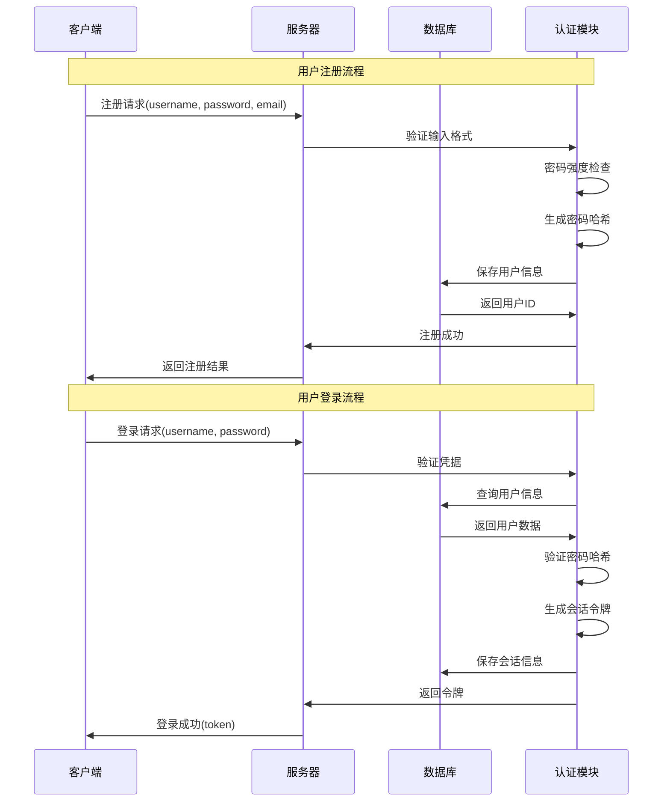

# 用户认证系统

## 🎯 学习目标

通过本章学习，您将能够：
- 理解用户认证的基本原理和安全要求
- 掌握密码加密和会话管理技术
- 学会设计安全的认证系统
- 在Chat-Room项目中实现完整的用户认证

## 🔐 认证系统架构

### 认证流程设计



### 安全要求分析

```python
# server/auth/security_requirements.py - 安全需求
"""
Chat-Room认证系统安全要求

1. 密码安全
   - 密码强度要求：至少8位，包含字母数字
   - 密码加密存储：使用bcrypt或类似算法
   - 防止彩虹表攻击：使用盐值

2. 会话安全
   - 会话令牌：使用随机生成的UUID
   - 会话过期：设置合理的过期时间
   - 会话管理：支持主动注销和清理

3. 输入验证
   - 用户名格式：3-20字符，字母数字下划线
   - 邮箱格式：标准邮箱格式验证
   - SQL注入防护：使用参数化查询

4. 访问控制
   - 权限验证：每个操作都要验证权限
   - 会话验证：验证令牌有效性
   - 频率限制：防止暴力破解

5. 审计日志
   - 登录记录：记录登录时间、IP地址
   - 操作日志：记录关键操作
   - 异常监控：检测异常登录行为
"""

import hashlib
import secrets
import re
from datetime import datetime, timedelta
from typing import Optional, Dict, Any, Tuple

class SecurityConfig:
    """安全配置"""
    
    # 密码要求
    MIN_PASSWORD_LENGTH = 8
    MAX_PASSWORD_LENGTH = 128
    REQUIRE_UPPERCASE = True
    REQUIRE_LOWERCASE = True
    REQUIRE_DIGITS = True
    REQUIRE_SPECIAL_CHARS = False
    
    # 会话配置
    SESSION_TIMEOUT_HOURS = 24
    MAX_SESSIONS_PER_USER = 5
    
    # 安全限制
    MAX_LOGIN_ATTEMPTS = 5
    LOCKOUT_DURATION_MINUTES = 30
    
    # 令牌配置
    TOKEN_LENGTH = 32
    TOKEN_ALPHABET = "abcdefghijklmnopqrstuvwxyzABCDEFGHIJKLMNOPQRSTUVWXYZ0123456789"

class PasswordValidator:
    """密码验证器"""
    
    @staticmethod
    def validate_password(password: str) -> Tuple[bool, str]:
        """
        验证密码强度
        
        Args:
            password: 待验证的密码
            
        Returns:
            (是否有效, 错误信息)
        """
        if not password:
            return False, "密码不能为空"
        
        if len(password) < SecurityConfig.MIN_PASSWORD_LENGTH:
            return False, f"密码长度不能少于{SecurityConfig.MIN_PASSWORD_LENGTH}位"
        
        if len(password) > SecurityConfig.MAX_PASSWORD_LENGTH:
            return False, f"密码长度不能超过{SecurityConfig.MAX_PASSWORD_LENGTH}位"
        
        # 检查字符要求
        if SecurityConfig.REQUIRE_UPPERCASE and not re.search(r'[A-Z]', password):
            return False, "密码必须包含大写字母"
        
        if SecurityConfig.REQUIRE_LOWERCASE and not re.search(r'[a-z]', password):
            return False, "密码必须包含小写字母"
        
        if SecurityConfig.REQUIRE_DIGITS and not re.search(r'\d', password):
            return False, "密码必须包含数字"
        
        if SecurityConfig.REQUIRE_SPECIAL_CHARS and not re.search(r'[!@#$%^&*(),.?":{}|<>]', password):
            return False, "密码必须包含特殊字符"
        
        # 检查常见弱密码
        weak_passwords = ['password', '123456', 'qwerty', 'admin']
        if password.lower() in weak_passwords:
            return False, "密码过于简单，请使用更复杂的密码"
        
        return True, "密码强度符合要求"
    
    @staticmethod
    def hash_password(password: str) -> str:
        """
        生成密码哈希
        
        使用PBKDF2算法，安全性高，计算成本适中
        """
        # 生成随机盐值
        salt = secrets.token_hex(16)
        
        # 使用PBKDF2生成哈希
        password_hash = hashlib.pbkdf2_hmac(
            'sha256',
            password.encode('utf-8'),
            salt.encode('utf-8'),
            100000  # 迭代次数
        )
        
        # 组合盐值和哈希值
        return f"{salt}:{password_hash.hex()}"
    
    @staticmethod
    def verify_password(password: str, stored_hash: str) -> bool:
        """
        验证密码
        
        Args:
            password: 用户输入的密码
            stored_hash: 存储的密码哈希
            
        Returns:
            密码是否正确
        """
        try:
            # 分离盐值和哈希值
            salt, hash_value = stored_hash.split(':')
            
            # 使用相同的盐值和算法生成哈希
            password_hash = hashlib.pbkdf2_hmac(
                'sha256',
                password.encode('utf-8'),
                salt.encode('utf-8'),
                100000
            )
            
            # 比较哈希值
            return password_hash.hex() == hash_value
            
        except Exception:
            return False

class SessionManager:
    """会话管理器"""
    
    def __init__(self, db_connection):
        self.db = db_connection
    
    def create_session(self, user_id: int, ip_address: str, 
                      user_agent: str = "") -> str:
        """
        创建用户会话
        
        Args:
            user_id: 用户ID
            ip_address: 客户端IP地址
            user_agent: 用户代理字符串
            
        Returns:
            会话令牌
        """
        # 生成会话令牌
        session_token = self._generate_token()
        
        # 计算过期时间
        expires_at = datetime.now() + timedelta(hours=SecurityConfig.SESSION_TIMEOUT_HOURS)
        
        try:
            cursor = self.db.cursor()
            
            # 清理用户的过期会话
            self._cleanup_expired_sessions(user_id)
            
            # 检查会话数量限制
            if self._count_user_sessions(user_id) >= SecurityConfig.MAX_SESSIONS_PER_USER:
                # 删除最旧的会话
                self._remove_oldest_session(user_id)
            
            # 插入新会话
            insert_sql = """
            INSERT INTO user_sessions (session_id, user_id, ip_address, user_agent, expires_at)
            VALUES (?, ?, ?, ?, ?)
            """
            
            cursor.execute(insert_sql, (session_token, user_id, ip_address, user_agent, expires_at))
            self.db.commit()
            
            print(f"会话创建成功: 用户{user_id}")
            return session_token
            
        except Exception as e:
            print(f"创建会话失败: {e}")
            self.db.rollback()
            return None
    
    def validate_session(self, session_token: str) -> Optional[Dict[str, Any]]:
        """
        验证会话有效性
        
        Args:
            session_token: 会话令牌
            
        Returns:
            会话信息，无效返回None
        """
        try:
            cursor = self.db.cursor()
            
            select_sql = """
            SELECT s.user_id, s.ip_address, s.created_at, s.expires_at,
                   u.username, u.is_active, u.is_banned
            FROM user_sessions s
            JOIN users u ON s.user_id = u.user_id
            WHERE s.session_id = ? AND s.is_active = 1
            """
            
            cursor.execute(select_sql, (session_token,))
            row = cursor.fetchone()
            
            if not row:
                return None
            
            # 检查会话是否过期
            expires_at = datetime.fromisoformat(row['expires_at'])
            if datetime.now() > expires_at:
                # 会话已过期，删除
                self._remove_session(session_token)
                return None
            
            # 检查用户状态
            if not row['is_active'] or row['is_banned']:
                return None
            
            # 更新会话活动时间（可选）
            # self._update_session_activity(session_token)
            
            return {
                'user_id': row['user_id'],
                'username': row['username'],
                'ip_address': row['ip_address'],
                'created_at': row['created_at']
            }
            
        except Exception as e:
            print(f"验证会话失败: {e}")
            return None
    
    def remove_session(self, session_token: str) -> bool:
        """移除会话（用户注销）"""
        return self._remove_session(session_token)
    
    def remove_user_sessions(self, user_id: int) -> int:
        """移除用户的所有会话"""
        try:
            cursor = self.db.cursor()
            
            delete_sql = "DELETE FROM user_sessions WHERE user_id = ?"
            cursor.execute(delete_sql, (user_id,))
            
            removed_count = cursor.rowcount
            self.db.commit()
            
            print(f"已移除用户{user_id}的{removed_count}个会话")
            return removed_count
            
        except Exception as e:
            print(f"移除用户会话失败: {e}")
            self.db.rollback()
            return 0
    
    def _generate_token(self) -> str:
        """生成安全的会话令牌"""
        return ''.join(secrets.choice(SecurityConfig.TOKEN_ALPHABET) 
                      for _ in range(SecurityConfig.TOKEN_LENGTH))
    
    def _cleanup_expired_sessions(self, user_id: int = None):
        """清理过期会话"""
        try:
            cursor = self.db.cursor()
            
            if user_id:
                delete_sql = """
                DELETE FROM user_sessions 
                WHERE user_id = ? AND expires_at < CURRENT_TIMESTAMP
                """
                cursor.execute(delete_sql, (user_id,))
            else:
                delete_sql = """
                DELETE FROM user_sessions 
                WHERE expires_at < CURRENT_TIMESTAMP
                """
                cursor.execute(delete_sql)
            
            self.db.commit()
            
        except Exception as e:
            print(f"清理过期会话失败: {e}")
    
    def _count_user_sessions(self, user_id: int) -> int:
        """统计用户活跃会话数"""
        try:
            cursor = self.db.cursor()
            
            count_sql = """
            SELECT COUNT(*) as count
            FROM user_sessions 
            WHERE user_id = ? AND is_active = 1 AND expires_at > CURRENT_TIMESTAMP
            """
            
            cursor.execute(count_sql, (user_id,))
            row = cursor.fetchone()
            
            return row['count'] if row else 0
            
        except Exception:
            return 0
    
    def _remove_oldest_session(self, user_id: int):
        """移除用户最旧的会话"""
        try:
            cursor = self.db.cursor()
            
            delete_sql = """
            DELETE FROM user_sessions 
            WHERE user_id = ? AND session_id = (
                SELECT session_id FROM user_sessions 
                WHERE user_id = ? 
                ORDER BY created_at ASC 
                LIMIT 1
            )
            """
            
            cursor.execute(delete_sql, (user_id, user_id))
            self.db.commit()
            
        except Exception as e:
            print(f"移除最旧会话失败: {e}")
    
    def _remove_session(self, session_token: str) -> bool:
        """移除指定会话"""
        try:
            cursor = self.db.cursor()
            
            delete_sql = "DELETE FROM user_sessions WHERE session_id = ?"
            cursor.execute(delete_sql, (session_token,))
            
            success = cursor.rowcount > 0
            self.db.commit()
            
            return success
            
        except Exception as e:
            print(f"移除会话失败: {e}")
            self.db.rollback()
            return False

class AuthenticationService:
    """认证服务"""
    
    def __init__(self, db_connection):
        self.db = db_connection
        self.session_manager = SessionManager(db_connection)
        self.login_attempts = {}  # {username: [attempt_time, ...]}
    
    def register_user(self, username: str, password: str, 
                     email: str = None, nickname: str = None) -> Tuple[bool, str, Optional[int]]:
        """
        用户注册
        
        Returns:
            (是否成功, 消息, 用户ID)
        """
        # 验证输入
        if not self._validate_username(username):
            return False, "用户名格式不正确", None
        
        is_valid, msg = PasswordValidator.validate_password(password)
        if not is_valid:
            return False, msg, None
        
        if email and not self._validate_email(email):
            return False, "邮箱格式不正确", None
        
        try:
            cursor = self.db.cursor()
            
            # 检查用户名是否已存在
            check_sql = "SELECT user_id FROM users WHERE username = ?"
            cursor.execute(check_sql, (username,))
            
            if cursor.fetchone():
                return False, "用户名已存在", None
            
            # 生成密码哈希
            password_hash = PasswordValidator.hash_password(password)
            
            # 插入用户
            insert_sql = """
            INSERT INTO users (username, password_hash, email, nickname)
            VALUES (?, ?, ?, ?)
            """
            
            cursor.execute(insert_sql, (username, password_hash, email, nickname))
            user_id = cursor.lastrowid
            
            self.db.commit()
            
            print(f"用户注册成功: {username} (ID: {user_id})")
            return True, "注册成功", user_id
            
        except Exception as e:
            print(f"用户注册失败: {e}")
            self.db.rollback()
            return False, "注册失败，请稍后重试", None
    
    def authenticate_user(self, username: str, password: str, 
                         ip_address: str, user_agent: str = "") -> Tuple[bool, str, Optional[str]]:
        """
        用户认证
        
        Returns:
            (是否成功, 消息, 会话令牌)
        """
        # 检查登录尝试频率
        if self._is_account_locked(username):
            return False, "账户已被锁定，请稍后重试", None
        
        try:
            cursor = self.db.cursor()
            
            # 查询用户信息
            select_sql = """
            SELECT user_id, username, password_hash, is_active, is_banned
            FROM users 
            WHERE username = ?
            """
            
            cursor.execute(select_sql, (username,))
            user = cursor.fetchone()
            
            if not user:
                self._record_failed_attempt(username)
                return False, "用户名或密码错误", None
            
            # 检查用户状态
            if not user['is_active']:
                return False, "账户未激活", None
            
            if user['is_banned']:
                return False, "账户已被禁用", None
            
            # 验证密码
            if not PasswordValidator.verify_password(password, user['password_hash']):
                self._record_failed_attempt(username)
                return False, "用户名或密码错误", None
            
            # 清除失败尝试记录
            self._clear_failed_attempts(username)
            
            # 更新最后登录时间
            self._update_last_login(user['user_id'])
            
            # 创建会话
            session_token = self.session_manager.create_session(
                user['user_id'], ip_address, user_agent
            )
            
            if session_token:
                print(f"用户登录成功: {username}")
                return True, "登录成功", session_token
            else:
                return False, "创建会话失败", None
                
        except Exception as e:
            print(f"用户认证失败: {e}")
            return False, "认证失败，请稍后重试", None
    
    def logout_user(self, session_token: str) -> bool:
        """用户注销"""
        return self.session_manager.remove_session(session_token)
    
    def _validate_username(self, username: str) -> bool:
        """验证用户名格式"""
        if not username or len(username) < 3 or len(username) > 20:
            return False
        
        # 只允许字母、数字、下划线
        return re.match(r'^[a-zA-Z0-9_]+$', username) is not None
    
    def _validate_email(self, email: str) -> bool:
        """验证邮箱格式"""
        pattern = r'^[a-zA-Z0-9._%+-]+@[a-zA-Z0-9.-]+\.[a-zA-Z]{2,}$'
        return re.match(pattern, email) is not None
    
    def _is_account_locked(self, username: str) -> bool:
        """检查账户是否被锁定"""
        if username not in self.login_attempts:
            return False
        
        attempts = self.login_attempts[username]
        recent_attempts = [
            attempt for attempt in attempts
            if datetime.now() - attempt < timedelta(minutes=SecurityConfig.LOCKOUT_DURATION_MINUTES)
        ]
        
        return len(recent_attempts) >= SecurityConfig.MAX_LOGIN_ATTEMPTS
    
    def _record_failed_attempt(self, username: str):
        """记录失败的登录尝试"""
        if username not in self.login_attempts:
            self.login_attempts[username] = []
        
        self.login_attempts[username].append(datetime.now())
        
        # 清理旧的尝试记录
        cutoff_time = datetime.now() - timedelta(minutes=SecurityConfig.LOCKOUT_DURATION_MINUTES)
        self.login_attempts[username] = [
            attempt for attempt in self.login_attempts[username]
            if attempt > cutoff_time
        ]
    
    def _clear_failed_attempts(self, username: str):
        """清除失败尝试记录"""
        if username in self.login_attempts:
            del self.login_attempts[username]
    
    def _update_last_login(self, user_id: int):
        """更新最后登录时间"""
        try:
            cursor = self.db.cursor()
            
            update_sql = """
            UPDATE users 
            SET last_login = CURRENT_TIMESTAMP 
            WHERE user_id = ?
            """
            
            cursor.execute(update_sql, (user_id,))
            self.db.commit()
            
        except Exception as e:
            print(f"更新登录时间失败: {e}")

# 使用示例
def demo_authentication():
    """认证系统演示"""
    import sqlite3
    
    # 创建数据库连接
    conn = sqlite3.connect(":memory:")
    conn.row_factory = sqlite3.Row
    
    # 创建表（简化版）
    conn.execute("""
    CREATE TABLE users (
        user_id INTEGER PRIMARY KEY,
        username VARCHAR(50) UNIQUE,
        password_hash VARCHAR(255),
        email VARCHAR(100),
        nickname VARCHAR(50),
        is_active BOOLEAN DEFAULT 1,
        is_banned BOOLEAN DEFAULT 0,
        last_login TIMESTAMP
    )
    """)
    
    conn.execute("""
    CREATE TABLE user_sessions (
        session_id VARCHAR(255) PRIMARY KEY,
        user_id INTEGER,
        ip_address VARCHAR(45),
        user_agent TEXT,
        created_at TIMESTAMP DEFAULT CURRENT_TIMESTAMP,
        expires_at TIMESTAMP,
        is_active BOOLEAN DEFAULT 1
    )
    """)
    
    # 创建认证服务
    auth_service = AuthenticationService(conn)
    
    print("=== 用户注册 ===")
    success, msg, user_id = auth_service.register_user("alice", "Password123", "alice@example.com")
    print(f"注册结果: {success}, {msg}, 用户ID: {user_id}")
    
    print("\n=== 用户登录 ===")
    success, msg, token = auth_service.authenticate_user("alice", "Password123", "127.0.0.1")
    print(f"登录结果: {success}, {msg}, 令牌: {token}")
    
    print("\n=== 会话验证 ===")
    if token:
        session_info = auth_service.session_manager.validate_session(token)
        print(f"会话信息: {session_info}")
    
    conn.close()

if __name__ == "__main__":
    demo_authentication()
```

## 🎯 实践练习

### 练习1：双因素认证
```python
class TwoFactorAuth:
    """
    双因素认证练习
    
    要求：
    1. 实现TOTP算法
    2. 生成QR码
    3. 验证动态密码
    4. 备用恢复码
    """
    
    def generate_secret_key(self, user_id: int) -> str:
        """生成密钥"""
        # TODO: 实现密钥生成
        pass
    
    def verify_totp_code(self, user_id: int, code: str) -> bool:
        """验证TOTP码"""
        # TODO: 实现TOTP验证
        pass
```

### 练习2：OAuth集成
```python
class OAuthIntegration:
    """
    OAuth集成练习
    
    要求：
    1. 支持第三方登录
    2. 处理授权回调
    3. 用户信息同步
    4. 账户绑定解绑
    """
    
    def initiate_oauth_flow(self, provider: str) -> str:
        """发起OAuth流程"""
        # TODO: 实现OAuth授权
        pass
    
    def handle_oauth_callback(self, code: str, state: str):
        """处理OAuth回调"""
        # TODO: 实现回调处理
        pass
```

## ✅ 学习检查

完成本章学习后，请确认您能够：

- [ ] 理解用户认证的安全原理
- [ ] 实现安全的密码存储和验证
- [ ] 设计完善的会话管理系统
- [ ] 处理登录频率限制和账户锁定
- [ ] 实现用户注册和登录功能
- [ ] 完成实践练习

## 📚 下一步

用户认证系统掌握后，请继续学习：
- [数据模型设计](data-models.md)
- [第5章：多人聊天功能](../05-multi-user-chat/group-management.md)

---

**现在您已经掌握了安全的用户认证系统设计！** 🔐
