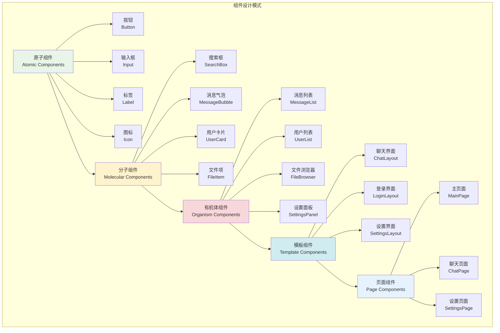
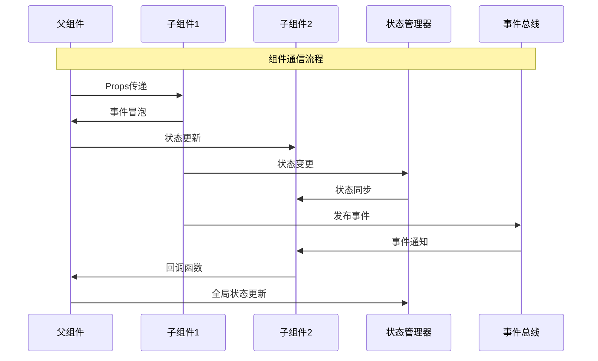

# 组件设计与开发

## 🎯 学习目标

通过本章学习，您将能够：
- 掌握TUI组件设计的核心原则和模式
- 学会开发可复用的自定义组件
- 理解组件间的通信和数据流管理
- 在Chat-Room项目中构建完整的组件体系

## 🧩 组件设计原则

### 组件架构模式



### 组件通信模式



## 🔧 自定义组件开发

### Chat-Room核心组件实现

```python
# client/tui/components.py - Chat-Room自定义组件
from textual.widget import Widget
from textual.widgets import Static, Input, Button, ListView, ListItem
from textual.containers import Container, Horizontal, Vertical
from textual.reactive import reactive, var
from textual.message import Message
from textual.binding import Binding
from textual import events
from textual.geometry import Size
from textual.strip import Strip
from textual.color import Color
from rich.text import Text
from rich.console import Console, ConsoleOptions, RenderResult
from rich.segment import Segment
from rich.style import Style
from typing import List, Dict, Optional, Any, Callable
from datetime import datetime
import asyncio

class MessageBubble(Widget):
    """
    消息气泡组件
    
    功能：
    1. 显示单条聊天消息
    2. 支持不同消息类型的样式
    3. 显示时间戳和用户信息
    4. 支持消息状态指示
    """
    
    DEFAULT_CSS = """
    MessageBubble {
        height: auto;
        margin: 1 0;
        padding: 1;
    }
    
    MessageBubble.own-message {
        text-align: right;
        background: $primary 20%;
    }
    
    MessageBubble.other-message {
        text-align: left;
        background: $surface;
    }
    
    MessageBubble.system-message {
        text-align: center;
        background: $secondary 10%;
        color: $text-secondary;
    }
    
    MessageBubble.ai-message {
        text-align: left;
        background: $accent 20%;
        border-left: solid $accent;
    }
    """
    
    def __init__(self, message_id: str, user_id: int, username: str, 
                 content: str, timestamp: datetime, message_type: str = "text",
                 is_own: bool = False, **kwargs):
        super().__init__(**kwargs)
        
        self.message_id = message_id
        self.user_id = user_id
        self.username = username
        self.content = content
        self.timestamp = timestamp
        self.message_type = message_type
        self.is_own = is_own
        
        # 设置CSS类
        if message_type == "system":
            self.add_class("system-message")
        elif message_type == "ai":
            self.add_class("ai-message")
        elif is_own:
            self.add_class("own-message")
        else:
            self.add_class("other-message")
    
    def render(self) -> RenderResult:
        """渲染消息气泡"""
        console = Console()
        
        # 格式化时间
        time_str = self.timestamp.strftime("%H:%M:%S")
        
        # 构建消息内容
        if self.message_type == "system":
            text = Text(f"[{time_str}] {self.content}", style="dim italic")
        elif self.message_type == "ai":
            text = Text(f"[{time_str}] 🤖 AI: {self.content}", style="cyan")
        else:
            if self.is_own:
                text = Text(f"{self.content} [{time_str}]", style="bold")
            else:
                text = Text(f"[{time_str}] {self.username}: {self.content}")
        
        return text
    
    def on_click(self, event: events.Click) -> None:
        """处理点击事件"""
        # 发送消息选择事件
        self.post_message(MessageSelected(self.message_id))

class MessageSelected(Message):
    """消息选择事件"""
    def __init__(self, message_id: str):
        self.message_id = message_id
        super().__init__()

class EnhancedMessageList(Widget):
    """
    增强消息列表组件
    
    功能：
    1. 虚拟滚动支持大量消息
    2. 消息搜索和过滤
    3. 消息分组和时间分割
    4. 自动滚动和手动控制
    """
    
    DEFAULT_CSS = """
    EnhancedMessageList {
        height: 1fr;
        border: solid $primary;
        padding: 1;
        overflow-y: auto;
    }
    
    EnhancedMessageList:focus {
        border: solid $accent;
    }
    """
    
    BINDINGS = [
        Binding("ctrl+f", "search", "搜索"),
        Binding("home", "scroll_home", "回到顶部"),
        Binding("end", "scroll_end", "回到底部"),
        Binding("page_up", "page_up", "上一页"),
        Binding("page_down", "page_down", "下一页"),
    ]
    
    def __init__(self, **kwargs):
        super().__init__(**kwargs)
        self.messages: List[MessageBubble] = []
        self.filtered_messages: List[MessageBubble] = []
        self.search_query = ""
        self.auto_scroll = True
        self.scroll_position = 0
        self.visible_range = (0, 0)
    
    def add_message(self, message_id: str, user_id: int, username: str,
                   content: str, timestamp: datetime = None, 
                   message_type: str = "text", is_own: bool = False):
        """添加消息"""
        if timestamp is None:
            timestamp = datetime.now()
        
        bubble = MessageBubble(
            message_id=message_id,
            user_id=user_id,
            username=username,
            content=content,
            timestamp=timestamp,
            message_type=message_type,
            is_own=is_own
        )
        
        self.messages.append(bubble)
        self._apply_filter()
        
        if self.auto_scroll:
            self.scroll_end()
        
        self.refresh()
    
    def clear_messages(self):
        """清空消息"""
        self.messages.clear()
        self.filtered_messages.clear()
        self.refresh()
    
    def search_messages(self, query: str):
        """搜索消息"""
        self.search_query = query.lower()
        self._apply_filter()
        self.refresh()
    
    def _apply_filter(self):
        """应用过滤器"""
        if not self.search_query:
            self.filtered_messages = self.messages.copy()
        else:
            self.filtered_messages = [
                msg for msg in self.messages
                if self.search_query in msg.content.lower() or
                   self.search_query in msg.username.lower()
            ]
    
    def compose(self) -> ComposeResult:
        """组合子组件"""
        # 计算可见范围
        self._calculate_visible_range()
        
        # 只渲染可见的消息
        for i in range(self.visible_range[0], self.visible_range[1]):
            if i < len(self.filtered_messages):
                yield self.filtered_messages[i]
    
    def _calculate_visible_range(self):
        """计算可见消息范围"""
        # 简化实现，实际应该根据滚动位置和容器高度计算
        start = max(0, len(self.filtered_messages) - 50)  # 显示最近50条
        end = len(self.filtered_messages)
        self.visible_range = (start, end)
    
    def action_search(self):
        """搜索动作"""
        # 这里应该弹出搜索对话框
        pass
    
    def action_scroll_home(self):
        """滚动到顶部"""
        self.scroll_home()
        self.auto_scroll = False
    
    def action_scroll_end(self):
        """滚动到底部"""
        self.scroll_end()
        self.auto_scroll = True

class UserStatusIndicator(Widget):
    """
    用户状态指示器组件
    
    功能：
    1. 显示用户在线状态
    2. 支持状态动画效果
    3. 状态变化通知
    """
    
    status = reactive("offline")
    
    STATUS_ICONS = {
        "online": "🟢",
        "away": "🟡", 
        "busy": "🔴",
        "offline": "⚫",
        "typing": "💬"
    }
    
    STATUS_COLORS = {
        "online": "green",
        "away": "yellow",
        "busy": "red", 
        "offline": "dim",
        "typing": "blue"
    }
    
    def __init__(self, user_id: int, **kwargs):
        super().__init__(**kwargs)
        self.user_id = user_id
        self.animation_timer = None
    
    def render(self) -> RenderResult:
        """渲染状态指示器"""
        icon = self.STATUS_ICONS.get(self.status, "⚫")
        color = self.STATUS_COLORS.get(self.status, "dim")
        
        return Text(icon, style=color)
    
    def watch_status(self, old_status: str, new_status: str):
        """监听状态变化"""
        if new_status == "typing":
            self._start_typing_animation()
        else:
            self._stop_typing_animation()
        
        # 发送状态变化事件
        self.post_message(UserStatusChanged(self.user_id, old_status, new_status))
    
    def _start_typing_animation(self):
        """开始打字动画"""
        if self.animation_timer:
            self.animation_timer.cancel()
        
        async def animate():
            icons = ["💬", "💭", "💬", "💭"]
            index = 0
            while self.status == "typing":
                self.STATUS_ICONS["typing"] = icons[index % len(icons)]
                index += 1
                self.refresh()
                await asyncio.sleep(0.5)
        
        self.animation_timer = asyncio.create_task(animate())
    
    def _stop_typing_animation(self):
        """停止打字动画"""
        if self.animation_timer:
            self.animation_timer.cancel()
            self.animation_timer = None

class UserStatusChanged(Message):
    """用户状态变化事件"""
    def __init__(self, user_id: int, old_status: str, new_status: str):
        self.user_id = user_id
        self.old_status = old_status
        self.new_status = new_status
        super().__init__()

class EnhancedUserList(ListView):
    """
    增强用户列表组件
    
    功能：
    1. 用户分组显示
    2. 状态排序和过滤
    3. 用户搜索功能
    4. 右键菜单支持
    """
    
    DEFAULT_CSS = """
    EnhancedUserList {
        height: 1fr;
        border: solid $secondary;
        padding: 1;
    }
    
    EnhancedUserList > ListItem {
        padding: 0 1;
        height: 1;
    }
    
    EnhancedUserList > ListItem:hover {
        background: $surface;
    }
    
    EnhancedUserList > ListItem.group-header {
        background: $primary 20%;
        color: $text-primary;
        text-style: bold;
    }
    """
    
    BINDINGS = [
        Binding("ctrl+f", "search_users", "搜索用户"),
        Binding("f5", "refresh", "刷新列表"),
    ]
    
    def __init__(self, **kwargs):
        super().__init__(**kwargs)
        self.users: Dict[int, Dict[str, Any]] = {}
        self.groups: Dict[str, List[int]] = {
            "在线": [],
            "离开": [],
            "忙碌": [],
            "离线": []
        }
        self.search_query = ""
    
    def add_user(self, user_id: int, username: str, status: str = "online", 
                role: str = "member", avatar: str = "👤"):
        """添加用户"""
        self.users[user_id] = {
            "username": username,
            "status": status,
            "role": role,
            "avatar": avatar,
            "last_activity": datetime.now()
        }
        
        self._update_user_groups()
        self._refresh_display()
    
    def update_user_status(self, user_id: int, status: str):
        """更新用户状态"""
        if user_id in self.users:
            old_status = self.users[user_id]["status"]
            self.users[user_id]["status"] = status
            self.users[user_id]["last_activity"] = datetime.now()
            
            self._update_user_groups()
            self._refresh_display()
    
    def remove_user(self, user_id: int):
        """移除用户"""
        if user_id in self.users:
            del self.users[user_id]
            self._update_user_groups()
            self._refresh_display()
    
    def search_users(self, query: str):
        """搜索用户"""
        self.search_query = query.lower()
        self._refresh_display()
    
    def _update_user_groups(self):
        """更新用户分组"""
        # 清空分组
        for group in self.groups:
            self.groups[group].clear()
        
        # 重新分组
        status_map = {
            "online": "在线",
            "away": "离开", 
            "busy": "忙碌",
            "offline": "离线"
        }
        
        for user_id, user_info in self.users.items():
            status = user_info["status"]
            group_name = status_map.get(status, "离线")
            self.groups[group_name].append(user_id)
        
        # 按活跃度排序
        for group_name in self.groups:
            self.groups[group_name].sort(
                key=lambda uid: self.users[uid]["last_activity"],
                reverse=True
            )
    
    def _refresh_display(self):
        """刷新显示"""
        self.clear()
        
        for group_name, user_ids in self.groups.items():
            if not user_ids:
                continue
            
            # 过滤搜索结果
            if self.search_query:
                user_ids = [
                    uid for uid in user_ids
                    if self.search_query in self.users[uid]["username"].lower()
                ]
                
                if not user_ids:
                    continue
            
            # 添加分组标题
            group_item = ListItem(Static(f"📁 {group_name} ({len(user_ids)})"))
            group_item.add_class("group-header")
            self.append(group_item)
            
            # 添加用户项
            for user_id in user_ids:
                user_info = self.users[user_id]
                
                # 创建用户显示项
                status_indicator = UserStatusIndicator(user_id)
                status_indicator.status = user_info["status"]
                
                role_icon = "👑" if user_info["role"] == "admin" else "👤"
                user_text = f"{role_icon} {user_info['username']}"
                
                user_container = Horizontal(
                    status_indicator,
                    Static(user_text),
                    classes="user-item"
                )
                
                user_item = ListItem(user_container)
                user_item.user_id = user_id  # 存储用户ID
                self.append(user_item)
    
    def on_list_view_selected(self, event: ListView.Selected) -> None:
        """处理用户选择"""
        if hasattr(event.item, 'user_id'):
            user_id = event.item.user_id
            self.post_message(UserSelected(user_id))
    
    def action_search_users(self):
        """搜索用户动作"""
        # 这里应该弹出搜索对话框
        pass
    
    def action_refresh(self):
        """刷新动作"""
        self._refresh_display()

class UserSelected(Message):
    """用户选择事件"""
    def __init__(self, user_id: int):
        self.user_id = user_id
        super().__init__()

# 使用示例
def demo_custom_components():
    """自定义组件演示"""
    from textual.app import App
    
    class ComponentDemoApp(App):
        def compose(self):
            # 创建消息列表
            message_list = EnhancedMessageList()
            
            # 添加示例消息
            message_list.add_message("1", 1, "Alice", "Hello everyone!", is_own=False)
            message_list.add_message("2", 999, "我", "Hi Alice!", is_own=True)
            message_list.add_message("3", 0, "系统", "用户Bob加入了聊天", message_type="system")
            message_list.add_message("4", 0, "AI", "我是AI助手，有什么可以帮助您的吗？", message_type="ai")
            
            yield message_list
            
            # 创建用户列表
            user_list = EnhancedUserList()
            user_list.add_user(1, "Alice", "online", "admin")
            user_list.add_user(2, "Bob", "away", "member")
            user_list.add_user(3, "Charlie", "busy", "member")
            
            yield user_list
    
    print("=== 自定义组件演示 ===")
    app = ComponentDemoApp()
    app.run()

if __name__ == "__main__":
    demo_custom_components()
```

## 🎯 实践练习

### 练习1：复合组件开发
```python
class CompositeComponent(Widget):
    """
    复合组件开发练习
    
    要求：
    1. 组合多个子组件形成复杂功能
    2. 实现组件间的数据流管理
    3. 支持组件的动态加载和卸载
    4. 提供统一的API接口
    """
    
    def compose_children(self) -> ComposeResult:
        """组合子组件"""
        # TODO: 实现复合组件逻辑
        pass
    
    def handle_child_events(self, event: Message):
        """处理子组件事件"""
        # TODO: 实现事件处理
        pass
```

### 练习2：组件状态管理
```python
class ComponentStateManager:
    """
    组件状态管理练习
    
    要求：
    1. 实现组件状态的集中管理
    2. 支持状态的持久化和恢复
    3. 提供状态变化的订阅机制
    4. 优化状态更新的性能
    """
    
    def create_state_store(self, initial_state: Dict[str, Any]):
        """创建状态存储"""
        # TODO: 实现状态存储
        pass
    
    def subscribe_to_changes(self, component: Widget, state_keys: List[str]):
        """订阅状态变化"""
        # TODO: 实现状态订阅
        pass
```

## ✅ 学习检查

完成本章学习后，请确认您能够：

- [ ] 理解组件设计的核心原则和模式
- [ ] 开发可复用的自定义组件
- [ ] 实现组件间的通信和数据流
- [ ] 设计复合组件和组件层次结构
- [ ] 管理组件状态和生命周期
- [ ] 完成实践练习

## 📚 下一步

组件设计与开发掌握后，请继续学习：
- [主题系统](theme-system.md)

---

**现在您已经掌握了TUI组件设计的精髓！** 🧩
