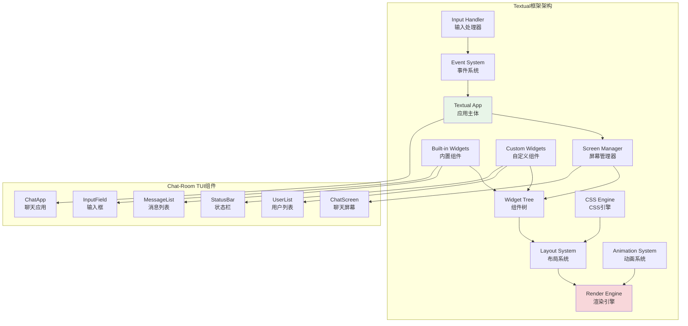
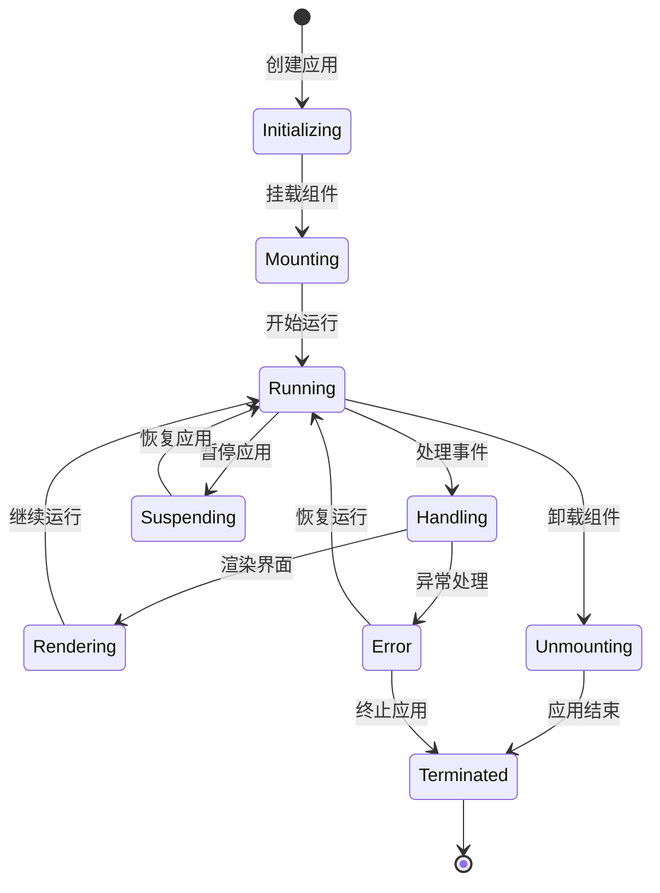

# Textual框架详解

## 🎯 学习目标

通过本章学习，您将能够：
- 深入理解Textual框架的架构和特性
- 掌握Textual应用开发的核心技术
- 学会构建复杂的交互式TUI应用
- 在Chat-Room项目中应用Textual框架

## 🚀 Textual框架概览

### Textual架构分析



### Textual应用生命周期



## 📱 Textual应用开发

### Chat-Room Textual应用实现

```python
# client/tui/chat_app.py - Chat-Room Textual应用
from textual.app import App, ComposeResult
from textual.containers import Container, Horizontal, Vertical
from textual.widgets import (
    Header, Footer, Input, RichLog, Static, 
    ListView, ListItem, Button, Label
)
from textual.reactive import reactive
from textual.message import Message
from textual.binding import Binding
from textual.screen import Screen
from textual import events
from rich.text import Text
from rich.console import Console
from rich.markdown import Markdown
import asyncio
from typing import List, Dict, Optional, Any
from datetime import datetime

class ChatMessage:
    """聊天消息数据类"""
    def __init__(self, user_id: int, username: str, content: str, 
                 timestamp: datetime = None, message_type: str = "text"):
        self.user_id = user_id
        self.username = username
        self.content = content
        self.timestamp = timestamp or datetime.now()
        self.message_type = message_type
    
    def to_rich_text(self) -> Text:
        """转换为Rich Text对象"""
        time_str = self.timestamp.strftime("%H:%M:%S")
        
        if self.message_type == "system":
            return Text(f"[{time_str}] {self.content}", style="dim italic")
        elif self.message_type == "ai":
            return Text(f"[{time_str}] 🤖 AI: {self.content}", style="cyan")
        else:
            return Text(f"[{time_str}] {self.username}: {self.content}")

class MessageListWidget(RichLog):
    """消息列表组件"""
    
    def __init__(self, **kwargs):
        super().__init__(**kwargs)
        self.messages: List[ChatMessage] = []
        self.auto_scroll = True
    
    def add_message(self, message: ChatMessage):
        """添加消息"""
        self.messages.append(message)
        self.write(message.to_rich_text())
        
        if self.auto_scroll:
            self.scroll_end()
    
    def clear_messages(self):
        """清空消息"""
        self.messages.clear()
        self.clear()

class UserListWidget(ListView):
    """用户列表组件"""
    
    def __init__(self, **kwargs):
        super().__init__(**kwargs)
        self.users: Dict[int, Dict[str, Any]] = {}
    
    def add_user(self, user_id: int, username: str, status: str = "online"):
        """添加用户"""
        self.users[user_id] = {
            "username": username,
            "status": status
        }
        self._refresh_user_list()
    
    def remove_user(self, user_id: int):
        """移除用户"""
        if user_id in self.users:
            del self.users[user_id]
            self._refresh_user_list()
    
    def update_user_status(self, user_id: int, status: str):
        """更新用户状态"""
        if user_id in self.users:
            self.users[user_id]["status"] = status
            self._refresh_user_list()
    
    def _refresh_user_list(self):
        """刷新用户列表显示"""
        self.clear()
        
        for user_id, user_info in self.users.items():
            username = user_info["username"]
            status = user_info["status"]
            
            # 状态图标
            status_icon = {
                "online": "🟢",
                "away": "🟡",
                "busy": "🔴",
                "offline": "⚫"
            }.get(status, "⚫")
            
            item_text = f"{status_icon} {username}"
            self.append(ListItem(Label(item_text)))

class ChatInputWidget(Input):
    """聊天输入组件"""
    
    class MessageSubmitted(Message):
        """消息提交事件"""
        def __init__(self, content: str):
            self.content = content
            super().__init__()
    
    def __init__(self, **kwargs):
        super().__init__(placeholder="输入消息...", **kwargs)
        self.message_history: List[str] = []
        self.history_index = -1
    
    def on_input_submitted(self, event: Input.Submitted) -> None:
        """处理输入提交"""
        content = event.value.strip()
        if content:
            # 添加到历史记录
            self.message_history.append(content)
            self.history_index = len(self.message_history)
            
            # 发送消息事件
            self.post_message(self.MessageSubmitted(content))
            
            # 清空输入框
            self.value = ""
    
    def on_key(self, event: events.Key) -> None:
        """处理按键事件"""
        if event.key == "up":
            # 上一条历史消息
            if self.message_history and self.history_index > 0:
                self.history_index -= 1
                self.value = self.message_history[self.history_index]
                event.prevent_default()
        elif event.key == "down":
            # 下一条历史消息
            if self.message_history and self.history_index < len(self.message_history) - 1:
                self.history_index += 1
                self.value = self.message_history[self.history_index]
                event.prevent_default()
            elif self.history_index == len(self.message_history) - 1:
                self.history_index = len(self.message_history)
                self.value = ""
                event.prevent_default()

class StatusBarWidget(Static):
    """状态栏组件"""
    
    connection_status = reactive("disconnected")
    user_count = reactive(0)
    current_group = reactive("无")
    
    def __init__(self, **kwargs):
        super().__init__(**kwargs)
    
    def render(self) -> str:
        """渲染状态栏"""
        status_icon = {
            "connected": "🟢",
            "connecting": "🟡",
            "disconnected": "🔴"
        }.get(self.connection_status, "🔴")
        
        return (f"{status_icon} {self.connection_status} | "
                f"👥 {self.user_count} 用户 | "
                f"📁 {self.current_group} | "
                f"⌨️  F1:帮助 F11:全屏 Ctrl+Q:退出")

class ChatScreen(Screen):
    """聊天主屏幕"""
    
    BINDINGS = [
        Binding("f1", "show_help", "帮助"),
        Binding("f11", "toggle_fullscreen", "全屏"),
        Binding("ctrl+q", "quit", "退出"),
        Binding("ctrl+n", "new_chat", "新建聊天"),
        Binding("ctrl+s", "save_chat", "保存聊天"),
        Binding("tab", "focus_next", "下一个焦点"),
        Binding("shift+tab", "focus_previous", "上一个焦点"),
    ]
    
    def __init__(self, **kwargs):
        super().__init__(**kwargs)
        self.message_list = MessageListWidget(id="message_list")
        self.user_list = UserListWidget(id="user_list")
        self.chat_input = ChatInputWidget(id="chat_input")
        self.status_bar = StatusBarWidget(id="status_bar")
    
    def compose(self) -> ComposeResult:
        """组合界面布局"""
        yield Header(show_clock=True)
        
        with Horizontal():
            # 主聊天区域
            with Vertical(id="chat_area"):
                yield self.message_list
                yield self.chat_input
            
            # 侧边栏
            with Vertical(id="sidebar"):
                yield Static("📋 在线用户", id="sidebar_title")
                yield self.user_list
        
        yield self.status_bar
        yield Footer()
    
    def on_mount(self) -> None:
        """组件挂载时的初始化"""
        # 设置焦点到输入框
        self.chat_input.focus()
        
        # 添加一些示例数据
        self._add_sample_data()
    
    def _add_sample_data(self):
        """添加示例数据"""
        # 示例用户
        self.user_list.add_user(1, "Alice", "online")
        self.user_list.add_user(2, "Bob", "away")
        self.user_list.add_user(3, "Charlie", "busy")
        
        # 示例消息
        messages = [
            ChatMessage(0, "系统", "欢迎来到Chat-Room！", message_type="system"),
            ChatMessage(1, "Alice", "大家好！"),
            ChatMessage(2, "Bob", "Hello everyone!"),
            ChatMessage(0, "AI", "我是AI助手，有什么可以帮助您的吗？", message_type="ai")
        ]
        
        for msg in messages:
            self.message_list.add_message(msg)
        
        # 更新状态栏
        self.status_bar.connection_status = "connected"
        self.status_bar.user_count = len(self.user_list.users)
        self.status_bar.current_group = "技术讨论群"
    
    def on_chat_input_widget_message_submitted(self, event: ChatInputWidget.MessageSubmitted) -> None:
        """处理消息提交"""
        content = event.content
        
        # 创建用户消息
        user_message = ChatMessage(999, "我", content)
        self.message_list.add_message(user_message)
        
        # 模拟AI回复
        if content.lower().startswith("@ai"):
            ai_response = f"收到您的消息：{content[3:].strip()}"
            ai_message = ChatMessage(0, "AI", ai_response, message_type="ai")
            
            # 延迟添加AI回复
            self.set_timer(1.0, lambda: self.message_list.add_message(ai_message))
    
    def action_show_help(self) -> None:
        """显示帮助"""
        help_message = ChatMessage(0, "系统", 
            "快捷键帮助：F1-帮助 F11-全屏 Ctrl+Q-退出 Tab-切换焦点", 
            message_type="system")
        self.message_list.add_message(help_message)
    
    def action_toggle_fullscreen(self) -> None:
        """切换全屏"""
        # Textual暂不支持全屏切换，这里只是示例
        pass
    
    def action_new_chat(self) -> None:
        """新建聊天"""
        self.message_list.clear_messages()
        system_msg = ChatMessage(0, "系统", "新建聊天会话", message_type="system")
        self.message_list.add_message(system_msg)
    
    def action_save_chat(self) -> None:
        """保存聊天记录"""
        system_msg = ChatMessage(0, "系统", "聊天记录已保存", message_type="system")
        self.message_list.add_message(system_msg)

class ChatRoomApp(App):
    """Chat-Room主应用"""
    
    CSS_PATH = "chat_app.css"  # CSS样式文件
    TITLE = "Chat-Room TUI"
    SUB_TITLE = "现代化聊天室终端界面"
    
    SCREENS = {
        "chat": ChatScreen
    }
    
    def __init__(self, **kwargs):
        super().__init__(**kwargs)
        self.current_user_id = 999
        self.current_username = "我"
    
    def on_mount(self) -> None:
        """应用挂载时的初始化"""
        # 推送聊天屏幕
        self.push_screen("chat")
    
    async def on_ready(self) -> None:
        """应用准备就绪"""
        # 这里可以初始化网络连接等
        pass
    
    def action_quit(self) -> None:
        """退出应用"""
        self.exit()

# CSS样式文件内容
CSS_CONTENT = """
/* chat_app.css - Chat-Room TUI样式 */

/* 全局样式 */
Screen {
    background: $background;
}

/* 聊天区域 */
#chat_area {
    width: 3fr;
    height: 1fr;
    border: solid $primary;
    margin: 1;
}

/* 消息列表 */
#message_list {
    height: 1fr;
    border: none;
    padding: 1;
    scrollbar-background: $surface;
    scrollbar-color: $primary;
}

/* 输入框 */
#chat_input {
    height: 3;
    border: solid $accent;
    margin: 1 0;
}

#chat_input:focus {
    border: solid $primary;
}

/* 侧边栏 */
#sidebar {
    width: 1fr;
    height: 1fr;
    border: solid $secondary;
    margin: 1;
}

#sidebar_title {
    height: 3;
    background: $secondary;
    color: $text-primary;
    text-align: center;
    content-align: center middle;
}

/* 用户列表 */
#user_list {
    height: 1fr;
    border: none;
    padding: 1;
}

#user_list > ListItem {
    padding: 0 1;
}

#user_list > ListItem:hover {
    background: $surface;
}

/* 状态栏 */
#status_bar {
    height: 1;
    background: $primary;
    color: $background;
    text-align: center;
    content-align: center middle;
}

/* 响应式设计 */
@media (max-width: 100) {
    #sidebar {
        display: none;
    }
    
    #chat_area {
        width: 1fr;
    }
}

/* 深色主题变量 */
:root {
    --primary: #00D4FF;
    --secondary: #FF6B6B;
    --accent: #4ECDC4;
    --background: #1A1A1A;
    --surface: #2D2D2D;
    --text-primary: #FFFFFF;
    --text-secondary: #B0B0B0;
}
"""

def save_css_file():
    """保存CSS样式文件"""
    with open("client/tui/chat_app.css", "w", encoding="utf-8") as f:
        f.write(CSS_CONTENT)

# 使用示例
def demo_textual_app():
    """Textual应用演示"""
    print("=== Chat-Room Textual应用演示 ===")
    
    # 保存CSS文件
    import os
    os.makedirs("client/tui", exist_ok=True)
    save_css_file()
    
    # 创建并运行应用
    app = ChatRoomApp()
    
    print("启动Chat-Room TUI应用...")
    print("使用以下快捷键：")
    print("- F1: 显示帮助")
    print("- F11: 切换全屏")
    print("- Ctrl+Q: 退出应用")
    print("- Tab: 切换焦点")
    print("- Enter: 发送消息")
    
    # 运行应用
    try:
        app.run()
    except KeyboardInterrupt:
        print("\n应用已退出")

if __name__ == "__main__":
    demo_textual_app()
```

## 🎯 实践练习

### 练习1：高级组件开发
```python
class AdvancedChatWidget(Widget):
    """
    高级聊天组件练习
    
    要求：
    1. 实现消息的富文本渲染
    2. 支持表情符号和Markdown
    3. 添加消息搜索和过滤功能
    4. 实现消息的上下文菜单
    """
    
    def render_message_with_markdown(self, message: str) -> RenderableType:
        """渲染Markdown消息"""
        # TODO: 实现Markdown渲染
        pass
    
    def add_context_menu(self, message_id: str):
        """添加上下文菜单"""
        # TODO: 实现上下文菜单
        pass
```

### 练习2：实时数据绑定
```python
class ReactiveDataBinding:
    """
    实时数据绑定练习
    
    要求：
    1. 实现数据模型与UI的双向绑定
    2. 支持数据变化的自动更新
    3. 添加数据验证和错误处理
    4. 优化更新性能和用户体验
    """
    
    def bind_data_to_widget(self, data_model: Any, widget: Widget):
        """绑定数据到组件"""
        # TODO: 实现数据绑定
        pass
    
    def setup_auto_refresh(self, interval: float):
        """设置自动刷新"""
        # TODO: 实现自动刷新机制
        pass
```

## ✅ 学习检查

完成本章学习后，请确认您能够：

- [ ] 理解Textual框架的架构和特性
- [ ] 创建复杂的Textual应用和屏幕
- [ ] 开发自定义组件和交互逻辑
- [ ] 使用CSS样式美化TUI界面
- [ ] 处理事件和用户输入
- [ ] 完成实践练习

## 📚 下一步

Textual框架掌握后，请继续学习：
- [组件设计](component-design.md)
- [主题系统](theme-system.md)

---

**现在您已经掌握了Textual框架的强大功能！** 🚀
