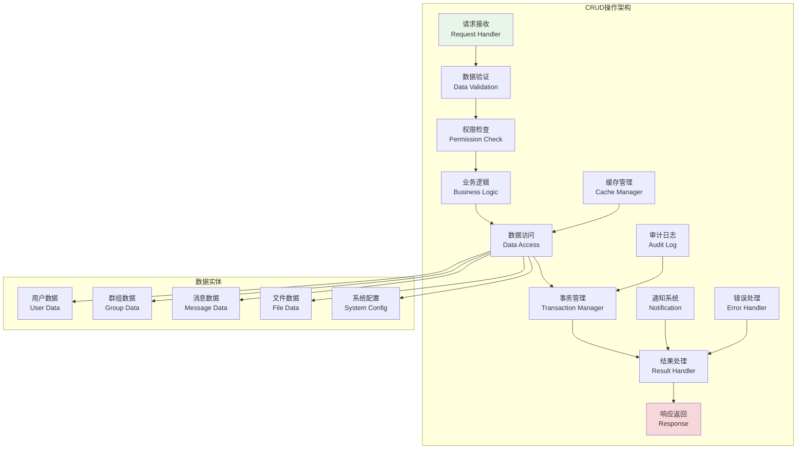
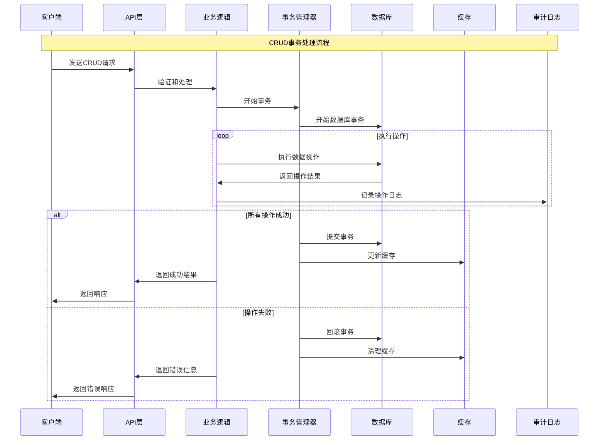

# CRUD操作实现

## 🎯 学习目标

通过本章学习，您将能够：
- 理解Chat-Room管理系统中CRUD操作的设计模式
- 掌握数据验证、事务处理和错误恢复技术
- 学会实现高效的批量操作和数据同步
- 在Chat-Room项目中构建完整的数据管理功能

## 📊 CRUD操作架构

### CRUD操作模式



### 事务处理流程



## 🔨 CRUD操作实现

### Chat-Room数据管理系统

```python
# server/admin/crud_operations.py - CRUD操作实现
from typing import Dict, List, Optional, Any, Union, Type
from dataclasses import dataclass, field, asdict
from abc import ABC, abstractmethod
from datetime import datetime
import json
import asyncio
from enum import Enum
import sqlite3
from contextlib import asynccontextmanager

class OperationType(Enum):
    """操作类型"""
    CREATE = "create"
    READ = "read"
    UPDATE = "update"
    DELETE = "delete"
    BATCH = "batch"

@dataclass
class ValidationRule:
    """验证规则"""
    field: str
    rule_type: str  # required, type, range, regex, custom
    value: Any
    message: str = ""

@dataclass
class CRUDResult:
    """CRUD操作结果"""
    success: bool
    operation: OperationType
    data: Any = None
    message: str = ""
    error_code: str = None
    affected_rows: int = 0
    timestamp: datetime = field(default_factory=datetime.now)
    
    def to_dict(self) -> Dict[str, Any]:
        """转换为字典"""
        return {
            "success": self.success,
            "operation": self.operation.value,
            "data": self.data,
            "message": self.message,
            "error_code": self.error_code,
            "affected_rows": self.affected_rows,
            "timestamp": self.timestamp.isoformat()
        }

class DataValidator:
    """数据验证器"""
    
    def __init__(self):
        self.rules: Dict[str, List[ValidationRule]] = {}
    
    def add_rule(self, entity_type: str, rule: ValidationRule):
        """添加验证规则"""
        if entity_type not in self.rules:
            self.rules[entity_type] = []
        self.rules[entity_type].append(rule)
    
    def validate(self, entity_type: str, data: Dict[str, Any]) -> tuple[bool, List[str]]:
        """验证数据"""
        errors = []
        
        if entity_type not in self.rules:
            return True, errors
        
        for rule in self.rules[entity_type]:
            field_value = data.get(rule.field)
            
            if rule.rule_type == "required":
                if field_value is None or field_value == "":
                    errors.append(rule.message or f"字段 {rule.field} 是必需的")
            
            elif rule.rule_type == "type":
                if field_value is not None and not isinstance(field_value, rule.value):
                    errors.append(rule.message or f"字段 {rule.field} 类型错误")
            
            elif rule.rule_type == "range":
                if field_value is not None:
                    min_val, max_val = rule.value
                    if not (min_val <= field_value <= max_val):
                        errors.append(rule.message or f"字段 {rule.field} 超出范围")
            
            elif rule.rule_type == "regex":
                if field_value is not None:
                    import re
                    if not re.match(rule.value, str(field_value)):
                        errors.append(rule.message or f"字段 {rule.field} 格式错误")
        
        return len(errors) == 0, errors

class TransactionManager:
    """事务管理器"""
    
    def __init__(self, db_connection):
        self.db = db_connection
        self.active_transactions = {}
    
    @asynccontextmanager
    async def transaction(self, transaction_id: str = None):
        """事务上下文管理器"""
        if transaction_id is None:
            transaction_id = f"tx_{datetime.now().timestamp()}"
        
        try:
            # 开始事务
            await self._begin_transaction(transaction_id)
            yield transaction_id
            # 提交事务
            await self._commit_transaction(transaction_id)
        except Exception as e:
            # 回滚事务
            await self._rollback_transaction(transaction_id)
            raise e
        finally:
            # 清理事务
            self.active_transactions.pop(transaction_id, None)
    
    async def _begin_transaction(self, transaction_id: str):
        """开始事务"""
        # 这里应该实现实际的数据库事务开始逻辑
        self.active_transactions[transaction_id] = {
            "started_at": datetime.now(),
            "operations": []
        }
    
    async def _commit_transaction(self, transaction_id: str):
        """提交事务"""
        # 这里应该实现实际的数据库事务提交逻辑
        pass
    
    async def _rollback_transaction(self, transaction_id: str):
        """回滚事务"""
        # 这里应该实现实际的数据库事务回滚逻辑
        pass

class BaseCRUDService(ABC):
    """CRUD服务基类"""
    
    def __init__(self, entity_name: str, validator: DataValidator, 
                 transaction_manager: TransactionManager):
        self.entity_name = entity_name
        self.validator = validator
        self.transaction_manager = transaction_manager
        self.audit_logs: List[Dict[str, Any]] = []
    
    async def create(self, data: Dict[str, Any], user_id: int = None) -> CRUDResult:
        """创建实体"""
        try:
            # 数据验证
            is_valid, errors = self.validator.validate(self.entity_name, data)
            if not is_valid:
                return CRUDResult(
                    success=False,
                    operation=OperationType.CREATE,
                    message="; ".join(errors),
                    error_code="VALIDATION_ERROR"
                )
            
            # 执行创建
            async with self.transaction_manager.transaction() as tx_id:
                result = await self._do_create(data, tx_id)
                
                # 记录审计日志
                await self._log_operation(OperationType.CREATE, data, result, user_id)
                
                return CRUDResult(
                    success=True,
                    operation=OperationType.CREATE,
                    data=result,
                    message=f"{self.entity_name} 创建成功",
                    affected_rows=1
                )
        
        except Exception as e:
            return CRUDResult(
                success=False,
                operation=OperationType.CREATE,
                message=str(e),
                error_code="CREATE_ERROR"
            )
    
    async def read(self, entity_id: Any = None, filters: Dict[str, Any] = None,
                  pagination: Dict[str, Any] = None) -> CRUDResult:
        """读取实体"""
        try:
            result = await self._do_read(entity_id, filters, pagination)
            
            return CRUDResult(
                success=True,
                operation=OperationType.READ,
                data=result,
                message=f"{self.entity_name} 查询成功"
            )
        
        except Exception as e:
            return CRUDResult(
                success=False,
                operation=OperationType.READ,
                message=str(e),
                error_code="READ_ERROR"
            )
    
    async def update(self, entity_id: Any, data: Dict[str, Any], 
                    user_id: int = None) -> CRUDResult:
        """更新实体"""
        try:
            # 数据验证（只验证提供的字段）
            is_valid, errors = self.validator.validate(self.entity_name, data)
            if not is_valid:
                return CRUDResult(
                    success=False,
                    operation=OperationType.UPDATE,
                    message="; ".join(errors),
                    error_code="VALIDATION_ERROR"
                )
            
            # 执行更新
            async with self.transaction_manager.transaction() as tx_id:
                old_data = await self._get_entity_by_id(entity_id)
                result = await self._do_update(entity_id, data, tx_id)
                
                # 记录审计日志
                await self._log_operation(OperationType.UPDATE, {
                    "id": entity_id,
                    "old_data": old_data,
                    "new_data": data
                }, result, user_id)
                
                return CRUDResult(
                    success=True,
                    operation=OperationType.UPDATE,
                    data=result,
                    message=f"{self.entity_name} 更新成功",
                    affected_rows=1
                )
        
        except Exception as e:
            return CRUDResult(
                success=False,
                operation=OperationType.UPDATE,
                message=str(e),
                error_code="UPDATE_ERROR"
            )
    
    async def delete(self, entity_id: Any, user_id: int = None, 
                    soft_delete: bool = True) -> CRUDResult:
        """删除实体"""
        try:
            async with self.transaction_manager.transaction() as tx_id:
                old_data = await self._get_entity_by_id(entity_id)
                result = await self._do_delete(entity_id, tx_id, soft_delete)
                
                # 记录审计日志
                await self._log_operation(OperationType.DELETE, {
                    "id": entity_id,
                    "deleted_data": old_data,
                    "soft_delete": soft_delete
                }, result, user_id)
                
                return CRUDResult(
                    success=True,
                    operation=OperationType.DELETE,
                    data={"deleted_id": entity_id},
                    message=f"{self.entity_name} 删除成功",
                    affected_rows=1
                )
        
        except Exception as e:
            return CRUDResult(
                success=False,
                operation=OperationType.DELETE,
                message=str(e),
                error_code="DELETE_ERROR"
            )
    
    async def batch_operation(self, operations: List[Dict[str, Any]], 
                             user_id: int = None) -> CRUDResult:
        """批量操作"""
        try:
            results = []
            
            async with self.transaction_manager.transaction() as tx_id:
                for op in operations:
                    op_type = op.get("type")
                    op_data = op.get("data", {})
                    
                    if op_type == "create":
                        result = await self._do_create(op_data, tx_id)
                    elif op_type == "update":
                        result = await self._do_update(op.get("id"), op_data, tx_id)
                    elif op_type == "delete":
                        result = await self._do_delete(op.get("id"), tx_id)
                    else:
                        raise ValueError(f"不支持的操作类型: {op_type}")
                    
                    results.append(result)
                
                # 记录审计日志
                await self._log_operation(OperationType.BATCH, {
                    "operations": operations,
                    "results": results
                }, results, user_id)
                
                return CRUDResult(
                    success=True,
                    operation=OperationType.BATCH,
                    data=results,
                    message=f"批量操作完成",
                    affected_rows=len(results)
                )
        
        except Exception as e:
            return CRUDResult(
                success=False,
                operation=OperationType.BATCH,
                message=str(e),
                error_code="BATCH_ERROR"
            )
    
    @abstractmethod
    async def _do_create(self, data: Dict[str, Any], transaction_id: str) -> Any:
        """执行创建操作"""
        pass
    
    @abstractmethod
    async def _do_read(self, entity_id: Any = None, filters: Dict[str, Any] = None,
                      pagination: Dict[str, Any] = None) -> Any:
        """执行读取操作"""
        pass
    
    @abstractmethod
    async def _do_update(self, entity_id: Any, data: Dict[str, Any], 
                        transaction_id: str) -> Any:
        """执行更新操作"""
        pass
    
    @abstractmethod
    async def _do_delete(self, entity_id: Any, transaction_id: str, 
                        soft_delete: bool = True) -> Any:
        """执行删除操作"""
        pass
    
    @abstractmethod
    async def _get_entity_by_id(self, entity_id: Any) -> Any:
        """根据ID获取实体"""
        pass
    
    async def _log_operation(self, operation: OperationType, data: Dict[str, Any],
                           result: Any, user_id: int = None):
        """记录操作日志"""
        log_entry = {
            "entity_name": self.entity_name,
            "operation": operation.value,
            "data": data,
            "result": result,
            "user_id": user_id,
            "timestamp": datetime.now().isoformat()
        }
        
        self.audit_logs.append(log_entry)
        
        # 保持日志数量限制
        if len(self.audit_logs) > 1000:
            self.audit_logs = self.audit_logs[-1000:]

class UserCRUDService(BaseCRUDService):
    """用户CRUD服务"""
    
    def __init__(self, validator: DataValidator, transaction_manager: TransactionManager):
        super().__init__("user", validator, transaction_manager)
        
        # 添加用户验证规则
        self._setup_validation_rules()
        
        # 模拟用户数据存储
        self.users: Dict[int, Dict[str, Any]] = {}
        self.next_id = 1
    
    def _setup_validation_rules(self):
        """设置验证规则"""
        rules = [
            ValidationRule("username", "required", None, "用户名是必需的"),
            ValidationRule("username", "type", str, "用户名必须是字符串"),
            ValidationRule("email", "required", None, "邮箱是必需的"),
            ValidationRule("email", "regex", r'^[^@]+@[^@]+\.[^@]+$', "邮箱格式错误"),
            ValidationRule("age", "type", int, "年龄必须是整数"),
            ValidationRule("age", "range", (0, 150), "年龄必须在0-150之间"),
        ]
        
        for rule in rules:
            self.validator.add_rule("user", rule)
    
    async def _do_create(self, data: Dict[str, Any], transaction_id: str) -> Any:
        """执行用户创建"""
        user_id = self.next_id
        self.next_id += 1
        
        user_data = {
            "id": user_id,
            "username": data["username"],
            "email": data["email"],
            "age": data.get("age"),
            "status": "active",
            "created_at": datetime.now().isoformat(),
            "updated_at": datetime.now().isoformat()
        }
        
        self.users[user_id] = user_data
        return user_data
    
    async def _do_read(self, entity_id: Any = None, filters: Dict[str, Any] = None,
                      pagination: Dict[str, Any] = None) -> Any:
        """执行用户读取"""
        if entity_id is not None:
            return self.users.get(entity_id)
        
        # 应用过滤器
        users = list(self.users.values())
        
        if filters:
            for key, value in filters.items():
                users = [u for u in users if u.get(key) == value]
        
        # 应用分页
        if pagination:
            page = pagination.get("page", 1)
            size = pagination.get("size", 10)
            start = (page - 1) * size
            end = start + size
            users = users[start:end]
        
        return {
            "users": users,
            "total": len(self.users),
            "page": pagination.get("page", 1) if pagination else 1,
            "size": len(users)
        }
    
    async def _do_update(self, entity_id: Any, data: Dict[str, Any], 
                        transaction_id: str) -> Any:
        """执行用户更新"""
        if entity_id not in self.users:
            raise ValueError(f"用户 {entity_id} 不存在")
        
        user = self.users[entity_id]
        
        # 更新字段
        for key, value in data.items():
            if key != "id":  # 不允许更新ID
                user[key] = value
        
        user["updated_at"] = datetime.now().isoformat()
        
        return user
    
    async def _do_delete(self, entity_id: Any, transaction_id: str, 
                        soft_delete: bool = True) -> Any:
        """执行用户删除"""
        if entity_id not in self.users:
            raise ValueError(f"用户 {entity_id} 不存在")
        
        if soft_delete:
            # 软删除：标记为已删除
            self.users[entity_id]["status"] = "deleted"
            self.users[entity_id]["deleted_at"] = datetime.now().isoformat()
            return self.users[entity_id]
        else:
            # 硬删除：直接移除
            return self.users.pop(entity_id)
    
    async def _get_entity_by_id(self, entity_id: Any) -> Any:
        """根据ID获取用户"""
        return self.users.get(entity_id)

# 使用示例
async def demo_crud_operations():
    """CRUD操作演示"""
    # 初始化组件
    validator = DataValidator()
    transaction_manager = TransactionManager(None)  # 这里应该传入实际的数据库连接
    user_service = UserCRUDService(validator, transaction_manager)
    
    print("=== Chat-Room CRUD操作演示 ===")
    
    # 创建用户
    print("\n1. 创建用户")
    create_result = await user_service.create({
        "username": "alice",
        "email": "alice@example.com",
        "age": 25
    }, user_id=1)
    print(f"创建结果: {create_result.success}")
    print(f"创建数据: {create_result.data}")
    
    # 读取用户
    print("\n2. 读取用户")
    read_result = await user_service.read(entity_id=1)
    print(f"读取结果: {read_result.success}")
    print(f"用户数据: {read_result.data}")
    
    # 更新用户
    print("\n3. 更新用户")
    update_result = await user_service.update(1, {
        "age": 26,
        "status": "premium"
    }, user_id=1)
    print(f"更新结果: {update_result.success}")
    print(f"更新数据: {update_result.data}")
    
    # 批量操作
    print("\n4. 批量操作")
    batch_operations = [
        {"type": "create", "data": {"username": "bob", "email": "bob@example.com", "age": 30}},
        {"type": "create", "data": {"username": "charlie", "email": "charlie@example.com", "age": 28}},
        {"type": "update", "id": 1, "data": {"status": "vip"}}
    ]
    
    batch_result = await user_service.batch_operation(batch_operations, user_id=1)
    print(f"批量操作结果: {batch_result.success}")
    print(f"影响行数: {batch_result.affected_rows}")
    
    # 查询所有用户
    print("\n5. 查询所有用户")
    all_users_result = await user_service.read()
    print(f"查询结果: {all_users_result.success}")
    print(f"用户总数: {all_users_result.data['total']}")
    
    # 删除用户
    print("\n6. 删除用户")
    delete_result = await user_service.delete(2, user_id=1, soft_delete=True)
    print(f"删除结果: {delete_result.success}")
    print(f"删除消息: {delete_result.message}")

if __name__ == "__main__":
    asyncio.run(demo_crud_operations())
```

## 🎯 实践练习

### 练习1：高级查询系统
```python
class AdvancedQueryBuilder:
    """
    高级查询构建器练习
    
    要求：
    1. 支持复杂的查询条件组合
    2. 实现动态排序和分页
    3. 添加查询性能优化
    4. 支持查询结果的缓存
    """
    
    def build_query(self, filters: Dict[str, Any], sorts: List[str], 
                   pagination: Dict[str, int]) -> str:
        """构建查询语句"""
        # TODO: 实现查询构建
        pass
    
    def optimize_query(self, query: str) -> str:
        """优化查询性能"""
        # TODO: 实现查询优化
        pass
```

### 练习2：数据同步系统
```python
class DataSynchronizer:
    """
    数据同步系统练习
    
    要求：
    1. 实现多数据源的同步机制
    2. 支持增量同步和全量同步
    3. 添加冲突检测和解决
    4. 实现同步状态的监控
    """
    
    async def sync_data(self, source: str, target: str, 
                       sync_type: str = "incremental") -> bool:
        """同步数据"""
        # TODO: 实现数据同步
        pass
    
    async def resolve_conflicts(self, conflicts: List[Dict[str, Any]]) -> List[Dict[str, Any]]:
        """解决数据冲突"""
        # TODO: 实现冲突解决
        pass
```

## ✅ 学习检查

完成本章学习后，请确认您能够：

- [ ] 理解CRUD操作的设计模式和架构
- [ ] 实现完整的数据验证和事务管理
- [ ] 设计高效的批量操作和查询系统
- [ ] 处理数据的审计日志和错误恢复
- [ ] 优化CRUD操作的性能和可靠性
- [ ] 完成实践练习

## 📚 下一步

CRUD操作实现掌握后，请继续学习：
- [安全措施](security-measures.md)

---

**现在您已经掌握了CRUD操作的核心技术！** 📊
