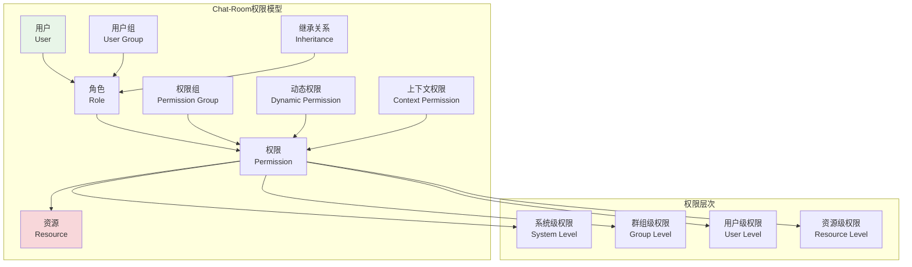
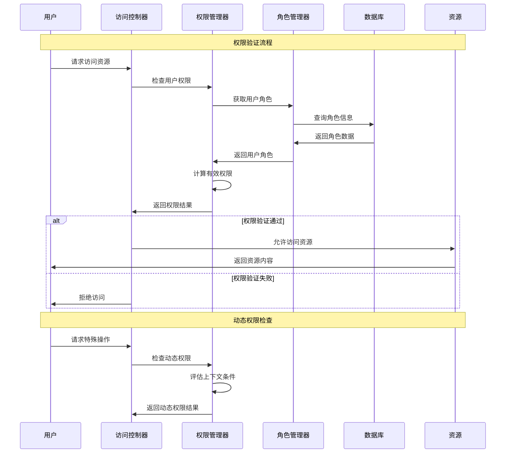

# 权限模型设计

## 🎯 学习目标

通过本章学习，您将能够：
- 理解Chat-Room管理员系统的权限模型设计
- 掌握基于角色的访问控制（RBAC）实现
- 学会设计灵活的权限验证和授权机制
- 在Chat-Room项目中实现完整的权限管理系统

## 🔐 权限模型架构

### RBAC权限模型概览



### 权限验证流程



## 🏗️ 权限模型实现

### Chat-Room权限系统核心实现

```python
# server/admin/permission_system.py - 权限系统
from typing import Dict, List, Set, Optional, Any, Union
from dataclasses import dataclass, field
from enum import Enum
from datetime import datetime, timedelta
import json
import hashlib
from abc import ABC, abstractmethod

class PermissionLevel(Enum):
    """权限级别"""
    SYSTEM = "system"      # 系统级权限
    GROUP = "group"        # 群组级权限
    USER = "user"          # 用户级权限
    RESOURCE = "resource"  # 资源级权限

class ActionType(Enum):
    """操作类型"""
    CREATE = "create"
    READ = "read"
    UPDATE = "update"
    DELETE = "delete"
    EXECUTE = "execute"
    MANAGE = "manage"

@dataclass
class Permission:
    """权限定义"""
    id: str
    name: str
    description: str
    level: PermissionLevel
    action: ActionType
    resource_type: str
    conditions: Dict[str, Any] = field(default_factory=dict)
    is_active: bool = True
    created_at: datetime = field(default_factory=datetime.now)
    
    def __post_init__(self):
        if not self.id:
            self.id = self._generate_id()
    
    def _generate_id(self) -> str:
        """生成权限ID"""
        content = f"{self.level.value}:{self.action.value}:{self.resource_type}"
        return hashlib.md5(content.encode()).hexdigest()[:16]
    
    def matches(self, level: PermissionLevel, action: ActionType, 
               resource_type: str, context: Dict[str, Any] = None) -> bool:
        """检查权限是否匹配"""
        if not self.is_active:
            return False
        
        # 基本匹配
        if (self.level != level or 
            self.action != action or 
            self.resource_type != resource_type):
            return False
        
        # 条件匹配
        if self.conditions and context:
            return self._check_conditions(context)
        
        return True
    
    def _check_conditions(self, context: Dict[str, Any]) -> bool:
        """检查权限条件"""
        for key, expected_value in self.conditions.items():
            if key not in context:
                return False
            
            actual_value = context[key]
            
            # 支持不同类型的条件检查
            if isinstance(expected_value, dict):
                if "in" in expected_value:
                    if actual_value not in expected_value["in"]:
                        return False
                elif "range" in expected_value:
                    min_val, max_val = expected_value["range"]
                    if not (min_val <= actual_value <= max_val):
                        return False
                elif "regex" in expected_value:
                    import re
                    if not re.match(expected_value["regex"], str(actual_value)):
                        return False
            else:
                if actual_value != expected_value:
                    return False
        
        return True

@dataclass
class Role:
    """角色定义"""
    id: str
    name: str
    description: str
    permissions: Set[str] = field(default_factory=set)
    parent_roles: Set[str] = field(default_factory=set)
    is_system_role: bool = False
    is_active: bool = True
    created_at: datetime = field(default_factory=datetime.now)
    
    def add_permission(self, permission_id: str):
        """添加权限"""
        self.permissions.add(permission_id)
    
    def remove_permission(self, permission_id: str):
        """移除权限"""
        self.permissions.discard(permission_id)
    
    def has_permission(self, permission_id: str) -> bool:
        """检查是否有指定权限"""
        return permission_id in self.permissions
    
    def add_parent_role(self, role_id: str):
        """添加父角色"""
        self.parent_roles.add(role_id)
    
    def remove_parent_role(self, role_id: str):
        """移除父角色"""
        self.parent_roles.discard(role_id)

@dataclass
class UserPermission:
    """用户权限"""
    user_id: int
    roles: Set[str] = field(default_factory=set)
    direct_permissions: Set[str] = field(default_factory=set)
    denied_permissions: Set[str] = field(default_factory=set)
    temporary_permissions: Dict[str, datetime] = field(default_factory=dict)
    is_active: bool = True
    
    def add_role(self, role_id: str):
        """添加角色"""
        self.roles.add(role_id)
    
    def remove_role(self, role_id: str):
        """移除角色"""
        self.roles.discard(role_id)
    
    def add_direct_permission(self, permission_id: str):
        """添加直接权限"""
        self.direct_permissions.add(permission_id)
    
    def deny_permission(self, permission_id: str):
        """拒绝权限"""
        self.denied_permissions.add(permission_id)
    
    def add_temporary_permission(self, permission_id: str, expires_at: datetime):
        """添加临时权限"""
        self.temporary_permissions[permission_id] = expires_at
    
    def cleanup_expired_permissions(self):
        """清理过期的临时权限"""
        now = datetime.now()
        expired_permissions = [
            perm_id for perm_id, expires_at in self.temporary_permissions.items()
            if expires_at <= now
        ]
        
        for perm_id in expired_permissions:
            del self.temporary_permissions[perm_id]

class PermissionManager:
    """
    权限管理器
    
    功能：
    1. 权限的定义和管理
    2. 角色的创建和分配
    3. 用户权限的计算和验证
    4. 权限继承和动态权限
    """
    
    def __init__(self):
        # 权限存储
        self.permissions: Dict[str, Permission] = {}
        self.roles: Dict[str, Role] = {}
        self.user_permissions: Dict[int, UserPermission] = {}
        
        # 权限缓存
        self.permission_cache: Dict[str, Set[str]] = {}
        self.cache_ttl = 300  # 5分钟缓存
        self.cache_timestamps: Dict[str, datetime] = {}
        
        # 初始化系统权限和角色
        self._init_system_permissions()
        self._init_system_roles()
    
    def _init_system_permissions(self):
        """初始化系统权限"""
        system_permissions = [
            # 用户管理权限
            Permission("user_create", "创建用户", "创建新用户账户", 
                      PermissionLevel.SYSTEM, ActionType.CREATE, "user"),
            Permission("user_read", "查看用户", "查看用户信息", 
                      PermissionLevel.SYSTEM, ActionType.READ, "user"),
            Permission("user_update", "更新用户", "修改用户信息", 
                      PermissionLevel.SYSTEM, ActionType.UPDATE, "user"),
            Permission("user_delete", "删除用户", "删除用户账户", 
                      PermissionLevel.SYSTEM, ActionType.DELETE, "user"),
            Permission("user_ban", "封禁用户", "封禁用户账户", 
                      PermissionLevel.SYSTEM, ActionType.EXECUTE, "user"),
            
            # 群组管理权限
            Permission("group_create", "创建群组", "创建新群组", 
                      PermissionLevel.SYSTEM, ActionType.CREATE, "group"),
            Permission("group_read", "查看群组", "查看群组信息", 
                      PermissionLevel.GROUP, ActionType.READ, "group"),
            Permission("group_update", "更新群组", "修改群组设置", 
                      PermissionLevel.GROUP, ActionType.UPDATE, "group"),
            Permission("group_delete", "删除群组", "删除群组", 
                      PermissionLevel.SYSTEM, ActionType.DELETE, "group"),
            Permission("group_manage_members", "管理成员", "管理群组成员", 
                      PermissionLevel.GROUP, ActionType.MANAGE, "group"),
            
            # 消息管理权限
            Permission("message_read", "查看消息", "查看聊天消息", 
                      PermissionLevel.USER, ActionType.READ, "message"),
            Permission("message_send", "发送消息", "发送聊天消息", 
                      PermissionLevel.USER, ActionType.CREATE, "message"),
            Permission("message_delete", "删除消息", "删除聊天消息", 
                      PermissionLevel.USER, ActionType.DELETE, "message"),
            Permission("message_moderate", "审核消息", "审核和管理消息", 
                      PermissionLevel.GROUP, ActionType.MANAGE, "message"),
            
            # 文件管理权限
            Permission("file_upload", "上传文件", "上传文件到聊天室", 
                      PermissionLevel.USER, ActionType.CREATE, "file"),
            Permission("file_download", "下载文件", "下载聊天室文件", 
                      PermissionLevel.USER, ActionType.READ, "file"),
            Permission("file_delete", "删除文件", "删除聊天室文件", 
                      PermissionLevel.USER, ActionType.DELETE, "file"),
            Permission("file_manage", "管理文件", "管理所有文件", 
                      PermissionLevel.GROUP, ActionType.MANAGE, "file"),
            
            # 系统管理权限
            Permission("system_config", "系统配置", "修改系统配置", 
                      PermissionLevel.SYSTEM, ActionType.MANAGE, "system"),
            Permission("system_monitor", "系统监控", "查看系统状态", 
                      PermissionLevel.SYSTEM, ActionType.READ, "system"),
            Permission("system_backup", "系统备份", "执行系统备份", 
                      PermissionLevel.SYSTEM, ActionType.EXECUTE, "system"),
        ]
        
        for permission in system_permissions:
            self.permissions[permission.id] = permission
    
    def _init_system_roles(self):
        """初始化系统角色"""
        # 超级管理员角色
        super_admin = Role(
            id="super_admin",
            name="超级管理员",
            description="拥有所有系统权限的超级管理员",
            is_system_role=True
        )
        # 添加所有权限
        for permission_id in self.permissions.keys():
            super_admin.add_permission(permission_id)
        
        # 管理员角色
        admin = Role(
            id="admin",
            name="管理员",
            description="拥有大部分管理权限的管理员",
            is_system_role=True
        )
        admin_permissions = [
            "user_read", "user_update", "user_ban",
            "group_create", "group_read", "group_update", "group_manage_members",
            "message_read", "message_moderate",
            "file_manage", "system_monitor"
        ]
        for perm_id in admin_permissions:
            admin.add_permission(perm_id)
        
        # 群组管理员角色
        group_admin = Role(
            id="group_admin",
            name="群组管理员",
            description="群组管理员，可以管理特定群组",
            is_system_role=True
        )
        group_admin_permissions = [
            "group_read", "group_update", "group_manage_members",
            "message_read", "message_moderate", "file_manage"
        ]
        for perm_id in group_admin_permissions:
            group_admin.add_permission(perm_id)
        
        # 普通用户角色
        user = Role(
            id="user",
            name="普通用户",
            description="普通用户，拥有基本的聊天权限",
            is_system_role=True
        )
        user_permissions = [
            "message_read", "message_send", "message_delete",
            "file_upload", "file_download", "file_delete"
        ]
        for perm_id in user_permissions:
            user.add_permission(perm_id)
        
        # 访客角色
        guest = Role(
            id="guest",
            name="访客",
            description="访客用户，只能查看内容",
            is_system_role=True
        )
        guest_permissions = ["message_read", "file_download"]
        for perm_id in guest_permissions:
            guest.add_permission(perm_id)
        
        # 注册角色
        self.roles["super_admin"] = super_admin
        self.roles["admin"] = admin
        self.roles["group_admin"] = group_admin
        self.roles["user"] = user
        self.roles["guest"] = guest
    
    def create_permission(self, permission: Permission) -> bool:
        """创建权限"""
        if permission.id in self.permissions:
            return False
        
        self.permissions[permission.id] = permission
        self._clear_cache()
        return True
    
    def create_role(self, role: Role) -> bool:
        """创建角色"""
        if role.id in self.roles:
            return False
        
        self.roles[role.id] = role
        self._clear_cache()
        return True
    
    def assign_role_to_user(self, user_id: int, role_id: str) -> bool:
        """为用户分配角色"""
        if role_id not in self.roles:
            return False
        
        if user_id not in self.user_permissions:
            self.user_permissions[user_id] = UserPermission(user_id)
        
        self.user_permissions[user_id].add_role(role_id)
        self._clear_user_cache(user_id)
        return True
    
    def remove_role_from_user(self, user_id: int, role_id: str) -> bool:
        """移除用户角色"""
        if user_id not in self.user_permissions:
            return False
        
        self.user_permissions[user_id].remove_role(role_id)
        self._clear_user_cache(user_id)
        return True
    
    def grant_permission_to_user(self, user_id: int, permission_id: str, 
                                temporary: bool = False, expires_at: datetime = None) -> bool:
        """为用户授予权限"""
        if permission_id not in self.permissions:
            return False
        
        if user_id not in self.user_permissions:
            self.user_permissions[user_id] = UserPermission(user_id)
        
        user_perm = self.user_permissions[user_id]
        
        if temporary and expires_at:
            user_perm.add_temporary_permission(permission_id, expires_at)
        else:
            user_perm.add_direct_permission(permission_id)
        
        self._clear_user_cache(user_id)
        return True
    
    def deny_permission_to_user(self, user_id: int, permission_id: str) -> bool:
        """拒绝用户权限"""
        if user_id not in self.user_permissions:
            self.user_permissions[user_id] = UserPermission(user_id)
        
        self.user_permissions[user_id].deny_permission(permission_id)
        self._clear_user_cache(user_id)
        return True
    
    def check_permission(self, user_id: int, level: PermissionLevel, 
                        action: ActionType, resource_type: str,
                        context: Dict[str, Any] = None) -> bool:
        """检查用户权限"""
        # 获取用户的所有有效权限
        user_permissions = self._get_user_effective_permissions(user_id)
        
        # 检查是否有匹配的权限
        for permission_id in user_permissions:
            permission = self.permissions.get(permission_id)
            if permission and permission.matches(level, action, resource_type, context):
                return True
        
        return False
    
    def _get_user_effective_permissions(self, user_id: int) -> Set[str]:
        """获取用户的有效权限"""
        # 检查缓存
        cache_key = f"user_{user_id}_permissions"
        if self._is_cache_valid(cache_key):
            return self.permission_cache[cache_key]
        
        effective_permissions = set()
        
        if user_id not in self.user_permissions:
            return effective_permissions
        
        user_perm = self.user_permissions[user_id]
        
        # 清理过期的临时权限
        user_perm.cleanup_expired_permissions()
        
        # 收集角色权限
        for role_id in user_perm.roles:
            role_permissions = self._get_role_permissions(role_id)
            effective_permissions.update(role_permissions)
        
        # 添加直接权限
        effective_permissions.update(user_perm.direct_permissions)
        
        # 添加临时权限
        effective_permissions.update(user_perm.temporary_permissions.keys())
        
        # 移除被拒绝的权限
        effective_permissions -= user_perm.denied_permissions
        
        # 缓存结果
        self.permission_cache[cache_key] = effective_permissions
        self.cache_timestamps[cache_key] = datetime.now()
        
        return effective_permissions
    
    def _get_role_permissions(self, role_id: str) -> Set[str]:
        """获取角色权限（包括继承）"""
        if role_id not in self.roles:
            return set()
        
        role = self.roles[role_id]
        permissions = role.permissions.copy()
        
        # 递归获取父角色权限
        for parent_role_id in role.parent_roles:
            parent_permissions = self._get_role_permissions(parent_role_id)
            permissions.update(parent_permissions)
        
        return permissions
    
    def _is_cache_valid(self, cache_key: str) -> bool:
        """检查缓存是否有效"""
        if cache_key not in self.cache_timestamps:
            return False
        
        cache_time = self.cache_timestamps[cache_key]
        return (datetime.now() - cache_time).total_seconds() < self.cache_ttl
    
    def _clear_cache(self):
        """清除所有缓存"""
        self.permission_cache.clear()
        self.cache_timestamps.clear()
    
    def _clear_user_cache(self, user_id: int):
        """清除用户缓存"""
        cache_key = f"user_{user_id}_permissions"
        self.permission_cache.pop(cache_key, None)
        self.cache_timestamps.pop(cache_key, None)
    
    def get_user_roles(self, user_id: int) -> List[str]:
        """获取用户角色列表"""
        if user_id not in self.user_permissions:
            return []
        
        return list(self.user_permissions[user_id].roles)
    
    def get_user_permissions_summary(self, user_id: int) -> Dict[str, Any]:
        """获取用户权限摘要"""
        if user_id not in self.user_permissions:
            return {
                "roles": [],
                "direct_permissions": [],
                "denied_permissions": [],
                "temporary_permissions": {},
                "effective_permissions": []
            }
        
        user_perm = self.user_permissions[user_id]
        effective_permissions = self._get_user_effective_permissions(user_id)
        
        return {
            "roles": list(user_perm.roles),
            "direct_permissions": list(user_perm.direct_permissions),
            "denied_permissions": list(user_perm.denied_permissions),
            "temporary_permissions": {
                perm_id: expires_at.isoformat()
                for perm_id, expires_at in user_perm.temporary_permissions.items()
            },
            "effective_permissions": list(effective_permissions)
        }

# 使用示例
def demo_permission_system():
    """权限系统演示"""
    pm = PermissionManager()
    
    print("=== Chat-Room权限系统演示 ===")
    
    # 为用户分配角色
    pm.assign_role_to_user(1, "admin")
    pm.assign_role_to_user(2, "user")
    pm.assign_role_to_user(3, "guest")
    
    # 检查权限
    test_cases = [
        (1, PermissionLevel.SYSTEM, ActionType.CREATE, "user"),
        (2, PermissionLevel.USER, ActionType.CREATE, "message"),
        (3, PermissionLevel.USER, ActionType.CREATE, "message"),
        (2, PermissionLevel.SYSTEM, ActionType.DELETE, "user"),
    ]
    
    for user_id, level, action, resource in test_cases:
        has_permission = pm.check_permission(user_id, level, action, resource)
        print(f"用户{user_id} {action.value} {resource}: {'✓' if has_permission else '✗'}")
    
    # 查看用户权限摘要
    for user_id in [1, 2, 3]:
        summary = pm.get_user_permissions_summary(user_id)
        print(f"\n用户{user_id}权限摘要:")
        print(f"  角色: {summary['roles']}")
        print(f"  有效权限数量: {len(summary['effective_permissions'])}")

if __name__ == "__main__":
    demo_permission_system()
```

## 🎯 实践练习

### 练习1：动态权限系统
```python
class DynamicPermissionSystem:
    """
    动态权限系统练习
    
    要求：
    1. 实现基于时间的权限控制
    2. 支持基于条件的权限评估
    3. 添加权限的自动过期机制
    4. 实现权限的审计和日志
    """
    
    def evaluate_conditional_permission(self, user_id: int, condition: str, context: Dict[str, Any]) -> bool:
        """评估条件权限"""
        # TODO: 实现条件权限评估
        pass
    
    def create_time_based_permission(self, user_id: int, permission_id: str, 
                                   start_time: datetime, end_time: datetime):
        """创建基于时间的权限"""
        # TODO: 实现时间权限
        pass
```

### 练习2：权限继承优化
```python
class PermissionInheritanceOptimizer:
    """
    权限继承优化练习
    
    要求：
    1. 优化权限继承的计算性能
    2. 实现权限冲突的解决机制
    3. 支持权限的批量操作
    4. 添加权限变更的影响分析
    """
    
    def optimize_permission_calculation(self, user_id: int) -> Set[str]:
        """优化权限计算"""
        # TODO: 实现权限计算优化
        pass
    
    def resolve_permission_conflicts(self, permissions: List[Permission]) -> List[Permission]:
        """解决权限冲突"""
        # TODO: 实现权限冲突解决
        pass
```

## ✅ 学习检查

完成本章学习后，请确认您能够：

- [ ] 理解RBAC权限模型的设计原理
- [ ] 实现完整的权限定义和管理系统
- [ ] 设计灵活的角色和权限分配机制
- [ ] 处理权限继承和动态权限
- [ ] 优化权限验证的性能
- [ ] 完成实践练习

## 📚 下一步

权限模型设计掌握后，请继续学习：
- [命令系统](command-system.md)
- [CRUD操作](crud-operations.md)
- [安全措施](security-measures.md)

---

**现在您已经掌握了权限模型设计的核心技术！** 🔐
