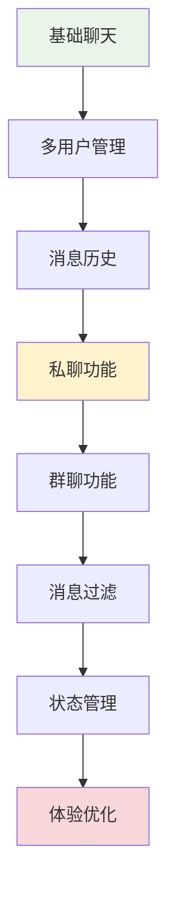
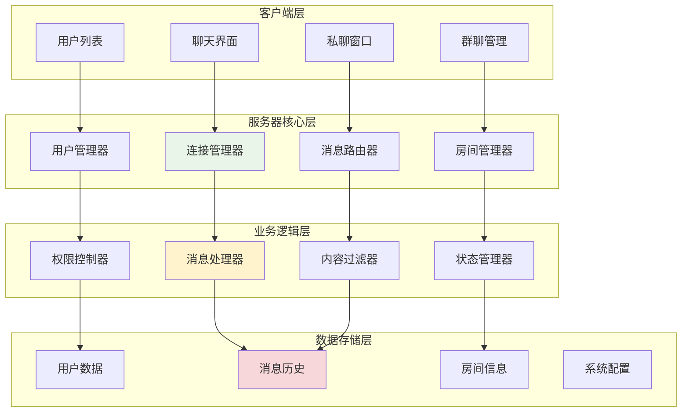

# 第5章：多人聊天与消息管理

## 🎯 学习目标

通过本章学习，您将能够：
- 实现多用户并发聊天功能
- 掌握用户状态管理和在线列表
- 学会消息历史记录和持久化
- 实现私聊和群聊功能
- 掌握消息过滤和内容管理
- 优化聊天室的用户体验

## 📖 本章概览

在第4章的基础上，本章将扩展Chat-Room的功能，从简单的消息收发发展为功能完整的多人聊天系统。我们将重点关注用户管理、消息管理和聊天体验的优化。

### 功能扩展路径



## 📚 章节内容

### 5.1 多用户并发管理
- [用户连接池管理](user-connection-pool.md) - 高效管理多个用户连接
- [用户状态跟踪](user-state-tracking.md) - 实时跟踪用户在线状态
- [并发安全处理](concurrent-safety.md) - 线程安全的用户数据操作
- [连接异常处理](connection-exception-handling.md) - 处理用户异常断开

### 5.2 消息历史与持久化
- [消息存储设计](message-storage-design.md) - 设计消息存储结构
- [历史消息查询](history-message-query.md) - 实现消息历史查询功能
- [消息分页加载](message-pagination.md) - 优化大量消息的加载
- [数据清理策略](data-cleanup-strategy.md) - 管理历史数据的生命周期

### 5.3 私聊与群聊功能
- [私聊消息路由](private-message-routing.md) - 实现点对点消息传递
- [群聊房间管理](group-chat-management.md) - 创建和管理聊天群组
- [消息权限控制](message-permission-control.md) - 控制消息的发送权限
- [聊天室功能扩展](chatroom-feature-extension.md) - 扩展聊天室高级功能

### 5.4 消息过滤与内容管理
- [内容过滤系统](content-filtering-system.md) - 过滤不当内容
- [消息格式化](message-formatting.md) - 支持富文本和表情
- [消息统计分析](message-statistics.md) - 分析聊天数据
- [用户行为监控](user-behavior-monitoring.md) - 监控和管理用户行为

## 🏗️ 系统架构升级

### 多用户架构设计



## 🔧 核心功能实现

### 1. 用户管理系统

```python
"""
用户管理系统实现
"""

import threading
import time
from typing import Dict, List, Optional, Set
from enum import Enum
from dataclasses import dataclass


class UserStatus(Enum):
    """用户状态枚举"""
    ONLINE = "online"
    AWAY = "away"
    BUSY = "busy"
    OFFLINE = "offline"


@dataclass
class User:
    """用户信息类"""
    user_id: str
    username: str
    socket: object
    status: UserStatus = UserStatus.ONLINE
    join_time: float = None
    last_active: float = None
    current_room: Optional[str] = None
    
    def __post_init__(self):
        if self.join_time is None:
            self.join_time = time.time()
        if self.last_active is None:
            self.last_active = time.time()


class UserManager:
    """用户管理器"""
    
    def __init__(self):
        self.users: Dict[str, User] = {}  # user_id -> User
        self.username_to_id: Dict[str, str] = {}  # username -> user_id
        self.socket_to_id: Dict[object, str] = {}  # socket -> user_id
        self._lock = threading.RLock()  # 可重入锁
    
    def add_user(self, user_id: str, username: str, socket: object) -> bool:
        """添加用户"""
        with self._lock:
            # 检查用户名是否已存在
            if username in self.username_to_id:
                return False
            
            # 创建用户对象
            user = User(
                user_id=user_id,
                username=username,
                socket=socket
            )
            
            # 添加到各个映射表
            self.users[user_id] = user
            self.username_to_id[username] = user_id
            self.socket_to_id[socket] = user_id
            
            print(f"用户 {username} ({user_id}) 已加入")
            return True
    
    def remove_user(self, user_id: str) -> Optional[User]:
        """移除用户"""
        with self._lock:
            user = self.users.get(user_id)
            if not user:
                return None
            
            # 从各个映射表中移除
            del self.users[user_id]
            del self.username_to_id[user.username]
            del self.socket_to_id[user.socket]
            
            print(f"用户 {user.username} ({user_id}) 已离开")
            return user
    
    def get_user_by_id(self, user_id: str) -> Optional[User]:
        """根据ID获取用户"""
        with self._lock:
            return self.users.get(user_id)
    
    def get_user_by_username(self, username: str) -> Optional[User]:
        """根据用户名获取用户"""
        with self._lock:
            user_id = self.username_to_id.get(username)
            return self.users.get(user_id) if user_id else None
    
    def get_user_by_socket(self, socket: object) -> Optional[User]:
        """根据Socket获取用户"""
        with self._lock:
            user_id = self.socket_to_id.get(socket)
            return self.users.get(user_id) if user_id else None
    
    def get_online_users(self) -> List[User]:
        """获取在线用户列表"""
        with self._lock:
            return [user for user in self.users.values() 
                   if user.status != UserStatus.OFFLINE]
    
    def get_users_in_room(self, room_id: str) -> List[User]:
        """获取房间内的用户"""
        with self._lock:
            return [user for user in self.users.values() 
                   if user.current_room == room_id]
    
    def update_user_status(self, user_id: str, status: UserStatus) -> bool:
        """更新用户状态"""
        with self._lock:
            user = self.users.get(user_id)
            if user:
                user.status = status
                user.last_active = time.time()
                return True
            return False
    
    def update_user_activity(self, user_id: str) -> bool:
        """更新用户活跃时间"""
        with self._lock:
            user = self.users.get(user_id)
            if user:
                user.last_active = time.time()
                return True
            return False
    
    def get_user_count(self) -> int:
        """获取用户总数"""
        with self._lock:
            return len(self.users)
    
    def is_username_available(self, username: str) -> bool:
        """检查用户名是否可用"""
        with self._lock:
            return username not in self.username_to_id
```

### 2. 消息历史管理

```python
"""
消息历史管理系统
"""

import sqlite3
import json
import time
from typing import List, Dict, Any, Optional
from dataclasses import dataclass, asdict


@dataclass
class HistoryMessage:
    """历史消息类"""
    message_id: str
    sender_id: str
    sender_name: str
    content: str
    message_type: str
    room_id: Optional[str] = None
    target_user_id: Optional[str] = None
    timestamp: float = None
    metadata: Optional[Dict[str, Any]] = None
    
    def __post_init__(self):
        if self.timestamp is None:
            self.timestamp = time.time()
        if self.metadata is None:
            self.metadata = {}


class MessageHistoryManager:
    """消息历史管理器"""
    
    def __init__(self, db_path: str = "chat_history.db"):
        self.db_path = db_path
        self._init_database()
    
    def _init_database(self):
        """初始化数据库"""
        conn = sqlite3.connect(self.db_path)
        cursor = conn.cursor()
        
        # 创建消息表
        cursor.execute('''
            CREATE TABLE IF NOT EXISTS messages (
                id INTEGER PRIMARY KEY AUTOINCREMENT,
                message_id TEXT UNIQUE NOT NULL,
                sender_id TEXT NOT NULL,
                sender_name TEXT NOT NULL,
                content TEXT NOT NULL,
                message_type TEXT NOT NULL,
                room_id TEXT,
                target_user_id TEXT,
                timestamp REAL NOT NULL,
                metadata TEXT,
                created_at DATETIME DEFAULT CURRENT_TIMESTAMP
            )
        ''')
        
        # 创建索引
        cursor.execute('CREATE INDEX IF NOT EXISTS idx_timestamp ON messages(timestamp)')
        cursor.execute('CREATE INDEX IF NOT EXISTS idx_room_id ON messages(room_id)')
        cursor.execute('CREATE INDEX IF NOT EXISTS idx_sender_id ON messages(sender_id)')
        
        conn.commit()
        conn.close()
    
    def save_message(self, message: HistoryMessage) -> bool:
        """保存消息"""
        try:
            conn = sqlite3.connect(self.db_path)
            cursor = conn.cursor()
            
            cursor.execute('''
                INSERT INTO messages 
                (message_id, sender_id, sender_name, content, message_type, 
                 room_id, target_user_id, timestamp, metadata)
                VALUES (?, ?, ?, ?, ?, ?, ?, ?, ?)
            ''', (
                message.message_id,
                message.sender_id,
                message.sender_name,
                message.content,
                message.message_type,
                message.room_id,
                message.target_user_id,
                message.timestamp,
                json.dumps(message.metadata) if message.metadata else None
            ))
            
            conn.commit()
            conn.close()
            return True
            
        except Exception as e:
            print(f"保存消息失败: {e}")
            return False
    
    def get_recent_messages(self, room_id: str = None, limit: int = 50) -> List[HistoryMessage]:
        """获取最近的消息"""
        try:
            conn = sqlite3.connect(self.db_path)
            cursor = conn.cursor()
            
            if room_id:
                cursor.execute('''
                    SELECT message_id, sender_id, sender_name, content, message_type,
                           room_id, target_user_id, timestamp, metadata
                    FROM messages 
                    WHERE room_id = ? OR room_id IS NULL
                    ORDER BY timestamp DESC 
                    LIMIT ?
                ''', (room_id, limit))
            else:
                cursor.execute('''
                    SELECT message_id, sender_id, sender_name, content, message_type,
                           room_id, target_user_id, timestamp, metadata
                    FROM messages 
                    WHERE room_id IS NULL
                    ORDER BY timestamp DESC 
                    LIMIT ?
                ''', (limit,))
            
            messages = []
            for row in cursor.fetchall():
                metadata = json.loads(row[8]) if row[8] else {}
                message = HistoryMessage(
                    message_id=row[0],
                    sender_id=row[1],
                    sender_name=row[2],
                    content=row[3],
                    message_type=row[4],
                    room_id=row[5],
                    target_user_id=row[6],
                    timestamp=row[7],
                    metadata=metadata
                )
                messages.append(message)
            
            conn.close()
            return list(reversed(messages))  # 按时间正序返回
            
        except Exception as e:
            print(f"获取历史消息失败: {e}")
            return []
    
    def get_private_messages(self, user1_id: str, user2_id: str, limit: int = 50) -> List[HistoryMessage]:
        """获取私聊消息"""
        try:
            conn = sqlite3.connect(self.db_path)
            cursor = conn.cursor()
            
            cursor.execute('''
                SELECT message_id, sender_id, sender_name, content, message_type,
                       room_id, target_user_id, timestamp, metadata
                FROM messages 
                WHERE message_type = 'private' AND (
                    (sender_id = ? AND target_user_id = ?) OR 
                    (sender_id = ? AND target_user_id = ?)
                )
                ORDER BY timestamp DESC 
                LIMIT ?
            ''', (user1_id, user2_id, user2_id, user1_id, limit))
            
            messages = []
            for row in cursor.fetchall():
                metadata = json.loads(row[8]) if row[8] else {}
                message = HistoryMessage(
                    message_id=row[0],
                    sender_id=row[1],
                    sender_name=row[2],
                    content=row[3],
                    message_type=row[4],
                    room_id=row[5],
                    target_user_id=row[6],
                    timestamp=row[7],
                    metadata=metadata
                )
                messages.append(message)
            
            conn.close()
            return list(reversed(messages))
            
        except Exception as e:
            print(f"获取私聊消息失败: {e}")
            return []
    
    def search_messages(self, keyword: str, room_id: str = None, limit: int = 100) -> List[HistoryMessage]:
        """搜索消息"""
        try:
            conn = sqlite3.connect(self.db_path)
            cursor = conn.cursor()
            
            if room_id:
                cursor.execute('''
                    SELECT message_id, sender_id, sender_name, content, message_type,
                           room_id, target_user_id, timestamp, metadata
                    FROM messages 
                    WHERE (room_id = ? OR room_id IS NULL) AND content LIKE ?
                    ORDER BY timestamp DESC 
                    LIMIT ?
                ''', (room_id, f'%{keyword}%', limit))
            else:
                cursor.execute('''
                    SELECT message_id, sender_id, sender_name, content, message_type,
                           room_id, target_user_id, timestamp, metadata
                    FROM messages 
                    WHERE content LIKE ?
                    ORDER BY timestamp DESC 
                    LIMIT ?
                ''', (f'%{keyword}%', limit))
            
            messages = []
            for row in cursor.fetchall():
                metadata = json.loads(row[8]) if row[8] else {}
                message = HistoryMessage(
                    message_id=row[0],
                    sender_id=row[1],
                    sender_name=row[2],
                    content=row[3],
                    message_type=row[4],
                    room_id=row[5],
                    target_user_id=row[6],
                    timestamp=row[7],
                    metadata=metadata
                )
                messages.append(message)
            
            conn.close()
            return messages
            
        except Exception as e:
            print(f"搜索消息失败: {e}")
            return []
    
    def delete_old_messages(self, days: int = 30) -> int:
        """删除旧消息"""
        try:
            conn = sqlite3.connect(self.db_path)
            cursor = conn.cursor()
            
            cutoff_time = time.time() - (days * 24 * 60 * 60)
            
            cursor.execute('DELETE FROM messages WHERE timestamp < ?', (cutoff_time,))
            deleted_count = cursor.rowcount
            
            conn.commit()
            conn.close()
            
            print(f"删除了 {deleted_count} 条旧消息")
            return deleted_count
            
        except Exception as e:
            print(f"删除旧消息失败: {e}")
            return 0
```

### 3. 房间管理系统

```python
"""
房间管理系统
"""

from typing import Dict, List, Set, Optional
import threading
import time


@dataclass
class ChatRoom:
    """聊天房间类"""
    room_id: str
    room_name: str
    creator_id: str
    members: Set[str]
    max_members: int = 50
    is_private: bool = False
    created_at: float = None
    description: str = ""
    
    def __post_init__(self):
        if self.created_at is None:
            self.created_at = time.time()
        if not isinstance(self.members, set):
            self.members = set(self.members) if self.members else set()


class RoomManager:
    """房间管理器"""
    
    def __init__(self):
        self.rooms: Dict[str, ChatRoom] = {}
        self._lock = threading.RLock()
        
        # 创建默认公共房间
        self.create_room("public", "公共聊天室", "system", is_private=False)
    
    def create_room(self, room_id: str, room_name: str, creator_id: str, 
                   max_members: int = 50, is_private: bool = False, 
                   description: str = "") -> bool:
        """创建房间"""
        with self._lock:
            if room_id in self.rooms:
                return False
            
            room = ChatRoom(
                room_id=room_id,
                room_name=room_name,
                creator_id=creator_id,
                members=set(),
                max_members=max_members,
                is_private=is_private,
                description=description
            )
            
            self.rooms[room_id] = room
            print(f"房间 {room_name} ({room_id}) 已创建")
            return True
    
    def delete_room(self, room_id: str, user_id: str) -> bool:
        """删除房间"""
        with self._lock:
            room = self.rooms.get(room_id)
            if not room:
                return False
            
            # 只有创建者可以删除房间
            if room.creator_id != user_id and user_id != "system":
                return False
            
            # 不能删除公共房间
            if room_id == "public":
                return False
            
            del self.rooms[room_id]
            print(f"房间 {room.room_name} ({room_id}) 已删除")
            return True
    
    def join_room(self, room_id: str, user_id: str) -> bool:
        """加入房间"""
        with self._lock:
            room = self.rooms.get(room_id)
            if not room:
                return False
            
            # 检查房间是否已满
            if len(room.members) >= room.max_members:
                return False
            
            room.members.add(user_id)
            print(f"用户 {user_id} 加入房间 {room.room_name}")
            return True
    
    def leave_room(self, room_id: str, user_id: str) -> bool:
        """离开房间"""
        with self._lock:
            room = self.rooms.get(room_id)
            if not room:
                return False
            
            if user_id in room.members:
                room.members.remove(user_id)
                print(f"用户 {user_id} 离开房间 {room.room_name}")
                return True
            
            return False
    
    def get_room(self, room_id: str) -> Optional[ChatRoom]:
        """获取房间信息"""
        with self._lock:
            return self.rooms.get(room_id)
    
    def get_user_rooms(self, user_id: str) -> List[ChatRoom]:
        """获取用户所在的房间"""
        with self._lock:
            return [room for room in self.rooms.values() 
                   if user_id in room.members]
    
    def get_public_rooms(self) -> List[ChatRoom]:
        """获取公共房间列表"""
        with self._lock:
            return [room for room in self.rooms.values() 
                   if not room.is_private]
    
    def get_room_members(self, room_id: str) -> Set[str]:
        """获取房间成员"""
        with self._lock:
            room = self.rooms.get(room_id)
            return room.members.copy() if room else set()
```

## 🎯 实际应用示例

### 多用户聊天演示

```python
"""
多用户聊天系统演示
"""

class MultiUserChatDemo:
    """多用户聊天演示"""
    
    def __init__(self):
        self.user_manager = UserManager()
        self.message_history = MessageHistoryManager()
        self.room_manager = RoomManager()
    
    def simulate_multi_user_chat(self):
        """模拟多用户聊天"""
        print("=== 多用户聊天演示 ===")
        
        # 模拟用户加入
        users = [
            ("user1", "张三", None),
            ("user2", "李四", None),
            ("user3", "王五", None)
        ]
        
        for user_id, username, socket in users:
            self.user_manager.add_user(user_id, username, socket)
            self.room_manager.join_room("public", user_id)
        
        # 模拟聊天消息
        messages = [
            ("user1", "张三", "大家好！"),
            ("user2", "李四", "你好张三！"),
            ("user3", "王五", "大家好，我是新来的"),
            ("user1", "张三", "欢迎王五！")
        ]
        
        for sender_id, sender_name, content in messages:
            # 保存消息历史
            history_msg = HistoryMessage(
                message_id=f"msg_{int(time.time() * 1000)}",
                sender_id=sender_id,
                sender_name=sender_name,
                content=content,
                message_type="chat",
                room_id="public"
            )
            self.message_history.save_message(history_msg)
            
            print(f"[公共聊天室] {sender_name}: {content}")
            time.sleep(0.5)
        
        # 显示在线用户
        online_users = self.user_manager.get_online_users()
        print(f"\n当前在线用户: {[user.username for user in online_users]}")
        
        # 显示消息历史
        recent_messages = self.message_history.get_recent_messages("public", 10)
        print(f"\n最近消息历史:")
        for msg in recent_messages:
            print(f"  {msg.sender_name}: {msg.content}")

if __name__ == "__main__":
    demo = MultiUserChatDemo()
    demo.simulate_multi_user_chat()
```

## 📋 学习检查清单

完成本章学习后，请确认您能够：

- [ ] **多用户管理**：实现用户连接池和状态管理
- [ ] **并发安全**：处理多线程环境下的数据安全
- [ ] **消息历史**：实现消息的持久化存储和查询
- [ ] **私聊功能**：实现点对点的私密聊天
- [ ] **群聊功能**：创建和管理聊天房间
- [ ] **消息过滤**：实现内容过滤和格式化
- [ ] **状态跟踪**：实时跟踪用户和系统状态
- [ ] **性能优化**：优化大量用户和消息的处理

## 🚀 下一步

完成本章学习后，您可以继续学习：

- [第6章：数据库集成](../06-database-integration/README.md) - 集成完整的数据库系统
- [第7章：文件传输功能](../07-file-transfer/README.md) - 添加文件传输能力
- [第8章：AI智能助手集成](../08-ai-integration/README.md) - 集成AI聊天助手

## 💡 扩展思考

1. **性能优化**：如何处理大量并发用户？
2. **数据一致性**：如何保证分布式环境下的数据一致性？
3. **消息可靠性**：如何确保消息不丢失？
4. **用户体验**：如何提供更好的聊天体验？

---

**恭喜您掌握了多人聊天系统的核心技术！现在您可以构建功能完整的聊天应用了。** 🎉
