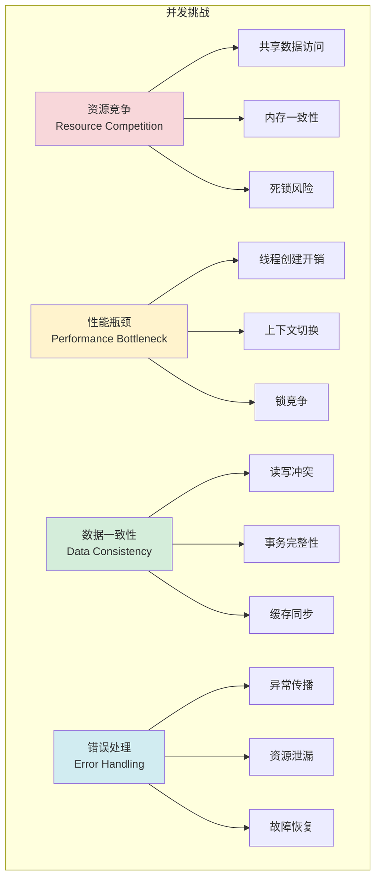
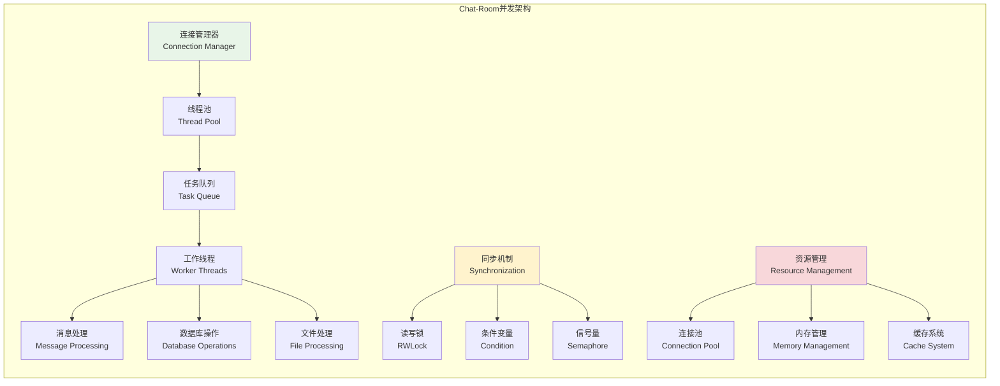

# 并发处理机制

## 🎯 学习目标

通过本章学习，您将能够：
- 理解多人聊天中的并发处理挑战和解决方案
- 掌握线程安全和资源共享的核心技术
- 学会设计高并发的聊天服务器架构
- 在Chat-Room项目中实现稳定的并发处理系统

## ⚡ 并发处理架构

### 并发挑战分析



### 并发处理策略



## 🔒 线程安全实现

### 线程安全的数据结构

```python
# server/concurrent/thread_safe_structures.py - 线程安全数据结构
import threading
import time
from typing import Dict, List, Set, Any, Optional, Callable
from collections import defaultdict, deque
import weakref

class ThreadSafeDict:
    """
    线程安全字典

    提供线程安全的字典操作，支持读写锁优化
    """

    def __init__(self):
        self._data: Dict[Any, Any] = {}
        self._lock = threading.RWLock()  # 读写锁

    def get(self, key: Any, default: Any = None) -> Any:
        """线程安全的获取操作"""
        with self._lock.read_lock():
            return self._data.get(key, default)

    def set(self, key: Any, value: Any):
        """线程安全的设置操作"""
        with self._lock.write_lock():
            self._data[key] = value

    def delete(self, key: Any) -> bool:
        """线程安全的删除操作"""
        with self._lock.write_lock():
            if key in self._data:
                del self._data[key]
                return True
            return False

    def update(self, other: Dict[Any, Any]):
        """线程安全的批量更新"""
        with self._lock.write_lock():
            self._data.update(other)

    def keys(self) -> List[Any]:
        """获取所有键的快照"""
        with self._lock.read_lock():
            return list(self._data.keys())

    def values(self) -> List[Any]:
        """获取所有值的快照"""
        with self._lock.read_lock():
            return list(self._data.values())

    def items(self) -> List[tuple]:
        """获取所有项的快照"""
        with self._lock.read_lock():
            return list(self._data.items())

    def __len__(self) -> int:
        """获取字典长度"""
        with self._lock.read_lock():
            return len(self._data)

    def __contains__(self, key: Any) -> bool:
        """检查键是否存在"""
        with self._lock.read_lock():
            return key in self._data

class ThreadSafeSet:
    """
    线程安全集合

    提供线程安全的集合操作
    """

    def __init__(self, initial_data: Set[Any] = None):
        self._data: Set[Any] = set(initial_data) if initial_data else set()
        self._lock = threading.RLock()

    def add(self, item: Any):
        """添加元素"""
        with self._lock:
            self._data.add(item)

    def remove(self, item: Any) -> bool:
        """移除元素"""
        with self._lock:
            if item in self._data:
                self._data.remove(item)
                return True
            return False

    def discard(self, item: Any):
        """安全移除元素（不存在时不报错）"""
        with self._lock:
            self._data.discard(item)

    def update(self, other: Set[Any]):
        """批量添加元素"""
        with self._lock:
            self._data.update(other)

    def copy(self) -> Set[Any]:
        """获取集合的副本"""
        with self._lock:
            return self._data.copy()

    def __len__(self) -> int:
        """获取集合大小"""
        with self._lock:
            return len(self._data)

    def __contains__(self, item: Any) -> bool:
        """检查元素是否存在"""
        with self._lock:
            return item in self._data

class ThreadSafeCounter:
    """
    线程安全计数器

    提供原子性的计数操作
    """

    def __init__(self, initial_value: int = 0):
        self._value = initial_value
        self._lock = threading.Lock()

    def increment(self, delta: int = 1) -> int:
        """原子性递增"""
        with self._lock:
            self._value += delta
            return self._value

    def decrement(self, delta: int = 1) -> int:
        """原子性递减"""
        with self._lock:
            self._value -= delta
            return self._value

    def get(self) -> int:
        """获取当前值"""
        with self._lock:
            return self._value

    def set(self, value: int) -> int:
        """设置值"""
        with self._lock:
            old_value = self._value
            self._value = value
            return old_value

    def compare_and_swap(self, expected: int, new_value: int) -> bool:
        """比较并交换（CAS操作）"""
        with self._lock:
            if self._value == expected:
                self._value = new_value
                return True
            return False

class EventBus:
    """
    线程安全事件总线

    用于组件间的解耦通信
    """

    def __init__(self):
        self._subscribers: Dict[str, List[Callable]] = defaultdict(list)
        self._lock = threading.RLock()

    def subscribe(self, event_type: str, callback: Callable):
        """订阅事件"""
        with self._lock:
            self._subscribers[event_type].append(callback)

    def unsubscribe(self, event_type: str, callback: Callable):
        """取消订阅"""
        with self._lock:
            if event_type in self._subscribers:
                try:
                    self._subscribers[event_type].remove(callback)
                except ValueError:
                    pass

    def publish(self, event_type: str, *args, **kwargs):
        """发布事件"""
        # 获取订阅者列表的副本，避免在回调过程中修改
        with self._lock:
            callbacks = self._subscribers[event_type].copy()

        # 异步调用回调函数
        for callback in callbacks:
            try:
                # 在新线程中执行回调，避免阻塞
                threading.Thread(
                    target=callback,
                    args=args,
                    kwargs=kwargs,
                    daemon=True
                ).start()
            except Exception as e:
                print(f"事件回调执行失败: {e}")

# 读写锁实现
class RWLock:
    """
    读写锁实现

    允许多个读者同时访问，但写者独占访问
    """

    def __init__(self):
        self._read_ready = threading.Condition(threading.RLock())
        self._readers = 0

    def read_lock(self):
        """获取读锁"""
        return self._ReadLock(self)

    def write_lock(self):
        """获取写锁"""
        return self._WriteLock(self)

    def _acquire_read(self):
        """获取读锁"""
        with self._read_ready:
            self._readers += 1

    def _release_read(self):
        """释放读锁"""
        with self._read_ready:
            self._readers -= 1
            if self._readers == 0:
                self._read_ready.notifyAll()

    def _acquire_write(self):
        """获取写锁"""
        with self._read_ready:
            while self._readers > 0:
                self._read_ready.wait()

    def _release_write(self):
        """释放写锁"""
        with self._read_ready:
            self._read_ready.notifyAll()

    class _ReadLock:
        def __init__(self, rwlock):
            self._rwlock = rwlock

        def __enter__(self):
            self._rwlock._acquire_read()

        def __exit__(self, exc_type, exc_val, exc_tb):
            self._rwlock._release_read()

    class _WriteLock:
        def __init__(self, rwlock):
            self._rwlock = rwlock

        def __enter__(self):
            self._rwlock._acquire_write()

        def __exit__(self, exc_type, exc_val, exc_tb):
            self._rwlock._release_write()

## 🏭 线程池管理

### 智能线程池实现

```python
# server/concurrent/thread_pool.py - 线程池管理
import threading
import queue
import time
from typing import Callable, Any, Optional, List
from dataclasses import dataclass
from enum import Enum
import weakref

class TaskPriority(Enum):
    """任务优先级"""
    LOW = 3
    NORMAL = 2
    HIGH = 1
    URGENT = 0

@dataclass
class Task:
    """任务对象"""
    func: Callable
    args: tuple
    kwargs: dict
    priority: TaskPriority = TaskPriority.NORMAL
    callback: Optional[Callable] = None
    error_callback: Optional[Callable] = None
    timeout: Optional[float] = None
    created_at: float = None

    def __post_init__(self):
        if self.created_at is None:
            self.created_at = time.time()

    def __lt__(self, other):
        """用于优先级队列排序"""
        return self.priority.value < other.priority.value

class ThreadPoolExecutor:
    """
    智能线程池执行器

    特性：
    1. 动态线程数调整
    2. 任务优先级支持
    3. 超时处理
    4. 性能监控
    5. 优雅关闭
    """

    def __init__(self, min_threads: int = 2, max_threads: int = 20,
                 keep_alive_time: float = 60.0, queue_size: int = 1000):
        self.min_threads = min_threads
        self.max_threads = max_threads
        self.keep_alive_time = keep_alive_time

        # 任务队列
        self.task_queue = queue.PriorityQueue(maxsize=queue_size)

        # 线程管理
        self.threads: List[threading.Thread] = []
        self.active_threads = ThreadSafeCounter()
        self.idle_threads = ThreadSafeCounter()

        # 控制标志
        self.shutdown = False
        self.shutdown_lock = threading.Lock()

        # 统计信息
        self.stats = {
            'tasks_submitted': ThreadSafeCounter(),
            'tasks_completed': ThreadSafeCounter(),
            'tasks_failed': ThreadSafeCounter(),
            'total_execution_time': 0.0,
            'peak_threads': ThreadSafeCounter()
        }

        # 监控线程
        self.monitor_thread = None

        # 初始化核心线程
        self._create_core_threads()
        self._start_monitor()

    def submit(self, func: Callable, *args, priority: TaskPriority = TaskPriority.NORMAL,
               callback: Callable = None, error_callback: Callable = None,
               timeout: float = None, **kwargs) -> bool:
        """
        提交任务到线程池

        Args:
            func: 要执行的函数
            *args: 函数参数
            priority: 任务优先级
            callback: 成功回调
            error_callback: 错误回调
            timeout: 超时时间
            **kwargs: 函数关键字参数

        Returns:
            是否成功提交
        """
        if self.shutdown:
            return False

        task = Task(
            func=func,
            args=args,
            kwargs=kwargs,
            priority=priority,
            callback=callback,
            error_callback=error_callback,
            timeout=timeout
        )

        try:
            # 使用优先级作为排序键
            self.task_queue.put((priority.value, task), timeout=1.0)
            self.stats['tasks_submitted'].increment()

            # 检查是否需要创建新线程
            self._maybe_create_thread()

            return True

        except queue.Full:
            print("任务队列已满，无法提交任务")
            return False

    def _create_core_threads(self):
        """创建核心线程"""
        for i in range(self.min_threads):
            self._create_worker_thread(is_core=True)

    def _create_worker_thread(self, is_core: bool = False) -> threading.Thread:
        """创建工作线程"""
        thread = threading.Thread(
            target=self._worker_loop,
            args=(is_core,),
            name=f"ThreadPool-Worker-{len(self.threads)}",
            daemon=True
        )

        self.threads.append(thread)
        self.active_threads.increment()

        # 更新峰值线程数
        current_count = len(self.threads)
        peak_count = self.stats['peak_threads'].get()
        if current_count > peak_count:
            self.stats['peak_threads'].set(current_count)

        thread.start()
        return thread

    def _worker_loop(self, is_core: bool):
        """工作线程主循环"""
        last_task_time = time.time()

        while not self.shutdown:
            try:
                # 获取任务
                timeout = None if is_core else self.keep_alive_time
                priority, task = self.task_queue.get(timeout=timeout)

                if task is None:  # 关闭信号
                    break

                last_task_time = time.time()
                self.idle_threads.decrement()

                # 执行任务
                self._execute_task(task)

                self.idle_threads.increment()
                self.task_queue.task_done()

            except queue.Empty:
                # 非核心线程超时退出
                if not is_core:
                    current_time = time.time()
                    if current_time - last_task_time > self.keep_alive_time:
                        break
            except Exception as e:
                print(f"工作线程异常: {e}")

        # 线程退出清理
        self.active_threads.decrement()
        if not is_core:
            self.idle_threads.decrement()

    def _execute_task(self, task: Task):
        """执行单个任务"""
        start_time = time.time()

        try:
            # 检查任务是否超时
            if task.timeout and (start_time - task.created_at) > task.timeout:
                raise TimeoutError(f"任务超时: {task.timeout}秒")

            # 执行任务
            result = task.func(*task.args, **task.kwargs)

            # 执行成功回调
            if task.callback:
                try:
                    task.callback(result)
                except Exception as e:
                    print(f"任务回调执行失败: {e}")

            self.stats['tasks_completed'].increment()

        except Exception as e:
            # 执行错误回调
            if task.error_callback:
                try:
                    task.error_callback(e)
                except Exception as callback_error:
                    print(f"错误回调执行失败: {callback_error}")
            else:
                print(f"任务执行失败: {e}")

            self.stats['tasks_failed'].increment()

        finally:
            # 更新执行时间统计
            execution_time = time.time() - start_time
            self.stats['total_execution_time'] += execution_time

    def _maybe_create_thread(self):
        """根据负载情况决定是否创建新线程"""
        if self.shutdown:
            return

        current_threads = len(self.threads)
        idle_count = self.idle_threads.get()
        queue_size = self.task_queue.qsize()

        # 如果队列有积压且空闲线程不足，创建新线程
        if (queue_size > 0 and idle_count == 0 and
            current_threads < self.max_threads):
            self._create_worker_thread(is_core=False)

    def _start_monitor(self):
        """启动监控线程"""
        self.monitor_thread = threading.Thread(
            target=self._monitor_loop,
            name="ThreadPool-Monitor",
            daemon=True
        )
        self.monitor_thread.start()

    def _monitor_loop(self):
        """监控线程主循环"""
        while not self.shutdown:
            try:
                time.sleep(30)  # 每30秒检查一次

                # 清理空闲线程
                self._cleanup_idle_threads()

                # 打印统计信息
                self._print_stats()

            except Exception as e:
                print(f"监控线程异常: {e}")

    def _cleanup_idle_threads(self):
        """清理过多的空闲线程"""
        current_threads = len(self.threads)
        if current_threads <= self.min_threads:
            return

        # 移除已结束的线程
        self.threads = [t for t in self.threads if t.is_alive()]

    def _print_stats(self):
        """打印统计信息"""
        stats = self.get_stats()
        print(f"线程池状态: 活跃线程={stats['active_threads']}, "
              f"空闲线程={stats['idle_threads']}, "
              f"队列大小={stats['queue_size']}, "
              f"完成任务={stats['completed_tasks']}")

    def get_stats(self) -> dict:
        """获取线程池统计信息"""
        return {
            'active_threads': self.active_threads.get(),
            'idle_threads': self.idle_threads.get(),
            'total_threads': len(self.threads),
            'queue_size': self.task_queue.qsize(),
            'submitted_tasks': self.stats['tasks_submitted'].get(),
            'completed_tasks': self.stats['tasks_completed'].get(),
            'failed_tasks': self.stats['tasks_failed'].get(),
            'peak_threads': self.stats['peak_threads'].get(),
            'total_execution_time': self.stats['total_execution_time']
        }

    def shutdown_gracefully(self, timeout: float = 30.0):
        """优雅关闭线程池"""
        with self.shutdown_lock:
            if self.shutdown:
                return

            self.shutdown = True

        print("开始关闭线程池...")

        # 等待队列中的任务完成
        try:
            self.task_queue.join()
        except:
            pass

        # 发送关闭信号给所有线程
        for _ in self.threads:
            try:
                self.task_queue.put((0, None), timeout=1.0)
            except queue.Full:
                break

        # 等待线程结束
        start_time = time.time()
        for thread in self.threads:
            remaining_time = timeout - (time.time() - start_time)
            if remaining_time > 0:
                thread.join(timeout=remaining_time)

        print("线程池已关闭")

# 使用示例
def demo_thread_pool():
    """线程池演示"""
    def sample_task(task_id: int, duration: float):
        """示例任务"""
        print(f"任务 {task_id} 开始执行")
        time.sleep(duration)
        print(f"任务 {task_id} 执行完成")
        return f"任务 {task_id} 结果"

    def task_callback(result):
        """任务完成回调"""
        print(f"任务完成回调: {result}")

    def error_callback(error):
        """任务错误回调"""
        print(f"任务错误回调: {error}")

    # 创建线程池
    pool = ThreadPoolExecutor(min_threads=2, max_threads=5)

    print("=== 线程池演示 ===")

    # 提交不同优先级的任务
    for i in range(10):
        priority = TaskPriority.HIGH if i < 3 else TaskPriority.NORMAL
        pool.submit(
            sample_task,
            i,
            0.5,
            priority=priority,
            callback=task_callback,
            error_callback=error_callback
        )

    # 等待一段时间
    time.sleep(3)

    # 查看统计信息
    stats = pool.get_stats()
    print(f"线程池统计: {stats}")

    # 关闭线程池
    pool.shutdown_gracefully()

# 为threading模块添加读写锁
threading.RWLock = RWLock
```