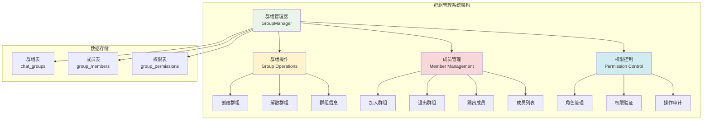
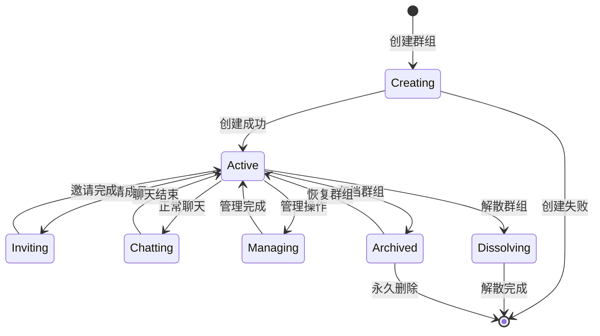
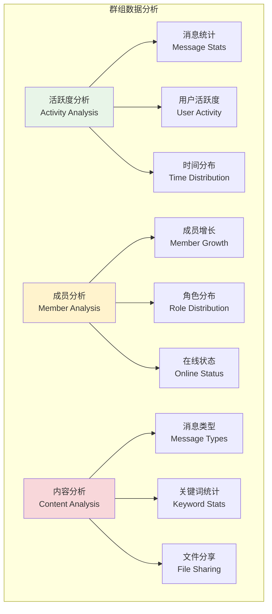

# 群组管理系统

## 🎯 学习目标

通过本章学习，您将能够：
- 理解多人聊天中的群组管理概念和架构
- 掌握群组创建、加入、退出的完整流程
- 学会设计群组权限和成员管理系统
- 在Chat-Room项目中实现完整的群组功能

## 🏗️ 群组管理架构

### 群组系统概览



### 群组生命周期



## 👥 群组核心功能实现

### 群组管理器

```python
# server/chat/group_manager.py - 群组管理器
import threading
import time
from typing import Dict, List, Optional, Set, Tuple
from dataclasses import dataclass
from enum import Enum
import sqlite3

class GroupRole(Enum):
    """群组角色枚举"""
    OWNER = "owner"      # 群主
    ADMIN = "admin"      # 管理员
    MEMBER = "member"    # 普通成员
    GUEST = "guest"      # 访客（只读）

class GroupPermission(Enum):
    """群组权限枚举"""
    SEND_MESSAGE = "send_message"        # 发送消息
    INVITE_MEMBER = "invite_member"      # 邀请成员
    REMOVE_MEMBER = "remove_member"     # 移除成员
    MODIFY_GROUP = "modify_group"       # 修改群组信息
    MANAGE_ADMIN = "manage_admin"       # 管理管理员
    DISSOLVE_GROUP = "dissolve_group"   # 解散群组

@dataclass
class GroupInfo:
    """群组信息"""
    group_id: int
    group_name: str
    description: str
    owner_id: int
    max_members: int
    is_public: bool
    created_at: str
    member_count: int = 0
    online_count: int = 0

@dataclass
class GroupMember:
    """群组成员信息"""
    user_id: int
    username: str
    nickname: str
    role: GroupRole
    joined_at: str
    is_online: bool = False
    last_activity: Optional[str] = None

class GroupManager:
    """
    群组管理器
    
    负责管理所有群组相关的操作：
    1. 群组的创建、解散、信息管理
    2. 成员的加入、退出、权限管理
    3. 群组消息的路由和广播
    4. 群组状态的维护和同步
    """
    
    def __init__(self, db_connection, user_manager):
        self.db = db_connection
        self.user_manager = user_manager
        
        # 内存中的群组缓存
        self.groups: Dict[int, GroupInfo] = {}
        self.group_members: Dict[int, Dict[int, GroupMember]] = {}  # {group_id: {user_id: member}}
        self.user_groups: Dict[int, Set[int]] = {}  # {user_id: {group_ids}}
        
        # 线程安全锁
        self.groups_lock = threading.RLock()
        self.members_lock = threading.RLock()
        
        # 权限配置
        self.role_permissions = {
            GroupRole.OWNER: {
                GroupPermission.SEND_MESSAGE,
                GroupPermission.INVITE_MEMBER,
                GroupPermission.REMOVE_MEMBER,
                GroupPermission.MODIFY_GROUP,
                GroupPermission.MANAGE_ADMIN,
                GroupPermission.DISSOLVE_GROUP
            },
            GroupRole.ADMIN: {
                GroupPermission.SEND_MESSAGE,
                GroupPermission.INVITE_MEMBER,
                GroupPermission.REMOVE_MEMBER,
                GroupPermission.MODIFY_GROUP
            },
            GroupRole.MEMBER: {
                GroupPermission.SEND_MESSAGE,
                GroupPermission.INVITE_MEMBER
            },
            GroupRole.GUEST: set()  # 只读权限
        }
        
        # 初始化时加载群组数据
        self._load_groups_from_database()
    
    def create_group(self, owner_id: int, group_name: str, 
                    description: str = "", max_members: int = 100, 
                    is_public: bool = True) -> Tuple[bool, str, Optional[int]]:
        """
        创建新群组
        
        Args:
            owner_id: 群主用户ID
            group_name: 群组名称
            description: 群组描述
            max_members: 最大成员数
            is_public: 是否公开群组
            
        Returns:
            (是否成功, 消息, 群组ID)
        """
        # 验证输入
        if not group_name or len(group_name.strip()) == 0:
            return False, "群组名称不能为空", None
        
        if len(group_name) > 50:
            return False, "群组名称不能超过50个字符", None
        
        if max_members < 2 or max_members > 1000:
            return False, "群组成员数必须在2-1000之间", None
        
        # 检查用户是否存在
        if not self.user_manager.user_exists(owner_id):
            return False, "用户不存在", None
        
        try:
            cursor = self.db.cursor()
            
            # 检查群组名是否已存在
            check_sql = "SELECT group_id FROM chat_groups WHERE group_name = ?"
            cursor.execute(check_sql, (group_name,))
            if cursor.fetchone():
                return False, "群组名称已存在", None
            
            # 插入群组记录
            insert_group_sql = """
            INSERT INTO chat_groups (group_name, description, owner_id, max_members, is_public)
            VALUES (?, ?, ?, ?, ?)
            """
            
            cursor.execute(insert_group_sql, (group_name, description, owner_id, max_members, is_public))
            group_id = cursor.lastrowid
            
            # 将群主添加为成员
            insert_member_sql = """
            INSERT INTO group_members (group_id, user_id, role)
            VALUES (?, ?, ?)
            """
            
            cursor.execute(insert_member_sql, (group_id, owner_id, GroupRole.OWNER.value))
            
            self.db.commit()
            
            # 更新内存缓存
            self._add_group_to_cache(group_id, group_name, description, owner_id, 
                                   max_members, is_public)
            self._add_member_to_cache(group_id, owner_id, GroupRole.OWNER)
            
            print(f"群组创建成功: {group_name} (ID: {group_id})")
            return True, "群组创建成功", group_id
            
        except Exception as e:
            print(f"创建群组失败: {e}")
            self.db.rollback()
            return False, "创建群组失败，请稍后重试", None
    
    def join_group(self, user_id: int, group_id: int, 
                  invited_by: int = None) -> Tuple[bool, str]:
        """
        加入群组
        
        Args:
            user_id: 用户ID
            group_id: 群组ID
            invited_by: 邀请者ID（可选）
            
        Returns:
            (是否成功, 消息)
        """
        # 检查群组是否存在
        group_info = self.get_group_info(group_id)
        if not group_info:
            return False, "群组不存在"
        
        # 检查用户是否已在群组中
        if self.is_member(user_id, group_id):
            return False, "您已经是群组成员"
        
        # 检查群组是否已满
        if group_info.member_count >= group_info.max_members:
            return False, "群组已满，无法加入"
        
        # 检查权限（如果是私有群组且没有邀请者）
        if not group_info.is_public and not invited_by:
            return False, "私有群组需要邀请才能加入"
        
        try:
            cursor = self.db.cursor()
            
            # 插入成员记录
            insert_sql = """
            INSERT INTO group_members (group_id, user_id, role)
            VALUES (?, ?, ?)
            """
            
            cursor.execute(insert_sql, (group_id, user_id, GroupRole.MEMBER.value))
            self.db.commit()
            
            # 更新内存缓存
            self._add_member_to_cache(group_id, user_id, GroupRole.MEMBER)
            
            # 获取用户信息用于通知
            user_info = self.user_manager.get_user_info(user_id)
            username = user_info.get('username', f'用户{user_id}') if user_info else f'用户{user_id}'
            
            print(f"用户 {username} 加入群组 {group_info.group_name}")
            return True, f"成功加入群组 {group_info.group_name}"
            
        except Exception as e:
            print(f"加入群组失败: {e}")
            self.db.rollback()
            return False, "加入群组失败，请稍后重试"
    
    def leave_group(self, user_id: int, group_id: int) -> Tuple[bool, str]:
        """
        退出群组
        
        Args:
            user_id: 用户ID
            group_id: 群组ID
            
        Returns:
            (是否成功, 消息)
        """
        # 检查用户是否在群组中
        if not self.is_member(user_id, group_id):
            return False, "您不是群组成员"
        
        # 检查是否为群主
        member_info = self.get_member_info(group_id, user_id)
        if member_info and member_info.role == GroupRole.OWNER:
            return False, "群主不能直接退出群组，请先转让群主或解散群组"
        
        try:
            cursor = self.db.cursor()
            
            # 删除成员记录
            delete_sql = "DELETE FROM group_members WHERE group_id = ? AND user_id = ?"
            cursor.execute(delete_sql, (group_id, user_id))
            
            self.db.commit()
            
            # 更新内存缓存
            self._remove_member_from_cache(group_id, user_id)
            
            group_info = self.get_group_info(group_id)
            group_name = group_info.group_name if group_info else f"群组{group_id}"
            
            print(f"用户 {user_id} 退出群组 {group_name}")
            return True, f"成功退出群组 {group_name}"
            
        except Exception as e:
            print(f"退出群组失败: {e}")
            self.db.rollback()
            return False, "退出群组失败，请稍后重试"
    
    def remove_member(self, operator_id: int, group_id: int, 
                     target_user_id: int) -> Tuple[bool, str]:
        """
        移除群组成员
        
        Args:
            operator_id: 操作者ID
            group_id: 群组ID
            target_user_id: 被移除的用户ID
            
        Returns:
            (是否成功, 消息)
        """
        # 检查操作权限
        if not self.has_permission(operator_id, group_id, GroupPermission.REMOVE_MEMBER):
            return False, "您没有权限移除成员"
        
        # 检查目标用户是否在群组中
        if not self.is_member(target_user_id, group_id):
            return False, "目标用户不在群组中"
        
        # 不能移除自己
        if operator_id == target_user_id:
            return False, "不能移除自己"
        
        # 检查角色权限（不能移除同级或更高级别的成员）
        operator_role = self.get_member_role(group_id, operator_id)
        target_role = self.get_member_role(group_id, target_user_id)
        
        if not self._can_operate_on_role(operator_role, target_role):
            return False, "权限不足，无法移除该成员"
        
        try:
            cursor = self.db.cursor()
            
            # 删除成员记录
            delete_sql = "DELETE FROM group_members WHERE group_id = ? AND user_id = ?"
            cursor.execute(delete_sql, (group_id, target_user_id))
            
            self.db.commit()
            
            # 更新内存缓存
            self._remove_member_from_cache(group_id, target_user_id)
            
            print(f"用户 {target_user_id} 被移除出群组 {group_id}")
            return True, "成功移除成员"
            
        except Exception as e:
            print(f"移除成员失败: {e}")
            self.db.rollback()
            return False, "移除成员失败，请稍后重试"
    
    def dissolve_group(self, operator_id: int, group_id: int) -> Tuple[bool, str]:
        """
        解散群组
        
        Args:
            operator_id: 操作者ID
            group_id: 群组ID
            
        Returns:
            (是否成功, 消息)
        """
        # 检查解散权限（只有群主可以解散）
        if not self.has_permission(operator_id, group_id, GroupPermission.DISSOLVE_GROUP):
            return False, "只有群主可以解散群组"
        
        try:
            cursor = self.db.cursor()
            
            # 删除所有成员记录
            cursor.execute("DELETE FROM group_members WHERE group_id = ?", (group_id,))
            
            # 删除群组记录
            cursor.execute("DELETE FROM chat_groups WHERE group_id = ?", (group_id,))
            
            self.db.commit()
            
            # 更新内存缓存
            self._remove_group_from_cache(group_id)
            
            print(f"群组 {group_id} 已解散")
            return True, "群组已解散"
            
        except Exception as e:
            print(f"解散群组失败: {e}")
            self.db.rollback()
            return False, "解散群组失败，请稍后重试"
    
    def get_group_info(self, group_id: int) -> Optional[GroupInfo]:
        """获取群组信息"""
        with self.groups_lock:
            return self.groups.get(group_id)
    
    def get_group_members(self, group_id: int) -> List[GroupMember]:
        """获取群组成员列表"""
        with self.members_lock:
            if group_id in self.group_members:
                return list(self.group_members[group_id].values())
            return []
    
    def get_member_info(self, group_id: int, user_id: int) -> Optional[GroupMember]:
        """获取成员信息"""
        with self.members_lock:
            if group_id in self.group_members:
                return self.group_members[group_id].get(user_id)
            return None
    
    def is_member(self, user_id: int, group_id: int) -> bool:
        """检查用户是否为群组成员"""
        with self.members_lock:
            if group_id in self.group_members:
                return user_id in self.group_members[group_id]
            return False
    
    def get_member_role(self, group_id: int, user_id: int) -> Optional[GroupRole]:
        """获取成员角色"""
        member_info = self.get_member_info(group_id, user_id)
        return member_info.role if member_info else None
    
    def has_permission(self, user_id: int, group_id: int, 
                      permission: GroupPermission) -> bool:
        """检查用户是否有特定权限"""
        role = self.get_member_role(group_id, user_id)
        if not role:
            return False
        
        return permission in self.role_permissions.get(role, set())
    
    def get_user_groups(self, user_id: int) -> List[GroupInfo]:
        """获取用户加入的所有群组"""
        with self.groups_lock:
            user_group_ids = self.user_groups.get(user_id, set())
            return [self.groups[group_id] for group_id in user_group_ids 
                   if group_id in self.groups]
    
    def update_member_online_status(self, user_id: int, is_online: bool):
        """更新成员在线状态"""
        with self.members_lock:
            user_group_ids = self.user_groups.get(user_id, set())
            
            for group_id in user_group_ids:
                if group_id in self.group_members and user_id in self.group_members[group_id]:
                    self.group_members[group_id][user_id].is_online = is_online
                    
                    # 更新群组在线人数统计
                    if group_id in self.groups:
                        online_count = sum(1 for member in self.group_members[group_id].values() 
                                         if member.is_online)
                        self.groups[group_id].online_count = online_count
    
    def _load_groups_from_database(self):
        """从数据库加载群组数据到内存"""
        try:
            cursor = self.db.cursor()
            
            # 加载群组信息
            cursor.execute("""
                SELECT group_id, group_name, description, owner_id, 
                       max_members, is_public, created_at
                FROM chat_groups
            """)
            
            for row in cursor.fetchall():
                self._add_group_to_cache(
                    row['group_id'], row['group_name'], row['description'],
                    row['owner_id'], row['max_members'], row['is_public'],
                    row['created_at']
                )
            
            # 加载成员信息
            cursor.execute("""
                SELECT gm.group_id, gm.user_id, gm.role, gm.joined_at,
                       u.username, u.nickname
                FROM group_members gm
                JOIN users u ON gm.user_id = u.user_id
            """)
            
            for row in cursor.fetchall():
                role = GroupRole(row['role'])
                self._add_member_to_cache(
                    row['group_id'], row['user_id'], role,
                    row['username'], row['nickname'], row['joined_at']
                )
            
            print(f"已加载 {len(self.groups)} 个群组和相关成员信息")
            
        except Exception as e:
            print(f"加载群组数据失败: {e}")
    
    def _add_group_to_cache(self, group_id: int, group_name: str, description: str,
                           owner_id: int, max_members: int, is_public: bool,
                           created_at: str = None):
        """添加群组到缓存"""
        with self.groups_lock:
            if created_at is None:
                created_at = time.strftime('%Y-%m-%d %H:%M:%S')
            
            self.groups[group_id] = GroupInfo(
                group_id=group_id,
                group_name=group_name,
                description=description,
                owner_id=owner_id,
                max_members=max_members,
                is_public=is_public,
                created_at=created_at
            )
    
    def _add_member_to_cache(self, group_id: int, user_id: int, role: GroupRole,
                            username: str = None, nickname: str = None,
                            joined_at: str = None):
        """添加成员到缓存"""
        with self.members_lock:
            if group_id not in self.group_members:
                self.group_members[group_id] = {}
            
            if user_id not in self.user_groups:
                self.user_groups[user_id] = set()
            
            if joined_at is None:
                joined_at = time.strftime('%Y-%m-%d %H:%M:%S')
            
            # 如果没有提供用户信息，从用户管理器获取
            if not username or not nickname:
                user_info = self.user_manager.get_user_info(user_id)
                if user_info:
                    username = username or user_info.get('username', f'用户{user_id}')
                    nickname = nickname or user_info.get('nickname', username)
                else:
                    username = username or f'用户{user_id}'
                    nickname = nickname or username
            
            self.group_members[group_id][user_id] = GroupMember(
                user_id=user_id,
                username=username,
                nickname=nickname,
                role=role,
                joined_at=joined_at
            )
            
            self.user_groups[user_id].add(group_id)
            
            # 更新群组成员数
            if group_id in self.groups:
                self.groups[group_id].member_count = len(self.group_members[group_id])
    
    def _remove_member_from_cache(self, group_id: int, user_id: int):
        """从缓存中移除成员"""
        with self.members_lock:
            if group_id in self.group_members and user_id in self.group_members[group_id]:
                del self.group_members[group_id][user_id]
                
                # 更新群组成员数
                if group_id in self.groups:
                    self.groups[group_id].member_count = len(self.group_members[group_id])
            
            if user_id in self.user_groups:
                self.user_groups[user_id].discard(group_id)
                if not self.user_groups[user_id]:
                    del self.user_groups[user_id]
    
    def _remove_group_from_cache(self, group_id: int):
        """从缓存中移除群组"""
        with self.groups_lock, self.members_lock:
            # 移除群组信息
            if group_id in self.groups:
                del self.groups[group_id]
            
            # 移除所有成员关系
            if group_id in self.group_members:
                for user_id in self.group_members[group_id]:
                    if user_id in self.user_groups:
                        self.user_groups[user_id].discard(group_id)
                        if not self.user_groups[user_id]:
                            del self.user_groups[user_id]
                
                del self.group_members[group_id]
    
    def _can_operate_on_role(self, operator_role: GroupRole, target_role: GroupRole) -> bool:
        """检查操作者是否可以对目标角色进行操作"""
        role_hierarchy = {
            GroupRole.OWNER: 4,
            GroupRole.ADMIN: 3,
            GroupRole.MEMBER: 2,
            GroupRole.GUEST: 1
        }
        
        operator_level = role_hierarchy.get(operator_role, 0)
        target_level = role_hierarchy.get(target_role, 0)
        
        return operator_level > target_level

# 使用示例
def demo_group_management():
    """群组管理演示"""
    import sqlite3
    
    # 创建内存数据库用于演示
    conn = sqlite3.connect(":memory:")
    conn.row_factory = sqlite3.Row
    
    # 创建必要的表
    conn.execute("""
        CREATE TABLE users (
            user_id INTEGER PRIMARY KEY,
            username VARCHAR(50),
            nickname VARCHAR(50)
        )
    """)
    
    conn.execute("""
        CREATE TABLE chat_groups (
            group_id INTEGER PRIMARY KEY AUTOINCREMENT,
            group_name VARCHAR(100),
            description TEXT,
            owner_id INTEGER,
            max_members INTEGER DEFAULT 100,
            is_public BOOLEAN DEFAULT 1,
            created_at TIMESTAMP DEFAULT CURRENT_TIMESTAMP
        )
    """)
    
    conn.execute("""
        CREATE TABLE group_members (
            id INTEGER PRIMARY KEY AUTOINCREMENT,
            group_id INTEGER,
            user_id INTEGER,
            role VARCHAR(20) DEFAULT 'member',
            joined_at TIMESTAMP DEFAULT CURRENT_TIMESTAMP
        )
    """)
    
    # 插入测试用户
    conn.execute("INSERT INTO users (user_id, username, nickname) VALUES (1, 'alice', 'Alice')")
    conn.execute("INSERT INTO users (user_id, username, nickname) VALUES (2, 'bob', 'Bob')")
    conn.execute("INSERT INTO users (user_id, username, nickname) VALUES (3, 'charlie', 'Charlie')")
    conn.commit()
    
    # 模拟用户管理器
    class MockUserManager:
        def __init__(self, conn):
            self.conn = conn
        
        def user_exists(self, user_id):
            cursor = self.conn.cursor()
            cursor.execute("SELECT 1 FROM users WHERE user_id = ?", (user_id,))
            return cursor.fetchone() is not None
        
        def get_user_info(self, user_id):
            cursor = self.conn.cursor()
            cursor.execute("SELECT * FROM users WHERE user_id = ?", (user_id,))
            row = cursor.fetchone()
            return dict(row) if row else None
    
    user_manager = MockUserManager(conn)
    group_manager = GroupManager(conn, user_manager)
    
    print("=== 群组管理演示 ===")
    
    # 创建群组
    success, msg, group_id = group_manager.create_group(1, "技术讨论", "技术交流群组")
    print(f"创建群组: {success}, {msg}, ID: {group_id}")
    
    # 加入群组
    success, msg = group_manager.join_group(2, group_id)
    print(f"用户2加入群组: {success}, {msg}")
    
    success, msg = group_manager.join_group(3, group_id)
    print(f"用户3加入群组: {success}, {msg}")
    
    # 查看群组信息
    group_info = group_manager.get_group_info(group_id)
    print(f"群组信息: {group_info}")
    
    # 查看成员列表
    members = group_manager.get_group_members(group_id)
    print("群组成员:")
    for member in members:
        print(f"  - {member.nickname} ({member.username}) - {member.role.value}")
    
    conn.close()

if __name__ == "__main__":
    demo_group_management()
```

## 🔧 群组高级功能

### 群组权限管理

```python
# 群组权限管理扩展
class AdvancedGroupManager(GroupManager):
    """高级群组管理器"""

    def set_member_role(self, operator_id: int, group_id: int,
                       target_user_id: int, new_role: GroupRole) -> Tuple[bool, str]:
        """设置成员角色"""
        # 检查操作权限
        if not self.has_permission(operator_id, group_id, GroupPermission.MANAGE_ADMIN):
            return False, "您没有权限管理成员角色"

        # 检查角色层级
        operator_role = self.get_member_role(group_id, operator_id)
        if not self._can_operate_on_role(operator_role, new_role):
            return False, "权限不足，无法设置该角色"

        try:
            cursor = self.db.cursor()
            cursor.execute(
                "UPDATE group_members SET role = ? WHERE group_id = ? AND user_id = ?",
                (new_role.value, group_id, target_user_id)
            )

            self.db.commit()

            # 更新内存缓存
            if group_id in self.group_members and target_user_id in self.group_members[group_id]:
                self.group_members[group_id][target_user_id].role = new_role

            return True, f"成功设置用户角色为 {new_role.value}"

        except Exception as e:
            print(f"设置成员角色失败: {e}")
            self.db.rollback()
            return False, "设置角色失败，请稍后重试"

    def transfer_ownership(self, current_owner_id: int, group_id: int,
                          new_owner_id: int) -> Tuple[bool, str]:
        """转让群主"""
        # 验证当前用户是群主
        if not self.has_permission(current_owner_id, group_id, GroupPermission.DISSOLVE_GROUP):
            return False, "只有群主可以转让群组"

        # 验证新群主是群组成员
        if not self.is_member(new_owner_id, group_id):
            return False, "新群主必须是群组成员"

        try:
            cursor = self.db.cursor()

            # 更新群组所有者
            cursor.execute(
                "UPDATE chat_groups SET owner_id = ? WHERE group_id = ?",
                (new_owner_id, group_id)
            )

            # 更新成员角色
            cursor.execute(
                "UPDATE group_members SET role = ? WHERE group_id = ? AND user_id = ?",
                (GroupRole.OWNER.value, group_id, new_owner_id)
            )

            cursor.execute(
                "UPDATE group_members SET role = ? WHERE group_id = ? AND user_id = ?",
                (GroupRole.ADMIN.value, group_id, current_owner_id)
            )

            self.db.commit()

            # 更新内存缓存
            if group_id in self.groups:
                self.groups[group_id].owner_id = new_owner_id

            if group_id in self.group_members:
                if new_owner_id in self.group_members[group_id]:
                    self.group_members[group_id][new_owner_id].role = GroupRole.OWNER
                if current_owner_id in self.group_members[group_id]:
                    self.group_members[group_id][current_owner_id].role = GroupRole.ADMIN

            return True, "群主转让成功"

        except Exception as e:
            print(f"转让群主失败: {e}")
            self.db.rollback()
            return False, "转让群主失败，请稍后重试"
```

### 群组统计和分析



## 📊 群组管理最佳实践

### 群组生命周期管理

1. **创建阶段**
   - 明确群组目的和规则
   - 设置合适的成员上限
   - 配置初始权限设置

2. **成长阶段**
   - 积极邀请相关用户
   - 建立群组文化和规范
   - 定期组织群组活动

3. **维护阶段**
   - 管理不活跃成员
   - 处理违规行为
   - 更新群组信息

4. **归档阶段**
   - 保存重要历史记录
   - 通知成员群组状态变更
   - 清理相关数据

### 权限设计原则

- **最小权限原则**：用户只获得完成任务所需的最小权限
- **权限分离**：不同功能的权限独立管理
- **审计追踪**：记录所有权限变更操作
- **定期审查**：定期检查和更新权限设置

## 📋 学习检查清单

完成本节学习后，请确认您能够：

- [ ] 理解群组管理系统的架构设计
- [ ] 实现群组的创建、加入、退出功能
- [ ] 设计群组权限和角色管理
- [ ] 处理群组成员的管理操作
- [ ] 实现群组信息的维护和更新
- [ ] 设计群组数据的缓存策略
- [ ] 处理群组操作中的异常情况
- [ ] 分析群组的使用数据和统计

## 🚀 下一步

完成群组管理学习后，请继续学习：
- [状态管理](state-management.md) - 系统状态维护
- [用户连接池](user-connection-pool.md) - 连接管理
- [第6章：数据库集成](../06-database-integration/README.md)

---

**完善的群组管理是多人聊天系统的重要组成部分，为用户提供良好的协作体验！** 👥
