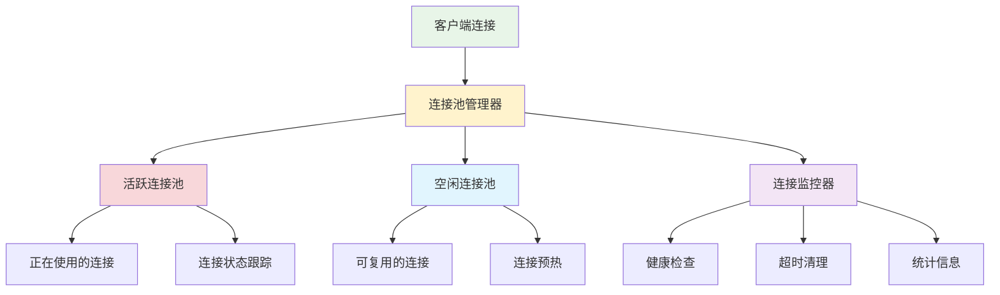

# 用户连接池管理

## 🎯 学习目标

通过本节学习，您将能够：
- 理解连接池的概念和重要性
- 掌握高效的用户连接管理方法
- 学会处理连接的生命周期
- 实现线程安全的连接操作
- 优化大量并发连接的性能

## 📖 连接池概述

连接池是管理网络连接的重要技术，它可以：

- **提高性能**：复用连接，减少创建和销毁开销
- **控制资源**：限制最大连接数，防止资源耗尽
- **简化管理**：统一管理连接的生命周期
- **增强稳定性**：处理异常连接，保证系统稳定

### 连接池架构



## 🔧 连接池实现

### 1. 基础连接类

```python
"""
用户连接管理系统
"""

import socket
import threading
import time
import uuid
from typing import Dict, List, Optional, Set, Callable
from enum import Enum
from dataclasses import dataclass, field
import queue
import weakref


class ConnectionStatus(Enum):
    """连接状态枚举"""
    CONNECTING = "connecting"
    CONNECTED = "connected"
    ACTIVE = "active"
    IDLE = "idle"
    DISCONNECTING = "disconnecting"
    DISCONNECTED = "disconnected"
    ERROR = "error"


@dataclass
class ConnectionInfo:
    """连接信息类"""
    connection_id: str
    socket: socket.socket
    address: tuple
    user_id: Optional[str] = None
    username: Optional[str] = None
    status: ConnectionStatus = ConnectionStatus.CONNECTING
    created_at: float = field(default_factory=time.time)
    last_active: float = field(default_factory=time.time)
    bytes_sent: int = 0
    bytes_received: int = 0
    message_count: int = 0
    
    def update_activity(self):
        """更新活跃时间"""
        self.last_active = time.time()
    
    def is_expired(self, timeout: float) -> bool:
        """检查连接是否超时"""
        return time.time() - self.last_active > timeout
    
    def get_connection_duration(self) -> float:
        """获取连接持续时间"""
        return time.time() - self.created_at


class ConnectionPool:
    """连接池管理器"""
    
    def __init__(self, max_connections: int = 100, 
                 connection_timeout: float = 300.0,
                 cleanup_interval: float = 60.0):
        """
        初始化连接池
        
        Args:
            max_connections: 最大连接数
            connection_timeout: 连接超时时间（秒）
            cleanup_interval: 清理间隔时间（秒）
        """
        self.max_connections = max_connections
        self.connection_timeout = connection_timeout
        self.cleanup_interval = cleanup_interval
        
        # 连接存储
        self.connections: Dict[str, ConnectionInfo] = {}
        self.user_connections: Dict[str, str] = {}  # user_id -> connection_id
        self.socket_connections: Dict[socket.socket, str] = {}  # socket -> connection_id
        
        # 线程安全
        self._lock = threading.RLock()
        
        # 事件回调
        self.on_connection_added: Optional[Callable] = None
        self.on_connection_removed: Optional[Callable] = None
        self.on_connection_error: Optional[Callable] = None
        
        # 启动清理线程
        self._cleanup_thread = threading.Thread(target=self._cleanup_loop, daemon=True)
        self._cleanup_thread.start()
        
        # 统计信息
        self.total_connections_created = 0
        self.total_connections_closed = 0
    
    def add_connection(self, sock: socket.socket, address: tuple, 
                      user_id: str = None, username: str = None) -> Optional[str]:
        """
        添加新连接
        
        Args:
            sock: Socket对象
            address: 客户端地址
            user_id: 用户ID
            username: 用户名
            
        Returns:
            连接ID，如果添加失败返回None
        """
        with self._lock:
            # 检查连接数限制
            if len(self.connections) >= self.max_connections:
                print(f"连接池已满，拒绝新连接 {address}")
                return None
            
            # 检查用户是否已连接
            if user_id and user_id in self.user_connections:
                old_conn_id = self.user_connections[user_id]
                print(f"用户 {user_id} 已存在连接，关闭旧连接 {old_conn_id}")
                self.remove_connection(old_conn_id)
            
            # 创建连接信息
            connection_id = str(uuid.uuid4())
            conn_info = ConnectionInfo(
                connection_id=connection_id,
                socket=sock,
                address=address,
                user_id=user_id,
                username=username,
                status=ConnectionStatus.CONNECTED
            )
            
            # 添加到各个映射表
            self.connections[connection_id] = conn_info
            if user_id:
                self.user_connections[user_id] = connection_id
            self.socket_connections[sock] = connection_id
            
            # 更新统计
            self.total_connections_created += 1
            
            print(f"新连接已添加: {connection_id} from {address}")
            
            # 触发回调
            if self.on_connection_added:
                try:
                    self.on_connection_added(conn_info)
                except Exception as e:
                    print(f"连接添加回调出错: {e}")
            
            return connection_id
    
    def remove_connection(self, connection_id: str) -> bool:
        """
        移除连接
        
        Args:
            connection_id: 连接ID
            
        Returns:
            是否成功移除
        """
        with self._lock:
            conn_info = self.connections.get(connection_id)
            if not conn_info:
                return False
            
            # 关闭Socket
            try:
                conn_info.socket.close()
            except Exception as e:
                print(f"关闭Socket时出错: {e}")
            
            # 从映射表中移除
            del self.connections[connection_id]
            
            if conn_info.user_id and conn_info.user_id in self.user_connections:
                del self.user_connections[conn_info.user_id]
            
            if conn_info.socket in self.socket_connections:
                del self.socket_connections[conn_info.socket]
            
            # 更新统计
            self.total_connections_closed += 1
            
            print(f"连接已移除: {connection_id}")
            
            # 触发回调
            if self.on_connection_removed:
                try:
                    self.on_connection_removed(conn_info)
                except Exception as e:
                    print(f"连接移除回调出错: {e}")
            
            return True
    
    def get_connection(self, connection_id: str) -> Optional[ConnectionInfo]:
        """获取连接信息"""
        with self._lock:
            return self.connections.get(connection_id)
    
    def get_connection_by_user(self, user_id: str) -> Optional[ConnectionInfo]:
        """根据用户ID获取连接"""
        with self._lock:
            connection_id = self.user_connections.get(user_id)
            return self.connections.get(connection_id) if connection_id else None
    
    def get_connection_by_socket(self, sock: socket.socket) -> Optional[ConnectionInfo]:
        """根据Socket获取连接"""
        with self._lock:
            connection_id = self.socket_connections.get(sock)
            return self.connections.get(connection_id) if connection_id else None
    
    def update_connection_activity(self, connection_id: str) -> bool:
        """更新连接活跃时间"""
        with self._lock:
            conn_info = self.connections.get(connection_id)
            if conn_info:
                conn_info.update_activity()
                return True
            return False
    
    def update_connection_stats(self, connection_id: str, 
                              bytes_sent: int = 0, bytes_received: int = 0,
                              message_count: int = 0) -> bool:
        """更新连接统计信息"""
        with self._lock:
            conn_info = self.connections.get(connection_id)
            if conn_info:
                conn_info.bytes_sent += bytes_sent
                conn_info.bytes_received += bytes_received
                conn_info.message_count += message_count
                conn_info.update_activity()
                return True
            return False
    
    def get_all_connections(self) -> List[ConnectionInfo]:
        """获取所有连接"""
        with self._lock:
            return list(self.connections.values())
    
    def get_active_connections(self) -> List[ConnectionInfo]:
        """获取活跃连接"""
        with self._lock:
            return [conn for conn in self.connections.values() 
                   if conn.status in [ConnectionStatus.CONNECTED, ConnectionStatus.ACTIVE]]
    
    def get_connection_count(self) -> int:
        """获取连接总数"""
        with self._lock:
            return len(self.connections)
    
    def get_user_count(self) -> int:
        """获取用户总数"""
        with self._lock:
            return len(self.user_connections)
    
    def broadcast_to_all(self, data: bytes, exclude_connection: str = None) -> int:
        """广播数据到所有连接"""
        sent_count = 0
        connections_to_remove = []
        
        with self._lock:
            for conn_id, conn_info in self.connections.items():
                if conn_id == exclude_connection:
                    continue
                
                try:
                    conn_info.socket.send(data)
                    conn_info.bytes_sent += len(data)
                    conn_info.update_activity()
                    sent_count += 1
                except Exception as e:
                    print(f"向连接 {conn_id} 发送数据失败: {e}")
                    connections_to_remove.append(conn_id)
        
        # 移除发送失败的连接
        for conn_id in connections_to_remove:
            self.remove_connection(conn_id)
        
        return sent_count
    
    def send_to_user(self, user_id: str, data: bytes) -> bool:
        """发送数据到指定用户"""
        with self._lock:
            conn_info = self.get_connection_by_user(user_id)
            if not conn_info:
                return False
            
            try:
                conn_info.socket.send(data)
                conn_info.bytes_sent += len(data)
                conn_info.update_activity()
                return True
            except Exception as e:
                print(f"向用户 {user_id} 发送数据失败: {e}")
                self.remove_connection(conn_info.connection_id)
                return False
    
    def _cleanup_loop(self):
        """清理循环"""
        while True:
            try:
                time.sleep(self.cleanup_interval)
                self._cleanup_expired_connections()
            except Exception as e:
                print(f"清理线程出错: {e}")
    
    def _cleanup_expired_connections(self):
        """清理过期连接"""
        expired_connections = []
        
        with self._lock:
            for conn_id, conn_info in self.connections.items():
                if conn_info.is_expired(self.connection_timeout):
                    expired_connections.append(conn_id)
        
        # 移除过期连接
        for conn_id in expired_connections:
            print(f"清理过期连接: {conn_id}")
            self.remove_connection(conn_id)
    
    def get_statistics(self) -> Dict[str, any]:
        """获取统计信息"""
        with self._lock:
            active_connections = self.get_active_connections()
            
            return {
                "total_connections": len(self.connections),
                "active_connections": len(active_connections),
                "user_connections": len(self.user_connections),
                "max_connections": self.max_connections,
                "total_created": self.total_connections_created,
                "total_closed": self.total_connections_closed,
                "connection_timeout": self.connection_timeout,
                "cleanup_interval": self.cleanup_interval,
                "average_duration": sum(conn.get_connection_duration() 
                                      for conn in active_connections) / len(active_connections)
                                    if active_connections else 0,
                "total_bytes_sent": sum(conn.bytes_sent for conn in self.connections.values()),
                "total_bytes_received": sum(conn.bytes_received for conn in self.connections.values()),
                "total_messages": sum(conn.message_count for conn in self.connections.values())
            }
    
    def shutdown(self):
        """关闭连接池"""
        print("正在关闭连接池...")
        
        with self._lock:
            # 关闭所有连接
            connection_ids = list(self.connections.keys())
            for conn_id in connection_ids:
                self.remove_connection(conn_id)
        
        print("连接池已关闭")


# 连接池管理器的使用示例
class ConnectionPoolManager:
    """连接池管理器"""
    
    def __init__(self):
        self.pool = ConnectionPool(
            max_connections=100,
            connection_timeout=300.0,
            cleanup_interval=60.0
        )
        
        # 设置事件回调
        self.pool.on_connection_added = self._on_connection_added
        self.pool.on_connection_removed = self._on_connection_removed
        self.pool.on_connection_error = self._on_connection_error
    
    def _on_connection_added(self, conn_info: ConnectionInfo):
        """连接添加回调"""
        print(f"用户连接事件: {conn_info.username or '匿名'} "
              f"从 {conn_info.address} 连接")
    
    def _on_connection_removed(self, conn_info: ConnectionInfo):
        """连接移除回调"""
        print(f"用户断开事件: {conn_info.username or '匿名'} "
              f"连接时长 {conn_info.get_connection_duration():.1f}秒")
    
    def _on_connection_error(self, conn_info: ConnectionInfo, error: Exception):
        """连接错误回调"""
        print(f"连接错误: {conn_info.connection_id} - {error}")
    
    def handle_new_client(self, client_socket: socket.socket, address: tuple):
        """处理新客户端连接"""
        connection_id = self.pool.add_connection(client_socket, address)
        if connection_id:
            print(f"客户端 {address} 连接成功，连接ID: {connection_id}")
            return connection_id
        else:
            print(f"客户端 {address} 连接失败")
            client_socket.close()
            return None
    
    def authenticate_user(self, connection_id: str, user_id: str, username: str) -> bool:
        """用户认证"""
        conn_info = self.pool.get_connection(connection_id)
        if conn_info:
            conn_info.user_id = user_id
            conn_info.username = username
            conn_info.status = ConnectionStatus.ACTIVE
            
            # 更新用户映射
            with self.pool._lock:
                self.pool.user_connections[user_id] = connection_id
            
            print(f"用户 {username} 认证成功")
            return True
        return False
    
    def send_message_to_user(self, user_id: str, message: bytes) -> bool:
        """发送消息给指定用户"""
        return self.pool.send_to_user(user_id, message)
    
    def broadcast_message(self, message: bytes, exclude_user: str = None) -> int:
        """广播消息"""
        exclude_conn = None
        if exclude_user:
            conn_info = self.pool.get_connection_by_user(exclude_user)
            exclude_conn = conn_info.connection_id if conn_info else None
        
        return self.pool.broadcast_to_all(message, exclude_conn)
    
    def get_online_users(self) -> List[str]:
        """获取在线用户列表"""
        connections = self.pool.get_active_connections()
        return [conn.username for conn in connections if conn.username]
    
    def disconnect_user(self, user_id: str) -> bool:
        """断开用户连接"""
        conn_info = self.pool.get_connection_by_user(user_id)
        if conn_info:
            return self.pool.remove_connection(conn_info.connection_id)
        return False
    
    def get_pool_status(self) -> Dict[str, any]:
        """获取连接池状态"""
        return self.pool.get_statistics()


# 使用示例
def demonstrate_connection_pool():
    """演示连接池使用"""
    print("=== 连接池管理演示 ===")
    
    manager = ConnectionPoolManager()
    
    # 模拟连接
    import socket
    
    # 创建模拟Socket（实际使用中这些是真实的客户端连接）
    mock_sockets = []
    for i in range(5):
        sock = socket.socket(socket.AF_INET, socket.SOCK_STREAM)
        mock_sockets.append(sock)
        
        # 添加连接
        conn_id = manager.handle_new_client(sock, ('127.0.0.1', 8000 + i))
        if conn_id:
            # 模拟用户认证
            manager.authenticate_user(conn_id, f"user_{i}", f"用户{i}")
    
    # 显示状态
    status = manager.get_pool_status()
    print(f"连接池状态: {status}")
    
    # 显示在线用户
    online_users = manager.get_online_users()
    print(f"在线用户: {online_users}")
    
    # 模拟广播消息
    message = b"Hello, everyone!"
    sent_count = manager.broadcast_message(message)
    print(f"广播消息发送给 {sent_count} 个用户")
    
    # 清理
    for sock in mock_sockets:
        sock.close()


if __name__ == "__main__":
    demonstrate_connection_pool()
```

## 📊 性能优化

### 1. 连接复用策略

```python
"""
连接复用优化
"""

class ConnectionReusablePool(ConnectionPool):
    """可复用连接池"""
    
    def __init__(self, *args, **kwargs):
        super().__init__(*args, **kwargs)
        self.idle_connections: queue.Queue = queue.Queue()
        self.reuse_enabled = True
    
    def get_idle_connection(self) -> Optional[ConnectionInfo]:
        """获取空闲连接"""
        try:
            return self.idle_connections.get_nowait()
        except queue.Empty:
            return None
    
    def return_to_idle(self, connection_id: str):
        """将连接返回到空闲池"""
        if not self.reuse_enabled:
            return
        
        conn_info = self.get_connection(connection_id)
        if conn_info and conn_info.status == ConnectionStatus.CONNECTED:
            conn_info.status = ConnectionStatus.IDLE
            self.idle_connections.put(conn_info)
```

### 2. 内存优化

```python
"""
内存使用优化
"""

class MemoryOptimizedPool(ConnectionPool):
    """内存优化的连接池"""
    
    def __init__(self, *args, **kwargs):
        super().__init__(*args, **kwargs)
        # 使用弱引用减少内存占用
        self.weak_references = weakref.WeakValueDictionary()
    
    def add_connection(self, *args, **kwargs):
        """添加连接时使用内存优化"""
        connection_id = super().add_connection(*args, **kwargs)
        if connection_id:
            # 定期清理无用数据
            self._cleanup_memory()
        return connection_id
    
    def _cleanup_memory(self):
        """清理内存"""
        # 清理过期的统计数据
        # 压缩连接信息
        pass
```

## 📋 学习检查清单

完成本节学习后，请确认您能够：

- [ ] 理解连接池的概念和优势
- [ ] 实现线程安全的连接管理
- [ ] 处理连接的生命周期
- [ ] 实现连接的统计和监控
- [ ] 优化连接池的性能
- [ ] 处理连接异常和清理

## 🚀 下一步

完成连接池管理学习后，请继续学习：
- [用户状态跟踪](user-state-tracking.md) - 实现用户状态管理
- [并发安全处理](concurrent-safety.md) - 处理多线程安全问题

---

**高效的连接池管理是高性能聊天系统的基础！** 🔗
