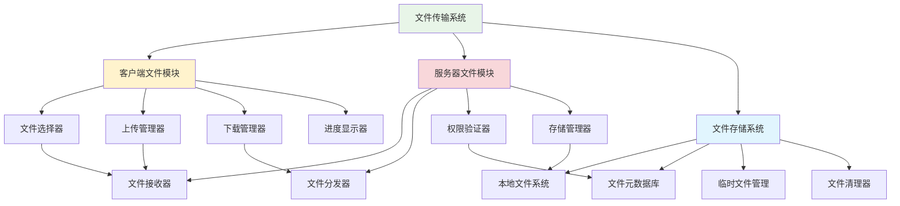
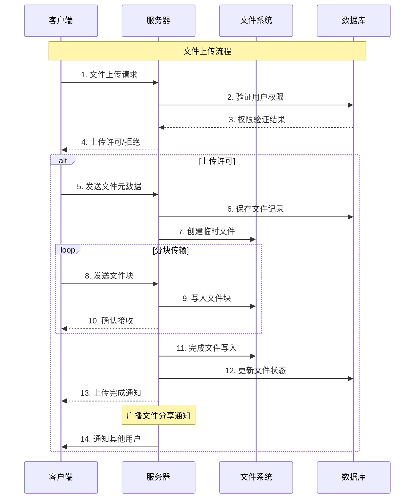

# 第7章：文件传输功能实现

## 🎯 学习目标

通过本章学习，您将能够：
- 设计和实现文件传输协议
- 掌握大文件的分块传输技术
- 实现文件上传下载的进度显示
- 学会文件安全性和权限控制
- 优化文件传输性能
- 为Chat-Room添加完整的文件分享功能

## 📚 章节内容

### 1. 文件传输基础
- [文件传输协议设计](file-protocol.md)
- [文件分块与断点续传](chunked-transfer.md)

### 2. 文件管理系统
- [文件存储与管理](file-storage.md)
- [文件安全与权限控制](file-security.md)

## 📁 文件传输系统架构



## 🔄 文件传输流程



## 📤 文件传输核心实现

### 文件传输协议

```python
"""
Chat-Room文件传输系统
实现完整的文件上传下载功能
"""

import os
import hashlib
import mimetypes
import threading
import time
import json
from typing import Dict, List, Optional, Callable, BinaryIO
from dataclasses import dataclass, asdict
from pathlib import Path
import uuid
from shared.logger import get_logger

logger = get_logger("file.transfer")

@dataclass
class FileMetadata:
    """文件元数据"""
    file_id: str
    original_name: str
    file_size: int
    file_type: str
    mime_type: str
    checksum: str
    uploader_id: int
    group_id: Optional[int] = None
    upload_time: float = None
    
    def __post_init__(self):
        if self.upload_time is None:
            self.upload_time = time.time()

@dataclass
class FileChunk:
    """文件块"""
    file_id: str
    chunk_index: int
    chunk_size: int
    total_chunks: int
    data: bytes
    checksum: str

@dataclass
class TransferProgress:
    """传输进度"""
    file_id: str
    total_size: int
    transferred_size: int
    chunk_count: int
    completed_chunks: int
    start_time: float
    
    @property
    def progress_percentage(self) -> float:
        """进度百分比"""
        if self.total_size == 0:
            return 0.0
        return (self.transferred_size / self.total_size) * 100
    
    @property
    def transfer_speed(self) -> float:
        """传输速度 (bytes/second)"""
        elapsed = time.time() - self.start_time
        if elapsed == 0:
            return 0.0
        return self.transferred_size / elapsed
    
    @property
    def estimated_time_remaining(self) -> float:
        """预计剩余时间 (seconds)"""
        speed = self.transfer_speed
        if speed == 0:
            return float('inf')
        remaining_size = self.total_size - self.transferred_size
        return remaining_size / speed

class FileTransferManager:
    """文件传输管理器"""
    
    def __init__(self, storage_path: str = "server/data/files"):
        self.storage_path = Path(storage_path)
        self.storage_path.mkdir(parents=True, exist_ok=True)
        
        # 传输状态管理
        self.active_uploads: Dict[str, TransferProgress] = {}
        self.active_downloads: Dict[str, TransferProgress] = {}
        self.transfer_lock = threading.Lock()
        
        # 配置参数
        self.chunk_size = 64 * 1024  # 64KB per chunk
        self.max_file_size = 100 * 1024 * 1024  # 100MB
        self.allowed_extensions = {
            '.txt', '.pdf', '.doc', '.docx', '.xls', '.xlsx', '.ppt', '.pptx',
            '.jpg', '.jpeg', '.png', '.gif', '.bmp', '.svg',
            '.mp3', '.wav', '.mp4', '.avi', '.mov',
            '.zip', '.rar', '.7z', '.tar', '.gz'
        }
        
        # 回调函数
        self.on_upload_progress: Optional[Callable] = None
        self.on_upload_complete: Optional[Callable] = None
        self.on_download_progress: Optional[Callable] = None
        self.on_download_complete: Optional[Callable] = None
    
    def calculate_file_checksum(self, file_path: Path) -> str:
        """计算文件校验和"""
        
        hash_md5 = hashlib.md5()
        
        try:
            with open(file_path, "rb") as f:
                for chunk in iter(lambda: f.read(4096), b""):
                    hash_md5.update(chunk)
            return hash_md5.hexdigest()
        except Exception as e:
            logger.error(f"计算文件校验和失败: {e}")
            return ""
    
    def validate_file(self, file_path: Path, max_size: int = None) -> Tuple[bool, str]:
        """验证文件"""
        
        if not file_path.exists():
            return False, "文件不存在"
        
        if not file_path.is_file():
            return False, "不是有效的文件"
        
        # 检查文件大小
        file_size = file_path.stat().st_size
        max_size = max_size or self.max_file_size
        
        if file_size > max_size:
            return False, f"文件大小超过限制 ({max_size / 1024 / 1024:.1f}MB)"
        
        if file_size == 0:
            return False, "文件为空"
        
        # 检查文件扩展名
        file_extension = file_path.suffix.lower()
        if file_extension not in self.allowed_extensions:
            return False, f"不支持的文件类型: {file_extension}"
        
        return True, "文件验证通过"
    
    def prepare_file_upload(self, file_path: Path, uploader_id: int, group_id: int = None) -> Tuple[bool, Optional[FileMetadata], str]:
        """准备文件上传"""
        
        # 验证文件
        valid, message = self.validate_file(file_path)
        if not valid:
            return False, None, message
        
        try:
            # 生成文件ID
            file_id = str(uuid.uuid4())
            
            # 获取文件信息
            file_size = file_path.stat().st_size
            mime_type, _ = mimetypes.guess_type(str(file_path))
            mime_type = mime_type or "application/octet-stream"
            
            # 计算校验和
            checksum = self.calculate_file_checksum(file_path)
            
            # 创建文件元数据
            metadata = FileMetadata(
                file_id=file_id,
                original_name=file_path.name,
                file_size=file_size,
                file_type=file_path.suffix.lower(),
                mime_type=mime_type,
                checksum=checksum,
                uploader_id=uploader_id,
                group_id=group_id
            )
            
            # 创建传输进度
            progress = TransferProgress(
                file_id=file_id,
                total_size=file_size,
                transferred_size=0,
                chunk_count=(file_size + self.chunk_size - 1) // self.chunk_size,
                completed_chunks=0,
                start_time=time.time()
            )
            
            with self.transfer_lock:
                self.active_uploads[file_id] = progress
            
            logger.info(f"准备上传文件: {file_path.name} ({file_size} bytes)")
            return True, metadata, "文件准备完成"
            
        except Exception as e:
            logger.error(f"准备文件上传失败: {e}")
            return False, None, f"准备失败: {e}"
    
    def upload_file_chunk(self, file_path: Path, file_id: str, chunk_index: int) -> Tuple[bool, Optional[FileChunk], str]:
        """上传文件块"""
        
        try:
            # 检查传输状态
            with self.transfer_lock:
                if file_id not in self.active_uploads:
                    return False, None, "传输会话不存在"
                
                progress = self.active_uploads[file_id]
            
            # 计算块的位置和大小
            start_pos = chunk_index * self.chunk_size
            end_pos = min(start_pos + self.chunk_size, progress.total_size)
            chunk_size = end_pos - start_pos
            
            if start_pos >= progress.total_size:
                return False, None, "块索引超出范围"
            
            # 读取文件块
            with open(file_path, "rb") as f:
                f.seek(start_pos)
                chunk_data = f.read(chunk_size)
            
            # 计算块校验和
            chunk_checksum = hashlib.md5(chunk_data).hexdigest()
            
            # 创建文件块对象
            file_chunk = FileChunk(
                file_id=file_id,
                chunk_index=chunk_index,
                chunk_size=chunk_size,
                total_chunks=progress.chunk_count,
                data=chunk_data,
                checksum=chunk_checksum
            )
            
            # 更新进度
            with self.transfer_lock:
                progress.transferred_size += chunk_size
                progress.completed_chunks += 1
            
            # 调用进度回调
            if self.on_upload_progress:
                self.on_upload_progress(progress)
            
            logger.debug(f"上传文件块: {file_id} chunk {chunk_index}/{progress.chunk_count}")
            return True, file_chunk, "块上传成功"
            
        except Exception as e:
            logger.error(f"上传文件块失败: {e}")
            return False, None, f"上传失败: {e}"
    
    def receive_file_chunk(self, chunk: FileChunk) -> Tuple[bool, str]:
        """接收文件块"""
        
        try:
            # 验证块校验和
            calculated_checksum = hashlib.md5(chunk.data).hexdigest()
            if calculated_checksum != chunk.checksum:
                return False, "文件块校验和不匹配"
            
            # 获取临时文件路径
            temp_file_path = self.storage_path / f"{chunk.file_id}.tmp"
            
            # 写入文件块
            with open(temp_file_path, "r+b" if temp_file_path.exists() else "wb") as f:
                f.seek(chunk.chunk_index * self.chunk_size)
                f.write(chunk.data)
            
            logger.debug(f"接收文件块: {chunk.file_id} chunk {chunk.chunk_index}/{chunk.total_chunks}")
            return True, "块接收成功"
            
        except Exception as e:
            logger.error(f"接收文件块失败: {e}")
            return False, f"接收失败: {e}"
    
    def complete_file_upload(self, file_id: str, metadata: FileMetadata) -> Tuple[bool, str, Optional[Path]]:
        """完成文件上传"""
        
        try:
            temp_file_path = self.storage_path / f"{file_id}.tmp"
            
            if not temp_file_path.exists():
                return False, "临时文件不存在", None
            
            # 验证文件完整性
            if temp_file_path.stat().st_size != metadata.file_size:
                return False, "文件大小不匹配", None
            
            calculated_checksum = self.calculate_file_checksum(temp_file_path)
            if calculated_checksum != metadata.checksum:
                return False, "文件校验和不匹配", None
            
            # 移动到最终位置
            final_file_path = self.storage_path / f"{file_id}{metadata.file_type}"
            temp_file_path.rename(final_file_path)
            
            # 清理传输状态
            with self.transfer_lock:
                if file_id in self.active_uploads:
                    progress = self.active_uploads[file_id]
                    del self.active_uploads[file_id]
                    
                    # 调用完成回调
                    if self.on_upload_complete:
                        self.on_upload_complete(metadata, progress)
            
            logger.info(f"文件上传完成: {metadata.original_name}")
            return True, "上传完成", final_file_path
            
        except Exception as e:
            logger.error(f"完成文件上传失败: {e}")
            return False, f"完成失败: {e}", None
    
    def start_file_download(self, file_id: str, metadata: FileMetadata) -> Tuple[bool, str]:
        """开始文件下载"""
        
        try:
            file_path = self.storage_path / f"{file_id}{metadata.file_type}"
            
            if not file_path.exists():
                return False, "文件不存在"
            
            # 创建下载进度
            progress = TransferProgress(
                file_id=file_id,
                total_size=metadata.file_size,
                transferred_size=0,
                chunk_count=(metadata.file_size + self.chunk_size - 1) // self.chunk_size,
                completed_chunks=0,
                start_time=time.time()
            )
            
            with self.transfer_lock:
                self.active_downloads[file_id] = progress
            
            logger.info(f"开始下载文件: {metadata.original_name}")
            return True, "下载开始"
            
        except Exception as e:
            logger.error(f"开始文件下载失败: {e}")
            return False, f"下载失败: {e}"
    
    def get_file_chunk(self, file_id: str, chunk_index: int, metadata: FileMetadata) -> Tuple[bool, Optional[FileChunk], str]:
        """获取文件块"""
        
        try:
            file_path = self.storage_path / f"{file_id}{metadata.file_type}"
            
            if not file_path.exists():
                return False, None, "文件不存在"
            
            # 检查下载状态
            with self.transfer_lock:
                if file_id not in self.active_downloads:
                    return False, None, "下载会话不存在"
                
                progress = self.active_downloads[file_id]
            
            # 计算块的位置和大小
            start_pos = chunk_index * self.chunk_size
            end_pos = min(start_pos + self.chunk_size, metadata.file_size)
            chunk_size = end_pos - start_pos
            
            if start_pos >= metadata.file_size:
                return False, None, "块索引超出范围"
            
            # 读取文件块
            with open(file_path, "rb") as f:
                f.seek(start_pos)
                chunk_data = f.read(chunk_size)
            
            # 计算块校验和
            chunk_checksum = hashlib.md5(chunk_data).hexdigest()
            
            # 创建文件块对象
            file_chunk = FileChunk(
                file_id=file_id,
                chunk_index=chunk_index,
                chunk_size=chunk_size,
                total_chunks=progress.chunk_count,
                data=chunk_data,
                checksum=chunk_checksum
            )
            
            # 更新进度
            with self.transfer_lock:
                progress.transferred_size += chunk_size
                progress.completed_chunks += 1
            
            # 调用进度回调
            if self.on_download_progress:
                self.on_download_progress(progress)
            
            logger.debug(f"发送文件块: {file_id} chunk {chunk_index}/{progress.chunk_count}")
            return True, file_chunk, "块发送成功"
            
        except Exception as e:
            logger.error(f"获取文件块失败: {e}")
            return False, None, f"获取失败: {e}"
    
    def cancel_transfer(self, file_id: str, transfer_type: str = "upload"):
        """取消传输"""
        
        with self.transfer_lock:
            if transfer_type == "upload" and file_id in self.active_uploads:
                del self.active_uploads[file_id]
                
                # 删除临时文件
                temp_file_path = self.storage_path / f"{file_id}.tmp"
                if temp_file_path.exists():
                    temp_file_path.unlink()
                
                logger.info(f"取消文件上传: {file_id}")
                
            elif transfer_type == "download" and file_id in self.active_downloads:
                del self.active_downloads[file_id]
                logger.info(f"取消文件下载: {file_id}")
    
    def get_transfer_progress(self, file_id: str, transfer_type: str = "upload") -> Optional[TransferProgress]:
        """获取传输进度"""
        
        with self.transfer_lock:
            if transfer_type == "upload":
                return self.active_uploads.get(file_id)
            else:
                return self.active_downloads.get(file_id)
    
    def cleanup_expired_transfers(self, max_age: float = 3600):
        """清理过期的传输"""
        
        current_time = time.time()
        expired_uploads = []
        expired_downloads = []
        
        with self.transfer_lock:
            # 检查过期的上传
            for file_id, progress in self.active_uploads.items():
                if current_time - progress.start_time > max_age:
                    expired_uploads.append(file_id)
            
            # 检查过期的下载
            for file_id, progress in self.active_downloads.items():
                if current_time - progress.start_time > max_age:
                    expired_downloads.append(file_id)
        
        # 清理过期传输
        for file_id in expired_uploads:
            self.cancel_transfer(file_id, "upload")
        
        for file_id in expired_downloads:
            self.cancel_transfer(file_id, "download")
        
        if expired_uploads or expired_downloads:
            logger.info(f"清理过期传输: {len(expired_uploads)} 上传, {len(expired_downloads)} 下载")

# 使用示例
def demonstrate_file_transfer():
    """演示文件传输功能"""
    
    print("=== Chat-Room文件传输演示 ===")
    
    # 创建文件传输管理器
    transfer_manager = FileTransferManager("temp/file_storage")
    
    # 设置回调函数
    def on_progress(progress: TransferProgress):
        print(f"传输进度: {progress.progress_percentage:.1f}% "
              f"({progress.transferred_size}/{progress.total_size} bytes)")
    
    def on_complete(metadata: FileMetadata, progress: TransferProgress):
        elapsed = time.time() - progress.start_time
        print(f"传输完成: {metadata.original_name} "
              f"({metadata.file_size} bytes, {elapsed:.2f}s)")
    
    transfer_manager.on_upload_progress = on_progress
    transfer_manager.on_upload_complete = on_complete
    
    # 创建测试文件
    test_file = Path("temp/test_file.txt")
    test_file.parent.mkdir(exist_ok=True)
    test_file.write_text("这是一个测试文件内容。" * 1000)
    
    try:
        # 准备上传
        success, metadata, message = transfer_manager.prepare_file_upload(
            test_file, uploader_id=1, group_id=1
        )
        
        if success and metadata:
            print(f"准备上传: {message}")
            
            # 模拟分块上传
            progress = transfer_manager.get_transfer_progress(metadata.file_id, "upload")
            if progress:
                for chunk_index in range(progress.chunk_count):
                    success, chunk, message = transfer_manager.upload_file_chunk(
                        test_file, metadata.file_id, chunk_index
                    )
                    
                    if success and chunk:
                        # 模拟服务器接收
                        success, message = transfer_manager.receive_file_chunk(chunk)
                        if not success:
                            print(f"接收块失败: {message}")
                            break
                    else:
                        print(f"上传块失败: {message}")
                        break
                
                # 完成上传
                success, message, file_path = transfer_manager.complete_file_upload(
                    metadata.file_id, metadata
                )
                
                if success:
                    print(f"上传成功: {message}")
                    print(f"文件保存到: {file_path}")
                else:
                    print(f"上传失败: {message}")
        else:
            print(f"准备失败: {message}")
    
    finally:
        # 清理测试文件
        if test_file.exists():
            test_file.unlink()

if __name__ == "__main__":
    demonstrate_file_transfer()
```

## 📋 学习检查清单

完成本章学习后，请确认您能够：

### 文件传输协议
- [ ] 设计文件传输的消息协议
- [ ] 实现文件元数据的管理
- [ ] 处理文件传输的状态管理
- [ ] 实现传输进度的跟踪

### 分块传输技术
- [ ] 实现文件的分块读写
- [ ] 处理分块传输的顺序
- [ ] 实现断点续传功能
- [ ] 验证文件完整性

### 文件安全管理
- [ ] 实现文件类型验证
- [ ] 控制文件大小限制
- [ ] 实现文件权限控制
- [ ] 处理文件安全扫描

### 性能优化
- [ ] 优化文件传输速度
- [ ] 实现并发传输控制
- [ ] 管理内存使用
- [ ] 实现传输超时处理

## 🔗 相关资源

- [HTTP文件上传标准](https://tools.ietf.org/html/rfc7578)
- [文件传输协议设计](https://en.wikipedia.org/wiki/File_Transfer_Protocol)
- [Python文件操作](https://docs.python.org/3/tutorial/inputoutput.html#reading-and-writing-files)
- [大文件处理最佳实践](https://realpython.com/working-with-large-excel-files-in-pandas/)

## 📚 下一步

文件传输功能实现完成后，请继续学习：
- [文件传输协议设计](file-protocol.md)

---

**实现强大的文件分享功能，让Chat-Room支持多媒体交流！** 📁
