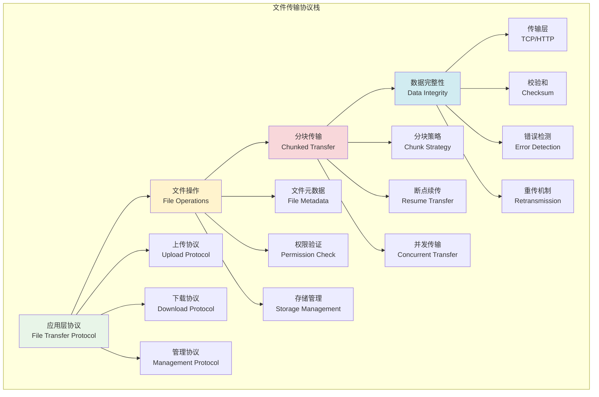
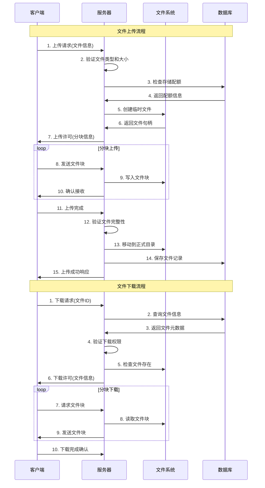

# 文件传输协议

## 🎯 学习目标

通过本章学习，您将能够：
- 理解文件传输的基本原理和协议设计
- 掌握文件上传、下载的完整流程
- 学会设计安全可靠的文件传输系统
- 在Chat-Room项目中实现完整的文件传输功能

## 📁 文件传输架构

### 文件传输协议概览



### 文件传输流程



## 📋 文件协议设计

### 协议消息定义

```python
# shared/protocol/file_protocol.py - 文件传输协议
from dataclasses import dataclass
from typing import Optional, Dict, Any, List
from enum import Enum
import hashlib
import time

class FileOperationType(Enum):
    """文件操作类型"""
    UPLOAD_REQUEST = "upload_request"
    UPLOAD_RESPONSE = "upload_response"
    UPLOAD_CHUNK = "upload_chunk"
    UPLOAD_COMPLETE = "upload_complete"
    DOWNLOAD_REQUEST = "download_request"
    DOWNLOAD_RESPONSE = "download_response"
    DOWNLOAD_CHUNK = "download_chunk"
    FILE_LIST_REQUEST = "file_list_request"
    FILE_LIST_RESPONSE = "file_list_response"
    FILE_DELETE_REQUEST = "file_delete_request"
    FILE_DELETE_RESPONSE = "file_delete_response"

class FileTransferStatus(Enum):
    """文件传输状态"""
    PENDING = "pending"
    IN_PROGRESS = "in_progress"
    COMPLETED = "completed"
    FAILED = "failed"
    CANCELLED = "cancelled"
    PAUSED = "paused"

@dataclass
class FileMetadata:
    """文件元数据"""
    file_id: str
    filename: str
    file_size: int
    file_type: str
    mime_type: str
    checksum: str
    upload_time: float
    uploader_id: int
    description: Optional[str] = None
    tags: Optional[List[str]] = None

    def to_dict(self) -> Dict[str, Any]:
        """转换为字典"""
        return {
            'file_id': self.file_id,
            'filename': self.filename,
            'file_size': self.file_size,
            'file_type': self.file_type,
            'mime_type': self.mime_type,
            'checksum': self.checksum,
            'upload_time': self.upload_time,
            'uploader_id': self.uploader_id,
            'description': self.description,
            'tags': self.tags or []
        }

    @classmethod
    def from_dict(cls, data: Dict[str, Any]) -> 'FileMetadata':
        """从字典创建"""
        return cls(
            file_id=data['file_id'],
            filename=data['filename'],
            file_size=data['file_size'],
            file_type=data['file_type'],
            mime_type=data['mime_type'],
            checksum=data['checksum'],
            upload_time=data['upload_time'],
            uploader_id=data['uploader_id'],
            description=data.get('description'),
            tags=data.get('tags', [])
        )

@dataclass
class FileChunk:
    """文件块"""
    chunk_id: int
    chunk_size: int
    chunk_data: bytes
    chunk_checksum: str
    is_last_chunk: bool = False

    def __post_init__(self):
        """计算块校验和"""
        if not self.chunk_checksum:
            self.chunk_checksum = hashlib.md5(self.chunk_data).hexdigest()

    def verify_checksum(self) -> bool:
        """验证块校验和"""
        calculated_checksum = hashlib.md5(self.chunk_data).hexdigest()
        return calculated_checksum == self.chunk_checksum

@dataclass
class UploadRequest:
    """上传请求"""
    filename: str
    file_size: int
    file_type: str
    mime_type: str
    checksum: str
    chunk_size: int = 64 * 1024  # 64KB默认块大小
    description: Optional[str] = None
    tags: Optional[List[str]] = None

    def to_dict(self) -> Dict[str, Any]:
        """转换为字典"""
        return {
            'type': FileOperationType.UPLOAD_REQUEST.value,
            'filename': self.filename,
            'file_size': self.file_size,
            'file_type': self.file_type,
            'mime_type': self.mime_type,
            'checksum': self.checksum,
            'chunk_size': self.chunk_size,
            'description': self.description,
            'tags': self.tags or []
        }

@dataclass
class UploadResponse:
    """上传响应"""
    success: bool
    file_id: Optional[str] = None
    upload_url: Optional[str] = None
    chunk_size: int = 64 * 1024
    total_chunks: int = 0
    message: str = ""
    error_code: Optional[str] = None

    def to_dict(self) -> Dict[str, Any]:
        """转换为字典"""
        return {
            'type': FileOperationType.UPLOAD_RESPONSE.value,
            'success': self.success,
            'file_id': self.file_id,
            'upload_url': self.upload_url,
            'chunk_size': self.chunk_size,
            'total_chunks': self.total_chunks,
            'message': self.message,
            'error_code': self.error_code
        }

@dataclass
class DownloadRequest:
    """下载请求"""
    file_id: str
    range_start: Optional[int] = None
    range_end: Optional[int] = None

    def to_dict(self) -> Dict[str, Any]:
        """转换为字典"""
        return {
            'type': FileOperationType.DOWNLOAD_REQUEST.value,
            'file_id': self.file_id,
            'range_start': self.range_start,
            'range_end': self.range_end
        }

@dataclass
class DownloadResponse:
    """下载响应"""
    success: bool
    file_metadata: Optional[FileMetadata] = None
    download_url: Optional[str] = None
    message: str = ""
    error_code: Optional[str] = None

    def to_dict(self) -> Dict[str, Any]:
        """转换为字典"""
        return {
            'type': FileOperationType.DOWNLOAD_RESPONSE.value,
            'success': self.success,
            'file_metadata': self.file_metadata.to_dict() if self.file_metadata else None,
            'download_url': self.download_url,
            'message': self.message,
            'error_code': self.error_code
        }

class FileProtocolHandler:
    """
    文件协议处理器

    负责处理文件传输相关的协议消息
    """

    def __init__(self):
        self.supported_types = {
            # 图片类型
            'image/jpeg', 'image/png', 'image/gif', 'image/webp',
            # 文档类型
            'application/pdf', 'text/plain', 'application/msword',
            'application/vnd.openxmlformats-officedocument.wordprocessingml.document',
            # 压缩文件
            'application/zip', 'application/x-rar-compressed',
            # 音频视频
            'audio/mpeg', 'video/mp4', 'video/avi'
        }

        self.max_file_size = 100 * 1024 * 1024  # 100MB
        self.max_chunk_size = 1024 * 1024  # 1MB
        self.min_chunk_size = 1024  # 1KB

    def validate_upload_request(self, request: UploadRequest) -> tuple[bool, str]:
        """
        验证上传请求

        Returns:
            (是否有效, 错误信息)
        """
        # 检查文件名
        if not request.filename or len(request.filename.strip()) == 0:
            return False, "文件名不能为空"

        if len(request.filename) > 255:
            return False, "文件名过长"

        # 检查文件大小
        if request.file_size <= 0:
            return False, "文件大小无效"

        if request.file_size > self.max_file_size:
            return False, f"文件大小超过限制({self.max_file_size // (1024*1024)}MB)"

        # 检查文件类型
        if request.mime_type not in self.supported_types:
            return False, f"不支持的文件类型: {request.mime_type}"

        # 检查块大小
        if not (self.min_chunk_size <= request.chunk_size <= self.max_chunk_size):
            return False, f"块大小必须在{self.min_chunk_size}-{self.max_chunk_size}字节之间"

        # 检查校验和
        if not request.checksum or len(request.checksum) != 32:
            return False, "文件校验和格式错误"

        return True, "验证通过"

    def calculate_chunks(self, file_size: int, chunk_size: int) -> int:
        """计算文件块数量"""
        return (file_size + chunk_size - 1) // chunk_size

    def generate_file_id(self, filename: str, file_size: int, checksum: str) -> str:
        """生成文件ID"""
        import uuid
        content = f"{filename}_{file_size}_{checksum}_{time.time()}"
        return hashlib.md5(content.encode()).hexdigest()

    def get_file_extension(self, filename: str) -> str:
        """获取文件扩展名"""
        return filename.split('.')[-1].lower() if '.' in filename else ''

    def get_mime_type_from_extension(self, extension: str) -> str:
        """根据扩展名获取MIME类型"""
        mime_map = {
            'jpg': 'image/jpeg',
            'jpeg': 'image/jpeg',
            'png': 'image/png',
            'gif': 'image/gif',
            'webp': 'image/webp',
            'pdf': 'application/pdf',
            'txt': 'text/plain',
            'doc': 'application/msword',
            'docx': 'application/vnd.openxmlformats-officedocument.wordprocessingml.document',
            'zip': 'application/zip',
            'rar': 'application/x-rar-compressed',
            'mp3': 'audio/mpeg',
            'mp4': 'video/mp4',
            'avi': 'video/avi'
        }

        return mime_map.get(extension, 'application/octet-stream')

    def create_upload_response(self, success: bool, file_id: str = None,
                             chunk_size: int = 64*1024, total_chunks: int = 0,
                             message: str = "", error_code: str = None) -> UploadResponse:
        """创建上传响应"""
        return UploadResponse(
            success=success,
            file_id=file_id,
            chunk_size=chunk_size,
            total_chunks=total_chunks,
            message=message,
            error_code=error_code
        )

    def create_download_response(self, success: bool, file_metadata: FileMetadata = None,
                               message: str = "", error_code: str = None) -> DownloadResponse:
        """创建下载响应"""
        return DownloadResponse(
            success=success,
            file_metadata=file_metadata,
            message=message,
            error_code=error_code
        )

# 使用示例
def demo_file_protocol():
    """文件协议演示"""
    handler = FileProtocolHandler()

    print("=== 文件协议演示 ===")

    # 创建上传请求
    upload_req = UploadRequest(
        filename="test_image.jpg",
        file_size=1024 * 1024,  # 1MB
        file_type="image",
        mime_type="image/jpeg",
        checksum="d41d8cd98f00b204e9800998ecf8427e",
        description="测试图片"
    )

    print(f"上传请求: {upload_req.to_dict()}")

    # 验证上传请求
    is_valid, message = handler.validate_upload_request(upload_req)
    print(f"请求验证: {is_valid}, {message}")

    if is_valid:
        # 生成文件ID
        file_id = handler.generate_file_id(
            upload_req.filename,
            upload_req.file_size,
            upload_req.checksum
        )

        # 计算块数量
        total_chunks = handler.calculate_chunks(upload_req.file_size, upload_req.chunk_size)

        # 创建上传响应
        upload_resp = handler.create_upload_response(
            success=True,
            file_id=file_id,
            chunk_size=upload_req.chunk_size,
            total_chunks=total_chunks,
            message="上传请求已接受"
        )

        print(f"上传响应: {upload_resp.to_dict()}")

    # 创建下载请求
    download_req = DownloadRequest(file_id="test_file_id")
    print(f"下载请求: {download_req.to_dict()}")

if __name__ == "__main__":
    demo_file_protocol()
```

## 📖 导航

➡️ **下一节：** [Chunked Transfer](chunked-transfer.md)

📚 **返回：** [第10章：文件传输](README.md)

🏠 **主页：** [学习路径总览](../README.md)
