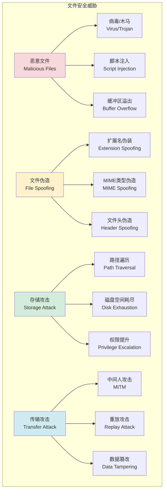

# 安全验证机制

## 🎯 学习目标

通过本章学习，您将能够：
- 理解文件传输中的安全威胁和防护措施
- 掌握文件类型验证、病毒扫描等安全技术
- 学会设计完整的文件安全验证系统
- 在Chat-Room项目中实现安全的文件传输功能

## 🔒 文件安全架构

### 安全威胁分析



### 安全验证流程


## 🛡️ 安全验证实现

### 文件安全验证器

```python
# server/file/security_validator.py - 文件安全验证器
import os
import re
import hashlib
import mimetypes
import subprocess
from typing import Dict, List, Optional, Tuple, Set
from dataclasses import dataclass
from enum import Enum
import magic  # python-magic库用于文件类型检测

class SecurityLevel(Enum):
    """安全级别"""
    LOW = "low"
    MEDIUM = "medium"
    HIGH = "high"
    STRICT = "strict"

class ValidationResult(Enum):
    """验证结果"""
    PASSED = "passed"
    FAILED = "failed"
    SUSPICIOUS = "suspicious"
    BLOCKED = "blocked"

@dataclass
class SecurityConfig:
    """安全配置"""
    max_file_size: int = 100 * 1024 * 1024  # 100MB
    allowed_extensions: Set[str] = None
    blocked_extensions: Set[str] = None
    allowed_mime_types: Set[str] = None
    blocked_mime_types: Set[str] = None
    enable_virus_scan: bool = True
    enable_content_scan: bool = True
    security_level: SecurityLevel = SecurityLevel.MEDIUM
    
    def __post_init__(self):
        if self.allowed_extensions is None:
            self.allowed_extensions = {
                'jpg', 'jpeg', 'png', 'gif', 'webp',  # 图片
                'pdf', 'txt', 'doc', 'docx',          # 文档
                'zip', 'rar', '7z',                   # 压缩文件
                'mp3', 'wav', 'mp4', 'avi'            # 媒体文件
            }
        
        if self.blocked_extensions is None:
            self.blocked_extensions = {
                'exe', 'bat', 'cmd', 'com', 'scr',    # 可执行文件
                'vbs', 'js', 'jar', 'app',            # 脚本文件
                'msi', 'deb', 'rpm'                   # 安装包
            }
        
        if self.allowed_mime_types is None:
            self.allowed_mime_types = {
                'image/jpeg', 'image/png', 'image/gif', 'image/webp',
                'application/pdf', 'text/plain',
                'application/zip', 'application/x-rar-compressed',
                'audio/mpeg', 'video/mp4'
            }
        
        if self.blocked_mime_types is None:
            self.blocked_mime_types = {
                'application/x-executable',
                'application/x-msdownload',
                'application/x-msdos-program'
            }

@dataclass
class ValidationReport:
    """验证报告"""
    filename: str
    file_size: int
    file_extension: str
    detected_mime_type: str
    validation_result: ValidationResult
    security_issues: List[str]
    recommendations: List[str]
    scan_time: float
    
    def is_safe(self) -> bool:
        """文件是否安全"""
        return self.validation_result in [ValidationResult.PASSED, ValidationResult.SUSPICIOUS]

class FileSecurityValidator:
    """
    文件安全验证器
    
    功能：
    1. 文件名和扩展名验证
    2. 文件类型和MIME类型检测
    3. 文件大小限制检查
    4. 恶意内容扫描
    5. 病毒扫描集成
    """
    
    def __init__(self, config: SecurityConfig = None):
        self.config = config or SecurityConfig()
        
        # 危险文件签名
        self.malicious_signatures = {
            b'MZ': 'PE可执行文件',
            b'\x7fELF': 'ELF可执行文件',
            b'\xca\xfe\xba\xbe': 'Java字节码',
            b'PK\x03\x04': 'ZIP文件(可能包含可执行文件)',
        }
        
        # 脚本模式检测
        self.script_patterns = [
            rb'<script[^>]*>',
            rb'javascript:',
            rb'vbscript:',
            rb'eval\s*\(',
            rb'exec\s*\(',
        ]
        
        # 初始化文件类型检测
        try:
            self.magic = magic.Magic(mime=True)
        except:
            self.magic = None
            print("警告: python-magic未安装，文件类型检测功能受限")
    
    def validate_file(self, file_path: str, original_filename: str = None) -> ValidationReport:
        """
        验证文件安全性
        
        Args:
            file_path: 文件路径
            original_filename: 原始文件名
            
        Returns:
            验证报告
        """
        import time
        start_time = time.time()
        
        filename = original_filename or os.path.basename(file_path)
        file_size = os.path.getsize(file_path)
        file_extension = self._get_file_extension(filename)
        
        security_issues = []
        recommendations = []
        validation_result = ValidationResult.PASSED
        
        # 1. 文件名验证
        name_issues = self._validate_filename(filename)
        security_issues.extend(name_issues)
        
        # 2. 扩展名验证
        ext_issues = self._validate_extension(file_extension)
        security_issues.extend(ext_issues)
        
        # 3. 文件大小验证
        size_issues = self._validate_file_size(file_size)
        security_issues.extend(size_issues)
        
        # 4. 文件类型检测
        detected_mime_type = self._detect_mime_type(file_path)
        mime_issues = self._validate_mime_type(detected_mime_type)
        security_issues.extend(mime_issues)
        
        # 5. 文件头验证
        header_issues = self._validate_file_header(file_path, file_extension)
        security_issues.extend(header_issues)
        
        # 6. 内容安全扫描
        if self.config.enable_content_scan:
            content_issues = self._scan_file_content(file_path)
            security_issues.extend(content_issues)
        
        # 7. 病毒扫描
        if self.config.enable_virus_scan:
            virus_issues = self._scan_for_viruses(file_path)
            security_issues.extend(virus_issues)
        
        # 确定验证结果
        if security_issues:
            critical_issues = [issue for issue in security_issues if '严重' in issue or '危险' in issue]
            if critical_issues:
                validation_result = ValidationResult.BLOCKED
            else:
                validation_result = ValidationResult.SUSPICIOUS
        
        # 生成建议
        if security_issues:
            recommendations.append("建议对文件进行进一步检查")
            if validation_result == ValidationResult.BLOCKED:
                recommendations.append("强烈建议拒绝此文件")
        
        scan_time = time.time() - start_time
        
        return ValidationReport(
            filename=filename,
            file_size=file_size,
            file_extension=file_extension,
            detected_mime_type=detected_mime_type,
            validation_result=validation_result,
            security_issues=security_issues,
            recommendations=recommendations,
            scan_time=scan_time
        )
    
    def _validate_filename(self, filename: str) -> List[str]:
        """验证文件名"""
        issues = []
        
        # 检查文件名长度
        if len(filename) > 255:
            issues.append("文件名过长")
        
        # 检查危险字符
        dangerous_chars = ['<', '>', ':', '"', '|', '?', '*', '\0']
        for char in dangerous_chars:
            if char in filename:
                issues.append(f"文件名包含危险字符: {char}")
        
        # 检查路径遍历
        if '..' in filename or filename.startswith('/') or filename.startswith('\\'):
            issues.append("严重: 文件名包含路径遍历字符")
        
        # 检查隐藏文件
        if filename.startswith('.'):
            issues.append("文件名以点开头(隐藏文件)")
        
        return issues
    
    def _validate_extension(self, extension: str) -> List[str]:
        """验证文件扩展名"""
        issues = []
        
        if not extension:
            issues.append("文件没有扩展名")
            return issues
        
        # 检查被禁止的扩展名
        if extension.lower() in self.config.blocked_extensions:
            issues.append(f"危险: 禁止的文件扩展名: {extension}")
        
        # 检查是否在允许列表中
        if (self.config.security_level in [SecurityLevel.HIGH, SecurityLevel.STRICT] and
            extension.lower() not in self.config.allowed_extensions):
            issues.append(f"扩展名不在允许列表中: {extension}")
        
        # 检查双扩展名
        if filename_parts := extension.split('.'):
            if len(filename_parts) > 1:
                issues.append("文件包含多个扩展名")
        
        return issues
    
    def _validate_file_size(self, file_size: int) -> List[str]:
        """验证文件大小"""
        issues = []
        
        if file_size <= 0:
            issues.append("文件大小无效")
        elif file_size > self.config.max_file_size:
            issues.append(f"文件大小超过限制: {file_size} > {self.config.max_file_size}")
        
        return issues
    
    def _detect_mime_type(self, file_path: str) -> str:
        """检测文件MIME类型"""
        try:
            if self.magic:
                return self.magic.from_file(file_path)
            else:
                # 回退到基于扩展名的检测
                mime_type, _ = mimetypes.guess_type(file_path)
                return mime_type or 'application/octet-stream'
        except Exception as e:
            print(f"MIME类型检测失败: {e}")
            return 'application/octet-stream'
    
    def _validate_mime_type(self, mime_type: str) -> List[str]:
        """验证MIME类型"""
        issues = []
        
        # 检查被禁止的MIME类型
        if mime_type in self.config.blocked_mime_types:
            issues.append(f"危险: 禁止的MIME类型: {mime_type}")
        
        # 检查是否在允许列表中
        if (self.config.security_level in [SecurityLevel.HIGH, SecurityLevel.STRICT] and
            mime_type not in self.config.allowed_mime_types):
            issues.append(f"MIME类型不在允许列表中: {mime_type}")
        
        return issues
    
    def _validate_file_header(self, file_path: str, expected_extension: str) -> List[str]:
        """验证文件头"""
        issues = []
        
        try:
            with open(file_path, 'rb') as f:
                header = f.read(16)
            
            # 检查恶意文件签名
            for signature, description in self.malicious_signatures.items():
                if header.startswith(signature):
                    issues.append(f"危险: 检测到{description}")
            
            # 检查文件头与扩展名是否匹配
            expected_headers = {
                'jpg': [b'\xff\xd8\xff'],
                'jpeg': [b'\xff\xd8\xff'],
                'png': [b'\x89PNG\r\n\x1a\n'],
                'gif': [b'GIF87a', b'GIF89a'],
                'pdf': [b'%PDF'],
                'zip': [b'PK\x03\x04', b'PK\x05\x06', b'PK\x07\x08']
            }
            
            if expected_extension.lower() in expected_headers:
                expected = expected_headers[expected_extension.lower()]
                if not any(header.startswith(exp) for exp in expected):
                    issues.append(f"文件头与扩展名不匹配: {expected_extension}")
        
        except Exception as e:
            issues.append(f"文件头验证失败: {e}")
        
        return issues
    
    def _scan_file_content(self, file_path: str) -> List[str]:
        """扫描文件内容"""
        issues = []
        
        try:
            with open(file_path, 'rb') as f:
                content = f.read(1024 * 1024)  # 读取前1MB
            
            # 检查脚本模式
            for pattern in self.script_patterns:
                if re.search(pattern, content, re.IGNORECASE):
                    issues.append("检测到可疑脚本内容")
                    break
            
            # 检查可疑字符串
            suspicious_strings = [
                b'eval(',
                b'exec(',
                b'system(',
                b'shell_exec(',
                b'passthru(',
                b'<script',
                b'javascript:',
                b'vbscript:'
            ]
            
            for sus_str in suspicious_strings:
                if sus_str in content:
                    issues.append(f"检测到可疑字符串: {sus_str.decode('utf-8', errors='ignore')}")
        
        except Exception as e:
            issues.append(f"内容扫描失败: {e}")
        
        return issues
    
    def _scan_for_viruses(self, file_path: str) -> List[str]:
        """病毒扫描"""
        issues = []
        
        try:
            # 这里可以集成ClamAV或其他病毒扫描引擎
            # 示例使用ClamAV命令行工具
            result = subprocess.run(
                ['clamscan', '--no-summary', file_path],
                capture_output=True,
                text=True,
                timeout=30
            )
            
            if result.returncode != 0:
                if 'FOUND' in result.stdout:
                    issues.append("严重: 检测到病毒或恶意软件")
                else:
                    issues.append("病毒扫描出现错误")
        
        except subprocess.TimeoutExpired:
            issues.append("病毒扫描超时")
        except FileNotFoundError:
            # ClamAV未安装，跳过病毒扫描
            pass
        except Exception as e:
            issues.append(f"病毒扫描失败: {e}")
        
        return issues
    
    def _get_file_extension(self, filename: str) -> str:
        """获取文件扩展名"""
        return filename.split('.')[-1] if '.' in filename else ''

# 安全策略管理器
class SecurityPolicyManager:
    """安全策略管理器"""
    
    def __init__(self):
        self.policies = {
            SecurityLevel.LOW: SecurityConfig(
                max_file_size=200 * 1024 * 1024,  # 200MB
                enable_virus_scan=False,
                enable_content_scan=False
            ),
            SecurityLevel.MEDIUM: SecurityConfig(
                max_file_size=100 * 1024 * 1024,  # 100MB
                enable_virus_scan=True,
                enable_content_scan=True
            ),
            SecurityLevel.HIGH: SecurityConfig(
                max_file_size=50 * 1024 * 1024,   # 50MB
                enable_virus_scan=True,
                enable_content_scan=True,
                allowed_extensions={'jpg', 'jpeg', 'png', 'pdf', 'txt'}
            ),
            SecurityLevel.STRICT: SecurityConfig(
                max_file_size=10 * 1024 * 1024,   # 10MB
                enable_virus_scan=True,
                enable_content_scan=True,
                allowed_extensions={'jpg', 'jpeg', 'png', 'txt'},
                allowed_mime_types={'image/jpeg', 'image/png', 'text/plain'}
            )
        }
    
    def get_policy(self, level: SecurityLevel) -> SecurityConfig:
        """获取安全策略"""
        return self.policies.get(level, self.policies[SecurityLevel.MEDIUM])

# 使用示例
def demo_security_validation():
    """安全验证演示"""
    # 创建测试文件
    test_file = "test_upload.txt"
    with open(test_file, 'w') as f:
        f.write("这是一个测试文件内容")
    
    # 创建验证器
    config = SecurityConfig(security_level=SecurityLevel.MEDIUM)
    validator = FileSecurityValidator(config)
    
    print("=== 文件安全验证演示 ===")
    
    # 验证文件
    report = validator.validate_file(test_file, "test_upload.txt")
    
    print(f"文件名: {report.filename}")
    print(f"文件大小: {report.file_size} 字节")
    print(f"文件扩展名: {report.file_extension}")
    print(f"检测到的MIME类型: {report.detected_mime_type}")
    print(f"验证结果: {report.validation_result.value}")
    print(f"扫描时间: {report.scan_time:.3f} 秒")
    
    if report.security_issues:
        print("安全问题:")
        for issue in report.security_issues:
            print(f"  - {issue}")
    
    if report.recommendations:
        print("建议:")
        for rec in report.recommendations:
            print(f"  - {rec}")
    
    print(f"文件是否安全: {'是' if report.is_safe() else '否'}")
    
    # 清理测试文件
    os.remove(test_file)

if __name__ == "__main__":
    demo_security_validation()
```

## 🎯 实践练习

### 练习1：自定义安全规则
```python
class CustomSecurityRules:
    """
    自定义安全规则练习
    
    要求：
    1. 实现基于用户角色的安全策略
    2. 支持动态安全规则配置
    3. 添加文件内容深度扫描
    4. 实现安全事件日志记录
    """
    
    def apply_user_security_policy(self, user_role: str, file_path: str) -> bool:
        """应用用户安全策略"""
        # TODO: 实现基于角色的安全策略
        pass
```

### 练习2：威胁情报集成
```python
class ThreatIntelligence:
    """
    威胁情报集成练习
    
    要求：
    1. 集成外部威胁情报源
    2. 实现文件哈希黑名单检查
    3. 支持实时威胁更新
    4. 提供威胁分析报告
    """
    
    def check_file_reputation(self, file_hash: str) -> Dict[str, Any]:
        """检查文件声誉"""
        # TODO: 实现威胁情报查询
        pass
```

## ✅ 学习检查

完成本章学习后，请确认您能够：

- [ ] 理解文件传输中的安全威胁
- [ ] 设计完整的文件安全验证系统
- [ ] 实现文件类型和内容检测
- [ ] 集成病毒扫描功能
- [ ] 处理安全策略和权限控制
- [ ] 完成实践练习

## 📚 下一步

安全验证机制掌握后，请继续学习：
- [第7章：AI集成功能](../07-ai-integration/api-integration.md)

---

**恭喜！您已经完成了文件传输功能的学习！** 🔒
