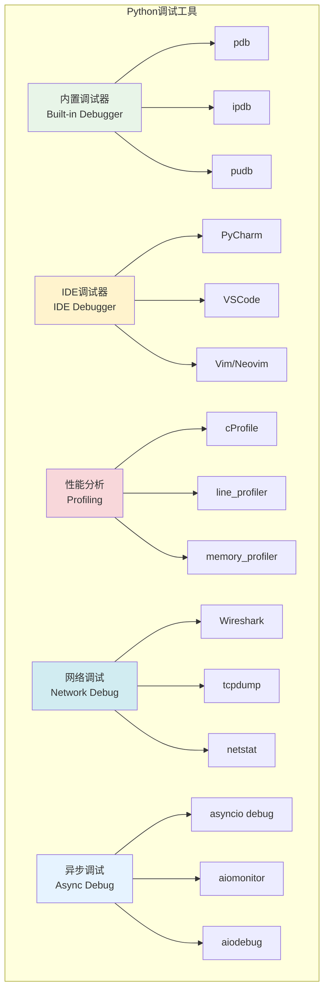
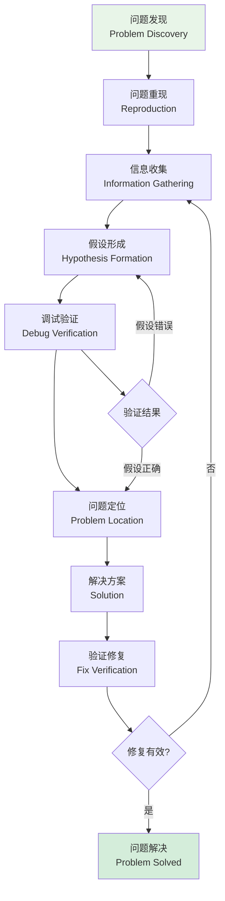

# 调试技巧与工具

## 🎯 学习目标

通过本章学习，您将能够：
- 掌握Python调试的核心技术和工具使用
- 学会网络编程和异步代码的调试方法
- 理解性能分析和内存泄漏检测技术
- 在Chat-Room项目中应用高效的调试策略

## 🔍 调试技术体系

### 调试工具生态



### 调试流程设计



## 🛠️ 调试技术实现

### Chat-Room调试工具集

```python
# server/debugging/debug_tools.py - 调试工具集
import pdb
import sys
import time
import asyncio
import traceback
import functools
import threading
import psutil
import gc
from typing import Dict, List, Optional, Any, Callable, Union
from dataclasses import dataclass, field
from datetime import datetime
from contextlib import contextmanager
import json
import socket
import inspect

@dataclass
class DebugInfo:
    """调试信息"""
    timestamp: datetime
    function_name: str
    module_name: str
    line_number: int
    variables: Dict[str, Any]
    execution_time: Optional[float] = None
    memory_usage: Optional[float] = None
    
    def to_dict(self) -> Dict[str, Any]:
        """转换为字典"""
        return {
            "timestamp": self.timestamp.isoformat(),
            "function": self.function_name,
            "module": self.module_name,
            "line": self.line_number,
            "variables": self.variables,
            "execution_time": self.execution_time,
            "memory_usage": self.memory_usage
        }

class DebugDecorator:
    """调试装饰器"""
    
    def __init__(self, enabled: bool = True, log_args: bool = True, 
                 log_result: bool = True, measure_time: bool = True,
                 measure_memory: bool = False):
        self.enabled = enabled
        self.log_args = log_args
        self.log_result = log_result
        self.measure_time = measure_time
        self.measure_memory = measure_memory
    
    def __call__(self, func: Callable) -> Callable:
        """装饰器实现"""
        if not self.enabled:
            return func
        
        @functools.wraps(func)
        async def async_wrapper(*args, **kwargs):
            return await self._debug_async_function(func, args, kwargs)
        
        @functools.wraps(func)
        def sync_wrapper(*args, **kwargs):
            return self._debug_sync_function(func, args, kwargs)
        
        if asyncio.iscoroutinefunction(func):
            return async_wrapper
        else:
            return sync_wrapper
    
    async def _debug_async_function(self, func: Callable, args: tuple, kwargs: dict) -> Any:
        """调试异步函数"""
        start_time = time.time()
        start_memory = self._get_memory_usage() if self.measure_memory else None
        
        # 记录函数调用
        debug_info = self._create_debug_info(func, args, kwargs)
        print(f"[DEBUG] 调用异步函数: {debug_info.function_name}")
        
        if self.log_args:
            print(f"[DEBUG] 参数: args={args}, kwargs={kwargs}")
        
        try:
            result = await func(*args, **kwargs)
            
            if self.log_result:
                print(f"[DEBUG] 返回结果: {result}")
            
            return result
            
        except Exception as e:
            print(f"[DEBUG] 异常发生: {type(e).__name__}: {e}")
            print(f"[DEBUG] 堆栈跟踪:\n{traceback.format_exc()}")
            raise
        
        finally:
            if self.measure_time:
                execution_time = time.time() - start_time
                print(f"[DEBUG] 执行时间: {execution_time:.4f}秒")
            
            if self.measure_memory and start_memory:
                end_memory = self._get_memory_usage()
                memory_diff = end_memory - start_memory
                print(f"[DEBUG] 内存变化: {memory_diff:.2f}MB")
    
    def _debug_sync_function(self, func: Callable, args: tuple, kwargs: dict) -> Any:
        """调试同步函数"""
        start_time = time.time()
        start_memory = self._get_memory_usage() if self.measure_memory else None
        
        # 记录函数调用
        debug_info = self._create_debug_info(func, args, kwargs)
        print(f"[DEBUG] 调用函数: {debug_info.function_name}")
        
        if self.log_args:
            print(f"[DEBUG] 参数: args={args}, kwargs={kwargs}")
        
        try:
            result = func(*args, **kwargs)
            
            if self.log_result:
                print(f"[DEBUG] 返回结果: {result}")
            
            return result
            
        except Exception as e:
            print(f"[DEBUG] 异常发生: {type(e).__name__}: {e}")
            print(f"[DEBUG] 堆栈跟踪:\n{traceback.format_exc()}")
            raise
        
        finally:
            if self.measure_time:
                execution_time = time.time() - start_time
                print(f"[DEBUG] 执行时间: {execution_time:.4f}秒")
            
            if self.measure_memory and start_memory:
                end_memory = self._get_memory_usage()
                memory_diff = end_memory - start_memory
                print(f"[DEBUG] 内存变化: {memory_diff:.2f}MB")
    
    def _create_debug_info(self, func: Callable, args: tuple, kwargs: dict) -> DebugInfo:
        """创建调试信息"""
        frame = inspect.currentframe().f_back.f_back
        
        return DebugInfo(
            timestamp=datetime.now(),
            function_name=func.__name__,
            module_name=func.__module__,
            line_number=frame.f_lineno,
            variables=dict(frame.f_locals)
        )
    
    def _get_memory_usage(self) -> float:
        """获取内存使用量（MB）"""
        process = psutil.Process()
        return process.memory_info().rss / 1024 / 1024

class AsyncDebugger:
    """异步代码调试器"""
    
    def __init__(self):
        self.task_info: Dict[str, Dict[str, Any]] = {}
        self.event_loop_info: Dict[str, Any] = {}
    
    def monitor_task(self, task: asyncio.Task, name: str = None):
        """监控异步任务"""
        task_name = name or f"task_{id(task)}"
        
        self.task_info[task_name] = {
            "task": task,
            "created_at": datetime.now(),
            "state": task.get_name() if hasattr(task, 'get_name') else "unknown",
            "done": task.done(),
            "cancelled": task.cancelled()
        }
        
        # 添加完成回调
        task.add_done_callback(lambda t: self._on_task_done(task_name, t))
    
    def _on_task_done(self, task_name: str, task: asyncio.Task):
        """任务完成回调"""
        if task_name in self.task_info:
            info = self.task_info[task_name]
            info["completed_at"] = datetime.now()
            info["done"] = True
            info["cancelled"] = task.cancelled()
            
            if task.exception():
                info["exception"] = str(task.exception())
                print(f"[ASYNC DEBUG] 任务 {task_name} 异常: {task.exception()}")
            else:
                print(f"[ASYNC DEBUG] 任务 {task_name} 完成")
    
    def get_event_loop_info(self) -> Dict[str, Any]:
        """获取事件循环信息"""
        try:
            loop = asyncio.get_running_loop()
            
            return {
                "is_running": loop.is_running(),
                "is_closed": loop.is_closed(),
                "debug_mode": loop.get_debug(),
                "task_count": len(asyncio.all_tasks(loop)),
                "time": loop.time()
            }
        except RuntimeError:
            return {"error": "没有运行中的事件循环"}
    
    def get_all_tasks_info(self) -> List[Dict[str, Any]]:
        """获取所有任务信息"""
        try:
            loop = asyncio.get_running_loop()
            tasks = asyncio.all_tasks(loop)
            
            tasks_info = []
            for task in tasks:
                task_info = {
                    "name": task.get_name() if hasattr(task, 'get_name') else f"task_{id(task)}",
                    "done": task.done(),
                    "cancelled": task.cancelled(),
                    "coro": str(task.get_coro()) if hasattr(task, 'get_coro') else "unknown"
                }
                
                if task.done() and task.exception():
                    task_info["exception"] = str(task.exception())
                
                tasks_info.append(task_info)
            
            return tasks_info
        except RuntimeError:
            return []

class NetworkDebugger:
    """网络调试器"""
    
    def __init__(self):
        self.connection_info: Dict[str, Dict[str, Any]] = {}
        self.packet_count = 0
    
    def monitor_connection(self, connection_id: str, socket_obj: socket.socket):
        """监控网络连接"""
        try:
            peer_addr = socket_obj.getpeername()
            local_addr = socket_obj.getsockname()
            
            self.connection_info[connection_id] = {
                "peer_address": peer_addr,
                "local_address": local_addr,
                "family": socket_obj.family.name,
                "type": socket_obj.type.name,
                "created_at": datetime.now(),
                "bytes_sent": 0,
                "bytes_received": 0,
                "packets_sent": 0,
                "packets_received": 0
            }
            
            print(f"[NETWORK DEBUG] 连接建立: {connection_id} -> {peer_addr}")
            
        except Exception as e:
            print(f"[NETWORK DEBUG] 监控连接失败: {e}")
    
    def log_data_sent(self, connection_id: str, data: bytes):
        """记录发送的数据"""
        if connection_id in self.connection_info:
            info = self.connection_info[connection_id]
            info["bytes_sent"] += len(data)
            info["packets_sent"] += 1
            
            print(f"[NETWORK DEBUG] 发送数据: {connection_id}, 大小: {len(data)}字节")
            print(f"[NETWORK DEBUG] 数据内容: {data[:100]}{'...' if len(data) > 100 else ''}")
    
    def log_data_received(self, connection_id: str, data: bytes):
        """记录接收的数据"""
        if connection_id in self.connection_info:
            info = self.connection_info[connection_id]
            info["bytes_received"] += len(data)
            info["packets_received"] += 1
            
            print(f"[NETWORK DEBUG] 接收数据: {connection_id}, 大小: {len(data)}字节")
            print(f"[NETWORK DEBUG] 数据内容: {data[:100]}{'...' if len(data) > 100 else ''}")
    
    def close_connection(self, connection_id: str):
        """关闭连接监控"""
        if connection_id in self.connection_info:
            info = self.connection_info[connection_id]
            info["closed_at"] = datetime.now()
            
            print(f"[NETWORK DEBUG] 连接关闭: {connection_id}")
            print(f"[NETWORK DEBUG] 统计: 发送{info['bytes_sent']}字节, 接收{info['bytes_received']}字节")

class PerformanceProfiler:
    """性能分析器"""
    
    def __init__(self):
        self.function_stats: Dict[str, Dict[str, Any]] = {}
        self.memory_snapshots: List[Dict[str, Any]] = []
    
    @contextmanager
    def profile_function(self, function_name: str):
        """性能分析上下文管理器"""
        start_time = time.time()
        start_memory = self._get_memory_info()
        
        try:
            yield
        finally:
            end_time = time.time()
            end_memory = self._get_memory_info()
            
            execution_time = end_time - start_time
            memory_diff = end_memory["rss"] - start_memory["rss"]
            
            if function_name not in self.function_stats:
                self.function_stats[function_name] = {
                    "call_count": 0,
                    "total_time": 0.0,
                    "min_time": float('inf'),
                    "max_time": 0.0,
                    "total_memory": 0,
                    "min_memory": float('inf'),
                    "max_memory": 0
                }
            
            stats = self.function_stats[function_name]
            stats["call_count"] += 1
            stats["total_time"] += execution_time
            stats["min_time"] = min(stats["min_time"], execution_time)
            stats["max_time"] = max(stats["max_time"], execution_time)
            stats["total_memory"] += memory_diff
            stats["min_memory"] = min(stats["min_memory"], memory_diff)
            stats["max_memory"] = max(stats["max_memory"], memory_diff)
    
    def take_memory_snapshot(self, label: str = None):
        """拍摄内存快照"""
        memory_info = self._get_memory_info()
        gc_stats = self._get_gc_stats()
        
        snapshot = {
            "timestamp": datetime.now().isoformat(),
            "label": label,
            "memory": memory_info,
            "gc": gc_stats
        }
        
        self.memory_snapshots.append(snapshot)
        return snapshot
    
    def _get_memory_info(self) -> Dict[str, Any]:
        """获取内存信息"""
        process = psutil.Process()
        memory_info = process.memory_info()
        
        return {
            "rss": memory_info.rss,  # 物理内存
            "vms": memory_info.vms,  # 虚拟内存
            "percent": process.memory_percent(),
            "available": psutil.virtual_memory().available
        }
    
    def _get_gc_stats(self) -> Dict[str, Any]:
        """获取垃圾回收统计"""
        return {
            "counts": gc.get_count(),
            "stats": gc.get_stats() if hasattr(gc, 'get_stats') else None,
            "objects": len(gc.get_objects())
        }
    
    def get_performance_report(self) -> Dict[str, Any]:
        """获取性能报告"""
        report = {
            "function_stats": {},
            "memory_analysis": self._analyze_memory_snapshots(),
            "summary": {
                "total_functions": len(self.function_stats),
                "total_snapshots": len(self.memory_snapshots)
            }
        }
        
        # 计算函数统计
        for func_name, stats in self.function_stats.items():
            if stats["call_count"] > 0:
                report["function_stats"][func_name] = {
                    "call_count": stats["call_count"],
                    "avg_time": stats["total_time"] / stats["call_count"],
                    "min_time": stats["min_time"],
                    "max_time": stats["max_time"],
                    "total_time": stats["total_time"],
                    "avg_memory": stats["total_memory"] / stats["call_count"],
                    "min_memory": stats["min_memory"],
                    "max_memory": stats["max_memory"]
                }
        
        return report
    
    def _analyze_memory_snapshots(self) -> Dict[str, Any]:
        """分析内存快照"""
        if len(self.memory_snapshots) < 2:
            return {"error": "需要至少2个快照进行分析"}
        
        first = self.memory_snapshots[0]
        last = self.memory_snapshots[-1]
        
        rss_diff = last["memory"]["rss"] - first["memory"]["rss"]
        vms_diff = last["memory"]["vms"] - first["memory"]["vms"]
        
        return {
            "memory_growth": {
                "rss": rss_diff,
                "vms": vms_diff,
                "rss_mb": rss_diff / 1024 / 1024,
                "vms_mb": vms_diff / 1024 / 1024
            },
            "snapshot_count": len(self.memory_snapshots),
            "time_span": last["timestamp"]
        }

class DebugManager:
    """调试管理器"""
    
    def __init__(self, enabled: bool = True):
        self.enabled = enabled
        self.async_debugger = AsyncDebugger()
        self.network_debugger = NetworkDebugger()
        self.profiler = PerformanceProfiler()
    
    def debug_function(self, **kwargs):
        """函数调试装饰器"""
        return DebugDecorator(enabled=self.enabled, **kwargs)
    
    def set_breakpoint(self, condition: Callable = None):
        """设置断点"""
        if not self.enabled:
            return
        
        if condition is None or condition():
            print("[DEBUG] 断点触发")
            pdb.set_trace()
    
    def print_debug(self, message: str, **kwargs):
        """调试打印"""
        if not self.enabled:
            return
        
        timestamp = datetime.now().strftime("%H:%M:%S.%f")[:-3]
        thread_name = threading.current_thread().name
        
        print(f"[DEBUG {timestamp}] [{thread_name}] {message}")
        
        if kwargs:
            for key, value in kwargs.items():
                print(f"  {key}: {value}")
    
    def get_debug_report(self) -> Dict[str, Any]:
        """获取调试报告"""
        return {
            "enabled": self.enabled,
            "async_info": {
                "event_loop": self.async_debugger.get_event_loop_info(),
                "tasks": self.async_debugger.get_all_tasks_info(),
                "monitored_tasks": len(self.async_debugger.task_info)
            },
            "network_info": {
                "connections": len(self.network_debugger.connection_info),
                "connection_details": self.network_debugger.connection_info
            },
            "performance": self.profiler.get_performance_report()
        }

# 使用示例
def demo_debugging_tools():
    """调试工具演示"""
    debug_manager = DebugManager(enabled=True)
    
    print("=== Chat-Room调试工具演示 ===")
    
    # 函数调试装饰器演示
    @debug_manager.debug_function(measure_time=True, measure_memory=True)
    def test_function(x: int, y: int) -> int:
        """测试函数"""
        time.sleep(0.1)  # 模拟耗时操作
        return x + y
    
    # 性能分析演示
    with debug_manager.profiler.profile_function("test_calculation"):
        result = test_function(10, 20)
        debug_manager.print_debug("计算完成", result=result)
    
    # 内存快照
    debug_manager.profiler.take_memory_snapshot("开始")
    
    # 模拟一些内存操作
    data = [i for i in range(10000)]
    
    debug_manager.profiler.take_memory_snapshot("分配内存后")
    
    del data
    
    debug_manager.profiler.take_memory_snapshot("释放内存后")
    
    # 获取调试报告
    report = debug_manager.get_debug_report()
    print(f"\n调试报告: {json.dumps(report, ensure_ascii=False, indent=2, default=str)}")

if __name__ == "__main__":
    demo_debugging_tools()
```

## 🎯 实践练习

### 练习1：智能调试助手
```python
class IntelligentDebugAssistant:
    """
    智能调试助手练习
    
    要求：
    1. 基于错误模式自动设置断点
    2. 实现代码执行路径的可视化
    3. 添加变量变化的智能跟踪
    4. 支持调试会话的录制和回放
    """
    
    def auto_set_breakpoints(self, error_patterns: List[str]) -> List[str]:
        """自动设置断点"""
        # TODO: 实现智能断点设置
        pass
    
    def visualize_execution_path(self, function_calls: List[str]) -> str:
        """可视化执行路径"""
        # TODO: 实现执行路径可视化
        pass
```

### 练习2：分布式调试系统
```python
class DistributedDebugger:
    """
    分布式调试系统练习
    
    要求：
    1. 实现跨服务的调试信息收集
    2. 支持分布式断点和步进调试
    3. 添加服务间调用链的追踪
    4. 实现调试信息的实时同步
    """
    
    def collect_debug_info(self, services: List[str]) -> Dict[str, Any]:
        """收集分布式调试信息"""
        # TODO: 实现分布式调试信息收集
        pass
    
    def trace_service_calls(self, request_id: str) -> List[Dict[str, Any]]:
        """追踪服务调用链"""
        # TODO: 实现调用链追踪
        pass
```

## ✅ 学习检查

完成本章学习后，请确认您能够：

- [ ] 掌握Python调试器的使用技巧
- [ ] 实现异步代码的调试和监控
- [ ] 进行网络编程的调试和分析
- [ ] 使用性能分析工具优化代码
- [ ] 设计调试装饰器和工具集
- [ ] 完成实践练习

## 📚 下一步

调试技巧与工具掌握后，请继续学习：
- [监控诊断](monitoring-diagnostics.md)

---

**现在您已经掌握了高效的调试技术！** 🔍
