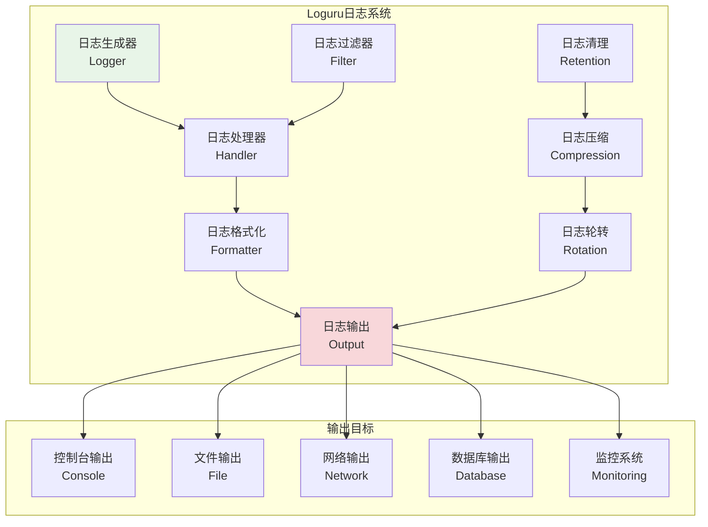
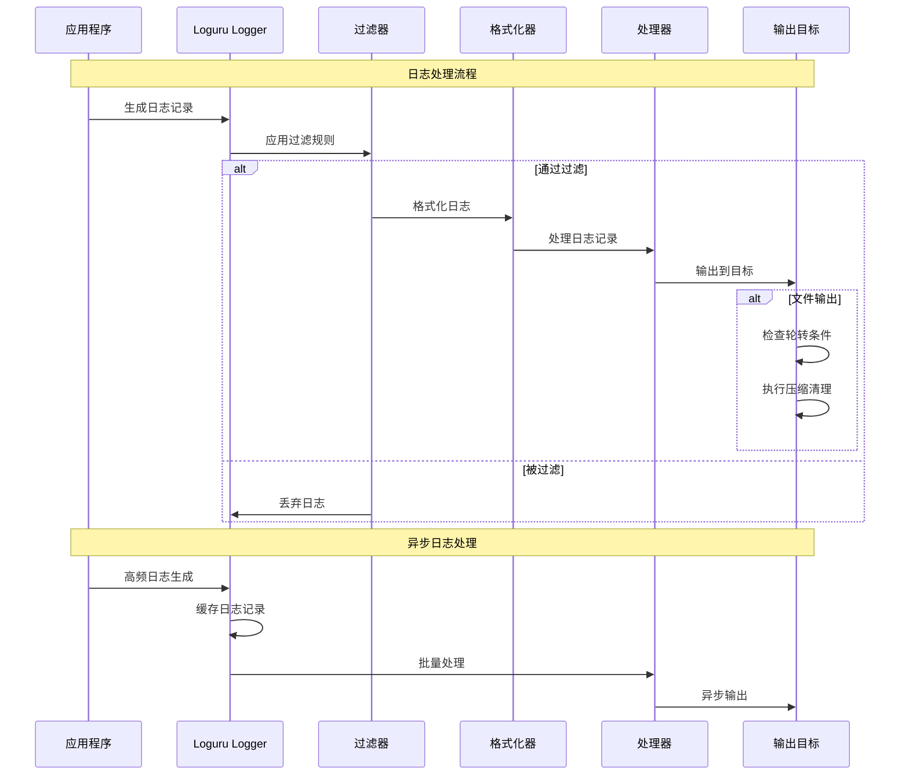

# Loguru日志系统

## 🎯 学习目标

通过本章学习，您将能够：
- 理解现代日志系统的设计原理和最佳实践
- 掌握Loguru库的高级特性和配置技巧
- 学会设计结构化日志和日志分析系统
- 在Chat-Room项目中实现完整的日志管理功能

## 📝 Loguru日志架构

### 日志系统概览



### 日志处理流程



## 🔧 Loguru系统实现

### Chat-Room日志管理系统

```python
# server/logging/loguru_manager.py - Loguru日志管理器
import sys
import os
import json
import asyncio
from typing import Dict, List, Optional, Any, Callable, Union
from dataclasses import dataclass, field
from datetime import datetime, timedelta
from pathlib import Path
from loguru import logger
import threading
import queue
import time
from enum import Enum

class LogLevel(Enum):
    """日志级别"""
    TRACE = "TRACE"
    DEBUG = "DEBUG"
    INFO = "INFO"
    SUCCESS = "SUCCESS"
    WARNING = "WARNING"
    ERROR = "ERROR"
    CRITICAL = "CRITICAL"

class LogCategory(Enum):
    """日志分类"""
    SYSTEM = "system"
    SECURITY = "security"
    PERFORMANCE = "performance"
    USER_ACTION = "user_action"
    API = "api"
    DATABASE = "database"
    NETWORK = "network"
    ERROR = "error"

@dataclass
class LogConfig:
    """日志配置"""
    # 基本配置
    level: str = "INFO"
    format: str = "{time:YYYY-MM-DD HH:mm:ss.SSS} | {level: <8} | {name}:{function}:{line} | {message}"
    
    # 文件配置
    log_dir: str = "logs"
    file_rotation: str = "100 MB"
    file_retention: str = "30 days"
    file_compression: str = "gz"
    
    # 控制台配置
    console_enabled: bool = True
    console_colorize: bool = True
    
    # 网络配置
    network_enabled: bool = False
    network_host: str = "localhost"
    network_port: int = 514
    
    # 性能配置
    async_enabled: bool = True
    buffer_size: int = 1000
    flush_interval: float = 1.0
    
    # 过滤配置
    filters: Dict[str, Any] = field(default_factory=dict)

class StructuredLogger:
    """结构化日志记录器"""
    
    def __init__(self, name: str, category: LogCategory = LogCategory.SYSTEM):
        self.name = name
        self.category = category
        self.context: Dict[str, Any] = {}
        
        # 绑定上下文信息
        self.logger = logger.bind(
            logger_name=name,
            category=category.value
        )
    
    def set_context(self, **kwargs):
        """设置上下文信息"""
        self.context.update(kwargs)
        self.logger = self.logger.bind(**self.context)
    
    def clear_context(self):
        """清除上下文信息"""
        self.context.clear()
        self.logger = logger.bind(
            logger_name=self.name,
            category=self.category.value
        )
    
    def trace(self, message: str, **kwargs):
        """记录TRACE级别日志"""
        self.logger.trace(self._format_message(message, **kwargs))
    
    def debug(self, message: str, **kwargs):
        """记录DEBUG级别日志"""
        self.logger.debug(self._format_message(message, **kwargs))
    
    def info(self, message: str, **kwargs):
        """记录INFO级别日志"""
        self.logger.info(self._format_message(message, **kwargs))
    
    def success(self, message: str, **kwargs):
        """记录SUCCESS级别日志"""
        self.logger.success(self._format_message(message, **kwargs))
    
    def warning(self, message: str, **kwargs):
        """记录WARNING级别日志"""
        self.logger.warning(self._format_message(message, **kwargs))
    
    def error(self, message: str, exception: Exception = None, **kwargs):
        """记录ERROR级别日志"""
        if exception:
            kwargs["exception_type"] = type(exception).__name__
            kwargs["exception_message"] = str(exception)
        
        self.logger.error(self._format_message(message, **kwargs))
    
    def critical(self, message: str, exception: Exception = None, **kwargs):
        """记录CRITICAL级别日志"""
        if exception:
            kwargs["exception_type"] = type(exception).__name__
            kwargs["exception_message"] = str(exception)
        
        self.logger.critical(self._format_message(message, **kwargs))
    
    def _format_message(self, message: str, **kwargs) -> str:
        """格式化消息"""
        if kwargs:
            # 将额外信息作为JSON添加到消息中
            extra_info = json.dumps(kwargs, ensure_ascii=False, default=str)
            return f"{message} | {extra_info}"
        return message

class AsyncLogHandler:
    """异步日志处理器"""
    
    def __init__(self, config: LogConfig):
        self.config = config
        self.log_queue = queue.Queue(maxsize=config.buffer_size)
        self.worker_thread = None
        self.running = False
        
        # 统计信息
        self.stats = {
            "total_logs": 0,
            "dropped_logs": 0,
            "processing_time": 0.0
        }
    
    def start(self):
        """启动异步处理"""
        if self.running:
            return
        
        self.running = True
        self.worker_thread = threading.Thread(target=self._worker_loop, daemon=True)
        self.worker_thread.start()
    
    def stop(self):
        """停止异步处理"""
        self.running = False
        if self.worker_thread:
            self.worker_thread.join(timeout=5.0)
    
    def enqueue_log(self, record: Dict[str, Any]) -> bool:
        """将日志记录加入队列"""
        try:
            self.log_queue.put_nowait(record)
            self.stats["total_logs"] += 1
            return True
        except queue.Full:
            self.stats["dropped_logs"] += 1
            return False
    
    def _worker_loop(self):
        """工作线程主循环"""
        batch = []
        last_flush = time.time()
        
        while self.running:
            try:
                # 尝试获取日志记录
                try:
                    record = self.log_queue.get(timeout=0.1)
                    batch.append(record)
                except queue.Empty:
                    pass
                
                # 检查是否需要刷新
                now = time.time()
                should_flush = (
                    len(batch) >= 100 or  # 批量大小
                    (batch and now - last_flush >= self.config.flush_interval)  # 时间间隔
                )
                
                if should_flush and batch:
                    start_time = time.time()
                    self._process_batch(batch)
                    self.stats["processing_time"] += time.time() - start_time
                    
                    batch.clear()
                    last_flush = now
                
            except Exception as e:
                print(f"异步日志处理错误: {e}")
        
        # 处理剩余的日志
        if batch:
            self._process_batch(batch)
    
    def _process_batch(self, batch: List[Dict[str, Any]]):
        """处理日志批次"""
        # 这里可以实现批量写入文件、发送到网络等
        for record in batch:
            # 模拟处理日志记录
            pass

class LoguruManager:
    """
    Loguru日志管理器
    
    功能：
    1. 统一的日志配置和管理
    2. 多种输出目标和格式
    3. 异步日志处理
    4. 日志轮转和清理
    5. 结构化日志支持
    """
    
    def __init__(self, config: LogConfig = None):
        self.config = config or LogConfig()
        self.loggers: Dict[str, StructuredLogger] = {}
        self.async_handler = None
        
        # 初始化日志系统
        self._setup_loguru()
        
        # 启动异步处理
        if self.config.async_enabled:
            self.async_handler = AsyncLogHandler(self.config)
            self.async_handler.start()
    
    def _setup_loguru(self):
        """设置Loguru配置"""
        # 移除默认处理器
        logger.remove()
        
        # 设置日志目录
        log_dir = Path(self.config.log_dir)
        log_dir.mkdir(exist_ok=True)
        
        # 控制台输出
        if self.config.console_enabled:
            logger.add(
                sys.stdout,
                level=self.config.level,
                format=self.config.format,
                colorize=self.config.console_colorize,
                filter=self._create_filter("console")
            )
        
        # 文件输出 - 按类别分文件
        for category in LogCategory:
            file_path = log_dir / f"{category.value}.log"
            logger.add(
                str(file_path),
                level=self.config.level,
                format=self.config.format,
                rotation=self.config.file_rotation,
                retention=self.config.file_retention,
                compression=self.config.file_compression,
                filter=self._create_category_filter(category),
                enqueue=True  # 启用异步写入
            )
        
        # 错误日志单独文件
        error_file = log_dir / "errors.log"
        logger.add(
            str(error_file),
            level="ERROR",
            format=self.config.format,
            rotation=self.config.file_rotation,
            retention=self.config.file_retention,
            compression=self.config.file_compression,
            filter=lambda record: record["level"].no >= logger.level("ERROR").no,
            enqueue=True
        )
        
        # JSON格式日志（用于日志分析）
        json_file = log_dir / "structured.jsonl"
        logger.add(
            str(json_file),
            level=self.config.level,
            format=self._json_formatter,
            rotation=self.config.file_rotation,
            retention=self.config.file_retention,
            compression=self.config.file_compression,
            enqueue=True
        )
    
    def _create_filter(self, handler_name: str) -> Callable:
        """创建日志过滤器"""
        def filter_func(record):
            # 应用配置中的过滤规则
            if handler_name in self.config.filters:
                filter_config = self.config.filters[handler_name]
                
                # 级别过滤
                if "min_level" in filter_config:
                    min_level = logger.level(filter_config["min_level"]).no
                    if record["level"].no < min_level:
                        return False
                
                # 模块过滤
                if "modules" in filter_config:
                    allowed_modules = filter_config["modules"]
                    if record["name"] not in allowed_modules:
                        return False
            
            return True
        
        return filter_func
    
    def _create_category_filter(self, category: LogCategory) -> Callable:
        """创建分类过滤器"""
        def filter_func(record):
            extra = record.get("extra", {})
            return extra.get("category") == category.value
        
        return filter_func
    
    def _json_formatter(self, record) -> str:
        """JSON格式化器"""
        log_entry = {
            "timestamp": record["time"].isoformat(),
            "level": record["level"].name,
            "logger": record["name"],
            "module": record["module"],
            "function": record["function"],
            "line": record["line"],
            "message": record["message"],
            "extra": record.get("extra", {})
        }
        
        # 添加异常信息
        if record["exception"]:
            log_entry["exception"] = {
                "type": record["exception"].type.__name__,
                "value": str(record["exception"].value),
                "traceback": record["exception"].traceback
            }
        
        return json.dumps(log_entry, ensure_ascii=False, default=str)
    
    def get_logger(self, name: str, category: LogCategory = LogCategory.SYSTEM) -> StructuredLogger:
        """获取结构化日志记录器"""
        logger_key = f"{name}:{category.value}"
        
        if logger_key not in self.loggers:
            self.loggers[logger_key] = StructuredLogger(name, category)
        
        return self.loggers[logger_key]
    
    def configure_logger(self, name: str, **kwargs):
        """配置特定日志记录器"""
        if name in self.loggers:
            self.loggers[name].set_context(**kwargs)
    
    def get_stats(self) -> Dict[str, Any]:
        """获取日志统计信息"""
        stats = {
            "loggers_count": len(self.loggers),
            "config": {
                "level": self.config.level,
                "async_enabled": self.config.async_enabled,
                "console_enabled": self.config.console_enabled
            }
        }
        
        if self.async_handler:
            stats["async_handler"] = self.async_handler.stats
        
        return stats
    
    def cleanup(self):
        """清理资源"""
        if self.async_handler:
            self.async_handler.stop()
        
        # 等待所有日志写入完成
        logger.complete()

# Chat-Room专用日志记录器
class ChatRoomLoggers:
    """Chat-Room专用日志记录器集合"""
    
    def __init__(self, log_manager: LoguruManager):
        self.manager = log_manager
        
        # 创建各模块的日志记录器
        self.system = log_manager.get_logger("system", LogCategory.SYSTEM)
        self.security = log_manager.get_logger("security", LogCategory.SECURITY)
        self.performance = log_manager.get_logger("performance", LogCategory.PERFORMANCE)
        self.user_action = log_manager.get_logger("user_action", LogCategory.USER_ACTION)
        self.api = log_manager.get_logger("api", LogCategory.API)
        self.database = log_manager.get_logger("database", LogCategory.DATABASE)
        self.network = log_manager.get_logger("network", LogCategory.NETWORK)
        self.error = log_manager.get_logger("error", LogCategory.ERROR)
    
    def log_user_login(self, user_id: int, username: str, ip: str, success: bool):
        """记录用户登录"""
        self.security.info(
            "用户登录",
            user_id=user_id,
            username=username,
            ip=ip,
            success=success,
            action="login"
        )
    
    def log_message_sent(self, user_id: int, group_id: int, message_length: int):
        """记录消息发送"""
        self.user_action.info(
            "消息发送",
            user_id=user_id,
            group_id=group_id,
            message_length=message_length,
            action="send_message"
        )
    
    def log_file_upload(self, user_id: int, filename: str, file_size: int, success: bool):
        """记录文件上传"""
        self.user_action.info(
            "文件上传",
            user_id=user_id,
            filename=filename,
            file_size=file_size,
            success=success,
            action="upload_file"
        )
    
    def log_api_request(self, endpoint: str, method: str, status_code: int, 
                       response_time: float, ip: str):
        """记录API请求"""
        self.api.info(
            "API请求",
            endpoint=endpoint,
            method=method,
            status_code=status_code,
            response_time=response_time,
            ip=ip
        )
    
    def log_database_query(self, query_type: str, table: str, execution_time: float):
        """记录数据库查询"""
        self.database.debug(
            "数据库查询",
            query_type=query_type,
            table=table,
            execution_time=execution_time
        )
    
    def log_performance_metric(self, metric_name: str, value: float, unit: str):
        """记录性能指标"""
        self.performance.info(
            "性能指标",
            metric_name=metric_name,
            value=value,
            unit=unit
        )
    
    def log_error(self, error_type: str, error_message: str, 
                 context: Dict[str, Any] = None, exception: Exception = None):
        """记录错误"""
        self.error.error(
            f"系统错误: {error_type}",
            error_message=error_message,
            context=context or {},
            exception=exception
        )

# 使用示例
def demo_loguru_system():
    """Loguru日志系统演示"""
    # 创建日志配置
    config = LogConfig(
        level="DEBUG",
        log_dir="demo_logs",
        console_enabled=True,
        async_enabled=True
    )
    
    # 初始化日志管理器
    log_manager = LoguruManager(config)
    
    # 创建Chat-Room日志记录器
    chat_loggers = ChatRoomLoggers(log_manager)
    
    print("=== Loguru日志系统演示 ===")
    
    # 记录各种类型的日志
    chat_loggers.log_user_login(1, "alice", "192.168.1.100", True)
    chat_loggers.log_message_sent(1, 1, 50)
    chat_loggers.log_file_upload(1, "document.pdf", 1024000, True)
    chat_loggers.log_api_request("/api/messages", "POST", 200, 0.15, "192.168.1.100")
    chat_loggers.log_database_query("SELECT", "messages", 0.05)
    chat_loggers.log_performance_metric("response_time", 0.15, "seconds")
    
    # 记录错误
    try:
        raise ValueError("这是一个测试错误")
    except Exception as e:
        chat_loggers.log_error("validation_error", "参数验证失败", 
                              {"parameter": "user_id"}, e)
    
    # 查看统计信息
    stats = log_manager.get_stats()
    print(f"日志统计: {stats}")
    
    # 清理资源
    log_manager.cleanup()
    print("日志系统演示完成")

if __name__ == "__main__":
    demo_loguru_system()
```

## 🎯 实践练习

### 练习1：日志分析系统
```python
class LogAnalyzer:
    """
    日志分析系统练习
    
    要求：
    1. 实现日志的实时分析和统计
    2. 支持日志的模式识别和异常检测
    3. 添加日志的可视化和报表功能
    4. 实现日志的智能告警机制
    """
    
    def analyze_log_patterns(self, log_file: str) -> Dict[str, Any]:
        """分析日志模式"""
        # TODO: 实现日志模式分析
        pass
    
    def detect_anomalies(self, logs: List[Dict[str, Any]]) -> List[Dict[str, Any]]:
        """检测日志异常"""
        # TODO: 实现异常检测
        pass
```

### 练习2：分布式日志收集
```python
class DistributedLogCollector:
    """
    分布式日志收集练习
    
    要求：
    1. 实现多节点的日志收集和聚合
    2. 支持日志的实时传输和缓存
    3. 添加日志的去重和压缩功能
    4. 实现日志的故障恢复机制
    """
    
    def collect_from_nodes(self, nodes: List[str]) -> bool:
        """从多个节点收集日志"""
        # TODO: 实现分布式日志收集
        pass
    
    def aggregate_logs(self, log_streams: List[Any]) -> Any:
        """聚合日志流"""
        # TODO: 实现日志聚合
        pass
```

## ✅ 学习检查

完成本章学习后，请确认您能够：

- [ ] 理解Loguru日志系统的架构和特性
- [ ] 配置多种日志输出和格式化选项
- [ ] 实现结构化日志和异步处理
- [ ] 设计日志轮转、压缩和清理策略
- [ ] 创建专用的日志记录器和分类系统
- [ ] 完成实践练习

## 📚 下一步

Loguru日志系统掌握后，请继续学习：
- [错误策略](error-strategies.md)
- [调试技巧](debugging-techniques.md)
- [监控诊断](monitoring-diagnostics.md)

---

**现在您已经掌握了现代日志系统的核心技术！** 📝
