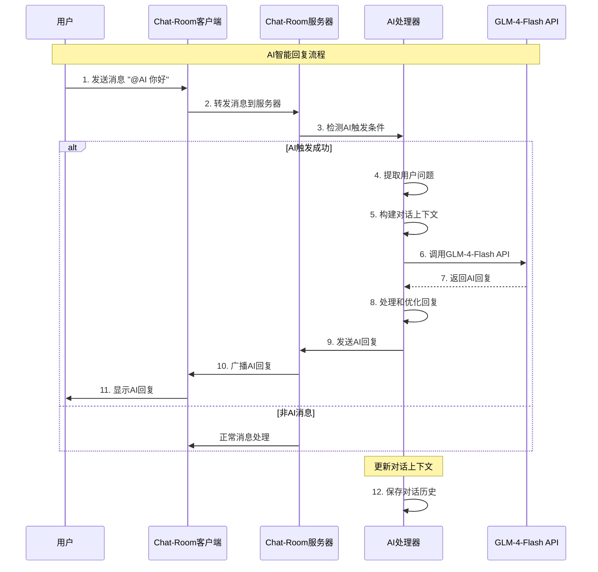

# 第8章：AI智能助手集成

## 🎯 学习目标

通过本章学习，您将能够：
- 集成GLM-4-Flash AI模型到Chat-Room
- 设计智能回复的触发机制
- 实现AI对话的上下文管理
- 优化AI响应的性能和质量
- 处理AI服务的异常和限流
- 为Chat-Room添加智能化功能

## 📚 章节内容

### 1. AI集成基础
- [GLM-4-Flash API集成](glm-api-integration.md)
- [AI对话上下文管理](context-management.md)

### 2. 智能功能实现
- [智能回复系统](smart-reply.md)
- [AI功能优化与监控](ai-optimization.md)

## 🤖 AI集成架构

```mermaid
graph TD
    A[Chat-Room AI系统] --> B[AI触发器]
    A --> C[AI处理器]
    A --> D[上下文管理器]
    A --> E[响应生成器]
    
    B --> B1[@AI 提及检测]
    B --> B2[关键词触发]
    B --> B3[智能建议]
    
    C --> C1[GLM-4-Flash API]
    C --> C2[请求管理器]
    C --> C3[错误处理器]
    C --> C4[限流控制器]
    
    D --> D1[对话历史]
    D --> D2[用户偏好]
    D --> D3[群组上下文]
    D --> D4[会话状态]
    
    E --> E1[回复格式化]
    E --> E2[内容过滤]
    E --> E3[响应优化]
    E --> E4[多媒体支持]
    
    style A fill:#e8f5e8
    style B fill:#fff3cd
    style C fill:#f8d7da
    style D fill:#e1f5fe
    style E fill:#f3e5f5
```

## 🔄 AI对话流程



## 🧠 AI集成核心实现

### GLM-4-Flash API集成

```python
"""
Chat-Room AI智能助手集成
基于GLM-4-Flash API实现智能回复功能
"""

import asyncio
import json
import time
import re
from typing import Dict, List, Optional, Tuple, Any
from dataclasses import dataclass, asdict
import aiohttp
import threading
from collections import deque
from shared.logger import get_logger

logger = get_logger("ai.integration")

@dataclass
class AIConfig:
    """AI配置"""
    api_key: str
    api_base_url: str = "https://open.bigmodel.cn/api/paas/v4/"
    model_name: str = "glm-4-flash"
    max_tokens: int = 1000
    temperature: float = 0.7
    timeout: float = 30.0
    max_retries: int = 3
    rate_limit_per_minute: int = 60

@dataclass
class ConversationMessage:
    """对话消息"""
    role: str  # "user", "assistant", "system"
    content: str
    timestamp: float = None
    
    def __post_init__(self):
        if self.timestamp is None:
            self.timestamp = time.time()

@dataclass
class AIResponse:
    """AI响应"""
    content: str
    model: str
    usage: Dict[str, int]
    finish_reason: str
    response_time: float

class ConversationContext:
    """对话上下文管理器"""
    
    def __init__(self, max_history: int = 10):
        self.max_history = max_history
        self.messages: deque = deque(maxlen=max_history)
        self.user_preferences: Dict[str, Any] = {}
        self.group_context: Dict[str, Any] = {}
    
    def add_message(self, role: str, content: str):
        """添加消息到上下文"""
        message = ConversationMessage(role=role, content=content)
        self.messages.append(message)
        logger.debug(f"添加消息到上下文: {role} - {content[:50]}...")
    
    def get_context_messages(self) -> List[Dict[str, str]]:
        """获取上下文消息列表"""
        return [{"role": msg.role, "content": msg.content} for msg in self.messages]
    
    def clear_context(self):
        """清空上下文"""
        self.messages.clear()
        logger.info("清空对话上下文")
    
    def set_system_prompt(self, prompt: str):
        """设置系统提示"""
        # 移除旧的系统消息
        self.messages = deque([msg for msg in self.messages if msg.role != "system"], 
                             maxlen=self.max_history)
        
        # 添加新的系统消息到开头
        system_msg = ConversationMessage(role="system", content=prompt)
        self.messages.appendleft(system_msg)
        
        logger.info("设置系统提示")

class RateLimiter:
    """API限流器"""
    
    def __init__(self, max_requests_per_minute: int):
        self.max_requests = max_requests_per_minute
        self.requests = deque()
        self.lock = threading.Lock()
    
    def can_make_request(self) -> bool:
        """检查是否可以发起请求"""
        current_time = time.time()
        
        with self.lock:
            # 移除一分钟前的请求记录
            while self.requests and current_time - self.requests[0] > 60:
                self.requests.popleft()
            
            # 检查是否超过限制
            if len(self.requests) >= self.max_requests:
                return False
            
            # 记录当前请求
            self.requests.append(current_time)
            return True
    
    def get_wait_time(self) -> float:
        """获取需要等待的时间"""
        if not self.requests:
            return 0.0
        
        current_time = time.time()
        oldest_request = self.requests[0]
        
        if len(self.requests) >= self.max_requests:
            return 60 - (current_time - oldest_request)
        
        return 0.0

class GLMAPIClient:
    """GLM-4-Flash API客户端"""
    
    def __init__(self, config: AIConfig):
        self.config = config
        self.rate_limiter = RateLimiter(config.rate_limit_per_minute)
        self.session: Optional[aiohttp.ClientSession] = None
    
    async def _ensure_session(self):
        """确保HTTP会话存在"""
        if self.session is None or self.session.closed:
            timeout = aiohttp.ClientTimeout(total=self.config.timeout)
            self.session = aiohttp.ClientSession(timeout=timeout)
    
    async def _make_request(self, messages: List[Dict[str, str]]) -> Dict[str, Any]:
        """发起API请求"""
        
        await self._ensure_session()
        
        headers = {
            "Authorization": f"Bearer {self.config.api_key}",
            "Content-Type": "application/json"
        }
        
        payload = {
            "model": self.config.model_name,
            "messages": messages,
            "max_tokens": self.config.max_tokens,
            "temperature": self.config.temperature,
            "stream": False
        }
        
        url = f"{self.config.api_base_url}chat/completions"
        
        async with self.session.post(url, headers=headers, json=payload) as response:
            if response.status == 200:
                return await response.json()
            else:
                error_text = await response.text()
                raise Exception(f"API请求失败: {response.status} - {error_text}")
    
    async def generate_response(self, messages: List[Dict[str, str]]) -> AIResponse:
        """生成AI回复"""
        
        # 检查限流
        if not self.rate_limiter.can_make_request():
            wait_time = self.rate_limiter.get_wait_time()
            raise Exception(f"API限流，请等待 {wait_time:.1f} 秒")
        
        start_time = time.time()
        
        for attempt in range(self.config.max_retries):
            try:
                logger.debug(f"发起API请求 (尝试 {attempt + 1}/{self.config.max_retries})")
                
                response_data = await self._make_request(messages)
                
                # 解析响应
                choice = response_data["choices"][0]
                content = choice["message"]["content"]
                finish_reason = choice["finish_reason"]
                usage = response_data.get("usage", {})
                
                response_time = time.time() - start_time
                
                ai_response = AIResponse(
                    content=content,
                    model=self.config.model_name,
                    usage=usage,
                    finish_reason=finish_reason,
                    response_time=response_time
                )
                
                logger.info(f"AI回复生成成功 (耗时: {response_time:.2f}s)")
                return ai_response
                
            except Exception as e:
                logger.warning(f"API请求失败 (尝试 {attempt + 1}): {e}")
                
                if attempt == self.config.max_retries - 1:
                    raise Exception(f"API请求失败，已重试 {self.config.max_retries} 次: {e}")
                
                # 指数退避
                await asyncio.sleep(2 ** attempt)
    
    async def close(self):
        """关闭HTTP会话"""
        if self.session and not self.session.closed:
            await self.session.close()

class ChatRoomAI:
    """Chat-Room AI助手"""
    
    def __init__(self, config: AIConfig):
        self.config = config
        self.api_client = GLMAPIClient(config)
        self.contexts: Dict[str, ConversationContext] = {}  # 按群组或用户ID管理上下文
        self.ai_trigger_patterns = [
            r"@AI\s+(.+)",  # @AI 后跟问题
            r"@ai\s+(.+)",  # 小写ai
            r"@智能助手\s+(.+)",  # 中文别名
        ]
        
        # 系统提示模板
        self.system_prompt = """你是Chat-Room聊天室的智能助手，名字叫小智。你的特点：
1. 友好、有帮助、有趣
2. 回复简洁明了，通常不超过200字
3. 可以回答各种问题，提供建议和帮助
4. 了解聊天室的功能和使用方法
5. 保持积极正面的态度

请根据用户的问题给出合适的回复。"""
    
    def get_context(self, context_id: str) -> ConversationContext:
        """获取对话上下文"""
        if context_id not in self.contexts:
            context = ConversationContext()
            context.set_system_prompt(self.system_prompt)
            self.contexts[context_id] = context
        
        return self.contexts[context_id]
    
    def is_ai_trigger(self, message: str) -> Tuple[bool, str]:
        """检查是否触发AI回复"""
        
        for pattern in self.ai_trigger_patterns:
            match = re.search(pattern, message, re.IGNORECASE)
            if match:
                user_question = match.group(1).strip()
                return True, user_question
        
        return False, ""
    
    async def process_message(self, user_id: int, username: str, message: str, 
                            group_id: Optional[int] = None) -> Optional[str]:
        """处理用户消息，生成AI回复"""
        
        # 检查是否触发AI
        is_trigger, user_question = self.is_ai_trigger(message)
        if not is_trigger:
            return None
        
        try:
            # 确定上下文ID
            context_id = f"group_{group_id}" if group_id else f"user_{user_id}"
            context = self.get_context(context_id)
            
            # 添加用户消息到上下文
            context.add_message("user", user_question)
            
            # 获取上下文消息
            messages = context.get_context_messages()
            
            # 生成AI回复
            ai_response = await self.api_client.generate_response(messages)
            
            # 添加AI回复到上下文
            context.add_message("assistant", ai_response.content)
            
            # 格式化回复
            formatted_response = self._format_ai_response(ai_response.content, username)
            
            logger.info(f"AI回复生成: {username} -> {user_question[:30]}... -> {ai_response.content[:50]}...")
            
            return formatted_response
            
        except Exception as e:
            logger.error(f"AI处理失败: {e}")
            return f"@{username} 抱歉，我现在有点忙，请稍后再试。"
    
    def _format_ai_response(self, content: str, username: str) -> str:
        """格式化AI回复"""
        
        # 添加用户提及
        if not content.startswith(f"@{username}"):
            content = f"@{username} {content}"
        
        # 添加AI标识
        if not content.endswith("🤖"):
            content = f"{content} 🤖"
        
        return content
    
    def clear_context(self, context_id: str):
        """清空指定上下文"""
        if context_id in self.contexts:
            self.contexts[context_id].clear_context()
    
    def get_ai_stats(self) -> Dict[str, Any]:
        """获取AI使用统计"""
        
        total_contexts = len(self.contexts)
        total_messages = sum(len(ctx.messages) for ctx in self.contexts.values())
        
        return {
            "total_contexts": total_contexts,
            "total_messages": total_messages,
            "active_contexts": [ctx_id for ctx_id, ctx in self.contexts.items() 
                              if len(ctx.messages) > 1]  # 有对话的上下文
        }
    
    async def close(self):
        """关闭AI客户端"""
        await self.api_client.close()

# AI消息处理器集成到Chat-Room服务器
class AIMessageHandler:
    """AI消息处理器"""
    
    def __init__(self, ai_config: AIConfig):
        self.ai = ChatRoomAI(ai_config)
        self.processing_queue = asyncio.Queue()
        self.is_running = False
        
    async def start(self):
        """启动AI处理器"""
        self.is_running = True
        
        # 启动消息处理任务
        asyncio.create_task(self._process_messages())
        logger.info("AI消息处理器启动")
    
    async def stop(self):
        """停止AI处理器"""
        self.is_running = False
        await self.ai.close()
        logger.info("AI消息处理器停止")
    
    async def handle_message(self, user_id: int, username: str, message: str, 
                           group_id: Optional[int] = None) -> Optional[str]:
        """处理消息（异步）"""
        
        try:
            # 将消息加入处理队列
            await self.processing_queue.put({
                "user_id": user_id,
                "username": username,
                "message": message,
                "group_id": group_id
            })
            
            # 处理消息
            ai_response = await self.ai.process_message(user_id, username, message, group_id)
            return ai_response
            
        except Exception as e:
            logger.error(f"AI消息处理失败: {e}")
            return None
    
    async def _process_messages(self):
        """后台消息处理任务"""
        
        while self.is_running:
            try:
                # 从队列获取消息
                message_data = await asyncio.wait_for(
                    self.processing_queue.get(), timeout=1.0
                )
                
                # 处理消息
                await self.ai.process_message(
                    message_data["user_id"],
                    message_data["username"],
                    message_data["message"],
                    message_data["group_id"]
                )
                
            except asyncio.TimeoutError:
                continue
            except Exception as e:
                logger.error(f"后台消息处理失败: {e}")

# 使用示例
async def demonstrate_ai_integration():
    """演示AI集成功能"""
    
    print("=== Chat-Room AI集成演示 ===")
    
    # 配置AI（需要真实的API密钥）
    ai_config = AIConfig(
        api_key="your-api-key-here",  # 替换为真实的API密钥
        max_tokens=500,
        temperature=0.7
    )
    
    # 创建AI助手
    ai = ChatRoomAI(ai_config)
    
    try:
        # 模拟用户消息
        test_messages = [
            "@AI 你好，你是谁？",
            "@ai 今天天气怎么样？",
            "@智能助手 能帮我介绍一下这个聊天室吗？",
            "普通消息，不触发AI",
            "@AI 谢谢你的帮助！"
        ]
        
        for message in test_messages:
            print(f"\n用户消息: {message}")
            
            ai_response = await ai.process_message(
                user_id=1,
                username="测试用户",
                message=message,
                group_id=1
            )
            
            if ai_response:
                print(f"AI回复: {ai_response}")
            else:
                print("未触发AI回复")
        
        # 显示AI统计
        stats = ai.get_ai_stats()
        print(f"\nAI使用统计: {stats}")
        
    finally:
        await ai.close()

if __name__ == "__main__":
    # 注意：需要真实的GLM-4-Flash API密钥才能运行
    # asyncio.run(demonstrate_ai_integration())
    print("AI集成演示代码已准备就绪，需要配置真实的API密钥")
```

## 📋 学习检查清单

完成本章学习后，请确认您能够：

### AI API集成
- [ ] 集成GLM-4-Flash API到Chat-Room
- [ ] 处理API认证和请求
- [ ] 实现API错误处理和重试
- [ ] 管理API限流和配额

### 智能回复系统
- [ ] 设计AI触发机制（@AI提及）
- [ ] 实现对话上下文管理
- [ ] 格式化AI回复内容
- [ ] 处理多用户并发AI请求

### 性能优化
- [ ] 实现异步AI处理
- [ ] 优化API调用性能
- [ ] 管理内存中的对话上下文
- [ ] 实现AI功能的监控

### 用户体验
- [ ] 设计友好的AI交互方式
- [ ] 提供清晰的AI回复标识
- [ ] 实现AI功能的开关控制
- [ ] 处理AI服务不可用的情况

## 🔗 相关资源

- [GLM-4-Flash API文档](https://open.bigmodel.cn/dev/api)
- [OpenAI API参考](https://platform.openai.com/docs/api-reference)
- [异步编程最佳实践](https://docs.python.org/3/library/asyncio.html)
- [AI聊天机器人设计指南](https://chatbotsmagazine.com/chatbot-design-best-practices-2019-4c8c2b8b5b5a)

## 📚 下一步

AI智能助手集成完成后，请继续学习：
- [GLM-4-Flash API集成](glm-api-integration.md)

---

**为Chat-Room注入AI智能，创造更智能的聊天体验！** 🤖
