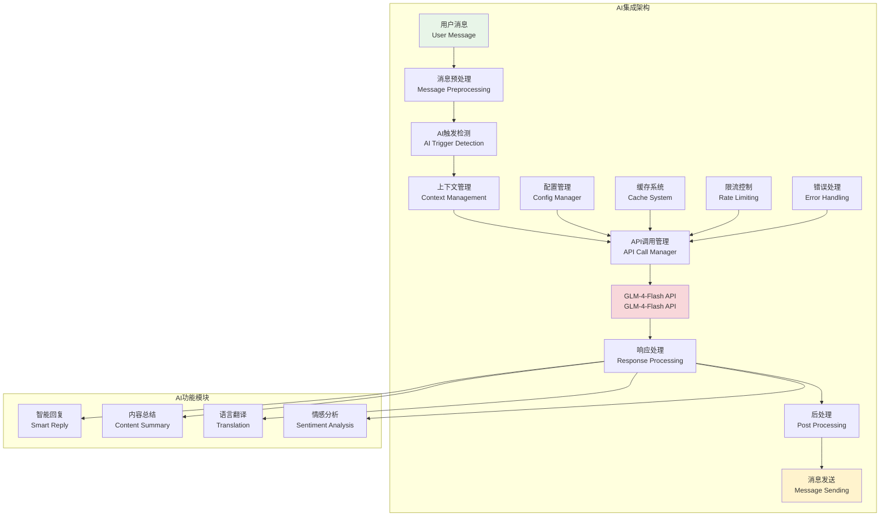
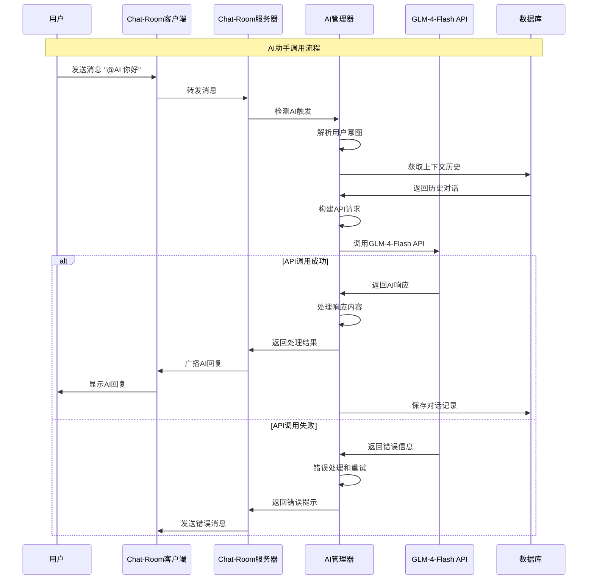

# API集成基础

## 🎯 学习目标

通过本章学习，您将能够：
- 理解AI API集成的基本原理和最佳实践
- 掌握GLM-4-Flash API的使用方法和特性
- 学会设计可靠的API调用和错误处理机制
- 在Chat-Room项目中实现智能AI助手功能

## 🤖 AI集成架构

### AI集成系统概览



### API调用流程



## 🔌 API集成实现

### 智谱AI客户端实现

```python
# server/ai/zhipu_client.py - 智谱AI API客户端
import os
import time
from typing import Dict, List, Optional, Any
from dataclasses import dataclass

try:
    from zhipuai import ZhipuAI
    ZHIPU_SDK_AVAILABLE = True
except ImportError:
    ZHIPU_SDK_AVAILABLE = False
    print("⚠️ 智谱AI官方SDK未安装，将使用HTTP API方式")
    print("💡 建议安装官方SDK: pip install zhipuai")

    # 备用HTTP API实现
    import json
    import requests

@dataclass
class AIMessage:
    """AI消息数据类"""
    role: str  # "user", "assistant", "system"
    content: str
    timestamp: Optional[float] = None

class ZhipuClient:
    """智谱AI API客户端"""

    def __init__(self, api_key: str = None):
        """
        初始化智谱AI客户端

        Args:
            api_key: 智谱AI API密钥，如果为None则从配置文件获取
        """
        if api_key:
            self.api_key = api_key
        else:
            # 从配置文件获取API密钥
            try:
                from server.config.server_config import get_server_config
                server_config = get_server_config()
                self.api_key = server_config.get_ai_api_key()
            except Exception:
                # 备用方案：从环境变量获取
                self.api_key = os.getenv('ZHIPU_API_KEY', '')

        if not self.api_key:
            raise ValueError("智谱AI API密钥未设置")

        # 模型配置 - 使用GLM-4-Flash免费模型
        self.model = "glm-4-flash"  # 使用免费的GLM-4-Flash模型
        self.max_tokens = 1024
        self.temperature = 0.7
        self.top_p = 0.9

        # 初始化客户端
        if ZHIPU_SDK_AVAILABLE:
            self.client = ZhipuAI(api_key=self.api_key)
            self.use_sdk = True
            print("✅ 使用智谱AI官方SDK")
        else:
            # 备用HTTP API配置
            self.base_url = "https://open.bigmodel.cn/api/paas/v4"
            self.headers = {
                "Authorization": f"Bearer {self.api_key}",
                "Content-Type": "application/json"
            }
            self.use_sdk = False
            print("⚠️ 使用HTTP API方式调用智谱AI")
    
    def chat_completion(self, messages: List[AIMessage],
                       system_prompt: str = None) -> Optional[str]:
        """
        调用智谱AI聊天完成API

        Args:
            messages: 对话消息列表
            system_prompt: 系统提示词

        Returns:
            AI回复内容，失败时返回None
        """
        try:
            # 构建请求消息
            api_messages = []

            # 添加系统提示词
            if system_prompt:
                api_messages.append({
                    "role": "system",
                    "content": system_prompt
                })

            # 添加对话消息
            for msg in messages:
                api_messages.append({
                    "role": msg.role,
                    "content": msg.content
                })

            if self.use_sdk:
                # 使用官方SDK调用
                return self._chat_completion_sdk(api_messages)
            else:
                # 使用HTTP API调用
                return self._chat_completion_http(api_messages)

        except Exception as e:
            print(f"智谱AI API调用错误: {e}")
            return None

    def _chat_completion_sdk(self, api_messages: List[Dict]) -> Optional[str]:
        """
        使用官方SDK调用聊天完成API

        Args:
            api_messages: API消息列表

        Returns:
            AI回复内容
        """
        try:
            response = self.client.chat.completions.create(
                model=self.model,
                messages=api_messages,
                max_tokens=self.max_tokens,
                temperature=self.temperature,
                top_p=self.top_p,
                stream=False
            )

            if response.choices and len(response.choices) > 0:
                return response.choices[0].message.content.strip()
            else:
                print("智谱AI SDK响应格式错误：没有choices")
                return None

        except Exception as e:
            print(f"智谱AI SDK调用错误: {e}")
            return None

    def _chat_completion_http(self, api_messages: List[Dict]) -> Optional[str]:
        """
        使用HTTP API调用聊天完成API

        Args:
            api_messages: API消息列表

        Returns:
            AI回复内容
        """
        try:
            # 构建请求数据
            request_data = {
                "model": self.model,
                "messages": api_messages,
                "max_tokens": self.max_tokens,
                "temperature": self.temperature,
                "top_p": self.top_p,
                "stream": False
            }

            # 发送请求
            response = requests.post(
                f"{self.base_url}/chat/completions",
                headers=self.headers,
                json=request_data,
                timeout=30
            )

            # 检查响应状态
            if response.status_code != 200:
                print(f"智谱AI API请求失败: {response.status_code} - {response.text}")
                return None

            # 解析响应
            response_data = response.json()

            if "choices" not in response_data or not response_data["choices"]:
                print("智谱AI API响应格式错误")
                return None

            # 提取AI回复
            ai_reply = response_data["choices"][0]["message"]["content"]
            return ai_reply.strip()

        except Exception as e:
            print(f"智谱AI HTTP API调用错误: {e}")
            return None

    def simple_chat(self, user_message: str, system_prompt: str = None) -> Optional[str]:
        """
        简单聊天接口

        Args:
            user_message: 用户消息
            system_prompt: 系统提示词

        Returns:
            AI回复内容
        """
        messages = [AIMessage(role="user", content=user_message, timestamp=time.time())]
        return self.chat_completion(messages, system_prompt)

    def test_connection(self) -> bool:
        """
        测试API连接

        Returns:
            连接是否成功
        """
        try:
            response = self.simple_chat("你好", "你是一个友好的AI助手，请简短回复。")
            return response is not None and len(response.strip()) > 0
        except Exception as e:
            print(f"智谱AI连接测试失败: {e}")
            return False

    def get_model_info(self) -> Dict[str, Any]:
        """
        获取模型信息

        Returns:
            模型信息字典
        """
        return {
            "model": self.model,
            "max_tokens": self.max_tokens,
            "temperature": self.temperature,
            "top_p": self.top_p,
            "api_key_set": bool(self.api_key),
            "use_sdk": self.use_sdk,
            "sdk_available": ZHIPU_SDK_AVAILABLE
        }
# 使用示例
def demo_zhipu_client():
    """智谱AI客户端演示"""
    print("=== 智谱AI客户端演示 ===")

    try:
        # 初始化客户端
        client = ZhipuClient()

        # 测试连接
        print("测试API连接...")
        if client.test_connection():
            print("✅ API连接成功")
        else:
            print("❌ API连接失败")
            return

        # 获取模型信息
        model_info = client.get_model_info()
        print(f"模型信息: {model_info}")

        # 简单聊天
        print("\n--- 简单聊天测试 ---")
        response = client.simple_chat(
            user_message="你好，请介绍一下你自己",
            system_prompt="你是一个友好的AI助手，名叫小智。请简短回复。"
        )

        if response:
            print(f"AI回复: {response}")
        else:
            print("❌ 聊天请求失败")

        # 带上下文的对话
        print("\n--- 上下文对话测试 ---")
        messages = [
            AIMessage(role="user", content="我叫张三"),
            AIMessage(role="assistant", content="你好张三，很高兴认识你！"),
            AIMessage(role="user", content="你还记得我的名字吗？")
        ]

        response = client.chat_completion(
            messages=messages,
            system_prompt="你是一个有记忆的AI助手。"
        )

        if response:
            print(f"AI回复（带上下文）: {response}")
        else:
            print("❌ 上下文对话失败")

    except Exception as e:
        print(f"演示过程中出现错误: {e}")

if __name__ == "__main__":
    demo_zhipu_client()
```

## 🔧 Chat-Room中的AI集成

### AI管理器实现

```python
# server/ai/ai_manager.py - AI管理器
import time
from typing import Dict, List, Optional, Any
from dataclasses import dataclass
from .zhipu_client import ZhipuClient, AIMessage

@dataclass
class ChatContext:
    """聊天上下文"""
    user_id: int
    group_id: Optional[int]
    conversation_history: List[AIMessage]
    last_interaction: float

    def add_message(self, role: str, content: str):
        """添加消息到历史"""
        self.conversation_history.append(
            AIMessage(role=role, content=content, timestamp=time.time())
        )
        self.last_interaction = time.time()

        # 限制历史长度
        if len(self.conversation_history) > 20:
            self.conversation_history = self.conversation_history[-20:]

class AIManager:
    """AI管理器 - 管理Chat-Room中的AI功能"""

    def __init__(self, api_key: str = None):
        """
        初始化AI管理器

        Args:
            api_key: 智谱AI API密钥
        """
        self.zhipu_client = ZhipuClient(api_key)
        self.contexts: Dict[str, ChatContext] = {}  # 用户上下文缓存
        self.enabled = True

        # AI配置
        self.system_prompt = """你是Chat-Room聊天室的AI助手，名叫小智。
你的特点：
1. 友好、有帮助、有趣
2. 回复简洁明了，通常不超过100字
3. 能够参与群聊讨论
4. 可以回答问题、提供建议
5. 保持积极正面的态度

请根据聊天内容自然地参与对话。"""

        # 测试连接
        if not self.zhipu_client.test_connection():
            print("⚠️ 智谱AI连接失败，AI功能将被禁用")
            self.enabled = False
        else:
            print("✅ 智谱AI连接成功，AI功能已启用")

    def is_enabled(self) -> bool:
        """检查AI功能是否启用"""
        return self.enabled

    def should_respond(self, message_content: str) -> bool:
        """
        判断是否应该响应消息

        Args:
            message_content: 消息内容

        Returns:
            是否应该响应
        """
        if not self.enabled:
            return False

        # 检查是否包含@AI标记（不区分大小写）
        message_lower = message_content.lower()
        return "@ai" in message_lower or "@小智" in message_lower

    def get_context_key(self, user_id: int, group_id: Optional[int]) -> str:
        """获取上下文键"""
        if group_id:
            return f"group_{group_id}_user_{user_id}"
        else:
            return f"private_user_{user_id}"

    def get_or_create_context(self, user_id: int, group_id: Optional[int]) -> ChatContext:
        """获取或创建聊天上下文"""
        context_key = self.get_context_key(user_id, group_id)

        if context_key not in self.contexts:
            self.contexts[context_key] = ChatContext(
                user_id=user_id,
                group_id=group_id,
                conversation_history=[],
                last_interaction=time.time()
            )

        return self.contexts[context_key]

    def generate_response(self, user_message: str, user_id: int,
                         group_id: Optional[int] = None,
                         username: str = None) -> Optional[str]:
        """
        生成AI响应

        Args:
            user_message: 用户消息
            user_id: 用户ID
            group_id: 群组ID（私聊时为None）
            username: 用户名

        Returns:
            AI响应内容
        """
        if not self.enabled:
            return None

        try:
            # 获取上下文
            context = self.get_or_create_context(user_id, group_id)

            # 清理@AI标记
            clean_message = user_message.replace("@AI", "").replace("@ai", "").replace("@小智", "").strip()

            # 构建消息历史
            messages = context.conversation_history.copy()

            # 添加用户名信息到消息中
            if username:
                user_message_with_name = f"{username}: {clean_message}"
            else:
                user_message_with_name = clean_message

            messages.append(AIMessage(
                role="user",
                content=user_message_with_name,
                timestamp=time.time()
            ))

            # 调用AI API
            ai_response = self.zhipu_client.chat_completion(
                messages=messages,
                system_prompt=self.system_prompt
            )

            if ai_response:
                # 更新上下文
                context.add_message("user", user_message_with_name)
                context.add_message("assistant", ai_response)

                return ai_response
            else:
                return "抱歉，我现在无法回复，请稍后再试。"

        except Exception as e:
            print(f"AI响应生成错误: {e}")
            return "抱歉，我遇到了一些技术问题。"

    def clear_context(self, user_id: int, group_id: Optional[int] = None):
        """清除用户上下文"""
        context_key = self.get_context_key(user_id, group_id)
        if context_key in self.contexts:
            del self.contexts[context_key]

    def cleanup_old_contexts(self, max_age_hours: int = 24):
        """清理过期的上下文"""
        current_time = time.time()
        max_age_seconds = max_age_hours * 3600

        expired_keys = []
        for key, context in self.contexts.items():
            if current_time - context.last_interaction > max_age_seconds:
                expired_keys.append(key)

        for key in expired_keys:
            del self.contexts[key]

        if expired_keys:
            print(f"清理了 {len(expired_keys)} 个过期的AI上下文")

    def get_stats(self) -> Dict[str, Any]:
        """获取AI管理器统计信息"""
        return {
            "enabled": self.enabled,
            "active_contexts": len(self.contexts),
            "model_info": self.zhipu_client.get_model_info() if self.enabled else None
        }

# 使用示例
def demo_ai_manager():
    """AI管理器演示"""
    print("=== AI管理器演示 ===")

    # 初始化AI管理器
    ai_manager = AIManager()

    if not ai_manager.is_enabled():
        print("AI功能未启用，跳过演示")
        return

    # 模拟群聊场景
    print("\n--- 群聊AI响应测试 ---")

    # 用户1发送消息
    message1 = "@AI 你好，请介绍一下自己"
    if ai_manager.should_respond(message1):
        response1 = ai_manager.generate_response(
            user_message=message1,
            user_id=1,
            group_id=1,
            username="张三"
        )
        print(f"用户: {message1}")
        print(f"AI: {response1}")

    # 用户2发送消息
    message2 = "@AI 你能帮我解答编程问题吗？"
    if ai_manager.should_respond(message2):
        response2 = ai_manager.generate_response(
            user_message=message2,
            user_id=2,
            group_id=1,
            username="李四"
        )
        print(f"用户: {message2}")
        print(f"AI: {response2}")

    # 查看统计信息
    stats = ai_manager.get_stats()
    print(f"\nAI管理器统计: {stats}")

if __name__ == "__main__":
    demo_ai_manager()
```

## 🎯 实践练习

### 练习1：API配置管理

```python
class APIConfigManager:
    """
    API配置管理练习

    要求：
    1. 支持从配置文件加载API密钥
    2. 实现配置验证机制
    3. 支持环境变量覆盖
    4. 添加配置热更新功能
    """

    def load_config_from_file(self, config_path: str) -> Dict[str, Any]:
        """从文件加载配置"""
        # TODO: 实现配置文件加载
        pass

    def validate_config(self, config: Dict[str, Any]) -> bool:
        """验证配置有效性"""
        # TODO: 实现配置验证
        pass

    def get_api_key(self) -> str:
        """获取API密钥"""
        # TODO: 实现API密钥获取逻辑
        pass
```

### 练习2：AI响应缓存

```python
class AIResponseCache:
    """
    AI响应缓存练习

    要求：
    1. 实现基于消息内容的缓存
    2. 支持TTL过期机制
    3. 添加缓存命中率统计
    4. 实现缓存清理策略
    """

    def get_cached_response(self, message_hash: str) -> Optional[str]:
        """获取缓存响应"""
        # TODO: 实现缓存查询
        pass

    def cache_response(self, message_hash: str, response: str, ttl: int = 3600):
        """缓存响应"""
        # TODO: 实现响应缓存
        pass

    def get_cache_stats(self) -> Dict[str, Any]:
        """获取缓存统计"""
        # TODO: 实现缓存统计
        pass
## ✅ 学习检查

完成本章学习后，请确认您能够：

- [ ] 理解智谱AI API集成的基本架构
- [ ] 配置和使用GLM-4-Flash免费模型
- [ ] 实现同步API调用和错误处理
- [ ] 设计AI管理器管理聊天上下文
- [ ] 在Chat-Room中集成AI功能
- [ ] 完成实践练习

## 📚 下一步

API集成基础掌握后，请继续学习：
- [GLM-4-Flash特性](glm-4-flash-features.md)
- [上下文管理](context-management.md)
- [AI响应优化](ai-response-optimization.md)

---

**现在您已经掌握了智谱AI API集成的核心技术！** 🤖
    
    def _build_request(self, messages: List[ChatMessage], stream: bool) -> Dict[str, Any]:
        """构建API请求"""
        return {
            "model": self.config.model,
            "messages": [msg.to_dict() for msg in messages],
            "max_tokens": self.config.max_tokens,
            "temperature": self.config.temperature,
            "top_p": self.config.top_p,
            "stream": stream
        }
    
    async def _make_request(self, request_data: Dict[str, Any], 
                          stream: bool) -> APIResponse:
        """执行API请求"""
        headers = {
            "Authorization": f"Bearer {self.config.api_key}",
            "Content-Type": "application/json"
        }
        
        url = f"{self.config.base_url}/chat/completions"
        
        for attempt in range(self.config.max_retries):
            try:
                async with self.session.post(url, json=request_data, headers=headers) as response:
                    if response.status == 200:
                        if stream:
                            return await self._handle_stream_response(response)
                        else:
                            return await self._handle_normal_response(response)
                    else:
                        error_text = await response.text()
                        self.logger.warning(f"API请求失败 (状态码: {response.status}): {error_text}")
                        
                        if attempt < self.config.max_retries - 1:
                            await asyncio.sleep(self.config.retry_delay * (2 ** attempt))
                            continue
                        
                        return APIResponse(
                            success=False,
                            error_message=f"HTTP {response.status}: {error_text}",
                            error_code=str(response.status)
                        )
            
            except asyncio.TimeoutError:
                self.logger.warning(f"API请求超时 (尝试 {attempt + 1}/{self.config.max_retries})")
                if attempt < self.config.max_retries - 1:
                    await asyncio.sleep(self.config.retry_delay * (2 ** attempt))
                    continue
                
                return APIResponse(
                    success=False,
                    error_message="请求超时",
                    error_code="TIMEOUT"
                )
            
            except Exception as e:
                self.logger.error(f"API请求异常 (尝试 {attempt + 1}/{self.config.max_retries}): {e}")
                if attempt < self.config.max_retries - 1:
                    await asyncio.sleep(self.config.retry_delay * (2 ** attempt))
                    continue
                
                return APIResponse(
                    success=False,
                    error_message=str(e),
                    error_code="REQUEST_ERROR"
                )
        
        return APIResponse(
            success=False,
            error_message="所有重试尝试都失败了",
            error_code="MAX_RETRIES_EXCEEDED"
        )
    
    async def _handle_normal_response(self, response: aiohttp.ClientResponse) -> APIResponse:
        """处理普通响应"""
        try:
            data = await response.json()
            
            if "choices" in data and len(data["choices"]) > 0:
                content = data["choices"][0]["message"]["content"]
                usage = data.get("usage", {})
                
                return APIResponse(
                    success=True,
                    content=content,
                    usage=usage
                )
            else:
                return APIResponse(
                    success=False,
                    error_message="响应格式错误：缺少choices字段",
                    error_code="INVALID_RESPONSE"
                )
        
        except json.JSONDecodeError as e:
            return APIResponse(
                success=False,
                error_message=f"JSON解析错误: {e}",
                error_code="JSON_DECODE_ERROR"
            )
    
    async def _handle_stream_response(self, response: aiohttp.ClientResponse) -> APIResponse:
        """处理流式响应"""
        content_parts = []
        
        try:
            async for line in response.content:
                line = line.decode('utf-8').strip()
                
                if line.startswith('data: '):
                    data_str = line[6:]  # 移除 'data: ' 前缀
                    
                    if data_str == '[DONE]':
                        break
                    
                    try:
                        data = json.loads(data_str)
                        if "choices" in data and len(data["choices"]) > 0:
                            delta = data["choices"][0].get("delta", {})
                            if "content" in delta:
                                content_parts.append(delta["content"])
                    except json.JSONDecodeError:
                        continue
            
            full_content = ''.join(content_parts)
            
            return APIResponse(
                success=True,
                content=full_content
            )
        
        except Exception as e:
            return APIResponse(
                success=False,
                error_message=f"流式响应处理错误: {e}",
                error_code="STREAM_ERROR"
            )
    
    async def _wait_for_rate_limit(self):
        """等待限流"""
        current_time = time.time()
        time_since_last = current_time - self.last_request_time
        
        if time_since_last < self.min_request_interval:
            await asyncio.sleep(self.min_request_interval - time_since_last)
        
        self.last_request_time = time.time()
    
    def _update_stats(self, response: APIResponse):
        """更新统计信息"""
        self.stats['total_requests'] += 1
        
        if response.success:
            self.stats['successful_requests'] += 1
            if response.usage:
                self.stats['total_tokens_used'] += response.usage.get('total_tokens', 0)
        else:
            self.stats['failed_requests'] += 1
        
        if response.response_time:
            self.stats['total_response_time'] += response.response_time
    
    def get_stats(self) -> Dict[str, Any]:
        """获取统计信息"""
        stats = self.stats.copy()
        
        if stats['total_requests'] > 0:
            stats['success_rate'] = stats['successful_requests'] / stats['total_requests']
            stats['average_response_time'] = stats['total_response_time'] / stats['total_requests']
        else:
            stats['success_rate'] = 0.0
            stats['average_response_time'] = 0.0
        
        return stats

# 使用示例
async def demo_glm_client():
    """GLM客户端演示"""
    # 配置（实际使用时需要真实的API密钥）
    config = GLMConfig(
        api_key="your_api_key_here",
        model="glm-4-flash",
        max_tokens=512,
        temperature=0.7
    )
    
    print("=== GLM-4-Flash API客户端演示 ===")
    
    async with GLMClient(config) as client:
        # 简单聊天
        response = await client.simple_chat(
            user_message="你好，请介绍一下你自己",
            system_prompt="你是一个友好的AI助手，名叫小智。"
        )
        
        if response.success:
            print(f"AI回复: {response.content}")
            print(f"响应时间: {response.response_time:.2f}秒")
            if response.usage:
                print(f"Token使用: {response.usage}")
        else:
            print(f"请求失败: {response.error_message}")
        
        # 带上下文的对话
        history = [
            ChatMessage(MessageRole.USER, "我叫张三"),
            ChatMessage(MessageRole.ASSISTANT, "你好张三，很高兴认识你！")
        ]
        
        response = await client.chat_with_context(
            user_message="你还记得我的名字吗？",
            conversation_history=history,
            system_prompt="你是一个有记忆的AI助手。"
        )
        
        if response.success:
            print(f"AI回复（带上下文）: {response.content}")
        
        # 查看统计信息
        stats = client.get_stats()
        print(f"API调用统计: {stats}")

if __name__ == "__main__":
    asyncio.run(demo_glm_client())
```

## 🎯 实践练习

### 练习1：API配置管理
```python
class APIConfigManager:
    """
    API配置管理练习
    
    要求：
    1. 支持多个API提供商配置
    2. 实现配置热更新
    3. 添加配置验证机制
    4. 支持环境变量覆盖
    """
    
    def load_config_from_file(self, config_path: str) -> GLMConfig:
        """从文件加载配置"""
        # TODO: 实现配置文件加载
        pass
    
    def validate_config(self, config: GLMConfig) -> bool:
        """验证配置有效性"""
        # TODO: 实现配置验证
        pass
```

### 练习2：API响应缓存
```python
class APIResponseCache:
    """
    API响应缓存练习
    
    要求：
    1. 实现基于内容哈希的缓存
    2. 支持TTL过期机制
    3. 添加缓存命中率统计
    4. 实现缓存清理策略
    """
    
    def get_cached_response(self, request_hash: str) -> Optional[APIResponse]:
        """获取缓存响应"""
        # TODO: 实现缓存查询
        pass
    
    def cache_response(self, request_hash: str, response: APIResponse):
        """缓存响应"""
        # TODO: 实现响应缓存
        pass
```

## ✅ 学习检查

完成本章学习后，请确认您能够：

- [ ] 理解AI API集成的基本架构
- [ ] 配置和使用GLM-4-Flash API
- [ ] 实现异步API调用和错误处理
- [ ] 设计限流和重试机制
- [ ] 管理API调用统计和监控
- [ ] 完成实践练习

## 📚 下一步

API集成基础掌握后，请继续学习：
- [GLM-4-Flash特性](glm-4-flash-features.md)
- [上下文管理](context-management.md)
- [异步处理](async-processing.md)

---

**现在您已经掌握了AI API集成的核心技术！** 🤖
