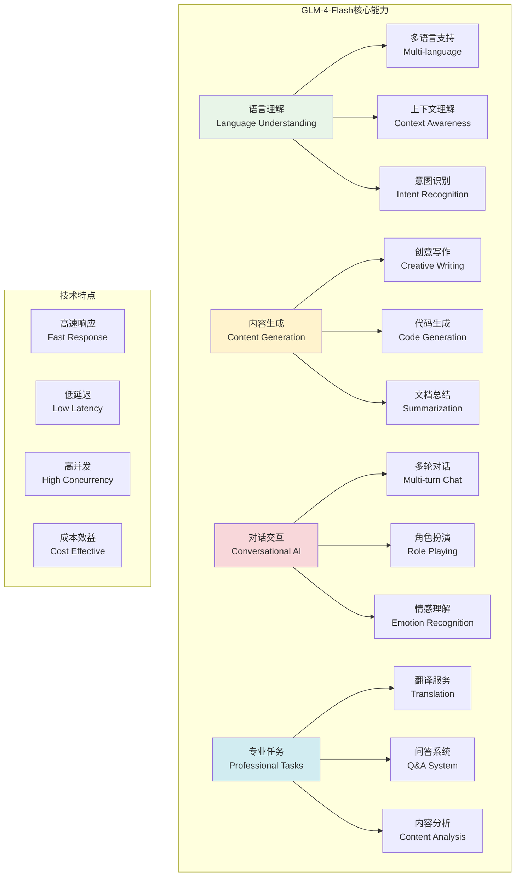
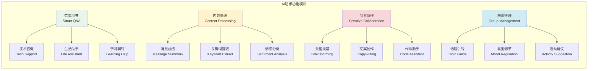

# GLM-4-Flash特性详解

## 🎯 学习目标

通过本章学习，您将能够：
- 深入了解GLM-4-Flash模型的特性和能力
- 掌握不同场景下的提示词工程技巧
- 学会优化AI交互体验和响应质量
- 在Chat-Room项目中充分发挥AI助手的潜力

## ⚡ GLM-4-Flash模型特性

### 模型能力概览



### Chat-Room AI助手功能设计



## 🎨 提示词工程

### Chat-Room专用提示词模板

```python
# server/ai/prompt_templates.py - 提示词模板
from typing import Dict, List, Optional, Any
from dataclasses import dataclass
from enum import Enum
import json

class PromptType(Enum):
    """提示词类型"""
    CHAT_ASSISTANT = "chat_assistant"
    CONTENT_SUMMARY = "content_summary"
    TRANSLATION = "translation"
    CODE_HELPER = "code_helper"
    CREATIVE_WRITING = "creative_writing"
    SENTIMENT_ANALYSIS = "sentiment_analysis"

@dataclass
class PromptTemplate:
    """提示词模板"""
    name: str
    type: PromptType
    system_prompt: str
    user_template: str
    parameters: Dict[str, Any]
    examples: List[Dict[str, str]]
    
    def format(self, **kwargs) -> str:
        """格式化用户提示词"""
        return self.user_template.format(**kwargs)

class ChatRoomPromptManager:
    """
    Chat-Room提示词管理器
    
    功能：
    1. 管理各种场景的提示词模板
    2. 动态生成上下文相关的提示词
    3. 优化AI响应质量和一致性
    4. 支持多语言和个性化定制
    """
    
    def __init__(self):
        self.templates: Dict[str, PromptTemplate] = {}
        self._init_default_templates()
    
    def _init_default_templates(self):
        """初始化默认提示词模板"""
        
        # 聊天助手模板
        chat_assistant = PromptTemplate(
            name="chat_assistant",
            type=PromptType.CHAT_ASSISTANT,
            system_prompt="""你是Chat-Room聊天室的AI助手，名叫"小智"。你的特点：

1. 友好、耐心、乐于助人
2. 具有丰富的知识和经验
3. 能够理解上下文和用户情感
4. 回复简洁明了，避免过长的回答
5. 适当使用表情符号增加亲和力
6. 尊重用户隐私，不记录敏感信息

当前聊天环境：
- 群组名称：{group_name}
- 在线人数：{online_count}
- 当前时间：{current_time}

请根据用户的问题和聊天上下文，提供有帮助的回复。""",
            user_template="用户问题：{user_message}\n\n聊天上下文：\n{chat_context}",
            parameters={
                "max_tokens": 512,
                "temperature": 0.7,
                "top_p": 0.9
            },
            examples=[
                {
                    "user": "你好，小智！",
                    "assistant": "你好！😊 很高兴在Chat-Room遇到你！有什么我可以帮助你的吗？"
                },
                {
                    "user": "这个群里有什么有趣的话题吗？",
                    "assistant": "让我看看最近的聊天记录...大家在讨论技术、生活和学习等话题呢！你对哪个方面比较感兴趣？我可以帮你找到相关的讨论 🤔"
                }
            ]
        )
        
        # 内容总结模板
        content_summary = PromptTemplate(
            name="content_summary",
            type=PromptType.CONTENT_SUMMARY,
            system_prompt="""你是一个专业的内容总结助手。请对聊天记录进行简洁、准确的总结。

总结要求：
1. 提取关键信息和主要话题
2. 保持客观中性的语调
3. 突出重要决定和结论
4. 控制在200字以内
5. 使用清晰的结构化格式""",
            user_template="请总结以下聊天内容：\n\n{chat_content}\n\n总结要点：{summary_points}",
            parameters={
                "max_tokens": 300,
                "temperature": 0.3,
                "top_p": 0.8
            },
            examples=[
                {
                    "user": "总结今天的技术讨论",
                    "assistant": "📋 今日技术讨论总结：\n\n🔹 主要话题：Python异步编程\n🔹 讨论要点：asyncio库使用、性能优化\n🔹 达成共识：异步编程适合I/O密集型任务\n🔹 后续计划：下周分享实战案例"
                }
            ]
        )
        
        # 翻译助手模板
        translation = PromptTemplate(
            name="translation",
            type=PromptType.TRANSLATION,
            system_prompt="""你是一个专业的翻译助手。请提供准确、自然的翻译服务。

翻译原则：
1. 保持原文的语气和风格
2. 考虑文化背景和语境
3. 使用地道的表达方式
4. 对于专业术语，提供准确翻译
5. 如有歧义，提供多种翻译选项""",
            user_template="请将以下内容从{source_lang}翻译为{target_lang}：\n\n{text}",
            parameters={
                "max_tokens": 1024,
                "temperature": 0.2,
                "top_p": 0.8
            },
            examples=[
                {
                    "user": "翻译：Hello, how are you?",
                    "assistant": "你好，你好吗？\n\n💡 更自然的表达：\n- 你好，最近怎么样？\n- 嗨，你还好吗？"
                }
            ]
        )
        
        # 代码助手模板
        code_helper = PromptTemplate(
            name="code_helper",
            type=PromptType.CODE_HELPER,
            system_prompt="""你是一个专业的编程助手。请提供准确、实用的编程帮助。

服务内容：
1. 代码解释和分析
2. 错误诊断和修复建议
3. 代码优化和重构
4. 最佳实践推荐
5. 算法和数据结构指导

回复格式：
- 简洁的解释
- 完整的代码示例
- 关键点说明
- 相关建议""",
            user_template="编程问题：{question}\n\n代码上下文：\n```{language}\n{code}\n```\n\n具体需求：{requirements}",
            parameters={
                "max_tokens": 1024,
                "temperature": 0.1,
                "top_p": 0.9
            },
            examples=[
                {
                    "user": "如何优化这个Python循环？",
                    "assistant": "🔧 代码优化建议：\n\n```python\n# 原代码优化版本\nresult = [process(item) for item in items if condition(item)]\n```\n\n💡 优化要点：\n- 使用列表推导式提高性能\n- 减少函数调用开销\n- 提高代码可读性"
                }
            ]
        )
        
        # 情感分析模板
        sentiment_analysis = PromptTemplate(
            name="sentiment_analysis",
            type=PromptType.SENTIMENT_ANALYSIS,
            system_prompt="""你是一个情感分析专家。请分析文本的情感倾向和情绪状态。

分析维度：
1. 情感极性：正面、负面、中性
2. 情感强度：强烈、中等、轻微
3. 具体情绪：开心、愤怒、悲伤、焦虑等
4. 情感变化：情绪波动趋势

输出格式：
- 简洁的分析结果
- 关键情感词汇
- 建议的回应方式""",
            user_template="请分析以下文本的情感：\n\n{text}\n\n分析重点：{focus_areas}",
            parameters={
                "max_tokens": 256,
                "temperature": 0.3,
                "top_p": 0.8
            },
            examples=[
                {
                    "user": "分析：今天工作太累了，什么都不想做",
                    "assistant": "😔 情感分析：\n\n🔹 情感极性：负面\n🔹 情感强度：中等\n🔹 主要情绪：疲惫、消极\n🔹 建议回应：表示理解和关心，提供放松建议"
                }
            ]
        )
        
        # 注册模板
        self.templates = {
            "chat_assistant": chat_assistant,
            "content_summary": content_summary,
            "translation": translation,
            "code_helper": code_helper,
            "sentiment_analysis": sentiment_analysis
        }
    
    def get_template(self, template_name: str) -> Optional[PromptTemplate]:
        """获取提示词模板"""
        return self.templates.get(template_name)
    
    def format_chat_prompt(self, user_message: str, group_name: str = "默认群组",
                          online_count: int = 1, chat_context: str = "") -> tuple[str, str]:
        """格式化聊天提示词"""
        template = self.get_template("chat_assistant")
        if not template:
            return "", user_message
        
        import datetime
        current_time = datetime.datetime.now().strftime("%Y-%m-%d %H:%M:%S")
        
        system_prompt = template.system_prompt.format(
            group_name=group_name,
            online_count=online_count,
            current_time=current_time
        )
        
        user_prompt = template.format(
            user_message=user_message,
            chat_context=chat_context
        )
        
        return system_prompt, user_prompt
    
    def format_summary_prompt(self, chat_content: str, 
                            summary_points: str = "主要话题和结论") -> tuple[str, str]:
        """格式化总结提示词"""
        template = self.get_template("content_summary")
        if not template:
            return "", chat_content
        
        system_prompt = template.system_prompt
        user_prompt = template.format(
            chat_content=chat_content,
            summary_points=summary_points
        )
        
        return system_prompt, user_prompt
    
    def format_translation_prompt(self, text: str, source_lang: str = "英文",
                                target_lang: str = "中文") -> tuple[str, str]:
        """格式化翻译提示词"""
        template = self.get_template("translation")
        if not template:
            return "", text
        
        system_prompt = template.system_prompt
        user_prompt = template.format(
            text=text,
            source_lang=source_lang,
            target_lang=target_lang
        )
        
        return system_prompt, user_prompt
    
    def format_code_helper_prompt(self, question: str, code: str = "",
                                language: str = "python", 
                                requirements: str = "请提供解决方案") -> tuple[str, str]:
        """格式化代码助手提示词"""
        template = self.get_template("code_helper")
        if not template:
            return "", question
        
        system_prompt = template.system_prompt
        user_prompt = template.format(
            question=question,
            code=code,
            language=language,
            requirements=requirements
        )
        
        return system_prompt, user_prompt
    
    def add_custom_template(self, template: PromptTemplate):
        """添加自定义模板"""
        self.templates[template.name] = template
    
    def list_templates(self) -> List[str]:
        """列出所有模板名称"""
        return list(self.templates.keys())

# 智能提示词优化器
class PromptOptimizer:
    """提示词优化器"""
    
    def __init__(self):
        self.optimization_rules = {
            "clarity": "使用清晰、具体的语言",
            "context": "提供充分的上下文信息",
            "structure": "使用结构化的格式",
            "examples": "包含相关的示例",
            "constraints": "明确指定输出约束"
        }
    
    def optimize_prompt(self, original_prompt: str, 
                       optimization_goals: List[str]) -> str:
        """优化提示词"""
        optimized = original_prompt
        
        for goal in optimization_goals:
            if goal == "clarity":
                optimized = self._improve_clarity(optimized)
            elif goal == "structure":
                optimized = self._add_structure(optimized)
            elif goal == "examples":
                optimized = self._add_examples(optimized)
        
        return optimized
    
    def _improve_clarity(self, prompt: str) -> str:
        """提高清晰度"""
        # 添加明确的指令
        if not prompt.startswith("请"):
            prompt = "请" + prompt
        
        # 添加输出格式说明
        if "格式" not in prompt:
            prompt += "\n\n请以清晰、简洁的格式回复。"
        
        return prompt
    
    def _add_structure(self, prompt: str) -> str:
        """添加结构化格式"""
        if "步骤" not in prompt and "要点" not in prompt:
            prompt += "\n\n请按以下结构回复：\n1. 主要观点\n2. 详细说明\n3. 总结建议"
        
        return prompt
    
    def _add_examples(self, prompt: str) -> str:
        """添加示例"""
        if "例如" not in prompt and "示例" not in prompt:
            prompt += "\n\n请提供具体的例子来说明你的观点。"
        
        return prompt

# 使用示例
def demo_prompt_management():
    """提示词管理演示"""
    manager = ChatRoomPromptManager()
    
    print("=== Chat-Room提示词管理演示 ===")
    
    # 聊天助手提示词
    system_prompt, user_prompt = manager.format_chat_prompt(
        user_message="你能帮我解释一下什么是机器学习吗？",
        group_name="AI学习群",
        online_count=15,
        chat_context="最近大家在讨论人工智能的发展趋势"
    )
    
    print("聊天助手提示词：")
    print(f"系统提示词：{system_prompt[:200]}...")
    print(f"用户提示词：{user_prompt}")
    
    # 代码助手提示词
    system_prompt, user_prompt = manager.format_code_helper_prompt(
        question="如何优化这个函数的性能？",
        code="def slow_function(data):\n    result = []\n    for item in data:\n        if item > 0:\n            result.append(item * 2)\n    return result",
        language="python",
        requirements="提供更高效的实现方式"
    )
    
    print("\n代码助手提示词：")
    print(f"用户提示词：{user_prompt}")
    
    # 列出所有模板
    templates = manager.list_templates()
    print(f"\n可用模板：{templates}")

if __name__ == "__main__":
    demo_prompt_management()
```

## 🎯 实践练习

### 练习1：个性化AI助手
```python
class PersonalizedAIAssistant:
    """
    个性化AI助手练习
    
    要求：
    1. 根据用户偏好调整回复风格
    2. 学习用户的兴趣和习惯
    3. 提供个性化的建议和服务
    4. 支持多种AI人格设定
    """
    
    def adapt_to_user_style(self, user_id: int, conversation_history: List[str]):
        """适应用户风格"""
        # TODO: 实现用户风格学习
        pass
```

### 练习2：多模态AI集成
```python
class MultiModalAI:
    """
    多模态AI集成练习
    
    要求：
    1. 支持图像理解和描述
    2. 集成语音识别和合成
    3. 处理文档和表格数据
    4. 实现跨模态的智能交互
    """
    
    def process_image_message(self, image_data: bytes, user_query: str):
        """处理图像消息"""
        # TODO: 实现图像理解
        pass
```

## ✅ 学习检查

完成本章学习后，请确认您能够：

- [ ] 理解GLM-4-Flash模型的核心特性
- [ ] 设计有效的提示词模板
- [ ] 优化AI交互体验
- [ ] 实现多场景的AI功能
- [ ] 管理和优化提示词质量
- [ ] 完成实践练习

## 📚 下一步

GLM-4-Flash特性掌握后，请继续学习：
- [上下文管理](context-management.md)
- [异步处理](async-processing.md)

---

**现在您已经掌握了GLM-4-Flash的强大特性！** ⚡
