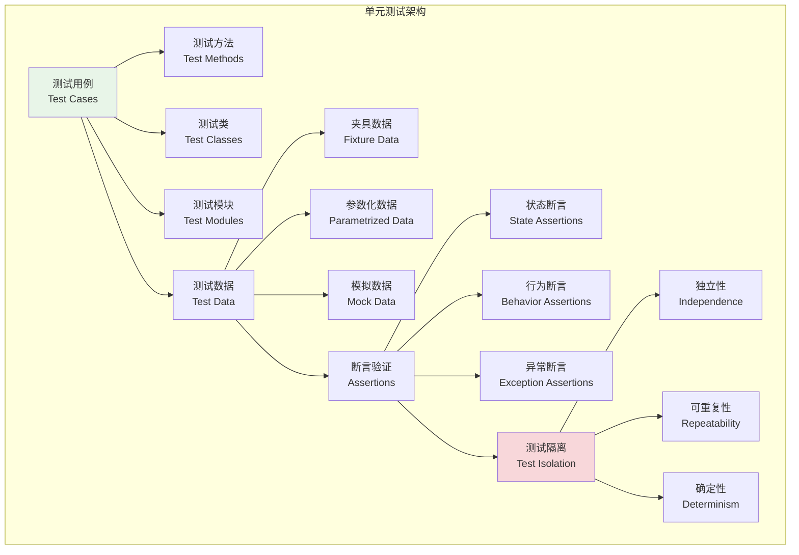
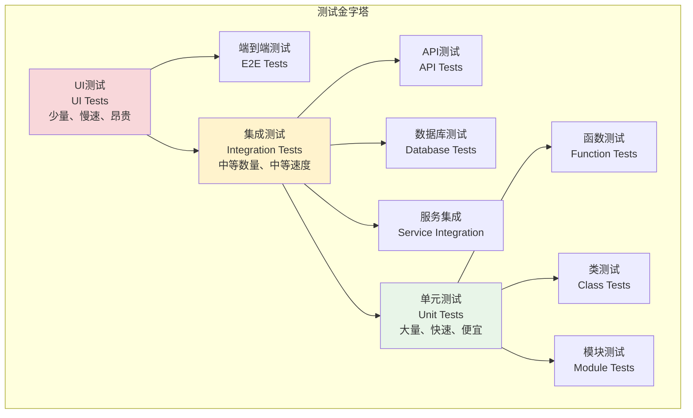

# 单元测试实践

## 🎯 学习目标

通过本章学习，您将能够：
- 理解单元测试的核心概念和设计原则
- 掌握pytest框架的单元测试编写技巧
- 学会为Chat-Room项目编写高质量的单元测试
- 实现测试覆盖率分析和质量度量

## 🧪 单元测试设计

### 单元测试架构



### 测试金字塔



## 🔧 单元测试实现

### Chat-Room单元测试示例

```python
# tests/unit/test_user_model.py - 用户模型单元测试
import pytest
from datetime import datetime
from unittest.mock import Mock, patch
import hashlib

# 假设的用户模型导入
# from shared.models.user import User, UserManager
# from shared.exceptions import ValidationError, DuplicateUserError

class TestUser:
    """用户模型单元测试"""
    
    def test_user_creation_valid_data(self):
        """测试用户创建 - 有效数据"""
        # 模拟用户类
        class User:
            def __init__(self, username, email, password):
                self.username = username
                self.email = email
                self.password_hash = self._hash_password(password)
                self.created_at = datetime.now()
                self.is_active = True
            
            def _hash_password(self, password):
                return hashlib.sha256(password.encode()).hexdigest()
        
        # 测试用户创建
        user = User("testuser", "test@example.com", "password123")
        
        assert user.username == "testuser"
        assert user.email == "test@example.com"
        assert user.password_hash is not None
        assert user.is_active is True
        assert isinstance(user.created_at, datetime)
    
    def test_user_creation_invalid_username(self):
        """测试用户创建 - 无效用户名"""
        class ValidationError(Exception):
            pass
        
        class User:
            def __init__(self, username, email, password):
                if len(username) < 3:
                    raise ValidationError("用户名长度至少3个字符")
                self.username = username
        
        # 测试无效用户名
        with pytest.raises(ValidationError, match="用户名长度至少3个字符"):
            User("ab", "test@example.com", "password123")
    
    def test_user_creation_invalid_email(self):
        """测试用户创建 - 无效邮箱"""
        class ValidationError(Exception):
            pass
        
        class User:
            def __init__(self, username, email, password):
                if "@" not in email:
                    raise ValidationError("邮箱格式无效")
                self.email = email
        
        # 测试无效邮箱
        with pytest.raises(ValidationError, match="邮箱格式无效"):
            User("testuser", "invalid-email", "password123")
    
    def test_password_hashing(self):
        """测试密码哈希"""
        class User:
            def _hash_password(self, password):
                return hashlib.sha256(password.encode()).hexdigest()
            
            def verify_password(self, password):
                return self._hash_password(password) == self.password_hash
            
            def __init__(self, username, email, password):
                self.username = username
                self.email = email
                self.password_hash = self._hash_password(password)
        
        user = User("testuser", "test@example.com", "password123")
        
        # 测试密码验证
        assert user.verify_password("password123") is True
        assert user.verify_password("wrongpassword") is False
        
        # 测试密码哈希不为空
        assert user.password_hash is not None
        assert len(user.password_hash) > 0
    
    @pytest.mark.parametrize("username,email,password,should_raise", [
        ("validuser", "valid@example.com", "validpass123", False),
        ("ab", "valid@example.com", "validpass123", True),  # 用户名太短
        ("validuser", "invalid-email", "validpass123", True),  # 邮箱无效
        ("validuser", "valid@example.com", "123", True),  # 密码太短
        ("", "valid@example.com", "validpass123", True),  # 用户名为空
    ])
    def test_user_validation_parametrized(self, username, email, password, should_raise):
        """参数化测试用户验证"""
        class ValidationError(Exception):
            pass
        
        class User:
            def __init__(self, username, email, password):
                if len(username) < 3:
                    raise ValidationError("用户名长度至少3个字符")
                if "@" not in email:
                    raise ValidationError("邮箱格式无效")
                if len(password) < 6:
                    raise ValidationError("密码长度至少6个字符")
                
                self.username = username
                self.email = email
                self.password = password
        
        if should_raise:
            with pytest.raises(ValidationError):
                User(username, email, password)
        else:
            user = User(username, email, password)
            assert user.username == username
            assert user.email == email

class TestUserManager:
    """用户管理器单元测试"""
    
    def test_create_user_success(self, mock_database):
        """测试创建用户成功"""
        class UserManager:
            def __init__(self, db):
                self.db = db
            
            def create_user(self, username, email, password):
                # 检查用户是否已存在
                existing = self.db.execute(
                    "SELECT id FROM users WHERE username = ? OR email = ?",
                    (username, email)
                ).fetchone()
                
                if existing:
                    raise ValueError("用户已存在")
                
                # 创建用户
                cursor = self.db.execute(
                    "INSERT INTO users (username, email, password_hash) VALUES (?, ?, ?)",
                    (username, email, hashlib.sha256(password.encode()).hexdigest())
                )
                
                return cursor.lastrowid
        
        manager = UserManager(mock_database)
        user_id = manager.create_user("newuser", "new@example.com", "password123")
        
        assert user_id is not None
        assert isinstance(user_id, int)
        
        # 验证用户已插入数据库
        result = mock_database.execute(
            "SELECT username, email FROM users WHERE id = ?",
            (user_id,)
        ).fetchone()
        
        assert result is not None
        assert result[0] == "newuser"
        assert result[1] == "new@example.com"
    
    def test_create_user_duplicate_username(self, populated_database):
        """测试创建用户 - 重复用户名"""
        class UserManager:
            def __init__(self, db):
                self.db = db
            
            def create_user(self, username, email, password):
                existing = self.db.execute(
                    "SELECT id FROM users WHERE username = ?",
                    (username,)
                ).fetchone()
                
                if existing:
                    raise ValueError("用户名已存在")
                
                return True
        
        manager = UserManager(populated_database)
        
        # 尝试创建重复用户名的用户
        with pytest.raises(ValueError, match="用户名已存在"):
            manager.create_user("alice", "newalice@example.com", "password123")
    
    def test_get_user_by_id(self, populated_database):
        """测试根据ID获取用户"""
        class UserManager:
            def __init__(self, db):
                self.db = db
            
            def get_user_by_id(self, user_id):
                result = self.db.execute(
                    "SELECT id, username, email, is_active FROM users WHERE id = ?",
                    (user_id,)
                ).fetchone()
                
                if result:
                    return {
                        "id": result[0],
                        "username": result[1],
                        "email": result[2],
                        "is_active": bool(result[3])
                    }
                return None
        
        manager = UserManager(populated_database)
        
        # 测试获取存在的用户
        user = manager.get_user_by_id(1)
        assert user is not None
        assert user["username"] == "alice"
        assert user["email"] == "alice@example.com"
        assert user["is_active"] is True
        
        # 测试获取不存在的用户
        user = manager.get_user_by_id(999)
        assert user is None
    
    def test_update_user_status(self, populated_database):
        """测试更新用户状态"""
        class UserManager:
            def __init__(self, db):
                self.db = db
            
            def update_user_status(self, user_id, is_active):
                cursor = self.db.execute(
                    "UPDATE users SET is_active = ? WHERE id = ?",
                    (is_active, user_id)
                )
                return cursor.rowcount > 0
        
        manager = UserManager(populated_database)
        
        # 测试更新用户状态
        success = manager.update_user_status(1, False)
        assert success is True
        
        # 验证状态已更新
        result = populated_database.execute(
            "SELECT is_active FROM users WHERE id = 1"
        ).fetchone()
        assert result[0] == 0  # SQLite中False为0
    
    @patch('hashlib.sha256')
    def test_password_hashing_mock(self, mock_sha256):
        """测试密码哈希 - 使用Mock"""
        # 设置Mock返回值
        mock_hash = Mock()
        mock_hash.hexdigest.return_value = "mocked_hash"
        mock_sha256.return_value = mock_hash
        
        class UserManager:
            def hash_password(self, password):
                return hashlib.sha256(password.encode()).hexdigest()
        
        manager = UserManager()
        result = manager.hash_password("test_password")
        
        # 验证Mock被调用
        mock_sha256.assert_called_once_with(b"test_password")
        mock_hash.hexdigest.assert_called_once()
        assert result == "mocked_hash"

# tests/unit/test_message_model.py - 消息模型单元测试
class TestMessage:
    """消息模型单元测试"""
    
    def test_message_creation(self):
        """测试消息创建"""
        class Message:
            def __init__(self, content, user_id, group_id=None, message_type="text"):
                if not content.strip():
                    raise ValueError("消息内容不能为空")
                
                self.content = content
                self.user_id = user_id
                self.group_id = group_id
                self.message_type = message_type
                self.created_at = datetime.now()
        
        message = Message("Hello World", 1, 1)
        
        assert message.content == "Hello World"
        assert message.user_id == 1
        assert message.group_id == 1
        assert message.message_type == "text"
        assert isinstance(message.created_at, datetime)
    
    def test_message_empty_content(self):
        """测试空消息内容"""
        class Message:
            def __init__(self, content, user_id, group_id=None):
                if not content.strip():
                    raise ValueError("消息内容不能为空")
                self.content = content
        
        with pytest.raises(ValueError, match="消息内容不能为空"):
            Message("", 1, 1)
        
        with pytest.raises(ValueError, match="消息内容不能为空"):
            Message("   ", 1, 1)
    
    def test_message_types(self):
        """测试消息类型"""
        class Message:
            VALID_TYPES = ["text", "image", "file", "system"]
            
            def __init__(self, content, user_id, message_type="text"):
                if message_type not in self.VALID_TYPES:
                    raise ValueError(f"无效的消息类型: {message_type}")
                
                self.content = content
                self.user_id = user_id
                self.message_type = message_type
        
        # 测试有效消息类型
        for msg_type in ["text", "image", "file", "system"]:
            message = Message("test content", 1, msg_type)
            assert message.message_type == msg_type
        
        # 测试无效消息类型
        with pytest.raises(ValueError, match="无效的消息类型"):
            Message("test content", 1, "invalid_type")
    
    def test_message_serialization(self):
        """测试消息序列化"""
        class Message:
            def __init__(self, content, user_id, group_id=None):
                self.content = content
                self.user_id = user_id
                self.group_id = group_id
                self.created_at = datetime.now()
            
            def to_dict(self):
                return {
                    "content": self.content,
                    "user_id": self.user_id,
                    "group_id": self.group_id,
                    "created_at": self.created_at.isoformat()
                }
        
        message = Message("Test message", 1, 2)
        data = message.to_dict()
        
        assert data["content"] == "Test message"
        assert data["user_id"] == 1
        assert data["group_id"] == 2
        assert "created_at" in data
        assert isinstance(data["created_at"], str)

class TestMessageManager:
    """消息管理器单元测试"""
    
    def test_send_message(self, populated_database):
        """测试发送消息"""
        class MessageManager:
            def __init__(self, db):
                self.db = db
            
            def send_message(self, content, user_id, group_id=None):
                if not content.strip():
                    raise ValueError("消息内容不能为空")
                
                cursor = self.db.execute(
                    "INSERT INTO messages (content, user_id, group_id) VALUES (?, ?, ?)",
                    (content, user_id, group_id)
                )
                
                return cursor.lastrowid
        
        manager = MessageManager(populated_database)
        message_id = manager.send_message("新消息", 1, 1)
        
        assert message_id is not None
        
        # 验证消息已保存
        result = populated_database.execute(
            "SELECT content, user_id, group_id FROM messages WHERE id = ?",
            (message_id,)
        ).fetchone()
        
        assert result[0] == "新消息"
        assert result[1] == 1
        assert result[2] == 1
    
    def test_get_group_messages(self, populated_database):
        """测试获取群组消息"""
        class MessageManager:
            def __init__(self, db):
                self.db = db
            
            def get_group_messages(self, group_id, limit=50):
                results = self.db.execute(
                    """
                    SELECT m.id, m.content, m.user_id, u.username, m.created_at
                    FROM messages m
                    JOIN users u ON m.user_id = u.id
                    WHERE m.group_id = ?
                    ORDER BY m.created_at DESC
                    LIMIT ?
                    """,
                    (group_id, limit)
                ).fetchall()
                
                return [
                    {
                        "id": row[0],
                        "content": row[1],
                        "user_id": row[2],
                        "username": row[3],
                        "created_at": row[4]
                    }
                    for row in results
                ]
        
        manager = MessageManager(populated_database)
        messages = manager.get_group_messages(1)
        
        assert len(messages) >= 1
        assert all("content" in msg for msg in messages)
        assert all("username" in msg for msg in messages)
    
    def test_delete_message(self, populated_database):
        """测试删除消息"""
        class MessageManager:
            def __init__(self, db):
                self.db = db
            
            def delete_message(self, message_id, user_id):
                # 检查消息是否属于该用户
                result = self.db.execute(
                    "SELECT user_id FROM messages WHERE id = ?",
                    (message_id,)
                ).fetchone()
                
                if not result:
                    raise ValueError("消息不存在")
                
                if result[0] != user_id:
                    raise ValueError("无权删除此消息")
                
                cursor = self.db.execute(
                    "DELETE FROM messages WHERE id = ?",
                    (message_id,)
                )
                
                return cursor.rowcount > 0
        
        manager = MessageManager(populated_database)
        
        # 测试删除自己的消息
        success = manager.delete_message(1, 1)  # 消息1属于用户1
        assert success is True
        
        # 测试删除他人的消息
        with pytest.raises(ValueError, match="无权删除此消息"):
            manager.delete_message(2, 1)  # 消息2属于用户2，用户1无权删除

# 测试运行示例
def demo_unit_testing():
    """单元测试演示"""
    print("=== Chat-Room单元测试演示 ===")
    
    # 这里展示如何运行测试
    test_commands = [
        "pytest tests/unit/ -v",  # 运行所有单元测试
        "pytest tests/unit/test_user_model.py -v",  # 运行特定测试文件
        "pytest tests/unit/ -k test_user_creation -v",  # 运行匹配的测试
        "pytest tests/unit/ --cov=shared --cov-report=html",  # 生成覆盖率报告
        "pytest tests/unit/ -m unit",  # 运行标记为unit的测试
    ]
    
    print("常用测试命令:")
    for cmd in test_commands:
        print(f"  {cmd}")
    
    print("\n测试文件组织:")
    print("  tests/unit/test_user_model.py - 用户模型测试")
    print("  tests/unit/test_message_model.py - 消息模型测试")
    print("  tests/unit/test_group_model.py - 群组模型测试")
    print("  tests/unit/test_utils.py - 工具函数测试")

if __name__ == "__main__":
    demo_unit_testing()
```

Now let me create the integration testing document:


<function_calls>
<invoke name="save-file">
<parameter name="instructions_reminder">LIMIT THE FILE CONTENT TO AT MOST 300 LINES. IF MORE CONTENT NEEDS TO BE ADDED USE THE str-replace-editor TOOL TO EDIT THE FILE AFTER IT HAS BEEN CREATED.
