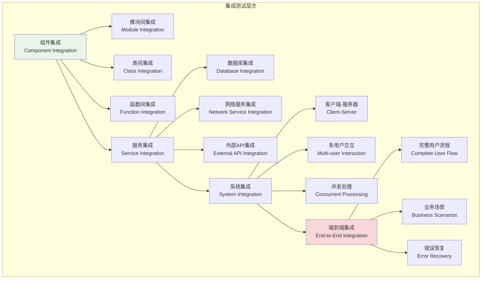
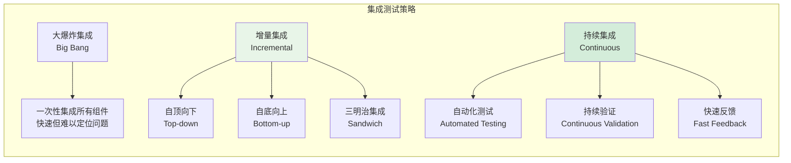

# 集成测试实践

## 🎯 学习目标

通过本章学习，您将能够：
- 理解集成测试的核心概念和设计策略
- 掌握多组件协作的测试方法和技巧
- 学会为Chat-Room项目设计完整的集成测试
- 实现端到端的功能验证和性能测试

## 🔗 集成测试架构

### 集成测试层次



### 集成测试策略



## 🔧 集成测试实现

### Chat-Room集成测试示例

```python
# tests/integration/test_server_client_integration.py - 服务器客户端集成测试
import pytest
import asyncio
import json
import websockets
from unittest.mock import AsyncMock, patch
import threading
import time
from concurrent.futures import ThreadPoolExecutor

class TestServerClientIntegration:
    """服务器客户端集成测试"""
    
    @pytest.mark.asyncio
    async def test_client_server_connection(self, test_config):
        """测试客户端服务器连接"""
        # 模拟简单的WebSocket服务器
        class MockChatServer:
            def __init__(self, host, port):
                self.host = host
                self.port = port
                self.clients = set()
                self.running = False
            
            async def handle_client(self, websocket, path):
                """处理客户端连接"""
                self.clients.add(websocket)
                try:
                    async for message in websocket:
                        data = json.loads(message)
                        
                        # 回显消息给所有客户端
                        response = {
                            "type": "message",
                            "data": {
                                "content": data.get("content", ""),
                                "user": data.get("user", "unknown"),
                                "timestamp": time.time()
                            }
                        }
                        
                        # 广播给所有客户端
                        for client in self.clients.copy():
                            try:
                                await client.send(json.dumps(response))
                            except:
                                self.clients.discard(client)
                
                except websockets.exceptions.ConnectionClosed:
                    pass
                finally:
                    self.clients.discard(websocket)
            
            async def start(self):
                """启动服务器"""
                self.running = True
                return await websockets.serve(
                    self.handle_client,
                    self.host,
                    self.port
                )
        
        # 模拟客户端
        class MockChatClient:
            def __init__(self, host, port):
                self.host = host
                self.port = port
                self.websocket = None
                self.messages = []
            
            async def connect(self):
                """连接到服务器"""
                uri = f"ws://{self.host}:{self.port}"
                self.websocket = await websockets.connect(uri)
            
            async def send_message(self, content, user="testuser"):
                """发送消息"""
                message = {
                    "type": "message",
                    "content": content,
                    "user": user
                }
                await self.websocket.send(json.dumps(message))
            
            async def receive_message(self):
                """接收消息"""
                message = await self.websocket.recv()
                data = json.loads(message)
                self.messages.append(data)
                return data
            
            async def disconnect(self):
                """断开连接"""
                if self.websocket:
                    await self.websocket.close()
        
        # 启动服务器
        server = MockChatServer("127.0.0.1", 0)  # 使用随机端口
        server_instance = await server.start()
        
        # 获取实际端口
        actual_port = server_instance.sockets[0].getsockname()[1]
        
        try:
            # 创建客户端并连接
            client1 = MockChatClient("127.0.0.1", actual_port)
            client2 = MockChatClient("127.0.0.1", actual_port)
            
            await client1.connect()
            await client2.connect()
            
            # 客户端1发送消息
            await client1.send_message("Hello from client1", "user1")
            
            # 两个客户端都应该收到消息
            msg1 = await client1.receive_message()
            msg2 = await client2.receive_message()
            
            # 验证消息内容
            assert msg1["type"] == "message"
            assert msg1["data"]["content"] == "Hello from client1"
            assert msg1["data"]["user"] == "user1"
            
            assert msg2["type"] == "message"
            assert msg2["data"]["content"] == "Hello from client1"
            assert msg2["data"]["user"] == "user1"
            
            # 客户端2发送消息
            await client2.send_message("Hello from client2", "user2")
            
            # 验证广播功能
            msg1 = await client1.receive_message()
            msg2 = await client2.receive_message()
            
            assert msg1["data"]["content"] == "Hello from client2"
            assert msg2["data"]["content"] == "Hello from client2"
            
            # 断开连接
            await client1.disconnect()
            await client2.disconnect()
            
        finally:
            # 关闭服务器
            server_instance.close()
            await server_instance.wait_closed()
    
    @pytest.mark.asyncio
    async def test_multiple_clients_concurrent_messages(self):
        """测试多客户端并发消息"""
        # 模拟并发消息处理
        class ConcurrentMessageHandler:
            def __init__(self):
                self.messages = []
                self.lock = asyncio.Lock()
            
            async def handle_message(self, client_id, message):
                """处理消息"""
                async with self.lock:
                    self.messages.append({
                        "client_id": client_id,
                        "message": message,
                        "timestamp": time.time()
                    })
                
                # 模拟处理延迟
                await asyncio.sleep(0.01)
                
                return f"Processed: {message} from client {client_id}"
        
        handler = ConcurrentMessageHandler()
        
        # 创建多个并发任务
        async def send_messages(client_id, message_count):
            """发送多条消息"""
            results = []
            for i in range(message_count):
                message = f"Message {i} from client {client_id}"
                result = await handler.handle_message(client_id, message)
                results.append(result)
            return results
        
        # 并发执行
        tasks = [
            send_messages(1, 5),
            send_messages(2, 5),
            send_messages(3, 5)
        ]
        
        results = await asyncio.gather(*tasks)
        
        # 验证结果
        assert len(results) == 3
        assert len(handler.messages) == 15  # 3个客户端 × 5条消息
        
        # 验证消息顺序和完整性
        client_messages = {}
        for msg in handler.messages:
            client_id = msg["client_id"]
            if client_id not in client_messages:
                client_messages[client_id] = []
            client_messages[client_id].append(msg)
        
        # 每个客户端应该有5条消息
        for client_id in [1, 2, 3]:
            assert len(client_messages[client_id]) == 5

class TestDatabaseIntegration:
    """数据库集成测试"""
    
    @pytest.mark.database
    def test_user_group_message_integration(self, populated_database):
        """测试用户-群组-消息集成"""
        # 模拟完整的业务流程
        class ChatService:
            def __init__(self, db):
                self.db = db
            
            def create_user_and_join_group(self, username, email, password, group_id):
                """创建用户并加入群组"""
                # 创建用户
                cursor = self.db.execute(
                    "INSERT INTO users (username, email, password_hash) VALUES (?, ?, ?)",
                    (username, email, password)
                )
                user_id = cursor.lastrowid
                
                # 加入群组
                self.db.execute(
                    "INSERT INTO group_members (group_id, user_id, role) VALUES (?, ?, ?)",
                    (group_id, user_id, "member")
                )
                
                self.db.commit()
                return user_id
            
            def send_message_to_group(self, user_id, group_id, content):
                """发送消息到群组"""
                # 检查用户是否在群组中
                result = self.db.execute(
                    "SELECT 1 FROM group_members WHERE group_id = ? AND user_id = ?",
                    (group_id, user_id)
                ).fetchone()
                
                if not result:
                    raise ValueError("用户不在群组中")
                
                # 发送消息
                cursor = self.db.execute(
                    "INSERT INTO messages (content, user_id, group_id) VALUES (?, ?, ?)",
                    (content, user_id, group_id)
                )
                
                self.db.commit()
                return cursor.lastrowid
            
            def get_group_conversation(self, group_id):
                """获取群组对话"""
                results = self.db.execute(
                    """
                    SELECT m.content, u.username, m.created_at
                    FROM messages m
                    JOIN users u ON m.user_id = u.id
                    WHERE m.group_id = ?
                    ORDER BY m.created_at
                    """,
                    (group_id,)
                ).fetchall()
                
                return [
                    {
                        "content": row[0],
                        "username": row[1],
                        "created_at": row[2]
                    }
                    for row in results
                ]
        
        service = ChatService(populated_database)
        
        # 创建新用户并加入群组
        user_id = service.create_user_and_join_group(
            "newuser", "new@example.com", "password", 1
        )
        
        # 发送消息
        message_id = service.send_message_to_group(user_id, 1, "Hello everyone!")
        
        # 获取对话历史
        conversation = service.get_group_conversation(1)
        
        # 验证集成结果
        assert user_id is not None
        assert message_id is not None
        assert len(conversation) >= 1
        
        # 验证新消息在对话中
        new_messages = [msg for msg in conversation if msg["username"] == "newuser"]
        assert len(new_messages) == 1
        assert new_messages[0]["content"] == "Hello everyone!"
    
    @pytest.mark.database
    def test_group_member_management_integration(self, populated_database):
        """测试群组成员管理集成"""
        class GroupService:
            def __init__(self, db):
                self.db = db
            
            def add_member_to_group(self, group_id, user_id, role="member"):
                """添加成员到群组"""
                # 检查用户是否已在群组中
                existing = self.db.execute(
                    "SELECT 1 FROM group_members WHERE group_id = ? AND user_id = ?",
                    (group_id, user_id)
                ).fetchone()
                
                if existing:
                    raise ValueError("用户已在群组中")
                
                self.db.execute(
                    "INSERT INTO group_members (group_id, user_id, role) VALUES (?, ?, ?)",
                    (group_id, user_id, role)
                )
                self.db.commit()
            
            def remove_member_from_group(self, group_id, user_id):
                """从群组移除成员"""
                cursor = self.db.execute(
                    "DELETE FROM group_members WHERE group_id = ? AND user_id = ?",
                    (group_id, user_id)
                )
                
                if cursor.rowcount == 0:
                    raise ValueError("用户不在群组中")
                
                self.db.commit()
            
            def get_group_members(self, group_id):
                """获取群组成员"""
                results = self.db.execute(
                    """
                    SELECT u.id, u.username, gm.role, gm.joined_at
                    FROM group_members gm
                    JOIN users u ON gm.user_id = u.id
                    WHERE gm.group_id = ?
                    ORDER BY gm.joined_at
                    """,
                    (group_id,)
                ).fetchall()
                
                return [
                    {
                        "user_id": row[0],
                        "username": row[1],
                        "role": row[2],
                        "joined_at": row[3]
                    }
                    for row in results
                ]
        
        service = GroupService(populated_database)
        
        # 获取初始成员列表
        initial_members = service.get_group_members(1)
        initial_count = len(initial_members)
        
        # 添加新成员
        service.add_member_to_group(1, 3, "member")  # 添加charlie到群组1
        
        # 验证成员已添加
        members = service.get_group_members(1)
        assert len(members) == initial_count + 1
        
        charlie_member = next((m for m in members if m["username"] == "charlie"), None)
        assert charlie_member is not None
        assert charlie_member["role"] == "member"
        
        # 移除成员
        service.remove_member_from_group(1, 3)
        
        # 验证成员已移除
        members = service.get_group_members(1)
        assert len(members) == initial_count
        
        charlie_member = next((m for m in members if m["username"] == "charlie"), None)
        assert charlie_member is None

class TestNetworkIntegration:
    """网络集成测试"""
    
    @pytest.mark.asyncio
    @pytest.mark.network
    async def test_websocket_message_flow(self):
        """测试WebSocket消息流"""
        # 模拟WebSocket消息处理流程
        class WebSocketMessageFlow:
            def __init__(self):
                self.message_queue = asyncio.Queue()
                self.subscribers = set()
            
            async def handle_incoming_message(self, websocket, message):
                """处理传入消息"""
                try:
                    data = json.loads(message)
                    
                    # 验证消息格式
                    if "type" not in data or "content" not in data:
                        await websocket.send(json.dumps({
                            "type": "error",
                            "message": "消息格式无效"
                        }))
                        return
                    
                    # 处理不同类型的消息
                    if data["type"] == "chat":
                        await self._handle_chat_message(websocket, data)
                    elif data["type"] == "join":
                        await self._handle_join_message(websocket, data)
                    elif data["type"] == "leave":
                        await self._handle_leave_message(websocket, data)
                    
                except json.JSONDecodeError:
                    await websocket.send(json.dumps({
                        "type": "error",
                        "message": "JSON格式错误"
                    }))
            
            async def _handle_chat_message(self, websocket, data):
                """处理聊天消息"""
                # 广播消息给所有订阅者
                broadcast_data = {
                    "type": "message",
                    "content": data["content"],
                    "user": data.get("user", "anonymous"),
                    "timestamp": time.time()
                }
                
                await self._broadcast(json.dumps(broadcast_data))
            
            async def _handle_join_message(self, websocket, data):
                """处理加入消息"""
                self.subscribers.add(websocket)
                
                join_data = {
                    "type": "user_joined",
                    "user": data.get("user", "anonymous"),
                    "timestamp": time.time()
                }
                
                await self._broadcast(json.dumps(join_data))
            
            async def _handle_leave_message(self, websocket, data):
                """处理离开消息"""
                self.subscribers.discard(websocket)
                
                leave_data = {
                    "type": "user_left",
                    "user": data.get("user", "anonymous"),
                    "timestamp": time.time()
                }
                
                await self._broadcast(json.dumps(leave_data))
            
            async def _broadcast(self, message):
                """广播消息"""
                for subscriber in self.subscribers.copy():
                    try:
                        await subscriber.send(message)
                    except:
                        self.subscribers.discard(subscriber)
        
        # 测试消息流
        flow = WebSocketMessageFlow()
        
        # 模拟WebSocket连接
        class MockWebSocket:
            def __init__(self):
                self.sent_messages = []
            
            async def send(self, message):
                self.sent_messages.append(message)
        
        ws1 = MockWebSocket()
        ws2 = MockWebSocket()
        
        # 测试加入流程
        await flow.handle_incoming_message(ws1, json.dumps({
            "type": "join",
            "user": "user1"
        }))
        
        await flow.handle_incoming_message(ws2, json.dumps({
            "type": "join",
            "user": "user2"
        }))
        
        # 验证加入消息
        assert len(ws1.sent_messages) >= 1
        assert len(ws2.sent_messages) >= 1
        
        # 测试聊天消息
        await flow.handle_incoming_message(ws1, json.dumps({
            "type": "chat",
            "content": "Hello everyone!",
            "user": "user1"
        }))
        
        # 验证消息广播
        assert len(ws1.sent_messages) >= 2
        assert len(ws2.sent_messages) >= 2
        
        # 验证消息内容
        last_message = json.loads(ws2.sent_messages[-1])
        assert last_message["type"] == "message"
        assert last_message["content"] == "Hello everyone!"
        assert last_message["user"] == "user1"

# 测试运行示例
def demo_integration_testing():
    """集成测试演示"""
    print("=== Chat-Room集成测试演示 ===")
    
    test_commands = [
        "pytest tests/integration/ -v",  # 运行所有集成测试
        "pytest tests/integration/ -m database",  # 运行数据库集成测试
        "pytest tests/integration/ -m network",  # 运行网络集成测试
        "pytest tests/integration/ --tb=short",  # 简化错误输出
        "pytest tests/integration/ -x",  # 第一个失败后停止
    ]
    
    print("集成测试命令:")
    for cmd in test_commands:
        print(f"  {cmd}")
    
    print("\n集成测试类型:")
    print("  - 服务器客户端集成测试")
    print("  - 数据库集成测试")
    print("  - 网络通信集成测试")
    print("  - 多组件协作测试")
    print("  - 并发处理测试")

if __name__ == "__main__":
    demo_integration_testing()
```

Now let me create the test coverage document:


<function_calls>
<invoke name="save-file">
<parameter name="instructions_reminder">LIMIT THE FILE CONTENT TO AT MOST 300 LINES. IF MORE CONTENT NEEDS TO BE ADDED USE THE str-replace-editor TOOL TO EDIT THE FILE AFTER IT HAS BEEN CREATED.
