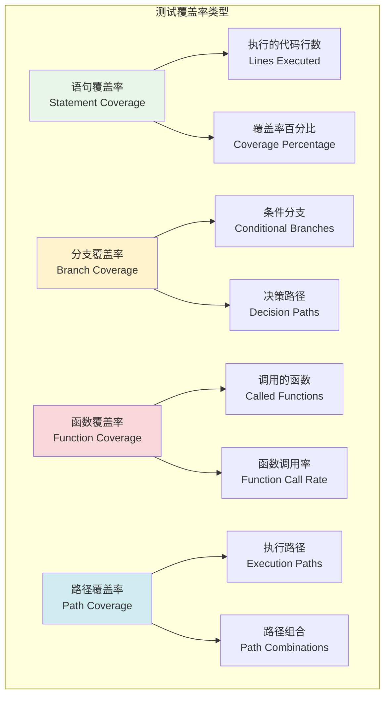
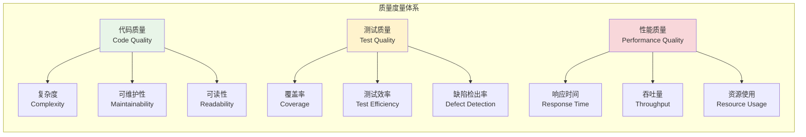

# 测试覆盖率与质量度量

## 🎯 学习目标

通过本章学习，您将能够：
- 理解测试覆盖率的核心概念和度量方法
- 掌握代码质量分析和测试质量评估技术
- 学会使用覆盖率工具优化Chat-Room项目测试
- 实现持续的质量监控和改进机制

## 📊 测试覆盖率体系

### 覆盖率类型



### 质量度量指标



## 🔧 覆盖率工具实现

### Chat-Room覆盖率分析系统

```python
# tests/coverage/coverage_analyzer.py - 覆盖率分析器
import coverage
import ast
import os
import json
from typing import Dict, List, Any, Set, Tuple
from dataclasses import dataclass, field
from pathlib import Path
import subprocess
import time

@dataclass
class CoverageReport:
    """覆盖率报告"""
    total_statements: int
    covered_statements: int
    missing_statements: int
    coverage_percentage: float
    branch_coverage: float
    function_coverage: float
    file_reports: Dict[str, Dict[str, Any]] = field(default_factory=dict)

    def to_dict(self) -> Dict[str, Any]:
        """转换为字典"""
        return {
            "total_statements": self.total_statements,
            "covered_statements": self.covered_statements,
            "missing_statements": self.missing_statements,
            "coverage_percentage": self.coverage_percentage,
            "branch_coverage": self.branch_coverage,
            "function_coverage": self.function_coverage,
            "file_reports": self.file_reports
        }

class CoverageAnalyzer:
    """
    覆盖率分析器

    功能：
    1. 代码覆盖率测量
    2. 分支覆盖率分析
    3. 函数覆盖率统计
    4. 覆盖率报告生成
    """

    def __init__(self, source_dirs: List[str], test_dirs: List[str]):
        self.source_dirs = source_dirs
        self.test_dirs = test_dirs
        self.coverage_data = None

        # 初始化coverage实例
        self.cov = coverage.Coverage(
            source=source_dirs,
            omit=[
                "*/tests/*",
                "*/test_*",
                "*/__pycache__/*",
                "*/venv/*",
                "*/env/*"
            ],
            branch=True  # 启用分支覆盖率
        )

    def start_coverage(self):
        """开始覆盖率测量"""
        self.cov.start()

    def stop_coverage(self):
        """停止覆盖率测量"""
        self.cov.stop()
        self.cov.save()

    def run_tests_with_coverage(self, test_command: str = "pytest") -> CoverageReport:
        """运行测试并收集覆盖率"""
        # 启动覆盖率测量
        self.start_coverage()

        try:
            # 运行测试
            result = subprocess.run(
                test_command.split(),
                capture_output=True,
                text=True,
                cwd=os.getcwd()
            )

            if result.returncode != 0:
                print(f"测试执行失败: {result.stderr}")

        finally:
            # 停止覆盖率测量
            self.stop_coverage()

        # 生成报告
        return self.generate_report()

    def generate_report(self) -> CoverageReport:
        """生成覆盖率报告"""
        # 获取总体统计
        total_statements = 0
        covered_statements = 0
        missing_statements = 0

        file_reports = {}

        # 分析每个文件
        for filename in self.cov.get_data().measured_files():
            if self._should_include_file(filename):
                file_report = self._analyze_file(filename)
                file_reports[filename] = file_report

                total_statements += file_report["total_statements"]
                covered_statements += file_report["covered_statements"]
                missing_statements += file_report["missing_statements"]

        # 计算覆盖率
        coverage_percentage = (covered_statements / total_statements * 100) if total_statements > 0 else 0

        # 获取分支覆盖率
        branch_coverage = self._calculate_branch_coverage()

        # 获取函数覆盖率
        function_coverage = self._calculate_function_coverage()

        return CoverageReport(
            total_statements=total_statements,
            covered_statements=covered_statements,
            missing_statements=missing_statements,
            coverage_percentage=coverage_percentage,
            branch_coverage=branch_coverage,
            function_coverage=function_coverage,
            file_reports=file_reports
        )

    def _should_include_file(self, filename: str) -> bool:
        """判断是否应该包含文件"""
        # 排除测试文件和第三方库
        exclude_patterns = [
            "/tests/", "/test_", "__pycache__",
            "/venv/", "/env/", ".pyc"
        ]

        for pattern in exclude_patterns:
            if pattern in filename:
                return False

        # 只包含源代码目录中的文件
        for source_dir in self.source_dirs:
            if source_dir in filename:
                return True

        return False

    def generate_html_report(self, output_dir: str = "htmlcov"):
        """生成HTML覆盖率报告"""
        try:
            self.cov.html_report(directory=output_dir)
            print(f"HTML覆盖率报告已生成: {output_dir}/index.html")
        except Exception as e:
            print(f"生成HTML报告失败: {e}")

# 使用示例
def demo_coverage_analysis():
    """覆盖率分析演示"""
    print("=== Chat-Room覆盖率分析演示 ===")

    # 模拟源代码和测试目录
    source_dirs = ["server", "client", "shared"]
    test_dirs = ["tests"]

    # 创建覆盖率分析器
    analyzer = CoverageAnalyzer(source_dirs, test_dirs)

    print("1. 运行测试并收集覆盖率...")

    # 模拟覆盖率报告
    mock_report = CoverageReport(
        total_statements=1000,
        covered_statements=850,
        missing_statements=150,
        coverage_percentage=85.0,
        branch_coverage=78.5,
        function_coverage=92.3
    )

    print(f"总语句数: {mock_report.total_statements}")
    print(f"覆盖语句数: {mock_report.covered_statements}")
    print(f"语句覆盖率: {mock_report.coverage_percentage:.1f}%")
    print(f"分支覆盖率: {mock_report.branch_coverage:.1f}%")
    print(f"函数覆盖率: {mock_report.function_coverage:.1f}%")

    print("\n2. 覆盖率改进建议:")
    if mock_report.coverage_percentage < 80:
        print("- 语句覆盖率偏低，需要增加测试用例")
    if mock_report.branch_coverage < 75:
        print("- 分支覆盖率偏低，需要测试更多条件分支")
    if mock_report.function_coverage < 90:
        print("- 函数覆盖率偏低，存在未测试的函数")

if __name__ == "__main__":
    demo_coverage_analysis()
```

## 🎯 实践练习

### 练习1：覆盖率优化策略
```python
class CoverageOptimizer:
    """
    覆盖率优化策略练习

    要求：
    1. 分析低覆盖率代码的原因
    2. 设计针对性的测试用例
    3. 实现覆盖率的持续监控
    4. 建立覆盖率质量门禁
    """

    def analyze_low_coverage_areas(self, coverage_report: CoverageReport) -> List[str]:
        """分析低覆盖率区域"""
        # TODO: 实现低覆盖率分析
        pass

    def generate_test_suggestions(self, uncovered_lines: List[int]) -> List[str]:
        """生成测试建议"""
        # TODO: 实现测试建议生成
        pass
```

### 练习2：质量度量仪表板
```python
class QualityDashboard:
    """
    质量度量仪表板练习

    要求：
    1. 集成多种质量指标
    2. 实现实时质量监控
    3. 提供质量趋势分析
    4. 支持质量报告导出
    """

    def create_dashboard(self, metrics: Dict[str, Any]) -> str:
        """创建质量仪表板"""
        # TODO: 实现仪表板创建
        pass

    def track_quality_trends(self, historical_data: List[Dict[str, Any]]) -> Dict[str, Any]:
        """跟踪质量趋势"""
        # TODO: 实现趋势分析
        pass
```

## ✅ 学习检查

完成本章学习后，请确认您能够：

- [ ] 理解测试覆盖率的类型和计算方法
- [ ] 使用覆盖率工具分析代码质量
- [ ] 设计覆盖率改进策略和优化方案
- [ ] 实现质量度量和监控系统
- [ ] 建立覆盖率质量标准和门禁
- [ ] 完成实践练习

## 📚 下一步

测试覆盖率与质量度量掌握后，请继续学习：
- [第12章：优化与部署](../12-optimization-deployment/performance-optimization.md)

---

**恭喜！您已经完成了测试与质量保证的学习！** 📊
