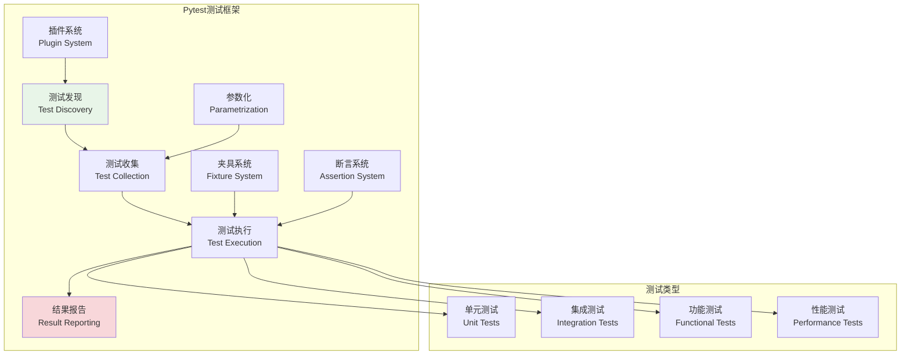
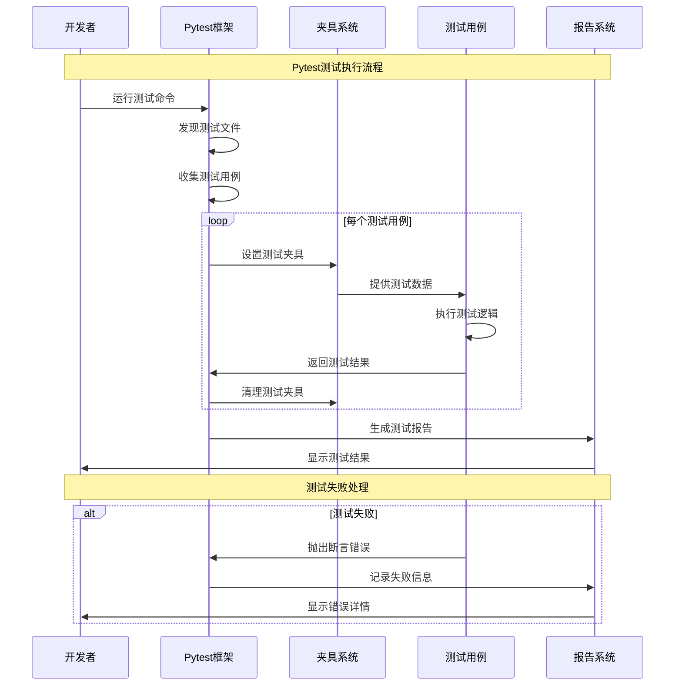

# Pytest测试框架

## 🎯 学习目标

通过本章学习，您将能够：
- 理解现代Python测试框架的设计理念和最佳实践
- 掌握pytest框架的核心特性和高级用法
- 学会为Chat-Room项目设计完整的测试体系
- 实现测试驱动开发（TDD）的工作流程

## 🧪 Pytest框架概览

### 测试框架架构



### 测试执行流程



## 🔧 Pytest框架实现

### Chat-Room测试框架搭建

```python
# tests/conftest.py - Pytest配置和夹具
import pytest
import asyncio
import tempfile
import shutil
from pathlib import Path
from typing import Dict, List, Any, AsyncGenerator, Generator
from unittest.mock import Mock, AsyncMock, patch
import json
import sqlite3
from datetime import datetime

# 导入Chat-Room模块（假设的导入路径）
# from server.core.server import ChatServer
# from client.core.client import ChatClient
# from shared.models import User, Message, Group
# from shared.config import Config

@pytest.fixture(scope="session")
def event_loop():
    """创建事件循环夹具"""
    loop = asyncio.new_event_loop()
    yield loop
    loop.close()

@pytest.fixture
def temp_dir():
    """临时目录夹具"""
    temp_path = tempfile.mkdtemp()
    yield Path(temp_path)
    shutil.rmtree(temp_path)

@pytest.fixture
def test_config(temp_dir):
    """测试配置夹具"""
    config_data = {
        "server": {
            "host": "127.0.0.1",
            "port": 0,  # 使用随机端口
            "max_connections": 10
        },
        "database": {
            "url": f"sqlite:///{temp_dir}/test.db",
            "echo": False
        },
        "logging": {
            "level": "DEBUG",
            "file": str(temp_dir / "test.log")
        },
        "ai": {
            "enabled": False,  # 测试时禁用AI
            "api_key": "test_key"
        }
    }
    
    config_file = temp_dir / "test_config.json"
    with open(config_file, 'w') as f:
        json.dump(config_data, f)
    
    # 模拟配置类
    class TestConfig:
        def __init__(self, data):
            for key, value in data.items():
                if isinstance(value, dict):
                    setattr(self, key, TestConfig(value))
                else:
                    setattr(self, key, value)
    
    return TestConfig(config_data)

@pytest.fixture
async def test_database(test_config):
    """测试数据库夹具"""
    # 创建内存数据库
    db_path = ":memory:"
    conn = sqlite3.connect(db_path)
    
    # 创建测试表
    conn.executescript("""
        CREATE TABLE users (
            id INTEGER PRIMARY KEY,
            username TEXT UNIQUE NOT NULL,
            email TEXT UNIQUE NOT NULL,
            password_hash TEXT NOT NULL,
            created_at TIMESTAMP DEFAULT CURRENT_TIMESTAMP,
            is_active BOOLEAN DEFAULT TRUE
        );
        
        CREATE TABLE groups (
            id INTEGER PRIMARY KEY,
            name TEXT NOT NULL,
            description TEXT,
            created_by INTEGER,
            created_at TIMESTAMP DEFAULT CURRENT_TIMESTAMP,
            is_active BOOLEAN DEFAULT TRUE,
            FOREIGN KEY (created_by) REFERENCES users (id)
        );
        
        CREATE TABLE messages (
            id INTEGER PRIMARY KEY,
            content TEXT NOT NULL,
            user_id INTEGER NOT NULL,
            group_id INTEGER,
            message_type TEXT DEFAULT 'text',
            created_at TIMESTAMP DEFAULT CURRENT_TIMESTAMP,
            FOREIGN KEY (user_id) REFERENCES users (id),
            FOREIGN KEY (group_id) REFERENCES groups (id)
        );
        
        CREATE TABLE group_members (
            group_id INTEGER,
            user_id INTEGER,
            joined_at TIMESTAMP DEFAULT CURRENT_TIMESTAMP,
            role TEXT DEFAULT 'member',
            PRIMARY KEY (group_id, user_id),
            FOREIGN KEY (group_id) REFERENCES groups (id),
            FOREIGN KEY (user_id) REFERENCES users (id)
        );
    """)
    
    yield conn
    conn.close()

@pytest.fixture
def sample_users():
    """示例用户数据夹具"""
    return [
        {
            "id": 1,
            "username": "alice",
            "email": "alice@example.com",
            "password_hash": "hashed_password_1",
            "is_active": True
        },
        {
            "id": 2,
            "username": "bob",
            "email": "bob@example.com",
            "password_hash": "hashed_password_2",
            "is_active": True
        },
        {
            "id": 3,
            "username": "charlie",
            "email": "charlie@example.com",
            "password_hash": "hashed_password_3",
            "is_active": False
        }
    ]

@pytest.fixture
def sample_groups():
    """示例群组数据夹具"""
    return [
        {
            "id": 1,
            "name": "技术讨论",
            "description": "技术相关话题讨论",
            "created_by": 1,
            "is_active": True
        },
        {
            "id": 2,
            "name": "随便聊聊",
            "description": "日常闲聊",
            "created_by": 2,
            "is_active": True
        }
    ]

@pytest.fixture
def sample_messages():
    """示例消息数据夹具"""
    return [
        {
            "id": 1,
            "content": "大家好！",
            "user_id": 1,
            "group_id": 1,
            "message_type": "text"
        },
        {
            "id": 2,
            "content": "Hello everyone!",
            "user_id": 2,
            "group_id": 1,
            "message_type": "text"
        },
        {
            "id": 3,
            "content": "今天天气不错",
            "user_id": 1,
            "group_id": 2,
            "message_type": "text"
        }
    ]

@pytest.fixture
async def populated_database(test_database, sample_users, sample_groups, sample_messages):
    """填充数据的测试数据库夹具"""
    conn = test_database
    
    # 插入用户数据
    for user in sample_users:
        conn.execute(
            "INSERT INTO users (id, username, email, password_hash, is_active) VALUES (?, ?, ?, ?, ?)",
            (user["id"], user["username"], user["email"], user["password_hash"], user["is_active"])
        )
    
    # 插入群组数据
    for group in sample_groups:
        conn.execute(
            "INSERT INTO groups (id, name, description, created_by, is_active) VALUES (?, ?, ?, ?, ?)",
            (group["id"], group["name"], group["description"], group["created_by"], group["is_active"])
        )
    
    # 插入消息数据
    for message in sample_messages:
        conn.execute(
            "INSERT INTO messages (id, content, user_id, group_id, message_type) VALUES (?, ?, ?, ?, ?)",
            (message["id"], message["content"], message["user_id"], message["group_id"], message["message_type"])
        )
    
    # 插入群组成员关系
    group_members = [
        (1, 1, "admin"),  # alice是技术讨论群管理员
        (1, 2, "member"), # bob是技术讨论群成员
        (2, 1, "member"), # alice是随便聊聊群成员
        (2, 2, "admin"),  # bob是随便聊聊群管理员
    ]
    
    for group_id, user_id, role in group_members:
        conn.execute(
            "INSERT INTO group_members (group_id, user_id, role) VALUES (?, ?, ?)",
            (group_id, user_id, role)
        )
    
    conn.commit()
    yield conn

@pytest.fixture
def mock_websocket():
    """模拟WebSocket连接夹具"""
    mock_ws = AsyncMock()
    mock_ws.send = AsyncMock()
    mock_ws.recv = AsyncMock()
    mock_ws.close = AsyncMock()
    mock_ws.closed = False
    
    return mock_ws

@pytest.fixture
def mock_chat_server(test_config):
    """模拟聊天服务器夹具"""
    mock_server = Mock()
    mock_server.config = test_config
    mock_server.clients = {}
    mock_server.groups = {}
    mock_server.running = False
    
    # 模拟异步方法
    mock_server.start = AsyncMock()
    mock_server.stop = AsyncMock()
    mock_server.handle_client = AsyncMock()
    mock_server.broadcast_message = AsyncMock()
    mock_server.add_client = AsyncMock()
    mock_server.remove_client = AsyncMock()
    
    return mock_server

@pytest.fixture
def mock_chat_client(test_config):
    """模拟聊天客户端夹具"""
    mock_client = Mock()
    mock_client.config = test_config
    mock_client.connected = False
    mock_client.user_id = None
    mock_client.username = None
    
    # 模拟异步方法
    mock_client.connect = AsyncMock()
    mock_client.disconnect = AsyncMock()
    mock_client.send_message = AsyncMock()
    mock_client.login = AsyncMock()
    mock_client.join_group = AsyncMock()
    mock_client.leave_group = AsyncMock()
    
    return mock_client

class MockAIService:
    """模拟AI服务"""
    
    def __init__(self):
        self.enabled = False
        self.responses = {
            "hello": "Hello! How can I help you?",
            "help": "I'm here to assist you with your questions.",
            "default": "I understand your message."
        }
    
    async def generate_response(self, message: str, context: Dict[str, Any] = None) -> str:
        """生成AI响应"""
        message_lower = message.lower()
        
        for keyword, response in self.responses.items():
            if keyword in message_lower:
                return response
        
        return self.responses["default"]
    
    def set_response(self, keyword: str, response: str):
        """设置特定关键词的响应"""
        self.responses[keyword] = response

@pytest.fixture
def mock_ai_service():
    """模拟AI服务夹具"""
    return MockAIService()

# 测试标记定义
pytest_plugins = []

def pytest_configure(config):
    """Pytest配置"""
    config.addinivalue_line("markers", "unit: 单元测试")
    config.addinivalue_line("markers", "integration: 集成测试")
    config.addinivalue_line("markers", "functional: 功能测试")
    config.addinivalue_line("markers", "performance: 性能测试")
    config.addinivalue_line("markers", "slow: 慢速测试")
    config.addinivalue_line("markers", "network: 需要网络的测试")
    config.addinivalue_line("markers", "database: 需要数据库的测试")

def pytest_collection_modifyitems(config, items):
    """修改测试收集"""
    for item in items:
        # 为所有异步测试添加asyncio标记
        if asyncio.iscoroutinefunction(item.function):
            item.add_marker(pytest.mark.asyncio)
        
        # 根据测试文件路径添加标记
        if "unit" in str(item.fspath):
            item.add_marker(pytest.mark.unit)
        elif "integration" in str(item.fspath):
            item.add_marker(pytest.mark.integration)
        elif "functional" in str(item.fspath):
            item.add_marker(pytest.mark.functional)
        elif "performance" in str(item.fspath):
            item.add_marker(pytest.mark.performance)

# 自定义断言助手
class ChatRoomAssertions:
    """Chat-Room专用断言助手"""
    
    @staticmethod
    def assert_user_valid(user_data: Dict[str, Any]):
        """断言用户数据有效"""
        required_fields = ["id", "username", "email"]
        for field in required_fields:
            assert field in user_data, f"用户数据缺少必需字段: {field}"
        
        assert isinstance(user_data["id"], int), "用户ID必须是整数"
        assert len(user_data["username"]) >= 3, "用户名长度至少3个字符"
        assert "@" in user_data["email"], "邮箱格式无效"
    
    @staticmethod
    def assert_message_valid(message_data: Dict[str, Any]):
        """断言消息数据有效"""
        required_fields = ["content", "user_id"]
        for field in required_fields:
            assert field in message_data, f"消息数据缺少必需字段: {field}"
        
        assert len(message_data["content"]) > 0, "消息内容不能为空"
        assert isinstance(message_data["user_id"], int), "用户ID必须是整数"
    
    @staticmethod
    def assert_group_valid(group_data: Dict[str, Any]):
        """断言群组数据有效"""
        required_fields = ["name", "created_by"]
        for field in required_fields:
            assert field in group_data, f"群组数据缺少必需字段: {field}"
        
        assert len(group_data["name"]) >= 2, "群组名称长度至少2个字符"
        assert isinstance(group_data["created_by"], int), "创建者ID必须是整数"
    
    @staticmethod
    def assert_websocket_message_valid(ws_message: Dict[str, Any]):
        """断言WebSocket消息有效"""
        required_fields = ["type", "data"]
        for field in required_fields:
            assert field in ws_message, f"WebSocket消息缺少必需字段: {field}"
        
        valid_types = ["message", "user_join", "user_leave", "group_update", "error"]
        assert ws_message["type"] in valid_types, f"无效的消息类型: {ws_message['type']}"

@pytest.fixture
def assert_helper():
    """断言助手夹具"""
    return ChatRoomAssertions()

# 性能测试助手
class PerformanceHelper:
    """性能测试助手"""
    
    def __init__(self):
        self.start_time = None
        self.end_time = None
    
    def start_timer(self):
        """开始计时"""
        self.start_time = datetime.now()
    
    def stop_timer(self):
        """停止计时"""
        self.end_time = datetime.now()
    
    def get_duration(self) -> float:
        """获取持续时间（秒）"""
        if self.start_time and self.end_time:
            return (self.end_time - self.start_time).total_seconds()
        return 0.0
    
    def assert_performance(self, max_duration: float, operation_name: str = "操作"):
        """断言性能要求"""
        duration = self.get_duration()
        assert duration <= max_duration, f"{operation_name}耗时{duration:.3f}秒，超过限制{max_duration}秒"

@pytest.fixture
def performance_helper():
    """性能测试助手夹具"""
    return PerformanceHelper()

# 数据生成器
class TestDataGenerator:
    """测试数据生成器"""
    
    @staticmethod
    def generate_user(user_id: int = None, username: str = None) -> Dict[str, Any]:
        """生成用户数据"""
        import random
        import string
        
        if user_id is None:
            user_id = random.randint(1000, 9999)
        
        if username is None:
            username = ''.join(random.choices(string.ascii_lowercase, k=8))
        
        return {
            "id": user_id,
            "username": username,
            "email": f"{username}@example.com",
            "password_hash": "hashed_password",
            "is_active": True
        }
    
    @staticmethod
    def generate_message(user_id: int, group_id: int = None, content: str = None) -> Dict[str, Any]:
        """生成消息数据"""
        if content is None:
            content = f"测试消息 {datetime.now().isoformat()}"
        
        return {
            "content": content,
            "user_id": user_id,
            "group_id": group_id,
            "message_type": "text"
        }
    
    @staticmethod
    def generate_group(created_by: int, name: str = None) -> Dict[str, Any]:
        """生成群组数据"""
        if name is None:
            name = f"测试群组 {datetime.now().strftime('%H%M%S')}"
        
        return {
            "name": name,
            "description": f"{name}的描述",
            "created_by": created_by,
            "is_active": True
        }

@pytest.fixture
def data_generator():
    """测试数据生成器夹具"""
    return TestDataGenerator()
```

Now let me create the unit testing document:


<function_calls>
<invoke name="save-file">
<parameter name="instructions_reminder">LIMIT THE FILE CONTENT TO AT MOST 300 LINES. IF MORE CONTENT NEEDS TO BE ADDED USE THE str-replace-editor TOOL TO EDIT THE FILE AFTER IT HAS BEEN CREATED.
