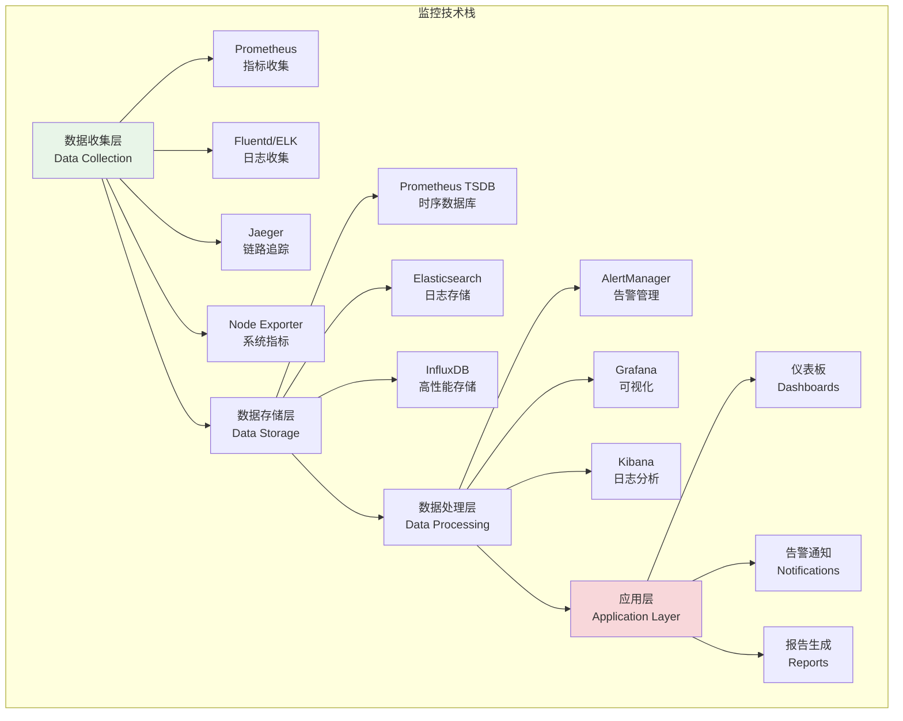
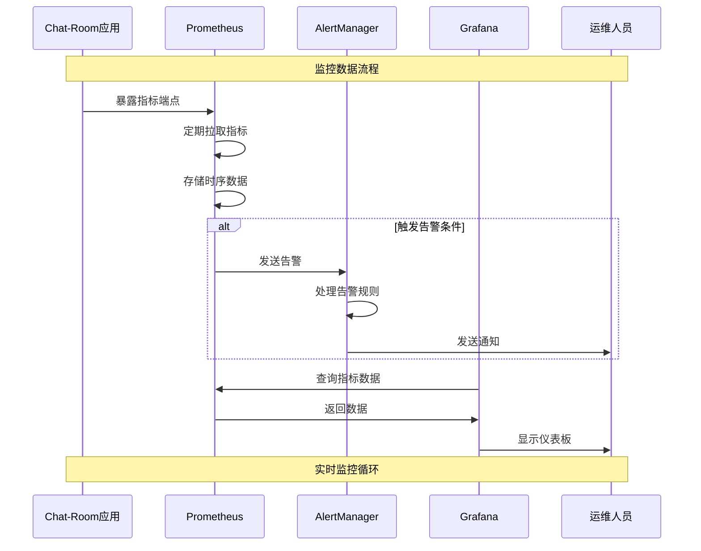

# 运维监控系统

## 🎯 学习目标

通过本章学习，您将能够：
- 理解现代运维监控的核心理念和体系架构
- 掌握Prometheus、Grafana等监控工具的使用
- 学会为Chat-Room项目设计全面的监控方案
- 实现智能告警和自动化运维机制

## 📊 监控体系架构

### 监控技术栈



### 监控数据流



## 🔧 监控系统实现

### Prometheus配置

```yaml
# monitoring/prometheus.yml - Prometheus配置
global:
  scrape_interval: 15s
  evaluation_interval: 15s
  external_labels:
    cluster: 'chatroom-cluster'
    environment: 'production'

rule_files:
  - "alert_rules.yml"
  - "recording_rules.yml"

alerting:
  alertmanagers:
    - static_configs:
        - targets:
          - alertmanager:9093

scrape_configs:
  # Chat-Room应用指标
  - job_name: 'chatroom-server'
    static_configs:
      - targets: ['chatroom-server:8000']
    metrics_path: '/metrics'
    scrape_interval: 10s
    scrape_timeout: 5s

  # 系统指标
  - job_name: 'node-exporter'
    static_configs:
      - targets: ['node-exporter:9100']

  # Kubernetes指标
  - job_name: 'kubernetes-apiservers'
    kubernetes_sd_configs:
      - role: endpoints
    scheme: https
    tls_config:
      ca_file: /var/run/secrets/kubernetes.io/serviceaccount/ca.crt
    bearer_token_file: /var/run/secrets/kubernetes.io/serviceaccount/token
    relabel_configs:
      - source_labels: [__meta_kubernetes_namespace, __meta_kubernetes_service_name, __meta_kubernetes_endpoint_port_name]
        action: keep
        regex: default;kubernetes;https

  # PostgreSQL指标
  - job_name: 'postgres-exporter'
    static_configs:
      - targets: ['postgres-exporter:9187']

  # Redis指标
  - job_name: 'redis-exporter'
    static_configs:
      - targets: ['redis-exporter:9121']

  # Nginx指标
  - job_name: 'nginx-exporter'
    static_configs:
      - targets: ['nginx-exporter:9113']
```

```yaml
# monitoring/alert_rules.yml - 告警规则
groups:
  - name: chatroom.rules
    rules:
      # 应用级别告警
      - alert: ChatRoomHighErrorRate
        expr: rate(chatroom_http_requests_total{status=~"5.."}[5m]) > 0.1
        for: 2m
        labels:
          severity: critical
          service: chatroom
        annotations:
          summary: "Chat-Room服务错误率过高"
          description: "Chat-Room服务在过去5分钟内错误率超过10%，当前值: {{ $value }}"

      - alert: ChatRoomHighResponseTime
        expr: histogram_quantile(0.95, rate(chatroom_http_request_duration_seconds_bucket[5m])) > 2
        for: 5m
        labels:
          severity: warning
          service: chatroom
        annotations:
          summary: "Chat-Room响应时间过长"
          description: "Chat-Room 95%分位响应时间超过2秒，当前值: {{ $value }}秒"

      - alert: ChatRoomHighConcurrentConnections
        expr: chatroom_websocket_connections_active > 1000
        for: 1m
        labels:
          severity: warning
          service: chatroom
        annotations:
          summary: "Chat-Room并发连接数过高"
          description: "当前WebSocket连接数: {{ $value }}，超过阈值1000"

      # 系统级别告警
      - alert: HighCPUUsage
        expr: 100 - (avg by(instance) (irate(node_cpu_seconds_total{mode="idle"}[5m])) * 100) > 80
        for: 5m
        labels:
          severity: warning
        annotations:
          summary: "服务器CPU使用率过高"
          description: "实例 {{ $labels.instance }} CPU使用率超过80%，当前值: {{ $value }}%"

      - alert: HighMemoryUsage
        expr: (node_memory_MemTotal_bytes - node_memory_MemAvailable_bytes) / node_memory_MemTotal_bytes * 100 > 85
        for: 5m
        labels:
          severity: critical
        annotations:
          summary: "服务器内存使用率过高"
          description: "实例 {{ $labels.instance }} 内存使用率超过85%，当前值: {{ $value }}%"

      - alert: DiskSpaceUsage
        expr: (node_filesystem_size_bytes - node_filesystem_free_bytes) / node_filesystem_size_bytes * 100 > 90
        for: 5m
        labels:
          severity: critical
        annotations:
          summary: "磁盘空间不足"
          description: "实例 {{ $labels.instance }} 磁盘使用率超过90%，当前值: {{ $value }}%"

      # 数据库告警
      - alert: PostgreSQLDown
        expr: pg_up == 0
        for: 1m
        labels:
          severity: critical
          service: postgresql
        annotations:
          summary: "PostgreSQL数据库不可用"
          description: "PostgreSQL实例 {{ $labels.instance }} 无法连接"

      - alert: PostgreSQLHighConnections
        expr: pg_stat_database_numbackends / pg_settings_max_connections * 100 > 80
        for: 5m
        labels:
          severity: warning
          service: postgresql
        annotations:
          summary: "PostgreSQL连接数过高"
          description: "PostgreSQL连接使用率超过80%，当前值: {{ $value }}%"

      # Redis告警
      - alert: RedisDown
        expr: redis_up == 0
        for: 1m
        labels:
          severity: critical
          service: redis
        annotations:
          summary: "Redis服务不可用"
          description: "Redis实例 {{ $labels.instance }} 无法连接"

      - alert: RedisHighMemoryUsage
        expr: redis_memory_used_bytes / redis_memory_max_bytes * 100 > 90
        for: 5m
        labels:
          severity: warning
          service: redis
        annotations:
          summary: "Redis内存使用率过高"
          description: "Redis内存使用率超过90%，当前值: {{ $value }}%"
```

### AlertManager配置

```yaml
# monitoring/alertmanager.yml - AlertManager配置
global:
  smtp_smarthost: 'smtp.gmail.com:587'
  smtp_from: 'alerts@chatroom.example.com'
  smtp_auth_username: 'alerts@chatroom.example.com'
  smtp_auth_password: 'your-app-password'

route:
  group_by: ['alertname', 'cluster', 'service']
  group_wait: 10s
  group_interval: 10s
  repeat_interval: 1h
  receiver: 'default-receiver'
  routes:
    - match:
        severity: critical
      receiver: 'critical-alerts'
      group_wait: 5s
      repeat_interval: 30m
    
    - match:
        service: chatroom
      receiver: 'chatroom-team'
    
    - match:
        service: postgresql
      receiver: 'database-team'

receivers:
  - name: 'default-receiver'
    email_configs:
      - to: 'ops@chatroom.example.com'
        subject: '[{{ .Status | toUpper }}] {{ .GroupLabels.alertname }}'
        body: |
          {{ range .Alerts }}
          告警: {{ .Annotations.summary }}
          描述: {{ .Annotations.description }}
          标签: {{ range .Labels.SortedPairs }}{{ .Name }}={{ .Value }} {{ end }}
          时间: {{ .StartsAt.Format "2006-01-02 15:04:05" }}
          {{ end }}

  - name: 'critical-alerts'
    email_configs:
      - to: 'critical@chatroom.example.com'
        subject: '🚨 [CRITICAL] {{ .GroupLabels.alertname }}'
        body: |
          严重告警触发！
          
          {{ range .Alerts }}
          告警: {{ .Annotations.summary }}
          描述: {{ .Annotations.description }}
          严重程度: {{ .Labels.severity }}
          服务: {{ .Labels.service }}
          时间: {{ .StartsAt.Format "2006-01-02 15:04:05" }}
          {{ end }}
    
    slack_configs:
      - api_url: 'https://hooks.slack.com/services/YOUR/SLACK/WEBHOOK'
        channel: '#critical-alerts'
        title: '🚨 Critical Alert: {{ .GroupLabels.alertname }}'
        text: |
          {{ range .Alerts }}
          *Alert:* {{ .Annotations.summary }}
          *Description:* {{ .Annotations.description }}
          *Severity:* {{ .Labels.severity }}
          *Service:* {{ .Labels.service }}
          {{ end }}

  - name: 'chatroom-team'
    email_configs:
      - to: 'chatroom-dev@example.com'
        subject: '[Chat-Room] {{ .GroupLabels.alertname }}'
    
    webhook_configs:
      - url: 'http://chatroom-webhook:8080/alerts'
        send_resolved: true

  - name: 'database-team'
    email_configs:
      - to: 'dba@example.com'
        subject: '[Database] {{ .GroupLabels.alertname }}'

inhibit_rules:
  - source_match:
      severity: 'critical'
    target_match:
      severity: 'warning'
    equal: ['alertname', 'instance']
```

### Grafana仪表板配置

```python
# monitoring/grafana_dashboard.py - Grafana仪表板生成器
import json
from typing import Dict, List, Any

class GrafanaDashboardGenerator:
    """
    Grafana仪表板生成器
    
    功能：
    1. 自动生成Chat-Room监控仪表板
    2. 创建系统资源监控面板
    3. 生成业务指标可视化
    4. 配置告警和通知
    """
    
    def __init__(self):
        self.dashboard_template = {
            "dashboard": {
                "id": None,
                "title": "Chat-Room监控仪表板",
                "tags": ["chatroom", "monitoring"],
                "timezone": "browser",
                "refresh": "30s",
                "time": {
                    "from": "now-1h",
                    "to": "now"
                },
                "panels": []
            }
        }
    
    def create_chatroom_dashboard(self) -> Dict[str, Any]:
        """创建Chat-Room主仪表板"""
        dashboard = self.dashboard_template.copy()
        
        # 添加面板
        panels = [
            self._create_overview_panel(),
            self._create_performance_panel(),
            self._create_websocket_panel(),
            self._create_database_panel(),
            self._create_system_panel(),
            self._create_error_panel()
        ]
        
        dashboard["dashboard"]["panels"] = panels
        return dashboard
    
    def _create_overview_panel(self) -> Dict[str, Any]:
        """创建概览面板"""
        return {
            "id": 1,
            "title": "服务概览",
            "type": "stat",
            "gridPos": {"h": 8, "w": 24, "x": 0, "y": 0},
            "targets": [
                {
                    "expr": "up{job='chatroom-server'}",
                    "legendFormat": "服务状态",
                    "refId": "A"
                },
                {
                    "expr": "chatroom_websocket_connections_active",
                    "legendFormat": "活跃连接",
                    "refId": "B"
                },
                {
                    "expr": "rate(chatroom_messages_total[5m]) * 60",
                    "legendFormat": "每分钟消息数",
                    "refId": "C"
                },
                {
                    "expr": "chatroom_users_online",
                    "legendFormat": "在线用户",
                    "refId": "D"
                }
            ],
            "fieldConfig": {
                "defaults": {
                    "color": {"mode": "palette-classic"},
                    "custom": {
                        "displayMode": "list",
                        "orientation": "horizontal"
                    },
                    "mappings": [],
                    "thresholds": {
                        "steps": [
                            {"color": "green", "value": None},
                            {"color": "red", "value": 0}
                        ]
                    }
                }
            }
        }
    
    def _create_performance_panel(self) -> Dict[str, Any]:
        """创建性能面板"""
        return {
            "id": 2,
            "title": "性能指标",
            "type": "timeseries",
            "gridPos": {"h": 8, "w": 12, "x": 0, "y": 8},
            "targets": [
                {
                    "expr": "histogram_quantile(0.95, rate(chatroom_http_request_duration_seconds_bucket[5m]))",
                    "legendFormat": "95%响应时间",
                    "refId": "A"
                },
                {
                    "expr": "histogram_quantile(0.50, rate(chatroom_http_request_duration_seconds_bucket[5m]))",
                    "legendFormat": "50%响应时间",
                    "refId": "B"
                },
                {
                    "expr": "rate(chatroom_http_requests_total[5m])",
                    "legendFormat": "请求速率",
                    "refId": "C"
                }
            ],
            "fieldConfig": {
                "defaults": {
                    "color": {"mode": "palette-classic"},
                    "custom": {
                        "drawStyle": "line",
                        "lineInterpolation": "linear",
                        "barAlignment": 0,
                        "lineWidth": 1,
                        "fillOpacity": 10,
                        "gradientMode": "none",
                        "spanNulls": False,
                        "insertNulls": False,
                        "showPoints": "never",
                        "pointSize": 5
                    },
                    "unit": "s"
                }
            }
        }
    
    def _create_websocket_panel(self) -> Dict[str, Any]:
        """创建WebSocket面板"""
        return {
            "id": 3,
            "title": "WebSocket连接",
            "type": "timeseries",
            "gridPos": {"h": 8, "w": 12, "x": 12, "y": 8},
            "targets": [
                {
                    "expr": "chatroom_websocket_connections_active",
                    "legendFormat": "活跃连接",
                    "refId": "A"
                },
                {
                    "expr": "rate(chatroom_websocket_connections_total[5m]) * 60",
                    "legendFormat": "每分钟新连接",
                    "refId": "B"
                },
                {
                    "expr": "rate(chatroom_websocket_disconnections_total[5m]) * 60",
                    "legendFormat": "每分钟断开连接",
                    "refId": "C"
                }
            ]
        }
    
    def _create_database_panel(self) -> Dict[str, Any]:
        """创建数据库面板"""
        return {
            "id": 4,
            "title": "数据库性能",
            "type": "timeseries",
            "gridPos": {"h": 8, "w": 12, "x": 0, "y": 16},
            "targets": [
                {
                    "expr": "pg_stat_database_numbackends",
                    "legendFormat": "数据库连接数",
                    "refId": "A"
                },
                {
                    "expr": "rate(pg_stat_database_xact_commit[5m])",
                    "legendFormat": "事务提交率",
                    "refId": "B"
                },
                {
                    "expr": "pg_stat_database_tup_inserted + pg_stat_database_tup_updated + pg_stat_database_tup_deleted",
                    "legendFormat": "数据变更操作",
                    "refId": "C"
                }
            ]
        }
    
    def _create_system_panel(self) -> Dict[str, Any]:
        """创建系统资源面板"""
        return {
            "id": 5,
            "title": "系统资源",
            "type": "timeseries",
            "gridPos": {"h": 8, "w": 12, "x": 12, "y": 16},
            "targets": [
                {
                    "expr": "100 - (avg by(instance) (irate(node_cpu_seconds_total{mode='idle'}[5m])) * 100)",
                    "legendFormat": "CPU使用率",
                    "refId": "A"
                },
                {
                    "expr": "(node_memory_MemTotal_bytes - node_memory_MemAvailable_bytes) / node_memory_MemTotal_bytes * 100",
                    "legendFormat": "内存使用率",
                    "refId": "B"
                },
                {
                    "expr": "(node_filesystem_size_bytes - node_filesystem_free_bytes) / node_filesystem_size_bytes * 100",
                    "legendFormat": "磁盘使用率",
                    "refId": "C"
                }
            ]
        }
    
    def _create_error_panel(self) -> Dict[str, Any]:
        """创建错误监控面板"""
        return {
            "id": 6,
            "title": "错误监控",
            "type": "timeseries",
            "gridPos": {"h": 8, "w": 24, "x": 0, "y": 24},
            "targets": [
                {
                    "expr": "rate(chatroom_http_requests_total{status=~'4..'}[5m])",
                    "legendFormat": "4xx错误率",
                    "refId": "A"
                },
                {
                    "expr": "rate(chatroom_http_requests_total{status=~'5..'}[5m])",
                    "legendFormat": "5xx错误率",
                    "refId": "B"
                },
                {
                    "expr": "rate(chatroom_exceptions_total[5m])",
                    "legendFormat": "异常率",
                    "refId": "C"
                }
            ]
        }
    
    def export_dashboard(self, filename: str = "chatroom-dashboard.json"):
        """导出仪表板配置"""
        dashboard = self.create_chatroom_dashboard()
        
        with open(filename, 'w', encoding='utf-8') as f:
            json.dump(dashboard, f, indent=2, ensure_ascii=False)
        
        print(f"仪表板配置已导出到: {filename}")

# 使用示例
def demo_monitoring_operations():
    """运维监控演示"""
    print("=== Chat-Room运维监控演示 ===")
    
    # 生成Grafana仪表板
    generator = GrafanaDashboardGenerator()
    dashboard = generator.create_chatroom_dashboard()
    
    print("1. Grafana仪表板配置:")
    print(f"  - 面板数量: {len(dashboard['dashboard']['panels'])}")
    print("  - 监控指标: 服务状态、性能、WebSocket、数据库、系统资源、错误")
    
    print("\n2. Prometheus监控指标:")
    metrics = [
        "chatroom_http_requests_total",
        "chatroom_http_request_duration_seconds",
        "chatroom_websocket_connections_active",
        "chatroom_messages_total",
        "chatroom_users_online",
        "chatroom_exceptions_total"
    ]
    
    for metric in metrics:
        print(f"  - {metric}")
    
    print("\n3. 告警规则:")
    alerts = [
        "ChatRoomHighErrorRate - 错误率过高",
        "ChatRoomHighResponseTime - 响应时间过长", 
        "ChatRoomHighConcurrentConnections - 并发连接过多",
        "HighCPUUsage - CPU使用率过高",
        "HighMemoryUsage - 内存使用率过高",
        "PostgreSQLDown - 数据库不可用"
    ]
    
    for alert in alerts:
        print(f"  - {alert}")
    
    print("\n4. 通知渠道:")
    print("  - 邮件通知: 发送到运维团队")
    print("  - Slack通知: 严重告警推送")
    print("  - Webhook通知: 集成到Chat-Room系统")
    
    print("\n5. 监控最佳实践:")
    print("  - 四个黄金信号: 延迟、流量、错误、饱和度")
    print("  - SLI/SLO定义: 可用性99.9%，响应时间<2s")
    print("  - 分层监控: 基础设施、应用、业务")
    print("  - 智能告警: 避免告警疲劳")

if __name__ == "__main__":
    demo_monitoring_operations()
```

## 🎯 实践练习

### 练习1：智能告警系统
```python
class IntelligentAlertingSystem:
    """
    智能告警系统练习
    
    要求：
    1. 实现基于机器学习的异常检测
    2. 支持告警聚合和去重
    3. 实现告警升级和自动恢复
    4. 添加告警疲劳防护机制
    """
    
    def detect_anomalies(self, metrics: List[Dict[str, Any]]) -> List[Dict[str, Any]]:
        """检测异常"""
        # TODO: 实现异常检测
        pass
    
    def aggregate_alerts(self, alerts: List[Dict[str, Any]]) -> List[Dict[str, Any]]:
        """聚合告警"""
        # TODO: 实现告警聚合
        pass
```

### 练习2：自动化运维系统
```python
class AutomatedOperationsSystem:
    """
    自动化运维系统练习
    
    要求：
    1. 实现自动扩缩容机制
    2. 支持故障自动恢复
    3. 实现配置自动更新
    4. 添加运维操作审计
    """
    
    def auto_scale_services(self, metrics: Dict[str, Any]) -> Dict[str, Any]:
        """自动扩缩容"""
        # TODO: 实现自动扩缩容
        pass
    
    def auto_recovery(self, failure_info: Dict[str, Any]) -> bool:
        """自动故障恢复"""
        # TODO: 实现自动恢复
        pass
```

## ✅ 学习检查

完成本章学习后，请确认您能够：

- [ ] 理解现代运维监控的体系架构
- [ ] 配置Prometheus和Grafana监控系统
- [ ] 设计告警规则和通知机制
- [ ] 创建监控仪表板和可视化
- [ ] 实现智能告警和自动化运维
- [ ] 完成实践练习

## 📚 总结

恭喜您完成了Chat-Room学习文档v02的全部内容！您已经掌握了：

### 🎓 核心技能
- **现代Python开发**: 异步编程、类型提示、最佳实践
- **网络编程**: Socket编程、WebSocket、协议设计
- **数据库设计**: 关系型数据库、查询优化、数据迁移
- **AI集成**: GLM-4-Flash API、上下文管理、智能助手
- **用户界面**: TUI设计、Textual框架、现代终端应用
- **系统架构**: 微服务、模块化设计、可扩展架构
- **测试质量**: 单元测试、集成测试、TDD、覆盖率分析
- **部署运维**: 容器化、Kubernetes、CI/CD、监控告警

### 🚀 项目成果
通过学习本文档，您已经具备了构建企业级Chat-Room应用的完整技能栈，包括：
- 高性能的实时通信系统
- 现代化的用户界面和体验
- 完整的AI集成和智能功能
- 企业级的部署和运维方案

### 🌟 下一步建议
1. **实践项目**: 基于文档内容构建完整的Chat-Room应用
2. **技能深化**: 选择感兴趣的领域进行深入学习
3. **社区贡献**: 参与开源项目，分享学习经验
4. **持续学习**: 关注技术发展，保持技能更新

---

**感谢您的学习！祝您在技术道路上不断进步！** 🎉
