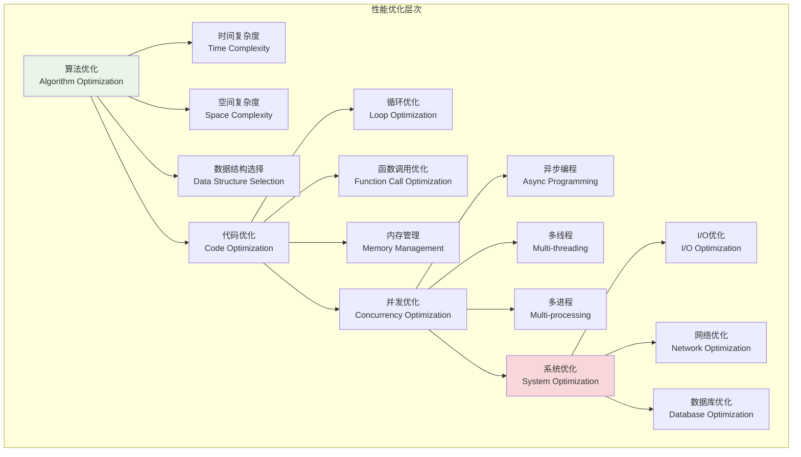
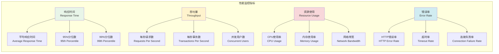

# 性能优化策略

## 🎯 学习目标

通过本章学习，您将能够：
- 理解现代应用性能优化的核心理念和方法论
- 掌握Python异步编程和并发优化技术
- 学会为Chat-Room项目设计高性能架构
- 实现系统性能监控和调优机制

## ⚡ 性能优化体系

### 性能优化层次



### 性能监控指标



## 🔧 性能优化实现

### Chat-Room性能优化系统

```python
# server/optimization/performance_optimizer.py - 性能优化器
import asyncio
import time
import threading
import multiprocessing
from typing import Dict, List, Any, Callable, Optional, Union
from dataclasses import dataclass, field
from concurrent.futures import ThreadPoolExecutor, ProcessPoolExecutor
from functools import wraps, lru_cache
import weakref
import gc
from collections import deque, defaultdict
import psutil
import cProfile
import pstats
import io

@dataclass
class PerformanceMetrics:
    """性能指标"""
    response_time: float
    throughput: float
    cpu_usage: float
    memory_usage: float
    concurrent_connections: int
    error_rate: float
    timestamp: float = field(default_factory=time.time)
    
    def to_dict(self) -> Dict[str, Any]:
        """转换为字典"""
        return {
            "response_time": self.response_time,
            "throughput": self.throughput,
            "cpu_usage": self.cpu_usage,
            "memory_usage": self.memory_usage,
            "concurrent_connections": self.concurrent_connections,
            "error_rate": self.error_rate,
            "timestamp": self.timestamp
        }

class AsyncOptimizer:
    """
    异步优化器
    
    功能：
    1. 异步任务调度优化
    2. 协程池管理
    3. 事件循环优化
    4. 异步I/O优化
    """
    
    def __init__(self, max_workers: int = 100):
        self.max_workers = max_workers
        self.semaphore = asyncio.Semaphore(max_workers)
        self.task_queue = asyncio.Queue()
        self.active_tasks = set()
        self.metrics = deque(maxlen=1000)
    
    async def execute_with_limit(self, coro):
        """限制并发执行协程"""
        async with self.semaphore:
            start_time = time.time()
            try:
                result = await coro
                execution_time = time.time() - start_time
                self._record_metric("success", execution_time)
                return result
            except Exception as e:
                execution_time = time.time() - start_time
                self._record_metric("error", execution_time)
                raise
    
    def _record_metric(self, status: str, execution_time: float):
        """记录性能指标"""
        self.metrics.append({
            "status": status,
            "execution_time": execution_time,
            "timestamp": time.time(),
            "active_tasks": len(self.active_tasks)
        })
    
    async def batch_execute(self, coros: List[Callable], batch_size: int = 10):
        """批量执行协程"""
        results = []
        
        for i in range(0, len(coros), batch_size):
            batch = coros[i:i + batch_size]
            batch_results = await asyncio.gather(
                *[self.execute_with_limit(coro()) for coro in batch],
                return_exceptions=True
            )
            results.extend(batch_results)
        
        return results
    
    def get_performance_stats(self) -> Dict[str, Any]:
        """获取性能统计"""
        if not self.metrics:
            return {}
        
        recent_metrics = list(self.metrics)[-100:]  # 最近100个指标
        
        execution_times = [m["execution_time"] for m in recent_metrics]
        success_count = sum(1 for m in recent_metrics if m["status"] == "success")
        error_count = len(recent_metrics) - success_count
        
        return {
            "avg_execution_time": sum(execution_times) / len(execution_times),
            "max_execution_time": max(execution_times),
            "min_execution_time": min(execution_times),
            "success_rate": success_count / len(recent_metrics) * 100,
            "error_rate": error_count / len(recent_metrics) * 100,
            "active_tasks": len(self.active_tasks)
        }

class CacheOptimizer:
    """
    缓存优化器
    
    功能：
    1. 多级缓存管理
    2. 缓存策略优化
    3. 缓存命中率监控
    4. 自动缓存清理
    """
    
    def __init__(self):
        self.l1_cache = {}  # 内存缓存
        self.l2_cache = {}  # 持久化缓存
        self.cache_stats = defaultdict(int)
        self.cache_ttl = {}  # 缓存过期时间
        self.max_cache_size = 1000
    
    def get(self, key: str, default=None) -> Any:
        """获取缓存值"""
        # 检查L1缓存
        if key in self.l1_cache:
            if self._is_cache_valid(key):
                self.cache_stats["l1_hits"] += 1
                return self.l1_cache[key]
            else:
                self._remove_expired_cache(key)
        
        # 检查L2缓存
        if key in self.l2_cache:
            if self._is_cache_valid(key):
                self.cache_stats["l2_hits"] += 1
                # 提升到L1缓存
                self.l1_cache[key] = self.l2_cache[key]
                return self.l2_cache[key]
            else:
                self._remove_expired_cache(key)
        
        self.cache_stats["misses"] += 1
        return default
    
    def set(self, key: str, value: Any, ttl: int = 3600):
        """设置缓存值"""
        current_time = time.time()
        
        # 检查缓存大小限制
        if len(self.l1_cache) >= self.max_cache_size:
            self._evict_lru_cache()
        
        self.l1_cache[key] = value
        self.cache_ttl[key] = current_time + ttl
        self.cache_stats["sets"] += 1
    
    def _is_cache_valid(self, key: str) -> bool:
        """检查缓存是否有效"""
        if key not in self.cache_ttl:
            return True
        
        return time.time() < self.cache_ttl[key]
    
    def _remove_expired_cache(self, key: str):
        """移除过期缓存"""
        self.l1_cache.pop(key, None)
        self.l2_cache.pop(key, None)
        self.cache_ttl.pop(key, None)
    
    def _evict_lru_cache(self):
        """LRU缓存淘汰"""
        # 简单实现：移除最旧的缓存项
        if self.l1_cache:
            oldest_key = next(iter(self.l1_cache))
            self.l2_cache[oldest_key] = self.l1_cache.pop(oldest_key)
    
    def get_cache_stats(self) -> Dict[str, Any]:
        """获取缓存统计"""
        total_requests = (self.cache_stats["l1_hits"] + 
                         self.cache_stats["l2_hits"] + 
                         self.cache_stats["misses"])
        
        if total_requests == 0:
            return {"hit_rate": 0, "miss_rate": 0}
        
        hit_rate = ((self.cache_stats["l1_hits"] + self.cache_stats["l2_hits"]) / 
                   total_requests * 100)
        
        return {
            "l1_hits": self.cache_stats["l1_hits"],
            "l2_hits": self.cache_stats["l2_hits"],
            "misses": self.cache_stats["misses"],
            "sets": self.cache_stats["sets"],
            "hit_rate": hit_rate,
            "miss_rate": 100 - hit_rate,
            "cache_size": len(self.l1_cache) + len(self.l2_cache)
        }

class ConnectionPoolOptimizer:
    """
    连接池优化器
    
    功能：
    1. 连接池大小动态调整
    2. 连接健康检查
    3. 连接复用优化
    4. 连接超时管理
    """
    
    def __init__(self, min_connections: int = 5, max_connections: int = 100):
        self.min_connections = min_connections
        self.max_connections = max_connections
        self.active_connections = set()
        self.idle_connections = deque()
        self.connection_stats = defaultdict(int)
        self.lock = asyncio.Lock()
    
    async def get_connection(self):
        """获取连接"""
        async with self.lock:
            # 尝试从空闲连接池获取
            while self.idle_connections:
                conn = self.idle_connections.popleft()
                if await self._is_connection_healthy(conn):
                    self.active_connections.add(conn)
                    self.connection_stats["reused"] += 1
                    return conn
                else:
                    await self._close_connection(conn)
            
            # 创建新连接
            if len(self.active_connections) < self.max_connections:
                conn = await self._create_connection()
                self.active_connections.add(conn)
                self.connection_stats["created"] += 1
                return conn
            
            # 连接池已满，等待
            raise Exception("连接池已满")
    
    async def return_connection(self, conn):
        """归还连接"""
        async with self.lock:
            if conn in self.active_connections:
                self.active_connections.remove(conn)
                
                if await self._is_connection_healthy(conn):
                    self.idle_connections.append(conn)
                    self.connection_stats["returned"] += 1
                else:
                    await self._close_connection(conn)
                    self.connection_stats["closed"] += 1
    
    async def _create_connection(self):
        """创建新连接"""
        # 模拟连接创建
        class MockConnection:
            def __init__(self):
                self.created_at = time.time()
                self.healthy = True
            
            async def close(self):
                self.healthy = False
        
        return MockConnection()
    
    async def _is_connection_healthy(self, conn) -> bool:
        """检查连接健康状态"""
        # 模拟健康检查
        return hasattr(conn, 'healthy') and conn.healthy
    
    async def _close_connection(self, conn):
        """关闭连接"""
        if hasattr(conn, 'close'):
            await conn.close()
    
    def get_pool_stats(self) -> Dict[str, Any]:
        """获取连接池统计"""
        return {
            "active_connections": len(self.active_connections),
            "idle_connections": len(self.idle_connections),
            "total_connections": len(self.active_connections) + len(self.idle_connections),
            "max_connections": self.max_connections,
            "connection_stats": dict(self.connection_stats)
        }

class PerformanceProfiler:
    """
    性能分析器
    
    功能：
    1. 代码性能分析
    2. 热点函数识别
    3. 内存使用分析
    4. 性能报告生成
    """
    
    def __init__(self):
        self.profiler = None
        self.profile_data = {}
        self.memory_snapshots = []
    
    def start_profiling(self):
        """开始性能分析"""
        self.profiler = cProfile.Profile()
        self.profiler.enable()
    
    def stop_profiling(self):
        """停止性能分析"""
        if self.profiler:
            self.profiler.disable()
    
    def get_profile_stats(self, sort_by: str = 'cumulative') -> str:
        """获取性能分析统计"""
        if not self.profiler:
            return "没有性能分析数据"
        
        s = io.StringIO()
        stats = pstats.Stats(self.profiler, stream=s)
        stats.sort_stats(sort_by)
        stats.print_stats(20)  # 显示前20个函数
        
        return s.getvalue()
    
    def profile_function(self, func):
        """函数性能分析装饰器"""
        @wraps(func)
        def wrapper(*args, **kwargs):
            start_time = time.time()
            start_memory = psutil.Process().memory_info().rss
            
            try:
                result = func(*args, **kwargs)
                return result
            finally:
                end_time = time.time()
                end_memory = psutil.Process().memory_info().rss
                
                func_name = f"{func.__module__}.{func.__name__}"
                self.profile_data[func_name] = {
                    "execution_time": end_time - start_time,
                    "memory_delta": end_memory - start_memory,
                    "call_count": self.profile_data.get(func_name, {}).get("call_count", 0) + 1
                }
        
        return wrapper
    
    def take_memory_snapshot(self, label: str = ""):
        """获取内存快照"""
        process = psutil.Process()
        memory_info = process.memory_info()
        
        snapshot = {
            "label": label,
            "timestamp": time.time(),
            "rss": memory_info.rss,  # 物理内存
            "vms": memory_info.vms,  # 虚拟内存
            "percent": process.memory_percent(),
            "available": psutil.virtual_memory().available
        }
        
        self.memory_snapshots.append(snapshot)
        return snapshot
    
    def analyze_memory_usage(self) -> Dict[str, Any]:
        """分析内存使用情况"""
        if len(self.memory_snapshots) < 2:
            return {"error": "需要至少2个内存快照"}
        
        first_snapshot = self.memory_snapshots[0]
        last_snapshot = self.memory_snapshots[-1]
        
        memory_growth = last_snapshot["rss"] - first_snapshot["rss"]
        time_elapsed = last_snapshot["timestamp"] - first_snapshot["timestamp"]
        
        return {
            "memory_growth": memory_growth,
            "memory_growth_mb": memory_growth / 1024 / 1024,
            "time_elapsed": time_elapsed,
            "growth_rate": memory_growth / time_elapsed if time_elapsed > 0 else 0,
            "current_usage": last_snapshot["rss"] / 1024 / 1024,
            "usage_percent": last_snapshot["percent"]
        }

class PerformanceOptimizer:
    """
    性能优化器主类
    
    功能：
    1. 集成各种优化器
    2. 性能监控和分析
    3. 自动优化建议
    4. 性能报告生成
    """
    
    def __init__(self):
        self.async_optimizer = AsyncOptimizer()
        self.cache_optimizer = CacheOptimizer()
        self.connection_pool = ConnectionPoolOptimizer()
        self.profiler = PerformanceProfiler()
        self.metrics_history = deque(maxlen=1000)
    
    def collect_metrics(self) -> PerformanceMetrics:
        """收集性能指标"""
        # 获取系统指标
        cpu_usage = psutil.cpu_percent()
        memory_usage = psutil.virtual_memory().percent
        
        # 获取应用指标
        async_stats = self.async_optimizer.get_performance_stats()
        cache_stats = self.cache_optimizer.get_cache_stats()
        pool_stats = self.connection_pool.get_pool_stats()
        
        metrics = PerformanceMetrics(
            response_time=async_stats.get("avg_execution_time", 0),
            throughput=1.0 / async_stats.get("avg_execution_time", 1),
            cpu_usage=cpu_usage,
            memory_usage=memory_usage,
            concurrent_connections=pool_stats["active_connections"],
            error_rate=async_stats.get("error_rate", 0)
        )
        
        self.metrics_history.append(metrics)
        return metrics
    
    def generate_optimization_report(self) -> Dict[str, Any]:
        """生成优化报告"""
        if not self.metrics_history:
            return {"error": "没有性能数据"}
        
        recent_metrics = list(self.metrics_history)[-100:]
        
        # 计算平均值
        avg_response_time = sum(m.response_time for m in recent_metrics) / len(recent_metrics)
        avg_cpu_usage = sum(m.cpu_usage for m in recent_metrics) / len(recent_metrics)
        avg_memory_usage = sum(m.memory_usage for m in recent_metrics) / len(recent_metrics)
        
        # 生成优化建议
        recommendations = []
        
        if avg_response_time > 1.0:
            recommendations.append("响应时间过长，建议优化异步处理逻辑")
        
        if avg_cpu_usage > 80:
            recommendations.append("CPU使用率过高，建议优化计算密集型操作")
        
        if avg_memory_usage > 85:
            recommendations.append("内存使用率过高，建议检查内存泄漏")
        
        cache_stats = self.cache_optimizer.get_cache_stats()
        if cache_stats.get("hit_rate", 0) < 70:
            recommendations.append("缓存命中率偏低，建议优化缓存策略")
        
        return {
            "performance_summary": {
                "avg_response_time": avg_response_time,
                "avg_cpu_usage": avg_cpu_usage,
                "avg_memory_usage": avg_memory_usage,
                "cache_hit_rate": cache_stats.get("hit_rate", 0)
            },
            "optimization_recommendations": recommendations,
            "detailed_stats": {
                "async_stats": self.async_optimizer.get_performance_stats(),
                "cache_stats": cache_stats,
                "pool_stats": self.connection_pool.get_pool_stats()
            }
        }

# 使用示例
async def demo_performance_optimization():
    """性能优化演示"""
    print("=== Chat-Room性能优化演示 ===")
    
    optimizer = PerformanceOptimizer()
    
    # 模拟一些异步任务
    async def mock_task(task_id: int):
        await asyncio.sleep(0.1)  # 模拟I/O操作
        return f"Task {task_id} completed"
    
    print("1. 执行异步任务优化...")
    tasks = [lambda i=i: mock_task(i) for i in range(20)]
    results = await optimizer.async_optimizer.batch_execute(tasks, batch_size=5)
    print(f"完成 {len(results)} 个任务")
    
    # 缓存优化演示
    print("\n2. 缓存优化演示...")
    cache = optimizer.cache_optimizer
    
    # 设置缓存
    cache.set("user:1", {"name": "Alice", "email": "alice@example.com"})
    cache.set("user:2", {"name": "Bob", "email": "bob@example.com"})
    
    # 获取缓存
    user1 = cache.get("user:1")
    user2 = cache.get("user:2")
    user3 = cache.get("user:3", "Not found")
    
    print(f"用户1: {user1}")
    print(f"用户3: {user3}")
    
    # 性能指标收集
    print("\n3. 性能指标收集...")
    metrics = optimizer.collect_metrics()
    print(f"响应时间: {metrics.response_time:.3f}s")
    print(f"CPU使用率: {metrics.cpu_usage:.1f}%")
    print(f"内存使用率: {metrics.memory_usage:.1f}%")
    
    # 生成优化报告
    print("\n4. 优化报告生成...")
    report = optimizer.generate_optimization_report()
    print("性能摘要:")
    for key, value in report["performance_summary"].items():
        print(f"  {key}: {value}")
    
    print("\n优化建议:")
    for recommendation in report["optimization_recommendations"]:
        print(f"  - {recommendation}")

if __name__ == "__main__":
    asyncio.run(demo_performance_optimization())
```

## 🎯 实践练习

### 练习1：异步性能优化
```python
class AsyncPerformanceOptimizer:
    """
    异步性能优化练习
    
    要求：
    1. 实现协程池动态调整
    2. 优化异步I/O操作
    3. 实现背压控制机制
    4. 添加性能监控和告警
    """
    
    async def optimize_async_operations(self, operations: List[Callable]) -> List[Any]:
        """优化异步操作"""
        # TODO: 实现异步操作优化
        pass
    
    async def implement_backpressure(self, producer, consumer):
        """实现背压控制"""
        # TODO: 实现背压控制
        pass
```

### 练习2：内存优化策略
```python
class MemoryOptimizer:
    """
    内存优化策略练习
    
    要求：
    1. 实现内存池管理
    2. 优化对象生命周期
    3. 实现智能垃圾回收
    4. 添加内存泄漏检测
    """
    
    def optimize_memory_usage(self, objects: List[Any]) -> Dict[str, Any]:
        """优化内存使用"""
        # TODO: 实现内存优化
        pass
    
    def detect_memory_leaks(self) -> List[Dict[str, Any]]:
        """检测内存泄漏"""
        # TODO: 实现内存泄漏检测
        pass
```

## ✅ 学习检查

完成本章学习后，请确认您能够：

- [ ] 理解性能优化的层次和方法论
- [ ] 实现异步编程和并发优化
- [ ] 设计高效的缓存和连接池策略
- [ ] 进行性能分析和瓶颈识别
- [ ] 建立性能监控和告警机制
- [ ] 完成实践练习

## 📚 下一步

性能优化策略掌握后，请继续学习：
- [容器化部署](./containerization-deployment.md)

---

**恭喜！您已经掌握了性能优化的核心技术！** ⚡
