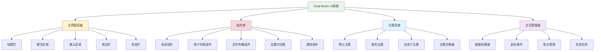
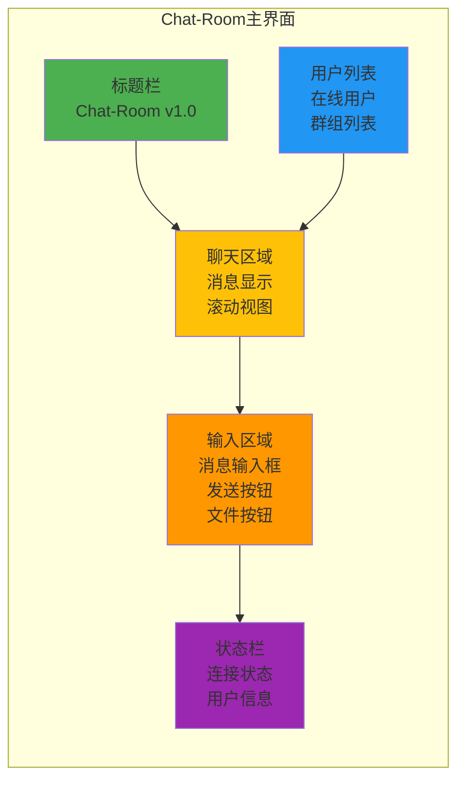

# 第9章：用户界面设计与实现

## 🎯 学习目标

通过本章学习，您将能够：
- 设计现代化的聊天室用户界面
- 掌握Textual TUI框架的使用
- 实现响应式界面布局
- 优化用户交互体验
- 实现主题和个性化设置
- 构建专业级的Chat-Room客户端界面

## 📚 章节内容

### 1. UI框架基础
- [Textual TUI框架入门](textual-basics.md)
- [界面布局与组件设计](layout-components.md)

### 2. 交互体验优化
- [用户交互设计](user-interaction.md)
- [主题与个性化](themes-customization.md)

## 🎨 Chat-Room UI架构



## 🖥️ 界面布局设计



## 💻 Textual TUI实现

### 主界面实现

```python
"""
Chat-Room Textual TUI界面实现
使用Textual框架构建现代化的终端用户界面
"""

from textual.app import App, ComposeResult
from textual.containers import Container, Horizontal, Vertical, ScrollableContainer
from textual.widgets import (
    Header, Footer, Input, Button, Static, ListView, ListItem, 
    Label, ProgressBar, Tabs, Tab, DataTable, Tree, Log
)
from textual.binding import Binding
from textual.message import Message
from textual.reactive import reactive
from textual.screen import Screen
from textual import events
from textual.css.query import NoMatches

import asyncio
import time
from typing import Dict, List, Optional, Any
from dataclasses import dataclass
from datetime import datetime
from shared.logger import get_logger

logger = get_logger("ui.main")

@dataclass
class ChatMessage:
    """聊天消息数据类"""
    id: str
    sender: str
    content: str
    timestamp: float
    message_type: str = "text"
    group: str = "general"

@dataclass
class UserInfo:
    """用户信息数据类"""
    id: int
    username: str
    status: str = "online"  # online, away, offline
    last_seen: float = None

class MessageWidget(Static):
    """消息显示组件"""
    
    def __init__(self, message: ChatMessage, **kwargs):
        self.message = message
        super().__init__(**kwargs)
    
    def compose(self) -> ComposeResult:
        """组合消息组件"""
        
        # 格式化时间
        time_str = datetime.fromtimestamp(self.message.timestamp).strftime("%H:%M:%S")
        
        # 根据消息类型设置样式
        if self.message.message_type == "system":
            yield Static(f"[dim]{time_str}[/] [bold blue]系统[/]: {self.message.content}")
        elif self.message.message_type == "ai":
            yield Static(f"[dim]{time_str}[/] [bold green]🤖 AI助手[/]: {self.message.content}")
        else:
            yield Static(f"[dim]{time_str}[/] [bold]{self.message.sender}[/]: {self.message.content}")

class UserListWidget(ListView):
    """用户列表组件"""
    
    def __init__(self, **kwargs):
        super().__init__(**kwargs)
        self.users: Dict[int, UserInfo] = {}
    
    def add_user(self, user: UserInfo):
        """添加用户"""
        self.users[user.id] = user
        self.refresh_user_list()
    
    def remove_user(self, user_id: int):
        """移除用户"""
        if user_id in self.users:
            del self.users[user_id]
            self.refresh_user_list()
    
    def update_user_status(self, user_id: int, status: str):
        """更新用户状态"""
        if user_id in self.users:
            self.users[user_id].status = status
            self.refresh_user_list()
    
    def refresh_user_list(self):
        """刷新用户列表显示"""
        self.clear()
        
        # 按状态分组显示用户
        online_users = [u for u in self.users.values() if u.status == "online"]
        away_users = [u for u in self.users.values() if u.status == "away"]
        
        if online_users:
            self.append(ListItem(Label("[bold green]在线用户[/]")))
            for user in sorted(online_users, key=lambda x: x.username):
                status_icon = "🟢" if user.status == "online" else "🟡"
                self.append(ListItem(Label(f"{status_icon} {user.username}")))
        
        if away_users:
            self.append(ListItem(Label("[bold yellow]离开用户[/]")))
            for user in sorted(away_users, key=lambda x: x.username):
                self.append(ListItem(Label(f"🟡 {user.username}")))

class ChatInputWidget(Container):
    """聊天输入组件"""
    
    def __init__(self, **kwargs):
        super().__init__(**kwargs)
        self.on_send_message: Optional[callable] = None
    
    def compose(self) -> ComposeResult:
        """组合输入组件"""
        with Horizontal():
            yield Input(placeholder="输入消息...", id="message_input")
            yield Button("发送", id="send_button", variant="primary")
            yield Button("📁", id="file_button", variant="default")
    
    def on_button_pressed(self, event: Button.Pressed) -> None:
        """处理按钮点击"""
        if event.button.id == "send_button":
            self.send_message()
        elif event.button.id == "file_button":
            self.open_file_dialog()
    
    def on_input_submitted(self, event: Input.Submitted) -> None:
        """处理输入提交"""
        if event.input.id == "message_input":
            self.send_message()
    
    def send_message(self):
        """发送消息"""
        try:
            input_widget = self.query_one("#message_input", Input)
            message = input_widget.value.strip()
            
            if message and self.on_send_message:
                self.on_send_message(message)
                input_widget.value = ""
                
        except NoMatches:
            logger.error("找不到消息输入框")
    
    def open_file_dialog(self):
        """打开文件对话框"""
        # TODO: 实现文件选择对话框
        self.app.notify("文件传输功能开发中...", severity="info")

class ChatArea(ScrollableContainer):
    """聊天区域组件"""
    
    def __init__(self, **kwargs):
        super().__init__(**kwargs)
        self.messages: List[ChatMessage] = []
        self.auto_scroll = True
    
    def add_message(self, message: ChatMessage):
        """添加消息"""
        self.messages.append(message)
        
        # 创建消息组件
        message_widget = MessageWidget(message)
        self.mount(message_widget)
        
        # 自动滚动到底部
        if self.auto_scroll:
            self.scroll_end(animate=True)
        
        # 限制消息数量（保持性能）
        if len(self.messages) > 1000:
            # 移除最旧的消息
            old_message = self.messages.pop(0)
            try:
                old_widget = self.children[0]
                old_widget.remove()
            except IndexError:
                pass
    
    def clear_messages(self):
        """清空消息"""
        self.messages.clear()
        for child in list(self.children):
            child.remove()

class ConnectionStatusWidget(Static):
    """连接状态组件"""
    
    status = reactive("disconnected")
    
    def __init__(self, **kwargs):
        super().__init__(**kwargs)
    
    def watch_status(self, status: str) -> None:
        """监听状态变化"""
        status_icons = {
            "connected": "🟢 已连接",
            "connecting": "🟡 连接中...",
            "disconnected": "🔴 未连接",
            "error": "❌ 连接错误"
        }
        
        self.update(status_icons.get(status, "❓ 未知状态"))

class SettingsScreen(Screen):
    """设置界面"""
    
    BINDINGS = [
        Binding("escape", "dismiss", "关闭"),
    ]
    
    def compose(self) -> ComposeResult:
        """组合设置界面"""
        with Container(id="settings_container"):
            yield Header()
            
            with Vertical():
                yield Label("Chat-Room 设置", classes="title")
                
                with Tabs():
                    yield Tab("常规", id="general_tab")
                    yield Tab("外观", id="appearance_tab")
                    yield Tab("通知", id="notification_tab")
                
                # 设置选项
                yield Label("用户名:")
                yield Input(placeholder="输入用户名", id="username_input")
                
                yield Label("服务器地址:")
                yield Input(placeholder="localhost:8888", id="server_input")
                
                yield Label("主题:")
                with Horizontal():
                    yield Button("默认", id="theme_default")
                    yield Button("暗色", id="theme_dark")
                    yield Button("自定义", id="theme_custom")
                
                with Horizontal():
                    yield Button("保存", id="save_settings", variant="primary")
                    yield Button("取消", id="cancel_settings")
    
    def on_button_pressed(self, event: Button.Pressed) -> None:
        """处理按钮点击"""
        if event.button.id == "save_settings":
            self.save_settings()
        elif event.button.id == "cancel_settings":
            self.dismiss()
        elif event.button.id.startswith("theme_"):
            theme_name = event.button.id.replace("theme_", "")
            self.app.theme = theme_name
    
    def save_settings(self):
        """保存设置"""
        # TODO: 实现设置保存
        self.app.notify("设置已保存", severity="success")
        self.dismiss()
    
    def action_dismiss(self) -> None:
        """关闭设置界面"""
        self.dismiss()

class ChatRoomApp(App):
    """Chat-Room主应用"""
    
    CSS = """
    Screen {
        layout: vertical;
    }
    
    #main_container {
        layout: horizontal;
        height: 1fr;
    }
    
    #sidebar {
        width: 25%;
        border-right: solid $primary;
    }
    
    #chat_container {
        width: 75%;
        layout: vertical;
    }
    
    #chat_area {
        height: 1fr;
        border: solid $primary;
        padding: 1;
    }
    
    #input_area {
        height: 3;
        border: solid $primary;
        padding: 1;
    }
    
    #status_bar {
        height: 1;
        background: $primary;
        color: $text;
        padding: 0 1;
    }
    
    MessageWidget {
        margin: 0 0 1 0;
    }
    
    .title {
        text-align: center;
        text-style: bold;
        margin: 1 0;
    }
    
    #settings_container {
        width: 80%;
        height: 80%;
        margin: 2 4;
        border: solid $primary;
        padding: 2;
    }
    """
    
    BINDINGS = [
        Binding("ctrl+q", "quit", "退出"),
        Binding("ctrl+s", "settings", "设置"),
        Binding("ctrl+c", "clear_chat", "清空聊天"),
        Binding("f1", "help", "帮助"),
    ]
    
    def __init__(self, **kwargs):
        super().__init__(**kwargs)
        self.current_user: Optional[str] = None
        self.connection_status = "disconnected"
        
        # 组件引用
        self.chat_area: Optional[ChatArea] = None
        self.user_list: Optional[UserListWidget] = None
        self.chat_input: Optional[ChatInputWidget] = None
        self.status_widget: Optional[ConnectionStatusWidget] = None
    
    def compose(self) -> ComposeResult:
        """组合主界面"""
        yield Header(show_clock=True)
        
        with Container(id="main_container"):
            # 侧边栏
            with Vertical(id="sidebar"):
                yield Label("用户列表", classes="title")
                self.user_list = UserListWidget()
                yield self.user_list
            
            # 聊天区域
            with Vertical(id="chat_container"):
                self.chat_area = ChatArea(id="chat_area")
                yield self.chat_area
                
                self.chat_input = ChatInputWidget(id="input_area")
                self.chat_input.on_send_message = self.send_message
                yield self.chat_input
        
        # 状态栏
        with Horizontal(id="status_bar"):
            self.status_widget = ConnectionStatusWidget()
            yield self.status_widget
            yield Static("Chat-Room v1.0", id="version_info")
    
    def on_mount(self) -> None:
        """应用挂载时的初始化"""
        self.title = "Chat-Room"
        self.sub_title = "现代化聊天室客户端"
        
        # 添加欢迎消息
        welcome_msg = ChatMessage(
            id="welcome",
            sender="系统",
            content="欢迎使用Chat-Room！输入消息开始聊天。",
            timestamp=time.time(),
            message_type="system"
        )
        self.chat_area.add_message(welcome_msg)
        
        # 模拟添加一些用户
        self.add_demo_users()
    
    def add_demo_users(self):
        """添加演示用户"""
        demo_users = [
            UserInfo(1, "Alice", "online"),
            UserInfo(2, "Bob", "online"),
            UserInfo(3, "Charlie", "away"),
        ]
        
        for user in demo_users:
            self.user_list.add_user(user)
    
    def send_message(self, content: str):
        """发送消息"""
        if not content.strip():
            return
        
        # 创建消息
        message = ChatMessage(
            id=f"msg_{int(time.time() * 1000)}",
            sender=self.current_user or "我",
            content=content,
            timestamp=time.time()
        )
        
        # 添加到聊天区域
        self.chat_area.add_message(message)
        
        # 模拟AI回复
        if content.lower().startswith("@ai"):
            self.simulate_ai_response(content)
        
        logger.info(f"发送消息: {content}")
    
    def simulate_ai_response(self, user_message: str):
        """模拟AI回复"""
        
        async def delayed_response():
            await asyncio.sleep(1)  # 模拟AI处理时间
            
            ai_message = ChatMessage(
                id=f"ai_{int(time.time() * 1000)}",
                sender="AI助手",
                content=f"我收到了您的消息：{user_message[3:]}。这是一个模拟回复。🤖",
                timestamp=time.time(),
                message_type="ai"
            )
            
            self.chat_area.add_message(ai_message)
        
        asyncio.create_task(delayed_response())
    
    def action_settings(self) -> None:
        """打开设置界面"""
        self.push_screen(SettingsScreen())
    
    def action_clear_chat(self) -> None:
        """清空聊天记录"""
        self.chat_area.clear_messages()
        self.notify("聊天记录已清空", severity="info")
    
    def action_help(self) -> None:
        """显示帮助信息"""
        help_text = """
Chat-Room 快捷键：
• Ctrl+Q: 退出应用
• Ctrl+S: 打开设置
• Ctrl+C: 清空聊天
• F1: 显示帮助
• Enter: 发送消息
• @AI: 与AI助手对话
        """
        self.notify(help_text, severity="info", timeout=10)
    
    def update_connection_status(self, status: str):
        """更新连接状态"""
        self.connection_status = status
        if self.status_widget:
            self.status_widget.status = status

# 应用启动器
def run_chat_room_ui():
    """启动Chat-Room UI应用"""
    
    app = ChatRoomApp()
    
    try:
        app.run()
    except KeyboardInterrupt:
        logger.info("用户中断应用")
    except Exception as e:
        logger.error(f"应用运行错误: {e}")
    finally:
        logger.info("Chat-Room UI应用已退出")

if __name__ == "__main__":
    run_chat_room_ui()
```

## 🎨 主题系统实现

### 自定义主题

```python
"""
Chat-Room主题系统
支持多种主题和自定义样式
"""

from textual.theme import Theme
from typing import Dict, Any

class ChatRoomThemes:
    """Chat-Room主题管理器"""
    
    @staticmethod
    def get_default_theme() -> Dict[str, Any]:
        """默认主题"""
        return {
            "name": "default",
            "primary": "#0066CC",
            "secondary": "#6C757D",
            "success": "#28A745",
            "warning": "#FFC107",
            "error": "#DC3545",
            "surface": "#FFFFFF",
            "background": "#F8F9FA",
            "text": "#212529",
            "text_muted": "#6C757D"
        }
    
    @staticmethod
    def get_dark_theme() -> Dict[str, Any]:
        """暗色主题"""
        return {
            "name": "dark",
            "primary": "#0D7377",
            "secondary": "#14A085",
            "success": "#32D74B",
            "warning": "#FF9F0A",
            "error": "#FF453A",
            "surface": "#1C1C1E",
            "background": "#000000",
            "text": "#FFFFFF",
            "text_muted": "#8E8E93"
        }
    
    @staticmethod
    def get_custom_theme() -> Dict[str, Any]:
        """自定义主题"""
        return {
            "name": "custom",
            "primary": "#6366F1",
            "secondary": "#8B5CF6",
            "success": "#10B981",
            "warning": "#F59E0B",
            "error": "#EF4444",
            "surface": "#F1F5F9",
            "background": "#FFFFFF",
            "text": "#1E293B",
            "text_muted": "#64748B"
        }

# CSS样式定义
CHAT_ROOM_CSS = """
/* 全局样式 */
Screen {
    background: $background;
    color: $text;
}

/* 标题栏样式 */
Header {
    background: $primary;
    color: white;
    text-style: bold;
}

/* 容器样式 */
#main_container {
    layout: horizontal;
    height: 1fr;
    background: $background;
}

/* 侧边栏样式 */
#sidebar {
    width: 25%;
    background: $surface;
    border-right: solid $primary;
    padding: 1;
}

/* 聊天区域样式 */
#chat_container {
    width: 75%;
    layout: vertical;
    background: $background;
}

#chat_area {
    height: 1fr;
    background: $surface;
    border: solid $primary;
    padding: 1;
    scrollbar-background: $background;
    scrollbar-color: $primary;
}

/* 输入区域样式 */
#input_area {
    height: 3;
    background: $surface;
    border: solid $primary;
    padding: 1;
}

/* 消息样式 */
MessageWidget {
    margin: 0 0 1 0;
    padding: 0 1;
    background: transparent;
}

MessageWidget:hover {
    background: $primary 10%;
}

/* 按钮样式 */
Button {
    margin: 0 1;
}

Button.-primary {
    background: $primary;
    color: white;
}

Button.-primary:hover {
    background: $primary 80%;
}

/* 输入框样式 */
Input {
    background: $background;
    border: solid $secondary;
    color: $text;
}

Input:focus {
    border: solid $primary;
}

/* 列表样式 */
ListView {
    background: transparent;
    border: none;
}

ListItem {
    padding: 0 1;
    background: transparent;
}

ListItem:hover {
    background: $primary 20%;
}

/* 状态栏样式 */
#status_bar {
    height: 1;
    background: $secondary;
    color: white;
    padding: 0 1;
}

/* 设置界面样式 */
#settings_container {
    background: $surface;
    border: solid $primary;
    border-radius: 1;
}

/* 标题样式 */
.title {
    text-align: center;
    text-style: bold;
    color: $primary;
    margin: 1 0;
}

/* 标签页样式 */
Tabs {
    background: $surface;
}

Tab {
    background: $background;
    color: $text;
    border: solid $secondary;
}

Tab.-active {
    background: $primary;
    color: white;
}

/* 通知样式 */
Notification {
    background: $surface;
    border: solid $primary;
    color: $text;
}

/* 进度条样式 */
ProgressBar {
    background: $background;
    color: $primary;
}

/* 滚动条样式 */
ScrollableContainer > .scrollbar {
    background: $background;
    color: $primary;
}

/* 响应式设计 */
@media (max-width: 80) {
    #sidebar {
        width: 30%;
    }
    
    #chat_container {
        width: 70%;
    }
}

@media (max-width: 60) {
    #main_container {
        layout: vertical;
    }
    
    #sidebar {
        width: 100%;
        height: 30%;
    }
    
    #chat_container {
        width: 100%;
        height: 70%;
    }
}
"""
```

## 📋 学习检查清单

完成本章学习后，请确认您能够：

### UI框架掌握
- [ ] 理解Textual TUI框架的基本概念
- [ ] 掌握组件的组合和布局
- [ ] 实现自定义组件
- [ ] 处理用户交互事件

### 界面设计
- [ ] 设计合理的界面布局
- [ ] 实现响应式设计
- [ ] 创建美观的视觉效果
- [ ] 优化用户体验

### 功能集成
- [ ] 集成聊天功能到UI
- [ ] 实现实时消息显示
- [ ] 处理用户输入和发送
- [ ] 显示连接状态和用户列表

### 主题系统
- [ ] 实现多主题支持
- [ ] 创建自定义CSS样式
- [ ] 支持主题切换
- [ ] 优化视觉一致性

## 🔗 相关资源

- [Textual官方文档](https://textual.textualize.io/)
- [TUI设计指南](https://github.com/textualize/textual/blob/main/docs/guide/design.md)
- [CSS样式参考](https://textual.textualize.io/guide/CSS/)
- [用户界面设计原则](https://www.interaction-design.org/literature/topics/ui-design)

## 📚 下一步

用户界面设计完成后，请继续学习：
- [Textual TUI框架入门](textual-basics.md)

---

**构建美观易用的用户界面，提升Chat-Room的用户体验！** 🎨
