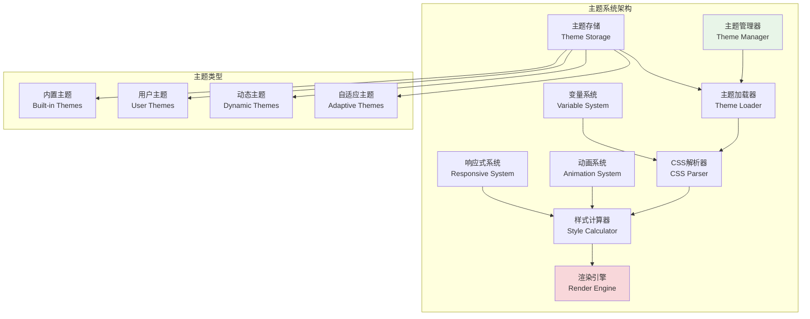
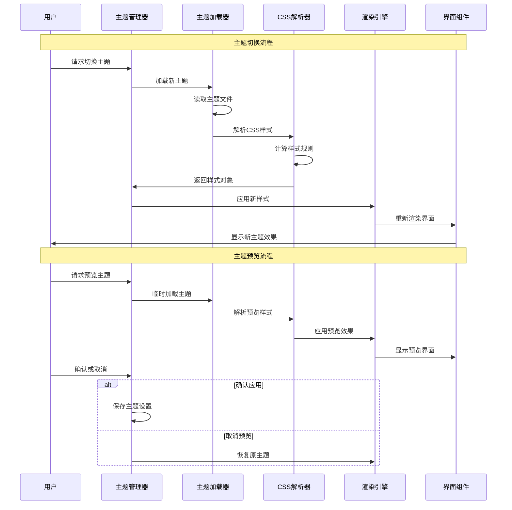

# 主题系统设计

## 🎯 学习目标

通过本章学习，您将能够：
- 理解TUI主题系统的设计原理和架构
- 掌握CSS样式和主题变量的使用技巧
- 学会创建动态主题切换和自定义主题
- 在Chat-Room项目中实现完整的主题系统

## 🎨 主题系统架构

### 主题系统概览



### 主题切换流程



## 🎭 主题系统实现

### Chat-Room主题管理器

```python
# client/tui/theme_system.py - 主题系统
import json
import os
from typing import Dict, List, Optional, Any, Callable
from dataclasses import dataclass, asdict
from enum import Enum
import yaml
from pathlib import Path

class ThemeType(Enum):
    """主题类型"""
    BUILT_IN = "built_in"
    USER_CUSTOM = "user_custom"
    DYNAMIC = "dynamic"
    ADAPTIVE = "adaptive"

@dataclass
class ColorScheme:
    """颜色方案"""
    # 主要颜色
    primary: str
    secondary: str
    accent: str
    
    # 背景颜色
    background: str
    surface: str
    overlay: str
    
    # 文本颜色
    text_primary: str
    text_secondary: str
    text_disabled: str
    
    # 状态颜色
    success: str
    warning: str
    error: str
    info: str
    
    # 边框颜色
    border: str
    border_focus: str
    border_hover: str
    
    def to_css_variables(self) -> Dict[str, str]:
        """转换为CSS变量"""
        return {
            f"--{key.replace('_', '-')}": value
            for key, value in asdict(self).items()
        }

@dataclass
class Typography:
    """字体排版"""
    font_family: str = "monospace"
    font_size_xs: int = 10
    font_size_sm: int = 12
    font_size_md: int = 14
    font_size_lg: int = 16
    font_size_xl: int = 20
    line_height: float = 1.4
    letter_spacing: float = 0.0

@dataclass
class Spacing:
    """间距系统"""
    xs: int = 1
    sm: int = 2
    md: int = 4
    lg: int = 8
    xl: int = 16
    xxl: int = 32

@dataclass
class BorderRadius:
    """圆角系统"""
    none: int = 0
    sm: int = 2
    md: int = 4
    lg: int = 8
    full: int = 999

@dataclass
class Animation:
    """动画配置"""
    duration_fast: float = 0.1
    duration_normal: float = 0.2
    duration_slow: float = 0.3
    easing: str = "ease-in-out"

@dataclass
class Theme:
    """主题定义"""
    name: str
    display_name: str
    description: str
    author: str
    version: str
    theme_type: ThemeType
    
    # 设计系统
    colors: ColorScheme
    typography: Typography
    spacing: Spacing
    border_radius: BorderRadius
    animation: Animation
    
    # 自定义CSS
    custom_css: str = ""
    
    # 元数据
    preview_image: Optional[str] = None
    tags: List[str] = None
    
    def __post_init__(self):
        if self.tags is None:
            self.tags = []
    
    def to_css(self) -> str:
        """生成CSS样式"""
        css_parts = []
        
        # CSS变量定义
        css_parts.append(":root {")
        
        # 颜色变量
        for key, value in self.colors.to_css_variables().items():
            css_parts.append(f"  {key}: {value};")
        
        # 字体变量
        css_parts.append(f"  --font-family: {self.typography.font_family};")
        css_parts.append(f"  --font-size-xs: {self.typography.font_size_xs}px;")
        css_parts.append(f"  --font-size-sm: {self.typography.font_size_sm}px;")
        css_parts.append(f"  --font-size-md: {self.typography.font_size_md}px;")
        css_parts.append(f"  --font-size-lg: {self.typography.font_size_lg}px;")
        css_parts.append(f"  --font-size-xl: {self.typography.font_size_xl}px;")
        css_parts.append(f"  --line-height: {self.typography.line_height};")
        
        # 间距变量
        css_parts.append(f"  --spacing-xs: {self.spacing.xs};")
        css_parts.append(f"  --spacing-sm: {self.spacing.sm};")
        css_parts.append(f"  --spacing-md: {self.spacing.md};")
        css_parts.append(f"  --spacing-lg: {self.spacing.lg};")
        css_parts.append(f"  --spacing-xl: {self.spacing.xl};")
        css_parts.append(f"  --spacing-xxl: {self.spacing.xxl};")
        
        # 圆角变量
        css_parts.append(f"  --border-radius-sm: {self.border_radius.sm};")
        css_parts.append(f"  --border-radius-md: {self.border_radius.md};")
        css_parts.append(f"  --border-radius-lg: {self.border_radius.lg};")
        
        # 动画变量
        css_parts.append(f"  --animation-duration-fast: {self.animation.duration_fast}s;")
        css_parts.append(f"  --animation-duration-normal: {self.animation.duration_normal}s;")
        css_parts.append(f"  --animation-duration-slow: {self.animation.duration_slow}s;")
        css_parts.append(f"  --animation-easing: {self.animation.easing};")
        
        css_parts.append("}")
        
        # 添加自定义CSS
        if self.custom_css:
            css_parts.append("")
            css_parts.append(self.custom_css)
        
        return "\n".join(css_parts)

class ThemeManager:
    """
    主题管理器
    
    功能：
    1. 主题的加载、保存和管理
    2. 动态主题切换
    3. 主题预览和自定义
    4. 主题的导入导出
    """
    
    def __init__(self, themes_dir: str = "themes"):
        self.themes_dir = Path(themes_dir)
        self.themes_dir.mkdir(exist_ok=True)
        
        # 主题存储
        self.themes: Dict[str, Theme] = {}
        self.current_theme: Optional[Theme] = None
        
        # 主题变更回调
        self.theme_change_callbacks: List[Callable[[Theme], None]] = []
        
        # 初始化内置主题
        self._init_built_in_themes()
        
        # 加载用户主题
        self._load_user_themes()
    
    def _init_built_in_themes(self):
        """初始化内置主题"""
        # 深色主题
        dark_theme = Theme(
            name="dark",
            display_name="深色主题",
            description="经典的深色主题，适合长时间使用",
            author="Chat-Room Team",
            version="1.0.0",
            theme_type=ThemeType.BUILT_IN,
            colors=ColorScheme(
                primary="#00D4FF",
                secondary="#FF6B6B", 
                accent="#4ECDC4",
                background="#1A1A1A",
                surface="#2D2D2D",
                overlay="#3D3D3D",
                text_primary="#FFFFFF",
                text_secondary="#B0B0B0",
                text_disabled="#666666",
                success="#4CAF50",
                warning="#FF9800",
                error="#F44336",
                info="#2196F3",
                border="#404040",
                border_focus="#00D4FF",
                border_hover="#555555"
            ),
            typography=Typography(),
            spacing=Spacing(),
            border_radius=BorderRadius(),
            animation=Animation(),
            tags=["dark", "classic", "professional"]
        )
        
        # 浅色主题
        light_theme = Theme(
            name="light",
            display_name="浅色主题",
            description="清新的浅色主题，适合白天使用",
            author="Chat-Room Team",
            version="1.0.0",
            theme_type=ThemeType.BUILT_IN,
            colors=ColorScheme(
                primary="#0066CC",
                secondary="#E91E63",
                accent="#009688",
                background="#FFFFFF",
                surface="#F5F5F5",
                overlay="#EEEEEE",
                text_primary="#212121",
                text_secondary="#757575",
                text_disabled="#BDBDBD",
                success="#4CAF50",
                warning="#FF9800",
                error="#F44336",
                info="#2196F3",
                border="#E0E0E0",
                border_focus="#0066CC",
                border_hover="#CCCCCC"
            ),
            typography=Typography(),
            spacing=Spacing(),
            border_radius=BorderRadius(),
            animation=Animation(),
            tags=["light", "clean", "modern"]
        )
        
        # 高对比度主题
        high_contrast_theme = Theme(
            name="high_contrast",
            display_name="高对比度主题",
            description="高对比度主题，提升可访问性",
            author="Chat-Room Team",
            version="1.0.0",
            theme_type=ThemeType.BUILT_IN,
            colors=ColorScheme(
                primary="#FFFF00",
                secondary="#FF0000",
                accent="#00FF00",
                background="#000000",
                surface="#333333",
                overlay="#666666",
                text_primary="#FFFFFF",
                text_secondary="#CCCCCC",
                text_disabled="#999999",
                success="#00FF00",
                warning="#FFFF00",
                error="#FF0000",
                info="#00FFFF",
                border="#FFFFFF",
                border_focus="#FFFF00",
                border_hover="#CCCCCC"
            ),
            typography=Typography(),
            spacing=Spacing(),
            border_radius=BorderRadius(),
            animation=Animation(),
            tags=["accessibility", "high-contrast", "a11y"]
        )
        
        # 注册内置主题
        self.themes["dark"] = dark_theme
        self.themes["light"] = light_theme
        self.themes["high_contrast"] = high_contrast_theme
        
        # 设置默认主题
        self.current_theme = dark_theme
    
    def _load_user_themes(self):
        """加载用户主题"""
        for theme_file in self.themes_dir.glob("*.yaml"):
            try:
                with open(theme_file, 'r', encoding='utf-8') as f:
                    theme_data = yaml.safe_load(f)
                
                theme = self._parse_theme_data(theme_data)
                if theme:
                    self.themes[theme.name] = theme
                    
            except Exception as e:
                print(f"加载主题文件失败 {theme_file}: {e}")
    
    def _parse_theme_data(self, data: Dict[str, Any]) -> Optional[Theme]:
        """解析主题数据"""
        try:
            # 解析颜色方案
            colors_data = data.get("colors", {})
            colors = ColorScheme(**colors_data)
            
            # 解析字体排版
            typography_data = data.get("typography", {})
            typography = Typography(**typography_data)
            
            # 解析间距
            spacing_data = data.get("spacing", {})
            spacing = Spacing(**spacing_data)
            
            # 解析圆角
            border_radius_data = data.get("border_radius", {})
            border_radius = BorderRadius(**border_radius_data)
            
            # 解析动画
            animation_data = data.get("animation", {})
            animation = Animation(**animation_data)
            
            # 创建主题对象
            theme = Theme(
                name=data["name"],
                display_name=data["display_name"],
                description=data.get("description", ""),
                author=data.get("author", "Unknown"),
                version=data.get("version", "1.0.0"),
                theme_type=ThemeType(data.get("theme_type", "user_custom")),
                colors=colors,
                typography=typography,
                spacing=spacing,
                border_radius=border_radius,
                animation=animation,
                custom_css=data.get("custom_css", ""),
                tags=data.get("tags", [])
            )
            
            return theme
            
        except Exception as e:
            print(f"解析主题数据失败: {e}")
            return None
    
    def get_theme(self, theme_name: str) -> Optional[Theme]:
        """获取主题"""
        return self.themes.get(theme_name)
    
    def get_all_themes(self) -> List[Theme]:
        """获取所有主题"""
        return list(self.themes.values())
    
    def get_themes_by_type(self, theme_type: ThemeType) -> List[Theme]:
        """按类型获取主题"""
        return [theme for theme in self.themes.values() if theme.theme_type == theme_type]
    
    def get_themes_by_tag(self, tag: str) -> List[Theme]:
        """按标签获取主题"""
        return [theme for theme in self.themes.values() if tag in theme.tags]
    
    def set_current_theme(self, theme_name: str) -> bool:
        """设置当前主题"""
        theme = self.get_theme(theme_name)
        if not theme:
            return False
        
        old_theme = self.current_theme
        self.current_theme = theme
        
        # 触发主题变更回调
        for callback in self.theme_change_callbacks:
            try:
                callback(theme)
            except Exception as e:
                print(f"主题变更回调失败: {e}")
        
        return True
    
    def get_current_theme(self) -> Optional[Theme]:
        """获取当前主题"""
        return self.current_theme
    
    def add_theme_change_callback(self, callback: Callable[[Theme], None]):
        """添加主题变更回调"""
        self.theme_change_callbacks.append(callback)
    
    def remove_theme_change_callback(self, callback: Callable[[Theme], None]):
        """移除主题变更回调"""
        if callback in self.theme_change_callbacks:
            self.theme_change_callbacks.remove(callback)
    
    def save_theme(self, theme: Theme) -> bool:
        """保存主题到文件"""
        try:
            theme_file = self.themes_dir / f"{theme.name}.yaml"
            
            # 转换为字典
            theme_data = {
                "name": theme.name,
                "display_name": theme.display_name,
                "description": theme.description,
                "author": theme.author,
                "version": theme.version,
                "theme_type": theme.theme_type.value,
                "colors": asdict(theme.colors),
                "typography": asdict(theme.typography),
                "spacing": asdict(theme.spacing),
                "border_radius": asdict(theme.border_radius),
                "animation": asdict(theme.animation),
                "custom_css": theme.custom_css,
                "tags": theme.tags
            }
            
            # 保存到文件
            with open(theme_file, 'w', encoding='utf-8') as f:
                yaml.dump(theme_data, f, default_flow_style=False, allow_unicode=True)
            
            # 添加到主题列表
            self.themes[theme.name] = theme
            
            return True
            
        except Exception as e:
            print(f"保存主题失败: {e}")
            return False
    
    def delete_theme(self, theme_name: str) -> bool:
        """删除主题"""
        theme = self.get_theme(theme_name)
        if not theme:
            return False
        
        # 不能删除内置主题
        if theme.theme_type == ThemeType.BUILT_IN:
            return False
        
        try:
            # 删除文件
            theme_file = self.themes_dir / f"{theme_name}.yaml"
            if theme_file.exists():
                theme_file.unlink()
            
            # 从主题列表中移除
            del self.themes[theme_name]
            
            # 如果是当前主题，切换到默认主题
            if self.current_theme and self.current_theme.name == theme_name:
                self.set_current_theme("dark")
            
            return True
            
        except Exception as e:
            print(f"删除主题失败: {e}")
            return False
    
    def export_theme(self, theme_name: str, export_path: str) -> bool:
        """导出主题"""
        theme = self.get_theme(theme_name)
        if not theme:
            return False
        
        try:
            export_file = Path(export_path)
            export_file.parent.mkdir(parents=True, exist_ok=True)
            
            # 创建导出数据
            export_data = {
                "name": theme.name,
                "display_name": theme.display_name,
                "description": theme.description,
                "author": theme.author,
                "version": theme.version,
                "theme_type": theme.theme_type.value,
                "colors": asdict(theme.colors),
                "typography": asdict(theme.typography),
                "spacing": asdict(theme.spacing),
                "border_radius": asdict(theme.border_radius),
                "animation": asdict(theme.animation),
                "custom_css": theme.custom_css,
                "tags": theme.tags,
                "exported_at": str(datetime.now()),
                "exported_by": "Chat-Room Theme Manager"
            }
            
            # 保存到文件
            with open(export_file, 'w', encoding='utf-8') as f:
                yaml.dump(export_data, f, default_flow_style=False, allow_unicode=True)
            
            return True
            
        except Exception as e:
            print(f"导出主题失败: {e}")
            return False
    
    def import_theme(self, import_path: str) -> bool:
        """导入主题"""
        try:
            with open(import_path, 'r', encoding='utf-8') as f:
                theme_data = yaml.safe_load(f)
            
            theme = self._parse_theme_data(theme_data)
            if not theme:
                return False
            
            # 检查主题名冲突
            if theme.name in self.themes:
                # 生成新名称
                base_name = theme.name
                counter = 1
                while f"{base_name}_{counter}" in self.themes:
                    counter += 1
                theme.name = f"{base_name}_{counter}"
            
            # 保存主题
            return self.save_theme(theme)
            
        except Exception as e:
            print(f"导入主题失败: {e}")
            return False

# 使用示例
def demo_theme_system():
    """主题系统演示"""
    theme_manager = ThemeManager()
    
    print("=== Chat-Room主题系统演示 ===")
    
    # 列出所有主题
    themes = theme_manager.get_all_themes()
    print(f"可用主题数量: {len(themes)}")
    
    for theme in themes:
        print(f"- {theme.display_name} ({theme.name}) - {theme.description}")
    
    # 切换主题
    print("\n切换到浅色主题...")
    success = theme_manager.set_current_theme("light")
    print(f"切换结果: {'成功' if success else '失败'}")
    
    # 获取当前主题
    current = theme_manager.get_current_theme()
    if current:
        print(f"当前主题: {current.display_name}")
        print(f"主要颜色: {current.colors.primary}")
    
    # 生成CSS
    if current:
        css = current.to_css()
        print(f"\nCSS样式长度: {len(css)} 字符")
        print("CSS预览:")
        print(css[:200] + "..." if len(css) > 200 else css)

if __name__ == "__main__":
    demo_theme_system()
```

## 🎯 实践练习

### 练习1：动态主题生成
```python
class DynamicThemeGenerator:
    """
    动态主题生成练习
    
    要求：
    1. 基于用户偏好自动生成主题
    2. 支持颜色的智能搭配算法
    3. 实现主题的实时预览功能
    4. 提供主题的评分和推荐
    """
    
    def generate_theme_from_color(self, base_color: str) -> Theme:
        """基于基础颜色生成主题"""
        # TODO: 实现颜色搭配算法
        pass
    
    def analyze_user_preferences(self, user_id: int) -> Dict[str, Any]:
        """分析用户偏好"""
        # TODO: 实现用户偏好分析
        pass
```

### 练习2：主题动画系统
```python
class ThemeAnimationSystem:
    """
    主题动画系统练习
    
    要求：
    1. 实现主题切换的平滑动画
    2. 支持颜色渐变和过渡效果
    3. 添加主题预览的动画演示
    4. 优化动画性能和用户体验
    """
    
    def animate_theme_transition(self, from_theme: Theme, to_theme: Theme):
        """主题切换动画"""
        # TODO: 实现主题切换动画
        pass
    
    def create_color_transition(self, from_color: str, to_color: str, duration: float):
        """颜色过渡动画"""
        # TODO: 实现颜色过渡
        pass
```

## ✅ 学习检查

完成本章学习后，请确认您能够：

- [ ] 理解主题系统的设计原理和架构
- [ ] 创建和管理自定义主题
- [ ] 实现动态主题切换功能
- [ ] 使用CSS变量和样式系统
- [ ] 设计主题的导入导出功能
- [ ] 完成实践练习

## 📚 下一步

主题系统设计掌握后，请继续学习：
- [第9章：管理员系统](../09-admin-system/permission-model.md)

---

**恭喜！您已经完成了用户界面设计的学习！** 🎭
