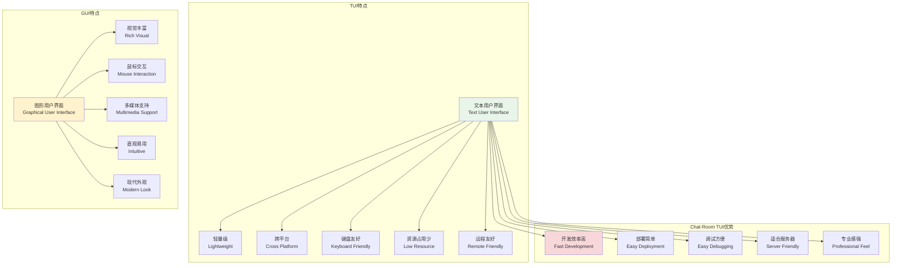
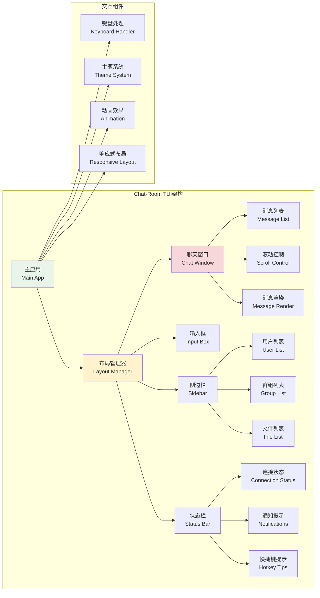

# TUI概念与设计

## 🎯 学习目标

通过本章学习，您将能够：
- 理解TUI（文本用户界面）的概念和优势
- 掌握现代TUI设计的原理和最佳实践
- 学会使用Python Textual框架构建交互式界面
- 在Chat-Room项目中设计优雅的终端用户界面

## 🖥️ TUI设计理念

### TUI vs GUI 对比分析



### Chat-Room TUI架构设计



## 🎨 TUI设计原则

### 现代TUI设计实现

```python
# client/tui/design_principles.py - TUI设计原则
from typing import Dict, List, Tuple, Optional, Any
from dataclasses import dataclass
from enum import Enum
import re

class ColorScheme(Enum):
    """颜色方案"""
    DARK = "dark"
    LIGHT = "light"
    HIGH_CONTRAST = "high_contrast"
    CUSTOM = "custom"

class LayoutType(Enum):
    """布局类型"""
    HORIZONTAL = "horizontal"
    VERTICAL = "vertical"
    GRID = "grid"
    STACK = "stack"

@dataclass
class DesignToken:
    """设计令牌"""
    name: str
    value: Any
    category: str
    description: str

@dataclass
class ColorPalette:
    """颜色调色板"""
    primary: str
    secondary: str
    accent: str
    background: str
    surface: str
    text_primary: str
    text_secondary: str
    success: str
    warning: str
    error: str
    info: str

class TUIDesignSystem:
    """
    TUI设计系统
    
    功能：
    1. 统一的设计语言和视觉规范
    2. 可复用的组件和样式
    3. 响应式布局和自适应设计
    4. 无障碍访问和键盘导航
    """
    
    def __init__(self):
        # 设计令牌
        self.design_tokens: Dict[str, DesignToken] = {}
        
        # 颜色调色板
        self.color_palettes: Dict[ColorScheme, ColorPalette] = {}
        
        # 布局规则
        self.layout_rules: Dict[str, Dict[str, Any]] = {}
        
        # 组件样式
        self.component_styles: Dict[str, Dict[str, Any]] = {}
        
        # 初始化默认设计系统
        self._init_design_tokens()
        self._init_color_palettes()
        self._init_layout_rules()
        self._init_component_styles()
    
    def _init_design_tokens(self):
        """初始化设计令牌"""
        tokens = [
            # 间距
            DesignToken("spacing-xs", 1, "spacing", "极小间距"),
            DesignToken("spacing-sm", 2, "spacing", "小间距"),
            DesignToken("spacing-md", 4, "spacing", "中等间距"),
            DesignToken("spacing-lg", 8, "spacing", "大间距"),
            DesignToken("spacing-xl", 16, "spacing", "极大间距"),
            
            # 字体大小
            DesignToken("font-size-xs", 10, "typography", "极小字体"),
            DesignToken("font-size-sm", 12, "typography", "小字体"),
            DesignToken("font-size-md", 14, "typography", "中等字体"),
            DesignToken("font-size-lg", 16, "typography", "大字体"),
            DesignToken("font-size-xl", 20, "typography", "极大字体"),
            
            # 边框
            DesignToken("border-width-thin", 1, "border", "细边框"),
            DesignToken("border-width-thick", 2, "border", "粗边框"),
            DesignToken("border-radius-sm", 2, "border", "小圆角"),
            DesignToken("border-radius-md", 4, "border", "中圆角"),
            
            # 阴影
            DesignToken("shadow-sm", "▒", "shadow", "小阴影"),
            DesignToken("shadow-md", "▓", "shadow", "中阴影"),
            DesignToken("shadow-lg", "█", "shadow", "大阴影"),
            
            # 动画
            DesignToken("animation-fast", 0.1, "animation", "快速动画"),
            DesignToken("animation-normal", 0.2, "animation", "正常动画"),
            DesignToken("animation-slow", 0.3, "animation", "慢速动画"),
        ]
        
        for token in tokens:
            self.design_tokens[token.name] = token
    
    def _init_color_palettes(self):
        """初始化颜色调色板"""
        # 深色主题
        dark_palette = ColorPalette(
            primary="#00D4FF",      # 青色主色
            secondary="#FF6B6B",    # 红色辅助色
            accent="#4ECDC4",       # 青绿色强调色
            background="#1A1A1A",   # 深灰背景
            surface="#2D2D2D",      # 表面色
            text_primary="#FFFFFF", # 主要文本
            text_secondary="#B0B0B0", # 次要文本
            success="#4CAF50",      # 成功色
            warning="#FF9800",      # 警告色
            error="#F44336",        # 错误色
            info="#2196F3"          # 信息色
        )
        
        # 浅色主题
        light_palette = ColorPalette(
            primary="#0066CC",      # 蓝色主色
            secondary="#E91E63",    # 粉色辅助色
            accent="#009688",       # 青色强调色
            background="#FFFFFF",   # 白色背景
            surface="#F5F5F5",      # 表面色
            text_primary="#212121", # 主要文本
            text_secondary="#757575", # 次要文本
            success="#4CAF50",      # 成功色
            warning="#FF9800",      # 警告色
            error="#F44336",        # 错误色
            info="#2196F3"          # 信息色
        )
        
        # 高对比度主题
        high_contrast_palette = ColorPalette(
            primary="#FFFF00",      # 黄色主色
            secondary="#FF0000",    # 红色辅助色
            accent="#00FF00",       # 绿色强调色
            background="#000000",   # 黑色背景
            surface="#333333",      # 表面色
            text_primary="#FFFFFF", # 白色文本
            text_secondary="#CCCCCC", # 次要文本
            success="#00FF00",      # 成功色
            warning="#FFFF00",      # 警告色
            error="#FF0000",        # 错误色
            info="#00FFFF"          # 信息色
        )
        
        self.color_palettes = {
            ColorScheme.DARK: dark_palette,
            ColorScheme.LIGHT: light_palette,
            ColorScheme.HIGH_CONTRAST: high_contrast_palette
        }
    
    def _init_layout_rules(self):
        """初始化布局规则"""
        self.layout_rules = {
            "chat_window": {
                "min_width": 80,
                "min_height": 24,
                "preferred_ratio": "16:9",
                "responsive_breakpoints": {
                    "small": 80,
                    "medium": 120,
                    "large": 160
                }
            },
            "sidebar": {
                "min_width": 20,
                "max_width": 40,
                "default_width": 25,
                "collapsible": True
            },
            "input_area": {
                "min_height": 3,
                "max_height": 10,
                "auto_expand": True
            },
            "status_bar": {
                "height": 1,
                "always_visible": True,
                "position": "bottom"
            }
        }
    
    def _init_component_styles(self):
        """初始化组件样式"""
        self.component_styles = {
            "message_bubble": {
                "padding": self.get_token("spacing-sm"),
                "margin": self.get_token("spacing-xs"),
                "border_style": "rounded",
                "max_width": "70%"
            },
            "user_list_item": {
                "padding": self.get_token("spacing-xs"),
                "hover_highlight": True,
                "status_indicator": True
            },
            "input_field": {
                "padding": self.get_token("spacing-sm"),
                "border_style": "solid",
                "focus_highlight": True
            },
            "button": {
                "padding": f"{self.get_token('spacing-xs')} {self.get_token('spacing-sm')}",
                "border_style": "rounded",
                "hover_effect": True,
                "press_effect": True
            },
            "modal": {
                "padding": self.get_token("spacing-md"),
                "border_style": "double",
                "shadow": self.get_token("shadow-md"),
                "backdrop": True
            }
        }
    
    def get_token(self, token_name: str) -> Any:
        """获取设计令牌值"""
        token = self.design_tokens.get(token_name)
        return token.value if token else None
    
    def get_color_palette(self, scheme: ColorScheme) -> ColorPalette:
        """获取颜色调色板"""
        return self.color_palettes.get(scheme, self.color_palettes[ColorScheme.DARK])
    
    def get_layout_rule(self, component: str, rule: str = None) -> Any:
        """获取布局规则"""
        component_rules = self.layout_rules.get(component, {})
        if rule:
            return component_rules.get(rule)
        return component_rules
    
    def get_component_style(self, component: str, property: str = None) -> Any:
        """获取组件样式"""
        component_style = self.component_styles.get(component, {})
        if property:
            return component_style.get(property)
        return component_style
    
    def calculate_responsive_layout(self, terminal_width: int, terminal_height: int) -> Dict[str, Dict[str, int]]:
        """计算响应式布局"""
        layout = {}
        
        # 聊天窗口布局
        chat_rules = self.get_layout_rule("chat_window")
        sidebar_rules = self.get_layout_rule("sidebar")
        
        # 确定侧边栏宽度
        if terminal_width >= chat_rules["responsive_breakpoints"]["large"]:
            sidebar_width = sidebar_rules["default_width"]
        elif terminal_width >= chat_rules["responsive_breakpoints"]["medium"]:
            sidebar_width = sidebar_rules["min_width"]
        else:
            sidebar_width = 0  # 小屏幕隐藏侧边栏
        
        # 计算各区域尺寸
        layout["sidebar"] = {
            "width": sidebar_width,
            "height": terminal_height - 2,  # 减去状态栏
            "x": 0,
            "y": 0
        }
        
        layout["chat_area"] = {
            "width": terminal_width - sidebar_width,
            "height": terminal_height - 5,  # 减去输入区域和状态栏
            "x": sidebar_width,
            "y": 0
        }
        
        layout["input_area"] = {
            "width": terminal_width - sidebar_width,
            "height": 3,
            "x": sidebar_width,
            "y": terminal_height - 4
        }
        
        layout["status_bar"] = {
            "width": terminal_width,
            "height": 1,
            "x": 0,
            "y": terminal_height - 1
        }
        
        return layout

class AccessibilityHelper:
    """无障碍访问助手"""
    
    def __init__(self):
        self.screen_reader_mode = False
        self.high_contrast_mode = False
        self.keyboard_navigation_enabled = True
    
    def enable_screen_reader_mode(self):
        """启用屏幕阅读器模式"""
        self.screen_reader_mode = True
        # 增加文本描述，减少视觉元素
    
    def enable_high_contrast_mode(self):
        """启用高对比度模式"""
        self.high_contrast_mode = True
        # 使用高对比度颜色方案
    
    def get_aria_label(self, component_type: str, content: str = "") -> str:
        """生成ARIA标签"""
        labels = {
            "message": f"消息: {content}",
            "user_list": "用户列表",
            "input_field": "消息输入框",
            "send_button": "发送按钮",
            "file_button": "文件按钮",
            "emoji_button": "表情按钮"
        }
        
        return labels.get(component_type, content)
    
    def get_keyboard_shortcuts(self) -> Dict[str, str]:
        """获取键盘快捷键"""
        return {
            "ctrl+n": "新建聊天",
            "ctrl+o": "打开文件",
            "ctrl+s": "保存聊天记录",
            "ctrl+q": "退出应用",
            "tab": "切换焦点",
            "shift+tab": "反向切换焦点",
            "enter": "发送消息",
            "ctrl+enter": "换行",
            "esc": "取消/关闭",
            "f1": "帮助",
            "f11": "全屏切换"
        }

class ResponsiveDesign:
    """响应式设计"""
    
    def __init__(self, design_system: TUIDesignSystem):
        self.design_system = design_system
        self.breakpoints = {
            "xs": 60,   # 极小屏幕
            "sm": 80,   # 小屏幕
            "md": 120,  # 中等屏幕
            "lg": 160,  # 大屏幕
            "xl": 200   # 极大屏幕
        }
    
    def get_screen_size_category(self, width: int, height: int) -> str:
        """获取屏幕尺寸类别"""
        if width < self.breakpoints["xs"]:
            return "xs"
        elif width < self.breakpoints["sm"]:
            return "sm"
        elif width < self.breakpoints["md"]:
            return "md"
        elif width < self.breakpoints["lg"]:
            return "lg"
        else:
            return "xl"
    
    def adapt_layout_for_screen(self, width: int, height: int) -> Dict[str, Any]:
        """为屏幕尺寸适配布局"""
        category = self.get_screen_size_category(width, height)
        
        adaptations = {
            "xs": {
                "sidebar_visible": False,
                "compact_mode": True,
                "single_column": True,
                "minimal_ui": True
            },
            "sm": {
                "sidebar_visible": False,
                "compact_mode": True,
                "single_column": True,
                "minimal_ui": False
            },
            "md": {
                "sidebar_visible": True,
                "sidebar_width": 20,
                "compact_mode": False,
                "single_column": False
            },
            "lg": {
                "sidebar_visible": True,
                "sidebar_width": 25,
                "compact_mode": False,
                "single_column": False
            },
            "xl": {
                "sidebar_visible": True,
                "sidebar_width": 30,
                "compact_mode": False,
                "single_column": False,
                "extra_panels": True
            }
        }
        
        return adaptations.get(category, adaptations["md"])

# 使用示例
def demo_tui_design():
    """TUI设计系统演示"""
    design_system = TUIDesignSystem()
    accessibility = AccessibilityHelper()
    responsive = ResponsiveDesign(design_system)
    
    print("=== TUI设计系统演示 ===")
    
    # 获取设计令牌
    spacing_md = design_system.get_token("spacing-md")
    print(f"中等间距: {spacing_md}")
    
    # 获取颜色调色板
    dark_palette = design_system.get_color_palette(ColorScheme.DARK)
    print(f"深色主题主色: {dark_palette.primary}")
    
    # 获取组件样式
    button_style = design_system.get_component_style("button")
    print(f"按钮样式: {button_style}")
    
    # 计算响应式布局
    layout = design_system.calculate_responsive_layout(120, 40)
    print(f"120x40终端布局: {layout}")
    
    # 无障碍功能
    shortcuts = accessibility.get_keyboard_shortcuts()
    print(f"键盘快捷键: {list(shortcuts.keys())[:5]}...")
    
    # 响应式适配
    adaptations = responsive.adapt_layout_for_screen(80, 24)
    print(f"80x24屏幕适配: {adaptations}")

if __name__ == "__main__":
    demo_tui_design()
```

## 🎯 实践练习

### 练习1：自定义主题系统
```python
class CustomThemeBuilder:
    """
    自定义主题构建器练习
    
    要求：
    1. 支持用户自定义颜色方案
    2. 实现主题的导入导出功能
    3. 提供主题预览和实时切换
    4. 支持主题的继承和扩展
    """
    
    def create_theme_from_base(self, base_theme: str, modifications: Dict[str, str]):
        """基于基础主题创建新主题"""
        # TODO: 实现主题创建逻辑
        pass
    
    def export_theme_to_file(self, theme_name: str, file_path: str):
        """导出主题到文件"""
        # TODO: 实现主题导出
        pass
```

### 练习2：动态布局系统
```python
class DynamicLayoutManager:
    """
    动态布局管理器练习
    
    要求：
    1. 支持拖拽调整面板大小
    2. 实现面板的显示/隐藏切换
    3. 保存和恢复用户布局偏好
    4. 支持多种预设布局模式
    """
    
    def save_layout_preference(self, user_id: int, layout_config: Dict[str, Any]):
        """保存布局偏好"""
        # TODO: 实现布局偏好保存
        pass
    
    def apply_layout_preset(self, preset_name: str):
        """应用预设布局"""
        # TODO: 实现预设布局应用
        pass
```

## ✅ 学习检查

完成本章学习后，请确认您能够：

- [ ] 理解TUI设计的基本概念和优势
- [ ] 掌握现代TUI设计原则和最佳实践
- [ ] 设计统一的视觉规范和组件系统
- [ ] 实现响应式布局和无障碍访问
- [ ] 创建可复用的设计令牌和样式
- [ ] 完成实践练习

## 📚 下一步

TUI概念与设计掌握后，请继续学习：
- [Textual框架](textual-framework.md)
- [组件设计](component-design.md)
- [主题系统](theme-system.md)

---

**现在您已经掌握了现代TUI设计的核心理念！** 🎨
