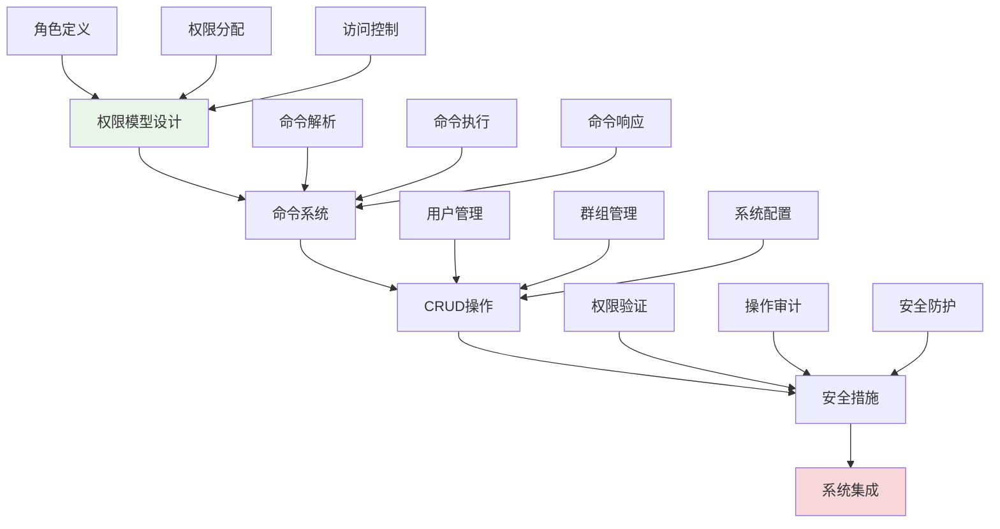
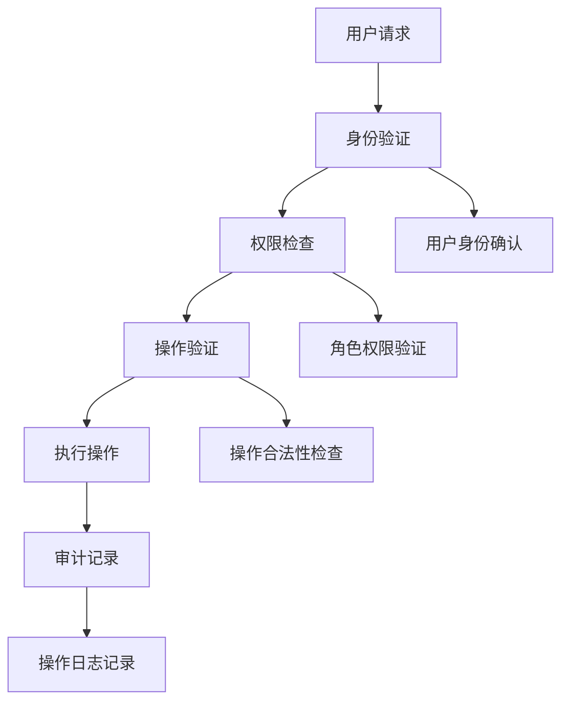

# 第13章：管理员系统

## 🎯 学习目标

通过本章学习，您将能够：
- 设计和实现基于角色的权限控制系统
- 构建灵活的管理员命令系统
- 掌握CRUD操作的设计模式和最佳实践
- 学会实施多层次的安全防护措施
- 建立完整的系统管理和监控机制

## 📖 本章概览

本章将为Chat-Room项目添加完整的管理员系统，包括权限管理、用户管理、群组管理、系统监控等功能。我们将学习如何设计安全可靠的管理系统，确保系统的稳定运行和安全防护。

### 学习路径

## 📚 章节内容

### 1. [权限模型设计](permission-model.md)
**学习时间：** 4-6小时  
**难度等级：** ⭐⭐⭐⭐

学习内容：
- 基于角色的访问控制（RBAC）模型
- 权限层次结构和继承机制
- 动态权限分配和管理
- 权限缓存和性能优化

**Chat-Room应用：** 设计管理员、版主、普通用户等角色，实现细粒度权限控制

### 2. [命令系统设计](command-system.md)
**学习时间：** 6-8小时  
**难度等级：** ⭐⭐⭐⭐

学习内容：
- 命令模式的设计和实现
- 命令解析和参数验证
- 命令执行和结果返回
- 命令历史和撤销机制

**Chat-Room应用：** 实现 `/user`, `/group`, `/ban`, `/kick` 等管理命令

### 3. [CRUD操作实现](crud-operations.md)
**学习时间：** 6-8小时  
**难度等级：** ⭐⭐⭐

学习内容：
- 用户管理的增删改查操作
- 群组管理和成员操作
- 系统配置和参数管理
- 批量操作和事务处理

**Chat-Room应用：** 实现完整的用户和群组管理功能

### 4. [安全措施实施](security-measures.md)
**学习时间：** 4-6小时  
**难度等级：** ⭐⭐⭐⭐

学习内容：
- 多层次权限验证机制
- 操作日志和审计跟踪
- 异常检测和防护措施
- 安全配置和最佳实践

**Chat-Room应用：** 建立完整的安全防护体系，确保管理操作的安全性

## 🔧 前置知识要求

- **数据库系统：** 已完成第8章数据库与用户系统学习
- **多用户聊天：** 已完成第9章多人聊天系统学习
- **权限概念：** 了解基本的权限管理概念
- **安全意识：** 具备基本的信息安全意识

## ⏱️ 预计学习时间

| 内容 | 预计时间 | 累计时间 |
|------|----------|----------|
| 权限模型设计 | 4-6小时 | 4-6小时 |
| 命令系统设计 | 6-8小时 | 10-14小时 |
| CRUD操作实现 | 6-8小时 | 16-22小时 |
| 安全措施实施 | 4-6小时 | 20-28小时 |
| **总计** | **20-28小时** | **3-4天** |

## 📋 学习顺序建议

### 第1天：权限设计
1. **权限模型设计** - 建立权限管理框架
2. **角色定义和分配** - 设计用户角色体系

### 第2天：命令系统
3. **命令系统设计** - 实现管理命令框架
4. **命令解析和执行** - 处理管理员指令

### 第3天：CRUD操作
5. **用户管理操作** - 实现用户增删改查
6. **群组管理操作** - 实现群组管理功能

### 第4天：安全加固
7. **安全措施实施** - 加强系统安全性
8. **系统集成测试** - 验证管理功能

## ✅ 学习检查清单

### 权限管理能力
- [ ] 能够设计合理的权限模型
- [ ] 理解RBAC权限控制机制
- [ ] 掌握动态权限分配方法
- [ ] 会实现权限缓存优化

### 命令系统能力
- [ ] 能够设计灵活的命令系统
- [ ] 掌握命令模式的应用
- [ ] 理解命令解析和验证
- [ ] 会实现命令历史功能

### CRUD操作能力
- [ ] 能够实现完整的用户管理
- [ ] 掌握群组管理操作
- [ ] 理解批量操作和事务
- [ ] 会处理数据一致性问题

### 安全防护能力
- [ ] 能够实施多层次权限验证
- [ ] 掌握操作审计和日志记录
- [ ] 理解异常检测机制
- [ ] 会配置安全防护措施

## 🎯 实践项目

### 阶段性项目：完整管理员系统
在学习过程中，您将构建一个功能完整的管理员系统：

1. **权限设计阶段：** 设计角色和权限体系
2. **命令系统阶段：** 实现管理员命令接口
3. **管理功能阶段：** 实现用户和群组管理
4. **安全加固阶段：** 添加安全防护措施

### 项目特性
- 基于角色的权限控制
- 丰富的管理员命令
- 完整的用户和群组管理
- 全面的安全防护机制

## 🚨 学习难点和解决方案

### 常见难点
1. **权限模型复杂性**
   - 解决方案：从简单的角色开始，逐步增加权限粒度
   - 重点理解：权限继承和组合机制

2. **命令系统设计**
   - 解决方案：使用命令模式，保持命令的独立性和可扩展性
   - 重点理解：命令解析和参数验证

3. **安全防护平衡**
   - 解决方案：在安全性和易用性之间找到平衡点
   - 重点理解：多层次防护和用户体验

### 学习技巧
- **安全优先：** 始终将安全性放在首位
- **模块化设计：** 保持各个功能模块的独立性
- **测试驱动：** 为每个管理功能编写测试用例
- **日志记录：** 详细记录所有管理操作

## 🔒 安全架构

### 权限验证层次

### 安全措施
- **身份验证**：多因子认证支持
- **权限控制**：最小权限原则
- **操作审计**：完整的操作日志
- **异常监控**：实时安全监控

## 👑 管理员功能

### 用户管理
- 用户信息查看和修改
- 用户状态管理（禁用/启用）
- 用户权限分配和回收
- 批量用户操作

### 群组管理
- 群组创建和删除
- 成员管理和权限设置
- 群组配置和规则管理
- 群组统计和监控

### 系统管理
- 系统配置参数管理
- 服务状态监控和控制
- 日志查看和分析
- 性能监控和优化

## 📊 监控和统计

### 实时监控
- 在线用户统计
- 系统资源使用情况
- 消息传输统计
- 错误和异常监控

### 历史分析
- 用户活跃度分析
- 系统性能趋势
- 安全事件统计
- 操作审计报告

## 📚 下一步学习

管理员系统完成后，请继续学习：
- [第14章：日志与错误处理](../14-logging-error-handling/README.md) - 完善系统监控和诊断能力

---

**恭喜！您的Chat-Room现在具备了专业级的管理和监控能力！** 👑

*本章最后更新：2025-01-17*
