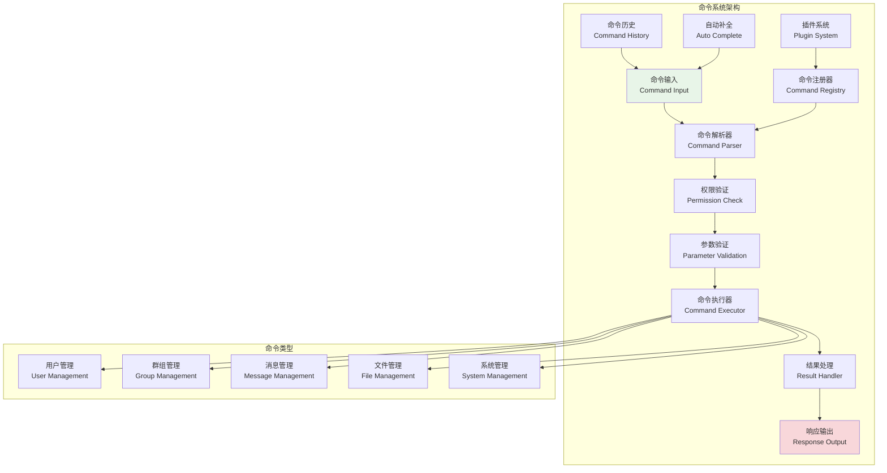
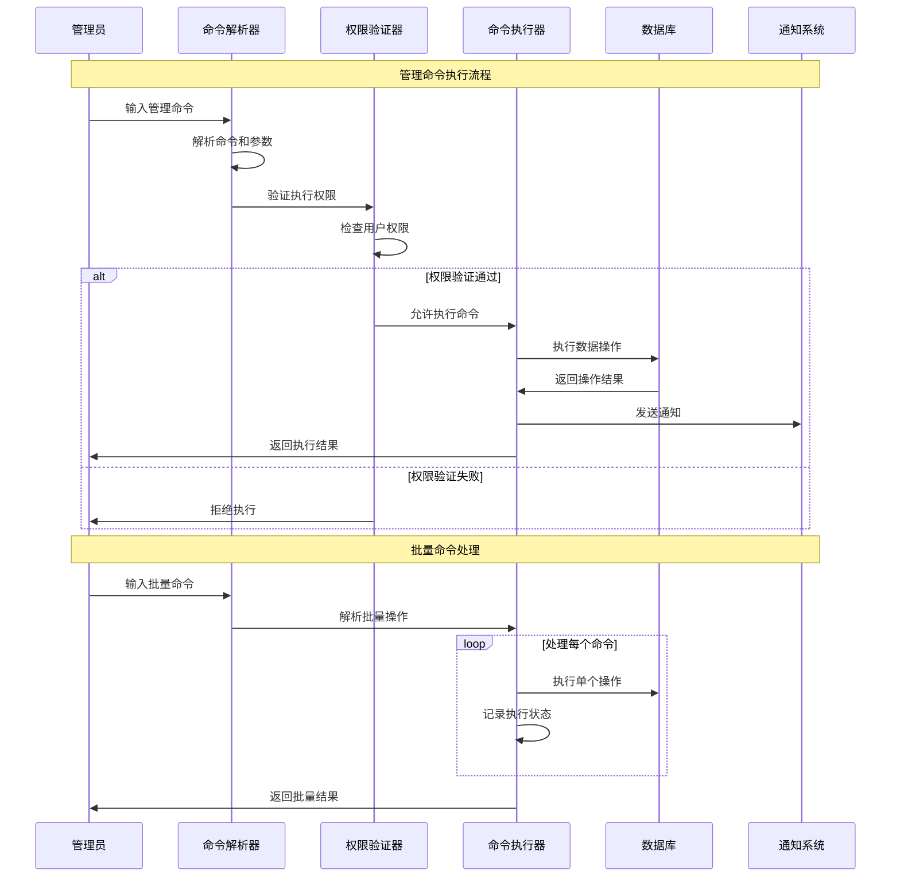

# 命令系统设计

## 🎯 学习目标

通过本章学习，您将能够：
- 理解Chat-Room管理员命令系统的设计架构
- 掌握命令解析、验证和执行的核心技术
- 学会设计可扩展的命令插件系统
- 在Chat-Room项目中实现完整的管理命令功能

## ⚡ 命令系统架构

### 命令系统概览



### 命令执行流程



## 🔧 命令系统实现

### Chat-Room命令系统核心实现

```python
# server/admin/command_system.py - 命令系统
from typing import Dict, List, Optional, Any, Callable, Union
from dataclasses import dataclass, field
from enum import Enum
from abc import ABC, abstractmethod
import re
import shlex
import asyncio
from datetime import datetime
import json

class CommandType(Enum):
    """命令类型"""
    USER = "user"
    GROUP = "group"
    MESSAGE = "message"
    FILE = "file"
    SYSTEM = "system"
    PLUGIN = "plugin"

class CommandResult:
    """命令执行结果"""
    def __init__(self, success: bool, message: str = "", data: Any = None, 
                 error_code: str = None):
        self.success = success
        self.message = message
        self.data = data
        self.error_code = error_code
        self.timestamp = datetime.now()
    
    def to_dict(self) -> Dict[str, Any]:
        """转换为字典"""
        return {
            "success": self.success,
            "message": self.message,
            "data": self.data,
            "error_code": self.error_code,
            "timestamp": self.timestamp.isoformat()
        }

@dataclass
class CommandParameter:
    """命令参数定义"""
    name: str
    type: type
    required: bool = True
    default: Any = None
    description: str = ""
    choices: List[Any] = field(default_factory=list)
    validator: Optional[Callable[[Any], bool]] = None
    
    def validate(self, value: Any) -> bool:
        """验证参数值"""
        # 类型检查
        if not isinstance(value, self.type):
            try:
                value = self.type(value)
            except (ValueError, TypeError):
                return False
        
        # 选择检查
        if self.choices and value not in self.choices:
            return False
        
        # 自定义验证
        if self.validator and not self.validator(value):
            return False
        
        return True

class Command(ABC):
    """命令基类"""
    
    def __init__(self, name: str, description: str, command_type: CommandType,
                 required_permission: str = None):
        self.name = name
        self.description = description
        self.command_type = command_type
        self.required_permission = required_permission
        self.parameters: Dict[str, CommandParameter] = {}
        self.aliases: List[str] = []
        self.examples: List[str] = []
    
    def add_parameter(self, param: CommandParameter):
        """添加参数"""
        self.parameters[param.name] = param
    
    def add_alias(self, alias: str):
        """添加别名"""
        self.aliases.append(alias)
    
    def add_example(self, example: str):
        """添加使用示例"""
        self.examples.append(example)
    
    def validate_parameters(self, params: Dict[str, Any]) -> tuple[bool, str]:
        """验证参数"""
        # 检查必需参数
        for param_name, param_def in self.parameters.items():
            if param_def.required and param_name not in params:
                return False, f"缺少必需参数: {param_name}"
        
        # 验证参数值
        for param_name, value in params.items():
            if param_name in self.parameters:
                param_def = self.parameters[param_name]
                if not param_def.validate(value):
                    return False, f"参数 {param_name} 值无效: {value}"
        
        return True, ""
    
    @abstractmethod
    async def execute(self, user_id: int, params: Dict[str, Any], 
                     context: Dict[str, Any] = None) -> CommandResult:
        """执行命令"""
        pass
    
    def get_help(self) -> str:
        """获取帮助信息"""
        help_text = [f"命令: {self.name}"]
        help_text.append(f"描述: {self.description}")
        
        if self.aliases:
            help_text.append(f"别名: {', '.join(self.aliases)}")
        
        if self.parameters:
            help_text.append("参数:")
            for param_name, param_def in self.parameters.items():
                required_mark = "*" if param_def.required else ""
                help_text.append(f"  {param_name}{required_mark}: {param_def.description}")
                if param_def.choices:
                    help_text.append(f"    可选值: {', '.join(map(str, param_def.choices))}")
        
        if self.examples:
            help_text.append("示例:")
            for example in self.examples:
                help_text.append(f"  {example}")
        
        return "\n".join(help_text)

class UserManagementCommands:
    """用户管理命令集"""
    
    class ListUsersCommand(Command):
        """列出用户命令"""
        
        def __init__(self):
            super().__init__("list_users", "列出所有用户", CommandType.USER, "user_read")
            
            self.add_parameter(CommandParameter(
                "status", str, False, "all", "用户状态过滤",
                choices=["all", "online", "offline", "banned"]
            ))
            self.add_parameter(CommandParameter(
                "limit", int, False, 50, "返回数量限制"
            ))
            
            self.add_alias("users")
            self.add_example("/admin list_users")
            self.add_example("/admin list_users --status online --limit 20")
        
        async def execute(self, user_id: int, params: Dict[str, Any], 
                         context: Dict[str, Any] = None) -> CommandResult:
            """执行列出用户命令"""
            # 模拟用户数据
            users = [
                {"id": 1, "username": "alice", "status": "online", "last_login": "2024-01-15"},
                {"id": 2, "username": "bob", "status": "offline", "last_login": "2024-01-14"},
                {"id": 3, "username": "charlie", "status": "banned", "last_login": "2024-01-10"},
            ]
            
            status_filter = params.get("status", "all")
            limit = params.get("limit", 50)
            
            # 过滤用户
            if status_filter != "all":
                users = [u for u in users if u["status"] == status_filter]
            
            # 限制数量
            users = users[:limit]
            
            return CommandResult(
                success=True,
                message=f"找到 {len(users)} 个用户",
                data={"users": users, "total": len(users)}
            )
    
    class BanUserCommand(Command):
        """封禁用户命令"""
        
        def __init__(self):
            super().__init__("ban_user", "封禁用户", CommandType.USER, "user_ban")
            
            self.add_parameter(CommandParameter(
                "user_id", int, True, description="用户ID"
            ))
            self.add_parameter(CommandParameter(
                "reason", str, False, "违规行为", "封禁原因"
            ))
            self.add_parameter(CommandParameter(
                "duration", int, False, 0, "封禁时长（小时，0表示永久）"
            ))
            
            self.add_alias("ban")
            self.add_example("/admin ban_user --user_id 123 --reason 发送垃圾信息")
            self.add_example("/admin ban --user_id 456 --reason 恶意行为 --duration 24")
        
        async def execute(self, user_id: int, params: Dict[str, Any], 
                         context: Dict[str, Any] = None) -> CommandResult:
            """执行封禁用户命令"""
            target_user_id = params["user_id"]
            reason = params.get("reason", "违规行为")
            duration = params.get("duration", 0)
            
            # 检查用户是否存在
            if target_user_id == user_id:
                return CommandResult(
                    success=False,
                    message="不能封禁自己",
                    error_code="CANNOT_BAN_SELF"
                )
            
            # 模拟封禁操作
            ban_info = {
                "user_id": target_user_id,
                "banned_by": user_id,
                "reason": reason,
                "duration": duration,
                "banned_at": datetime.now().isoformat()
            }
            
            duration_text = f"{duration}小时" if duration > 0 else "永久"
            
            return CommandResult(
                success=True,
                message=f"用户 {target_user_id} 已被封禁（{duration_text}）",
                data=ban_info
            )

class GroupManagementCommands:
    """群组管理命令集"""
    
    class CreateGroupCommand(Command):
        """创建群组命令"""
        
        def __init__(self):
            super().__init__("create_group", "创建新群组", CommandType.GROUP, "group_create")
            
            self.add_parameter(CommandParameter(
                "name", str, True, description="群组名称"
            ))
            self.add_parameter(CommandParameter(
                "description", str, False, "", "群组描述"
            ))
            self.add_parameter(CommandParameter(
                "max_members", int, False, 100, "最大成员数"
            ))
            self.add_parameter(CommandParameter(
                "is_public", bool, False, True, "是否公开群组"
            ))
            
            self.add_example("/admin create_group --name 技术讨论 --description Python学习群")
        
        async def execute(self, user_id: int, params: Dict[str, Any], 
                         context: Dict[str, Any] = None) -> CommandResult:
            """执行创建群组命令"""
            group_info = {
                "id": 12345,  # 模拟生成的群组ID
                "name": params["name"],
                "description": params.get("description", ""),
                "max_members": params.get("max_members", 100),
                "is_public": params.get("is_public", True),
                "created_by": user_id,
                "created_at": datetime.now().isoformat(),
                "member_count": 1
            }
            
            return CommandResult(
                success=True,
                message=f"群组 '{params['name']}' 创建成功",
                data=group_info
            )

class CommandParser:
    """命令解析器"""
    
    def __init__(self):
        self.command_prefix = "/admin"
        self.argument_pattern = re.compile(r'--(\w+)(?:\s+([^-]\S*(?:\s+[^-]\S*)*)|(?=\s+--|\s*$))')
    
    def parse(self, input_text: str) -> tuple[Optional[str], Dict[str, Any], str]:
        """
        解析命令输入
        
        Returns:
            (command_name, parameters, error_message)
        """
        input_text = input_text.strip()
        
        # 检查命令前缀
        if not input_text.startswith(self.command_prefix):
            return None, {}, "不是管理命令"
        
        # 移除前缀
        command_text = input_text[len(self.command_prefix):].strip()
        
        if not command_text:
            return None, {}, "命令不能为空"
        
        try:
            # 使用shlex分割命令和参数
            parts = shlex.split(command_text)
            if not parts:
                return None, {}, "命令格式错误"
            
            command_name = parts[0]
            
            # 解析参数
            params = {}
            remaining_text = " ".join(parts[1:])
            
            # 使用正则表达式解析 --key value 格式的参数
            matches = self.argument_pattern.findall(remaining_text)
            
            for key, value in matches:
                if value:
                    # 尝试转换数据类型
                    params[key] = self._convert_value(value.strip())
                else:
                    # 布尔标志
                    params[key] = True
            
            return command_name, params, ""
            
        except Exception as e:
            return None, {}, f"命令解析错误: {str(e)}"
    
    def _convert_value(self, value: str) -> Any:
        """转换参数值类型"""
        # 尝试转换为数字
        try:
            if '.' in value:
                return float(value)
            else:
                return int(value)
        except ValueError:
            pass
        
        # 尝试转换为布尔值
        if value.lower() in ('true', 'yes', '1', 'on'):
            return True
        elif value.lower() in ('false', 'no', '0', 'off'):
            return False
        
        # 返回字符串
        return value

class CommandRegistry:
    """命令注册器"""
    
    def __init__(self):
        self.commands: Dict[str, Command] = {}
        self.aliases: Dict[str, str] = {}
        
        # 注册内置命令
        self._register_builtin_commands()
    
    def _register_builtin_commands(self):
        """注册内置命令"""
        # 用户管理命令
        self.register(UserManagementCommands.ListUsersCommand())
        self.register(UserManagementCommands.BanUserCommand())
        
        # 群组管理命令
        self.register(GroupManagementCommands.CreateGroupCommand())
    
    def register(self, command: Command):
        """注册命令"""
        self.commands[command.name] = command
        
        # 注册别名
        for alias in command.aliases:
            self.aliases[alias] = command.name
    
    def get_command(self, name: str) -> Optional[Command]:
        """获取命令"""
        # 检查别名
        if name in self.aliases:
            name = self.aliases[name]
        
        return self.commands.get(name)
    
    def list_commands(self, command_type: CommandType = None) -> List[Command]:
        """列出命令"""
        commands = list(self.commands.values())
        
        if command_type:
            commands = [cmd for cmd in commands if cmd.command_type == command_type]
        
        return commands
    
    def get_help(self, command_name: str = None) -> str:
        """获取帮助信息"""
        if command_name:
            command = self.get_command(command_name)
            if command:
                return command.get_help()
            else:
                return f"命令 '{command_name}' 不存在"
        else:
            # 列出所有命令
            help_lines = ["可用的管理命令:"]
            
            for cmd_type in CommandType:
                type_commands = self.list_commands(cmd_type)
                if type_commands:
                    help_lines.append(f"\n{cmd_type.value.upper()}命令:")
                    for cmd in type_commands:
                        help_lines.append(f"  {cmd.name} - {cmd.description}")
            
            help_lines.append("\n使用 '/admin help <命令名>' 查看具体命令的帮助")
            return "\n".join(help_lines)

class CommandExecutor:
    """命令执行器"""
    
    def __init__(self, registry: CommandRegistry, permission_manager):
        self.registry = registry
        self.permission_manager = permission_manager
        self.parser = CommandParser()
        
        # 执行历史
        self.execution_history: List[Dict[str, Any]] = []
    
    async def execute(self, user_id: int, input_text: str, 
                     context: Dict[str, Any] = None) -> CommandResult:
        """执行命令"""
        # 解析命令
        command_name, params, parse_error = self.parser.parse(input_text)
        
        if parse_error:
            return CommandResult(False, parse_error, error_code="PARSE_ERROR")
        
        if not command_name:
            return CommandResult(False, "未识别的命令", error_code="UNKNOWN_COMMAND")
        
        # 获取命令
        command = self.registry.get_command(command_name)
        if not command:
            return CommandResult(False, f"命令 '{command_name}' 不存在", error_code="COMMAND_NOT_FOUND")
        
        # 权限检查
        if command.required_permission:
            # 这里应该调用实际的权限检查
            # has_permission = self.permission_manager.check_permission(user_id, command.required_permission)
            # if not has_permission:
            #     return CommandResult(False, "权限不足", error_code="PERMISSION_DENIED")
            pass
        
        # 参数验证
        valid, validation_error = command.validate_parameters(params)
        if not valid:
            return CommandResult(False, validation_error, error_code="INVALID_PARAMETERS")
        
        try:
            # 执行命令
            result = await command.execute(user_id, params, context)
            
            # 记录执行历史
            self._record_execution(user_id, command_name, params, result)
            
            return result
            
        except Exception as e:
            error_result = CommandResult(False, f"命令执行失败: {str(e)}", error_code="EXECUTION_ERROR")
            self._record_execution(user_id, command_name, params, error_result)
            return error_result
    
    def _record_execution(self, user_id: int, command_name: str, 
                         params: Dict[str, Any], result: CommandResult):
        """记录命令执行历史"""
        record = {
            "user_id": user_id,
            "command": command_name,
            "parameters": params,
            "success": result.success,
            "message": result.message,
            "timestamp": datetime.now().isoformat()
        }
        
        self.execution_history.append(record)
        
        # 保持历史记录数量限制
        if len(self.execution_history) > 1000:
            self.execution_history = self.execution_history[-1000:]
    
    def get_execution_history(self, user_id: int = None, limit: int = 50) -> List[Dict[str, Any]]:
        """获取执行历史"""
        history = self.execution_history
        
        if user_id:
            history = [record for record in history if record["user_id"] == user_id]
        
        return history[-limit:] if history else []

# 使用示例
async def demo_command_system():
    """命令系统演示"""
    registry = CommandRegistry()
    executor = CommandExecutor(registry, None)
    
    print("=== Chat-Room命令系统演示 ===")
    
    # 测试命令
    test_commands = [
        "/admin list_users",
        "/admin list_users --status online --limit 10",
        "/admin ban_user --user_id 123 --reason 发送垃圾信息",
        "/admin create_group --name 技术讨论 --description Python学习群",
        "/admin help",
        "/admin help list_users"
    ]
    
    for cmd in test_commands:
        print(f"\n执行命令: {cmd}")
        result = await executor.execute(1, cmd)
        print(f"结果: {'成功' if result.success else '失败'}")
        print(f"消息: {result.message}")
        if result.data:
            print(f"数据: {json.dumps(result.data, ensure_ascii=False, indent=2)}")

if __name__ == "__main__":
    asyncio.run(demo_command_system())
```

## 🎯 实践练习

### 练习1：命令插件系统
```python
class CommandPlugin:
    """
    命令插件系统练习
    
    要求：
    1. 实现动态命令加载和卸载
    2. 支持命令的热更新机制
    3. 添加命令的依赖管理
    4. 实现命令的版本控制
    """
    
    def load_plugin(self, plugin_path: str) -> bool:
        """加载命令插件"""
        # TODO: 实现插件加载
        pass
    
    def unload_plugin(self, plugin_name: str) -> bool:
        """卸载命令插件"""
        # TODO: 实现插件卸载
        pass
```

### 练习2：批量命令处理
```python
class BatchCommandProcessor:
    """
    批量命令处理练习
    
    要求：
    1. 支持批量命令的并行执行
    2. 实现命令的事务性处理
    3. 添加批量操作的进度跟踪
    4. 支持批量操作的回滚机制
    """
    
    async def execute_batch(self, commands: List[str], user_id: int) -> List[CommandResult]:
        """执行批量命令"""
        # TODO: 实现批量命令执行
        pass
    
    async def rollback_batch(self, batch_id: str) -> bool:
        """回滚批量操作"""
        # TODO: 实现批量回滚
        pass
```

## ✅ 学习检查

完成本章学习后，请确认您能够：

- [ ] 理解命令系统的设计架构和执行流程
- [ ] 实现命令的解析、验证和执行机制
- [ ] 设计可扩展的命令注册和管理系统
- [ ] 开发各种类型的管理命令
- [ ] 处理命令的权限验证和参数校验
- [ ] 完成实践练习

## 📚 下一步

命令系统设计掌握后，请继续学习：
- [CRUD操作](crud-operations.md)
- [安全措施](security-measures.md)

---

**现在您已经掌握了命令系统设计的核心技术！** ⚡
