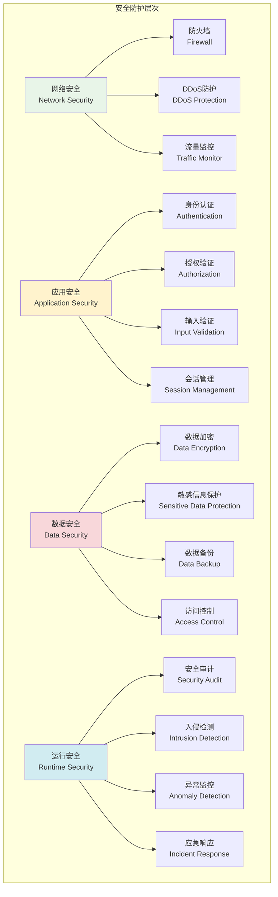
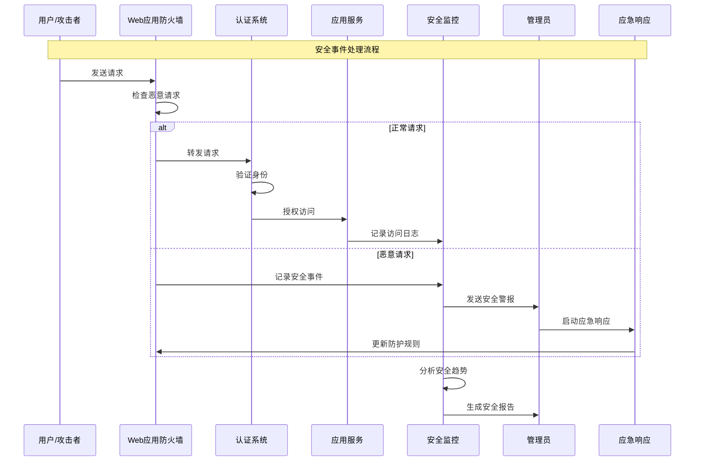

# 安全措施实现

## 🎯 学习目标

通过本章学习，您将能够：
- 理解Chat-Room管理系统的安全威胁和防护策略
- 掌握身份认证、授权验证和数据保护技术
- 学会实现安全审计、入侵检测和应急响应
- 在Chat-Room项目中构建全面的安全防护体系

## 🛡️ 安全架构设计

### 安全防护体系



### 安全事件处理流程



## 🔐 安全措施实现

### Chat-Room安全防护系统

```python
# server/admin/security_system.py - 安全防护系统
import hashlib
import hmac
import secrets
import time
import re
import json
from typing import Dict, List, Optional, Any, Set
from dataclasses import dataclass, field
from datetime import datetime, timedelta
from enum import Enum
import asyncio
from collections import defaultdict, deque
import ipaddress

class SecurityLevel(Enum):
    """安全级别"""
    LOW = "low"
    MEDIUM = "medium"
    HIGH = "high"
    CRITICAL = "critical"

class ThreatType(Enum):
    """威胁类型"""
    BRUTE_FORCE = "brute_force"
    SQL_INJECTION = "sql_injection"
    XSS = "xss"
    CSRF = "csrf"
    DOS = "dos"
    UNAUTHORIZED_ACCESS = "unauthorized_access"
    DATA_BREACH = "data_breach"
    MALICIOUS_FILE = "malicious_file"

@dataclass
class SecurityEvent:
    """安全事件"""
    id: str
    event_type: ThreatType
    severity: SecurityLevel
    source_ip: str
    user_id: Optional[int]
    description: str
    details: Dict[str, Any]
    timestamp: datetime = field(default_factory=datetime.now)
    resolved: bool = False
    
    def to_dict(self) -> Dict[str, Any]:
        """转换为字典"""
        return {
            "id": self.id,
            "event_type": self.event_type.value,
            "severity": self.severity.value,
            "source_ip": self.source_ip,
            "user_id": self.user_id,
            "description": self.description,
            "details": self.details,
            "timestamp": self.timestamp.isoformat(),
            "resolved": self.resolved
        }

class PasswordSecurity:
    """密码安全管理"""
    
    def __init__(self):
        self.min_length = 8
        self.require_uppercase = True
        self.require_lowercase = True
        self.require_digits = True
        self.require_special = True
        self.special_chars = "!@#$%^&*()_+-=[]{}|;:,.<>?"
        
        # 常见弱密码列表
        self.weak_passwords = {
            "123456", "password", "123456789", "12345678", "12345",
            "1234567", "1234567890", "qwerty", "abc123", "password123"
        }
    
    def validate_password(self, password: str) -> tuple[bool, List[str]]:
        """验证密码强度"""
        errors = []
        
        if len(password) < self.min_length:
            errors.append(f"密码长度至少{self.min_length}位")
        
        if self.require_uppercase and not re.search(r'[A-Z]', password):
            errors.append("密码必须包含大写字母")
        
        if self.require_lowercase and not re.search(r'[a-z]', password):
            errors.append("密码必须包含小写字母")
        
        if self.require_digits and not re.search(r'\d', password):
            errors.append("密码必须包含数字")
        
        if self.require_special and not any(c in self.special_chars for c in password):
            errors.append("密码必须包含特殊字符")
        
        if password.lower() in self.weak_passwords:
            errors.append("密码过于简单，请使用更复杂的密码")
        
        return len(errors) == 0, errors
    
    def hash_password(self, password: str, salt: str = None) -> tuple[str, str]:
        """哈希密码"""
        if salt is None:
            salt = secrets.token_hex(32)
        
        # 使用PBKDF2进行密码哈希
        password_hash = hashlib.pbkdf2_hmac(
            'sha256',
            password.encode('utf-8'),
            salt.encode('utf-8'),
            100000  # 迭代次数
        )
        
        return password_hash.hex(), salt
    
    def verify_password(self, password: str, password_hash: str, salt: str) -> bool:
        """验证密码"""
        computed_hash, _ = self.hash_password(password, salt)
        return hmac.compare_digest(computed_hash, password_hash)

class RateLimiter:
    """速率限制器"""
    
    def __init__(self):
        # 存储每个IP的请求记录
        self.request_records: Dict[str, deque] = defaultdict(lambda: deque())
        
        # 限制规则
        self.limits = {
            "login": {"requests": 5, "window": 300},      # 5次/5分钟
            "api": {"requests": 100, "window": 60},       # 100次/分钟
            "upload": {"requests": 10, "window": 3600},   # 10次/小时
            "admin": {"requests": 50, "window": 300}      # 50次/5分钟
        }
    
    def is_allowed(self, ip: str, action: str) -> bool:
        """检查是否允许请求"""
        if action not in self.limits:
            return True
        
        limit_config = self.limits[action]
        max_requests = limit_config["requests"]
        time_window = limit_config["window"]
        
        now = time.time()
        cutoff_time = now - time_window
        
        # 清理过期记录
        records = self.request_records[f"{ip}:{action}"]
        while records and records[0] < cutoff_time:
            records.popleft()
        
        # 检查是否超过限制
        if len(records) >= max_requests:
            return False
        
        # 记录当前请求
        records.append(now)
        return True
    
    def get_remaining_requests(self, ip: str, action: str) -> int:
        """获取剩余请求次数"""
        if action not in self.limits:
            return float('inf')
        
        limit_config = self.limits[action]
        max_requests = limit_config["requests"]
        time_window = limit_config["window"]
        
        now = time.time()
        cutoff_time = now - time_window
        
        records = self.request_records[f"{ip}:{action}"]
        current_requests = sum(1 for timestamp in records if timestamp > cutoff_time)
        
        return max(0, max_requests - current_requests)

class InputValidator:
    """输入验证器"""
    
    def __init__(self):
        # SQL注入检测模式
        self.sql_injection_patterns = [
            r"(\b(SELECT|INSERT|UPDATE|DELETE|DROP|CREATE|ALTER|EXEC|UNION)\b)",
            r"(\b(OR|AND)\s+\d+\s*=\s*\d+)",
            r"(--|#|/\*|\*/)",
            r"(\b(SCRIPT|JAVASCRIPT|VBSCRIPT)\b)",
            r"(\bONLOAD\s*=)",
        ]
        
        # XSS检测模式
        self.xss_patterns = [
            r"<script[^>]*>.*?</script>",
            r"javascript:",
            r"on\w+\s*=",
            r"<iframe[^>]*>",
            r"<object[^>]*>",
            r"<embed[^>]*>",
        ]
        
        # 文件名验证模式
        self.safe_filename_pattern = r"^[a-zA-Z0-9._-]+$"
        
        # 危险文件扩展名
        self.dangerous_extensions = {
            ".exe", ".bat", ".cmd", ".com", ".pif", ".scr", ".vbs", ".js",
            ".jar", ".php", ".asp", ".aspx", ".jsp", ".py", ".rb", ".pl"
        }
    
    def validate_sql_injection(self, input_text: str) -> bool:
        """检测SQL注入"""
        input_lower = input_text.lower()
        
        for pattern in self.sql_injection_patterns:
            if re.search(pattern, input_lower, re.IGNORECASE):
                return False
        
        return True
    
    def validate_xss(self, input_text: str) -> bool:
        """检测XSS攻击"""
        input_lower = input_text.lower()
        
        for pattern in self.xss_patterns:
            if re.search(pattern, input_lower, re.IGNORECASE):
                return False
        
        return True
    
    def validate_filename(self, filename: str) -> bool:
        """验证文件名安全性"""
        # 检查文件名格式
        if not re.match(self.safe_filename_pattern, filename):
            return False
        
        # 检查文件扩展名
        file_ext = "." + filename.split(".")[-1].lower() if "." in filename else ""
        if file_ext in self.dangerous_extensions:
            return False
        
        # 检查路径遍历
        if ".." in filename or "/" in filename or "\\" in filename:
            return False
        
        return True
    
    def sanitize_input(self, input_text: str) -> str:
        """清理输入内容"""
        # 移除HTML标签
        clean_text = re.sub(r'<[^>]+>', '', input_text)
        
        # 转义特殊字符
        clean_text = clean_text.replace("&", "&amp;")
        clean_text = clean_text.replace("<", "&lt;")
        clean_text = clean_text.replace(">", "&gt;")
        clean_text = clean_text.replace('"', "&quot;")
        clean_text = clean_text.replace("'", "&#x27;")
        
        return clean_text

class SecurityMonitor:
    """安全监控系统"""
    
    def __init__(self):
        self.security_events: List[SecurityEvent] = []
        self.blocked_ips: Set[str] = set()
        self.suspicious_activities: Dict[str, List[datetime]] = defaultdict(list)
        
        # 监控阈值
        self.thresholds = {
            "failed_login_attempts": 5,
            "rapid_requests": 50,
            "suspicious_patterns": 3
        }
    
    def record_security_event(self, event: SecurityEvent):
        """记录安全事件"""
        self.security_events.append(event)
        
        # 自动响应高危事件
        if event.severity in [SecurityLevel.HIGH, SecurityLevel.CRITICAL]:
            self._auto_response(event)
        
        # 保持事件记录数量限制
        if len(self.security_events) > 10000:
            self.security_events = self.security_events[-10000:]
    
    def detect_brute_force(self, ip: str, user_id: int = None) -> bool:
        """检测暴力破解攻击"""
        key = f"failed_login:{ip}"
        if user_id:
            key += f":{user_id}"
        
        now = datetime.now()
        cutoff_time = now - timedelta(minutes=15)
        
        # 清理过期记录
        self.suspicious_activities[key] = [
            timestamp for timestamp in self.suspicious_activities[key]
            if timestamp > cutoff_time
        ]
        
        # 记录当前失败尝试
        self.suspicious_activities[key].append(now)
        
        # 检查是否超过阈值
        if len(self.suspicious_activities[key]) >= self.thresholds["failed_login_attempts"]:
            # 记录安全事件
            event = SecurityEvent(
                id=f"bf_{int(time.time())}_{ip}",
                event_type=ThreatType.BRUTE_FORCE,
                severity=SecurityLevel.HIGH,
                source_ip=ip,
                user_id=user_id,
                description="检测到暴力破解攻击",
                details={
                    "failed_attempts": len(self.suspicious_activities[key]),
                    "time_window": "15分钟"
                }
            )
            self.record_security_event(event)
            return True
        
        return False
    
    def detect_dos_attack(self, ip: str) -> bool:
        """检测DoS攻击"""
        key = f"requests:{ip}"
        now = datetime.now()
        cutoff_time = now - timedelta(minutes=1)
        
        # 清理过期记录
        self.suspicious_activities[key] = [
            timestamp for timestamp in self.suspicious_activities[key]
            if timestamp > cutoff_time
        ]
        
        # 记录当前请求
        self.suspicious_activities[key].append(now)
        
        # 检查是否超过阈值
        if len(self.suspicious_activities[key]) >= self.thresholds["rapid_requests"]:
            # 记录安全事件
            event = SecurityEvent(
                id=f"dos_{int(time.time())}_{ip}",
                event_type=ThreatType.DOS,
                severity=SecurityLevel.HIGH,
                source_ip=ip,
                user_id=None,
                description="检测到DoS攻击",
                details={
                    "requests_per_minute": len(self.suspicious_activities[key])
                }
            )
            self.record_security_event(event)
            return True
        
        return False
    
    def block_ip(self, ip: str, reason: str = "安全威胁"):
        """封禁IP地址"""
        self.blocked_ips.add(ip)
        
        # 记录封禁事件
        event = SecurityEvent(
            id=f"block_{int(time.time())}_{ip}",
            event_type=ThreatType.UNAUTHORIZED_ACCESS,
            severity=SecurityLevel.MEDIUM,
            source_ip=ip,
            user_id=None,
            description=f"IP地址已被封禁: {reason}",
            details={"reason": reason}
        )
        self.record_security_event(event)
    
    def is_ip_blocked(self, ip: str) -> bool:
        """检查IP是否被封禁"""
        return ip in self.blocked_ips
    
    def _auto_response(self, event: SecurityEvent):
        """自动安全响应"""
        if event.event_type in [ThreatType.BRUTE_FORCE, ThreatType.DOS]:
            # 自动封禁攻击IP
            self.block_ip(event.source_ip, f"自动响应: {event.event_type.value}")
        
        # 可以添加更多自动响应逻辑
        # 如：发送警报邮件、更新防火墙规则等
    
    def get_security_summary(self, hours: int = 24) -> Dict[str, Any]:
        """获取安全摘要"""
        cutoff_time = datetime.now() - timedelta(hours=hours)
        
        recent_events = [
            event for event in self.security_events
            if event.timestamp > cutoff_time
        ]
        
        # 统计各类事件
        event_counts = defaultdict(int)
        severity_counts = defaultdict(int)
        
        for event in recent_events:
            event_counts[event.event_type.value] += 1
            severity_counts[event.severity.value] += 1
        
        return {
            "time_range": f"最近{hours}小时",
            "total_events": len(recent_events),
            "event_types": dict(event_counts),
            "severity_levels": dict(severity_counts),
            "blocked_ips": len(self.blocked_ips),
            "unresolved_events": len([e for e in recent_events if not e.resolved])
        }

class SecurityManager:
    """安全管理器"""
    
    def __init__(self):
        self.password_security = PasswordSecurity()
        self.rate_limiter = RateLimiter()
        self.input_validator = InputValidator()
        self.security_monitor = SecurityMonitor()
    
    def validate_login_attempt(self, ip: str, username: str, password: str) -> tuple[bool, str]:
        """验证登录尝试"""
        # 检查IP是否被封禁
        if self.security_monitor.is_ip_blocked(ip):
            return False, "IP地址已被封禁"
        
        # 检查登录速率限制
        if not self.rate_limiter.is_allowed(ip, "login"):
            return False, "登录尝试过于频繁，请稍后再试"
        
        # 检测暴力破解
        if self.security_monitor.detect_brute_force(ip):
            return False, "检测到暴力破解攻击，账户已被锁定"
        
        # 验证输入安全性
        if not self.input_validator.validate_sql_injection(username):
            return False, "用户名包含非法字符"
        
        return True, "验证通过"
    
    def validate_api_request(self, ip: str, endpoint: str, data: Dict[str, Any]) -> tuple[bool, str]:
        """验证API请求"""
        # 检查IP是否被封禁
        if self.security_monitor.is_ip_blocked(ip):
            return False, "IP地址已被封禁"
        
        # 检查API速率限制
        if not self.rate_limiter.is_allowed(ip, "api"):
            return False, "API请求过于频繁"
        
        # 检测DoS攻击
        if self.security_monitor.detect_dos_attack(ip):
            return False, "检测到DoS攻击"
        
        # 验证输入数据
        for key, value in data.items():
            if isinstance(value, str):
                if not self.input_validator.validate_sql_injection(value):
                    return False, f"参数 {key} 包含SQL注入风险"
                
                if not self.input_validator.validate_xss(value):
                    return False, f"参数 {key} 包含XSS风险"
        
        return True, "验证通过"
    
    def validate_file_upload(self, filename: str, file_content: bytes) -> tuple[bool, str]:
        """验证文件上传"""
        # 验证文件名
        if not self.input_validator.validate_filename(filename):
            return False, "文件名不安全"
        
        # 检查文件大小
        max_size = 10 * 1024 * 1024  # 10MB
        if len(file_content) > max_size:
            return False, "文件大小超过限制"
        
        # 简单的恶意文件检测
        if self._is_malicious_file(file_content):
            return False, "检测到恶意文件"
        
        return True, "文件验证通过"
    
    def _is_malicious_file(self, file_content: bytes) -> bool:
        """检测恶意文件"""
        # 检查文件头部的恶意特征
        malicious_signatures = [
            b"<script",
            b"javascript:",
            b"eval(",
            b"exec(",
            b"system(",
        ]
        
        content_lower = file_content.lower()
        for signature in malicious_signatures:
            if signature in content_lower:
                return True
        
        return False

# 使用示例
def demo_security_system():
    """安全系统演示"""
    security_manager = SecurityManager()
    
    print("=== Chat-Room安全系统演示 ===")
    
    # 测试登录验证
    print("\n1. 登录安全验证")
    test_ips = ["192.168.1.100", "10.0.0.1"]
    
    for ip in test_ips:
        for i in range(7):  # 模拟多次登录尝试
            valid, message = security_manager.validate_login_attempt(ip, "admin", "wrong_password")
            print(f"IP {ip} 第{i+1}次登录: {'通过' if valid else '拒绝'} - {message}")
    
    # 测试API请求验证
    print("\n2. API请求安全验证")
    test_data = {
        "normal_data": {"message": "Hello World"},
        "sql_injection": {"query": "SELECT * FROM users WHERE id = 1 OR 1=1"},
        "xss_attack": {"content": "<script>alert('XSS')</script>"}
    }
    
    for test_name, data in test_data.items():
        valid, message = security_manager.validate_api_request("192.168.1.200", "/api/test", data)
        print(f"{test_name}: {'通过' if valid else '拒绝'} - {message}")
    
    # 测试文件上传验证
    print("\n3. 文件上传安全验证")
    test_files = [
        ("document.txt", b"This is a normal text file"),
        ("malicious.exe", b"MZ\x90\x00"),  # PE文件头
        ("script.js", b"<script>alert('malicious')</script>")
    ]
    
    for filename, content in test_files:
        valid, message = security_manager.validate_file_upload(filename, content)
        print(f"文件 {filename}: {'通过' if valid else '拒绝'} - {message}")
    
    # 查看安全摘要
    print("\n4. 安全摘要")
    summary = security_manager.security_monitor.get_security_summary()
    print(f"安全事件总数: {summary['total_events']}")
    print(f"封禁IP数量: {summary['blocked_ips']}")
    print(f"未解决事件: {summary['unresolved_events']}")

if __name__ == "__main__":
    demo_security_system()
```

## 🎯 实践练习

### 练习1：威胁情报系统
```python
class ThreatIntelligenceSystem:
    """
    威胁情报系统练习
    
    要求：
    1. 集成外部威胁情报源
    2. 实现威胁指标的自动更新
    3. 添加威胁评分和风险评估
    4. 支持威胁情报的共享和协作
    """
    
    def update_threat_indicators(self, source: str) -> bool:
        """更新威胁指标"""
        # TODO: 实现威胁指标更新
        pass
    
    def assess_threat_risk(self, indicators: List[str]) -> float:
        """评估威胁风险"""
        # TODO: 实现威胁风险评估
        pass
```

### 练习2：零信任安全架构
```python
class ZeroTrustSecurity:
    """
    零信任安全架构练习
    
    要求：
    1. 实现持续的身份验证
    2. 支持动态访问控制
    3. 添加设备信任评估
    4. 实现微分段网络隔离
    """
    
    def continuous_authentication(self, user_id: int, context: Dict[str, Any]) -> bool:
        """持续身份验证"""
        # TODO: 实现持续认证
        pass
    
    def evaluate_device_trust(self, device_info: Dict[str, Any]) -> float:
        """评估设备信任度"""
        # TODO: 实现设备信任评估
        pass
```

## ✅ 学习检查

完成本章学习后，请确认您能够：

- [ ] 理解安全威胁的类型和防护策略
- [ ] 实现身份认证和授权验证机制
- [ ] 设计输入验证和数据保护系统
- [ ] 构建安全监控和入侵检测功能
- [ ] 处理安全事件和应急响应
- [ ] 完成实践练习

## 📚 下一步

安全措施实现掌握后，请继续学习：
- [第10章：日志与错误处理](../10-logging-error-handling/loguru-system.md)

---

**恭喜！您已经完成了管理员系统的学习！** 🛡️
