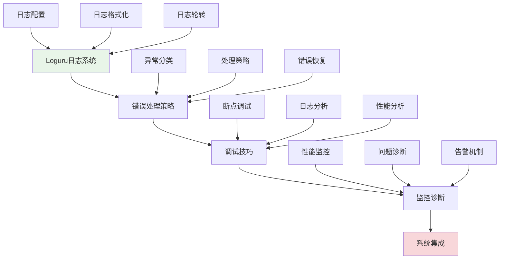
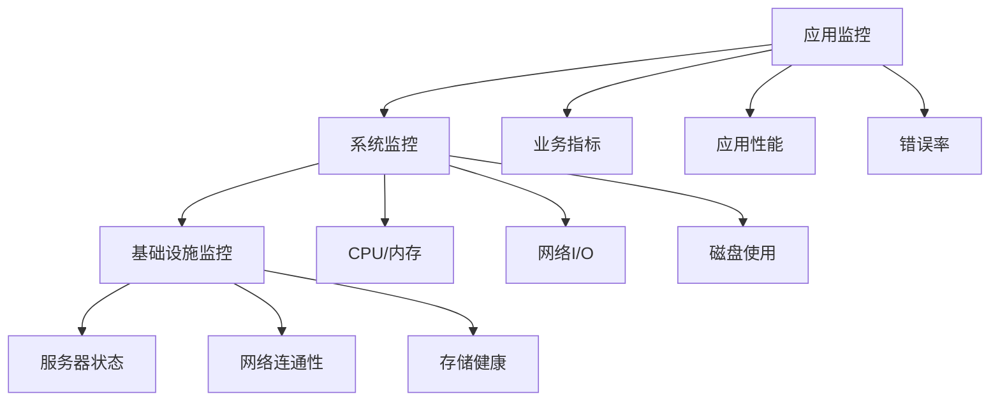

# 第14章：日志与错误处理

## 🎯 学习目标

通过本章学习，您将能够：
- 掌握Loguru日志系统的高级特性和配置
- 设计完整的错误处理策略和异常分类体系
- 学会使用现代化的调试技巧和工具
- 建立系统监控和诊断机制
- 构建可观测性强的应用程序

## 📖 本章概览

本章将为Chat-Room项目建立完善的日志记录和错误处理体系。我们将学习如何使用Loguru构建现代化的日志系统，设计合理的错误处理策略，以及如何进行有效的系统监控和问题诊断。

### 学习路径

## 📚 章节内容

### 1. [Loguru日志系统](loguru-system.md)
**学习时间：** 4-6小时  
**难度等级：** ⭐⭐⭐

学习内容：
- Loguru库的特性和优势
- 日志配置和格式化定制
- 日志轮转和存储管理
- 结构化日志和JSON格式

**Chat-Room应用：** 建立统一的日志系统，记录用户操作、系统事件、错误信息

### 2. [错误处理策略](error-strategies.md)
**学习时间：** 6-8小时  
**难度等级：** ⭐⭐⭐⭐

学习内容：
- 异常分类和错误码设计
- 错误处理的最佳实践
- 优雅降级和故障恢复
- 错误传播和上下文保持

**Chat-Room应用：** 设计完整的错误处理体系，确保系统稳定性和用户体验

### 3. [调试技巧和工具](debugging-techniques.md)
**学习时间：** 4-6小时  
**难度等级：** ⭐⭐⭐

学习内容：
- Python调试器的使用技巧
- 日志驱动的调试方法
- 性能分析和瓶颈定位
- 远程调试和生产环境调试

**Chat-Room应用：** 掌握高效的调试方法，快速定位和解决问题

### 4. [监控与诊断](monitoring-diagnostics.md)
**学习时间：** 6-8小时  
**难度等级：** ⭐⭐⭐⭐

学习内容：
- 系统监控指标设计
- 健康检查和状态监控
- 告警机制和通知系统
- 问题诊断和根因分析

**Chat-Room应用：** 建立完整的监控体系，实现主动的问题发现和处理

## 🔧 前置知识要求

- **Python异常处理：** 已掌握Python基础异常处理机制
- **系统架构：** 了解Chat-Room项目的整体架构
- **网络编程：** 理解网络应用的常见问题和挑战
- **数据库操作：** 熟悉数据库相关的错误处理

## ⏱️ 预计学习时间

| 内容 | 预计时间 | 累计时间 |
|------|----------|----------|
| Loguru日志系统 | 4-6小时 | 4-6小时 |
| 错误处理策略 | 6-8小时 | 10-14小时 |
| 调试技巧工具 | 4-6小时 | 14-20小时 |
| 监控与诊断 | 6-8小时 | 20-28小时 |
| **总计** | **20-28小时** | **3-4天** |

## 📋 学习顺序建议

### 第1天：日志系统
1. **Loguru日志系统** - 建立现代化日志框架
2. **日志配置和优化** - 定制日志输出和存储

### 第2天：错误处理
3. **错误处理策略** - 设计完整的异常处理体系
4. **错误恢复机制** - 实现优雅的故障处理

### 第3天：调试技巧
5. **调试技巧工具** - 掌握高效调试方法
6. **性能分析** - 学会性能瓶颈定位

### 第4天：监控诊断
7. **监控与诊断** - 建立系统监控体系
8. **告警和通知** - 实现主动问题发现

## ✅ 学习检查清单

### 日志系统能力
- [ ] 能够配置和定制Loguru日志系统
- [ ] 掌握日志格式化和结构化记录
- [ ] 理解日志轮转和存储管理
- [ ] 会设计合理的日志级别和分类

### 错误处理能力
- [ ] 能够设计完整的异常分类体系
- [ ] 掌握错误处理的最佳实践
- [ ] 理解优雅降级和故障恢复
- [ ] 会实现错误上下文保持

### 调试技能
- [ ] 能够熟练使用Python调试器
- [ ] 掌握日志驱动的调试方法
- [ ] 理解性能分析和优化技巧
- [ ] 会进行生产环境问题排查

### 监控诊断能力
- [ ] 能够设计系统监控指标
- [ ] 掌握健康检查和状态监控
- [ ] 理解告警机制和通知系统
- [ ] 会进行问题诊断和根因分析

## 🎯 实践项目

### 阶段性项目：可观测性Chat-Room
在学习过程中，您将为Chat-Room添加完整的可观测性：

1. **日志系统阶段：** 建立统一的日志记录框架
2. **错误处理阶段：** 实现完整的异常处理体系
3. **调试优化阶段：** 添加调试和性能分析功能
4. **监控诊断阶段：** 建立系统监控和告警机制

### 项目特性
- 结构化的日志记录系统
- 完善的错误处理和恢复机制
- 高效的调试和问题定位能力
- 主动的系统监控和告警

## 🚨 学习难点和解决方案

### 常见难点
1. **日志设计的平衡性**
   - 解决方案：在详细记录和性能之间找到平衡
   - 重点理解：日志级别和采样策略

2. **错误处理的完整性**
   - 解决方案：建立系统化的异常分类和处理流程
   - 重点理解：错误边界和恢复策略

3. **监控指标的选择**
   - 解决方案：关注关键业务指标和系统健康指标
   - 重点理解：监控的层次和粒度

### 学习技巧
- **渐进式完善：** 从基础日志开始，逐步增加监控功能
- **实践驱动：** 通过实际问题来验证日志和监控的有效性
- **工具结合：** 结合多种工具和方法进行问题诊断
- **持续改进：** 根据实际使用情况不断优化日志和监控

## 📊 监控体系架构

### 监控层次

### 关键指标
- **业务指标**：在线用户数、消息发送量、响应时间
- **技术指标**：CPU使用率、内存占用、网络延迟
- **错误指标**：错误率、异常数量、故障恢复时间

## 🔍 调试工具箱

### Python调试工具
- **pdb/ipdb**：交互式调试器
- **logging/loguru**：日志记录和分析
- **cProfile**：性能分析工具
- **memory_profiler**：内存使用分析

### 系统监控工具
- **psutil**：系统资源监控
- **htop/top**：进程监控
- **netstat/ss**：网络连接监控
- **iostat**：磁盘I/O监控

## 📈 性能优化

### 日志性能优化
- 异步日志写入
- 日志缓冲和批量处理
- 合理的日志级别设置
- 日志采样和过滤

### 监控性能优化
- 监控数据采样
- 指标聚合和压缩
- 监控频率优化
- 资源使用控制

## 🚨 告警策略

### 告警级别
- **紧急**：系统不可用、数据丢失
- **警告**：性能下降、错误率上升
- **信息**：状态变更、配置更新

### 告警渠道
- 邮件通知
- 短信告警
- 即时消息推送
- 监控面板显示

## 📚 下一步学习

日志与错误处理完成后，请继续学习：
- [第15章：测试驱动开发](../15-testing-quality/README.md) - 建立完整的测试体系

---

**恭喜！您的Chat-Room现在具备了企业级的可观测性和稳定性！** 📊

*本章最后更新：2025-01-17*
