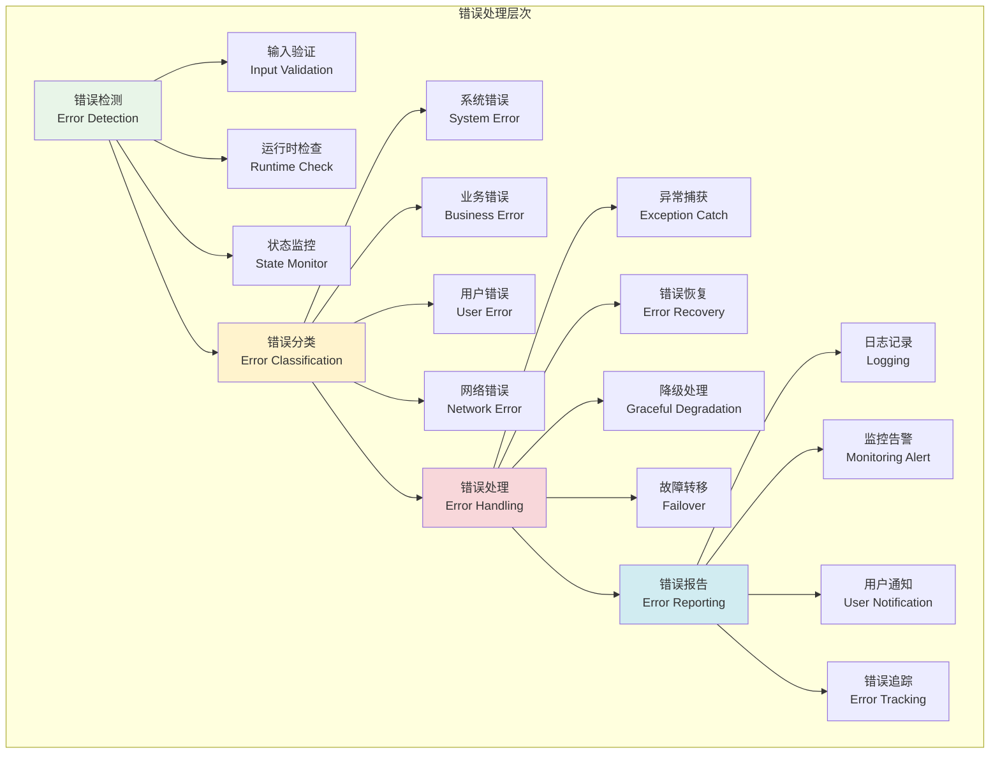
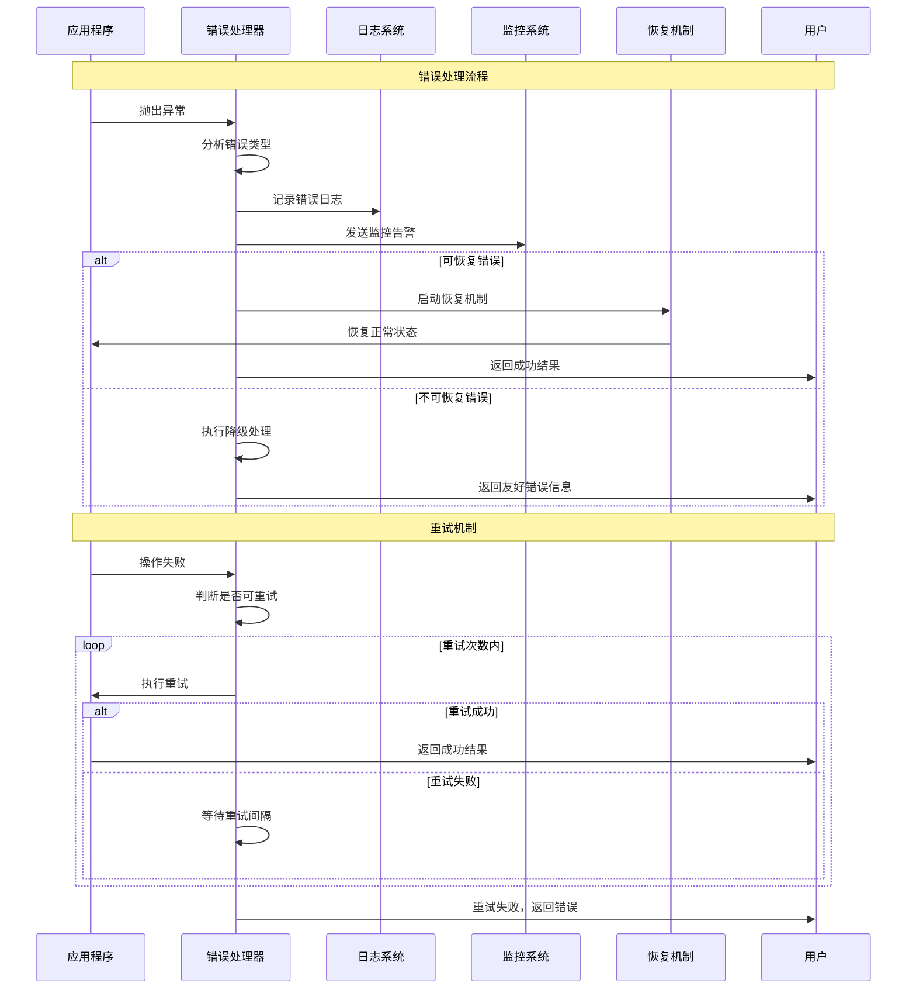

# 错误处理策略

## 🎯 学习目标

通过本章学习，您将能够：
- 理解现代错误处理的设计原则和最佳实践
- 掌握异常分类、捕获和恢复的核心技术
- 学会设计容错机制和故障恢复系统
- 在Chat-Room项目中实现健壮的错误处理架构

## ⚠️ 错误处理架构

### 错误处理体系



### 错误处理流程



## 🛠️ 错误处理实现

### Chat-Room错误处理系统

```python
# server/error_handling/error_manager.py - 错误处理管理器
import traceback
import asyncio
import time
from typing import Dict, List, Optional, Any, Type, Callable, Union
from dataclasses import dataclass, field
from datetime import datetime, timedelta
from enum import Enum
from abc import ABC, abstractmethod
import json

class ErrorSeverity(Enum):
    """错误严重程度"""
    LOW = "low"
    MEDIUM = "medium"
    HIGH = "high"
    CRITICAL = "critical"

class ErrorCategory(Enum):
    """错误分类"""
    VALIDATION = "validation"
    AUTHENTICATION = "authentication"
    AUTHORIZATION = "authorization"
    NETWORK = "network"
    DATABASE = "database"
    BUSINESS_LOGIC = "business_logic"
    SYSTEM = "system"
    EXTERNAL_SERVICE = "external_service"

class RecoveryStrategy(Enum):
    """恢复策略"""
    RETRY = "retry"
    FALLBACK = "fallback"
    CIRCUIT_BREAKER = "circuit_breaker"
    GRACEFUL_DEGRADATION = "graceful_degradation"
    FAIL_FAST = "fail_fast"

@dataclass
class ErrorContext:
    """错误上下文"""
    user_id: Optional[int] = None
    session_id: Optional[str] = None
    request_id: Optional[str] = None
    operation: Optional[str] = None
    parameters: Dict[str, Any] = field(default_factory=dict)
    timestamp: datetime = field(default_factory=datetime.now)

@dataclass
class ErrorInfo:
    """错误信息"""
    error_id: str
    error_type: str
    category: ErrorCategory
    severity: ErrorSeverity
    message: str
    details: Dict[str, Any]
    context: ErrorContext
    stack_trace: Optional[str] = None
    recovery_strategy: Optional[RecoveryStrategy] = None
    retry_count: int = 0
    resolved: bool = False
    
    def to_dict(self) -> Dict[str, Any]:
        """转换为字典"""
        return {
            "error_id": self.error_id,
            "error_type": self.error_type,
            "category": self.category.value,
            "severity": self.severity.value,
            "message": self.message,
            "details": self.details,
            "context": {
                "user_id": self.context.user_id,
                "session_id": self.context.session_id,
                "request_id": self.context.request_id,
                "operation": self.context.operation,
                "parameters": self.context.parameters,
                "timestamp": self.context.timestamp.isoformat()
            },
            "stack_trace": self.stack_trace,
            "recovery_strategy": self.recovery_strategy.value if self.recovery_strategy else None,
            "retry_count": self.retry_count,
            "resolved": self.resolved
        }

class ChatRoomException(Exception):
    """Chat-Room基础异常类"""
    
    def __init__(self, message: str, category: ErrorCategory = ErrorCategory.SYSTEM,
                 severity: ErrorSeverity = ErrorSeverity.MEDIUM, 
                 details: Dict[str, Any] = None, context: ErrorContext = None):
        super().__init__(message)
        self.message = message
        self.category = category
        self.severity = severity
        self.details = details or {}
        self.context = context or ErrorContext()

class ValidationError(ChatRoomException):
    """验证错误"""
    def __init__(self, message: str, field: str = None, value: Any = None, **kwargs):
        details = {"field": field, "value": value}
        super().__init__(message, ErrorCategory.VALIDATION, ErrorSeverity.LOW, details, **kwargs)

class AuthenticationError(ChatRoomException):
    """认证错误"""
    def __init__(self, message: str = "认证失败", **kwargs):
        super().__init__(message, ErrorCategory.AUTHENTICATION, ErrorSeverity.MEDIUM, **kwargs)

class AuthorizationError(ChatRoomException):
    """授权错误"""
    def __init__(self, message: str = "权限不足", **kwargs):
        super().__init__(message, ErrorCategory.AUTHORIZATION, ErrorSeverity.MEDIUM, **kwargs)

class NetworkError(ChatRoomException):
    """网络错误"""
    def __init__(self, message: str, endpoint: str = None, status_code: int = None, **kwargs):
        details = {"endpoint": endpoint, "status_code": status_code}
        super().__init__(message, ErrorCategory.NETWORK, ErrorSeverity.HIGH, details, **kwargs)

class DatabaseError(ChatRoomException):
    """数据库错误"""
    def __init__(self, message: str, query: str = None, **kwargs):
        details = {"query": query}
        super().__init__(message, ErrorCategory.DATABASE, ErrorSeverity.HIGH, details, **kwargs)

class BusinessLogicError(ChatRoomException):
    """业务逻辑错误"""
    def __init__(self, message: str, **kwargs):
        super().__init__(message, ErrorCategory.BUSINESS_LOGIC, ErrorSeverity.MEDIUM, **kwargs)

class RetryableError(ChatRoomException):
    """可重试错误"""
    def __init__(self, message: str, max_retries: int = 3, **kwargs):
        super().__init__(message, **kwargs)
        self.max_retries = max_retries

class CircuitBreakerError(ChatRoomException):
    """熔断器错误"""
    def __init__(self, service_name: str, **kwargs):
        message = f"服务 {service_name} 熔断器开启"
        details = {"service_name": service_name}
        super().__init__(message, ErrorCategory.EXTERNAL_SERVICE, ErrorSeverity.HIGH, details, **kwargs)

class ErrorHandler(ABC):
    """错误处理器基类"""
    
    @abstractmethod
    def can_handle(self, error: Exception) -> bool:
        """判断是否可以处理该错误"""
        pass
    
    @abstractmethod
    async def handle(self, error: Exception, context: ErrorContext) -> Any:
        """处理错误"""
        pass

class RetryHandler(ErrorHandler):
    """重试处理器"""
    
    def __init__(self, max_retries: int = 3, base_delay: float = 1.0, 
                 max_delay: float = 60.0, backoff_factor: float = 2.0):
        self.max_retries = max_retries
        self.base_delay = base_delay
        self.max_delay = max_delay
        self.backoff_factor = backoff_factor
    
    def can_handle(self, error: Exception) -> bool:
        """判断是否可以处理该错误"""
        return isinstance(error, (RetryableError, NetworkError, DatabaseError))
    
    async def handle(self, error: Exception, context: ErrorContext) -> Any:
        """处理重试逻辑"""
        max_retries = getattr(error, 'max_retries', self.max_retries)
        
        for attempt in range(max_retries):
            try:
                # 计算延迟时间
                delay = min(
                    self.base_delay * (self.backoff_factor ** attempt),
                    self.max_delay
                )
                
                if attempt > 0:
                    await asyncio.sleep(delay)
                
                # 这里应该重新执行原始操作
                # 由于这是示例，我们模拟重试成功
                if attempt == max_retries - 1:
                    raise error  # 最后一次重试失败
                
                return {"success": True, "attempt": attempt + 1}
                
            except Exception as e:
                if attempt == max_retries - 1:
                    raise e
                continue
        
        raise error

class FallbackHandler(ErrorHandler):
    """降级处理器"""
    
    def __init__(self, fallback_responses: Dict[str, Any] = None):
        self.fallback_responses = fallback_responses or {}
    
    def can_handle(self, error: Exception) -> bool:
        """判断是否可以处理该错误"""
        return isinstance(error, (NetworkError, CircuitBreakerError))
    
    async def handle(self, error: Exception, context: ErrorContext) -> Any:
        """处理降级逻辑"""
        operation = context.operation
        
        if operation in self.fallback_responses:
            return self.fallback_responses[operation]
        
        # 默认降级响应
        return {
            "success": False,
            "message": "服务暂时不可用，请稍后重试",
            "fallback": True
        }

class CircuitBreaker:
    """熔断器"""
    
    def __init__(self, failure_threshold: int = 5, recovery_timeout: float = 60.0,
                 expected_exception: Type[Exception] = Exception):
        self.failure_threshold = failure_threshold
        self.recovery_timeout = recovery_timeout
        self.expected_exception = expected_exception
        
        self.failure_count = 0
        self.last_failure_time = None
        self.state = "CLOSED"  # CLOSED, OPEN, HALF_OPEN
    
    async def call(self, func: Callable, *args, **kwargs):
        """通过熔断器调用函数"""
        if self.state == "OPEN":
            if self._should_attempt_reset():
                self.state = "HALF_OPEN"
            else:
                raise CircuitBreakerError("circuit_breaker")
        
        try:
            result = await func(*args, **kwargs) if asyncio.iscoroutinefunction(func) else func(*args, **kwargs)
            self._on_success()
            return result
        
        except self.expected_exception as e:
            self._on_failure()
            raise e
    
    def _should_attempt_reset(self) -> bool:
        """判断是否应该尝试重置"""
        return (
            self.last_failure_time and
            time.time() - self.last_failure_time >= self.recovery_timeout
        )
    
    def _on_success(self):
        """成功时的处理"""
        self.failure_count = 0
        self.state = "CLOSED"
    
    def _on_failure(self):
        """失败时的处理"""
        self.failure_count += 1
        self.last_failure_time = time.time()
        
        if self.failure_count >= self.failure_threshold:
            self.state = "OPEN"

class ErrorManager:
    """
    错误管理器
    
    功能：
    1. 统一的错误处理和分类
    2. 多种恢复策略支持
    3. 错误监控和统计
    4. 自动化错误恢复
    """
    
    def __init__(self):
        self.handlers: List[ErrorHandler] = []
        self.error_history: List[ErrorInfo] = []
        self.circuit_breakers: Dict[str, CircuitBreaker] = {}
        
        # 错误统计
        self.error_stats = {
            "total_errors": 0,
            "errors_by_category": {},
            "errors_by_severity": {},
            "recovery_success_rate": 0.0
        }
        
        # 注册默认处理器
        self._register_default_handlers()
    
    def _register_default_handlers(self):
        """注册默认错误处理器"""
        self.handlers.append(RetryHandler())
        self.handlers.append(FallbackHandler({
            "get_user_info": {"id": 0, "username": "guest", "status": "offline"},
            "get_messages": {"messages": [], "total": 0},
            "send_message": {"success": False, "message": "消息发送失败，请稍后重试"}
        }))
    
    def register_handler(self, handler: ErrorHandler):
        """注册错误处理器"""
        self.handlers.append(handler)
    
    def register_circuit_breaker(self, service_name: str, circuit_breaker: CircuitBreaker):
        """注册熔断器"""
        self.circuit_breakers[service_name] = circuit_breaker
    
    async def handle_error(self, error: Exception, context: ErrorContext = None) -> Any:
        """处理错误"""
        if context is None:
            context = ErrorContext()
        
        # 生成错误信息
        error_info = self._create_error_info(error, context)
        
        # 记录错误
        self._record_error(error_info)
        
        # 查找合适的处理器
        for handler in self.handlers:
            if handler.can_handle(error):
                try:
                    result = await handler.handle(error, context)
                    error_info.resolved = True
                    return result
                except Exception as e:
                    # 处理器也失败了，继续尝试下一个
                    continue
        
        # 没有处理器能处理，返回默认错误响应
        return self._create_default_error_response(error_info)
    
    def _create_error_info(self, error: Exception, context: ErrorContext) -> ErrorInfo:
        """创建错误信息"""
        error_id = f"err_{int(time.time())}_{id(error)}"
        
        if isinstance(error, ChatRoomException):
            category = error.category
            severity = error.severity
            details = error.details
        else:
            category = ErrorCategory.SYSTEM
            severity = ErrorSeverity.HIGH
            details = {"original_type": type(error).__name__}
        
        return ErrorInfo(
            error_id=error_id,
            error_type=type(error).__name__,
            category=category,
            severity=severity,
            message=str(error),
            details=details,
            context=context,
            stack_trace=traceback.format_exc()
        )
    
    def _record_error(self, error_info: ErrorInfo):
        """记录错误"""
        self.error_history.append(error_info)
        
        # 更新统计信息
        self.error_stats["total_errors"] += 1
        
        category_key = error_info.category.value
        self.error_stats["errors_by_category"][category_key] = \
            self.error_stats["errors_by_category"].get(category_key, 0) + 1
        
        severity_key = error_info.severity.value
        self.error_stats["errors_by_severity"][severity_key] = \
            self.error_stats["errors_by_severity"].get(severity_key, 0) + 1
        
        # 保持历史记录数量限制
        if len(self.error_history) > 1000:
            self.error_history = self.error_history[-1000:]
    
    def _create_default_error_response(self, error_info: ErrorInfo) -> Dict[str, Any]:
        """创建默认错误响应"""
        if error_info.severity == ErrorSeverity.CRITICAL:
            message = "系统发生严重错误，请联系管理员"
        elif error_info.severity == ErrorSeverity.HIGH:
            message = "操作失败，请稍后重试"
        else:
            message = error_info.message
        
        return {
            "success": False,
            "error_id": error_info.error_id,
            "message": message,
            "category": error_info.category.value,
            "timestamp": error_info.context.timestamp.isoformat()
        }
    
    def get_error_stats(self, hours: int = 24) -> Dict[str, Any]:
        """获取错误统计"""
        cutoff_time = datetime.now() - timedelta(hours=hours)
        
        recent_errors = [
            error for error in self.error_history
            if error.context.timestamp > cutoff_time
        ]
        
        resolved_count = sum(1 for error in recent_errors if error.resolved)
        recovery_rate = resolved_count / len(recent_errors) if recent_errors else 0
        
        return {
            "time_range": f"最近{hours}小时",
            "total_errors": len(recent_errors),
            "resolved_errors": resolved_count,
            "recovery_success_rate": recovery_rate,
            "errors_by_category": self._count_by_field(recent_errors, "category"),
            "errors_by_severity": self._count_by_field(recent_errors, "severity"),
            "top_error_types": self._get_top_error_types(recent_errors)
        }
    
    def _count_by_field(self, errors: List[ErrorInfo], field: str) -> Dict[str, int]:
        """按字段统计错误"""
        counts = {}
        for error in errors:
            value = getattr(error, field).value
            counts[value] = counts.get(value, 0) + 1
        return counts
    
    def _get_top_error_types(self, errors: List[ErrorInfo], limit: int = 5) -> List[Dict[str, Any]]:
        """获取最常见的错误类型"""
        type_counts = {}
        for error in errors:
            error_type = error.error_type
            type_counts[error_type] = type_counts.get(error_type, 0) + 1
        
        sorted_types = sorted(type_counts.items(), key=lambda x: x[1], reverse=True)
        
        return [
            {"error_type": error_type, "count": count}
            for error_type, count in sorted_types[:limit]
        ]

# 使用示例
async def demo_error_handling():
    """错误处理系统演示"""
    error_manager = ErrorManager()
    
    print("=== Chat-Room错误处理系统演示 ===")
    
    # 创建错误上下文
    context = ErrorContext(
        user_id=1,
        session_id="session_123",
        operation="send_message"
    )
    
    # 测试不同类型的错误
    test_errors = [
        ValidationError("用户名不能为空", field="username"),
        AuthenticationError("密码错误"),
        NetworkError("连接超时", endpoint="/api/messages", status_code=408),
        RetryableError("数据库连接失败", max_retries=2),
        BusinessLogicError("群组已满，无法加入")
    ]
    
    for error in test_errors:
        print(f"\n处理错误: {type(error).__name__}")
        try:
            result = await error_manager.handle_error(error, context)
            print(f"处理结果: {result}")
        except Exception as e:
            print(f"处理失败: {e}")
    
    # 查看错误统计
    stats = error_manager.get_error_stats()
    print(f"\n错误统计: {json.dumps(stats, ensure_ascii=False, indent=2)}")

if __name__ == "__main__":
    asyncio.run(demo_error_handling())
```

## 🎯 实践练习

### 练习1：智能错误恢复
```python
class IntelligentErrorRecovery:
    """
    智能错误恢复练习
    
    要求：
    1. 基于历史数据预测错误恢复策略
    2. 实现自适应的重试和降级机制
    3. 添加错误模式识别和预防
    4. 支持错误恢复的机器学习优化
    """
    
    def predict_recovery_strategy(self, error: Exception, context: ErrorContext) -> RecoveryStrategy:
        """预测最佳恢复策略"""
        # TODO: 实现智能策略预测
        pass
    
    def adaptive_retry(self, operation: Callable, error_history: List[ErrorInfo]) -> Any:
        """自适应重试"""
        # TODO: 实现自适应重试机制
        pass
```

### 练习2：分布式错误协调
```python
class DistributedErrorCoordinator:
    """
    分布式错误协调练习
    
    要求：
    1. 实现跨服务的错误传播和处理
    2. 支持分布式事务的错误回滚
    3. 添加服务间的错误状态同步
    4. 实现全局错误恢复协调
    """
    
    def propagate_error(self, error: Exception, affected_services: List[str]) -> bool:
        """传播错误到相关服务"""
        # TODO: 实现错误传播
        pass
    
    def coordinate_recovery(self, transaction_id: str, services: List[str]) -> bool:
        """协调分布式恢复"""
        # TODO: 实现分布式恢复协调
        pass
```

## ✅ 学习检查

完成本章学习后，请确认您能够：

- [ ] 理解错误处理的设计原则和架构
- [ ] 实现异常分类和自定义异常体系
- [ ] 设计多种错误恢复策略和机制
- [ ] 构建熔断器和降级处理系统
- [ ] 管理错误统计和监控分析
- [ ] 完成实践练习

## 📚 下一步

错误处理策略掌握后，请继续学习：
- [调试技巧](debugging-techniques.md)
- [监控诊断](monitoring-diagnostics.md)

---

**现在您已经掌握了错误处理的核心策略！** ⚠️
