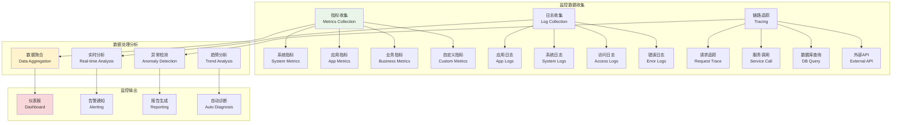
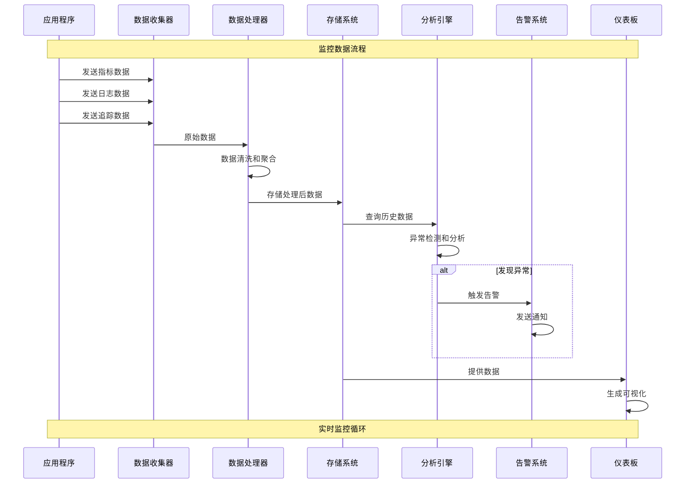

# 监控与诊断系统

## 🎯 学习目标

通过本章学习，您将能够：
- 理解现代应用监控的核心理念和架构设计
- 掌握系统指标收集、分析和可视化技术
- 学会设计智能告警和自动化诊断系统
- 在Chat-Room项目中实现全面的监控诊断功能

## 📊 监控系统架构

### 监控体系概览



### 监控数据流



## 🔧 监控系统实现

### Chat-Room监控诊断系统

```python
# server/monitoring/monitor_system.py - 监控系统
import time
import psutil
import asyncio
import threading
from typing import Dict, List, Optional, Any, Callable, Union
from dataclasses import dataclass, field
from datetime import datetime, timedelta
from enum import Enum
from collections import deque, defaultdict
import json
import statistics

class MetricType(Enum):
    """指标类型"""
    COUNTER = "counter"
    GAUGE = "gauge"
    HISTOGRAM = "histogram"
    SUMMARY = "summary"

class AlertLevel(Enum):
    """告警级别"""
    INFO = "info"
    WARNING = "warning"
    ERROR = "error"
    CRITICAL = "critical"

@dataclass
class Metric:
    """监控指标"""
    name: str
    type: MetricType
    value: Union[int, float]
    labels: Dict[str, str] = field(default_factory=dict)
    timestamp: datetime = field(default_factory=datetime.now)
    description: str = ""
    
    def to_dict(self) -> Dict[str, Any]:
        """转换为字典"""
        return {
            "name": self.name,
            "type": self.type.value,
            "value": self.value,
            "labels": self.labels,
            "timestamp": self.timestamp.isoformat(),
            "description": self.description
        }

@dataclass
class Alert:
    """告警信息"""
    id: str
    level: AlertLevel
    title: str
    message: str
    metric_name: str
    current_value: Union[int, float]
    threshold: Union[int, float]
    labels: Dict[str, str] = field(default_factory=dict)
    timestamp: datetime = field(default_factory=datetime.now)
    resolved: bool = False
    
    def to_dict(self) -> Dict[str, Any]:
        """转换为字典"""
        return {
            "id": self.id,
            "level": self.level.value,
            "title": self.title,
            "message": self.message,
            "metric_name": self.metric_name,
            "current_value": self.current_value,
            "threshold": self.threshold,
            "labels": self.labels,
            "timestamp": self.timestamp.isoformat(),
            "resolved": self.resolved
        }

class MetricsCollector:
    """指标收集器"""
    
    def __init__(self, collection_interval: float = 10.0):
        self.collection_interval = collection_interval
        self.metrics: Dict[str, deque] = defaultdict(lambda: deque(maxlen=1000))
        self.running = False
        self.collector_thread = None
    
    def start(self):
        """启动指标收集"""
        if self.running:
            return
        
        self.running = True
        self.collector_thread = threading.Thread(target=self._collection_loop, daemon=True)
        self.collector_thread.start()
    
    def stop(self):
        """停止指标收集"""
        self.running = False
        if self.collector_thread:
            self.collector_thread.join(timeout=5.0)
    
    def record_metric(self, metric: Metric):
        """记录指标"""
        self.metrics[metric.name].append(metric)
    
    def get_metric_history(self, metric_name: str, duration: timedelta = None) -> List[Metric]:
        """获取指标历史"""
        if metric_name not in self.metrics:
            return []
        
        metrics = list(self.metrics[metric_name])
        
        if duration:
            cutoff_time = datetime.now() - duration
            metrics = [m for m in metrics if m.timestamp > cutoff_time]
        
        return metrics
    
    def get_latest_metric(self, metric_name: str) -> Optional[Metric]:
        """获取最新指标"""
        if metric_name not in self.metrics or not self.metrics[metric_name]:
            return None
        
        return self.metrics[metric_name][-1]
    
    def _collection_loop(self):
        """指标收集循环"""
        while self.running:
            try:
                # 收集系统指标
                self._collect_system_metrics()
                
                # 收集应用指标
                self._collect_application_metrics()
                
                time.sleep(self.collection_interval)
                
            except Exception as e:
                print(f"指标收集错误: {e}")
                time.sleep(1)
    
    def _collect_system_metrics(self):
        """收集系统指标"""
        now = datetime.now()
        
        # CPU使用率
        cpu_percent = psutil.cpu_percent()
        self.record_metric(Metric(
            name="system_cpu_usage",
            type=MetricType.GAUGE,
            value=cpu_percent,
            timestamp=now,
            description="CPU使用率"
        ))
        
        # 内存使用率
        memory = psutil.virtual_memory()
        self.record_metric(Metric(
            name="system_memory_usage",
            type=MetricType.GAUGE,
            value=memory.percent,
            timestamp=now,
            description="内存使用率"
        ))
        
        # 磁盘使用率
        disk = psutil.disk_usage('/')
        disk_percent = (disk.used / disk.total) * 100
        self.record_metric(Metric(
            name="system_disk_usage",
            type=MetricType.GAUGE,
            value=disk_percent,
            timestamp=now,
            description="磁盘使用率"
        ))
        
        # 网络I/O
        network = psutil.net_io_counters()
        self.record_metric(Metric(
            name="system_network_bytes_sent",
            type=MetricType.COUNTER,
            value=network.bytes_sent,
            timestamp=now,
            description="网络发送字节数"
        ))
        
        self.record_metric(Metric(
            name="system_network_bytes_recv",
            type=MetricType.COUNTER,
            value=network.bytes_recv,
            timestamp=now,
            description="网络接收字节数"
        ))
    
    def _collect_application_metrics(self):
        """收集应用指标"""
        now = datetime.now()
        
        # 进程信息
        process = psutil.Process()
        
        # 进程CPU使用率
        process_cpu = process.cpu_percent()
        self.record_metric(Metric(
            name="app_cpu_usage",
            type=MetricType.GAUGE,
            value=process_cpu,
            timestamp=now,
            description="应用CPU使用率"
        ))
        
        # 进程内存使用
        process_memory = process.memory_info()
        memory_mb = process_memory.rss / 1024 / 1024
        self.record_metric(Metric(
            name="app_memory_usage",
            type=MetricType.GAUGE,
            value=memory_mb,
            timestamp=now,
            description="应用内存使用量(MB)"
        ))
        
        # 文件描述符数量
        try:
            fd_count = process.num_fds() if hasattr(process, 'num_fds') else 0
            self.record_metric(Metric(
                name="app_file_descriptors",
                type=MetricType.GAUGE,
                value=fd_count,
                timestamp=now,
                description="文件描述符数量"
            ))
        except:
            pass
        
        # 线程数量
        thread_count = process.num_threads()
        self.record_metric(Metric(
            name="app_thread_count",
            type=MetricType.GAUGE,
            value=thread_count,
            timestamp=now,
            description="线程数量"
        ))

class AlertManager:
    """告警管理器"""
    
    def __init__(self):
        self.alert_rules: Dict[str, Dict[str, Any]] = {}
        self.active_alerts: Dict[str, Alert] = {}
        self.alert_history: List[Alert] = []
        self.notification_handlers: List[Callable[[Alert], None]] = []
    
    def add_alert_rule(self, metric_name: str, threshold: Union[int, float],
                      operator: str = "gt", level: AlertLevel = AlertLevel.WARNING,
                      title: str = None, message: str = None):
        """添加告警规则"""
        self.alert_rules[metric_name] = {
            "threshold": threshold,
            "operator": operator,  # gt, lt, eq, gte, lte
            "level": level,
            "title": title or f"{metric_name} 告警",
            "message": message or f"{metric_name} 超过阈值"
        }
    
    def add_notification_handler(self, handler: Callable[[Alert], None]):
        """添加通知处理器"""
        self.notification_handlers.append(handler)
    
    def check_metric(self, metric: Metric):
        """检查指标是否触发告警"""
        if metric.name not in self.alert_rules:
            return
        
        rule = self.alert_rules[metric.name]
        threshold = rule["threshold"]
        operator = rule["operator"]
        
        # 检查阈值
        triggered = False
        if operator == "gt" and metric.value > threshold:
            triggered = True
        elif operator == "lt" and metric.value < threshold:
            triggered = True
        elif operator == "gte" and metric.value >= threshold:
            triggered = True
        elif operator == "lte" and metric.value <= threshold:
            triggered = True
        elif operator == "eq" and metric.value == threshold:
            triggered = True
        
        alert_id = f"{metric.name}_{rule['level'].value}"
        
        if triggered:
            # 触发告警
            if alert_id not in self.active_alerts:
                alert = Alert(
                    id=alert_id,
                    level=rule["level"],
                    title=rule["title"],
                    message=rule["message"],
                    metric_name=metric.name,
                    current_value=metric.value,
                    threshold=threshold,
                    labels=metric.labels
                )
                
                self.active_alerts[alert_id] = alert
                self.alert_history.append(alert)
                
                # 发送通知
                self._send_notification(alert)
        else:
            # 解除告警
            if alert_id in self.active_alerts:
                alert = self.active_alerts[alert_id]
                alert.resolved = True
                del self.active_alerts[alert_id]
                
                # 发送解除通知
                self._send_notification(alert)
    
    def _send_notification(self, alert: Alert):
        """发送告警通知"""
        for handler in self.notification_handlers:
            try:
                handler(alert)
            except Exception as e:
                print(f"告警通知发送失败: {e}")
    
    def get_active_alerts(self) -> List[Alert]:
        """获取活跃告警"""
        return list(self.active_alerts.values())
    
    def get_alert_history(self, hours: int = 24) -> List[Alert]:
        """获取告警历史"""
        cutoff_time = datetime.now() - timedelta(hours=hours)
        return [alert for alert in self.alert_history if alert.timestamp > cutoff_time]

class PerformanceAnalyzer:
    """性能分析器"""
    
    def __init__(self, metrics_collector: MetricsCollector):
        self.metrics_collector = metrics_collector
    
    def analyze_performance(self, duration: timedelta = timedelta(hours=1)) -> Dict[str, Any]:
        """分析性能"""
        analysis = {
            "cpu_analysis": self._analyze_cpu_usage(duration),
            "memory_analysis": self._analyze_memory_usage(duration),
            "network_analysis": self._analyze_network_usage(duration),
            "summary": {}
        }
        
        # 生成总结
        analysis["summary"] = self._generate_summary(analysis)
        
        return analysis
    
    def _analyze_cpu_usage(self, duration: timedelta) -> Dict[str, Any]:
        """分析CPU使用情况"""
        cpu_metrics = self.metrics_collector.get_metric_history("system_cpu_usage", duration)
        
        if not cpu_metrics:
            return {"error": "没有CPU数据"}
        
        values = [m.value for m in cpu_metrics]
        
        return {
            "average": statistics.mean(values),
            "max": max(values),
            "min": min(values),
            "median": statistics.median(values),
            "std_dev": statistics.stdev(values) if len(values) > 1 else 0,
            "samples": len(values)
        }
    
    def _analyze_memory_usage(self, duration: timedelta) -> Dict[str, Any]:
        """分析内存使用情况"""
        memory_metrics = self.metrics_collector.get_metric_history("system_memory_usage", duration)
        
        if not memory_metrics:
            return {"error": "没有内存数据"}
        
        values = [m.value for m in memory_metrics]
        
        return {
            "average": statistics.mean(values),
            "max": max(values),
            "min": min(values),
            "median": statistics.median(values),
            "trend": self._calculate_trend(values),
            "samples": len(values)
        }
    
    def _analyze_network_usage(self, duration: timedelta) -> Dict[str, Any]:
        """分析网络使用情况"""
        sent_metrics = self.metrics_collector.get_metric_history("system_network_bytes_sent", duration)
        recv_metrics = self.metrics_collector.get_metric_history("system_network_bytes_recv", duration)
        
        analysis = {}
        
        if sent_metrics:
            sent_values = [m.value for m in sent_metrics]
            if len(sent_values) > 1:
                sent_rate = (sent_values[-1] - sent_values[0]) / len(sent_values)
                analysis["bytes_sent_rate"] = sent_rate
        
        if recv_metrics:
            recv_values = [m.value for m in recv_metrics]
            if len(recv_values) > 1:
                recv_rate = (recv_values[-1] - recv_values[0]) / len(recv_values)
                analysis["bytes_recv_rate"] = recv_rate
        
        return analysis
    
    def _calculate_trend(self, values: List[float]) -> str:
        """计算趋势"""
        if len(values) < 2:
            return "insufficient_data"
        
        # 简单的线性趋势计算
        first_half = values[:len(values)//2]
        second_half = values[len(values)//2:]
        
        first_avg = statistics.mean(first_half)
        second_avg = statistics.mean(second_half)
        
        if second_avg > first_avg * 1.1:
            return "increasing"
        elif second_avg < first_avg * 0.9:
            return "decreasing"
        else:
            return "stable"
    
    def _generate_summary(self, analysis: Dict[str, Any]) -> Dict[str, Any]:
        """生成分析总结"""
        summary = {
            "status": "healthy",
            "issues": [],
            "recommendations": []
        }
        
        # 检查CPU使用率
        cpu_analysis = analysis.get("cpu_analysis", {})
        if cpu_analysis.get("average", 0) > 80:
            summary["status"] = "warning"
            summary["issues"].append("CPU使用率过高")
            summary["recommendations"].append("考虑优化CPU密集型操作")
        
        # 检查内存使用率
        memory_analysis = analysis.get("memory_analysis", {})
        if memory_analysis.get("average", 0) > 85:
            summary["status"] = "critical" if summary["status"] != "critical" else summary["status"]
            summary["issues"].append("内存使用率过高")
            summary["recommendations"].append("检查内存泄漏或增加内存")
        
        # 检查内存趋势
        if memory_analysis.get("trend") == "increasing":
            summary["issues"].append("内存使用呈上升趋势")
            summary["recommendations"].append("监控内存泄漏")
        
        return summary

class MonitoringSystem:
    """
    监控系统
    
    功能：
    1. 指标收集和存储
    2. 实时告警和通知
    3. 性能分析和诊断
    4. 可视化和报告
    """
    
    def __init__(self):
        self.metrics_collector = MetricsCollector()
        self.alert_manager = AlertManager()
        self.performance_analyzer = PerformanceAnalyzer(self.metrics_collector)
        
        # 设置默认告警规则
        self._setup_default_alerts()
        
        # 设置默认通知处理器
        self._setup_notification_handlers()
    
    def start(self):
        """启动监控系统"""
        self.metrics_collector.start()
        print("监控系统已启动")
    
    def stop(self):
        """停止监控系统"""
        self.metrics_collector.stop()
        print("监控系统已停止")
    
    def _setup_default_alerts(self):
        """设置默认告警规则"""
        # CPU使用率告警
        self.alert_manager.add_alert_rule(
            "system_cpu_usage", 80, "gt", AlertLevel.WARNING,
            "CPU使用率告警", "系统CPU使用率超过80%"
        )
        
        self.alert_manager.add_alert_rule(
            "system_cpu_usage", 95, "gt", AlertLevel.CRITICAL,
            "CPU使用率严重告警", "系统CPU使用率超过95%"
        )
        
        # 内存使用率告警
        self.alert_manager.add_alert_rule(
            "system_memory_usage", 85, "gt", AlertLevel.WARNING,
            "内存使用率告警", "系统内存使用率超过85%"
        )
        
        self.alert_manager.add_alert_rule(
            "system_memory_usage", 95, "gt", AlertLevel.CRITICAL,
            "内存使用率严重告警", "系统内存使用率超过95%"
        )
        
        # 磁盘使用率告警
        self.alert_manager.add_alert_rule(
            "system_disk_usage", 90, "gt", AlertLevel.WARNING,
            "磁盘使用率告警", "系统磁盘使用率超过90%"
        )
    
    def _setup_notification_handlers(self):
        """设置通知处理器"""
        def console_notification(alert: Alert):
            """控制台通知"""
            status = "🔴 触发" if not alert.resolved else "🟢 解除"
            print(f"[ALERT {status}] {alert.level.value.upper()}: {alert.title}")
            print(f"  指标: {alert.metric_name} = {alert.current_value}")
            print(f"  阈值: {alert.threshold}")
            print(f"  时间: {alert.timestamp}")
        
        self.alert_manager.add_notification_handler(console_notification)
    
    def record_business_metric(self, name: str, value: Union[int, float], 
                             labels: Dict[str, str] = None):
        """记录业务指标"""
        metric = Metric(
            name=name,
            type=MetricType.GAUGE,
            value=value,
            labels=labels or {},
            description="业务指标"
        )
        
        self.metrics_collector.record_metric(metric)
        self.alert_manager.check_metric(metric)
    
    def get_dashboard_data(self) -> Dict[str, Any]:
        """获取仪表板数据"""
        return {
            "system_status": self._get_system_status(),
            "active_alerts": [alert.to_dict() for alert in self.alert_manager.get_active_alerts()],
            "recent_metrics": self._get_recent_metrics(),
            "performance_summary": self.performance_analyzer.analyze_performance(timedelta(minutes=30))
        }
    
    def _get_system_status(self) -> Dict[str, Any]:
        """获取系统状态"""
        cpu_metric = self.metrics_collector.get_latest_metric("system_cpu_usage")
        memory_metric = self.metrics_collector.get_latest_metric("system_memory_usage")
        disk_metric = self.metrics_collector.get_latest_metric("system_disk_usage")
        
        return {
            "cpu_usage": cpu_metric.value if cpu_metric else 0,
            "memory_usage": memory_metric.value if memory_metric else 0,
            "disk_usage": disk_metric.value if disk_metric else 0,
            "timestamp": datetime.now().isoformat()
        }
    
    def _get_recent_metrics(self) -> Dict[str, List[Dict[str, Any]]]:
        """获取最近的指标"""
        duration = timedelta(minutes=10)
        metric_names = ["system_cpu_usage", "system_memory_usage", "app_memory_usage"]
        
        recent_metrics = {}
        for name in metric_names:
            metrics = self.metrics_collector.get_metric_history(name, duration)
            recent_metrics[name] = [m.to_dict() for m in metrics[-20:]]  # 最近20个数据点
        
        return recent_metrics

# 使用示例
def demo_monitoring_system():
    """监控系统演示"""
    monitoring = MonitoringSystem()
    
    print("=== Chat-Room监控系统演示 ===")
    
    # 启动监控
    monitoring.start()
    
    try:
        # 模拟运行一段时间
        for i in range(5):
            time.sleep(2)
            
            # 记录一些业务指标
            monitoring.record_business_metric("active_users", 100 + i * 10)
            monitoring.record_business_metric("messages_per_second", 50 + i * 5)
            monitoring.record_business_metric("response_time_ms", 100 + i * 20)
            
            print(f"第 {i+1} 次数据收集完成")
        
        # 获取仪表板数据
        dashboard_data = monitoring.get_dashboard_data()
        print(f"\n仪表板数据: {json.dumps(dashboard_data, ensure_ascii=False, indent=2, default=str)}")
        
    finally:
        # 停止监控
        monitoring.stop()

if __name__ == "__main__":
    demo_monitoring_system()
```

## 🎯 实践练习

### 练习1：智能异常检测
```python
class IntelligentAnomalyDetector:
    """
    智能异常检测练习
    
    要求：
    1. 基于机器学习的异常检测算法
    2. 支持多维度指标的关联分析
    3. 实现自适应阈值调整机制
    4. 添加异常预测和预警功能
    """
    
    def detect_anomalies(self, metrics: List[Metric]) -> List[Dict[str, Any]]:
        """检测异常"""
        # TODO: 实现智能异常检测
        pass
    
    def predict_future_anomalies(self, metric_name: str, hours: int = 24) -> List[Dict[str, Any]]:
        """预测未来异常"""
        # TODO: 实现异常预测
        pass
```

### 练习2：自动化运维系统
```python
class AutomatedOpsSystem:
    """
    自动化运维系统练习
    
    要求：
    1. 基于监控数据的自动化决策
    2. 实现自动扩缩容和负载均衡
    3. 支持故障自动恢复和切换
    4. 添加运维操作的审计和回滚
    """
    
    def auto_scale(self, metric_data: Dict[str, Any]) -> Dict[str, Any]:
        """自动扩缩容"""
        # TODO: 实现自动扩缩容
        pass
    
    def auto_recovery(self, failure_info: Dict[str, Any]) -> bool:
        """自动故障恢复"""
        # TODO: 实现自动故障恢复
        pass
```

## ✅ 学习检查

完成本章学习后，请确认您能够：

- [ ] 理解监控系统的架构和设计原理
- [ ] 实现指标收集和数据处理机制
- [ ] 设计智能告警和通知系统
- [ ] 进行性能分析和异常检测
- [ ] 构建监控仪表板和可视化
- [ ] 完成实践练习

## 📚 下一步

监控与诊断系统掌握后，请继续学习：
- [第11章：测试与质量保证](../11-testing-quality/pytest-framework.md)

---

**恭喜！您已经完成了日志与错误处理的学习！** 📊
