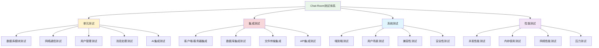
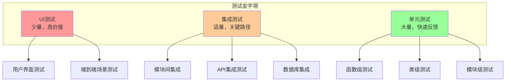

# 第11章：测试与质量保证

## 🎯 学习目标

通过本章学习，您将能够：
- 掌握软件测试的基本理论和方法
- 实现Chat-Room项目的完整测试体系
- 学会使用pytest进行单元测试和集成测试
- 掌握网络程序的调试技巧
- 实现自动化测试和持续集成
- 确保Chat-Room项目的质量和稳定性

## 📚 章节内容

### 1. 测试框架与工具
- [Pytest测试框架](pytest-framework.md) - Python测试框架详解
- [测试环境配置](test-environment.md) - 测试环境搭建与配置

### 2. 测试实践
- [单元测试实践](unit-testing.md) - 函数和类级别的测试
- [集成测试实践](integration-testing.md) - 模块间协作测试
- [TDD实践](tdd-practices.md) - 测试驱动开发方法

### 3. 质量保证
- [代码覆盖率](test-coverage.md) - 测试覆盖率分析
- [性能测试](performance-testing.md) - 性能和压力测试
- [调试技巧](debugging-techniques.md) - 调试工具和方法

## 🧪 测试体系架构



## 🔬 测试金字塔



## 🧪 Chat-Room测试实现

### 测试框架配置

```python
"""
Chat-Room项目测试配置
使用pytest框架实现完整的测试体系
"""

import pytest
import asyncio
import tempfile
import shutil
import sqlite3
import threading
import time
import socket
from pathlib import Path
from typing import Generator, Dict, Any
from unittest.mock import Mock, patch, MagicMock

# 测试配置
pytest_plugins = ["pytest_asyncio"]

@pytest.fixture(scope="session")
def event_loop():
    """创建事件循环"""
    loop = asyncio.get_event_loop_policy().new_event_loop()
    yield loop
    loop.close()

@pytest.fixture
def temp_dir():
    """创建临时目录"""
    temp_path = tempfile.mkdtemp()
    yield Path(temp_path)
    shutil.rmtree(temp_path)

@pytest.fixture
def test_db_path(temp_dir):
    """测试数据库路径"""
    return temp_dir / "test_chatroom.db"

@pytest.fixture
def mock_config():
    """模拟配置"""
    return {
        "server": {
            "host": "localhost",
            "port": 0,  # 使用随机端口
            "max_connections": 10
        },
        "database": {
            "path": ":memory:",
            "timeout": 30.0
        },
        "ai": {
            "api_key": "test_key",
            "model": "test_model",
            "enabled": False
        }
    }

@pytest.fixture
def free_port():
    """获取空闲端口"""
    with socket.socket(socket.AF_INET, socket.SOCK_STREAM) as s:
        s.bind(('', 0))
        s.listen(1)
        port = s.getsockname()[1]
    return port

class TestChatRoomDatabase:
    """数据库模块测试"""
    
    @pytest.fixture
    def db_manager(self, test_db_path):
        """数据库管理器实例"""
        from server.database.manager import ChatRoomDatabase, DatabaseConfig
        
        config = DatabaseConfig(db_path=str(test_db_path))
        db = ChatRoomDatabase(config)
        yield db
        db.close()
    
    def test_database_initialization(self, db_manager):
        """测试数据库初始化"""
        # 检查表是否创建
        with db_manager.connection_pool.get_connection() as conn:
            cursor = conn.cursor()
            
            # 检查用户表
            cursor.execute("SELECT name FROM sqlite_master WHERE type='table' AND name='users'")
            assert cursor.fetchone() is not None
            
            # 检查消息表
            cursor.execute("SELECT name FROM sqlite_master WHERE type='table' AND name='messages'")
            assert cursor.fetchone() is not None
    
    def test_user_crud_operations(self, db_manager):
        """测试用户CRUD操作"""
        from server.database.dao import UserDAO
        
        user_dao = UserDAO(db_manager)
        
        # 创建用户
        user_id = user_dao.create_user("test_user", "hashed_password", "test@example.com")
        assert user_id > 0
        
        # 查询用户
        user = user_dao.get_user_by_username("test_user")
        assert user is not None
        assert user["username"] == "test_user"
        assert user["email"] == "test@example.com"
        
        # 更新用户
        success = user_dao.update_last_login(user_id)
        assert success
        
        # 删除用户（软删除）
        success = user_dao.deactivate_user(user_id)
        assert success
        
        # 验证软删除
        user = user_dao.get_user_by_username("test_user")
        assert user is None  # 已停用的用户不应该被查询到
    
    def test_message_operations(self, db_manager):
        """测试消息操作"""
        from server.database.dao import MessageDAO, UserDAO, GroupDAO
        
        user_dao = UserDAO(db_manager)
        group_dao = GroupDAO(db_manager)
        message_dao = MessageDAO(db_manager)
        
        # 创建测试数据
        user_id = user_dao.create_user("sender", "password", "sender@test.com")
        group_id = group_dao.create_group("test_group", user_id, "测试群组")
        
        # 发送消息
        message_id = message_dao.create_message(
            group_id=group_id,
            sender_id=user_id,
            content="测试消息",
            message_type="text"
        )
        assert message_id > 0
        
        # 查询消息
        messages = message_dao.get_group_messages(group_id, limit=10)
        assert len(messages) == 1
        assert messages[0]["content"] == "测试消息"
        
        # 删除消息
        success = message_dao.delete_message(message_id)
        assert success

class TestNetworkCommunication:
    """网络通信测试"""
    
    @pytest.fixture
    async def test_server(self, free_port, mock_config):
        """测试服务器实例"""
        from server.core.server import ChatRoomServer
        
        mock_config["server"]["port"] = free_port
        server = ChatRoomServer(mock_config)
        
        # 启动服务器
        server_task = asyncio.create_task(server.start())
        await asyncio.sleep(0.1)  # 等待服务器启动
        
        yield server
        
        # 停止服务器
        server.stop()
        try:
            await asyncio.wait_for(server_task, timeout=1.0)
        except asyncio.TimeoutError:
            server_task.cancel()
    
    @pytest.fixture
    async def test_client(self, test_server, free_port):
        """测试客户端实例"""
        from client.core.client import ChatRoomClient
        
        client = ChatRoomClient("localhost", free_port)
        yield client
        
        if client.connected:
            await client.disconnect()
    
    async def test_client_server_connection(self, test_client):
        """测试客户端服务器连接"""
        # 连接服务器
        success = await test_client.connect()
        assert success
        assert test_client.connected
        
        # 断开连接
        await test_client.disconnect()
        assert not test_client.connected
    
    async def test_message_transmission(self, test_client):
        """测试消息传输"""
        await test_client.connect()
        
        # 模拟登录
        login_response = await test_client.login("test_user", "password")
        assert login_response["success"]
        
        # 发送消息
        message_sent = await test_client.send_message("Hello, World!")
        assert message_sent
        
        # 等待消息处理
        await asyncio.sleep(0.1)
    
    async def test_concurrent_connections(self, free_port, mock_config):
        """测试并发连接"""
        from server.core.server import ChatRoomServer
        from client.core.client import ChatRoomClient
        
        # 启动服务器
        mock_config["server"]["port"] = free_port
        server = ChatRoomServer(mock_config)
        server_task = asyncio.create_task(server.start())
        await asyncio.sleep(0.1)
        
        try:
            # 创建多个客户端
            clients = []
            for i in range(5):
                client = ChatRoomClient("localhost", free_port)
                success = await client.connect()
                assert success
                clients.append(client)
            
            # 验证所有客户端都已连接
            assert len(clients) == 5
            for client in clients:
                assert client.connected
            
            # 断开所有客户端
            for client in clients:
                await client.disconnect()
        
        finally:
            server.stop()
            try:
                await asyncio.wait_for(server_task, timeout=1.0)
            except asyncio.TimeoutError:
                server_task.cancel()

class TestUserManagement:
    """用户管理测试"""
    
    @pytest.fixture
    def user_manager(self, test_db_path):
        """用户管理器实例"""
        from server.core.user_manager import UserManager
        
        manager = UserManager(str(test_db_path))
        yield manager
    
    def test_user_registration(self, user_manager):
        """测试用户注册"""
        # 正常注册
        success, message = user_manager.register_user("alice", "password123", "alice@test.com")
        assert success
        assert "注册成功" in message
        
        # 重复注册
        success, message = user_manager.register_user("alice", "password456", "alice2@test.com")
        assert not success
        assert "已存在" in message
    
    def test_user_authentication(self, user_manager):
        """测试用户认证"""
        # 注册用户
        user_manager.register_user("bob", "password123", "bob@test.com")
        
        # 正确认证
        success, user, message = user_manager.authenticate_user("bob", "password123")
        assert success
        assert user is not None
        assert user.username == "bob"
        
        # 错误密码
        success, user, message = user_manager.authenticate_user("bob", "wrong_password")
        assert not success
        assert user is None
        
        # 不存在的用户
        success, user, message = user_manager.authenticate_user("nonexistent", "password")
        assert not success
        assert user is None
    
    def test_session_management(self, user_manager):
        """测试会话管理"""
        # 注册并认证用户
        user_manager.register_user("charlie", "password123", "charlie@test.com")
        success, user, _ = user_manager.authenticate_user("charlie", "password123")
        assert success
        
        # 创建会话
        session_token = user_manager.create_session(user, {"client": "test"})
        assert session_token
        
        # 验证会话
        valid, session_user = user_manager.validate_session(session_token)
        assert valid
        assert session_user.username == "charlie"
        
        # 移除会话
        user_manager.remove_session(session_token)
        
        # 验证会话已失效
        valid, session_user = user_manager.validate_session(session_token)
        assert not valid

class TestFileTransfer:
    """文件传输测试"""
    
    @pytest.fixture
    def file_manager(self, temp_dir):
        """文件传输管理器实例"""
        from server.core.file_manager import FileTransferManager
        
        storage_path = temp_dir / "file_storage"
        manager = FileTransferManager(str(storage_path))
        yield manager
    
    @pytest.fixture
    def test_file(self, temp_dir):
        """测试文件"""
        test_file = temp_dir / "test.txt"
        test_file.write_text("这是一个测试文件内容。" * 100)
        return test_file
    
    def test_file_validation(self, file_manager, test_file):
        """测试文件验证"""
        # 有效文件
        valid, message = file_manager.validate_file(test_file)
        assert valid
        
        # 不存在的文件
        invalid_file = test_file.parent / "nonexistent.txt"
        valid, message = file_manager.validate_file(invalid_file)
        assert not valid
    
    def test_file_upload_process(self, file_manager, test_file):
        """测试文件上传流程"""
        # 准备上传
        success, metadata, message = file_manager.prepare_file_upload(
            test_file, uploader_id=1, group_id=1
        )
        assert success
        assert metadata is not None
        
        # 模拟分块上传
        progress = file_manager.get_transfer_progress(metadata.file_id, "upload")
        assert progress is not None
        
        for chunk_index in range(progress.chunk_count):
            success, chunk, message = file_manager.upload_file_chunk(
                test_file, metadata.file_id, chunk_index
            )
            assert success
            assert chunk is not None
            
            # 模拟服务器接收
            success, message = file_manager.receive_file_chunk(chunk)
            assert success
        
        # 完成上传
        success, message, file_path = file_manager.complete_file_upload(
            metadata.file_id, metadata
        )
        assert success
        assert file_path.exists()

class TestAIIntegration:
    """AI集成测试"""
    
    @pytest.fixture
    def mock_ai_client(self):
        """模拟AI客户端"""
        with patch('server.ai.client.GLMAPIClient') as mock_client:
            # 模拟AI响应
            mock_response = Mock()
            mock_response.content = "这是一个模拟的AI回复"
            mock_response.model = "test_model"
            mock_response.usage = {"total_tokens": 50}
            mock_response.finish_reason = "stop"
            mock_response.response_time = 0.5
            
            mock_client.return_value.generate_response.return_value = mock_response
            yield mock_client
    
    async def test_ai_message_processing(self, mock_ai_client):
        """测试AI消息处理"""
        from server.ai.handler import ChatRoomAI, AIConfig
        
        config = AIConfig(api_key="test_key", model_name="test_model")
        ai = ChatRoomAI(config)
        
        # 测试AI触发
        is_trigger, question = ai.is_ai_trigger("@AI 你好吗？")
        assert is_trigger
        assert question == "你好吗？"
        
        # 测试非AI消息
        is_trigger, question = ai.is_ai_trigger("普通消息")
        assert not is_trigger
        
        # 测试AI回复生成
        response = await ai.process_message(
            user_id=1,
            username="test_user",
            message="@AI 你好吗？",
            group_id=1
        )
        assert response is not None
        assert "模拟的AI回复" in response

class TestPerformance:
    """性能测试"""
    
    def test_database_query_performance(self, db_manager):
        """测试数据库查询性能"""
        from server.database.dao import UserDAO
        
        user_dao = UserDAO(db_manager)
        
        # 创建大量测试数据
        start_time = time.time()
        for i in range(1000):
            user_dao.create_user(f"user_{i}", "password", f"user_{i}@test.com")
        creation_time = time.time() - start_time
        
        # 查询性能测试
        start_time = time.time()
        for i in range(100):
            user = user_dao.get_user_by_username(f"user_{i}")
            assert user is not None
        query_time = time.time() - start_time
        
        # 性能断言（根据实际情况调整）
        assert creation_time < 10.0  # 创建1000用户应在10秒内
        assert query_time < 1.0      # 查询100用户应在1秒内
    
    async def test_concurrent_message_handling(self, free_port, mock_config):
        """测试并发消息处理性能"""
        from server.core.server import ChatRoomServer
        from client.core.client import ChatRoomClient
        
        # 启动服务器
        mock_config["server"]["port"] = free_port
        server = ChatRoomServer(mock_config)
        server_task = asyncio.create_task(server.start())
        await asyncio.sleep(0.1)
        
        try:
            # 创建多个客户端并发送消息
            clients = []
            for i in range(10):
                client = ChatRoomClient("localhost", free_port)
                await client.connect()
                await client.login(f"user_{i}", "password")
                clients.append(client)
            
            # 并发发送消息
            start_time = time.time()
            tasks = []
            for i, client in enumerate(clients):
                for j in range(10):
                    task = client.send_message(f"Message {j} from user_{i}")
                    tasks.append(task)
            
            await asyncio.gather(*tasks)
            total_time = time.time() - start_time
            
            # 性能断言
            assert total_time < 5.0  # 100条消息应在5秒内处理完成
            
            # 断开客户端
            for client in clients:
                await client.disconnect()
        
        finally:
            server.stop()
            try:
                await asyncio.wait_for(server_task, timeout=1.0)
            except asyncio.TimeoutError:
                server_task.cancel()

# 测试运行配置
def pytest_configure(config):
    """pytest配置"""
    config.addinivalue_line(
        "markers", "slow: marks tests as slow (deselect with '-m \"not slow\"')"
    )
    config.addinivalue_line(
        "markers", "integration: marks tests as integration tests"
    )
    config.addinivalue_line(
        "markers", "performance: marks tests as performance tests"
    )

# 测试报告生成
def pytest_html_report_title(report):
    """自定义HTML报告标题"""
    report.title = "Chat-Room 测试报告"

# 使用示例
if __name__ == "__main__":
    # 运行所有测试
    pytest.main([
        "-v",                    # 详细输出
        "--tb=short",           # 简短的错误回溯
        "--html=reports/test_report.html",  # 生成HTML报告
        "--cov=server",         # 代码覆盖率
        "--cov=client",
        "--cov-report=html:reports/coverage",
        "test/"                 # 测试目录
    ])
```

## 📋 学习检查清单

完成本章学习后，请确认您能够：

### 测试理论基础
- [ ] 理解软件测试的重要性和基本概念
- [ ] 掌握测试金字塔和测试策略
- [ ] 了解不同类型测试的适用场景
- [ ] 理解测试驱动开发(TDD)的思想

### 测试框架使用
- [ ] 熟练使用pytest测试框架
- [ ] 编写有效的测试用例
- [ ] 使用测试夹具(fixtures)管理测试数据
- [ ] 实现测试的参数化和标记

### Chat-Room项目测试
- [ ] 实现数据库模块的单元测试
- [ ] 编写网络通信的集成测试
- [ ] 测试用户管理和认证功能
- [ ] 验证文件传输和AI集成功能

### 调试和质量保证
- [ ] 掌握调试技巧和工具使用
- [ ] 实现性能测试和基准测试
- [ ] 生成测试报告和覆盖率报告
- [ ] 建立持续集成测试流程

## 🔗 相关资源

- [pytest官方文档](https://docs.pytest.org/)
- [Python测试最佳实践](https://realpython.com/python-testing/)
- [软件测试基础](https://www.guru99.com/software-testing.html)
- [测试驱动开发指南](https://testdriven.io/)

## 📚 下一步

测试与调试学习完成后，请继续学习：
- [软件测试基础与策略](testing-fundamentals.md)

---

**构建可靠的测试体系，确保Chat-Room项目的质量和稳定性！** 🧪
