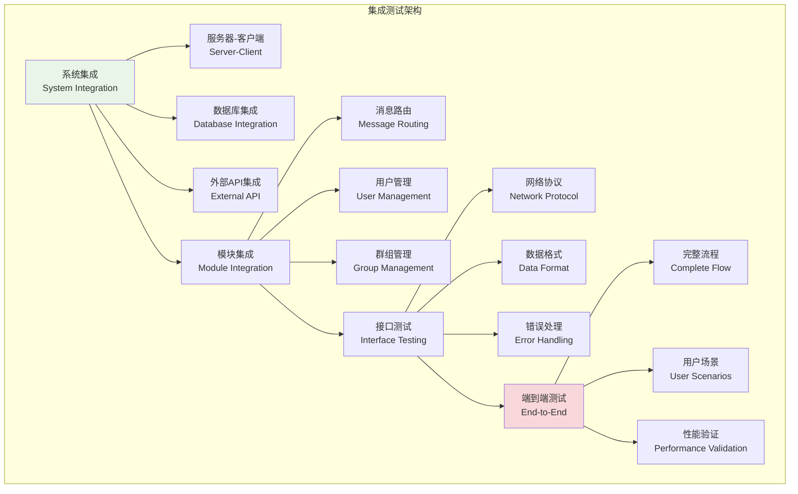
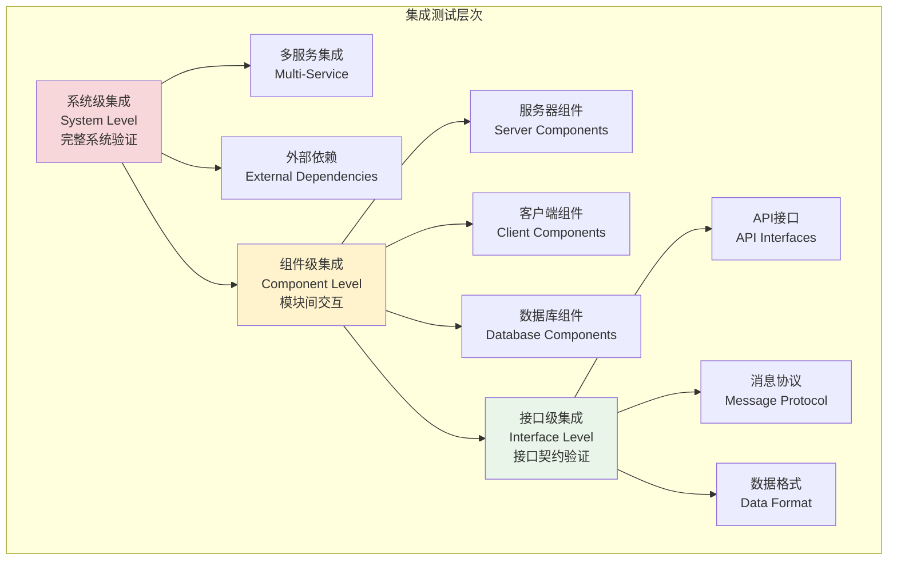

# 集成测试实践

## 🎯 学习目标

通过本章学习，您将能够：
- 理解集成测试的核心概念和重要性
- 掌握Chat-Room项目中各模块间的集成测试方法
- 学会测试客户端-服务器通信和数据库集成
- 实现端到端的功能测试和系统验证

## 🔗 集成测试设计

### 集成测试架构



### 集成测试层次



## 🔧 集成测试实现

### Chat-Room集成测试示例

```python
# tests/integration/test_server_client_integration.py - 服务器客户端集成测试
import pytest
import asyncio
import threading
import time
import json
import socket
from unittest.mock import Mock, AsyncMock
from typing import Dict, List, Any

# 假设的Chat-Room模块导入
# from server.core.server import ChatServer
# from client.core.client import ChatClient
# from shared.protocol import MessageProtocol
# from shared.models import Message, User

@pytest.mark.integration
class TestServerClientIntegration:
    """服务器-客户端集成测试"""
    
    @pytest.fixture
    async def test_server(self, test_config):
        """测试服务器夹具"""
        # 模拟服务器类
        class MockChatServer:
            def __init__(self, config):
                self.config = config
                self.host = config.server.host
                self.port = 0  # 使用随机端口
                self.clients = {}
                self.running = False
                self.server_socket = None
                self.message_history = []
            
            async def start(self):
                """启动服务器"""
                self.server_socket = socket.socket(socket.AF_INET, socket.SOCK_STREAM)
                self.server_socket.setsockopt(socket.SOL_SOCKET, socket.SO_REUSEADDR, 1)
                self.server_socket.bind((self.host, 0))
                self.port = self.server_socket.getsockname()[1]
                self.server_socket.listen(5)
                self.running = True
                print(f"测试服务器启动在 {self.host}:{self.port}")
            
            async def stop(self):
                """停止服务器"""
                self.running = False
                if self.server_socket:
                    self.server_socket.close()
                print("测试服务器已停止")
            
            def get_address(self):
                """获取服务器地址"""
                return (self.host, self.port)
            
            def add_client(self, client_id, client_socket):
                """添加客户端"""
                self.clients[client_id] = client_socket
            
            def broadcast_message(self, message, sender_id=None):
                """广播消息"""
                self.message_history.append({
                    'message': message,
                    'sender_id': sender_id,
                    'timestamp': time.time()
                })
        
        server = MockChatServer(test_config)
        await server.start()
        yield server
        await server.stop()
    
    @pytest.fixture
    async def test_client(self, test_server):
        """测试客户端夹具"""
        # 模拟客户端类
        class MockChatClient:
            def __init__(self, server_address):
                self.host, self.port = server_address
                self.connected = False
                self.socket = None
                self.username = None
                self.received_messages = []
            
            async def connect(self):
                """连接到服务器"""
                try:
                    self.socket = socket.socket(socket.AF_INET, socket.SOCK_STREAM)
                    self.socket.settimeout(5.0)  # 设置超时
                    self.socket.connect((self.host, self.port))
                    self.connected = True
                    return True
                except Exception as e:
                    print(f"连接失败: {e}")
                    return False
            
            async def disconnect(self):
                """断开连接"""
                if self.socket:
                    self.socket.close()
                self.connected = False
            
            async def login(self, username, password):
                """用户登录"""
                if not self.connected:
                    return False
                
                login_data = {
                    'type': 'login',
                    'username': username,
                    'password': password
                }
                
                success = await self.send_message(login_data)
                if success:
                    self.username = username
                return success
            
            async def send_message(self, message_data):
                """发送消息"""
                if not self.connected:
                    return False
                
                try:
                    message_json = json.dumps(message_data, ensure_ascii=False)
                    message_bytes = message_json.encode('utf-8')
                    
                    # 发送消息长度头
                    import struct
                    length_header = struct.pack('!I', len(message_bytes))
                    self.socket.send(length_header + message_bytes)
                    return True
                except Exception as e:
                    print(f"发送消息失败: {e}")
                    return False
            
            async def receive_message(self, timeout=5.0):
                """接收消息"""
                if not self.connected:
                    return None
                
                try:
                    self.socket.settimeout(timeout)
                    
                    # 接收消息长度头
                    import struct
                    length_data = self.socket.recv(4)
                    if len(length_data) < 4:
                        return None
                    
                    message_length = struct.unpack('!I', length_data)[0]
                    
                    # 接收消息内容
                    message_data = b''
                    while len(message_data) < message_length:
                        chunk = self.socket.recv(message_length - len(message_data))
                        if not chunk:
                            break
                        message_data += chunk
                    
                    if len(message_data) == message_length:
                        message = json.loads(message_data.decode('utf-8'))
                        self.received_messages.append(message)
                        return message
                    
                except socket.timeout:
                    print("接收消息超时")
                except Exception as e:
                    print(f"接收消息失败: {e}")
                
                return None
        
        client = MockChatClient(test_server.get_address())
        yield client
        await client.disconnect()
    
    async def test_client_server_connection(self, test_client):
        """测试客户端服务器连接"""
        # 测试连接建立
        connected = await test_client.connect()
        assert connected is True
        assert test_client.connected is True
        
        # 测试连接断开
        await test_client.disconnect()
        assert test_client.connected is False
    
    async def test_user_login_flow(self, test_client):
        """测试用户登录流程"""
        # 建立连接
        await test_client.connect()
        
        # 测试登录
        login_success = await test_client.login("testuser", "password123")
        assert login_success is True
        assert test_client.username == "testuser"
    
    async def test_message_sending(self, test_client):
        """测试消息发送"""
        await test_client.connect()
        await test_client.login("testuser", "password123")
        
        # 发送聊天消息
        message_data = {
            'type': 'chat_message',
            'content': 'Hello, World!',
            'group_id': 1
        }
        
        success = await test_client.send_message(message_data)
        assert success is True
    
    async def test_multiple_clients(self, test_server):
        """测试多客户端连接"""
        # 创建多个客户端
        clients = []
        for i in range(3):
            client = MockChatClient(test_server.get_address())
            await client.connect()
            await client.login(f"user{i}", "password123")
            clients.append(client)
        
        # 验证所有客户端都已连接
        for client in clients:
            assert client.connected is True
            assert client.username is not None
        
        # 清理连接
        for client in clients:
            await client.disconnect()

@pytest.mark.integration
class TestDatabaseIntegration:
    """数据库集成测试"""
    
    async def test_user_database_operations(self, populated_database):
        """测试用户数据库操作集成"""
        # 模拟用户管理器和数据库的集成
        class UserManager:
            def __init__(self, db):
                self.db = db
            
            def create_user(self, username, email, password_hash):
                cursor = self.db.execute(
                    "INSERT INTO users (username, email, password_hash) VALUES (?, ?, ?)",
                    (username, email, password_hash)
                )
                return cursor.lastrowid
            
            def get_user_by_username(self, username):
                result = self.db.execute(
                    "SELECT id, username, email, is_active FROM users WHERE username = ?",
                    (username,)
                ).fetchone()
                
                if result:
                    return {
                        'id': result[0],
                        'username': result[1],
                        'email': result[2],
                        'is_active': bool(result[3])
                    }
                return None
            
            def authenticate_user(self, username, password_hash):
                result = self.db.execute(
                    "SELECT id FROM users WHERE username = ? AND password_hash = ? AND is_active = 1",
                    (username, password_hash)
                ).fetchone()
                
                return result[0] if result else None
        
        user_manager = UserManager(populated_database)
        
        # 测试创建用户
        user_id = user_manager.create_user("newuser", "new@example.com", "hashed_password")
        assert user_id is not None
        
        # 测试获取用户
        user = user_manager.get_user_by_username("newuser")
        assert user is not None
        assert user['username'] == "newuser"
        assert user['email'] == "new@example.com"
        
        # 测试用户认证
        auth_user_id = user_manager.authenticate_user("newuser", "hashed_password")
        assert auth_user_id == user_id
        
        # 测试错误密码
        auth_fail = user_manager.authenticate_user("newuser", "wrong_password")
        assert auth_fail is None
    
    async def test_message_database_operations(self, populated_database):
        """测试消息数据库操作集成"""
        class MessageManager:
            def __init__(self, db):
                self.db = db
            
            def save_message(self, content, user_id, group_id=None):
                cursor = self.db.execute(
                    "INSERT INTO messages (content, user_id, group_id) VALUES (?, ?, ?)",
                    (content, user_id, group_id)
                )
                return cursor.lastrowid
            
            def get_group_messages(self, group_id, limit=50):
                results = self.db.execute(
                    """
                    SELECT m.id, m.content, m.user_id, u.username, m.created_at
                    FROM messages m
                    JOIN users u ON m.user_id = u.id
                    WHERE m.group_id = ?
                    ORDER BY m.created_at DESC
                    LIMIT ?
                    """,
                    (group_id, limit)
                ).fetchall()
                
                return [
                    {
                        'id': row[0],
                        'content': row[1],
                        'user_id': row[2],
                        'username': row[3],
                        'created_at': row[4]
                    }
                    for row in results
                ]
        
        message_manager = MessageManager(populated_database)
        
        # 测试保存消息
        message_id = message_manager.save_message("集成测试消息", 1, 1)
        assert message_id is not None
        
        # 测试获取群组消息
        messages = message_manager.get_group_messages(1)
        assert len(messages) > 0
        
        # 验证新消息在列表中
        new_message = next((msg for msg in messages if msg['id'] == message_id), None)
        assert new_message is not None
        assert new_message['content'] == "集成测试消息"
        assert new_message['user_id'] == 1

@pytest.mark.integration
class TestMessageRoutingIntegration:
    """消息路由集成测试"""

    async def test_group_message_routing(self, test_server):
        """测试群组消息路由"""
        # 创建多个客户端加入同一群组
        clients = []
        for i in range(3):
            client = MockChatClient(test_server.get_address())
            await client.connect()
            await client.login(f"user{i}", "password123")

            # 加入群组
            join_data = {
                'type': 'join_group',
                'group_id': 1
            }
            await client.send_message(join_data)
            clients.append(client)

        # 第一个客户端发送群组消息
        message_data = {
            'type': 'group_message',
            'content': '大家好！',
            'group_id': 1
        }
        await clients[0].send_message(message_data)

        # 验证其他客户端收到消息
        for i in range(1, 3):
            received = await clients[i].receive_message(timeout=3.0)
            assert received is not None
            assert received['type'] == 'group_message'
            assert received['content'] == '大家好！'

        # 清理连接
        for client in clients:
            await client.disconnect()

    async def test_private_message_routing(self, test_server):
        """测试私聊消息路由"""
        # 创建两个客户端
        client1 = MockChatClient(test_server.get_address())
        client2 = MockChatClient(test_server.get_address())

        await client1.connect()
        await client2.connect()

        await client1.login("user1", "password123")
        await client2.login("user2", "password123")

        # 客户端1发送私聊消息给客户端2
        private_message = {
            'type': 'private_message',
            'content': '你好，这是私聊消息',
            'target_user': 'user2'
        }
        await client1.send_message(private_message)

        # 验证客户端2收到私聊消息
        received = await client2.receive_message(timeout=3.0)
        assert received is not None
        assert received['type'] == 'private_message'
        assert received['content'] == '你好，这是私聊消息'
        assert received['sender'] == 'user1'

        # 清理连接
        await client1.disconnect()
        await client2.disconnect()

@pytest.mark.integration
class TestAIIntegration:
    """AI集成测试"""

    async def test_ai_response_integration(self, mock_ai_service):
        """测试AI响应集成"""
        # 设置AI服务响应
        mock_ai_service.set_response("hello", "Hello! How can I help you today?")

        # 模拟AI消息处理器
        class AIMessageProcessor:
            def __init__(self, ai_service):
                self.ai_service = ai_service

            async def process_message(self, message, context=None):
                if message.startswith("@AI"):
                    user_message = message[3:].strip()
                    ai_response = await self.ai_service.generate_response(user_message, context)
                    return {
                        'type': 'ai_response',
                        'content': ai_response,
                        'original_message': user_message
                    }
                return None

        processor = AIMessageProcessor(mock_ai_service)

        # 测试AI响应
        result = await processor.process_message("@AI hello")
        assert result is not None
        assert result['type'] == 'ai_response'
        assert result['content'] == "Hello! How can I help you today?"
        assert result['original_message'] == "hello"

        # 测试非AI消息
        result = await processor.process_message("普通消息")
        assert result is None

## 🚀 端到端测试

### 完整用户场景测试

```python
# tests/integration/test_end_to_end.py - 端到端测试
import pytest
import asyncio
import time
from typing import List

@pytest.mark.e2e
class TestEndToEndScenarios:
    """端到端场景测试"""

    async def test_complete_chat_session(self, test_server):
        """测试完整聊天会话"""
        # 场景：用户注册、登录、加入群组、发送消息、退出

        # 1. 创建客户端并连接
        client = MockChatClient(test_server.get_address())
        await client.connect()

        # 2. 用户注册
        register_data = {
            'type': 'register',
            'username': 'testuser',
            'email': 'test@example.com',
            'password': 'password123'
        }
        await client.send_message(register_data)

        # 3. 用户登录
        login_success = await client.login('testuser', 'password123')
        assert login_success is True

        # 4. 获取群组列表
        list_groups_data = {'type': 'list_groups'}
        await client.send_message(list_groups_data)

        groups_response = await client.receive_message()
        assert groups_response is not None
        assert groups_response['type'] == 'groups_list'

        # 5. 加入群组
        join_group_data = {
            'type': 'join_group',
            'group_id': 1
        }
        await client.send_message(join_group_data)

        join_response = await client.receive_message()
        assert join_response['type'] == 'join_success'

        # 6. 发送群组消息
        message_data = {
            'type': 'group_message',
            'content': '大家好，我是新成员！',
            'group_id': 1
        }
        await client.send_message(message_data)

        # 7. 获取消息历史
        history_data = {
            'type': 'get_history',
            'group_id': 1,
            'limit': 10
        }
        await client.send_message(history_data)

        history_response = await client.receive_message()
        assert history_response['type'] == 'message_history'
        assert len(history_response['messages']) > 0

        # 8. 退出群组
        leave_data = {
            'type': 'leave_group',
            'group_id': 1
        }
        await client.send_message(leave_data)

        leave_response = await client.receive_message()
        assert leave_response['type'] == 'leave_success'

        # 9. 断开连接
        await client.disconnect()

    async def test_multi_user_chat_scenario(self, test_server):
        """测试多用户聊天场景"""
        # 场景：多个用户同时在线聊天

        users = ['alice', 'bob', 'charlie']
        clients = []

        # 1. 所有用户连接并登录
        for username in users:
            client = MockChatClient(test_server.get_address())
            await client.connect()
            await client.login(username, 'password123')

            # 加入群组
            join_data = {'type': 'join_group', 'group_id': 1}
            await client.send_message(join_data)

            clients.append(client)

        # 2. 用户轮流发送消息
        messages = [
            "Alice: 大家好！",
            "Bob: 你好Alice！",
            "Charlie: 大家都在啊！"
        ]

        for i, message in enumerate(messages):
            message_data = {
                'type': 'group_message',
                'content': message,
                'group_id': 1
            }
            await clients[i].send_message(message_data)

            # 等待消息传播
            await asyncio.sleep(0.1)

        # 3. 验证所有用户都收到了消息
        for client in clients:
            # 每个客户端应该收到其他用户的消息
            received_count = 0
            while received_count < 2:  # 除了自己的消息
                message = await client.receive_message(timeout=1.0)
                if message and message['type'] == 'group_message':
                    received_count += 1

        # 4. 清理连接
        for client in clients:
            await client.disconnect()

## 📊 性能集成测试

### 负载测试

```python
@pytest.mark.performance
class TestPerformanceIntegration:
    """性能集成测试"""

    async def test_concurrent_connections(self, test_server, performance_helper):
        """测试并发连接性能"""
        performance_helper.start_timer()

        # 创建大量并发连接
        connection_count = 50
        clients = []

        # 并发连接
        async def create_client():
            client = MockChatClient(test_server.get_address())
            success = await client.connect()
            if success:
                await client.login(f"user_{len(clients)}", "password123")
            return client

        # 使用asyncio.gather进行并发操作
        clients = await asyncio.gather(*[create_client() for _ in range(connection_count)])

        performance_helper.stop_timer()

        # 验证连接成功
        connected_clients = [c for c in clients if c.connected]
        assert len(connected_clients) >= connection_count * 0.9  # 允许10%失败率

        # 验证性能要求（连接建立应在5秒内完成）
        performance_helper.assert_performance(5.0, "并发连接建立")

        # 清理连接
        for client in connected_clients:
            await client.disconnect()

    async def test_message_throughput(self, test_server, performance_helper):
        """测试消息吞吐量"""
        # 创建发送者和接收者
        sender = MockChatClient(test_server.get_address())
        receiver = MockChatClient(test_server.get_address())

        await sender.connect()
        await receiver.connect()

        await sender.login("sender", "password123")
        await receiver.login("receiver", "password123")

        # 加入同一群组
        for client in [sender, receiver]:
            join_data = {'type': 'join_group', 'group_id': 1}
            await client.send_message(join_data)

        performance_helper.start_timer()

        # 发送大量消息
        message_count = 100
        for i in range(message_count):
            message_data = {
                'type': 'group_message',
                'content': f'性能测试消息 {i}',
                'group_id': 1
            }
            await sender.send_message(message_data)

        # 验证接收到的消息数量
        received_count = 0
        while received_count < message_count:
            message = await receiver.receive_message(timeout=0.1)
            if message and message['type'] == 'group_message':
                received_count += 1

            # 防止无限等待
            if performance_helper.get_duration() > 10.0:
                break

        performance_helper.stop_timer()

        # 验证消息传输效率
        assert received_count >= message_count * 0.95  # 允许5%丢失
        performance_helper.assert_performance(10.0, f"传输{message_count}条消息")

        # 清理连接
        await sender.disconnect()
        await receiver.disconnect()

## 📋 学习检查清单

完成本节学习后，请确认您能够：

- [ ] 理解集成测试与单元测试的区别
- [ ] 设计服务器-客户端集成测试
- [ ] 编写数据库集成测试
- [ ] 实现消息路由集成测试
- [ ] 测试AI功能集成
- [ ] 编写端到端场景测试
- [ ] 进行性能集成测试
- [ ] 使用pytest标记管理不同类型的测试
- [ ] 分析集成测试结果和性能指标

## 🚀 下一步

掌握集成测试后，请继续学习：
- [TDD实践](tdd-practices.md) - 测试驱动开发
- [测试覆盖率](test-coverage.md) - 代码覆盖率分析
- [第12章：优化与部署](../12-optimization-deployment/README.md)

---


## 📖 导航

⬅️ **上一节：** [Unit Testing](unit-testing.md)

➡️ **下一节：** [Test Coverage](test-coverage.md)

📚 **返回：** [第15章：测试开发](README.md)

🏠 **主页：** [学习路径总览](../README.md)
**集成测试确保系统各部分协同工作，是保证软件质量的重要环节！** 🔗
```
