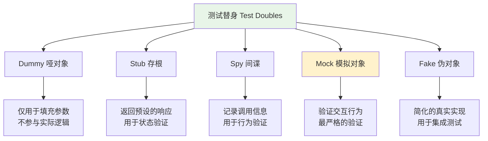
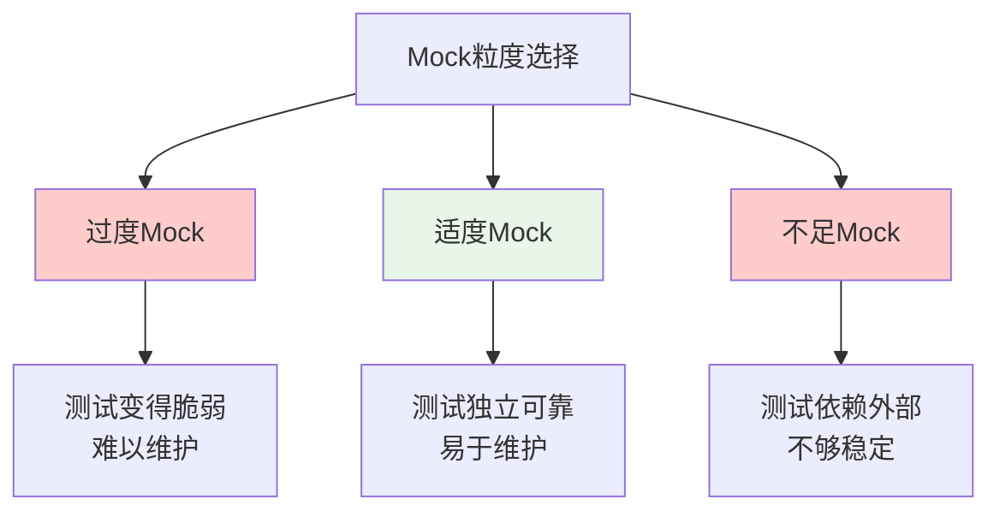

# Mock测试技术

## 🎯 学习目标

通过本节学习，您将能够：
- 理解Mock测试的概念和重要性
- 掌握Python unittest.mock模块的使用
- 学会为Chat-Room项目编写Mock测试
- 了解测试替身的不同类型和应用场景
- 掌握依赖隔离和测试独立性的实现方法

## 📖 内容概览

Mock测试是单元测试中的重要技术，通过创建模拟对象来替代真实的依赖项，使测试更加独立、快速和可控。本节将详细介绍Mock测试的原理、实现方法，并结合Chat-Room项目的实际场景进行实践。

## 🎭 Mock测试基础概念

### 什么是Mock测试

Mock测试是一种测试技术，通过创建模拟对象（Mock Object）来替代被测试代码的外部依赖，从而实现：
- **隔离测试**：消除外部依赖的影响
- **控制环境**：精确控制测试条件
- **提高速度**：避免耗时的外部调用
- **增强可靠性**：减少测试的不确定性

### 测试替身类型



## 🐍 Python Mock模块详解

### unittest.mock基础用法

```python
import unittest
from unittest.mock import Mock, patch, MagicMock
import socket
import json

# Chat-Room项目中的示例类
class ChatServer:
    """聊天服务器类"""
    
    def __init__(self, host='localhost', port=8888):
        self.host = host
        self.port = port
        self.socket = None
        self.clients = {}
    
    def start_server(self):
        """启动服务器"""
        self.socket = socket.socket(socket.AF_INET, socket.SOCK_STREAM)
        self.socket.bind((self.host, self.port))
        self.socket.listen(5)
        return True
    
    def send_message(self, client_id, message):
        """发送消息给客户端"""
        if client_id in self.clients:
            client_socket = self.clients[client_id]
            data = json.dumps({'type': 'message', 'content': message})
            client_socket.send(data.encode())
            return True
        return False
    
    def broadcast_message(self, message, sender_id=None):
        """广播消息给所有客户端"""
        data = json.dumps({
            'type': 'broadcast',
            'content': message,
            'sender': sender_id
        })
        
        success_count = 0
        for client_id, client_socket in self.clients.items():
            if client_id != sender_id:  # 不发送给发送者自己
                try:
                    client_socket.send(data.encode())
                    success_count += 1
                except Exception:
                    # 发送失败，可能客户端已断开
                    pass
        
        return success_count

class TestChatServerMock(unittest.TestCase):
    """Chat服务器Mock测试类"""
    
    def setUp(self):
        """测试前准备"""
        self.server = ChatServer()
    
    @patch('socket.socket')
    def test_start_server_success(self, mock_socket_class):
        """测试服务器启动成功"""
        # 创建mock socket实例
        mock_socket_instance = Mock()
        mock_socket_class.return_value = mock_socket_instance
        
        # 执行测试
        result = self.server.start_server()
        
        # 验证结果
        self.assertTrue(result)
        
        # 验证socket调用
        mock_socket_class.assert_called_once_with(
            socket.AF_INET, socket.SOCK_STREAM
        )
        mock_socket_instance.bind.assert_called_once_with(('localhost', 8888))
        mock_socket_instance.listen.assert_called_once_with(5)
    
    def test_send_message_to_existing_client(self):
        """测试向存在的客户端发送消息"""
        # 创建mock客户端socket
        mock_client_socket = Mock()
        self.server.clients['user1'] = mock_client_socket
        
        # 执行测试
        result = self.server.send_message('user1', 'Hello World')
        
        # 验证结果
        self.assertTrue(result)
        
        # 验证socket调用
        expected_data = json.dumps({
            'type': 'message',
            'content': 'Hello World'
        }).encode()
        mock_client_socket.send.assert_called_once_with(expected_data)
    
    def test_send_message_to_nonexistent_client(self):
        """测试向不存在的客户端发送消息"""
        result = self.server.send_message('nonexistent', 'Hello')
        self.assertFalse(result)
    
    def test_broadcast_message(self):
        """测试广播消息"""
        # 创建多个mock客户端
        mock_client1 = Mock()
        mock_client2 = Mock()
        mock_client3 = Mock()
        
        self.server.clients = {
            'user1': mock_client1,
            'user2': mock_client2,
            'user3': mock_client3
        }
        
        # 执行广播（user1发送消息）
        result = self.server.broadcast_message('Hello everyone!', 'user1')
        
        # 验证结果（应该发送给2个客户端，排除发送者）
        self.assertEqual(result, 2)
        
        # 验证消息内容
        expected_data = json.dumps({
            'type': 'broadcast',
            'content': 'Hello everyone!',
            'sender': 'user1'
        }).encode()
        
        # user1不应该收到消息（是发送者）
        mock_client1.send.assert_not_called()
        
        # user2和user3应该收到消息
        mock_client2.send.assert_called_once_with(expected_data)
        mock_client3.send.assert_called_once_with(expected_data)
    
    def test_broadcast_with_failed_clients(self):
        """测试广播时部分客户端发送失败"""
        mock_client1 = Mock()
        mock_client2 = Mock()
        
        # 设置client2发送时抛出异常
        mock_client2.send.side_effect = ConnectionError("Client disconnected")
        
        self.server.clients = {
            'user1': mock_client1,
            'user2': mock_client2
        }
        
        # 执行广播
        result = self.server.broadcast_message('Test message')
        
        # 验证结果（只有1个成功）
        self.assertEqual(result, 1)
        
        # 验证两个客户端都尝试发送了
        self.assertTrue(mock_client1.send.called)
        self.assertTrue(mock_client2.send.called)
```

### 高级Mock技术

```python
from unittest.mock import patch, call, ANY
import sqlite3
from datetime import datetime

class UserManager:
    """用户管理类"""
    
    def __init__(self, db_path='chat.db'):
        self.db_path = db_path
    
    def create_user(self, username, password, email):
        """创建新用户"""
        conn = sqlite3.connect(self.db_path)
        cursor = conn.cursor()
        
        try:
            cursor.execute(
                "INSERT INTO users (username, password, email, created_at) VALUES (?, ?, ?, ?)",
                (username, password, email, datetime.now())
            )
            conn.commit()
            user_id = cursor.lastrowid
            return {'success': True, 'user_id': user_id}
        except sqlite3.IntegrityError:
            return {'success': False, 'error': 'Username already exists'}
        finally:
            conn.close()
    
    def get_user_by_username(self, username):
        """根据用户名获取用户信息"""
        conn = sqlite3.connect(self.db_path)
        cursor = conn.cursor()
        
        try:
            cursor.execute(
                "SELECT id, username, email, created_at FROM users WHERE username = ?",
                (username,)
            )
            row = cursor.fetchone()
            if row:
                return {
                    'id': row[0],
                    'username': row[1],
                    'email': row[2],
                    'created_at': row[3]
                }
            return None
        finally:
            conn.close()

class TestUserManagerMock(unittest.TestCase):
    """用户管理Mock测试类"""
    
    @patch('sqlite3.connect')
    def test_create_user_success(self, mock_connect):
        """测试成功创建用户"""
        # 设置mock数据库连接
        mock_conn = Mock()
        mock_cursor = Mock()
        mock_connect.return_value = mock_conn
        mock_conn.cursor.return_value = mock_cursor
        mock_cursor.lastrowid = 123
        
        # 创建用户管理器
        user_manager = UserManager()
        
        # 执行测试
        result = user_manager.create_user('testuser', 'password123', 'test@example.com')
        
        # 验证结果
        self.assertTrue(result['success'])
        self.assertEqual(result['user_id'], 123)
        
        # 验证数据库调用
        mock_connect.assert_called_once_with('chat.db')
        mock_conn.cursor.assert_called_once()
        mock_cursor.execute.assert_called_once()
        mock_conn.commit.assert_called_once()
        mock_conn.close.assert_called_once()
        
        # 验证SQL语句和参数
        call_args = mock_cursor.execute.call_args
        sql = call_args[0][0]
        params = call_args[0][1]
        
        self.assertIn('INSERT INTO users', sql)
        self.assertEqual(params[0], 'testuser')
        self.assertEqual(params[1], 'password123')
        self.assertEqual(params[2], 'test@example.com')
        self.assertIsInstance(params[3], datetime)
    
    @patch('sqlite3.connect')
    def test_create_user_duplicate_username(self, mock_connect):
        """测试创建重复用户名"""
        # 设置mock数据库连接
        mock_conn = Mock()
        mock_cursor = Mock()
        mock_connect.return_value = mock_conn
        mock_conn.cursor.return_value = mock_cursor
        
        # 设置执行SQL时抛出完整性错误
        mock_cursor.execute.side_effect = sqlite3.IntegrityError("UNIQUE constraint failed")
        
        user_manager = UserManager()
        result = user_manager.create_user('existing_user', 'password', 'email@test.com')
        
        # 验证结果
        self.assertFalse(result['success'])
        self.assertEqual(result['error'], 'Username already exists')
        
        # 验证数据库连接被正确关闭
        mock_conn.close.assert_called_once()
    
    @patch('sqlite3.connect')
    def test_get_user_by_username_found(self, mock_connect):
        """测试根据用户名查找用户（找到）"""
        # 设置mock数据库返回数据
        mock_conn = Mock()
        mock_cursor = Mock()
        mock_connect.return_value = mock_conn
        mock_conn.cursor.return_value = mock_cursor
        
        # 模拟数据库返回的行数据
        mock_cursor.fetchone.return_value = (
            1, 'testuser', 'test@example.com', '2025-01-17 10:00:00'
        )
        
        user_manager = UserManager()
        result = user_manager.get_user_by_username('testuser')
        
        # 验证结果
        self.assertIsNotNone(result)
        self.assertEqual(result['id'], 1)
        self.assertEqual(result['username'], 'testuser')
        self.assertEqual(result['email'], 'test@example.com')
        
        # 验证SQL查询
        mock_cursor.execute.assert_called_once_with(
            "SELECT id, username, email, created_at FROM users WHERE username = ?",
            ('testuser',)
        )
    
    @patch('sqlite3.connect')
    def test_get_user_by_username_not_found(self, mock_connect):
        """测试根据用户名查找用户（未找到）"""
        mock_conn = Mock()
        mock_cursor = Mock()
        mock_connect.return_value = mock_conn
        mock_conn.cursor.return_value = mock_cursor
        
        # 模拟数据库未找到数据
        mock_cursor.fetchone.return_value = None
        
        user_manager = UserManager()
        result = user_manager.get_user_by_username('nonexistent')
        
        # 验证结果
        self.assertIsNone(result)
```

## 🔧 Mock测试最佳实践

### 1. Mock的粒度控制



### 2. Mock对象的生命周期管理

```python
class TestChatRoomIntegration(unittest.TestCase):
    """聊天室集成测试"""
    
    def setUp(self):
        """每个测试前的准备工作"""
        self.mock_database = Mock()
        self.mock_network = Mock()
        
        # 创建被测试对象，注入mock依赖
        self.chat_room = ChatRoom(
            database=self.mock_database,
            network=self.mock_network
        )
    
    def tearDown(self):
        """每个测试后的清理工作"""
        # 重置mock对象状态
        self.mock_database.reset_mock()
        self.mock_network.reset_mock()
    
    def test_user_join_room(self):
        """测试用户加入聊天室"""
        # 设置mock行为
        self.mock_database.get_user.return_value = {'id': 1, 'name': 'testuser'}
        self.mock_database.add_user_to_room.return_value = True
        
        # 执行测试
        result = self.chat_room.join_room('testuser', 'general')
        
        # 验证结果和交互
        self.assertTrue(result)
        self.mock_database.get_user.assert_called_once_with('testuser')
        self.mock_database.add_user_to_room.assert_called_once_with(1, 'general')
```

### 3. 复杂场景的Mock策略

```python
from unittest.mock import patch, PropertyMock
import asyncio

class AIAssistant:
    """AI助手类"""
    
    def __init__(self, api_key, model='glm-4-flash'):
        self.api_key = api_key
        self.model = model
        self.session = None
    
    async def get_response(self, message, context=None):
        """获取AI响应"""
        import aiohttp
        
        async with aiohttp.ClientSession() as session:
            headers = {'Authorization': f'Bearer {self.api_key}'}
            data = {
                'model': self.model,
                'messages': [{'role': 'user', 'content': message}]
            }
            
            if context:
                data['messages'].insert(0, {'role': 'system', 'content': context})
            
            async with session.post(
                'https://api.example.com/chat',
                headers=headers,
                json=data
            ) as response:
                if response.status == 200:
                    result = await response.json()
                    return result['choices'][0]['message']['content']
                else:
                    raise Exception(f"API Error: {response.status}")

class TestAIAssistantMock(unittest.TestCase):
    """AI助手Mock测试"""
    
    @patch('aiohttp.ClientSession')
    async def test_get_response_success(self, mock_session_class):
        """测试成功获取AI响应"""
        # 创建mock响应对象
        mock_response = Mock()
        mock_response.status = 200
        mock_response.json = Mock(return_value=asyncio.coroutine(lambda: {
            'choices': [{'message': {'content': 'Hello! How can I help you?'}}]
        })())
        
        # 创建mock session
        mock_session = Mock()
        mock_session.post.return_value.__aenter__.return_value = mock_response
        mock_session_class.return_value.__aenter__.return_value = mock_session
        
        # 执行测试
        ai_assistant = AIAssistant('test-api-key')
        result = await ai_assistant.get_response('Hello')
        
        # 验证结果
        self.assertEqual(result, 'Hello! How can I help you?')
        
        # 验证API调用
        mock_session.post.assert_called_once()
        call_args = mock_session.post.call_args
        self.assertEqual(call_args[0][0], 'https://api.example.com/chat')
        self.assertIn('Authorization', call_args[1]['headers'])
    
    @patch('aiohttp.ClientSession')
    async def test_get_response_api_error(self, mock_session_class):
        """测试API错误响应"""
        # 设置mock返回错误状态
        mock_response = Mock()
        mock_response.status = 500
        
        mock_session = Mock()
        mock_session.post.return_value.__aenter__.return_value = mock_response
        mock_session_class.return_value.__aenter__.return_value = mock_session
        
        ai_assistant = AIAssistant('test-api-key')
        
        # 验证异常抛出
        with self.assertRaises(Exception) as context:
            await ai_assistant.get_response('Hello')
        
        self.assertIn('API Error: 500', str(context.exception))
```

## 📊 Mock测试的度量和评估

### 测试覆盖率分析

```python
# 运行测试并生成覆盖率报告
# pip install coverage
# coverage run -m pytest tests/
# coverage report -m
# coverage html

class TestCoverageExample(unittest.TestCase):
    """测试覆盖率示例"""
    
    @patch('requests.get')
    def test_api_call_with_different_responses(self, mock_get):
        """测试不同API响应的处理"""
        
        # 测试成功响应
        mock_get.return_value.status_code = 200
        mock_get.return_value.json.return_value = {'status': 'success'}
        result = api_call('test-endpoint')
        self.assertEqual(result['status'], 'success')
        
        # 测试错误响应
        mock_get.return_value.status_code = 404
        result = api_call('test-endpoint')
        self.assertIsNone(result)
        
        # 测试网络异常
        mock_get.side_effect = requests.ConnectionError()
        result = api_call('test-endpoint')
        self.assertIsNone(result)
```

## 🎯 Chat-Room项目Mock测试实践

### 完整的测试套件示例

```python
# tests/test_chat_server_mock.py
import unittest
from unittest.mock import Mock, patch, call
import sys
import os

# 添加项目根目录到路径
sys.path.insert(0, os.path.join(os.path.dirname(__file__), '..'))

from server.chat_server import ChatServer
from shared.message_protocol import MessageProtocol

class TestChatServerComplete(unittest.TestCase):
    """完整的聊天服务器Mock测试套件"""
    
    def setUp(self):
        """测试准备"""
        self.server = ChatServer()
        self.mock_clients = {}
        
        # 创建多个mock客户端
        for i in range(3):
            self.mock_clients[f'user{i+1}'] = Mock()
    
    @patch('server.chat_server.socket.socket')
    @patch('server.chat_server.threading.Thread')
    def test_server_lifecycle(self, mock_thread, mock_socket):
        """测试服务器完整生命周期"""
        # 启动服务器
        self.server.start()
        
        # 验证socket创建和绑定
        mock_socket.assert_called()
        
        # 验证线程启动
        mock_thread.assert_called()
        
        # 停止服务器
        self.server.stop()
        
        # 验证清理工作
        self.assertFalse(self.server.running)
    
    def test_message_routing_scenarios(self):
        """测试各种消息路由场景"""
        self.server.clients = self.mock_clients.copy()
        
        # 场景1：私聊消息
        self.server.route_private_message('user1', 'user2', 'Hello user2!')
        
        # 验证只有user2收到消息
        self.mock_clients['user2'].send.assert_called_once()
        self.mock_clients['user1'].send.assert_not_called()
        self.mock_clients['user3'].send.assert_not_called()
        
        # 重置mock
        for client in self.mock_clients.values():
            client.reset_mock()
        
        # 场景2：群组广播
        self.server.broadcast_to_group('general', 'user1', 'Hello everyone!')
        
        # 验证除发送者外的所有用户都收到消息
        self.mock_clients['user1'].send.assert_not_called()
        self.mock_clients['user2'].send.assert_called_once()
        self.mock_clients['user3'].send.assert_called_once()

if __name__ == '__main__':
    unittest.main()
```

## 📚 学习总结

Mock测试是现代软件测试的重要技术，通过本节学习，您应该掌握：

1. **Mock概念**：理解测试替身的类型和用途
2. **Python Mock**：熟练使用unittest.mock模块
3. **最佳实践**：掌握Mock测试的设计原则
4. **实际应用**：能够为Chat-Room项目编写Mock测试

## 🎯 实践练习

1. 为Chat-Room的文件传输功能编写Mock测试
2. 创建AI助手模块的异步Mock测试
3. 实现数据库操作的完整Mock测试套件
4. 设计网络通信的Mock测试场景

---

**Mock测试让单元测试更加独立、快速和可靠！** 🎭


## 📖 导航

⬅️ **上一节：** [Test Coverage](test-coverage.md)

📚 **返回：** [第15章：测试开发](README.md)

🏠 **主页：** [学习路径总览](../README.md)
*本节最后更新：2025-01-17*
