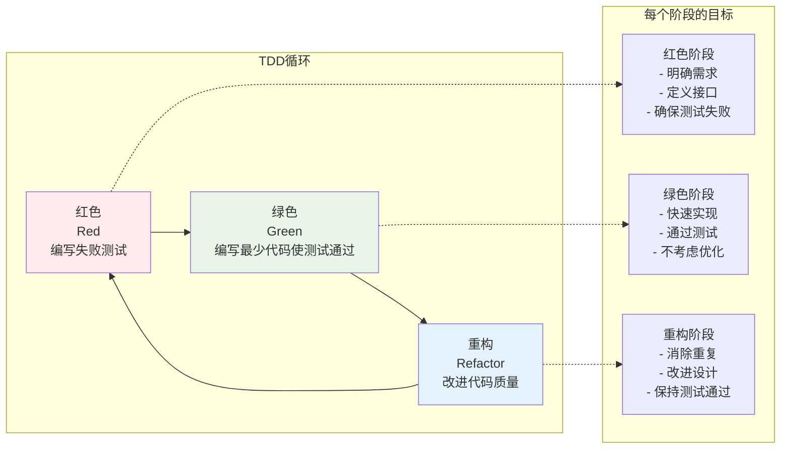
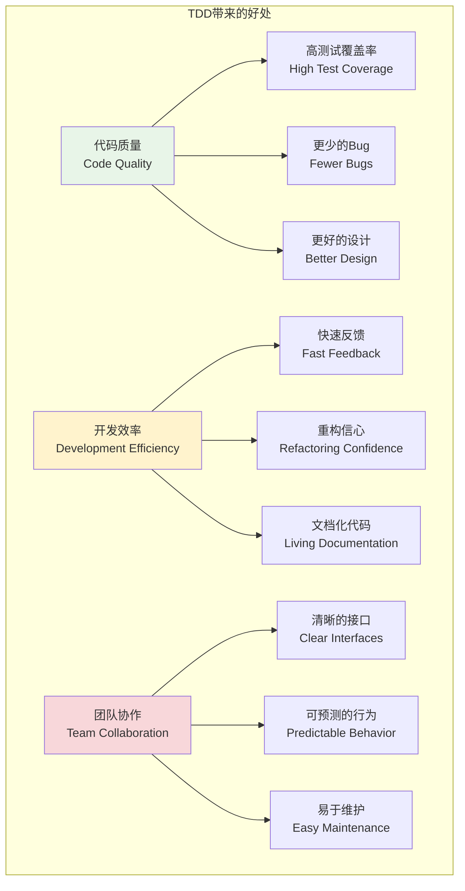
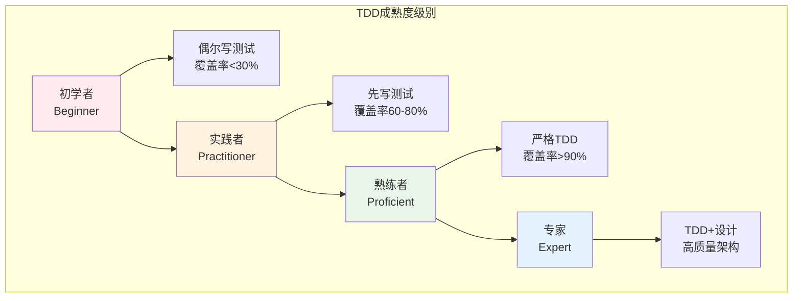

# 测试驱动开发(TDD)实践

## 🎯 学习目标

通过本章学习，您将能够：
- 理解测试驱动开发的核心理念和价值
- 掌握TDD的红-绿-重构循环
- 学会在Chat-Room项目中应用TDD方法
- 实现高质量、可维护的代码设计

## 🔄 TDD核心概念

### TDD开发循环



### TDD的三大法则

1. **第一法则**：在编写失败的单元测试之前，不要编写任何产品代码
2. **第二法则**：只编写刚好能够失败的单元测试，编译失败也算失败
3. **第三法则**：只编写刚好能够通过当前失败测试的产品代码

### TDD的优势



## 🛠️ TDD实践示例

### Chat-Room用户管理TDD实现

```python
# tests/test_user_manager_tdd.py - TDD方式开发用户管理器
import pytest
from datetime import datetime
import hashlib

class TestUserManagerTDD:
    """使用TDD方式开发用户管理器"""
    
    def test_create_user_with_valid_data_should_return_user_id(self):
        """红色阶段：测试创建用户功能"""
        # 这个测试会失败，因为UserManager还不存在
        from user_manager import UserManager  # 这行会导入失败
        
        manager = UserManager()
        user_id = manager.create_user("testuser", "test@example.com", "password123")
        
        assert user_id is not None
        assert isinstance(user_id, int)
        assert user_id > 0
    
    def test_create_user_with_duplicate_username_should_raise_error(self):
        """红色阶段：测试重复用户名处理"""
        from user_manager import UserManager, DuplicateUserError
        
        manager = UserManager()
        manager.create_user("testuser", "test@example.com", "password123")
        
        with pytest.raises(DuplicateUserError):
            manager.create_user("testuser", "other@example.com", "password456")
    
    def test_create_user_with_invalid_email_should_raise_error(self):
        """红色阶段：测试邮箱验证"""
        from user_manager import UserManager, ValidationError
        
        manager = UserManager()
        
        with pytest.raises(ValidationError):
            manager.create_user("testuser", "invalid-email", "password123")
    
    def test_authenticate_user_with_correct_credentials_should_return_user_id(self):
        """红色阶段：测试用户认证"""
        from user_manager import UserManager
        
        manager = UserManager()
        user_id = manager.create_user("testuser", "test@example.com", "password123")
        
        authenticated_id = manager.authenticate("testuser", "password123")
        assert authenticated_id == user_id
    
    def test_authenticate_user_with_wrong_password_should_return_none(self):
        """红色阶段：测试错误密码"""
        from user_manager import UserManager
        
        manager = UserManager()
        manager.create_user("testuser", "test@example.com", "password123")
        
        result = manager.authenticate("testuser", "wrongpassword")
        assert result is None

# 绿色阶段：编写最少代码使测试通过
# user_manager.py - 用户管理器实现
class ValidationError(Exception):
    """验证错误"""
    pass

class DuplicateUserError(Exception):
    """重复用户错误"""
    pass

class UserManager:
    """用户管理器 - TDD方式实现"""
    
    def __init__(self):
        self.users = {}  # {username: user_data}
        self.next_id = 1
    
    def create_user(self, username, email, password):
        """创建用户"""
        # 验证邮箱格式
        if "@" not in email:
            raise ValidationError("邮箱格式无效")
        
        # 检查用户名是否已存在
        if username in self.users:
            raise DuplicateUserError("用户名已存在")
        
        # 创建用户
        user_id = self.next_id
        self.next_id += 1
        
        password_hash = self._hash_password(password)
        
        self.users[username] = {
            'id': user_id,
            'username': username,
            'email': email,
            'password_hash': password_hash,
            'created_at': datetime.now()
        }
        
        return user_id
    
    def authenticate(self, username, password):
        """用户认证"""
        if username not in self.users:
            return None
        
        user = self.users[username]
        password_hash = self._hash_password(password)
        
        if user['password_hash'] == password_hash:
            return user['id']
        
        return None
    
    def _hash_password(self, password):
        """密码哈希"""
        return hashlib.sha256(password.encode()).hexdigest()

# 重构阶段：改进代码质量
class ImprovedUserManager:
    """重构后的用户管理器"""
    
    def __init__(self, db_connection=None):
        self.db = db_connection
        self.users = {}  # 内存缓存
        self.next_id = 1
    
    def create_user(self, username, email, password):
        """创建用户 - 重构版本"""
        # 输入验证
        self._validate_user_input(username, email, password)
        
        # 检查重复
        if self._user_exists(username, email):
            raise DuplicateUserError("用户名或邮箱已存在")
        
        # 创建用户
        user_data = self._build_user_data(username, email, password)
        user_id = self._save_user(user_data)
        
        return user_id
    
    def _validate_user_input(self, username, email, password):
        """验证用户输入"""
        if not username or len(username) < 3:
            raise ValidationError("用户名长度至少3个字符")
        
        if not self._is_valid_email(email):
            raise ValidationError("邮箱格式无效")
        
        if not password or len(password) < 6:
            raise ValidationError("密码长度至少6个字符")
    
    def _is_valid_email(self, email):
        """验证邮箱格式"""
        return "@" in email and "." in email.split("@")[1]
    
    def _user_exists(self, username, email):
        """检查用户是否已存在"""
        return (username in self.users or 
                any(user['email'] == email for user in self.users.values()))
    
    def _build_user_data(self, username, email, password):
        """构建用户数据"""
        return {
            'id': self.next_id,
            'username': username,
            'email': email,
            'password_hash': self._hash_password(password),
            'created_at': datetime.now(),
            'is_active': True
        }
    
    def _save_user(self, user_data):
        """保存用户"""
        user_id = user_data['id']
        self.users[user_data['username']] = user_data
        self.next_id += 1
        
        # 如果有数据库连接，也保存到数据库
        if self.db:
            self._save_to_database(user_data)
        
        return user_id
    
    def _save_to_database(self, user_data):
        """保存到数据库"""
        # 数据库保存逻辑
        pass
    
    def _hash_password(self, password):
        """密码哈希"""
        import hashlib
        return hashlib.sha256(password.encode()).hexdigest()
```

### TDD开发消息系统

```python
# tests/test_message_system_tdd.py - TDD开发消息系统
import pytest
from datetime import datetime

class TestMessageSystemTDD:
    """TDD开发消息系统"""
    
    def test_create_message_should_return_message_object(self):
        """红色：测试消息创建"""
        from message_system import Message
        
        message = Message("Hello World", user_id=1, group_id=1)
        
        assert message.content == "Hello World"
        assert message.user_id == 1
        assert message.group_id == 1
        assert isinstance(message.created_at, datetime)
    
    def test_message_with_empty_content_should_raise_error(self):
        """红色：测试空消息验证"""
        from message_system import Message, ValidationError
        
        with pytest.raises(ValidationError):
            Message("", user_id=1, group_id=1)
    
    def test_message_manager_send_message_should_store_and_return_id(self):
        """红色：测试消息发送"""
        from message_system import MessageManager
        
        manager = MessageManager()
        message_id = manager.send_message("Hello", user_id=1, group_id=1)
        
        assert message_id is not None
        assert isinstance(message_id, int)
    
    def test_message_manager_get_group_messages_should_return_list(self):
        """红色：测试获取群组消息"""
        from message_system import MessageManager
        
        manager = MessageManager()
        manager.send_message("Message 1", user_id=1, group_id=1)
        manager.send_message("Message 2", user_id=2, group_id=1)
        
        messages = manager.get_group_messages(group_id=1)
        
        assert len(messages) == 2
        assert messages[0].content == "Message 1"
        assert messages[1].content == "Message 2"

# 绿色阶段：实现消息系统
# message_system.py
class ValidationError(Exception):
    pass

class Message:
    """消息类"""
    
    def __init__(self, content, user_id, group_id=None):
        if not content.strip():
            raise ValidationError("消息内容不能为空")
        
        self.content = content
        self.user_id = user_id
        self.group_id = group_id
        self.created_at = datetime.now()

class MessageManager:
    """消息管理器"""
    
    def __init__(self):
        self.messages = []
        self.next_id = 1
    
    def send_message(self, content, user_id, group_id=None):
        """发送消息"""
        message = Message(content, user_id, group_id)
        message.id = self.next_id
        self.next_id += 1
        
        self.messages.append(message)
        return message.id
    
    def get_group_messages(self, group_id):
        """获取群组消息"""
        return [msg for msg in self.messages if msg.group_id == group_id]

# 重构阶段：改进消息系统
class ImprovedMessageManager:
    """重构后的消息管理器"""
    
    def __init__(self, db_connection=None, message_validator=None):
        self.db = db_connection
        self.validator = message_validator or MessageValidator()
        self.messages = []
        self.next_id = 1
    
    def send_message(self, content, user_id, group_id=None, message_type="text"):
        """发送消息 - 重构版本"""
        # 验证消息
        self.validator.validate_message(content, user_id, group_id, message_type)
        
        # 创建消息
        message = self._create_message(content, user_id, group_id, message_type)
        
        # 保存消息
        message_id = self._save_message(message)
        
        return message_id
    
    def _create_message(self, content, user_id, group_id, message_type):
        """创建消息对象"""
        return {
            'id': self.next_id,
            'content': content,
            'user_id': user_id,
            'group_id': group_id,
            'message_type': message_type,
            'created_at': datetime.now()
        }
    
    def _save_message(self, message):
        """保存消息"""
        message_id = message['id']
        self.messages.append(message)
        self.next_id += 1
        
        if self.db:
            self._save_to_database(message)
        
        return message_id
    
    def _save_to_database(self, message):
        """保存到数据库"""
        # 数据库保存逻辑
        pass

class MessageValidator:
    """消息验证器"""
    
    def validate_message(self, content, user_id, group_id, message_type):
        """验证消息"""
        self._validate_content(content)
        self._validate_user_id(user_id)
        self._validate_message_type(message_type)
    
    def _validate_content(self, content):
        """验证消息内容"""
        if not content or not content.strip():
            raise ValidationError("消息内容不能为空")
        
        if len(content) > 1000:
            raise ValidationError("消息内容不能超过1000个字符")
    
    def _validate_user_id(self, user_id):
        """验证用户ID"""
        if not isinstance(user_id, int) or user_id <= 0:
            raise ValidationError("用户ID必须是正整数")
    
    def _validate_message_type(self, message_type):
        """验证消息类型"""
        valid_types = ["text", "image", "file", "system"]
        if message_type not in valid_types:
            raise ValidationError(f"无效的消息类型: {message_type}")
```

## 🎨 TDD最佳实践

### 测试命名规范

```python
# 好的测试命名
def test_create_user_with_valid_data_should_return_user_id():
    pass

def test_create_user_with_duplicate_username_should_raise_duplicate_error():
    pass

def test_authenticate_user_with_wrong_password_should_return_none():
    pass

# 测试命名模式：test_[方法名]_with_[条件]_should_[期望结果]
```

### 测试结构模式

```python
def test_example():
    # Arrange（准备）- 设置测试数据和环境
    user_manager = UserManager()
    username = "testuser"
    email = "test@example.com"
    password = "password123"
    
    # Act（执行）- 执行被测试的操作
    user_id = user_manager.create_user(username, email, password)
    
    # Assert（断言）- 验证结果
    assert user_id is not None
    assert isinstance(user_id, int)
```

### TDD开发节奏

1. **快速编写失败测试**（30秒-2分钟）
2. **快速实现通过代码**（30秒-5分钟）
3. **重构改进代码**（2-10分钟）
4. **重复循环**

## 📊 TDD度量指标

### 代码质量指标

```python
# 测试覆盖率统计
class TDDMetrics:
    """TDD度量指标"""
    
    def __init__(self):
        self.test_count = 0
        self.code_lines = 0
        self.test_lines = 0
        self.coverage_percentage = 0.0
    
    def calculate_test_to_code_ratio(self):
        """计算测试代码与产品代码比例"""
        if self.code_lines == 0:
            return 0
        return self.test_lines / self.code_lines
    
    def calculate_tests_per_class(self, class_count):
        """计算每个类的平均测试数"""
        if class_count == 0:
            return 0
        return self.test_count / class_count
```

### TDD成熟度评估



## 📋 学习检查清单

完成本节学习后，请确认您能够：

- [ ] 理解TDD的红-绿-重构循环
- [ ] 遵循TDD的三大法则
- [ ] 编写失败的测试用例
- [ ] 实现最少的通过代码
- [ ] 进行有效的代码重构
- [ ] 使用合适的测试命名规范
- [ ] 应用AAA测试结构模式
- [ ] 度量TDD的效果和质量
- [ ] 在实际项目中应用TDD方法

## 🚀 下一步

掌握TDD实践后，请继续学习：
- [测试覆盖率](test-coverage.md) - 代码覆盖率分析
- [Pytest框架](pytest-framework.md) - 高级测试技巧
- [第12章：优化与部署](../12-optimization-deployment/README.md)

---


## 📖 导航

➡️ **下一节：** [Pytest Framework](pytest-framework.md)

📚 **返回：** [第15章：测试开发](README.md)

🏠 **主页：** [学习路径总览](../README.md)
**TDD不仅是测试方法，更是一种设计思维，帮助我们构建更好的软件！** 🔄
