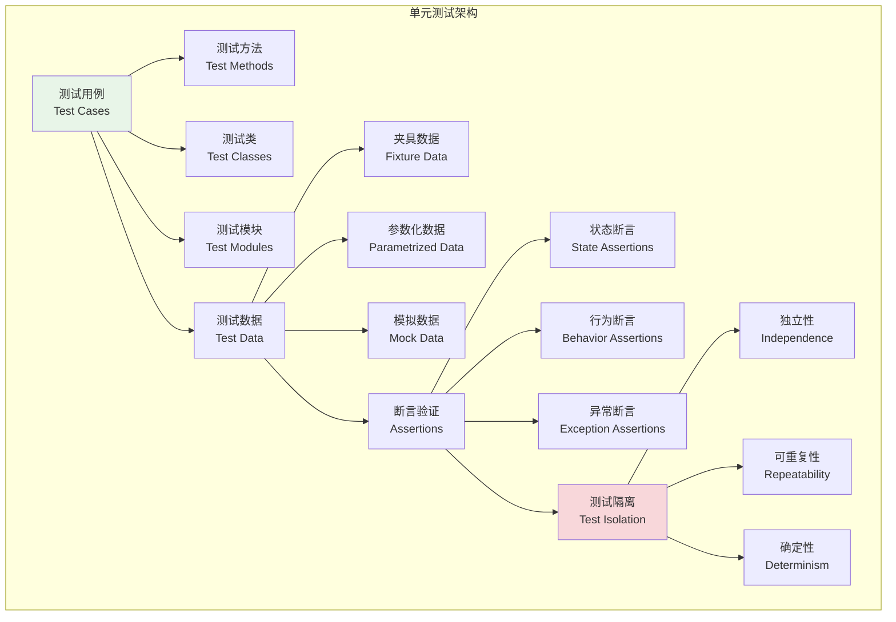
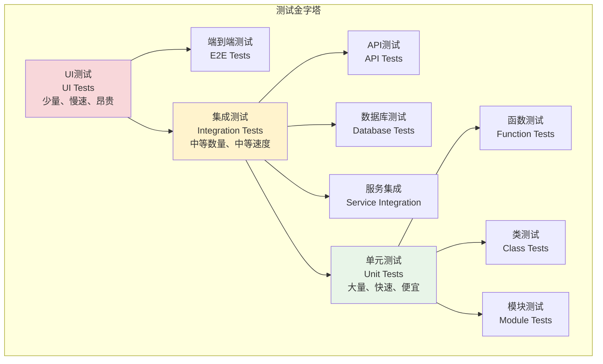

# 单元测试实践

## 🎯 学习目标

通过本章学习，您将能够：
- 理解单元测试的核心概念和设计原则
- 掌握pytest框架的单元测试编写技巧
- 学会为Chat-Room项目编写高质量的单元测试
- 实现测试覆盖率分析和质量度量

## 🧪 单元测试设计

### 单元测试架构



### 测试金字塔



### 单元测试设计原则

单元测试应该遵循以下设计原则：

1. **FIRST原则**
   - **Fast（快速）**：单元测试应该运行得很快
   - **Independent（独立）**：测试之间不应该相互依赖
   - **Repeatable（可重复）**：在任何环境中都能重复运行
   - **Self-Validating（自验证）**：测试应该有明确的通过/失败结果
   - **Timely（及时）**：测试应该在产品代码之前编写

2. **AAA模式**
   - **Arrange（准备）**：设置测试数据和环境
   - **Act（执行）**：执行被测试的操作
   - **Assert（断言）**：验证结果是否符合预期

## 🔧 单元测试实现

### Chat-Room单元测试示例

```python
# tests/unit/test_user_model.py - 用户模型单元测试
import pytest
from datetime import datetime
from unittest.mock import Mock, patch
import hashlib

class TestUser:
    """用户模型单元测试"""
    
    def test_user_creation_valid_data(self):
        """测试用户创建 - 有效数据"""
        # 模拟用户类
        class User:
            def __init__(self, username, email, password):
                self.username = username
                self.email = email
                self.password_hash = self._hash_password(password)
                self.created_at = datetime.now()
                self.is_active = True
            
            def _hash_password(self, password):
                return hashlib.sha256(password.encode()).hexdigest()
        
        # 测试用户创建
        user = User("testuser", "test@example.com", "password123")
        
        assert user.username == "testuser"
        assert user.email == "test@example.com"
        assert user.password_hash is not None
        assert user.is_active is True
        assert isinstance(user.created_at, datetime)
    
    def test_user_creation_invalid_username(self):
        """测试用户创建 - 无效用户名"""
        class ValidationError(Exception):
            pass
        
        class User:
            def __init__(self, username, email, password):
                if len(username) < 3:
                    raise ValidationError("用户名长度至少3个字符")
                self.username = username
        
        # 测试无效用户名
        with pytest.raises(ValidationError, match="用户名长度至少3个字符"):
            User("ab", "test@example.com", "password123")

class TestUserManager:
    """用户管理器单元测试"""
    
    def test_create_user_success(self):
        """测试创建用户成功"""
        # 模拟用户管理器
        class UserManager:
            def __init__(self):
                self.users = {}
                self.next_id = 1
            
            def create_user(self, username, email, password):
                if username in self.users:
                    raise ValueError("用户名已存在")
                
                user_id = self.next_id
                self.next_id += 1
                
                self.users[username] = {
                    'id': user_id,
                    'username': username,
                    'email': email,
                    'password_hash': hashlib.sha256(password.encode()).hexdigest()
                }
                
                return user_id
        
        manager = UserManager()
        user_id = manager.create_user("testuser", "test@example.com", "password123")
        
        assert user_id == 1
        assert "testuser" in manager.users
        assert manager.users["testuser"]["email"] == "test@example.com"

class TestMessage:
    """消息模型单元测试"""
    
    def test_message_creation_valid_data(self):
        """测试消息创建 - 有效数据"""
        class Message:
            def __init__(self, content, user_id, group_id=None):
                if not content.strip():
                    raise ValueError("消息内容不能为空")
                
                self.content = content
                self.user_id = user_id
                self.group_id = group_id
                self.created_at = datetime.now()
                self.message_type = "text"
        
        message = Message("Hello World", 1, 1)
        
        assert message.content == "Hello World"
        assert message.user_id == 1
        assert message.group_id == 1
        assert message.message_type == "text"
        assert isinstance(message.created_at, datetime)

## 🎭 Mock和Stub技术

### 使用Mock对象

```python
# tests/unit/test_message_service.py - 使用Mock的消息服务测试
from unittest.mock import Mock, patch

class TestMessageServiceWithMock:
    """使用Mock技术的消息服务测试"""
    
    def test_send_message_with_database_mock(self):
        """测试发送消息 - 使用数据库Mock"""
        # 模拟数据库连接
        mock_db = Mock()
        mock_cursor = Mock()
        mock_db.cursor.return_value = mock_cursor
        mock_cursor.lastrowid = 123
        
        # 模拟消息服务
        class MessageService:
            def __init__(self, db):
                self.db = db
            
            def send_message(self, content, user_id, group_id):
                cursor = self.db.cursor()
                cursor.execute(
                    "INSERT INTO messages (content, user_id, group_id) VALUES (?, ?, ?)",
                    (content, user_id, group_id)
                )
                self.db.commit()
                return cursor.lastrowid
        
        service = MessageService(mock_db)
        message_id = service.send_message("测试消息", 1, 1)
        
        # 验证Mock调用
        mock_db.cursor.assert_called_once()
        mock_cursor.execute.assert_called_once_with(
            "INSERT INTO messages (content, user_id, group_id) VALUES (?, ?, ?)",
            ("测试消息", 1, 1)
        )
        mock_db.commit.assert_called_once()
        assert message_id == 123

## 📊 参数化测试

```python
class TestParametrizedValidation:
    """参数化验证测试"""
    
    @pytest.mark.parametrize("username,email,password,expected", [
        ("validuser", "valid@example.com", "validpass123", True),
        ("ab", "valid@example.com", "validpass123", False),  # 用户名太短
        ("validuser", "invalid-email", "validpass123", False),  # 邮箱无效
        ("validuser", "valid@example.com", "123", False),  # 密码太短
    ])
    def test_user_validation(self, username, email, password, expected):
        """参数化测试用户验证"""
        def validate_user(username, email, password):
            if not username or len(username) < 3:
                return False
            if not email or "@" not in email:
                return False
            if not password or len(password) < 6:
                return False
            return True
        
        result = validate_user(username, email, password)
        assert result == expected
```

## 📋 学习检查清单

完成本节学习后，请确认您能够：

- [ ] 理解单元测试的设计原则和架构
- [ ] 编写独立、快速、可重复的单元测试
- [ ] 使用AAA模式组织测试代码
- [ ] 应用Mock和Stub技术隔离依赖
- [ ] 编写参数化测试提高测试覆盖率
- [ ] 正确测试异常处理逻辑
- [ ] 为Chat-Room项目编写高质量单元测试
- [ ] 分析和改进测试代码质量

## 🚀 下一步

掌握单元测试后，请继续学习：
- [集成测试实践](integration-testing.md) - 组件间协作测试
- [TDD实践](tdd-practices.md) - 测试驱动开发
- [Pytest框架](pytest-framework.md) - 高级测试技巧

---

**单元测试是代码质量的基石，每个函数和类都应该有对应的单元测试！** 🧪
