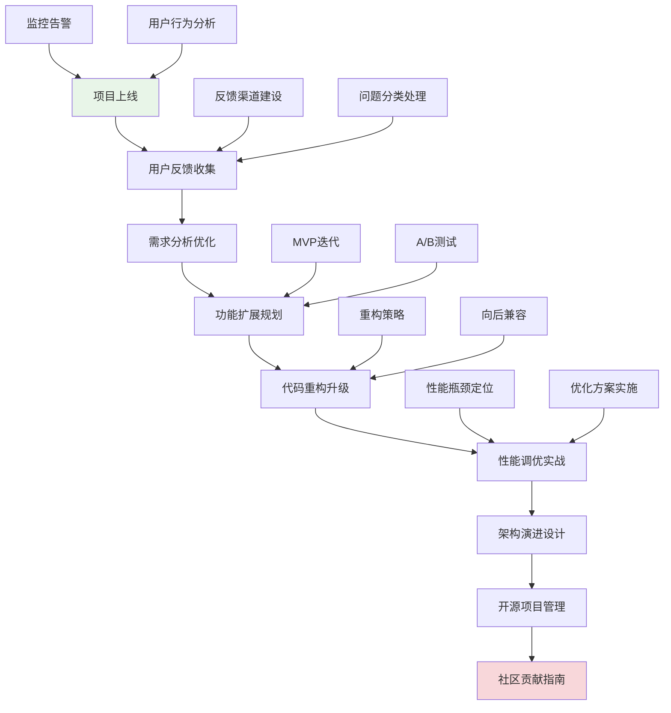
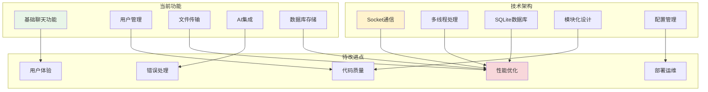

# 第17章：高级项目实践

## 🎯 学习目标

通过本章学习，您将能够：
- 掌握项目上线后的持续演进策略
- 学会处理用户反馈和需求变更
- 了解代码重构和架构升级的方法
- 掌握性能调优的实战技巧
- 学会开源项目的管理和贡献方式
- 建立完整的项目管理和维护体系

## 📖 本章概览

本章是整个学习路径的最高级阶段，专注于Chat-Room项目上线后的持续改进和演进。我们将从实际的生产环境问题出发，学习如何处理真实世界中的复杂挑战，包括功能扩展、性能优化、用户反馈处理等高级主题。

### 学习路径



## 📚 章节内容

### 1. [功能扩展和优化策略](feature-optimization.md)
**学习时间：** 8-10小时
**难度等级：** ⭐⭐⭐⭐⭐

学习内容：
- 用户需求分析和功能规划
- MVP（最小可行产品）迭代策略
- A/B测试和灰度发布
- 功能开关和配置管理

**实战项目：** Chat-Room功能扩展规划和实施

### 2. [功能规划分析](feature-planning-analysis.md)
**学习时间：** 6-8小时
**难度等级：** ⭐⭐⭐⭐

学习内容：
- 需求收集和分析方法
- 功能优先级评估
- 技术可行性分析
- 项目规划和时间估算

**实战项目：** Chat-Room功能路线图制定

### 3. [性能瓶颈识别](performance-bottleneck-identification.md)
**学习时间：** 8-10小时
**难度等级：** ⭐⭐⭐⭐⭐

学习内容：
- 真实性能问题的诊断方法
- 系统瓶颈的定位和分析
- 优化方案的设计和实施
- 性能监控和持续改进

**实战项目：** Chat-Room性能优化实战

### 4. [故障排查方法论](troubleshooting-methodology.md)
**学习时间：** 6-8小时
**难度等级：** ⭐⭐⭐⭐

学习内容：
- 生产环境问题的快速定位
- 日志分析和错误追踪
- 应急响应和故障恢复
- 事后分析和改进措施

**实战项目：** 模拟生产环境故障处理

## 🚀 Chat-Room项目进阶实战

### 1. 项目现状评估

在开始进阶开发之前，让我们先评估一下当前Chat-Room项目的状态：



### 2. 功能扩展规划

基于用户反馈和市场需求，我们可以规划以下功能扩展：

#### 高优先级功能
- **消息搜索**：全文搜索历史消息
- **用户权限管理**：管理员、版主等角色
- **消息撤回**：允许用户撤回已发送的消息
- **在线状态显示**：实时显示用户在线状态

#### 中优先级功能
- **表情包支持**：自定义表情包系统
- **消息加密**：端到端消息加密
- **多媒体消息**：支持图片、视频消息
- **消息推送**：离线消息推送通知

#### 低优先级功能
- **语音通话**：实时语音通话功能
- **屏幕共享**：屏幕共享功能
- **机器人API**：第三方机器人接入
- **国际化支持**：多语言界面

### 3. 架构演进策略

```python
"""
Chat-Room架构演进示例
"""

from abc import ABC, abstractmethod
from typing import Dict, List, Optional, Any
import asyncio
import logging
from dataclasses import dataclass
from enum import Enum


class ArchitecturePhase(Enum):
    """架构演进阶段"""
    MONOLITHIC = "monolithic"          # 单体架构
    MODULAR = "modular"               # 模块化架构
    MICROSERVICES = "microservices"   # 微服务架构
    DISTRIBUTED = "distributed"       # 分布式架构


@dataclass
class ArchitectureEvolutionPlan:
    """架构演进计划"""
    current_phase: ArchitecturePhase
    target_phase: ArchitecturePhase
    migration_steps: List[str]
    estimated_time: str
    risks: List[str]
    benefits: List[str]


class ChatRoomArchitectureEvolution:
    """Chat-Room架构演进管理"""
    
    def __init__(self):
        self.current_architecture = ArchitecturePhase.MODULAR
        self.evolution_plans = self._create_evolution_plans()
    
    def _create_evolution_plans(self) -> Dict[str, ArchitectureEvolutionPlan]:
        """创建架构演进计划"""
        return {
            "performance_optimization": ArchitectureEvolutionPlan(
                current_phase=ArchitecturePhase.MODULAR,
                target_phase=ArchitecturePhase.MODULAR,
                migration_steps=[
                    "1. 实现连接池优化",
                    "2. 添加消息队列缓冲",
                    "3. 实现数据库读写分离",
                    "4. 添加Redis缓存层",
                    "5. 优化网络通信协议"
                ],
                estimated_time="2-3个月",
                risks=[
                    "性能优化可能引入新的复杂性",
                    "缓存一致性问题",
                    "系统稳定性风险"
                ],
                benefits=[
                    "支持更多并发用户",
                    "降低响应延迟",
                    "提高系统吞吐量"
                ]
            ),
            
            "microservices_migration": ArchitectureEvolutionPlan(
                current_phase=ArchitecturePhase.MODULAR,
                target_phase=ArchitecturePhase.MICROSERVICES,
                migration_steps=[
                    "1. 识别服务边界",
                    "2. 拆分用户服务",
                    "3. 拆分消息服务",
                    "4. 拆分文件服务",
                    "5. 实现服务发现",
                    "6. 添加API网关",
                    "7. 实现分布式配置"
                ],
                estimated_time="6-8个月",
                risks=[
                    "服务间通信复杂性",
                    "数据一致性挑战",
                    "运维复杂度增加",
                    "网络延迟问题"
                ],
                benefits=[
                    "独立部署和扩展",
                    "技术栈多样化",
                    "团队独立开发",
                    "故障隔离"
                ]
            )
        }
    
    def analyze_current_bottlenecks(self) -> Dict[str, Any]:
        """分析当前架构瓶颈"""
        return {
            "performance_bottlenecks": [
                "单线程消息处理",
                "同步数据库操作",
                "内存中用户状态管理",
                "文件传输阻塞"
            ],
            "scalability_issues": [
                "单机部署限制",
                "数据库连接数限制",
                "内存使用增长",
                "网络带宽瓶颈"
            ],
            "maintainability_concerns": [
                "模块间耦合度较高",
                "配置管理分散",
                "错误处理不统一",
                "日志系统不完善"
            ]
        }
    
    def recommend_next_steps(self) -> List[str]:
        """推荐下一步改进措施"""
        bottlenecks = self.analyze_current_bottlenecks()
        
        recommendations = []
        
        # 基于瓶颈分析给出建议
        if "单线程消息处理" in bottlenecks["performance_bottlenecks"]:
            recommendations.append("实现异步消息处理")
        
        if "同步数据库操作" in bottlenecks["performance_bottlenecks"]:
            recommendations.append("引入数据库连接池和异步操作")
        
        if "单机部署限制" in bottlenecks["scalability_issues"]:
            recommendations.append("设计水平扩展方案")
        
        if "模块间耦合度较高" in bottlenecks["maintainability_concerns"]:
            recommendations.append("重构模块接口，降低耦合度")
        
        return recommendations


# 性能优化实战示例
class PerformanceOptimizationDemo:
    """性能优化演示"""
    
    def __init__(self):
        self.logger = logging.getLogger(__name__)
    
    async def optimize_message_processing(self):
        """优化消息处理性能"""
        
        # 1. 异步消息处理
        async def async_message_handler(message):
            """异步消息处理器"""
            try:
                # 异步处理消息
                await self._process_message_async(message)
            except Exception as e:
                self.logger.error(f"消息处理失败: {e}")
        
        # 2. 消息队列缓冲
        message_queue = asyncio.Queue(maxsize=1000)
        
        # 3. 批量处理
        async def batch_processor():
            """批量消息处理器"""
            batch = []
            while True:
                try:
                    # 收集一批消息
                    message = await asyncio.wait_for(
                        message_queue.get(), timeout=0.1
                    )
                    batch.append(message)
                    
                    # 达到批量大小或超时则处理
                    if len(batch) >= 10:
                        await self._process_batch(batch)
                        batch.clear()
                        
                except asyncio.TimeoutError:
                    # 超时处理剩余消息
                    if batch:
                        await self._process_batch(batch)
                        batch.clear()
    
    async def _process_message_async(self, message):
        """异步处理单个消息"""
        # 模拟异步处理
        await asyncio.sleep(0.01)
        print(f"处理消息: {message}")
    
    async def _process_batch(self, batch):
        """批量处理消息"""
        print(f"批量处理 {len(batch)} 条消息")
        # 批量数据库操作
        # 批量网络发送
        pass
    
    def implement_caching_strategy(self):
        """实现缓存策略"""
        
        cache_strategies = {
            "user_cache": {
                "type": "LRU",
                "max_size": 1000,
                "ttl": 3600,  # 1小时
                "use_case": "用户信息缓存"
            },
            "message_cache": {
                "type": "FIFO",
                "max_size": 5000,
                "ttl": 1800,  # 30分钟
                "use_case": "最近消息缓存"
            },
            "room_cache": {
                "type": "LFU",
                "max_size": 100,
                "ttl": 7200,  # 2小时
                "use_case": "房间信息缓存"
            }
        }
        
        return cache_strategies
    
    def database_optimization_plan(self):
        """数据库优化方案"""
        
        optimization_plan = {
            "connection_pooling": {
                "description": "实现数据库连接池",
                "benefits": ["减少连接开销", "提高并发性能"],
                "implementation": "使用SQLAlchemy连接池"
            },
            "query_optimization": {
                "description": "优化数据库查询",
                "benefits": ["减少查询时间", "降低CPU使用"],
                "implementation": "添加索引、优化SQL语句"
            },
            "read_write_separation": {
                "description": "读写分离",
                "benefits": ["提高读取性能", "分散数据库负载"],
                "implementation": "主从数据库配置"
            },
            "data_partitioning": {
                "description": "数据分区",
                "benefits": ["提高查询效率", "便于数据管理"],
                "implementation": "按时间或用户ID分区"
            }
        }
        
        return optimization_plan


# 用户反馈处理系统
class UserFeedbackSystem:
    """用户反馈处理系统"""
    
    def __init__(self):
        self.feedback_categories = {
            "bug_report": "错误报告",
            "feature_request": "功能请求",
            "performance_issue": "性能问题",
            "ui_ux_feedback": "界面体验反馈",
            "general_suggestion": "一般建议"
        }
    
    def collect_feedback(self, feedback_data: Dict[str, Any]) -> str:
        """收集用户反馈"""
        
        # 验证反馈数据
        required_fields = ["user_id", "category", "content", "priority"]
        for field in required_fields:
            if field not in feedback_data:
                raise ValueError(f"缺少必需字段: {field}")
        
        # 生成反馈ID
        feedback_id = f"FB_{int(time.time())}"
        
        # 存储反馈
        feedback_record = {
            "id": feedback_id,
            "user_id": feedback_data["user_id"],
            "category": feedback_data["category"],
            "content": feedback_data["content"],
            "priority": feedback_data["priority"],
            "status": "open",
            "created_at": time.time(),
            "updated_at": time.time()
        }
        
        # 这里应该保存到数据库
        print(f"收到用户反馈: {feedback_id}")
        
        return feedback_id
    
    def prioritize_feedback(self, feedback_list: List[Dict]) -> List[Dict]:
        """对反馈进行优先级排序"""
        
        # 优先级权重
        priority_weights = {
            "critical": 100,
            "high": 80,
            "medium": 50,
            "low": 20
        }
        
        # 类别权重
        category_weights = {
            "bug_report": 90,
            "performance_issue": 80,
            "feature_request": 60,
            "ui_ux_feedback": 40,
            "general_suggestion": 30
        }
        
        # 计算综合分数
        for feedback in feedback_list:
            priority_score = priority_weights.get(feedback["priority"], 0)
            category_score = category_weights.get(feedback["category"], 0)
            
            # 时间因子（越新的反馈权重越高）
            time_factor = max(0, 100 - (time.time() - feedback["created_at"]) / 86400)
            
            feedback["score"] = priority_score + category_score + time_factor
        
        # 按分数排序
        return sorted(feedback_list, key=lambda x: x["score"], reverse=True)
    
    def create_improvement_roadmap(self, feedback_list: List[Dict]) -> Dict[str, Any]:
        """基于反馈创建改进路线图"""
        
        prioritized_feedback = self.prioritize_feedback(feedback_list)
        
        roadmap = {
            "immediate_actions": [],  # 立即处理
            "short_term_goals": [],   # 短期目标（1-2个月）
            "long_term_vision": []    # 长期愿景（3-6个月）
        }
        
        for feedback in prioritized_feedback:
            if feedback["score"] >= 150:
                roadmap["immediate_actions"].append(feedback)
            elif feedback["score"] >= 100:
                roadmap["short_term_goals"].append(feedback)
            else:
                roadmap["long_term_vision"].append(feedback)
        
        return roadmap


# 开源项目贡献指南
class OpenSourceContributionGuide:
    """开源项目贡献指南"""
    
    def __init__(self):
        self.contribution_types = [
            "代码贡献",
            "文档改进",
            "错误报告",
            "功能建议",
            "测试用例",
            "翻译工作",
            "社区支持"
        ]
    
    def prepare_for_contribution(self) -> Dict[str, List[str]]:
        """准备贡献的步骤"""
        
        return {
            "环境准备": [
                "Fork项目到自己的GitHub账户",
                "克隆项目到本地开发环境",
                "安装项目依赖和开发工具",
                "运行测试确保环境正常"
            ],
            "了解项目": [
                "阅读README和贡献指南",
                "浏览项目结构和代码风格",
                "查看已有的Issues和Pull Requests",
                "理解项目的设计理念和目标"
            ],
            "选择贡献方向": [
                "查找标记为'good first issue'的问题",
                "选择与自己技能匹配的任务",
                "与维护者沟通确认贡献方向",
                "制定贡献计划和时间安排"
            ]
        }
    
    def code_contribution_workflow(self) -> List[str]:
        """代码贡献工作流程"""
        
        return [
            "1. 创建功能分支: git checkout -b feature/your-feature",
            "2. 编写代码并遵循项目代码规范",
            "3. 添加或更新相关测试用例",
            "4. 运行测试确保所有测试通过",
            "5. 提交代码: git commit -m 'feat: add your feature'",
            "6. 推送到远程仓库: git push origin feature/your-feature",
            "7. 创建Pull Request并填写详细描述",
            "8. 响应代码审查意见并进行修改",
            "9. 等待维护者合并或提供进一步反馈"
        ]
    
    def documentation_contribution_tips(self) -> Dict[str, str]:
        """文档贡献技巧"""
        
        return {
            "内容质量": "确保文档准确、清晰、易懂",
            "结构组织": "使用合理的标题层次和目录结构",
            "代码示例": "提供可运行的代码示例",
            "图表说明": "使用图表帮助理解复杂概念",
            "多语言支持": "考虑提供多语言版本",
            "持续更新": "保持文档与代码同步更新"
        }


# 实战演示
def demonstrate_advanced_practices():
    """演示进阶实践"""
    print("=== Chat-Room项目进阶实战演示 ===")
    
    # 1. 架构演进分析
    evolution = ChatRoomArchitectureEvolution()
    bottlenecks = evolution.analyze_current_bottlenecks()
    recommendations = evolution.recommend_next_steps()
    
    print("当前架构瓶颈:")
    for category, issues in bottlenecks.items():
        print(f"  {category}: {issues}")
    
    print(f"\n推荐改进措施: {recommendations}")
    
    # 2. 用户反馈处理
    feedback_system = UserFeedbackSystem()
    
    sample_feedback = [
        {
            "user_id": "user1",
            "category": "bug_report",
            "content": "消息发送失败",
            "priority": "high",
            "created_at": time.time() - 3600
        },
        {
            "user_id": "user2", 
            "category": "feature_request",
            "content": "希望支持语音消息",
            "priority": "medium",
            "created_at": time.time() - 7200
        }
    ]
    
    roadmap = feedback_system.create_improvement_roadmap(sample_feedback)
    print(f"\n改进路线图: {roadmap}")
    
    # 3. 开源贡献指南
    contribution_guide = OpenSourceContributionGuide()
    workflow = contribution_guide.code_contribution_workflow()
    
    print("\n代码贡献工作流程:")
    for step in workflow:
        print(f"  {step}")


if __name__ == "__main__":
    import time
    demonstrate_advanced_practices()
```

## 📊 项目成熟度评估

### 评估维度

```mermaid
radar
    title Chat-Room项目成熟度评估
    
    "功能完整性" : 75
    "代码质量" : 70
    "性能表现" : 60
    "用户体验" : 65
    "文档质量" : 80
    "测试覆盖" : 55
    "部署运维" : 50
    "社区活跃" : 40
```

### 改进优先级

1. **高优先级**：性能优化、测试覆盖、部署运维
2. **中优先级**：用户体验、代码质量
3. **低优先级**：社区建设、功能扩展

## 📋 学习检查清单

完成本章学习后，请确认您能够：

- [ ] **项目评估**：客观评估项目的当前状态和改进空间
- [ ] **功能规划**：基于用户需求制定功能扩展计划
- [ ] **架构演进**：设计和实施架构演进策略
- [ ] **性能优化**：识别性能瓶颈并实施优化方案
- [ ] **问题排查**：建立有效的问题排查和解决机制
- [ ] **用户反馈**：收集和处理用户反馈，指导产品迭代
- [ ] **开源贡献**：参与开源项目并做出有价值的贡献
- [ ] **持续改进**：建立持续改进的开发文化和流程

## 🎓 学习成果

完成本章学习后，您将具备：

### 技术能力
- **系统思维**：能够从全局角度思考和解决问题
- **架构设计**：具备设计和演进系统架构的能力
- **性能调优**：掌握系统性能优化的方法和技巧
- **问题解决**：具备快速定位和解决问题的能力

### 工程能力
- **项目管理**：能够有效管理和推进技术项目
- **质量保证**：建立和维护代码质量标准
- **团队协作**：具备良好的团队协作和沟通能力
- **持续学习**：保持技术敏感度和学习能力

### 产品思维
- **用户导向**：以用户需求为中心进行产品设计
- **数据驱动**：基于数据分析做出产品决策
- **迭代优化**：持续优化产品功能和用户体验
- **商业理解**：理解技术与商业目标的关系

## 🚀 下一步发展

完成Chat-Room项目的进阶学习后，您可以考虑：

### 技术深化
- **分布式系统**：学习分布式系统设计和实现
- **云原生技术**：掌握容器化、微服务、服务网格等技术
- **大数据处理**：学习大数据存储和处理技术
- **机器学习**：将AI/ML技术应用到实际项目中

### 领域扩展
- **移动开发**：开发Chat-Room的移动端应用
- **Web前端**：构建现代化的Web界面
- **DevOps**：学习自动化部署和运维
- **安全技术**：深入学习网络安全和数据保护

### 职业发展
- **技术专家**：在特定技术领域深入发展
- **架构师**：负责系统架构设计和技术决策
- **技术管理**：带领技术团队完成复杂项目
- **产品经理**：从技术角度理解和推动产品发展

## 💡 最后的思考

恭喜您完成了Chat-Room项目的完整学习旅程！从Python基础到实战项目进阶，您已经掌握了现代软件开发的核心技能。

记住，技术学习是一个持续的过程。保持好奇心，持续实践，不断挑战自己，您将在软件开发的道路上走得更远。

**愿您在编程的世界中找到属于自己的精彩！** 🌟

---

**这不是结束，而是新的开始！** 🚀
