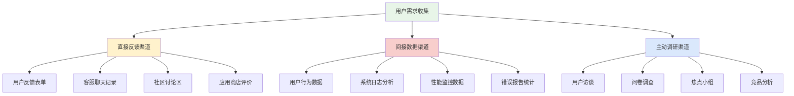
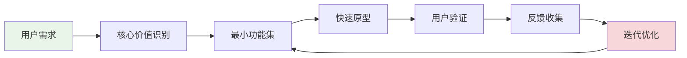

# 功能扩展和优化策略

## 🎯 学习目标

通过本节学习，您将能够：
- 掌握用户需求分析和功能规划方法
- 学会MVP迭代和敏捷开发策略
- 了解A/B测试和灰度发布技术
- 掌握功能开关和配置管理
- 学会数据驱动的产品决策方法

## 📖 内容概览

功能扩展和优化是项目持续发展的核心环节。本节将从Chat-Room项目的实际需求出发，介绍如何科学地进行功能规划、实施和优化，确保项目能够持续满足用户需求并保持竞争力。

## 📊 用户需求分析

### 需求收集渠道



### Chat-Room需求分析实例

```python
# tools/user_feedback_analyzer.py
import json
import sqlite3
from collections import Counter, defaultdict
from datetime import datetime, timedelta
import pandas as pd

class UserFeedbackAnalyzer:
    """用户反馈分析工具"""
    
    def __init__(self, db_path='data/feedback.db'):
        self.db_path = db_path
        self.init_database()
    
    def init_database(self):
        """初始化反馈数据库"""
        conn = sqlite3.connect(self.db_path)
        cursor = conn.cursor()
        
        cursor.execute('''
            CREATE TABLE IF NOT EXISTS feedback (
                id INTEGER PRIMARY KEY AUTOINCREMENT,
                user_id INTEGER,
                feedback_type TEXT,  -- feature_request, bug_report, improvement
                category TEXT,       -- ui, performance, functionality, other
                priority TEXT,       -- high, medium, low
                content TEXT,
                status TEXT DEFAULT 'open',
                created_at TIMESTAMP DEFAULT CURRENT_TIMESTAMP,
                resolved_at TIMESTAMP
            )
        ''')
        
        cursor.execute('''
            CREATE TABLE IF NOT EXISTS user_behavior (
                id INTEGER PRIMARY KEY AUTOINCREMENT,
                user_id INTEGER,
                action TEXT,
                feature TEXT,
                duration INTEGER,  -- 使用时长（秒）
                success BOOLEAN,
                created_at TIMESTAMP DEFAULT CURRENT_TIMESTAMP
            )
        ''')
        
        conn.commit()
        conn.close()
    
    def analyze_feature_requests(self, days=30):
        """分析功能请求"""
        conn = sqlite3.connect(self.db_path)
        cursor = conn.cursor()
        
        cursor.execute('''
            SELECT category, content, COUNT(*) as count
            FROM feedback 
            WHERE feedback_type = 'feature_request' 
            AND created_at > datetime('now', '-{} days')
            GROUP BY category, content
            ORDER BY count DESC
        '''.format(days))
        
        results = cursor.fetchall()
        conn.close()
        
        # 分析结果
        feature_requests = defaultdict(list)
        for category, content, count in results:
            feature_requests[category].append({
                'content': content,
                'count': count,
                'priority': self._calculate_priority(count, category)
            })
        
        return dict(feature_requests)
    
    def analyze_user_behavior(self, feature=None, days=7):
        """分析用户行为数据"""
        conn = sqlite3.connect(self.db_path)
        
        query = '''
            SELECT feature, action, 
                   COUNT(*) as usage_count,
                   AVG(duration) as avg_duration,
                   SUM(CASE WHEN success THEN 1 ELSE 0 END) * 100.0 / COUNT(*) as success_rate
            FROM user_behavior 
            WHERE created_at > datetime('now', '-{} days')
        '''.format(days)
        
        if feature:
            query += " AND feature = '{}' ".format(feature)
        
        query += " GROUP BY feature, action ORDER BY usage_count DESC"
        
        df = pd.read_sql_query(query, conn)
        conn.close()
        
        return df
    
    def _calculate_priority(self, request_count, category):
        """计算功能优先级"""
        base_score = request_count
        
        # 类别权重
        category_weights = {
            'functionality': 1.5,  # 功能性需求权重高
            'performance': 1.3,    # 性能需求权重较高
            'ui': 1.0,            # UI需求权重正常
            'other': 0.8          # 其他需求权重较低
        }
        
        weighted_score = base_score * category_weights.get(category, 1.0)
        
        if weighted_score >= 10:
            return 'high'
        elif weighted_score >= 5:
            return 'medium'
        else:
            return 'low'
    
    def generate_feature_roadmap(self):
        """生成功能路线图"""
        feature_requests = self.analyze_feature_requests()
        
        roadmap = {
            'high_priority': [],
            'medium_priority': [],
            'low_priority': []
        }
        
        for category, requests in feature_requests.items():
            for request in requests:
                roadmap[f"{request['priority']}_priority"].append({
                    'category': category,
                    'feature': request['content'],
                    'user_demand': request['count'],
                    'estimated_effort': self._estimate_effort(request['content']),
                    'business_value': self._calculate_business_value(request)
                })
        
        return roadmap
    
    def _estimate_effort(self, feature_description):
        """估算开发工作量（简化版）"""
        high_effort_keywords = ['重构', '架构', '数据库', '安全', '性能']
        medium_effort_keywords = ['新增', '修改', '优化', '集成']
        
        description_lower = feature_description.lower()
        
        if any(keyword in description_lower for keyword in high_effort_keywords):
            return 'high'  # 5-10人天
        elif any(keyword in description_lower for keyword in medium_effort_keywords):
            return 'medium'  # 2-5人天
        else:
            return 'low'  # 1-2人天
    
    def _calculate_business_value(self, request):
        """计算商业价值"""
        user_impact = request['count']  # 用户影响数量
        
        if user_impact >= 20:
            return 'high'
        elif user_impact >= 10:
            return 'medium'
        else:
            return 'low'
```

## 🚀 MVP迭代策略

### MVP设计原则



### MVP规划工具

```python
# planning/mvp_planner.py
from dataclasses import dataclass
from typing import List
from enum import Enum

class FeatureStatus(Enum):
    PLANNED = "planned"
    IN_DEVELOPMENT = "in_development"
    TESTING = "testing"
    RELEASED = "released"

@dataclass
class Feature:
    """功能特性定义"""
    name: str
    description: str
    user_story: str
    acceptance_criteria: List[str]
    effort_estimate: int  # 人天
    business_value: int   # 1-10分
    technical_risk: int   # 1-10分
    dependencies: List[str]
    status: FeatureStatus = FeatureStatus.PLANNED

class MVPPlanner:
    """MVP规划工具"""
    
    def __init__(self):
        self.features = []
        self.mvp_versions = {}
    
    def add_feature(self, feature: Feature):
        """添加功能特性"""
        self.features.append(feature)
    
    def calculate_feature_priority(self, feature: Feature) -> float:
        """计算功能优先级"""
        # 优先级 = 商业价值 / (技术风险 + 开发工作量)
        risk_effort_factor = (feature.technical_risk + feature.effort_estimate / 2)
        priority = feature.business_value / max(risk_effort_factor, 1)
        return priority
    
    def plan_mvp_versions(self, max_effort_per_version=20):
        """规划MVP版本"""
        # 按优先级排序功能
        sorted_features = sorted(
            self.features, 
            key=self.calculate_feature_priority, 
            reverse=True
        )
        
        current_version = 1
        current_effort = 0
        current_features = []
        
        for feature in sorted_features:
            if current_effort + feature.effort_estimate <= max_effort_per_version:
                current_features.append(feature)
                current_effort += feature.effort_estimate
            else:
                # 保存当前版本
                self.mvp_versions[f"v{current_version}"] = {
                    'features': current_features.copy(),
                    'total_effort': current_effort,
                    'business_value': sum(f.business_value for f in current_features)
                }
                
                # 开始新版本
                current_version += 1
                current_features = [feature]
                current_effort = feature.effort_estimate
        
        # 保存最后一个版本
        if current_features:
            self.mvp_versions[f"v{current_version}"] = {
                'features': current_features,
                'total_effort': current_effort,
                'business_value': sum(f.business_value for f in current_features)
            }
```

## 🧪 A/B测试和灰度发布

### A/B测试框架

```python
# testing/ab_testing.py
import random
import hashlib
from typing import Dict, Any
from dataclasses import dataclass
from datetime import datetime

@dataclass
class ABTestConfig:
    """A/B测试配置"""
    test_name: str
    variants: Dict[str, Any]  # 变体配置
    traffic_split: Dict[str, float]  # 流量分配
    start_date: datetime
    end_date: datetime
    success_metrics: List[str]

class ABTestManager:
    """A/B测试管理器"""
    
    def __init__(self):
        self.active_tests = {}
        self.test_results = {}
    
    def create_test(self, config: ABTestConfig):
        """创建A/B测试"""
        self.active_tests[config.test_name] = config
    
    def get_variant_for_user(self, test_name: str, user_id: str) -> str:
        """为用户分配测试变体"""
        if test_name not in self.active_tests:
            return 'control'  # 默认控制组
        
        config = self.active_tests[test_name]
        
        # 使用用户ID和测试名称生成一致的哈希
        hash_input = f"{user_id}_{test_name}".encode()
        hash_value = int(hashlib.md5(hash_input).hexdigest(), 16)
        
        # 根据哈希值分配变体
        random.seed(hash_value)
        rand_value = random.random()
        
        cumulative_prob = 0
        for variant, probability in config.traffic_split.items():
            cumulative_prob += probability
            if rand_value <= cumulative_prob:
                return variant
        
        return 'control'
    
    def record_event(self, test_name: str, user_id: str, event: str, value: float = 1.0):
        """记录测试事件"""
        if test_name not in self.test_results:
            self.test_results[test_name] = {}
        
        variant = self.get_variant_for_user(test_name, user_id)
        
        if variant not in self.test_results[test_name]:
            self.test_results[test_name][variant] = {}
        
        if event not in self.test_results[test_name][variant]:
            self.test_results[test_name][variant][event] = []
        
        self.test_results[test_name][variant][event].append({
            'user_id': user_id,
            'value': value,
            'timestamp': datetime.now()
        })

# Chat-Room A/B测试示例
def setup_chatroom_ab_tests():
    """设置Chat-Room A/B测试"""
    ab_manager = ABTestManager()
    
    # 测试新的消息发送按钮设计
    send_button_test = ABTestConfig(
        test_name="send_button_design",
        variants={
            'control': {'button_color': 'blue', 'button_text': '发送'},
            'variant_a': {'button_color': 'green', 'button_text': '发送'},
            'variant_b': {'button_color': 'blue', 'button_text': '→'}
        },
        traffic_split={'control': 0.4, 'variant_a': 0.3, 'variant_b': 0.3},
        start_date=datetime.now(),
        end_date=datetime.now(),  # 实际应该设置未来日期
        success_metrics=['message_send_rate', 'user_engagement']
    )
    
    ab_manager.create_test(send_button_test)
    return ab_manager
```

---

**功能扩展需要平衡用户需求、技术可行性和商业价值！** 🚀


## 📖 导航

➡️ **下一节：** [Code Refactoring](code-refactoring.md)

📚 **返回：** [第18章：进阶实战](README.md)

🏠 **主页：** [学习路径总览](../README.md)
*本节最后更新：2025-01-17*
