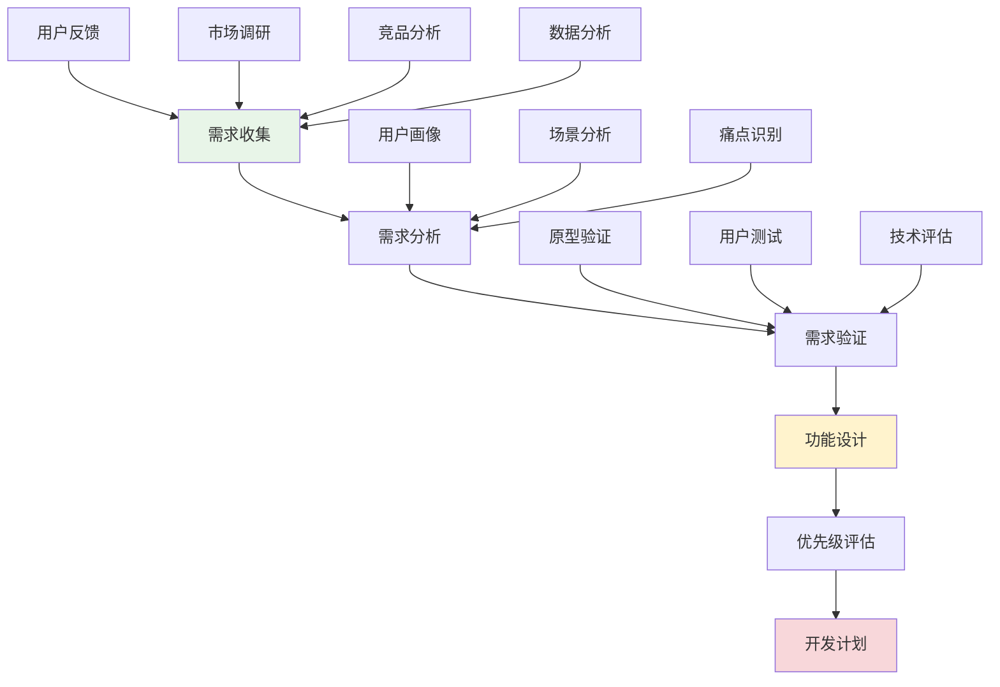

# 需求分析与功能规划

## 🎯 学习目标

通过本节学习，您将能够：
- 掌握系统性的需求分析方法
- 学会制定合理的功能规划策略
- 了解如何平衡用户需求和技术可行性
- 掌握功能优先级评估技巧
- 学会制定可执行的开发计划

## 📖 需求分析概述

在项目进阶阶段，需求分析不再是简单的功能列举，而是要深入理解用户痛点、市场需求和技术趋势，制定既满足用户需求又符合技术发展方向的功能规划。

### 需求分析框架



## 🔍 Chat-Room项目需求分析实战

### 1. 用户反馈收集与分析

```python
"""
用户反馈分析系统
"""

import json
import time
from typing import Dict, List, Optional, Any
from dataclasses import dataclass, field
from enum import Enum
import matplotlib.pyplot as plt
import pandas as pd


class FeedbackType(Enum):
    """反馈类型"""
    BUG_REPORT = "bug_report"
    FEATURE_REQUEST = "feature_request"
    PERFORMANCE_ISSUE = "performance_issue"
    UI_UX_FEEDBACK = "ui_ux_feedback"
    GENERAL_SUGGESTION = "general_suggestion"


class Priority(Enum):
    """优先级"""
    CRITICAL = "critical"
    HIGH = "high"
    MEDIUM = "medium"
    LOW = "low"


@dataclass
class UserFeedback:
    """用户反馈数据模型"""
    id: str
    user_id: str
    feedback_type: FeedbackType
    title: str
    description: str
    priority: Priority
    tags: List[str] = field(default_factory=list)
    votes: int = 0
    status: str = "open"
    created_at: float = field(default_factory=time.time)
    updated_at: float = field(default_factory=time.time)
    
    def to_dict(self) -> Dict[str, Any]:
        """转换为字典"""
        return {
            "id": self.id,
            "user_id": self.user_id,
            "feedback_type": self.feedback_type.value,
            "title": self.title,
            "description": self.description,
            "priority": self.priority.value,
            "tags": self.tags,
            "votes": self.votes,
            "status": self.status,
            "created_at": self.created_at,
            "updated_at": self.updated_at
        }


class FeedbackAnalyzer:
    """反馈分析器"""
    
    def __init__(self):
        self.feedbacks: List[UserFeedback] = []
        self.load_sample_data()
    
    def load_sample_data(self):
        """加载示例数据"""
        sample_feedbacks = [
            UserFeedback(
                id="fb001",
                user_id="user1",
                feedback_type=FeedbackType.FEATURE_REQUEST,
                title="支持语音消息",
                description="希望能够发送语音消息，提高沟通效率",
                priority=Priority.HIGH,
                tags=["语音", "通信", "效率"],
                votes=25
            ),
            UserFeedback(
                id="fb002",
                user_id="user2",
                feedback_type=FeedbackType.PERFORMANCE_ISSUE,
                title="消息发送延迟",
                description="在用户较多时，消息发送有明显延迟",
                priority=Priority.HIGH,
                tags=["性能", "延迟", "并发"],
                votes=18
            ),
            UserFeedback(
                id="fb003",
                user_id="user3",
                feedback_type=FeedbackType.FEATURE_REQUEST,
                title="消息搜索功能",
                description="希望能够搜索历史消息",
                priority=Priority.MEDIUM,
                tags=["搜索", "历史", "查找"],
                votes=15
            ),
            UserFeedback(
                id="fb004",
                user_id="user4",
                feedback_type=FeedbackType.UI_UX_FEEDBACK,
                title="界面美化",
                description="当前界面比较简陋，希望能够美化",
                priority=Priority.LOW,
                tags=["界面", "美化", "体验"],
                votes=12
            ),
            UserFeedback(
                id="fb005",
                user_id="user5",
                feedback_type=FeedbackType.FEATURE_REQUEST,
                title="表情包支持",
                description="希望支持发送表情包",
                priority=Priority.MEDIUM,
                tags=["表情", "娱乐", "交互"],
                votes=20
            ),
            UserFeedback(
                id="fb006",
                user_id="user6",
                feedback_type=FeedbackType.BUG_REPORT,
                title="文件传输失败",
                description="大文件传输经常失败",
                priority=Priority.HIGH,
                tags=["文件", "传输", "错误"],
                votes=8
            )
        ]
        
        self.feedbacks.extend(sample_feedbacks)
    
    def analyze_feedback_distribution(self) -> Dict[str, Any]:
        """分析反馈分布"""
        type_counts = {}
        priority_counts = {}
        
        for feedback in self.feedbacks:
            # 统计类型分布
            type_key = feedback.feedback_type.value
            type_counts[type_key] = type_counts.get(type_key, 0) + 1
            
            # 统计优先级分布
            priority_key = feedback.priority.value
            priority_counts[priority_key] = priority_counts.get(priority_key, 0) + 1
        
        return {
            "type_distribution": type_counts,
            "priority_distribution": priority_counts,
            "total_feedbacks": len(self.feedbacks),
            "average_votes": sum(f.votes for f in self.feedbacks) / len(self.feedbacks)
        }
    
    def identify_top_requests(self, limit: int = 5) -> List[UserFeedback]:
        """识别最受欢迎的需求"""
        # 按投票数排序
        sorted_feedbacks = sorted(
            self.feedbacks, 
            key=lambda x: x.votes, 
            reverse=True
        )
        
        return sorted_feedbacks[:limit]
    
    def extract_feature_themes(self) -> Dict[str, List[str]]:
        """提取功能主题"""
        themes = {}
        
        for feedback in self.feedbacks:
            for tag in feedback.tags:
                if tag not in themes:
                    themes[tag] = []
                themes[tag].append(feedback.title)
        
        # 按相关反馈数量排序
        sorted_themes = dict(sorted(
            themes.items(), 
            key=lambda x: len(x[1]), 
            reverse=True
        ))
        
        return sorted_themes
    
    def generate_insights(self) -> Dict[str, Any]:
        """生成分析洞察"""
        distribution = self.analyze_feedback_distribution()
        top_requests = self.identify_top_requests()
        themes = self.extract_feature_themes()
        
        insights = {
            "key_findings": [
                f"共收到 {distribution['total_feedbacks']} 条反馈",
                f"平均每条反馈获得 {distribution['average_votes']:.1f} 票支持",
                f"功能请求占比最高: {distribution['type_distribution'].get('feature_request', 0)} 条",
                f"高优先级问题: {distribution['priority_distribution'].get('high', 0)} 条"
            ],
            "top_requests": [f.title for f in top_requests],
            "popular_themes": list(themes.keys())[:5],
            "recommendations": self._generate_recommendations(distribution, themes)
        }
        
        return insights
    
    def _generate_recommendations(self, distribution: Dict, themes: Dict) -> List[str]:
        """生成建议"""
        recommendations = []
        
        # 基于反馈类型的建议
        if distribution['type_distribution'].get('performance_issue', 0) > 0:
            recommendations.append("优先解决性能问题，提升用户体验")
        
        if distribution['type_distribution'].get('feature_request', 0) > 2:
            recommendations.append("考虑开发最受欢迎的新功能")
        
        # 基于主题的建议
        if '性能' in themes and len(themes['性能']) > 1:
            recommendations.append("制定系统性的性能优化计划")
        
        if '语音' in themes:
            recommendations.append("语音功能需求强烈，建议优先开发")
        
        return recommendations


# 功能规划系统
class FeaturePlanningSystem:
    """功能规划系统"""
    
    def __init__(self):
        self.features = []
        self.evaluation_criteria = {
            "user_value": 0.3,      # 用户价值权重
            "business_impact": 0.25, # 商业影响权重
            "technical_feasibility": 0.2, # 技术可行性权重
            "development_cost": 0.15,     # 开发成本权重
            "maintenance_cost": 0.1       # 维护成本权重
        }
    
    def add_feature_proposal(self, feature_data: Dict[str, Any]) -> str:
        """添加功能提案"""
        feature = {
            "id": f"feat_{len(self.features) + 1:03d}",
            "name": feature_data["name"],
            "description": feature_data["description"],
            "category": feature_data.get("category", "enhancement"),
            "user_stories": feature_data.get("user_stories", []),
            "acceptance_criteria": feature_data.get("acceptance_criteria", []),
            "technical_requirements": feature_data.get("technical_requirements", []),
            "dependencies": feature_data.get("dependencies", []),
            "estimated_effort": feature_data.get("estimated_effort", "medium"),
            "scores": {},
            "final_score": 0,
            "status": "proposed",
            "created_at": time.time()
        }
        
        self.features.append(feature)
        return feature["id"]
    
    def evaluate_feature(self, feature_id: str, scores: Dict[str, int]) -> bool:
        """评估功能（1-10分）"""
        feature = self._find_feature(feature_id)
        if not feature:
            return False
        
        feature["scores"] = scores
        
        # 计算加权总分
        total_score = 0
        for criterion, weight in self.evaluation_criteria.items():
            score = scores.get(criterion, 5)  # 默认5分
            total_score += score * weight
        
        feature["final_score"] = round(total_score, 2)
        return True
    
    def prioritize_features(self) -> List[Dict[str, Any]]:
        """功能优先级排序"""
        # 按最终得分排序
        sorted_features = sorted(
            self.features,
            key=lambda x: x["final_score"],
            reverse=True
        )
        
        # 添加优先级标签
        for i, feature in enumerate(sorted_features):
            if i < len(sorted_features) * 0.2:
                feature["priority"] = "P0 - 最高优先级"
            elif i < len(sorted_features) * 0.4:
                feature["priority"] = "P1 - 高优先级"
            elif i < len(sorted_features) * 0.7:
                feature["priority"] = "P2 - 中等优先级"
            else:
                feature["priority"] = "P3 - 低优先级"
        
        return sorted_features
    
    def create_development_roadmap(self, quarters: int = 4) -> Dict[str, List[Dict]]:
        """创建开发路线图"""
        prioritized_features = self.prioritize_features()
        
        roadmap = {}
        features_per_quarter = len(prioritized_features) // quarters
        
        for q in range(quarters):
            quarter_name = f"Q{q + 1}"
            start_idx = q * features_per_quarter
            end_idx = start_idx + features_per_quarter
            
            if q == quarters - 1:  # 最后一个季度包含剩余所有功能
                end_idx = len(prioritized_features)
            
            roadmap[quarter_name] = prioritized_features[start_idx:end_idx]
        
        return roadmap
    
    def _find_feature(self, feature_id: str) -> Optional[Dict[str, Any]]:
        """查找功能"""
        for feature in self.features:
            if feature["id"] == feature_id:
                return feature
        return None
    
    def generate_feature_specification(self, feature_id: str) -> Dict[str, Any]:
        """生成功能规格说明"""
        feature = self._find_feature(feature_id)
        if not feature:
            return {}
        
        specification = {
            "feature_overview": {
                "name": feature["name"],
                "description": feature["description"],
                "category": feature["category"],
                "priority": feature.get("priority", "未评估")
            },
            "user_requirements": {
                "user_stories": feature["user_stories"],
                "acceptance_criteria": feature["acceptance_criteria"]
            },
            "technical_specification": {
                "requirements": feature["technical_requirements"],
                "dependencies": feature["dependencies"],
                "estimated_effort": feature["estimated_effort"]
            },
            "evaluation_results": {
                "scores": feature["scores"],
                "final_score": feature["final_score"]
            }
        }
        
        return specification


# 实战演示
def demonstrate_feature_planning():
    """演示功能规划过程"""
    print("=== Chat-Room功能规划实战演示 ===")
    
    # 1. 分析用户反馈
    analyzer = FeedbackAnalyzer()
    insights = analyzer.generate_insights()
    
    print("用户反馈分析结果:")
    for finding in insights["key_findings"]:
        print(f"  • {finding}")
    
    print(f"\n最受欢迎的需求: {insights['top_requests']}")
    print(f"热门主题: {insights['popular_themes']}")
    
    # 2. 创建功能规划
    planner = FeaturePlanningSystem()
    
    # 添加功能提案
    voice_message_id = planner.add_feature_proposal({
        "name": "语音消息功能",
        "description": "支持录制和发送语音消息",
        "category": "communication",
        "user_stories": [
            "作为用户，我希望能够录制语音消息",
            "作为用户，我希望能够播放接收到的语音消息",
            "作为用户，我希望能够看到语音消息的时长"
        ],
        "acceptance_criteria": [
            "支持录制最长60秒的语音",
            "支持常见音频格式",
            "提供播放控制界面"
        ],
        "technical_requirements": [
            "音频录制API集成",
            "音频文件存储",
            "音频播放组件"
        ],
        "estimated_effort": "high"
    })
    
    message_search_id = planner.add_feature_proposal({
        "name": "消息搜索功能",
        "description": "支持搜索历史消息内容",
        "category": "utility",
        "user_stories": [
            "作为用户，我希望能够搜索历史消息",
            "作为用户，我希望能够按时间范围筛选",
            "作为用户，我希望能够按发送者筛选"
        ],
        "acceptance_criteria": [
            "支持全文搜索",
            "支持高级筛选",
            "搜索结果高亮显示"
        ],
        "technical_requirements": [
            "全文搜索引擎",
            "索引构建",
            "搜索结果排序"
        ],
        "estimated_effort": "medium"
    })
    
    # 3. 功能评估
    planner.evaluate_feature(voice_message_id, {
        "user_value": 9,
        "business_impact": 7,
        "technical_feasibility": 6,
        "development_cost": 4,
        "maintenance_cost": 6
    })
    
    planner.evaluate_feature(message_search_id, {
        "user_value": 8,
        "business_impact": 6,
        "technical_feasibility": 8,
        "development_cost": 7,
        "maintenance_cost": 8
    })
    
    # 4. 生成开发路线图
    roadmap = planner.create_development_roadmap(2)
    
    print("\n开发路线图:")
    for quarter, features in roadmap.items():
        print(f"\n{quarter}:")
        for feature in features:
            print(f"  • {feature['name']} (得分: {feature['final_score']})")
    
    # 5. 生成功能规格
    spec = planner.generate_feature_specification(voice_message_id)
    print(f"\n语音消息功能规格:")
    print(f"  优先级: {spec['feature_overview']['priority']}")
    print(f"  最终得分: {spec['evaluation_results']['final_score']}")


if __name__ == "__main__":
    demonstrate_feature_planning()
```

## 📊 需求优先级评估模型

### RICE评估框架

```python
"""
RICE评估框架实现
Reach (影响范围) × Impact (影响程度) × Confidence (信心度) / Effort (工作量)
"""

class RICEEvaluator:
    """RICE评估器"""
    
    def __init__(self):
        self.features = []
    
    def evaluate_feature(self, feature_name: str, reach: int, impact: int, 
                        confidence: float, effort: int) -> float:
        """
        RICE评估
        
        Args:
            feature_name: 功能名称
            reach: 影响用户数量（每月）
            impact: 影响程度（1-3分）
            confidence: 信心度（0-1）
            effort: 工作量（人月）
        
        Returns:
            RICE得分
        """
        rice_score = (reach * impact * confidence) / effort
        
        self.features.append({
            "name": feature_name,
            "reach": reach,
            "impact": impact,
            "confidence": confidence,
            "effort": effort,
            "rice_score": rice_score
        })
        
        return rice_score
    
    def get_prioritized_features(self) -> List[Dict[str, Any]]:
        """获取按RICE得分排序的功能列表"""
        return sorted(self.features, key=lambda x: x["rice_score"], reverse=True)


# 使用示例
rice_evaluator = RICEEvaluator()

# 评估语音消息功能
rice_evaluator.evaluate_feature(
    "语音消息", 
    reach=500,      # 每月500个用户会使用
    impact=3,       # 高影响（3分）
    confidence=0.8, # 80%信心度
    effort=3        # 3人月工作量
)

# 评估消息搜索功能
rice_evaluator.evaluate_feature(
    "消息搜索",
    reach=300,      # 每月300个用户会使用
    impact=2,       # 中等影响（2分）
    confidence=0.9, # 90%信心度
    effort=2        # 2人月工作量
)

prioritized = rice_evaluator.get_prioritized_features()
print("RICE评估结果:")
for feature in prioritized:
    print(f"{feature['name']}: {feature['rice_score']:.2f}")
```

## 🗓️ 开发计划制定

### 敏捷开发计划

```python
"""
敏捷开发计划制定
"""

from datetime import datetime, timedelta
from typing import List, Dict, Any


class SprintPlanner:
    """Sprint规划器"""
    
    def __init__(self, sprint_duration_weeks: int = 2):
        self.sprint_duration = sprint_duration_weeks
        self.sprints = []
        self.team_capacity = 40  # 团队每Sprint的故事点容量
    
    def create_sprint_plan(self, features: List[Dict[str, Any]], 
                          start_date: datetime) -> List[Dict[str, Any]]:
        """创建Sprint计划"""
        
        current_date = start_date
        current_sprint = 1
        current_capacity = 0
        current_features = []
        
        for feature in features:
            story_points = self._estimate_story_points(feature)
            
            # 检查当前Sprint是否还有容量
            if current_capacity + story_points > self.team_capacity:
                # 创建当前Sprint
                self.sprints.append({
                    "sprint_number": current_sprint,
                    "start_date": current_date,
                    "end_date": current_date + timedelta(weeks=self.sprint_duration),
                    "features": current_features.copy(),
                    "total_story_points": current_capacity
                })
                
                # 开始新Sprint
                current_sprint += 1
                current_date += timedelta(weeks=self.sprint_duration)
                current_capacity = story_points
                current_features = [feature]
            else:
                current_capacity += story_points
                current_features.append(feature)
        
        # 添加最后一个Sprint
        if current_features:
            self.sprints.append({
                "sprint_number": current_sprint,
                "start_date": current_date,
                "end_date": current_date + timedelta(weeks=self.sprint_duration),
                "features": current_features,
                "total_story_points": current_capacity
            })
        
        return self.sprints
    
    def _estimate_story_points(self, feature: Dict[str, Any]) -> int:
        """估算故事点"""
        effort_mapping = {
            "low": 3,
            "medium": 8,
            "high": 13,
            "very_high": 21
        }
        
        effort = feature.get("estimated_effort", "medium")
        return effort_mapping.get(effort, 8)
    
    def generate_sprint_report(self) -> str:
        """生成Sprint报告"""
        report = "=== Sprint计划报告 ===\n\n"
        
        for sprint in self.sprints:
            report += f"Sprint {sprint['sprint_number']}\n"
            report += f"时间: {sprint['start_date'].strftime('%Y-%m-%d')} - {sprint['end_date'].strftime('%Y-%m-%d')}\n"
            report += f"故事点: {sprint['total_story_points']}\n"
            report += "功能列表:\n"
            
            for feature in sprint['features']:
                report += f"  • {feature['name']}\n"
            
            report += "\n"
        
        return report


# 风险评估
class RiskAssessment:
    """风险评估"""
    
    def __init__(self):
        self.risks = []
    
    def add_risk(self, description: str, probability: float, 
                impact: int, mitigation: str):
        """添加风险"""
        risk_score = probability * impact
        
        self.risks.append({
            "description": description,
            "probability": probability,  # 0-1
            "impact": impact,           # 1-5
            "risk_score": risk_score,
            "mitigation": mitigation
        })
    
    def get_high_risks(self, threshold: float = 3.0) -> List[Dict[str, Any]]:
        """获取高风险项"""
        return [risk for risk in self.risks if risk["risk_score"] >= threshold]
    
    def generate_risk_report(self) -> str:
        """生成风险报告"""
        high_risks = self.get_high_risks()
        
        report = "=== 风险评估报告 ===\n\n"
        report += f"总风险数: {len(self.risks)}\n"
        report += f"高风险数: {len(high_risks)}\n\n"
        
        if high_risks:
            report += "高风险项:\n"
            for risk in high_risks:
                report += f"• {risk['description']} (风险值: {risk['risk_score']:.1f})\n"
                report += f"  缓解措施: {risk['mitigation']}\n\n"
        
        return report


# 实战演示
def demonstrate_development_planning():
    """演示开发计划制定"""
    print("=== 开发计划制定演示 ===")
    
    # 1. 创建Sprint计划
    planner = SprintPlanner(sprint_duration_weeks=2)
    
    features = [
        {"name": "语音消息功能", "estimated_effort": "high"},
        {"name": "消息搜索功能", "estimated_effort": "medium"},
        {"name": "表情包支持", "estimated_effort": "medium"},
        {"name": "界面美化", "estimated_effort": "low"},
        {"name": "性能优化", "estimated_effort": "high"}
    ]
    
    start_date = datetime(2024, 1, 15)
    sprints = planner.create_sprint_plan(features, start_date)
    
    print(planner.generate_sprint_report())
    
    # 2. 风险评估
    risk_assessment = RiskAssessment()
    
    risk_assessment.add_risk(
        "语音功能技术复杂度高",
        probability=0.7,
        impact=4,
        mitigation="提前进行技术调研和原型验证"
    )
    
    risk_assessment.add_risk(
        "性能优化可能影响稳定性",
        probability=0.5,
        impact=3,
        mitigation="充分的测试和灰度发布"
    )
    
    print(risk_assessment.generate_risk_report())


if __name__ == "__main__":
    demonstrate_development_planning()
```

## 📋 学习检查清单

完成本节学习后，请确认您能够：

- [ ] **需求收集**：系统性地收集和整理用户需求
- [ ] **需求分析**：深入分析用户痛点和真实需求
- [ ] **功能设计**：将需求转化为具体的功能设计
- [ ] **优先级评估**：使用科学方法评估功能优先级
- [ ] **开发计划**：制定可执行的开发计划和时间安排
- [ ] **风险管理**：识别和评估项目风险
- [ ] **迭代规划**：制定敏捷开发的迭代计划

## 🚀 下一步

完成需求分析与功能规划后，请继续学习：
- [模块化扩展设计](modular-extension-design.md) - 设计可扩展的架构
- [API设计与版本管理](api-design-versioning.md) - 设计稳定的接口

---

**科学的需求分析是成功产品的基础！** 📊
